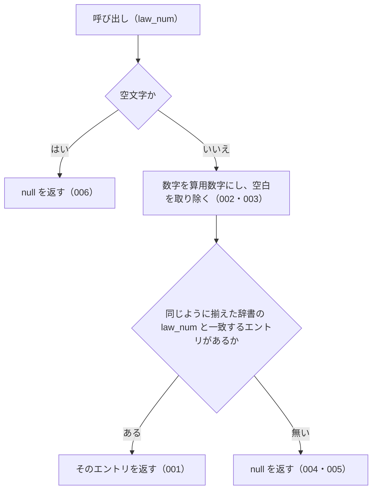

# lookupByLawNum の仕様

<!-- GENERATED FILE — 手で編集しない。本文は houki-abbreviations の specs/current/lookup_by_law_num/spec.md の写し。 -->

::: info
houki-abbreviations **v0.7.0** の `specs/current/lookup_by_law_num/spec.md` から自動生成しました（仕様 ID 9 件・2026-10-10）。手で編集しないでください。再生成は `node scripts/generate-reference.mjs specs` です。
:::

法令番号から辞書のエントリを 1 件引く

使いどころ・引数・実測の呼び出し例は、[関数のページ](/reference/lib/houki-abbreviations/lookup_by_law_num)にあります。

最後に仕様が変わったのは v0.6.1 の「テストが無いだけの振る舞いに仕様 ID を振る」（2026-09-27 承認）です。それまでの経緯は[承認の履歴](#承認の履歴)にあります。

## 使う人と受け取るもの

この機能を誰が呼び、何を渡して何を受け取るかを示します。

- houki-abbreviations を import する利用者（houki-egov-mcp・houki-nta-mcp などの MCP サーバー、またはアプリケーション）。条文や通達に書かれた法令番号（`昭和六十三年法律第百八号` など）を渡して、その法令の略称・正式名称などを持つ辞書のエントリを受け取る

## 入力

呼び出すときに渡す値です。

| 引数      | 必須 | 内容                                                                                                                                                                                                  |
| --------- | ---- | ----------------------------------------------------------------------------------------------------------------------------------------------------------------------------------------------------- |
| `law_num` | 必須 | 法令番号。漢数字（`昭和六十三年法律第百八号`）・算用数字（`昭和63年法律第108号`）・全角数字（`昭和６３年法律第１０８号`）・位ごとの漢数字（`昭和六三年法律第一〇八号`）のどれでもよい。空白は無視する |

## 戻り値

呼び出しが返す値です。

`AbbreviationEntry | null`。見つかったときは辞書のエントリそのもので、凍結されている（[SPEC-ABBR-ABBREVIATION-ENTRIES-019](/specs/houki-abbreviations/abbreviation_entries#spec-abbr-abbreviation-entries-019)）。

- 見つかったとき: 辞書のエントリ（`abbr` / `formal` / `law_id` / `law_num` / `law_type` / `domain` / `category` / `source_mcp_hint` / `aliases` / `note`。`law_num` 以降は辞書にあるときだけ付く）。`law_num` は辞書に登録された漢数字の形のまま
- 見つからないとき、`law_num` が空文字のとき: `null`

v0.6.0 の辞書 174 件のうち、`law_num` を持つエントリは 9 件（`所法` / `法法` / `消法` / `労基法` / `育介法` / `会社` / `商` / `民` / `憲`）。この関数で引けるのはこの 9 件だけ。

## できないこと

この機能が引き受けないことです。

- 元号の別表記（`S63` / `昭63`）を吸収すること（`lookupByLawNum('S63年法律第108号')` は `null`）
- `第` や `号` の省略を吸収すること（[SPEC-ABBR-LOOKUP-BY-LAW-NUM-004](#spec-abbr-lookup-by-law-num-004)）
- 法令の種別名（`法律` / `政令`）を補うこと
- `law_num` を持たないエントリ（v0.6.0 の辞書で 174 件中 165 件）を引くこと
- e-Gov の法令 ID から引くこと（`lookupByLawId`）
- 略称・正式名称・別名から引くこと（`resolveAbbreviation`）
- 法令番号の表記を揃えた文字列そのものを返すこと（`normalizeLawNum`）
- 1 回の呼び出しで複数の法令番号を引くこと

## 処理の流れ

図の中の番号は「できること」の仕様 ID の末尾 3 桁です。

## 仕様 ID ごとの約束

この機能が守る約束を、仕様 ID ごとに並べています。見出しは約束を 1 文で表したもので、条件・応答の細部・例は「詳細」を開くと読めます。仕様 ID はそれぞれ受入テストと対応していて、テストの無い ID があると各リポジトリの CI が止まります。

### SPEC-ABBR-LOOKUP-BY-LAW-NUM-001 漢数字の法令番号でエントリを返す

::: details 詳細
`law_num` が辞書のエントリの `law_num` と同じ法令番号のとき、そのエントリを返す。辞書と同じ漢数字の形で渡せば引ける。

例: `lookupByLawNum('昭和六十三年法律第百八号')?.formal` は `'消費税法'`。
:::

### SPEC-ABBR-LOOKUP-BY-LAW-NUM-002 算用数字・全角数字・位ごとの漢数字でも同じエントリを返す

::: details 詳細
数字の書き方が違っても、同じ法令番号なら同じエントリ（同じオブジェクト）を返す。対応する書き方は、位取りの漢数字（`百八`）、位ごとの漢数字（`一〇八`）、算用数字（`108`）、全角数字（`１０８`）。

例: `昭和六十三年法律第百八号` / `昭和63年法律第108号` / `昭和６３年法律第１０８号` / `昭和六三年法律第一〇八号` はどれも `消費税法` のエントリを返す。`lookupByLawNum('昭和21年憲法')?.formal` は `'日本国憲法'`（辞書の `law_num` は `昭和二十一年憲法`）。
:::

### SPEC-ABBR-LOOKUP-BY-LAW-NUM-003 空白を無視する

::: details 詳細
`law_num` の前後と途中の空白を取り除いてから照合する。

例: `lookupByLawNum(' 昭和63年 法律 第108号 ')?.formal` は `'消費税法'`。
:::

### SPEC-ABBR-LOOKUP-BY-LAW-NUM-004 第・号を省いた形や元号の違う形には null を返す

::: details 詳細
数字の書き方以外の違いは吸収しない。`第` や `号` を省いた形、元号が違う形は、一致するエントリが無いものとして `null` を返す。

例: `lookupByLawNum('昭和63年法律108号')` と `lookupByLawNum('平成63年法律第108号')` はどちらも `null`。
:::

### SPEC-ABBR-LOOKUP-BY-LAW-NUM-005 一致するエントリが無ければ null を返す

::: details 詳細
どのエントリの `law_num` とも一致しないときは `null` を返す。例外は投げない。

例: `lookupByLawNum('令和九十九年法律第千号')` は `null`。
:::

### SPEC-ABBR-LOOKUP-BY-LAW-NUM-006 空文字の law_num には null を返す

::: details 詳細
`law_num` が空文字のときは、辞書を照合せずに `null` を返す。

例: `lookupByLawNum('')` は `null`。
:::

### SPEC-ABBR-LOOKUP-BY-LAW-NUM-007 空白だけの law_num には null を返す

::: details 詳細
`law_num` が空白（半角スペース・タブなど）だけのときは `null` を返す。

例: `lookupByLawNum('   ')` も `lookupByLawNum('\t')` も `null`。
:::

### SPEC-ABBR-LOOKUP-BY-LAW-NUM-008 数字の先頭の 0 を無視する

::: details 詳細
年や番号の算用数字の先頭に 0 が付いていても、付いていないものと同じ法令番号として照合する。

例: `lookupByLawNum('昭和063年法律第0108号')?.formal` は `'消費税法'`、`lookupByLawNum('昭和63年法律第00108号')?.formal` は `'消費税法'`。
:::

### SPEC-ABBR-LOOKUP-BY-LAW-NUM-009 元年と 1 年を同じ年として照合する

::: details 詳細
`law_num` の `元年` と `1年`（`一年`）は同じ年として照合する。入力が `元年` でも辞書の `law_num` が `元年` でもよい。v0.6.0 の辞書には `元年` の `law_num` を持つエントリが無いので、辞書を差し替えて確かめる。

例: `law_num` が `令和元年法律第一号` のエントリ 1 件だけの辞書で、`令和1年法律第1号`・`令和元年法律第一号`・`令和元年法律第01号` はどれもそのエントリを返す（`src/lookup.ts` の `lookupByLawNum(entries, law_num)` で確かめた）。
:::

## まだ決めていないこと

仕様を書き起こしたときに見つかった項目のうち、扱いを決めている途中のものです。開くと、元の仕様書の記述をそのまま読めます。

::: details 仕様書の「未決」の節
初版起こしで見つけた、意図か不具合かを人が決める項目です。決まったら「できること」に ID を振るか、`specs/changes/` の差分にします。

意図か不具合かの判断が要る項目は houki-abbreviations の Issue に移し、ここには題と Issue の番号だけを残します。今の振る舞いのままでよくテストが無いだけの項目は、受入テストを書いてから「できること」に ID を振ります。テストの名前と中身が合っていない項目は、テストを直します（ID を振っていないものは、直してから振ります）。

1. **テスト「Issue #6 の完了条件」が `null` 同士で通っている。** → [SPEC-ABBR-LOOKUP-BY-LAW-NUM-002](#spec-abbr-lookup-by-law-num-002)（テストを直した。v0.6.1）
2. **テスト「law_num 未設定エントリは引けない」の中身が名前と合っていない。** （テストを直した。v0.6.1）
3. **空白だけの `law_num`。** → [SPEC-ABBR-LOOKUP-BY-LAW-NUM-007](#spec-abbr-lookup-by-law-num-007)
4. **`元年` と数字の先頭の 0。** → [SPEC-ABBR-LOOKUP-BY-LAW-NUM-008](#spec-abbr-lookup-by-law-num-008)、[SPEC-ABBR-LOOKUP-BY-LAW-NUM-009](#spec-abbr-lookup-by-law-num-009)
5. **返すエントリは辞書のオブジェクトそのもの。** → [SPEC-ABBR-ABBREVIATION-ENTRIES-019](/specs/houki-abbreviations/abbreviation_entries#spec-abbr-abbreviation-entries-019)
:::

## 承認の履歴

この機能の仕様が、いつ、どの変更で承認されたかを新しい順に並べています。各リポジトリの `npx spec-ids history lookup_by_law_num` と同じ内容です。変更の名前から、変更の理由と前後の振る舞いを書いた文書（GitHub）を開けます。

::: details 承認の履歴（3 件）
| 承認日 | 版 | 変更 | 仕様 PR |
|---|---|---|---|
| 2026-09-27 | v0.6.1 | [テストが無いだけの振る舞いに仕様 ID を振る](https://github.com/shuji-bonji/houki-abbreviations/blob/v0.7.0/specs/releases/v0.6.1/20260927-untested-behaviors/proposal.md) | [#27](https://github.com/shuji-bonji/houki-abbreviations/pull/27) |
| 2026-09-27 | v0.6.1 | [「未決」のうち判断が要る 52 件を Issue に移す](https://github.com/shuji-bonji/houki-abbreviations/blob/v0.7.0/specs/releases/v0.6.1/20260927-undecided-to-issues/proposal.md) | [#26](https://github.com/shuji-bonji/houki-abbreviations/pull/26) |
| 2026-09-27 | — | 初版 | [#10](https://github.com/shuji-bonji/houki-abbreviations/pull/10) |
:::

## 関連ページ

このページの元になった文書と、あわせて読むページです。

- [houki-abbreviations の仕様の一覧](/specs/houki-abbreviations/)
- [houki-abbreviations の解説](/lib/houki-abbreviations)
- [lookupByLawNum の関数のページ（リファレンス）](/reference/lib/houki-abbreviations/lookup_by_law_num)
- [元の仕様書（GitHub、v0.7.0）](https://github.com/shuji-bonji/houki-abbreviations/blob/v0.7.0/specs/current/lookup_by_law_num/spec.md)
