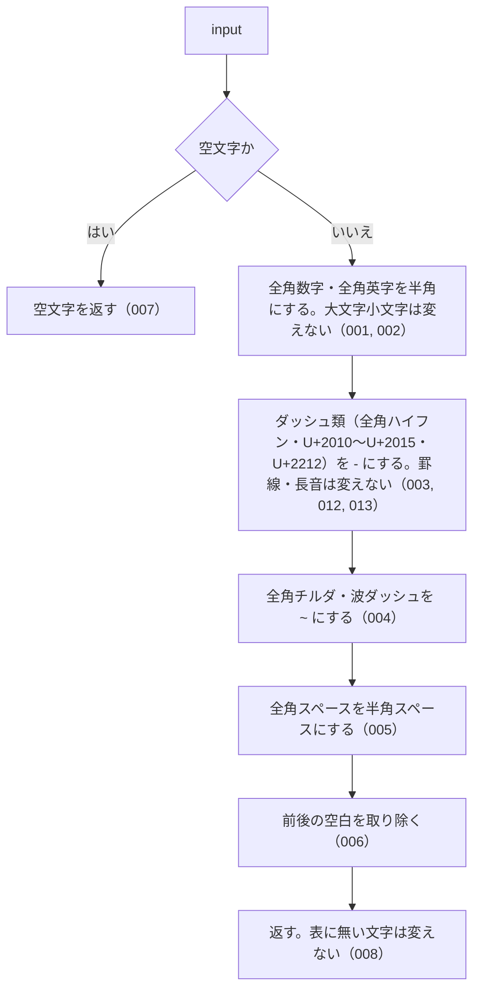

# normalizeJpText の仕様

<!-- GENERATED FILE — 手で編集しない。本文は houki-abbreviations の specs/current/normalize_jp_text/spec.md の写し。 -->

::: info
houki-abbreviations **v0.7.0** の `specs/current/normalize_jp_text/spec.md` から自動生成しました（仕様 ID 13 件・2026-10-09）。手で編集しないでください。再生成は `node scripts/generate-reference.mjs specs` です。
:::

このページは、houki-abbreviations の関数「normalizeJpText（全角の数字・英字・一部の記号を半角に揃える）」の仕様です。「承認の履歴」の前までは、仕様書の本文を言い換えずに写しています。
引数の型と既定値の一覧と、実測の呼び出し例は[リファレンス](/reference/lib/houki-abbreviations#normalizejptext)にあります。

最後に仕様が変わったのは v0.7.0 の「関数ごとの全角・ダッシュ類・大文字の扱いを揃える（T3 正規化）」（2026-09-30 承認）です。それまでの経緯は[承認の履歴](#承認の履歴)にあります。

## 使う人と受け取るもの

この機能を誰が呼び、何を渡して何を受け取るかを示します。

- このパッケージを import するコード（houki-hub family の MCP サーバーなど）。法令・通達の本文や利用者の入力を渡して、全角と半角の書き分けを揃えた文字列を受け取る。DB に入れる文字列と検索に使う文字列の両方に同じ関数を通して照合する
- このパッケージの中では、`resolveAbbreviation(name, { normalize: true })` と `searchByName` / `findSimilar` の `normalize` がこの関数を使う

## 入力

呼び出すときに渡す値です。

| 引数    | 必須 | 内容                                               |
| ------- | ---- | -------------------------------------------------- |
| `input` | 必須 | 揃える文字列。法令名・条番号・検索語など何でもよい |

## 戻り値

呼び出しが返す値です。

`string`。次の表の変換をしたうえで、前後の空白を取り除いた文字列。

| 変換前                                                                                                                                                                                                 | 変換後                 |
| ------------------------------------------------------------------------------------------------------------------------------------------------------------------------------------------------------ | ---------------------- |
| 全角数字 `０`〜`９`（U+FF10〜U+FF19）                                                                                                                                                                  | 半角数字 `0`〜`9`      |
| 全角英大文字 `Ａ`〜`Ｚ`（U+FF21〜U+FF3A）                                                                                                                                                              | 半角英大文字 `A`〜`Z`  |
| 全角英小文字 `ａ`〜`ｚ`（U+FF41〜U+FF5A）                                                                                                                                                              | 半角英小文字 `a`〜`z`  |
| ダッシュ類: 全角ハイフン `－`（U+FF0D）、`‐`（U+2010 HYPHEN）、`‑`（U+2011 NON-BREAKING HYPHEN）、`–`（U+2013 EN DASH）、`—`（U+2014 EM DASH）、`―`（U+2015 HORIZONTAL BAR）、`−`（U+2212 MINUS SIGN） | `-`（U+002D）          |
| 全角チルダ `～`（U+FF5E FULLWIDTH TILDE）                                                                                                                                                              | `~`（U+007E）          |
| 波ダッシュ `〜`（U+301C WAVE DASH）                                                                                                                                                                    | `~`（U+007E）          |
| 全角スペース `　`（U+3000）                                                                                                                                                                            | 半角スペース（U+0020） |

ダッシュ類の範囲は `normalizeLawNum` と同じ。表に無い文字は変えない。変えない文字の例: 漢字、ひらがな、カタカナ、半角カナ（`ｱ`）、中黒 `・`、漢数字、`共` `の` `条` `項` などの条番号の語、表以外の全角記号（`／` `（` `）` `＃` など）、罫線 `─`（U+2500）、長音 `ー`（U+30FC）。

どの変換も 1 文字を 1 文字に置き換える。文字数が変わるのは前後の空白を取り除くときだけ。

## できないこと

この機能が引き受けないことです。

- 英大文字を小文字にすること、続いた空白を 1 つにまとめること（`normalizeSearchQuery`）
- 漢数字を算用数字にすること（法令番号なら `normalizeLawNum`、漢数字だけの文字列なら `kanjiToNumber`）
- 半角カナを全角カナにすること
- 表に無い全角記号（`／` `（` `）` など）を半角にすること（未決 2）

## 処理の流れ

図の中の番号は「できること」の仕様 ID の末尾 3 桁です。

## 仕様 ID ごとの約束

この機能が守る約束を、仕様 ID ごとに並べています。見出しは約束を 1 文で表したもので、条件・応答の細部・例は「詳細」を開くと読めます。仕様 ID はそれぞれ受入テストと対応していて、テストの無い ID があると各リポジトリの CI が止まります。

### SPEC-ABBR-NORMALIZE-JP-TEXT-001 全角数字を半角数字にする

::: details 詳細
`０`〜`９` を `0`〜`9` にする。

例: `normalizeJpText('１８３')` は `'183'`。`normalizeJpText('０１２３４５６７８９')` は `'0123456789'`。
:::

### SPEC-ABBR-NORMALIZE-JP-TEXT-002 全角英字を半角英字にし、大文字小文字は変えない

::: details 詳細
`Ａ`〜`Ｚ` を `A`〜`Z` に、`ａ`〜`ｚ` を `a`〜`z` にする。大文字を小文字にすることはしない（小文字にするのは `normalizeSearchQuery`）。

例: `normalizeJpText('ＰＬ法')` は `'PL法'`、`normalizeJpText('ｐｌ法')` は `'pl法'`。
:::

### SPEC-ABBR-NORMALIZE-JP-TEXT-003 全角ハイフンを半角ハイフンにする

::: details 詳細
`－`（U+FF0D）を `-` にする。

例: `normalizeJpText('１８３－２')` は `'183-2'`、`normalizeJpText('第２－３条')` は `'第2-3条'`。
:::

### SPEC-ABBR-NORMALIZE-JP-TEXT-004 全角チルダと波ダッシュを半角チルダにする

::: details 詳細
`～`（U+FF5E）と `〜`（U+301C）のどちらも `~` にする。

例: `normalizeJpText('１８３～１９３')` も `normalizeJpText('１８３〜１９３')` も `'183~193'`。
:::

### SPEC-ABBR-NORMALIZE-JP-TEXT-005 全角スペースを半角スペースにする

::: details 詳細
`　`（U+3000）を 1 文字ずつ半角スペース 1 つにする。続いた空白を 1 つにまとめることはしない。

例: `normalizeJpText('消　法')` は `'消 法'`。
:::

### SPEC-ABBR-NORMALIZE-JP-TEXT-006 前後の空白を取り除く

::: details 詳細
変換のあと、先頭と末尾の空白を取り除く。途中の空白は残す。

例: `normalizeJpText('  消法  ')` は `'消法'`。`normalizeJpText('  ＰＬ法１８３－２ 消　法  ')` は `'PL法183-2 消 法'`。
:::

### SPEC-ABBR-NORMALIZE-JP-TEXT-007 空文字には空文字を返す

::: details 詳細
`input` が空文字のときは `''` を返す。
:::

### SPEC-ABBR-NORMALIZE-JP-TEXT-008 表に無い文字は変えない

::: details 詳細
漢字・ひらがな・カタカナ・半角カナ・中黒 `・`・条番号の語（`共` `の` `条` `項` `号`）は変えない。

例: `normalizeJpText('１の３・１の４共-1')` は `'1の3・1の4共-1'`。`normalizeJpText('ｱｲｳｴｵ')` は `'ｱｲｳｴｵ'`。`normalizeJpText('第１条第２項第３号')` は `'第1条第2項第3号'`。
:::

### SPEC-ABBR-NORMALIZE-JP-TEXT-009 null と undefined には空文字を返す

::: details 詳細
`input` が `null` または `undefined` のときは `''` を返す。

例: `normalizeJpText(null)` も `normalizeJpText(undefined)` も `''`。
:::

### SPEC-ABBR-NORMALIZE-JP-TEXT-010 表に無い全角記号は変えない

::: details 詳細
戻り値の表に無い全角記号（`／` `（` `）` `＃` `＿` `！` など）は半角にしない。

例: `normalizeJpText('／（）＃＿！')` は `'／（）＃＿！'`。
:::

### SPEC-ABBR-NORMALIZE-JP-TEXT-011 前後のタブ・改行・ノーブレークスペースも取り除く

::: details 詳細
前後の空白として取り除くのは、半角スペース・全角スペースのほか、タブ・改行（`\n` `\r`）・ノーブレークスペース（U+00A0）も含む。途中にあるタブは残す。

例: `normalizeJpText('\t消法\n')` は `'消法'`、`normalizeJpText('\r\n消法\r\n')` は `'消法'`、`normalizeJpText(' 消法 ')` は `'消法'`、`normalizeJpText('消\t法')` は `'消\t法'`。
:::

### SPEC-ABBR-NORMALIZE-JP-TEXT-012 全角ハイフン以外のダッシュ類も半角ハイフンにする

::: details 詳細
`‐`（U+2010）、`‑`（U+2011）、`–`（U+2013）、`—`（U+2014）、`―`（U+2015）、`−`（U+2212）を、`－`（U+FF0D）と同じく `-`（U+002D）にする。`normalizeLawNum` が `-` にする範囲と同じ。

例: `normalizeJpText('１８３―２')` は `'183-2'`。`normalizeJpText('１８３‐２')`、`normalizeJpText('１８３‑２')`、`normalizeJpText('１８３–２')`、`normalizeJpText('１８３—２')`、`normalizeJpText('１８３−２')` もどれも `'183-2'`。v0.6.1 では `normalizeJpText('１８３―２')` は `'183―2'` だった。
:::

### SPEC-ABBR-NORMALIZE-JP-TEXT-013 罫線と長音は半角ハイフンにしない

::: details 詳細
罫線 `─`（U+2500）と長音 `ー`（U+30FC）はダッシュ類として扱わず、変えない。`normalizeLawNum`（[SPEC-ABBR-NORMALIZE-LAW-NUM-013](/specs/houki-abbreviations/normalize_law_num#spec-abbr-normalize-law-num-013)）と同じ。

例: `normalizeJpText('１８３─２')` は `'183─2'`、`normalizeJpText('データ')` は `'データ'`。
:::

## まだ決めていないこと

仕様を書き起こしたときに見つかった項目のうち、扱いを決めている途中のものです。開くと、元の仕様書の記述をそのまま読めます。

::: details 仕様書の「未決」の節
初版起こしで見つけた、意図か不具合かを人が決める項目です。決まったら「できること」に ID を振るか、`specs/changes/` の差分にします。

意図か不具合かの判断が要る項目は houki-abbreviations の Issue に移し、ここには題と Issue の番号だけを残します。今の振る舞いのままでよくテストが無いだけの項目は、受入テストを書いてから「できること」に ID を振ります。

1. **`null` / `undefined` を渡したとき。** → [SPEC-ABBR-NORMALIZE-JP-TEXT-009](#spec-abbr-normalize-jp-text-009)
2. **表以外の全角記号を変えない。** → [SPEC-ABBR-NORMALIZE-JP-TEXT-010](#spec-abbr-normalize-jp-text-010)
3. **全角ハイフン以外のダッシュ類を変えない。** → [SPEC-ABBR-NORMALIZE-JP-TEXT-012](#spec-abbr-normalize-jp-text-012)
4. **取り除く「前後の空白」の範囲。** → [SPEC-ABBR-NORMALIZE-JP-TEXT-011](#spec-abbr-normalize-jp-text-011)
:::

## 承認の履歴

この機能の仕様が、いつ、どの変更で承認されたかを新しい順に並べています。各リポジトリの `npx spec-ids history normalize_jp_text` と同じ内容です。変更の名前から、変更の理由と前後の振る舞いを書いた文書（GitHub）を開けます。

::: details 承認の履歴（4 件）
| 承認日 | 版 | 変更 | 仕様 PR |
|---|---|---|---|
| 2026-09-30 | v0.7.0 | [関数ごとの全角・ダッシュ類・大文字の扱いを揃える（T3 正規化）](https://github.com/shuji-bonji/houki-abbreviations/blob/v0.7.0/specs/releases/v0.7.0/20261001-normalize/proposal.md) | [#30](https://github.com/shuji-bonji/houki-abbreviations/pull/30) |
| 2026-09-27 | v0.6.1 | [テストが無いだけの振る舞いに仕様 ID を振る](https://github.com/shuji-bonji/houki-abbreviations/blob/v0.7.0/specs/releases/v0.6.1/20260927-untested-behaviors/proposal.md) | [#27](https://github.com/shuji-bonji/houki-abbreviations/pull/27) |
| 2026-09-27 | v0.6.1 | [「未決」のうち判断が要る 52 件を Issue に移す](https://github.com/shuji-bonji/houki-abbreviations/blob/v0.7.0/specs/releases/v0.6.1/20260927-undecided-to-issues/proposal.md) | [#26](https://github.com/shuji-bonji/houki-abbreviations/pull/26) |
| 2026-09-27 | — | 初版 | [#10](https://github.com/shuji-bonji/houki-abbreviations/pull/10) |
:::

## 関連ページ

このページの元になった文書と、あわせて読むページです。

- [houki-abbreviations の仕様の一覧](/specs/houki-abbreviations/)
- [houki-abbreviations の解説](/lib/houki-abbreviations)
- [リファレンスの normalizeJpText](/reference/lib/houki-abbreviations#normalizejptext)
- [元の仕様書（GitHub、v0.7.0）](https://github.com/shuji-bonji/houki-abbreviations/blob/v0.7.0/specs/current/normalize_jp_text/spec.md)
