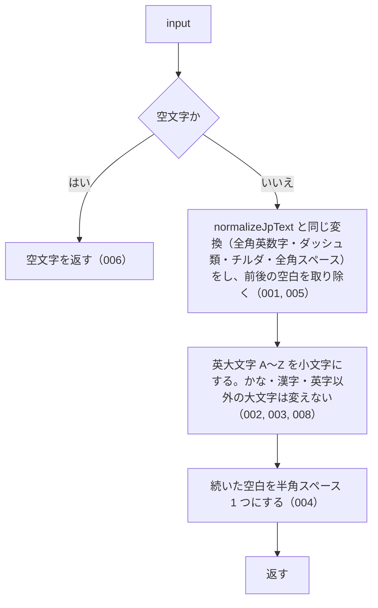

# normalizeSearchQuery の仕様

<!-- GENERATED FILE — 手で編集しない。本文は houki-abbreviations の specs/current/normalize_search_query/spec.md の写し。 -->

::: info
houki-abbreviations **v0.7.1** の `specs/current/normalize_search_query/spec.md` から自動生成しました（仕様 ID 8 件・2026-10-10）。手で編集しないでください。再生成は `node scripts/generate-reference.mjs specs` です。
:::

検索語を半角・小文字・単一の空白に揃える

使いどころ・引数・実測の呼び出し例は、[関数のページ](/reference/lib/houki-abbreviations/normalize_search_query)にあります。

最後に仕様が変わったのは v0.7.0 の「関数ごとの全角・ダッシュ類・大文字の扱いを揃える（T3 正規化）」（2026-09-30 承認）です。それまでの経緯は[承認の履歴](#承認の履歴)にあります。

## 利用者と得られる結果

この機能の利用者と、利用者が渡すもの・得られる結果を示します。

- このパッケージを import するコード（houki-hub family の MCP サーバーなど）。利用者が入力した検索語を渡して、全文検索にかける前の文字列を受け取る。検索の構文に使う記号（`"` `^` など）のエスケープは呼び出し側が別に行う
- このパッケージの中ではどの関数もこの関数を使わない（`resolveAbbreviation` の `normalize` は大文字小文字を区別するため `normalizeJpText` を使う）

## 入力

呼び出すときに渡す値です。

| 引数    | 必須 | 内容   |
| ------- | ---- | ------ |
| `input` | 必須 | 検索語 |

## 戻り値

呼び出しが返す値です。

`string`。次の順に変換した文字列。

| 順  | 変換                         | 変換前                                             | 変換後                                               |
| --- | ---------------------------- | -------------------------------------------------- | ---------------------------------------------------- |
| 1   | `normalizeJpText` と同じ変換 | 全角数字・全角英字・`－`・`～`・`〜`・全角スペース | `normalizeJpText` の表のとおり。前後の空白も取り除く |
| 2   | 英大文字を小文字にする       | `A`〜`Z`                                           | `a`〜`z`                                             |
| 3   | 続いた空白を 1 つにまとめる  | 1 文字以上続く空白（半角スペース・タブ・改行など） | 半角スペース 1 つ                                    |

## 扱わないこと

この機能が意図して扱わないことです。

- 大文字小文字を区別したまま揃えること（`normalizeJpText`）
- 検索の構文に使う記号のエスケープ（呼び出し側が行う）
- 漢数字を算用数字にすること（`normalizeLawNum` / `kanjiToNumber`）
- ひらがなとカタカナ、半角カナと全角カナを同じにすること

## 処理の流れ

図の中の番号は「できること」の仕様 ID の末尾 3 桁です。

## 仕様項目

この機能の仕様項目を、仕様 ID ごとに並べています。見出しは仕様項目を 1 文で表したもので、条件・応答の細部・例は「詳細」を開くと読めます。仕様 ID はそれぞれ受入テストと対応していて、テストの無い ID があると各リポジトリの CI が止まります。

### SPEC-ABBR-NORMALIZE-SEARCH-QUERY-001 normalizeJpText と同じ全角→半角の変換をする

::: details 詳細
全角数字・全角英字・ダッシュ類（`－` `‐` `‑` `–` `—` `―` `−`）・全角チルダ・波ダッシュ・全角スペースを、`normalizeJpText` と同じ規則で半角にする。

例: `normalizeSearchQuery('１８３－２')` は `'183-2'`、`normalizeSearchQuery('１８３―２')` も `'183-2'`、`normalizeSearchQuery('１８３〜１９３')` は `'183~193'`。
:::

### SPEC-ABBR-NORMALIZE-SEARCH-QUERY-002 英大文字を小文字にする

::: details 詳細
半角の英大文字 `A`〜`Z` を `a`〜`z` にする。全角の英大文字は半角にしたうえで小文字にする。小文字にするのはこの 52 字の範囲だけ。

例: `normalizeSearchQuery('PL法')` も `normalizeSearchQuery('ＰＬ法')` も `'pl法'`。
:::

### SPEC-ABBR-NORMALIZE-SEARCH-QUERY-003 漢字・かなは変えない

::: details 詳細
漢字・ひらがな・カタカナは変えない。

例: `normalizeSearchQuery('消費税法')` は `'消費税法'`、`normalizeSearchQuery('カタカナ')` は `'カタカナ'`。
:::

### SPEC-ABBR-NORMALIZE-SEARCH-QUERY-004 続いた空白を半角スペース 1 つにする

::: details 詳細
半角スペース・タブ・改行が 1 文字以上続いたところを、半角スペース 1 つにする。

例: `normalizeSearchQuery('消    法')` は `'消 法'`、`normalizeSearchQuery('a   b\tc\n d')` は `'a b c d'`。
:::

### SPEC-ABBR-NORMALIZE-SEARCH-QUERY-005 前後の空白を取り除く

::: details 詳細
先頭と末尾の空白を取り除いたうえで、途中の続いた空白を 1 つにする。

例: `normalizeSearchQuery('  消    法  ')` は `'消 法'`。
:::

### SPEC-ABBR-NORMALIZE-SEARCH-QUERY-006 空文字には空文字を返す

::: details 詳細
`input` が空文字のときは `''` を返す。
:::

### SPEC-ABBR-NORMALIZE-SEARCH-QUERY-007 null と undefined には空文字を返す

::: details 詳細
`input` が `null` または `undefined` のときは `''` を返す。

例: `normalizeSearchQuery(null)` も `normalizeSearchQuery(undefined)` も `''`。
:::

### SPEC-ABBR-NORMALIZE-SEARCH-QUERY-008 英字以外の大文字は変えない

::: details 詳細
`A`〜`Z`（全角なら `Ａ`〜`Ｚ`）以外の文字は小文字にしない。ローマ数字 `Ⅰ`（U+2160）、ギリシャ文字 `Α`（U+0391）、ラテン文字の拡張 `À`（U+00C0）はそのまま残す。

例: `normalizeSearchQuery('Ⅰ Α À PL')` は `'Ⅰ Α À pl'`（v0.6.1 では `'ⅰ α à pl'`）。
:::

## 検討中のこと

仕様を書き起こしたときに見つかった項目のうち、扱いを Issue で検討しているものです。ここに挙げたことは、今後の版で変わることがあります。開くと、元の仕様書の記述をそのまま読めます。

::: details 仕様書の「未決」の節
初版起こしで見つけた、意図か不具合かを人が決める項目です。決まったら「できること」に ID を振るか、`specs/changes/` の差分にします。

意図か不具合かの判断が要る項目は houki-abbreviations の Issue に移し、ここには題と Issue の番号だけを残します。今の振る舞いのままでよくテストが無いだけの項目は、受入テストを書いてから「できること」に ID を振ります。

1. **英字以外の大文字も小文字になる。** → [SPEC-ABBR-NORMALIZE-SEARCH-QUERY-008](#spec-abbr-normalize-search-query-008)
2. **`null` / `undefined` を渡したとき。** → [SPEC-ABBR-NORMALIZE-SEARCH-QUERY-007](#spec-abbr-normalize-search-query-007)
:::

## 承認の履歴

この機能の仕様が、いつ、どの変更で承認されたかを新しい順に並べています。各リポジトリの `npx spec-ids history normalize_search_query` と同じ内容です。変更の名前から、変更の理由と前後の振る舞いを書いた文書（GitHub）を開けます。

::: details 承認の履歴（4 件）
| 承認日 | 版 | 変更 | 仕様 PR |
|---|---|---|---|
| 2026-09-30 | v0.7.0 | [関数ごとの全角・ダッシュ類・大文字の扱いを揃える（T3 正規化）](https://github.com/shuji-bonji/houki-abbreviations/blob/v0.7.1/specs/releases/v0.7.0/20261001-normalize/proposal.md) | [#30](https://github.com/shuji-bonji/houki-abbreviations/pull/30) |
| 2026-09-27 | v0.6.1 | [テストが無いだけの振る舞いに仕様 ID を振る](https://github.com/shuji-bonji/houki-abbreviations/blob/v0.7.1/specs/releases/v0.6.1/20260927-untested-behaviors/proposal.md) | [#27](https://github.com/shuji-bonji/houki-abbreviations/pull/27) |
| 2026-09-27 | v0.6.1 | [「未決」のうち判断が要る 52 件を Issue に移す](https://github.com/shuji-bonji/houki-abbreviations/blob/v0.7.1/specs/releases/v0.6.1/20260927-undecided-to-issues/proposal.md) | [#26](https://github.com/shuji-bonji/houki-abbreviations/pull/26) |
| 2026-09-27 | — | 初版 | [#10](https://github.com/shuji-bonji/houki-abbreviations/pull/10) |
:::

## 関連ページ

このページの元になった文書と、あわせて読むページです。

- [houki-abbreviations の仕様の一覧](/specs/houki-abbreviations/)
- [houki-abbreviations の解説](/lib/houki-abbreviations)
- [normalizeSearchQuery の関数のページ（リファレンス）](/reference/lib/houki-abbreviations/normalize_search_query)
- [元の仕様書（GitHub、v0.7.1）](https://github.com/shuji-bonji/houki-abbreviations/blob/v0.7.1/specs/current/normalize_search_query/spec.md)
