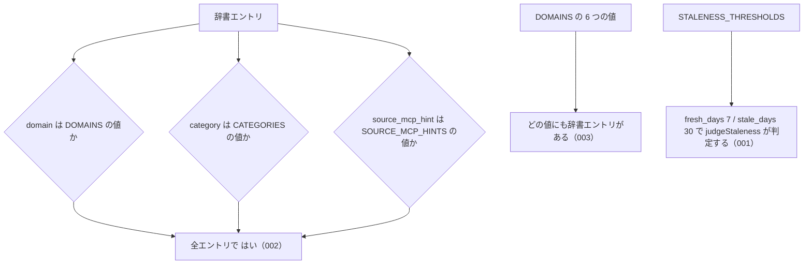

# 公開定数の仕様

<!-- GENERATED FILE — 手で編集しない。本文は houki-abbreviations の specs/current/public_constants/spec.md の写し。 -->

::: info
houki-abbreviations **v0.7.1** の `specs/current/public_constants/spec.md` から自動生成しました（仕様 ID 9 件・2026-10-10）。手で編集しないでください。再生成は `node scripts/generate-reference.mjs specs` です。
:::

CATEGORIES / DOMAINS / LAW_TYPE_CODES / SOURCE_MCP_HINTS / STALENESS_THRESHOLDS

使いどころ・引数・実測の呼び出し例は、[値のページ](/reference/lib/houki-abbreviations/public_constants)にあります。

最後に仕様が変わったのは v0.7.0 の「辞書のエントリと公開定数を凍結する」（2026-09-30 承認）です。それまでの経緯は[承認の履歴](#承認の履歴)にあります。

## 利用者と得られる結果

この機能の利用者と、利用者が渡すもの・得られる結果を示します。

- houki-hub family の MCP サーバー（houki-egov-mcp・houki-nta-mcp など）。辞書エントリの `domain` / `category` / `source_mcp_hint` がとりうる値の一覧として読み、引数の検査や管轄の判定に使う。鮮度の判定では `STALENESS_THRESHOLDS` の境界を使う
- このパッケージの辞書データ（`src/data/*.json`）。各エントリの値はこれらの定数の値のどれかにする

## 値

このパッケージが公開している値と、その中身です。

件数は v0.6.0 の辞書（全 174 件）で数えた、その値を持つエントリの数です。

### `DOMAINS`

辞書エントリの `domain`（実務の分野）がとりうる値の一覧。`listByDomain` の引数や `getAbbreviationStats` の `byDomain` のキーに使う。6 つの値を持つ。

| 値               | 分野 | 件数 |
| ---------------- | ---- | ---- |
| `tax`            | 税務 | 35   |
| `labor`          | 労務 | 28   |
| `accounting`     | 会計 | 9    |
| `commercial`     | 商事 | 31   |
| `civil`          | 民事 | 23   |
| `administrative` | 行政 | 48   |

### `CATEGORIES`

辞書エントリの `category`（法律・通達・判例など、どの種類の文書か）がとりうる値の一覧。`listByCategory` の引数や `getAbbreviationStats` の `byCategory` のキーに使う。13 の値を持つ。

| 値                      | 文書の種類       | 本文を持つ MCP サーバー                                             | 件数 |
| ----------------------- | ---------------- | ------------------------------------------------------------------- | ---- |
| `constitution`          | 憲法             | houki-egov-mcp                                                      | 1    |
| `law`                   | 法律             | houki-egov-mcp                                                      | 138  |
| `cabinet-order`         | 政令             | houki-egov-mcp                                                      | 8    |
| `imperial-ordinance`    | 勅令             | houki-egov-mcp                                                      | 0    |
| `ministerial-ordinance` | 省令             | houki-egov-mcp                                                      | 16   |
| `rule`                  | 規則             | houki-egov-mcp                                                      | 2    |
| `kokuji`                | 告示             | houki-nta-mcp・houki-mhlw-mcp など。e-Gov 法令 API は告示を持たない | 0    |
| `kihon-tsutatsu`        | 基本通達         | houki-nta-mcp など                                                  | 8    |
| `kobetsu-tsutatsu`      | 個別通達         | houki-nta-mcp など                                                  | 1    |
| `qa-jirei`              | 質疑応答事例     | houki-nta-mcp など                                                  | 0    |
| `tax-answer`            | タックスアンサー | houki-nta-mcp など                                                  | 0    |
| `hanrei`                | 判例             | （未定）                                                            | 0    |
| `saiketsu`              | 裁決             | （未定）                                                            | 0    |

件数 0 の値は、辞書にまだエントリが無い種類として先に定義している。`kokuji` は v0.7.0 で足す。告示は `law_type` を持たず（`LAW_TYPE_CODES` に対応するキーは無い）、`law_id` は `null`（`isValidLawId` が受け付ける形に告示は無い）。

### `SOURCE_MCP_HINTS`

辞書エントリの `source_mcp_hint`（そのエントリの本文をどの MCP サーバーで取得するか）がとりうる値の一覧。各 MCP サーバーは、エントリの `source_mcp_hint` が自分の名前でないときに管轄外と判定し、この値の MCP サーバーを案内する。`listBySourceMcpHint` の引数や `getAbbreviationStats` の `bySourceMcpHint` のキーに使う。6 つの値を持つ。

| 値               | 本文の取得元                                           | 件数 |
| ---------------- | ------------------------------------------------------ | ---- |
| `houki-egov`     | e-Gov 法令 API（憲法・法律・政令・勅令・府省令・規則） | 165  |
| `houki-nta`      | 国税庁の通達・告示・質疑応答事例・タックスアンサー     | 9    |
| `houki-mhlw`     | 厚生労働省の通達・告示・通知                           | 0    |
| `houki-jaish`    | 労働安全衛生の通達（未決 3）                           | 0    |
| `houki-court`    | 裁判所サイトの判例                                     | 0    |
| `houki-saiketsu` | 国税不服審判所の裁決                                   | 0    |

`houki-egov` の取得元から「告示」を外す。e-Gov 法令 API（`GET /api/2/laws`）は憲法・法律・政令・勅令・府省令・規則だけを持ち、告示を持たない。

### `LAW_TYPE_CODES`

e-Gov の法令種別の名前と、e-Gov の法令 ID（`law_id`）の 4〜5 文字目に入る種別コードの対応。辞書エントリの `law_type` がとりうる値はこのキーの 5 つ。`law_type` は非推奨で、`category` に集約する予定。

| キー（`law_type` の値） | 値（`law_id` の種別コード） | 法令種別 | `law_type` の件数 |
| ----------------------- | --------------------------- | -------- | ----------------- |
| `Act`                   | `AC`                        | 法律     | 138               |
| `CabinetOrder`          | `CO`                        | 政令     | 8                 |
| `ImperialOrdinance`     | `IO`                        | 勅令     | 0                 |
| `MinisterialOrdinance`  | `MO`                        | 省令     | 16                |
| `Rule`                  | `RU`                        | 規則     | 2                 |

例: 消費税法の `law_id` `363AC0000000108` の `AC` が `Act`（法律）を表す。

### `STALENESS_THRESHOLDS`

鮮度の判定（`judgeStaleness`）の境界の日数。family のどの MCP サーバーも同じ境界で `fresh` / `stale` / `outdated` を判定するために共有する。

| キー         | 値   | 意味                                                        |
| ------------ | ---- | ----------------------------------------------------------- |
| `fresh_days` | `7`  | 経過日数がこの値未満なら `fresh`                            |
| `stale_days` | `30` | 経過日数がこの値未満なら `stale`、この値以上なら `outdated` |

7 日は週 1 回の確認、30 日は月 1 回の一括取得を想定した値（houki-nta-mcp v0.6.0 で決めた値）。違う境界が要る MCP サーバーは、この定数を書き換えずに自分の判定関数を書く。

## 扱わないこと

この機能が意図して扱わないことです。

- 値を追加・変更する手段を持つこと（凍結されている。009。値を変えるにはこのパッケージの新しい版が要る）
- 鮮度を判定すること（`judgeStaleness`）。この文書は境界の値だけを書く
- エントリの `law_id` の形を検査すること（`isValidLawId`）
- エントリの一覧を分野・種類・MCP サーバー別に返すこと（`listByDomain`・`listByCategory`・`listBySourceMcpHint`）

## 処理の流れ

定数なので呼び出しの流れは無い。辞書エントリの値と定数の関係を示します。図の中の番号は「できること」の仕様 ID の末尾 3 桁です。

## 仕様項目

この機能の仕様項目を、仕様 ID ごとに並べています。見出しは仕様項目を 1 文で表したもので、条件・応答の細部・例は「詳細」を開くと読めます。仕様 ID はそれぞれ受入テストと対応していて、テストの無い ID があると各リポジトリの CI が止まります。

### SPEC-ABBR-PUBLIC-CONSTANTS-001 STALENESS_THRESHOLDS は fresh_days 7・stale_days 30 を持つ

::: details 詳細
`STALENESS_THRESHOLDS.fresh_days` は `7`、`STALENESS_THRESHOLDS.stale_days` は `30`。`fresh_days` は `stale_days` より小さい。
:::

### SPEC-ABBR-PUBLIC-CONSTANTS-002 辞書の全エントリの domain・category・source_mcp_hint は定数の値のどれかである

::: details 詳細
辞書（`abbreviationEntries`）のどのエントリも、`domain` は `DOMAINS` の値、`category` は `CATEGORIES` の値、`source_mcp_hint` は `SOURCE_MCP_HINTS` の値のどれかを持つ。定数に無い値を持つエントリは無い。
:::

### SPEC-ABBR-PUBLIC-CONSTANTS-003 DOMAINS のどの値にも辞書のエントリがある

::: details 詳細
`DOMAINS` の 6 つの値それぞれについて、その `domain` を持つ辞書のエントリが 1 件以上ある。`getAbbreviationStats().byDomain` の 6 つの値はどれも 1 以上。

例: v0.6.0 で最も少ない `accounting` は 9 件。
:::

### SPEC-ABBR-PUBLIC-CONSTANTS-004 LAW_TYPE_CODES は 5 つの法令種別と種別コードの対応を持つ

::: details 詳細
`LAW_TYPE_CODES` は次の 5 つのキーと値を持ち、これ以外のキーを持たない。

| キー                   | 値   |
| ---------------------- | ---- |
| `Act`                  | `AC` |
| `CabinetOrder`         | `CO` |
| `ImperialOrdinance`    | `IO` |
| `MinisterialOrdinance` | `MO` |
| `Rule`                 | `RU` |

例: `LAW_TYPE_CODES.Act` → `"AC"`、`LAW_TYPE_CODES.MinisterialOrdinance` → `"MO"`。
:::

### SPEC-ABBR-PUBLIC-CONSTANTS-005 law_id と law_type の両方を持つエントリは、law_id の種別コードが LAW_TYPE_CODES と一致する

::: details 詳細
辞書（`abbreviationEntries`）で `law_id` が `null` でなく `law_type` も持つエントリは、どれも `law_id` の 4〜5 文字目が `LAW_TYPE_CODES[law_type]` と同じ値になっている。

例: `消法` は `law_id: "363AC0000000108"`・`law_type: "Act"` で、4〜5 文字目の `AC` が `LAW_TYPE_CODES.Act` と同じ。`law_type` を持たない `憲`（`321CONSTITUTION`）は対象外。
:::

### SPEC-ABBR-PUBLIC-CONSTANTS-006 DOMAINS は 6 つの値をこの順で持つ

::: details 詳細
`DOMAINS` は `["tax", "labor", "accounting", "commercial", "civil", "administrative"]` で、値と順序がこのとおりになっている。
:::

### SPEC-ABBR-PUBLIC-CONSTANTS-007 CATEGORIES は 13 の値をこの順で持つ

::: details 詳細
`CATEGORIES` は `["constitution", "law", "cabinet-order", "imperial-ordinance", "ministerial-ordinance", "rule", "kokuji", "kihon-tsutatsu", "kobetsu-tsutatsu", "qa-jirei", "tax-answer", "hanrei", "saiketsu"]` で、値と順序がこのとおりになっている。`kokuji` は `rule` の次（法令系の値の末尾）に置く。

例: `CATEGORIES.length` は 13、`CATEGORIES[6]` は `"kokuji"`、`CATEGORIES.indexOf('kihon-tsutatsu')` は 7（v0.6.1 では 6）。
:::

### SPEC-ABBR-PUBLIC-CONSTANTS-008 SOURCE_MCP_HINTS は 6 つの値をこの順で持つ

::: details 詳細
`SOURCE_MCP_HINTS` は `["houki-egov", "houki-nta", "houki-mhlw", "houki-jaish", "houki-court", "houki-saiketsu"]` で、値と順序がこのとおりになっている。
:::

### SPEC-ABBR-PUBLIC-CONSTANTS-009 公開定数は凍結されていて、代入は TypeError になる

::: details 詳細
`DOMAINS`、`CATEGORIES`、`SOURCE_MCP_HINTS`、`LAW_TYPE_CODES`、`STALENESS_THRESHOLDS` は、どれも `Object.isFrozen` が `true` を返す。要素の追加・差し替え・削除とキーへの代入は、strict mode（ES モジュール、TypeScript の出力）では `TypeError` を投げ、値は変わらない。`judgeStaleness` の境界は実行時に変えられない。

例: `DOMAINS.push('x')` は `TypeError` を投げ、`DOMAINS.length` は 6 のまま（v0.6.1 では 7 になっていた）。`CATEGORIES[0] = 'x'` と `SOURCE_MCP_HINTS.pop()` も `TypeError`。`LAW_TYPE_CODES.Act = 'XX'` は `TypeError` で、`LAW_TYPE_CODES.Act` は `'AC'` のまま。`STALENESS_THRESHOLDS.fresh_days = 100` は `TypeError` で、その後の `judgeStaleness(50)` は `'outdated'` のまま（v0.6.1 では `'fresh'` になっていた）。
:::

## 検討中のこと

仕様を書き起こしたときに見つかった項目のうち、扱いを Issue で検討しているものです。ここに挙げたことは、今後の版で変わることがあります。開くと、元の仕様書の記述をそのまま読めます。

::: details 仕様書の「未決」の節
初版起こしで見つけた、意図か不具合かを人が決める項目です。決まったら「できること」に ID を振るか、`specs/changes/` の差分にします。

意図か不具合かの判断が要る項目は houki-abbreviations の Issue に移し、ここには題と Issue の番号だけを残します。今の振る舞いのままでよくテストが無いだけの項目は、受入テストを書いてから「できること」に ID を振ります。

1. **定数は実行時に書き換えられる。** → [SPEC-ABBR-PUBLIC-CONSTANTS-009](#spec-abbr-public-constants-009)
2. **`LAW_TYPE_CODES` の値を確かめるテストが無い。** → [SPEC-ABBR-PUBLIC-CONSTANTS-004](#spec-abbr-public-constants-004)、[SPEC-ABBR-PUBLIC-CONSTANTS-005](#spec-abbr-public-constants-005)
3. **`houki-jaish` の説明。** → houki-abbreviations #17
4. **値の一覧そのものを固定するテストが無い。** → [SPEC-ABBR-PUBLIC-CONSTANTS-006](#spec-abbr-public-constants-006)、[SPEC-ABBR-PUBLIC-CONSTANTS-007](#spec-abbr-public-constants-007)、[SPEC-ABBR-PUBLIC-CONSTANTS-008](#spec-abbr-public-constants-008)
5. **`CATEGORIES` の説明と e-Gov の範囲。** → [SPEC-ABBR-PUBLIC-CONSTANTS-007](#spec-abbr-public-constants-007)
:::

## 承認の履歴

この機能の仕様が、いつ、どの変更で承認されたかを新しい順に並べています。各リポジトリの `npx spec-ids history public_constants` と同じ内容です。変更の名前から、変更の理由と前後の振る舞いを書いた文書（GitHub）を開けます。

::: details 承認の履歴（5 件）
| 承認日 | 版 | 変更 | 仕様 PR |
|---|---|---|---|
| 2026-09-30 | v0.7.0 | [辞書のエントリと公開定数を凍結する](https://github.com/shuji-bonji/houki-abbreviations/blob/v0.7.1/specs/releases/v0.7.0/20261001-freeze/proposal.md) | [#33](https://github.com/shuji-bonji/houki-abbreviations/pull/33) |
| 2026-09-30 | v0.7.0 | [辞書の約束（名前の重なり・別名・告示）と、件数・近さの決め方](https://github.com/shuji-bonji/houki-abbreviations/blob/v0.7.1/specs/releases/v0.7.0/20261001-dictionary-rules/proposal.md) | [#32](https://github.com/shuji-bonji/houki-abbreviations/pull/32) |
| 2026-09-27 | v0.6.1 | [テストが無いだけの振る舞いに仕様 ID を振る](https://github.com/shuji-bonji/houki-abbreviations/blob/v0.7.1/specs/releases/v0.6.1/20260927-untested-behaviors/proposal.md) | [#27](https://github.com/shuji-bonji/houki-abbreviations/pull/27) |
| 2026-09-27 | v0.6.1 | [「未決」のうち判断が要る 52 件を Issue に移す](https://github.com/shuji-bonji/houki-abbreviations/blob/v0.7.1/specs/releases/v0.6.1/20260927-undecided-to-issues/proposal.md) | [#26](https://github.com/shuji-bonji/houki-abbreviations/pull/26) |
| 2026-09-27 | — | 初版 | [#10](https://github.com/shuji-bonji/houki-abbreviations/pull/10) |
:::

## 関連ページ

このページの元になった文書と、あわせて読むページです。

- [houki-abbreviations の仕様の一覧](/specs/houki-abbreviations/)
- [houki-abbreviations の解説](/lib/houki-abbreviations)
- [公開定数 の値のページ（リファレンス）](/reference/lib/houki-abbreviations/public_constants)
- [元の仕様書（GitHub、v0.7.1）](https://github.com/shuji-bonji/houki-abbreviations/blob/v0.7.1/specs/current/public_constants/spec.md)
