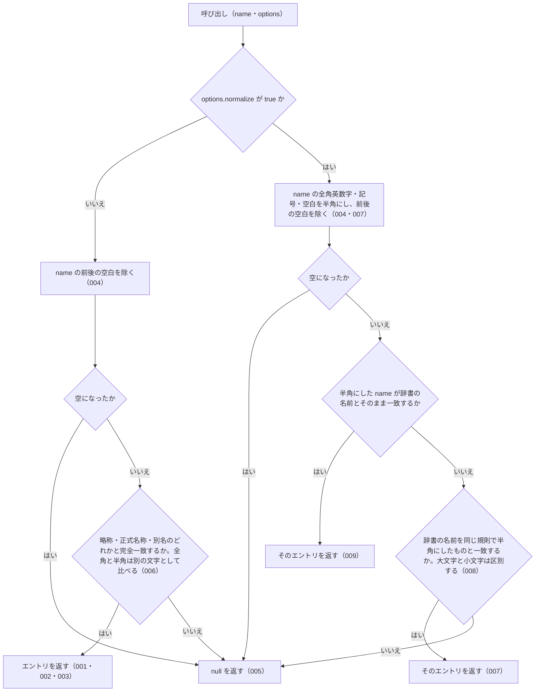

# resolveAbbreviation の仕様

<!-- GENERATED FILE — 手で編集しない。本文は houki-abbreviations の specs/current/resolve_abbreviation/spec.md の写し。 -->

::: info
houki-abbreviations **v0.7.0** の `specs/current/resolve_abbreviation/spec.md` から自動生成しました（仕様 ID 13 件・2026-10-09）。手で編集しないでください。再生成は `node scripts/generate-reference.mjs specs` です。
:::

このページは、houki-abbreviations の関数「resolveAbbreviation（略称・正式名称・別名から辞書のエントリを 1 件引く）」の仕様です。「承認の履歴」の前までは、仕様書の本文を言い換えずに写しています。
引数の型と既定値の一覧と、実測の呼び出し例は[リファレンス](/reference/lib/houki-abbreviations#resolveabbreviation)にあります。

最後に仕様が変わったのは v0.6.1 の「テストが無いだけの振る舞いに仕様 ID を振る」（2026-09-27 承認）です。それまでの経緯は[承認の履歴](#承認の履歴)にあります。

## 使う人と受け取るもの

この機能を誰が呼び、何を渡して何を受け取るかを示します。

- houki-hub family の MCP サーバー（houki-egov-mcp・houki-nta-mcp など）と、このパッケージを import する利用者のコード。`name` を渡して、その名前が辞書のどのエントリ（法令・通達）を指すかを受け取る

## 入力

呼び出すときに渡す値です。

| 引数                | 必須 | 内容                                                                                                                                                                                                                     |
| ------------------- | ---- | ------------------------------------------------------------------------------------------------------------------------------------------------------------------------------------------------------------------------ |
| `name`              | 必須 | 略称・正式名称・別名（辞書の `aliases`）のどれか。例: `消法` / `消費税法` / `消費税`。前後の空白は除いてから照合する。完全一致で引く（部分一致はしない）                                                                 |
| `options`           | 任意 | `ResolveAbbreviationOptions`。省略してよい                                                                                                                                                                               |
| `options.normalize` | 任意 | 既定は `false`。`true` のときは `name` の全角英数字・ダッシュ類（`－` `‐` `‑` `–` `—` `―` `−`）・全角チルダ（`～` `〜`）・全角空白を半角にしてから照合する。辞書側の名前も同じ規則で半角にしたものと比べる。大文字と小文字は区別したままにする |

## 戻り値

呼び出しが返す値です。

`AbbreviationEntry | null`。見つかったときは辞書のエントリそのもの、見つからないときは `null`。辞書のエントリそのもので、凍結されている（SPEC-ABBR-ABBREVIATION-ENTRIES-019）。

| フィールド        | 内容                                                                                                   |
| ----------------- | ------------------------------------------------------------------------------------------------------ |
| `abbr`            | 辞書に登録された略称。正式名称や別名で引いたときもこれは略称（`消費税法` → `消法`）                    |
| `formal`          | 正式名称                                                                                               |
| `law_id`          | e-Gov の法令 ID。通達など e-Gov に無いものは `null`                                                    |
| `law_num`         | 法令番号。法令系のエントリにだけ付く                                                                   |
| `law_type`        | e-Gov の法令種別（`Act` など）。法令系のエントリにだけ付く                                             |
| `domain`          | 分野。`tax` / `labor` / `accounting` / `commercial` / `civil` / `administrative` のどれか              |
| `category`        | 種別。例: `constitution`（憲法）/ `law`（法律）/ `cabinet-order`（政令）/ `kihon-tsutatsu`（基本通達） |
| `source_mcp_hint` | 本文を持つ MCP の名前。例: `houki-egov` / `houki-nta`                                                  |
| `aliases`         | 別名の一覧。辞書にあるときだけ付く                                                                     |
| `note`            | 備考。辞書にあるときだけ付く                                                                           |

例: `resolveAbbreviation('消法')` は `abbr: "消法"`、`formal: "消費税法"`、`law_id: "363AC0000000108"`、`law_num: "昭和六十三年法律第百八号"`、`law_type: "Act"`、`domain: "tax"`、`category: "law"`、`source_mcp_hint: "houki-egov"`、`aliases`（`消費税` / `インボイス` など 10 件）、`note` を持つエントリを返す。

## できないこと

この機能が引き受けないことです。

- 部分一致で探すこと（`searchByName`）
- 似た名前（打ち間違い）から探すこと（`findSimilar` / `suggestCorrection`）
- e-Gov の法令 ID から引くこと（`lookupByLawId`）
- 法令番号から引くこと（`lookupByLawNum`）
- 1 件のエントリの名前をすべて返すこと（`getAllNames`）
- 文章の中から法令名を探すこと（`extractLawNames`）
- 1 回の呼び出しで複数の名前を引くこと
- 名前の途中にある空白を無視して照合すること（`normalize: true` でも、全角空白を半角空白にするだけで取り除かない。未決 1）
- 英字の大文字と小文字の違いを吸収すること（`normalize: true` でも区別する）
- 見つからなかったときに候補や理由を返すこと（`null` だけを返す）

## 処理の流れ

`name` を受け取ってからエントリを返すまでに、何をどの順で確かめるかを示します。図の中の番号は「できること」の仕様 ID の末尾 3 桁です。

## 仕様 ID ごとの約束

この機能が守る約束を、仕様 ID ごとに並べています。見出しは約束を 1 文で表したもので、条件・応答の細部・例は「詳細」を開くと読めます。仕様 ID はそれぞれ受入テストと対応していて、テストの無い ID があると各リポジトリの CI が止まります。

### SPEC-ABBR-RESOLVE-ABBREVIATION-001 略称からエントリを返す

::: details 詳細
`name` が辞書のエントリの略称（`abbr`）と一致するとき、そのエントリを返す。辞書の 6 分野すべてのエントリが同じ規則で引ける。

例: `resolveAbbreviation('消法')` は `formal: "消費税法"`、`domain: "tax"`、`category: "law"`、`source_mcp_hint: "houki-egov"`、`law_id: "363AC0000000108"` のエントリを返す。`労基法` は `domain: "labor"`、`公認会計士法` は `accounting`、`会社` は `commercial`、`民` は `civil`、`個情法` は `administrative` のエントリを返す。`憲法` は `formal: "日本国憲法"`、`category: "constitution"` のエントリを返す。
:::

### SPEC-ABBR-RESOLVE-ABBREVIATION-002 正式名称からエントリを返す

::: details 詳細
`name` が辞書のエントリの正式名称（`formal`）と一致するとき、そのエントリを返す。返すエントリの `abbr` は略称のまま。

例: `resolveAbbreviation('消費税法')` は `abbr: "消法"` のエントリを返す。
:::

### SPEC-ABBR-RESOLVE-ABBREVIATION-003 別名からエントリを返す

::: details 詳細
`name` が辞書のエントリの別名（`aliases` の要素）と一致するとき、そのエントリを返す。通称もこの規則で引ける。

例: `消費税` は `formal: "消費税法"`、`景品表示法` は `abbr: "景表法"`、`PL法` は `formal: "製造物責任法"`、`個人情報保護法` は `abbr: "個情法"`、`独占禁止法` は `abbr: "独禁法"` のエントリを返す。
:::

### SPEC-ABBR-RESOLVE-ABBREVIATION-004 前後の空白を除いてから照合する

::: details 詳細
`name` の前後の空白を除いてから照合する。`options.normalize` が `false` でも `true` でも同じ。

例: `resolveAbbreviation('  消法  ')` は `formal: "消費税法"` のエントリを返す。`resolveAbbreviation('　消法　', { normalize: true })`（前後が全角空白）も同じエントリを返す。
:::

### SPEC-ABBR-RESOLVE-ABBREVIATION-005 辞書に無い名前と空の名前には null を返す

::: details 詳細
`name` が辞書のどのエントリの略称・正式名称・別名とも一致しないときは `null` を返す。例外は投げない。`name` が空文字、または前後の空白を除くと空になるときも `null` を返す。`options.normalize` が `true` でも同じ。

例: `resolveAbbreviation('存在しない法律')`、`resolveAbbreviation('')`、`resolveAbbreviation('   ')` はどれも `null`。`{ normalize: true }` を付けたときも同じで、`resolveAbbreviation('　　　', { normalize: true })` も `null`。
:::

### SPEC-ABBR-RESOLVE-ABBREVIATION-006 既定では全角と半角を別の文字として照合する

::: details 詳細
`options` を渡さないとき（`options.normalize` の既定は `false`）は、全角と半角の違いを吸収しない。辞書の名前と文字が 1 つでも違えば `null` を返す。

例: `resolveAbbreviation('ＰＬ法')`（全角英字）は `null`（辞書にあるのは半角の `PL法`）。`resolveAbbreviation('消　法')`（間に全角空白）は `null`。
:::

### SPEC-ABBR-RESOLVE-ABBREVIATION-007 normalize: true では全角英字を半角にして照合する

::: details 詳細
`options.normalize` が `true` のとき、`name` の全角英字を半角にしてから照合する。辞書の名前も同じ規則で半角にしたものと比べる。

例: `resolveAbbreviation('ＰＬ法', { normalize: true })` は `formal: "製造物責任法"` のエントリを返す。
:::

### SPEC-ABBR-RESOLVE-ABBREVIATION-008 normalize: true でも大文字と小文字は区別する

::: details 詳細
`options.normalize` が `true` でも、英字の大文字と小文字は別の文字として照合する。

例: `resolveAbbreviation('PL法', { normalize: true })` は `formal: "製造物責任法"` のエントリを返すが、`resolveAbbreviation('pl法', { normalize: true })` と `resolveAbbreviation('ｐｌ法', { normalize: true })` は `null`。
:::

### SPEC-ABBR-RESOLVE-ABBREVIATION-009 normalize: true でも、半角にする前から一致する名前は同じエントリを返す

::: details 詳細
`options.normalize` が `true` でも、`name` が辞書の略称・正式名称・別名とそのまま一致するときは、`options` を渡さないときと同じエントリ（同じオブジェクト）を返す。

例: `resolveAbbreviation('PL法', { normalize: true })` は `resolveAbbreviation('PL法')` と同じオブジェクトを返す。`resolveAbbreviation('消法', { normalize: true })` は `formal: "消費税法"`、`resolveAbbreviation('個人情報保護法', { normalize: true })` は `abbr: "個情法"` のエントリを返す。
:::

### SPEC-ABBR-RESOLVE-ABBREVIATION-010 既定の照合でも前後の全角空白・タブ・改行を除く

::: details 詳細
`options` を渡さないとき（`options.normalize` が `false`）も、`name` の前後にある全角空白（`　`）・タブ・改行を半角空白と同じく除いてから照合する。

例: `resolveAbbreviation('　消法　')`（前後が全角空白）、`resolveAbbreviation('\t消法\n')`、`resolveAbbreviation('\r\n消法　\t')` はどれも `formal: "消費税法"` のエントリを返す。
:::

### SPEC-ABBR-RESOLVE-ABBREVIATION-011 normalize: false・空のオブジェクト・null の options は options を省いたときと同じ

::: details 詳細
`options` に `{ normalize: false }`、`{}`、`null`、`undefined` のどれを渡しても、`options` を省いたときと同じ結果を返す。見つかるときは同じエントリ（同じオブジェクト）を返し、全角と半角の違いは吸収しない。

例: `resolveAbbreviation('消法', { normalize: false })`、`resolveAbbreviation('消法', {})`、`resolveAbbreviation('消法', null)` はどれも `resolveAbbreviation('消法')` と同じオブジェクト（`formal: "消費税法"`）を返す。`resolveAbbreviation('ＰＬ法', { normalize: false })`、`resolveAbbreviation('ＰＬ法', {})`、`resolveAbbreviation('ＰＬ法', null)` はどれも `null`。
:::

### SPEC-ABBR-RESOLVE-ABBREVIATION-012 normalize: true でも別名からエントリを返す

::: details 詳細
`options.normalize` が `true` のときも、`name` が辞書のエントリの別名（`aliases` の要素）と一致すればそのエントリを返す。全角英字を含む `name` は、半角にしたものが別名と一致すればそのエントリを返す。

例: `resolveAbbreviation('消費税', { normalize: true })` は `resolveAbbreviation('消費税')` と同じオブジェクト（`abbr: "消法"`）を返す。`resolveAbbreviation('インボイス', { normalize: true })` も `abbr: "消法"` のエントリを返す。`resolveAbbreviation('ＡＭＬ', { normalize: true })` は別名 `AML` を持つ `abbr: "犯収法"` のエントリ、`resolveAbbreviation('ＪＰＫＩ法', { normalize: true })` は別名 `JPKI法` を持つ `abbr: "公的個人認証法"` のエントリを返す。
:::

### SPEC-ABBR-RESOLVE-ABBREVIATION-013 name が null・undefined のときは null を返す

::: details 詳細
JavaScript から `name` に `null` または `undefined` を渡したときは、例外を投げずに `null` を返す。`options.normalize` が `true` でも同じ。

例: `resolveAbbreviation(null)`、`resolveAbbreviation(undefined)`、`resolveAbbreviation(null, { normalize: true })`、`resolveAbbreviation(undefined, { normalize: true })` はどれも `null`。
:::

## まだ決めていないこと

仕様を書き起こしたときに見つかった項目のうち、扱いを決めている途中のものです。開くと、元の仕様書の記述をそのまま読めます。

::: details 仕様書の「未決」の節
初版起こしで見つけた、意図か不具合かを人が決める項目です。決まったら「できること」に ID を振るか、`specs/changes/` の差分にします。

意図か不具合かの判断が要る項目は houki-abbreviations の Issue に移し、ここには題と Issue の番号だけを残します。今の振る舞いのままでよくテストが無いだけの項目は、受入テストを書いてから「できること」に ID を振ります。

1. **README と JSDoc の `消　法` の例が実際の結果と違う。** → houki-abbreviations #17
2. **返すエントリは凍結されておらず、書き換えると辞書に残る。** → SPEC-ABBR-ABBREVIATION-ENTRIES-019
3. **全角数字・全角ハイフン・全角チルダの吸収。** `normalize: true` はこれらも半角にするが、v0.6.0 の辞書（174 件）の略称・正式名称・別名には数字・ハイフン・チルダを含む名前が無い（英字を含むのは `IT書面一括法` / `AML` / `PL法` / `JPKI法` の 4 つだけ）ため、辞書を引いて確かめられない。テスト `{ normalize: true } absorbs full-width digits` は `消法` を引いているだけで、全角数字を渡していない。テストが無い。ID を振るのは受入テストを書いてから。
4. **既定の照合で前後の全角空白・タブ・改行も除く。** → [SPEC-ABBR-RESOLVE-ABBREVIATION-010](#spec-abbr-resolve-abbreviation-010)
5. **半角にした名前が複数のエントリで重なるときは先に登録されたエントリを返す。** → SPEC-ABBR-ABBREVIATION-ENTRIES-017（名前は重ならない）
6. **`options.normalize` に `false` を明示したとき、`{}` や `null` を渡したとき。** → [SPEC-ABBR-RESOLVE-ABBREVIATION-011](#spec-abbr-resolve-abbreviation-011)
7. **`normalize: true` で別名から引くこと。** → [SPEC-ABBR-RESOLVE-ABBREVIATION-012](#spec-abbr-resolve-abbreviation-012)
8. **文字列でない `name`。** → [SPEC-ABBR-RESOLVE-ABBREVIATION-013](#spec-abbr-resolve-abbreviation-013)
:::

## 承認の履歴

この機能の仕様が、いつ、どの変更で承認されたかを新しい順に並べています。各リポジトリの `npx spec-ids history resolve_abbreviation` と同じ内容です。変更の名前から、変更の理由と前後の振る舞いを書いた文書（GitHub）を開けます。

::: details 承認の履歴（3 件）
| 承認日 | 版 | 変更 | 仕様 PR |
|---|---|---|---|
| 2026-09-27 | v0.6.1 | [テストが無いだけの振る舞いに仕様 ID を振る](https://github.com/shuji-bonji/houki-abbreviations/blob/v0.7.0/specs/releases/v0.6.1/20260927-untested-behaviors/proposal.md) | [#27](https://github.com/shuji-bonji/houki-abbreviations/pull/27) |
| 2026-09-27 | v0.6.1 | [「未決」のうち判断が要る 52 件を Issue に移す](https://github.com/shuji-bonji/houki-abbreviations/blob/v0.7.0/specs/releases/v0.6.1/20260927-undecided-to-issues/proposal.md) | [#26](https://github.com/shuji-bonji/houki-abbreviations/pull/26) |
| 2026-09-27 | — | 初版 | [#10](https://github.com/shuji-bonji/houki-abbreviations/pull/10) |
:::

## 関連ページ

このページの元になった文書と、あわせて読むページです。

- [houki-abbreviations の仕様の一覧](/specs/houki-abbreviations/)
- [houki-abbreviations の解説](/lib/houki-abbreviations)
- [リファレンスの resolveAbbreviation](/reference/lib/houki-abbreviations#resolveabbreviation)
- [元の仕様書（GitHub、v0.7.0）](https://github.com/shuji-bonji/houki-abbreviations/blob/v0.7.0/specs/current/resolve_abbreviation/spec.md)
