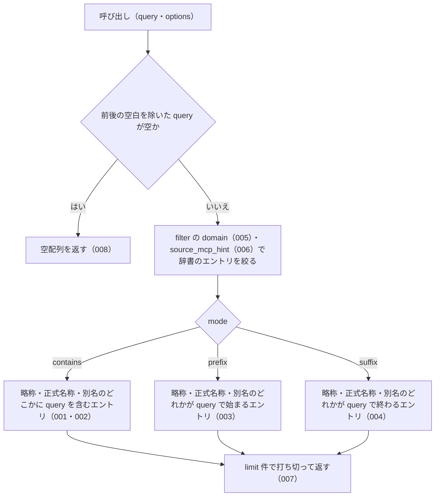

# searchByName の仕様

<!-- GENERATED FILE — 手で編集しない。本文は houki-abbreviations の specs/current/search_by_name/spec.md の写し。 -->

::: info
houki-abbreviations **v0.7.0** の `specs/current/search_by_name/spec.md` から自動生成しました（仕様 ID 20 件・2026-10-09）。手で編集しないでください。再生成は `node scripts/generate-reference.mjs specs` です。
:::

このページは、houki-abbreviations の関数「searchByName（辞書のエントリを名前の部分一致で探す）」の仕様です。「承認の履歴」の前までは、仕様書の本文を言い換えずに写しています。
引数の型と既定値の一覧と、実測の呼び出し例は[リファレンス](/reference/lib/houki-abbreviations#searchbyname)にあります。

最後に仕様が変わったのは v0.7.0 の「引数の検査を「丸めない」に揃える（limit・取得時刻・law_id の形）」（2026-09-30 承認）です。それまでの経緯は[承認の履歴](#承認の履歴)にあります。

## 使う人と受け取るもの

この機能を誰が呼び、何を渡して何を受け取るかを示します。

- houki-abbreviations を import する利用者（houki-nta-mcp・houki-egov-mcp などの MCP サーバー、または独自のコード）。`労働` のような名前の一部を渡して、略称・正式名称・別名のどれかにその文字列を含む辞書のエントリを受け取る

## 入力

呼び出すときに渡す値です。

| 引数                | 必須 | 内容                                                                                                                                                                  |
| ------------------- | ---- | --------------------------------------------------------------------------------------------------------------------------------------------------------------------- |
| `query`             | 必須 | 探す文字列。例: `労働` / `施行令` / `インボイス`。前後の空白は無視する                                                                                                |
| `options.mode`      | 任意 | 一致の仕方。`contains`（既定。どこかに含む）/ `prefix`（先頭が一致）/ `suffix`（末尾が一致）。型は `SearchMode`                                                       |
| `options.filter`    | 任意 | 絞り込み。型は `SearchFilter`。キーは `domain` / `category` / `source_mcp_hint` で、それぞれ単一の値か配列を取る                                                      |
| `options.limit`     | 任意 | 返す件数の上限。1 以上 500 以下の整数。省くと 50。それ以外の値（1 未満、小数、500 超、`NaN`、`Infinity`）は `RangeError`、数でない値は `TypeError` を投げる。丸めない |
| `options.normalize` | 任意 | 全角英数字・ダッシュ類・全角チルダ・全角スペースを半角にしてから比べるか。既定 `true`                                                                                 |

辞書は関数が持っている（v0.6.1 で 174 件）。エントリの配列を渡す引数は無い。`limit` の規則は `findSimilar` / `suggestCorrection` と同じ。

## 戻り値

呼び出しが返す値です。

辞書のエントリ（`AbbreviationEntry`）の配列。1 件も一致しなければ空配列。フィールドは辞書のエントリと同じで、`abbr`（略称）・`formal`（正式名称）・`aliases`（別名の一覧）・`law_id`・`domain`・`category`・`source_mcp_hint` などを持つ。

## できないこと

この機能が引き受けないことです。

- 綴りの誤りを許して探すこと（`findSimilar`）
- 完全一致で 1 件に決めること（`resolveAbbreviation`）
- 英字の大文字・小文字の違いを同じとみなすこと（`searchByName('pl法')` は `PL法` を別名に持つ `製造物責任法` を返さず `[]`）
- 一致の近さで並べ替えること（返す順は辞書の並び。未決 1）
- 法令 ID や法令番号から探すこと（`lookupByLawId` / `lookupByLawNum`）

## 処理の流れ

呼び出しを受けてから配列を返すまでに、何をどの順で確かめるかを示します。図の中の番号は「できること」の仕様 ID の末尾 3 桁です。

## 仕様 ID ごとの約束

この機能が守る約束を、仕様 ID ごとに並べています。見出しは約束を 1 文で表したもので、条件・応答の細部・例は「詳細」を開くと読めます。仕様 ID はそれぞれ受入テストと対応していて、テストの無い ID があると各リポジトリの CI が止まります。

### SPEC-ABBR-SEARCH-BY-NAME-001 既定の contains で、query を含むエントリを返す

::: details 詳細
`mode` を省くと `contains` として扱い、略称・正式名称・別名のどこかに `query` を含むエントリを返す。

例: `searchByName('労働')` は 12 件を返す。先頭から `労基法`・`労基則`・`労契法`・`労組法`・`労調法`・`安衛法`・`安衛則`・`派遣法` の順で、`formal` が `労働基準法` のエントリを含む。
:::

### SPEC-ABBR-SEARCH-BY-NAME-002 別名（aliases）に一致したエントリも返す

::: details 詳細
略称と正式名称に `query` が無くても、別名のどれかに一致すればそのエントリを返す。

例: `searchByName('インボイス')` は `abbr: "消法"`（`formal: "消費税法"`）の 1 件を返す。`searchByName('ふるさと納税')` は `所法`（所得税法）、`searchByName('マイナ')` は `マイナンバー法` を返す。
:::

### SPEC-ABBR-SEARCH-BY-NAME-003 prefix は query で始まる名前を持つエントリを返す

::: details 詳細
`mode: 'prefix'` のときは、略称・正式名称・別名のどれかが `query` で始まるエントリだけを返す。

例: `searchByName('労働', { mode: 'prefix' })` は 10 件を返し、どのエントリも `労働` で始まる名前を持つ。
:::

### SPEC-ABBR-SEARCH-BY-NAME-004 suffix は query で終わる名前を持つエントリを返す

::: details 詳細
`mode: 'suffix'` のときは、略称・正式名称・別名のどれかが `query` で終わるエントリだけを返す。

例: `searchByName('施行令', { mode: 'suffix' })` は 8 件を返し、どのエントリも `施行令` で終わる名前を持つ。
:::

### SPEC-ABBR-SEARCH-BY-NAME-005 filter.domain で分野を絞る

::: details 詳細
`filter.domain` を渡すと、`domain` がその値のエントリだけを返す。配列を渡すと、配列のどれかに当たる `domain` のエントリを返す。

例: `searchByName('税', { filter: { domain: 'tax' } })` は 35 件を返し、すべて `domain: "tax"`。`searchByName('法', { filter: { domain: ['tax', 'labor'] }, limit: 100 })` の結果は、すべて `domain` が `tax` か `labor`。
:::

### SPEC-ABBR-SEARCH-BY-NAME-006 filter.source_mcp_hint で本文を持つ MCP を絞る

::: details 詳細
`filter.source_mcp_hint` を渡すと、`source_mcp_hint` がその値のエントリだけを返す。

例: `searchByName('税', { filter: { source_mcp_hint: 'houki-egov' }, limit: 100 })` は 28 件を返し、すべて `source_mcp_hint: "houki-egov"`。
:::

### SPEC-ABBR-SEARCH-BY-NAME-007 limit の件数で打ち切る

::: details 詳細
一致したエントリが `limit` を超えるときは、`limit` 件で打ち切って返す。

例: `searchByName('法', { limit: 3 })` は 3 件を返す（`limit` を付けなければ 50 件、`limit: 500` なら 167 件）。
:::

### SPEC-ABBR-SEARCH-BY-NAME-008 空の query には空配列を返す

::: details 詳細
`query` が空文字か、前後の空白を除くと空になるときは、辞書を調べずに空配列を返す。エラーにはしない。

例: `searchByName('')` と `searchByName('   ')` はどちらも `[]`。
:::

### SPEC-ABBR-SEARCH-BY-NAME-009 一致したエントリを辞書の並びのまま返す

::: details 詳細
一致したエントリは `abbreviationEntries` での並びのまま返す。一致の近さや名前の長さでは並べ替えない。

例: `searchByName('労働')` は `労基法`・`労基則`・`労契法`・`労組法`・`労調法`・`安衛法`・`安衛則`・`派遣法`・`労災法`・`徴収法`・`育介法`・`パート法` の 12 件で、この順は v0.6.0 の `abbreviationEntries` での順と同じ。
:::

### SPEC-ABBR-SEARCH-BY-NAME-010 複数の名前が一致しても 1 つのエントリは 1 回だけ返す

::: details 詳細
1 つのエントリの略称・正式名称・別名のうち 2 つ以上が `query` に一致しても、そのエントリは結果に 1 回だけ入る。

例: `searchByName('消費税')` は `消法`（`formal: "消費税法"`、別名 `消費税` も一致）・`消令`・`消規`・`消基通` の 4 件で、`消法` は 1 回だけ。
:::

### SPEC-ABBR-SEARCH-BY-NAME-011 既定では全角英数字を半角にしてから比べる

::: details 詳細
`normalize` を省くか `true` にすると、`query` と辞書の名前の両方の全角英数字を半角にしてから比べる。

例: `searchByName('ＰＬ法')` は、別名 `PL法` を持つ `製造物責任法` のエントリを返す（`searchByName('PL法')` と同じ結果）。
:::

### SPEC-ABBR-SEARCH-BY-NAME-012 normalize が false のときは全角英数字をそのまま比べる

::: details 詳細
`normalize: false` のときは、全角英数字を半角にせずに比べる。

例: `searchByName('ＰＬ法', { normalize: false })` は `[]`。
:::

### SPEC-ABBR-SEARCH-BY-NAME-013 filter.category で文書の種類を絞る

::: details 詳細
`filter.category` を渡すと、`category` がその値のエントリだけを返す。単一の値でも配列でもよい。

例: `searchByName('通達', { filter: { category: ['kihon-tsutatsu'] } })` は `消基通`・`所基通`・`法基通`・`相基通`・`通基通`・`徴基通`・`措通`・`印基通` の 8 件で、すべて `category: "kihon-tsutatsu"`。`{ category: 'kihon-tsutatsu' }` と単一の値で渡しても同じ 8 件。
:::

### SPEC-ABBR-SEARCH-BY-NAME-014 filter に複数のキーを渡すと、すべてを満たすエントリだけを返す

::: details 詳細
`filter` に `domain`・`category`・`source_mcp_hint` のうち 2 つ以上を渡すと、渡したキーのすべての条件に当たるエントリだけを返す。

例: `searchByName('税', { filter: { domain: 'tax', source_mcp_hint: 'houki-nta' } })` は 9 件で、すべて `domain: "tax"` かつ `source_mcp_hint: "houki-nta"`（`domain: 'tax'` だけなら 35 件）。
:::

### SPEC-ABBR-SEARCH-BY-NAME-015 filter のキーに空の配列を渡すと、そのキーでは絞らない

::: details 詳細
`filter` のキーに空の配列を渡したときは、そのキーの条件を付けなかったときと同じに扱う。

例: `searchByName('税', { filter: { domain: [] } })` は、`searchByName('税')` と同じ 37 件。
:::

### SPEC-ABBR-SEARCH-BY-NAME-016 limit を省くと 50 件で打ち切る

::: details 詳細
`limit` を省くと、一致したエントリが 50 件を超えるときに 50 件で打ち切る。

例: `searchByName('法')` は 50 件を返す（`limit: 500` なら 167 件）。
:::

### SPEC-ABBR-SEARCH-BY-NAME-017 1 未満の limit には RangeError を投げる

::: details 詳細
`limit` が 1 未満のとき（0・負の値・0.5 など）は、1 として扱わずに `RangeError` を投げる。辞書は調べない。

例: `searchByName('法', { limit: 0 })`、`{ limit: -3 }`、`{ limit: 0.5 }` は、どれも `RangeError` を投げる（v0.6.1 では `所法` の 1 件を返していた）。
:::

### SPEC-ABBR-SEARCH-BY-NAME-018 小数の limit には RangeError を投げる

::: details 詳細
`limit` が整数でないときは、切り上げずに `RangeError` を投げる。

例: `searchByName('法', { limit: 1.2 })`、`{ limit: 2.5 }`、`{ limit: 2.9 }` は、どれも `RangeError` を投げる（v0.6.1 では 2 件・3 件・3 件を返していた）。`{ limit: 3 }` と `{ limit: 3.0 }` は同じ数なので 3 件を返す。
:::

### SPEC-ABBR-SEARCH-BY-NAME-019 NaN・Infinity・数でない limit には例外を投げる

::: details 詳細
`limit` が `NaN` か `Infinity` か `-Infinity` のときは `RangeError`、数でない値（文字列・`null`・オブジェクトなど）のときは `TypeError` を投げる。`undefined` は省いたときと同じく 50 として扱う。既定値に置き換えたり、打ち切らずに返したりはしない。

例: `searchByName('法', { limit: NaN })` と `searchByName('法', { limit: Infinity })` は `RangeError`（v0.6.1 では `NaN` のとき 167 件をすべて返していた）。`searchByName('法', { limit: '3' })` と `searchByName('法', { limit: null })` は `TypeError`。`searchByName('法', { limit: undefined })` は `searchByName('法')` と同じ 50 件。
:::

### SPEC-ABBR-SEARCH-BY-NAME-020 500 を超える limit には RangeError を投げる

::: details 詳細
`limit` が 500 を超えるときは、500 に丸めずに `RangeError` を投げる。500 は受け付ける。

例: `searchByName('法', { limit: 501 })` と `searchByName('法', { limit: 10000 })` は `RangeError`（v0.6.1 では 500 として扱っていた）。`searchByName('法', { limit: 500 })` は 167 件を返す。
:::

## まだ決めていないこと

仕様を書き起こしたときに見つかった項目のうち、扱いを決めている途中のものです。開くと、元の仕様書の記述をそのまま読めます。

::: details 仕様書の「未決」の節
初版起こしで見つけた、意図か不具合かを人が決める項目です。決まったら「できること」に ID を振るか、`specs/changes/` の差分にします。

意図か不具合かの判断が要る項目は houki-abbreviations の Issue に移し、ここには題と Issue の番号だけを残します。今の振る舞いのままでよくテストが無いだけの項目は、受入テストを書いてから「できること」に ID を振ります。

1. **返す順は辞書の並び。** → [SPEC-ABBR-SEARCH-BY-NAME-009](#spec-abbr-search-by-name-009)、[SPEC-ABBR-SEARCH-BY-NAME-010](#spec-abbr-search-by-name-010)
2. **全角・半角の吸収（`normalize`）。** → [SPEC-ABBR-SEARCH-BY-NAME-011](#spec-abbr-search-by-name-011)、[SPEC-ABBR-SEARCH-BY-NAME-012](#spec-abbr-search-by-name-012)
3. **filter.category と、filter の複数のキーの組み合わせ。** → [SPEC-ABBR-SEARCH-BY-NAME-013](#spec-abbr-search-by-name-013)、[SPEC-ABBR-SEARCH-BY-NAME-014](#spec-abbr-search-by-name-014)、[SPEC-ABBR-SEARCH-BY-NAME-015](#spec-abbr-search-by-name-015)
4. **`limit` の既定値と 1 未満の値。** → [SPEC-ABBR-SEARCH-BY-NAME-016](#spec-abbr-search-by-name-016)、[SPEC-ABBR-SEARCH-BY-NAME-017](#spec-abbr-search-by-name-017)、[SPEC-ABBR-SEARCH-BY-NAME-018](#spec-abbr-search-by-name-018)
5. **`limit` に `NaN` を渡したときの扱いと上限。** → [SPEC-ABBR-SEARCH-BY-NAME-017](#spec-abbr-search-by-name-017)、[SPEC-ABBR-SEARCH-BY-NAME-018](#spec-abbr-search-by-name-018)、[SPEC-ABBR-SEARCH-BY-NAME-019](#spec-abbr-search-by-name-019)、[SPEC-ABBR-SEARCH-BY-NAME-020](#spec-abbr-search-by-name-020)
:::

## 承認の履歴

この機能の仕様が、いつ、どの変更で承認されたかを新しい順に並べています。各リポジトリの `npx spec-ids history search_by_name` と同じ内容です。変更の名前から、変更の理由と前後の振る舞いを書いた文書（GitHub）を開けます。

::: details 承認の履歴（4 件）
| 承認日 | 版 | 変更 | 仕様 PR |
|---|---|---|---|
| 2026-09-30 | v0.7.0 | [引数の検査を「丸めない」に揃える（limit・取得時刻・law_id の形）](https://github.com/shuji-bonji/houki-abbreviations/blob/v0.7.0/specs/releases/v0.7.0/20261001-input-guards/proposal.md) | [#31](https://github.com/shuji-bonji/houki-abbreviations/pull/31) |
| 2026-09-27 | v0.6.1 | [テストが無いだけの振る舞いに仕様 ID を振る](https://github.com/shuji-bonji/houki-abbreviations/blob/v0.7.0/specs/releases/v0.6.1/20260927-untested-behaviors/proposal.md) | [#27](https://github.com/shuji-bonji/houki-abbreviations/pull/27) |
| 2026-09-27 | v0.6.1 | [「未決」のうち判断が要る 52 件を Issue に移す](https://github.com/shuji-bonji/houki-abbreviations/blob/v0.7.0/specs/releases/v0.6.1/20260927-undecided-to-issues/proposal.md) | [#26](https://github.com/shuji-bonji/houki-abbreviations/pull/26) |
| 2026-09-27 | — | 初版 | [#10](https://github.com/shuji-bonji/houki-abbreviations/pull/10) |
:::

## 関連ページ

このページの元になった文書と、あわせて読むページです。

- [houki-abbreviations の仕様の一覧](/specs/houki-abbreviations/)
- [houki-abbreviations の解説](/lib/houki-abbreviations)
- [リファレンスの searchByName](/reference/lib/houki-abbreviations#searchbyname)
- [元の仕様書（GitHub、v0.7.0）](https://github.com/shuji-bonji/houki-abbreviations/blob/v0.7.0/specs/current/search_by_name/spec.md)
