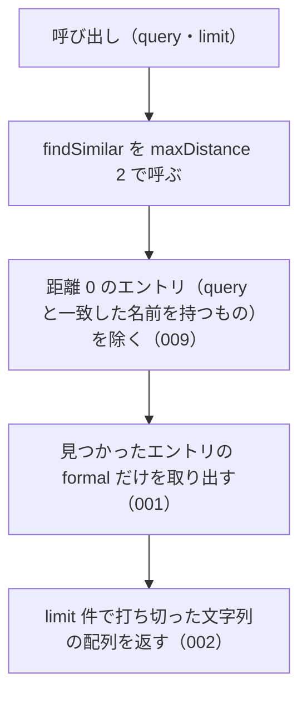

# suggestCorrection の仕様

<!-- GENERATED FILE — 手で編集しない。本文は houki-abbreviations の specs/current/suggest_correction/spec.md の写し。 -->

::: info
houki-abbreviations **v0.7.0** の `specs/current/suggest_correction/spec.md` から自動生成しました（仕様 ID 9 件・2026-10-10）。手で編集しないでください。再生成は `node scripts/generate-reference.mjs specs` です。
:::

誤った名前に近いエントリの正式名称を並べて返す

使いどころ・引数・実測の呼び出し例は、[関数のページ](/reference/lib/houki-abbreviations/suggest_correction)にあります。

最後に仕様が変わったのは v0.7.0 の「辞書の約束（名前の重なり・別名・告示）と、件数・近さの決め方」（2026-09-30 承認）です。それまでの経緯は[承認の履歴](#承認の履歴)にあります。

## 利用者と得られる結果

この機能の利用者と、利用者が渡すもの・得られる結果を示します。

- houki-abbreviations を import する利用者（houki-nta-mcp・houki-egov-mcp などの MCP サーバー、または独自のコード）。辞書に無い名前を渡して、「もしかして」として示す正式名称の一覧を文字列の配列で受け取る。LLM へのプロンプトにそのまま入れる用途を想定する

## 入力

呼び出すときに渡す値です。

| 引数    | 必須 | 内容                                                                                                                                                                 |
| ------- | ---- | -------------------------------------------------------------------------------------------------------------------------------------------------------------------- |
| `query` | 必須 | 誤っているかもしれない名前。例: `労働基準法施行例`                                                                                                                   |
| `limit` | 任意 | 返す件数の上限。1 以上 500 以下の整数。省くと 5。それ以外の値（1 未満、小数、500 超、`NaN`、`Infinity`）は `RangeError`、数でない値は `TypeError` を投げる。丸めない |

編集距離の上限・絞り込み・全角と半角の扱いは指定できない。`findSimilar` の既定値（`maxDistance: 2`、`sortByScore: true`、`normalize: true`、`filter` なし）で探す。

## 戻り値

呼び出しが返す値です。

文字列の配列。各要素はエントリの `formal`（正式名称）。並びは `findSimilar` と同じ（編集距離の小さい順）。`query` と一致した名前を持つエントリ（`distance: 0`）は入れない。1 件も無ければ空配列。

## 扱わないこと

この機能が意図して扱わないことです。

- 編集距離の上限（`maxDistance`）や `filter` を指定すること（指定したいときは `findSimilar` を使う）
- どの名前に近かったか・どれだけ近かったかを返すこと（`findSimilar` の `matchedKey` と `distance`）
- 名前の一部で探すこと（`searchByName`）

## 処理の流れ

呼び出しを受けてから配列を返すまでの流れを示します。図の中の番号は「できること」の仕様 ID の末尾 3 桁です。

## 仕様項目

この機能の仕様項目を、仕様 ID ごとに並べています。見出しは仕様項目を 1 文で表したもので、条件・応答の細部・例は「詳細」を開くと読めます。仕様 ID はそれぞれ受入テストと対応していて、テストの無い ID があると各リポジトリの CI が止まります。

### SPEC-ABBR-SUGGEST-CORRECTION-001 近いエントリの正式名称を文字列の配列で返す

::: details 詳細
`query` に編集距離が近いエントリ（`findSimilar` が返すもののうち `distance` が 1 以上のもの）の `formal` を、同じ順に並べた文字列の配列で返す。エントリそのものや編集距離は返さない。

例: `suggestCorrection('労働基準法施行例')` は `['労働基準法施行規則']`。`suggestCorrection('所得税法施行令')` は `['所得税法施行規則', '法人税法施行令', '消費税法施行令', '相続税法施行令', '印紙税法施行令']`（`所得税法施行令` 自身は入らない）。`suggestCorrection('法')` は `[]`（v0.6.1 では `['所得税法', '法人税法', '法人税法施行令', '法人税法施行規則', '消費税法']`）。
:::

### SPEC-ABBR-SUGGEST-CORRECTION-002 limit の件数で打ち切る

::: details 詳細
`limit` を渡すと、その件数までで打ち切って返す。打ち切るのは距離 0 のエントリを除いた後。

例: `suggestCorrection('所得税法施行令', 3)` は `['所得税法施行規則', '法人税法施行令', '消費税法施行令']`。
:::

### SPEC-ABBR-SUGGEST-CORRECTION-003 limit を省くと 5 件で打ち切る

::: details 詳細
`limit` を省くと、候補が 5 件を超えるときに 5 件で打ち切る。

例: `suggestCorrection('所得税法施行令')` は `['所得税法施行規則', '法人税法施行令', '消費税法施行令', '相続税法施行令', '印紙税法施行令']` の 5 件（`suggestCorrection('所得税法施行令', 100)` は 6 件で、`地方税法施行令` が末尾に付く）。
:::

### SPEC-ABBR-SUGGEST-CORRECTION-004 1 未満の limit には RangeError を投げる

::: details 詳細
`limit` が 1 未満のとき（0・負の値・0.5 など）は、1 として扱わずに `RangeError` を投げる。

例: `suggestCorrection('所得税法施行令', 0)`、`suggestCorrection('所得税法施行令', -1)`、`suggestCorrection('所得税法施行令', 0.5)` は、どれも `RangeError` を投げる（v0.6.1 では 1 件を返していた）。
:::

### SPEC-ABBR-SUGGEST-CORRECTION-005 空の query には空配列を返す

::: details 詳細
`query` が空文字か、前後の空白を除くと空になるときは、空配列を返す。エラーにはしない。

例: `suggestCorrection('')` と `suggestCorrection('   ')` はどちらも `[]`。
:::

### SPEC-ABBR-SUGGEST-CORRECTION-006 小数の limit には RangeError を投げる

::: details 詳細
`limit` が整数でないときは `RangeError` を投げる。

例: `suggestCorrection('所得税法施行令', 2.5)` は `RangeError`。`suggestCorrection('所得税法施行令', 3)` は 3 件以内を返す。
:::

### SPEC-ABBR-SUGGEST-CORRECTION-007 NaN・Infinity・数でない limit には例外を投げる

::: details 詳細
`limit` が `NaN` か `Infinity` か `-Infinity` のときは `RangeError`、数でない値（文字列・`null`・オブジェクトなど）のときは `TypeError` を投げる。`undefined` は省いたときと同じく 5 として扱う。

例: `suggestCorrection('所得税法施行令', NaN)` と `suggestCorrection('所得税法施行令', Infinity)` は `RangeError`（v0.6.1 では `NaN` のとき `[]` を返していた）。`suggestCorrection('所得税法施行令', '3')` と `suggestCorrection('所得税法施行令', null)` は `TypeError`。`suggestCorrection('所得税法施行令', undefined)` は `suggestCorrection('所得税法施行令')` と同じ結果。
:::

### SPEC-ABBR-SUGGEST-CORRECTION-008 500 を超える limit には RangeError を投げる

::: details 詳細
`limit` が 500 を超えるときは `RangeError` を投げる。500 は受け付ける。v0.6.1 には上限が無かった。

例: `suggestCorrection('所得税法施行令', 501)` は `RangeError`。`suggestCorrection('所得税法施行令', 500)` は候補をすべて返す。
:::

### SPEC-ABBR-SUGGEST-CORRECTION-009 query と一致した名前を持つエントリは候補に入れない

::: details 詳細
`query` が辞書の略称・正式名称・別名のどれかと一致するとき（`findSimilar` で `distance: 0`）、そのエントリの `formal` は返さない。「もしかして」に入力そのものを含めない。ほかのエントリは返す。

例: `suggestCorrection('民法')` は `['民事訴訟法', '民事執行法', '民事保全法']` で、`民法` は入らない（v0.6.1 では先頭が `民法` だった）。`suggestCorrection('労働基準法')` は `[]`。`suggestCorrection('労基側')` は `['労働基準法', '労働基準法施行規則']`。
:::

## 検討中のこと

仕様を書き起こしたときに見つかった項目のうち、扱いを Issue で検討しているものです。ここに挙げたことは、今後の版で変わることがあります。開くと、元の仕様書の記述をそのまま読めます。

::: details 仕様書の「未決」の節
初版起こしで見つけた、意図か不具合かを人が決める項目です。決まったら「できること」に ID を振るか、`specs/changes/` の差分にします。

意図か不具合かの判断が要る項目は houki-abbreviations の Issue に移し、ここには題と Issue の番号だけを残します。今の振る舞いのままでよくテストが無いだけの項目は、受入テストを書いてから「できること」に ID を振ります。

1. **ドキュメントの例と実際の結果が違う。** → houki-abbreviations #17
2. **一致した名前も「もしかして」に入る。** → [SPEC-ABBR-SUGGEST-CORRECTION-009](#spec-abbr-suggest-correction-009)
3. **`limit` の既定値と 1 未満の値。** → [SPEC-ABBR-SUGGEST-CORRECTION-003](#spec-abbr-suggest-correction-003)、[SPEC-ABBR-SUGGEST-CORRECTION-004](#spec-abbr-suggest-correction-004)
4. **空の `query`。** → [SPEC-ABBR-SUGGEST-CORRECTION-005](#spec-abbr-suggest-correction-005)
5. **`limit` に `NaN` を渡したときの扱いと上限。** → [SPEC-ABBR-SUGGEST-CORRECTION-004](#spec-abbr-suggest-correction-004)、[SPEC-ABBR-SUGGEST-CORRECTION-006](#spec-abbr-suggest-correction-006)、[SPEC-ABBR-SUGGEST-CORRECTION-007](#spec-abbr-suggest-correction-007)、[SPEC-ABBR-SUGGEST-CORRECTION-008](#spec-abbr-suggest-correction-008)
:::

## 承認の履歴

この機能の仕様が、いつ、どの変更で承認されたかを新しい順に並べています。各リポジトリの `npx spec-ids history suggest_correction` と同じ内容です。変更の名前から、変更の理由と前後の振る舞いを書いた文書（GitHub）を開けます。

::: details 承認の履歴（5 件）
| 承認日 | 版 | 変更 | 仕様 PR |
|---|---|---|---|
| 2026-09-30 | v0.7.0 | [辞書の約束（名前の重なり・別名・告示）と、件数・近さの決め方](https://github.com/shuji-bonji/houki-abbreviations/blob/v0.7.0/specs/releases/v0.7.0/20261001-dictionary-rules/proposal.md) | [#32](https://github.com/shuji-bonji/houki-abbreviations/pull/32) |
| 2026-09-30 | v0.7.0 | [引数の検査を「丸めない」に揃える（limit・取得時刻・law_id の形）](https://github.com/shuji-bonji/houki-abbreviations/blob/v0.7.0/specs/releases/v0.7.0/20261001-input-guards/proposal.md) | [#31](https://github.com/shuji-bonji/houki-abbreviations/pull/31) |
| 2026-09-27 | v0.6.1 | [テストが無いだけの振る舞いに仕様 ID を振る](https://github.com/shuji-bonji/houki-abbreviations/blob/v0.7.0/specs/releases/v0.6.1/20260927-untested-behaviors/proposal.md) | [#27](https://github.com/shuji-bonji/houki-abbreviations/pull/27) |
| 2026-09-27 | v0.6.1 | [「未決」のうち判断が要る 52 件を Issue に移す](https://github.com/shuji-bonji/houki-abbreviations/blob/v0.7.0/specs/releases/v0.6.1/20260927-undecided-to-issues/proposal.md) | [#26](https://github.com/shuji-bonji/houki-abbreviations/pull/26) |
| 2026-09-27 | — | 初版 | [#10](https://github.com/shuji-bonji/houki-abbreviations/pull/10) |
:::

## 関連ページ

このページの元になった文書と、あわせて読むページです。

- [houki-abbreviations の仕様の一覧](/specs/houki-abbreviations/)
- [houki-abbreviations の解説](/lib/houki-abbreviations)
- [suggestCorrection の関数のページ（リファレンス）](/reference/lib/houki-abbreviations/suggest_correction)
- [元の仕様書（GitHub、v0.7.0）](https://github.com/shuji-bonji/houki-abbreviations/blob/v0.7.0/specs/current/suggest_correction/spec.md)
