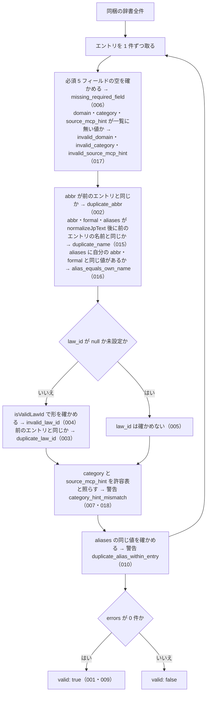

# validateAllEntries の仕様

<!-- GENERATED FILE — 手で編集しない。本文は houki-abbreviations の specs/current/validate_all_entries/spec.md の写し。 -->

::: info
houki-abbreviations **v0.7.0** の `specs/current/validate_all_entries/spec.md` から自動生成しました（仕様 ID 17 件・2026-10-10）。手で編集しないでください。再生成は `node scripts/generate-reference.mjs specs` です。
:::

同梱の辞書全件の整合性を検査し、エラーと警告の一覧を返す

使いどころ・引数・実測の呼び出し例は、[関数のページ](/reference/lib/houki-abbreviations/validate_all_entries)にあります。

最後に仕様が変わったのは v0.7.0 の「辞書の約束（名前の重なり・別名・告示）と、件数・近さの決め方」（2026-09-30 承認）です。それまでの経緯は[承認の履歴](#承認の履歴)にあります。

## 使う人と受け取るもの

この機能を誰が呼び、何を渡して何を受け取るかを示します。

- houki-abbreviations の辞書を編集する人と CI。辞書にエントリを足したり直したりしたあとで呼び、同梱の辞書全件に重複・欠損・形の誤りが無いかを受け取る
- `npm run validate`（`dist/index.js` の `validateAllEntries` を呼び、警告を `WARN:`、エラーを `ERROR:` で出力し、エラーがあれば終了コード 1 で終わる）

## 入力

呼び出すときに渡す値です。

引数は無い。検査するのは同梱の辞書全件（v0.6.0 では 174 件。`abbreviationEntries` と同じもの）。

## 戻り値

呼び出しが返す値です。

`ValidationReport`。

| フィールド | 型                  | 内容                                                           |
| ---------- | ------------------- | -------------------------------------------------------------- |
| `valid`    | `boolean`           | `errors` が 0 件なら `true`。警告があっても `true` のまま      |
| `errors`   | `ValidationIssue[]` | エラーの一覧（辞書の誤り。CI を失敗させる対象）。無ければ `[]` |
| `warnings` | `ValidationIssue[]` | 警告の一覧（CI を失敗させない不整合）。無ければ `[]`           |

`ValidationIssue`（エラーと警告で同じ型）。

| フィールド | 型                  | 内容                                                                                            |
| ---------- | ------------------- | ----------------------------------------------------------------------------------------------- |
| `code`     | `string`            | 種類を表す文字列。下の 2 つの表のどれか                                                         |
| `message`  | `string`            | 日本語の説明。該当する `abbr` や値を含む。例: `law_id の形式が不正です: 'INVALID'（abbr=消法）` |
| `entry`    | `AbbreviationEntry` | 問題のあったエントリ。すべてのエラーと警告に付く（型の上では省略可）                            |

エラーの種類（`errors` に入る）。

| `code`                    | 起きる条件                                                                                                                                                                                                                        | 仕様 ID |
| ------------------------- | --------------------------------------------------------------------------------------------------------------------------------------------------------------------------------------------------------------------------------- | ------- |
| `missing_required_field`  | `abbr` / `formal` / `domain` / `category` / `source_mcp_hint` のどれかが空（空文字・未設定）。欠けたフィールドごとに 1 件                                                                                                         | 006     |
| `invalid_domain`          | `domain` が空でなく、`DOMAINS` に無い値                                                                                                                                                                                           | 017     |
| `invalid_category`        | `category` が空でなく、`CATEGORIES` に無い値                                                                                                                                                                                      | 017     |
| `invalid_source_mcp_hint` | `source_mcp_hint` が空でなく、`SOURCE_MCP_HINTS` に無い値                                                                                                                                                                         | 017     |
| `duplicate_abbr`          | 同じ `abbr` のエントリが 2 件以上ある。2 件目以降に 1 件ずつ                                                                                                                                                                      | 002     |
| `duplicate_name`          | `abbr` / `formal` / `aliases` のどれかが、`normalizeJpText` を通した後で、別のエントリの `abbr` / `formal` / `aliases` のどれかと同じ。`abbr` どうしの重なりは `duplicate_abbr` だけにする。後のエントリに、重なる名前ごとに 1 件 | 015     |
| `alias_equals_own_name`   | `aliases` に、そのエントリの `abbr` か `formal` と同じ値がある。値ごとに 1 件                                                                                                                                                     | 016     |
| `invalid_law_id`          | `law_id` が `null` でも未設定でもなく、`isValidLawId` が `false`                                                                                                                                                                  | 004     |
| `duplicate_law_id`        | 同じ `law_id` のエントリが 2 件以上ある。2 件目以降に 1 件ずつ                                                                                                                                                                    | 003     |

警告の種類（`warnings` に入る）。

| `code`                         | 起きる条件                                               | 仕様 ID  |
| ------------------------------ | -------------------------------------------------------- | -------- |
| `category_hint_mismatch`       | `category` に対して `source_mcp_hint` が下の許容表に無い | 007・018 |
| `duplicate_alias_within_entry` | 1 件のエントリの `aliases` に同じ値が 2 回以上ある       | 010      |

v0.6.1 にあった警告 `alias_collides_with_abbr`（別名がほかのエントリの `abbr` と同じ）は、`duplicate_name` のエラーに含まれるので無くす。

`category_hint_mismatch` の許容表（`category` ごとに許す `source_mcp_hint`）。

| `category`                                                                                         | 許す `source_mcp_hint`     |
| -------------------------------------------------------------------------------------------------- | -------------------------- |
| `constitution` / `law` / `cabinet-order` / `imperial-ordinance` / `ministerial-ordinance` / `rule` | `houki-egov`               |
| `kokuji` / `kihon-tsutatsu` / `kobetsu-tsutatsu`                                                   | `houki-nta` / `houki-mhlw` |
| `qa-jirei` / `tax-answer`                                                                          | `houki-nta`                |
| `hanrei`                                                                                           | `houki-court`              |
| `saiketsu`                                                                                         | `houki-saiketsu`           |

## できないこと

この機能が引き受けないことです。

- 利用者が用意したエントリの配列を渡して検査すること（公開する `validateAllEntries` は引数を取らず、同梱の辞書だけを検査する）
- `law_id` の法令が e-Gov に実在するか、`formal` や `law_num` が e-Gov の値と一致するかを確かめること（e-Gov API を呼ぶ `scripts/verify-law-ids.mjs` で行う。パッケージには含まれない）
- `formal` の重複、`aliases` がほかのエントリの `formal` や `aliases` と同じことを見つけること（未決 3）
- `category` / `domain` / `source_mcp_hint` の値が決められた一覧にあるかを確かめること（未決 2）
- 誤りを直すこと（見つけて返すだけで、辞書は変えない）

## 処理の流れ

辞書のエントリを 1 件ずつ、次の順で確かめます。図の中の番号は「できること」の仕様 ID の末尾 3 桁です。

## 仕様 ID ごとの約束

この機能が守る約束を、仕様 ID ごとに並べています。見出しは約束を 1 文で表したもので、条件・応答の細部・例は「詳細」を開くと読めます。仕様 ID はそれぞれ受入テストと対応していて、テストの無い ID があると各リポジトリの CI が止まります。

### SPEC-ABBR-VALIDATE-ALL-ENTRIES-001 エラーが無ければ valid: true と空の errors を返す

::: details 詳細
どのエントリにもエラーの条件が当てはまらなければ、`valid: true` と `errors: []` を返す。

例: `{ abbr: "消法", formal: "消費税法", law_id: "363AC0000000108", domain: "tax", category: "law", source_mcp_hint: "houki-egov" }` 1 件だけの辞書なら `valid: true`、`errors: []`。
:::

### SPEC-ABBR-VALIDATE-ALL-ENTRIES-002 abbr の重複をエラーにする

::: details 詳細
同じ `abbr` のエントリが 2 件以上あれば、`code: "duplicate_abbr"` のエラーを返し、`valid` は `false`。

例: 上の `消法` のエントリと、`formal` だけを `別の法` にした `消法` のエントリの 2 件なら `valid: false` で、`errors` に `duplicate_abbr` がある。
:::

### SPEC-ABBR-VALIDATE-ALL-ENTRIES-003 law_id の重複をエラーにする

::: details 詳細
同じ `law_id` のエントリが 2 件以上あれば、`code: "duplicate_law_id"` のエラーを返す。`abbr` が違っても同じ。

例: `law_id: "363AC0000000108"` のエントリが `消法` と `別法` の 2 件あれば、`errors` に `duplicate_law_id` がある。
:::

### SPEC-ABBR-VALIDATE-ALL-ENTRIES-004 形の誤った law_id をエラーにする

::: details 詳細
`law_id` が値を持ち、`isValidLawId` が `false` を返す形なら、`code: "invalid_law_id"` のエラーを返す。受け付ける形は `isValidLawId` の仕様（[SPEC-ABBR-IS-VALID-LAW-ID-001](/specs/houki-abbreviations/is_valid_law_id#spec-abbr-is-valid-law-id-001)〜015）のとおり。

例: `law_id: "INVALID"` のエントリがあれば、`errors` に `invalid_law_id` がある。
:::

### SPEC-ABBR-VALIDATE-ALL-ENTRIES-005 law_id が null のエントリは law_id を確かめない

::: details 詳細
`law_id` が `null` のエントリ（通達など e-Gov に無いもの）は、`invalid_law_id` にも `duplicate_law_id` にもしない。

例: 上の `消法` のエントリの `law_id` を `null` にした 1 件なら `valid: true`。
:::

### SPEC-ABBR-VALIDATE-ALL-ENTRIES-006 必須フィールドの欠けをエラーにする

::: details 詳細
`abbr` / `formal` / `domain` / `category` / `source_mcp_hint` のどれかが空文字か未設定なら、欠けたフィールドごとに `code: "missing_required_field"` のエラーを返す。

例: `formal: ""` のエントリがあれば、`errors` に `missing_required_field` がある（`message` は `formal が空です（abbr=消法）`）。
:::

### SPEC-ABBR-VALIDATE-ALL-ENTRIES-007 category と source_mcp_hint の組み合わせの食い違いは警告にする

::: details 詳細
`category` に対して `source_mcp_hint` が「戻り値」の許容表に無ければ、`code: "category_hint_mismatch"` の警告を返す。エラーにはしないので、これだけなら `valid` は `true` のまま。

例: `category: "law"` で `source_mcp_hint: "houki-nta"` のエントリがあれば、`warnings` に `category_hint_mismatch` があり、`errors` には無い。
:::

### SPEC-ABBR-VALIDATE-ALL-ENTRIES-009 v0.6.0 の同梱辞書は全件エラーなし

::: details 詳細
v0.6.0 の同梱辞書 174 件を検査すると `valid: true` を返す（`errors` は 0 件。v0.6.0 では `warnings` も 0 件だが、テストが確かめるのは `valid` だけ）。辞書を変えたときにこれが崩れないことを、辞書の回帰の確認に使う。
:::

### SPEC-ABBR-VALIDATE-ALL-ENTRIES-010 1 件のエントリの中で重なる別名は警告にする

::: details 詳細
1 件のエントリの `aliases` に同じ値が 2 回あれば、`code: "duplicate_alias_within_entry"` の警告を返す。エラーにはしないので、これだけなら `valid` は `true` のまま。

例: `{ abbr: "A1", formal: "F1", law_id: null, domain: "tax", category: "law", source_mcp_hint: "houki-egov", aliases: ["Q", "Q"] }` 1 件なら、`valid: true`、`errors: []` で、`warnings` は `duplicate_alias_within_entry` の 1 件（`message` は `同一エントリ内で aliases が重複: 'Q'（abbr=A1）`）。
:::

### SPEC-ABBR-VALIDATE-ALL-ENTRIES-011 law_id が空文字なら形の誤りにする

::: details 詳細
`law_id: ""` は `null` と同じには扱わず、`code: "invalid_law_id"` のエラーを返す。

例: 上の `A1` のエントリの `aliases` を除き、`law_id` を `""` にした 1 件なら、`valid: false` で、`errors` は `invalid_law_id` の 1 件。
:::

### SPEC-ABBR-VALIDATE-ALL-ENTRIES-012 形の誤った law_id でも重なれば重複のエラーにする

::: details 詳細
形の誤った同じ `law_id` のエントリが 2 件あれば、`invalid_law_id` のエラーを 2 件（エントリごとに 1 件）と、`duplicate_law_id` のエラーを 1 件返す。

例: `law_id: ""` のエントリが `A1` と `A2` の 2 件なら、`errors` は `invalid_law_id`（`A1`）、`invalid_law_id`（`A2`）、`duplicate_law_id`（`A2`）の 3 件。
:::

### SPEC-ABBR-VALIDATE-ALL-ENTRIES-013 エラーと警告には問題のあったエントリが付く

::: details 詳細
`errors` と `warnings` のどの `ValidationIssue` にも `entry` が付き、問題のあったエントリそのもの（渡した配列の要素）を指す。`duplicate_abbr` と `duplicate_law_id` では、重なったうちの 2 件目以降のエントリを指す。

例: `formal: ""` の `A1` のエントリ 1 件なら、`missing_required_field` のエラーの `entry` は渡したそのエントリ。同じ内容の `A1` のエントリを 2 件渡せば、`duplicate_abbr` のエラーの `entry` は 2 件目のエントリ。
:::

### SPEC-ABBR-VALIDATE-ALL-ENTRIES-014 エラーと警告の message に該当エントリの abbr が入る

::: details 詳細
`ValidationIssue` の `message` は、該当エントリの `abbr` が空でなければ、その `abbr` を含む。文言そのものは約束にしない。

例: `law_id: "INVALID"` の `A1` のエントリなら、`invalid_law_id` のエラーの `message` に `A1` が入る。`A1` のエントリと、`aliases: ["A1"]` を持つ `B1` のエントリの 2 件なら、`duplicate_name` のエラーの `message` に `B1` が入る。
:::

### SPEC-ABBR-VALIDATE-ALL-ENTRIES-015 別のエントリと重なる名前をエラーにする

::: details 詳細
あるエントリの `abbr` / `formal` / `aliases` のどれかが、`normalizeJpText` を通した後で、別のエントリの `abbr` / `formal` / `aliases` のどれかと同じなら、`code: "duplicate_name"` のエラーを返し、`valid` は `false`。`entry` は後のエントリ。`abbr` どうしが同じときは `duplicate_abbr` だけを返し、`duplicate_name` は返さない。

例: `{ abbr: "A1", formal: "F" }` と `{ abbr: "A2", formal: "F" }`（ほかのフィールドは正しい値）の 2 件なら、`errors` は `duplicate_name` の 1 件で `entry` は `A2`（v0.6.1 では `valid: true`）。`A1` のエントリと `aliases: ["A1"]` を持つ `B1` の 2 件なら、`duplicate_name` の 1 件（v0.6.1 では警告 `alias_collides_with_abbr`）。`aliases: ["PL法"]` の `A1` と `aliases: ["ＰＬ法"]` の `A2` の 2 件も `duplicate_name`（半角にすると同じ）。同じ `abbr: "A1"` の 2 件なら `duplicate_abbr` の 1 件だけ。
:::

### SPEC-ABBR-VALIDATE-ALL-ENTRIES-016 自分の abbr・formal と同じ別名をエラーにする

::: details 詳細
あるエントリの `aliases` に、そのエントリの `abbr` か `formal` と同じ値があれば、`code: "alias_equals_own_name"` のエラーを返し、`valid` は `false`。

例: `{ abbr: "消基通", formal: "消費税法基本通達", aliases: ["消費税法基本通達"] }`（ほかのフィールドは正しい値）1 件なら、`errors` は `alias_equals_own_name` の 1 件（v0.6.1 では `valid: true`、`warnings: []`）。`{ abbr: "民", formal: "民法", aliases: ["民"] }` も同じ。`{ abbr: "酒税法", formal: "酒税法" }`（`aliases` なし）はエラーにしない。
:::

### SPEC-ABBR-VALIDATE-ALL-ENTRIES-017 一覧に無い domain・category・source_mcp_hint をエラーにする

::: details 詳細
`domain` が `DOMAINS` に無い値なら `invalid_domain`、`category` が `CATEGORIES` に無い値なら `invalid_category`、`source_mcp_hint` が `SOURCE_MCP_HINTS` に無い値なら `invalid_source_mcp_hint` のエラーを返す。空文字・未設定は `missing_required_field` にし、この 3 つにはしない。

例: `{ abbr: "A1", formal: "F1", law_id: null, domain: "x", category: "foo", source_mcp_hint: "houki-zzz" }` 1 件なら、`valid: false` で、`errors` は `invalid_domain`・`invalid_category`・`invalid_source_mcp_hint` の 3 件（v0.6.1 では `valid: true`）。`category: ""` なら `missing_required_field` の 1 件で、`invalid_category` は返さない。
:::

### SPEC-ABBR-VALIDATE-ALL-ENTRIES-018 kokuji の source_mcp_hint は houki-nta か houki-mhlw

::: details 詳細
`category` が `kokuji` のエントリの `source_mcp_hint` が `houki-nta` でも `houki-mhlw` でもなければ、`code: "category_hint_mismatch"` の警告を返す。エラーにはしない。

例: `category: "kokuji"` で `source_mcp_hint: "houki-egov"` のエントリがあれば、`warnings` に `category_hint_mismatch` があり、`errors` には無い（e-Gov 法令 API は告示を持たない）。`source_mcp_hint: "houki-nta"` なら警告は無い。
:::

## まだ決めていないこと

仕様を書き起こしたときに見つかった項目のうち、扱いを決めている途中のものです。開くと、元の仕様書の記述をそのまま読めます。

::: details 仕様書の「未決」の節
初版起こしで見つけた、意図か不具合かを人が決める項目です。決まったら「できること」に ID を振るか、`specs/changes/` の差分にします。

意図か不具合かの判断が要る項目は houki-abbreviations の Issue に移し、ここには題と Issue の番号だけを残します。今の振る舞いのままでよくテストが無いだけの項目は、受入テストを書いてから「できること」に ID を振ります。

1. **`duplicate_alias_within_entry` の警告。** → [SPEC-ABBR-VALIDATE-ALL-ENTRIES-010](#spec-abbr-validate-all-entries-010)
2. **一覧に無い `category` を見逃す。** → [SPEC-ABBR-VALIDATE-ALL-ENTRIES-017](#spec-abbr-validate-all-entries-017)
3. **`formal` や別名どうしの重複を見逃す。** → [SPEC-ABBR-VALIDATE-ALL-ENTRIES-015](#spec-abbr-validate-all-entries-015)
4. **自分の `abbr` や `formal` と同じ別名を見逃す。** → [SPEC-ABBR-VALIDATE-ALL-ENTRIES-016](#spec-abbr-validate-all-entries-016)
5. **`law_id` が空文字のとき。** → [SPEC-ABBR-VALIDATE-ALL-ENTRIES-011](#spec-abbr-validate-all-entries-011)、[SPEC-ABBR-VALIDATE-ALL-ENTRIES-012](#spec-abbr-validate-all-entries-012)
6. **`message` の文言と `entry` の有無。** → [SPEC-ABBR-VALIDATE-ALL-ENTRIES-013](#spec-abbr-validate-all-entries-013)、[SPEC-ABBR-VALIDATE-ALL-ENTRIES-014](#spec-abbr-validate-all-entries-014)
7. **`npm run validate` を CI で呼んでいない。** → houki-abbreviations #17
:::

## 承認の履歴

この機能の仕様が、いつ、どの変更で承認されたかを新しい順に並べています。各リポジトリの `npx spec-ids history validate_all_entries` と同じ内容です。変更の名前から、変更の理由と前後の振る舞いを書いた文書（GitHub）を開けます。

::: details 承認の履歴（4 件）
| 承認日 | 版 | 変更 | 仕様 PR |
|---|---|---|---|
| 2026-09-30 | v0.7.0 | [辞書の約束（名前の重なり・別名・告示）と、件数・近さの決め方](https://github.com/shuji-bonji/houki-abbreviations/blob/v0.7.0/specs/releases/v0.7.0/20261001-dictionary-rules/proposal.md) | [#32](https://github.com/shuji-bonji/houki-abbreviations/pull/32) |
| 2026-09-27 | v0.6.1 | [テストが無いだけの振る舞いに仕様 ID を振る](https://github.com/shuji-bonji/houki-abbreviations/blob/v0.7.0/specs/releases/v0.6.1/20260927-untested-behaviors/proposal.md) | [#27](https://github.com/shuji-bonji/houki-abbreviations/pull/27) |
| 2026-09-27 | v0.6.1 | [「未決」のうち判断が要る 52 件を Issue に移す](https://github.com/shuji-bonji/houki-abbreviations/blob/v0.7.0/specs/releases/v0.6.1/20260927-undecided-to-issues/proposal.md) | [#26](https://github.com/shuji-bonji/houki-abbreviations/pull/26) |
| 2026-09-27 | — | 初版 | [#10](https://github.com/shuji-bonji/houki-abbreviations/pull/10) |
:::

## 関連ページ

このページの元になった文書と、あわせて読むページです。

- [houki-abbreviations の仕様の一覧](/specs/houki-abbreviations/)
- [houki-abbreviations の解説](/lib/houki-abbreviations)
- [validateAllEntries の関数のページ（リファレンス）](/reference/lib/houki-abbreviations/validate_all_entries)
- [元の仕様書（GitHub、v0.7.0）](https://github.com/shuji-bonji/houki-abbreviations/blob/v0.7.0/specs/current/validate_all_entries/spec.md)
