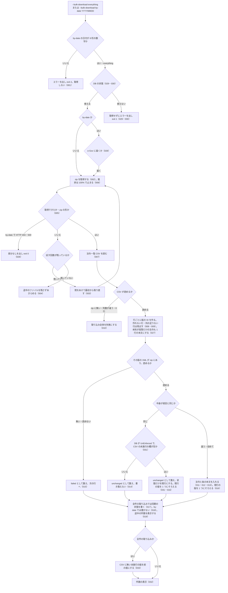

# cli_bulk_download の仕様

<!-- GENERATED FILE — 手で編集しない。本文は houki-egov-mcp の specs/current/cli_bulk_download/spec.md の写し。 -->

::: info
houki-egov-mcp **v0.20.1** の `specs/current/cli_bulk_download/spec.md` から自動生成しました（仕様 ID 33 件・2026-10-10）。手で編集しないでください。再生成は `node scripts/generate-reference.mjs specs` です。
:::

e-Gov の一括ダウンロードの zip を取得してローカル DB に取り込む

最後に仕様が変わったのは v0.20.0 の「ローカル DB の場所を、応答・起動時のログ・`--status` で確かめられるようにする（egov #108・#110、T6）」（2026-10-04 承認）です。それまでの経緯は[承認の履歴](#承認の履歴)にあります。

## 利用者と得られる結果

この機能の利用者と、利用者が渡すもの・得られる結果を示します。

- 利用者（ターミナルから `houki-egov-mcp --bulk-download-everything` または `--bulk-download-by-date YYYYMMDD` を実行する人）。e-Gov 法令の一括ダウンロード（`https://laws.e-gov.go.jp/bulkdownload`）から zip を取得し、ローカル DB に法令と条の本文を入れる。入れた DB は `search_fulltext` などのツールが引く

## 入力

呼び出すときに渡す値です。

| フラグ・環境変数                   | 必須          | 内容                                                                                              |
| ---------------------------------- | ------------- | ------------------------------------------------------------------------------------------------- |
| `--bulk-download-everything`       | どちらか 1 つ | 全件の zip（約 290 MB）を取得して取り込む。初回と、最終同期から差分で追える日数を超えたときに使う |
| `--bulk-download-by-date YYYYMMDD` | どちらか 1 つ | 指定した 1 日分の差分の zip を取得して取り込む（デバッグ用）。日付は 8 桁の数字                   |
| `HOUKI_EGOV_DB_PATH`               | 任意          | DB ファイルの場所。既定は `${XDG_CACHE_HOME:-~/.cache}/houki-egov-mcp/laws.db`                    |
| `HOUKI_EGOV_BULK_RETRY`            | 任意          | 取得に失敗したときに試す回数（1 以上の整数。既定 3。不正な値は [SPEC-EGOV-CLI-ENTRY-010](/specs/houki-egov/cli_entry#spec-egov-cli-entry-010) のエラー） |

## 扱わないこと

この機能が意図して扱わないことです。

- 途中から取得を再開すること（e-Gov が範囲指定に応じないため、失敗したら最初から取り直す）
- カテゴリ別の zip（`file_section=2`）を取得すること
- 前の版・廃止を e-Gov の履歴から正確に判定すること（現行・未施行は CSV の未施行の欄から、前の版は [SPEC-EGOV-CLI-BULK-DOWNLOAD-016](#spec-egov-cli-bulk-download-016) と 033 で決めるだけ。廃止は扱わない）
- 法令の分類（カテゴリ）や改正法令の公布日を取り込むこと（CSV・XML から取らない）
- 取り込み済みの法令のうち、zip に無くなったものを消すこと
- `--bulk-download-by-date` で同期の状態（`last_sync_date` など）を進めること（[SPEC-EGOV-CLI-BULK-DOWNLOAD-018](#spec-egov-cli-bulk-download-018)。最新化は `--sync`）

## 処理の流れ

実行してから終わるまでに、何をどの順で行うかを示します。図の中の番号は「できること」の仕様 ID の末尾 3 桁です。



## 仕様項目

この機能の仕様項目を、仕様 ID ごとに並べています。見出しは仕様項目を 1 文で表したもので、条件・応答の細部・例は「詳細」を開くと読めます。仕様 ID はそれぞれ受入テストと対応していて、テストの無い ID があると各リポジトリの CI が止まります。

<a id="spec-egov-cli-bulk-download-001"></a>

### SPEC-EGOV-CLI-BULK-DOWNLOAD-001 `--bulk-download-by-date` は 8 桁の日付が無ければ取りに行かない

::: details 詳細
`--bulk-download-by-date` の次の引数が無いとき、または 8 桁の数字でない（例: `2026-05-07`）ときは、標準エラー出力に `ERROR: --bulk-download-by-date は YYYYMMDD 形式の日付を必要とします (例: 20260507)` を出し、何も取得せずに終了コード 2 で終わる。
:::

<a id="spec-egov-cli-bulk-download-002"></a>

### SPEC-EGOV-CLI-BULK-DOWNLOAD-002 取得先の URL

::: details 詳細
- `--bulk-download-everything` は `https://laws.e-gov.go.jp/bulkdownload?file_section=1&only_xml_flag=true`（全件）を取得する
- `--bulk-download-by-date YYYYMMDD` は `https://laws.e-gov.go.jp/bulkdownload?file_section=3&update_date=YYYYMMDD&only_xml_flag=true`（その日の差分）を取得する
:::

<a id="spec-egov-cli-bulk-download-003"></a>

### SPEC-EGOV-CLI-BULK-DOWNLOAD-003 取得に失敗したら最初から取り直す

::: details 詳細
通信の失敗、2xx 以外の HTTP 応答（例: 503）、zip の形でない応答のときは、途中まで取ったものを捨て、間をあけて（1 秒、2 秒、4 秒…と倍にする）最初から取り直す。試す回数は `HOUKI_EGOV_BULK_RETRY`（既定 3）までで、途中で成功すればそれを使う。
:::

<a id="spec-egov-cli-bulk-download-004"></a>

### SPEC-EGOV-CLI-BULK-DOWNLOAD-004 試す回数を使い切ったら、途中のファイルを残さずにあきらめる

::: details 詳細
[SPEC-EGOV-CLI-BULK-DOWNLOAD-003](#spec-egov-cli-bulk-download-003) の回数をすべて失敗したときは取得をあきらめ、取り込みに進まない。保存先に zip も途中のファイルも残さない。
:::

<a id="spec-egov-cli-bulk-download-005"></a>

### SPEC-EGOV-CLI-BULK-DOWNLOAD-005 zip の形であることを確かめてから取り込みに進む

::: details 詳細
取得したファイルの先頭 4 バイトが zip の印（`PK\x03\x04`）のときだけ取り込みに進む。先頭が違うとき、または 4 バイトに満たないときは、zip の形でないという失敗として扱い、途中のファイルを残さない。
:::

<a id="spec-egov-cli-bulk-download-006"></a>

### SPEC-EGOV-CLI-BULK-DOWNLOAD-006 取得の進捗は 100% を超えない

::: details 詳細
取得中は、取得したバイト数と推定の総バイト数（全件は約 290 MB、1 日分の差分は約 5 MB）に対する割合を表示する。e-Gov は総バイト数を返さないので推定と実際がずれるが、割合は 100% で止まり、取得が終わった時点の表示は 100% である。
:::

<a id="spec-egov-cli-bulk-download-007"></a>

### SPEC-EGOV-CLI-BULK-DOWNLOAD-007 e-Gov の法令一覧 CSV を読む

::: details 詳細
zip に入っている法令一覧 CSV（14 列）を次のとおり読む。

- 先頭の BOM を除く
- 行の終わりは CRLF でも LF でもよい。最後の行に改行が無くても取り込む。空行は飛ばす
- `"` で囲んだ欄の中のコンマ・改行・`""`（`"` 1 文字）は欄の一部として扱う（例: 旧法令名が複数並ぶ欄）
- 未施行の欄の `○` は「未施行」と読む
- 行は CSV の並びのとおりに扱う
:::

<a id="spec-egov-cli-bulk-download-008"></a>

### SPEC-EGOV-CLI-BULK-DOWNLOAD-008 CSV の本文 URL から版の ID を作り、zip の XML と対応させる

::: details 詳細
CSV の本文 URL（`https://laws.e-gov.go.jp/law/<法令ID>/<施行日>_<改正法令ID>`）から、版の ID `<法令ID>_<施行日>_<改正法令ID>` を作る。改正の無い法令の改正法令ID は `000000000000000`。英数字の混ざる改正法令ID（例: `126M10000001002`）も読む。URL の末尾のクエリ・フラグメント・スラッシュは無視する。zip の中の `<版の ID>.xml` を、その行の法令の本文として取り込む（フォルダーの中にあってもよい）。
:::

<a id="spec-egov-cli-bulk-download-009"></a>

### SPEC-EGOV-CLI-BULK-DOWNLOAD-009 形の合わない CSV の行は飛ばして残りを取り込む

::: details 詳細
列の数が足りない行と、本文 URL が上の形でなく版の ID を作れない行は、その行だけを飛ばし、残りの行を取り込む。
:::

<a id="spec-egov-cli-bulk-download-010"></a>

### SPEC-EGOV-CLI-BULK-DOWNLOAD-010 CSV が使えないときは取り込み全体を失敗にする

::: details 詳細
次のときは法令を 1 件も取り込まずに失敗する。

- zip に CSV が無い
- CSV の見出しの行が 14 列でない
- CSV を読んだ結果が 0 行（空の CSV を含む）
:::

<a id="spec-egov-cli-bulk-download-011"></a>

### SPEC-EGOV-CLI-BULK-DOWNLOAD-011 取り込む法令の情報

::: details 詳細
1 つの版について、XML から法令名・法令番号・法令名の読み・略称（XML にあれば。無ければ空）・法令種別（例: `CabinetOrder`）を、CSV から版の ID・法令ID・施行日（`YYYY-MM-DD`）・未施行かどうかを取り込む。公布日は XML の `Law` の元号（`Era`）・年（`Year`）・月（`PromulgateMonth`）・日（`PromulgateDay`）から西暦の `YYYY-MM-DD` にする（例: 明治 5 年 11 月 9 日 → `1872-11-09`）。次のときは公布日を作れないので `NULL` にする（[SPEC-EGOV-DB-SCHEMA-027](/specs/houki-egov/db_schema#spec-egov-db-schema-027)）。

- 元号・年・月・日のどれかが XML に無い
- 元号が `Meiji`・`Taisho`・`Showa`・`Heisei`・`Reiwa` のどれでもない
- 年が 1 以上の整数でない

未施行の欄が `○` の版は「未施行」（`UnEnforced`）、それ以外は「現行」（`CurrentEnforced`）として入る。施行日が取り込んだ日（日本時間）より後でも、未施行の欄が空なら「現行」として入る（e-Gov の CSV の欄に従い、施行日と今日を比べない）。同じ版が後の zip で未施行の欄を空にして届いたときは [SPEC-EGOV-CLI-BULK-DOWNLOAD-031](#spec-egov-cli-bulk-download-031) のとおり状態を書き換える。CSV に複数の法令があれば全部を入れる。

例: `PromulgateDay` の無い XML の法令は `promulgation_date` が `NULL`（v0.18.x では `0001-01-01`）。`Era="Meiji" Year="05" PromulgateMonth="11" PromulgateDay="09"` は `1872-11-09`。

例: e-Gov は施行日の前日の差分に、未施行の欄を空にした版を入れることがある（2026-09-30 の差分に、施行日 2026-10-01 の版が 34 件。houki-egov-mcp #107 の本文、2026-10-04 JST の実測）。この版を 2026-09-30 に取り込むと `CurrentEnforced` になり、同じ法令の施行日がより前の現行の版は `PreviousEnforced` になる（[SPEC-EGOV-CLI-BULK-DOWNLOAD-016](#spec-egov-cli-bulk-download-016)）。`search_fulltext` は施行日の 1 日前から新しい版の条文を返す。
:::

<a id="spec-egov-cli-bulk-download-012"></a>

### SPEC-EGOV-CLI-BULK-DOWNLOAD-012 条ごとの本文を取り込む

::: details 詳細
XML の条（`Article`）を 1 つずつ、条番号・条の見出し（例: `（目的）`）・編章節の見出しの並び・本文とともに取り込む。

- 編章節の見出しの並びは空白 1 つでつなぐ（例: `第一編　総則 第一章　通則`、`第二章　預金保険機構 第一節　総則`）。編（`Part`）の下にある条も拾う
- 枝番号の条の番号は `_` でつなぐ（例: 第一条の二 → `1_2`）
- 本文には項・号・号の細分の文を含む。条の見出し・条名（例: `第二条`）・目次は含まない
- 附則の条は、番号を `Suppl<附則の順番>_<条番号>`（例: `Suppl1_1`）、編章節の見出しを附則の見出し（例: `附　則`）にして取り込む
- 条を持たず段落（`Paragraph`）だけの附則は、その附則の段落の文を改行でつないで 1 行にし、番号を `Suppl<附則の順番>_intro`、条の見出しを `NULL`、編章節の見出しを附則の見出し（例: `附　則`）にして取り込む。附則に条が 1 つでもあれば、その附則の直下の段落はこの行にしない
- 別表は、番号を `Appendix<別表の順番>`（例: `Appendix1`）、見出しを別表の題（例: `別表第一（第三条関係）`）にして取り込む。題は本文に含まない

例: 獣医師法施行規則（`324M50010000093`）の 2 番目の附則（`AmendLawNum="昭和二八年八月三一日農林省令第五一号"`）は `<Paragraph Num="1">` だけで、`article_num: "Suppl2_intro"`、`caption: NULL`、`chapter_path: "附　則"`、`body_raw: "この省令は、昭和二十八年九月一日から施行する。"` の行になる。7 番目の附則は `<Article Num="1">` を持つので `Suppl7_1` の行になる（2026-10-03 JST に e-Gov 法令 API v2 の XML で確かめた）。v0.18.x では段落だけの附則の行の条の見出しに附則の見出し（`附　則`）を入れていた（#101）。
:::

<a id="spec-egov-cli-bulk-download-013"></a>

### SPEC-EGOV-CLI-BULK-DOWNLOAD-013 本文は検索用にそろえたものと原文の両方を持つ

::: details 詳細
条の本文と、法令名・読み・略称・法令番号は、全角の英数字・記号・空白を半角にそろえたもの（例: `第１２条　ＰＬ法－２` → `第12条 PL法-2`）で全文検索の索引に入れる。表示に使う条の本文と法令名は原文のまま持つ。取り込んだ法令は、条の本文の語（例: `預金者`）でも、法令名や略称（例: `預保法`）でも索引から引ける。
:::

<a id="spec-egov-cli-bulk-download-014"></a>

### SPEC-EGOV-CLI-BULK-DOWNLOAD-014 中身が前回と同じ法令は書き換えない

::: details 詳細
同じ版の ID の法令を前に取り込んでいて、XML の中身が同じときは、その法令の情報と条の本文を書き換えず（取得日時も前回のまま）、`unchanged` として数える。ただし、DB の状態が未施行（`UnEnforced`）で、今回の CSV の未施行の欄が空のときは、状態だけを書き換える（[SPEC-EGOV-CLI-BULK-DOWNLOAD-031](#spec-egov-cli-bulk-download-031)。このときも `unchanged` として数える）。XML の中身が変わっていれば、法令の情報を更新し、その版の条の本文をすべて入れ替え、`upsert` として数える。取り込みのしかた（XML の読み方や文字のそろえ方）が変わった版の houki-egov-mcp で `--bulk-download-everything` をやり直すと、XML が同じでも全件を入れ直す。

例: 同じ zip を 2 回取り込むと、2 回目は全件が `unchanged` で、法令の取得日時（`fetched_at`）も条の本文も 1 回目のまま。
:::

<a id="spec-egov-cli-bulk-download-015"></a>

### SPEC-EGOV-CLI-BULK-DOWNLOAD-015 XML が無い・読めない法令は数えて飛ばす

::: details 詳細
- zip にあって CSV に無い XML は取り込まない
- CSV の行に対応する XML が zip に無いときと、XML が読めないとき（根が `<Law>` でない、`LawBody` が無い、`LawNum` が無いか空、XML として壊れている）は、その法令を `failed` として数え、残りの法令の取り込みは続ける
:::

<a id="spec-egov-cli-bulk-download-016"></a>

### SPEC-EGOV-CLI-BULK-DOWNLOAD-016 同じ法令の現行の版は、施行日が最も新しい 1 つだけにする

::: details 詳細
現行の版を取り込むとき、同じ法令ID に施行日がそれより前の現行の版があれば、それを「前の版」（`PreviousEnforced`）にする。逆に、施行日がより新しい現行の版がすでにあれば、取り込んだ版のほうを「前の版」にする。[SPEC-EGOV-CLI-BULK-DOWNLOAD-031](#spec-egov-cli-bulk-download-031) で状態だけを現行にした版も、取り込んだ現行の版として同じように比べる。1 つの zip の中で同じ法令の新しい版が先、古い版が後に並んでいても、新しい版が現行として残る。未施行の版を取り込んでも、現行の版はそのまま残る。施行日の無い版はこの比較をしない。

例: 医師法施行規則（`323M40000100047`）の `…_20260917_508M60000100132` が `UnEnforced`、`…_20260814_508M60000100128` が `CurrentEnforced` の DB に、2026-09-17 の差分で `…_20260917_…` が XML を変えずに未施行の欄を空にして届くと、`…_20260917_…` が `CurrentEnforced`、`…_20260814_…` が `PreviousEnforced` になる（[SPEC-EGOV-CLI-BULK-DOWNLOAD-031](#spec-egov-cli-bulk-download-031) の例の 2 段目）。
:::

<a id="spec-egov-cli-bulk-download-017"></a>

### SPEC-EGOV-CLI-BULK-DOWNLOAD-017 全件の取り込みの後の同期の状態

::: details 詳細
`--bulk-download-everything` の取り込みが終わると、同期の状態（`--status` と `--sync` が読むもの）を次にする。基準の時刻は、全件の zip の取得を始めた時刻である。

- `last_sync_date`: 取得を始めた時刻の日本時間の日付（`YYYY-MM-DD`）
- `last_full_dl_at`: 取得を始めた時刻（ISO 8601、UTC の `Z` 付き）
- 法令の総数: CSV の行数
- 取り込み元: `all_xml`

例: 日本時間 2026-10-03 08:30（UTC 2026-10-02 23:30）に取得を始めると、`last_sync_date` は `2026-10-03`、`last_full_dl_at` は `2026-10-02T23:30:00.000Z`（ミリ秒は取得を始めた時刻のまま）。v0.18.x では取り込みを始めた時刻の UTC の日付を使ったので、日本時間の 0 時〜9 時に実行すると `last_sync_date` が前日になり、次の `--sync` が 1 日余分に確かめていた（#58）。
:::

<a id="spec-egov-cli-bulk-download-018"></a>

### SPEC-EGOV-CLI-BULK-DOWNLOAD-018 1 日分の差分の取り込みでは、同期の状態を変えない

::: details 詳細
`--bulk-download-by-date` は、同期の状態（`sync_state` の行）を作らず、書き換えない。`last_sync_date`・`last_full_dl_at`・法令の総数・取り込み元は、実行する前の値のまま残る。指定した日の差分を取り込んでも、その前後の日の差分を取り込んだことにはならないので、最新化の起点（`last_sync_date`）を動かさない。

例: `last_sync_date` が `2026-09-19` の DB で、2026-10-03 に `--bulk-download-by-date 20260801` を実行して法令 1 件を取り込むと、`last_sync_date` は `2026-09-19` のまま（v0.18.x では実行した日の `2026-10-03` になり、次の `--sync` が 9 月 20 日から 10 月 2 日までの差分を取り込まないまま最新と扱っていた。#58）。同期の状態が無い DB で実行しても、`sync_state` は 0 行のまま。
:::

<a id="spec-egov-cli-bulk-download-019"></a>

### SPEC-EGOV-CLI-BULK-DOWNLOAD-019 取り込みの途中で件数を表示する

::: details 詳細
`--bulk-download-everything` の取り込み中は、まとめて書き込むたびに、読んだ法令の数と CSV の行数（`ingest: <読んだ数> / <CSV の行数> laws`）を表示する。最後の表示で読んだ数は、XML を読めた法令の数に達する。
:::

<a id="spec-egov-cli-bulk-download-020"></a>

### SPEC-EGOV-CLI-BULK-DOWNLOAD-020 全件の取り込みが終わると、経過を標準エラー出力に出して exit 0

::: details 詳細
`--bulk-download-everything` の取得と取り込みが終わると、終了コード 0 で終わる。経過は標準エラー出力に次の順で出し、標準出力には何も出さない。

1. `[bulk-download-everything] 全件 zip を取得します`
2. `  保存先 zip: <一時フォルダーの中の all_xml.zip>`、`  DB:         <DB ファイルの場所>`
3. `[1/2] zip ダウンロード中...`
4. `  DL 完了: <サイズ> / <時間> / attempts=<試した回数>`
5. `[2/2] DB に ingest 中...`
6. `  ingest 完了: <n> 件 upsert[, <n> 件 unchanged][, <n> 件 failed] (<時間>)`（`unchanged` と `failed` は 0 件なら出さない）
7. `[完了] 全体 <時間>`

例: 法令一覧 CSV に 2 行あり、1 行は XML を読める法令（条 2 つ）、1 行は壊れた XML（`<Law><broken`）の zip を取得したとき、`  DL 完了: 2.2 KB / <時間> / attempts=1`、`  ingest 完了: 1 件 upsert, 1 件 failed (<時間>)`、`[完了] 全体 <時間>` を出して終了コード 0。
:::

<a id="spec-egov-cli-bulk-download-021"></a>

### SPEC-EGOV-CLI-BULK-DOWNLOAD-021 1 日分の差分の取り込みが終わると、経過を標準エラー出力に出して exit 0

::: details 詳細
`--bulk-download-by-date YYYYMMDD` の取得と取り込みが終わると、終了コード 0 で終わる。経過は標準エラー出力に次の順で出し、標準出力には何も出さない。

1. `[bulk-download-by-date] update_date=<YYYYMMDD> の差分 zip を取得します`
2. `  保存先 zip: <一時フォルダーの中の R<YYMMDD>.zip>`、`  DB:         <DB ファイルの場所>`
3. `[1/2] 差分 zip ダウンロード中...`
4. `  DL 完了: <サイズ> / <時間>`（全件と違い、試した回数は出さない）
5. `[2/2] DB に ingest 中...`
6. `  ingest 完了: <n> 件 upsert[, <n> 件 unchanged][, <n> 件 failed] (<時間>)`

例: `--bulk-download-by-date 20260917` で、法令 1 件の zip を取得すると、保存先 zip の名前は `R260917.zip`、`  ingest 完了: 1 件 upsert (<時間>)` を出して終了コード 0。
:::

<a id="spec-egov-cli-bulk-download-022"></a>

### SPEC-EGOV-CLI-BULK-DOWNLOAD-022 取得か取り込みに失敗したら `[ERROR]` を出して exit 1

::: details 詳細
`--bulk-download-everything` と `--bulk-download-by-date` は、取得（[SPEC-EGOV-CLI-BULK-DOWNLOAD-004](#spec-egov-cli-bulk-download-004) であきらめたとき）または取り込み（[SPEC-EGOV-CLI-BULK-DOWNLOAD-010](#spec-egov-cli-bulk-download-010) など）に失敗したとき、標準エラー出力に `[ERROR] <エラーの文>` を出して終了コード 1 で終わる。

例: `HOUKI_EGOV_BULK_RETRY=1` で、`--bulk-download-everything` の取得に HTTP 503 が返ると、`[ERROR] HTTP 503 <応答の statusText> from https://laws.e-gov.go.jp/bulkdownload?file_section=1&only_xml_flag=true` を出して終了コード 1（statusText が空なら `HTTP 503` と `from` の間は空白 2 つ）。
:::

<a id="spec-egov-cli-bulk-download-023"></a>

### SPEC-EGOV-CLI-BULK-DOWNLOAD-023 成功しても失敗しても、一時フォルダーの zip を消す

::: details 詳細
`--bulk-download-everything` と `--bulk-download-by-date` は、zip を OS の一時フォルダー（`TMPDIR` など）の下に作ったフォルダー（`houki-egov-bulk-…` / `houki-egov-diff-…`）に保存し、終わるときに、成功（終了コード 0）でも失敗（終了コード 1）でもそのフォルダーごと消す。

例: `TMPDIR` を空のフォルダーにして `--bulk-download-everything` を実行すると、取得と取り込みが成功したときも、取得に HTTP 503 が返って終了コード 1 で終わったときも、終わった後の `TMPDIR` は空のまま。
:::

<a id="spec-egov-cli-bulk-download-024"></a>

### SPEC-EGOV-CLI-BULK-DOWNLOAD-024 `HOUKI_EGOV_DB_PATH` の場所に DB を作り、無いフォルダーは作る

::: details 詳細
`HOUKI_EGOV_DB_PATH` を指定したときは、その場所の DB に取り込む。途中のフォルダーが無ければ作る。

例: `HOUKI_EGOV_DB_PATH=<空のフォルダー>/a/b/laws.db` で `--bulk-download-everything` が成功すると、`a/b` のフォルダーと `laws.db` ができ、経過の `  DB:         ` の行にその場所が出る。
:::

<a id="spec-egov-cli-bulk-download-025"></a>

### SPEC-EGOV-CLI-BULK-DOWNLOAD-025 `HOUKI_EGOV_DB_PATH` が無ければ `XDG_CACHE_HOME` の下に DB を作る

::: details 詳細
`HOUKI_EGOV_DB_PATH` を指定せず `XDG_CACHE_HOME` を指定したときは、`<XDG_CACHE_HOME>/houki-egov-mcp/laws.db` に取り込む。`houki-egov-mcp` のフォルダーが無ければ作る。どちらも指定しないときは `~/.cache/houki-egov-mcp/laws.db` に取り込む。

例: `XDG_CACHE_HOME=<空のフォルダー>/xdg` で `--bulk-download-everything` が成功すると、`<空のフォルダー>/xdg/houki-egov-mcp/laws.db` ができる。
:::

<a id="spec-egov-cli-bulk-download-026"></a>

### SPEC-EGOV-CLI-BULK-DOWNLOAD-026 XML に法令種別が無いときは CSV の和文の種別から決める

::: details 詳細
XML の `Law` に `LawType` が無い（または空の）ときは、法令一覧 CSV の法令種別の欄から法令種別を決める。

| CSV の法令種別 | 法令種別               |
| -------------- | ---------------------- |
| `法律`         | `Act`                  |
| `政令`         | `CabinetOrder`         |
| `閣令`         | `CabinetOrder`         |
| `勅令`         | `ImperialOrder`        |
| `府省令`       | `MinisterialOrdinance` |
| `省令`         | `MinisterialOrdinance` |
| `規則`         | `Rule`                 |
| 上のどれでもない（空を含む） | `Act`    |

XML に `LawType` があるときは、CSV の欄によらず XML の値を使う。

例: `LawType` の無い XML で、CSV の法令種別が `勅令` なら `ImperialOrder`、`条約` なら `Act`。XML に `LawType="Rule"` があれば、CSV が `法律` でも `Rule`。
:::

<a id="spec-egov-cli-bulk-download-027"></a>

### SPEC-EGOV-CLI-BULK-DOWNLOAD-027 本則が段落だけの法令は、本則の段落を 1 行の本文として取り込む

::: details 詳細
XML の本則（`MainProvision`）が条（`Article`）を持たず段落（`Paragraph`）だけのときは、本則のすべての段落の文を改行でつないで、1 行の本文として取り込む。条番号は `MainProvision`、条の見出しと編章節の見出しは `NULL`。本文は [SPEC-EGOV-CLI-BULK-DOWNLOAD-013](#spec-egov-cli-bulk-download-013) と同じく、検索用にそろえたものと原文の両方を持つ。本則に条が 1 つでもあれば、今までどおり条ごとに取り込み、この行は作らない。

例: 改暦ノ布告（`105DF0000000337`）の本則は `<Paragraph>` 1 つ（`今般改暦ノ儀別紙　詔書ノ通被　仰出候条此旨相達候事`）だけで、`article_num: "MainProvision"`、`body_raw` がこの文の行が 1 つ入る。`search_fulltext { keyword: "今般改暦ノ儀" }` はこの行を返す（v0.18.x では本則の行を作らないので 0 件。2026-10-03 12:06 JST に houki-egov-dev 0.17.0 の手元の DB で `count: 0` を確かめた。#59）。別表（`AppdxNote` の「（別紙）」）は今までどおり `Appendix1` の行になる。
:::

<a id="spec-egov-cli-bulk-download-028"></a>

### SPEC-EGOV-CLI-BULK-DOWNLOAD-028 `--bulk-download-by-date` は差分の無い日を「差分なし」として exit 0

::: details 詳細
`--bulk-download-by-date YYYYMMDD` は、zip を取得する前に e-Gov の一括ダウンロードのページ（`https://laws.e-gov.go.jp/bulkdownload/`、HEAD）に届くことを確かめる（`--sync` の [SPEC-EGOV-CLI-SYNC-004](/specs/houki-egov/cli_sync#spec-egov-cli-sync-004) と同じ）。届かないときは [SPEC-EGOV-CLI-SYNC-011](/specs/houki-egov/cli_sync#spec-egov-cli-sync-011) と同じ `[ERROR] …` を出して終了コード 1 で終わり、zip を取得しない。

届くことを確かめた後、その日の差分 zip の取得に HTTP 404 または 500 が返ったときは、取り直さずに（`HOUKI_EGOV_BULK_RETRY` によらず 1 回目の応答で）「差分なし」として扱う。標準エラー出力に `  差分なし (HTTP <status>)` を出し、取り込み（`[2/2]` の行）に進まずに終了コード 0 で終わる。DB は書き換えない。HTTP 503 など 404・500 以外の応答と通信の失敗は、今までどおり取り直し（[SPEC-EGOV-CLI-BULK-DOWNLOAD-003](#spec-egov-cli-bulk-download-003)）、使い切ったら [SPEC-EGOV-CLI-BULK-DOWNLOAD-022](#spec-egov-cli-bulk-download-022) の `[ERROR]` で終了コード 1。

例: 差分の無い日曜日を指定して HTTP 500 が返ると、`[1/2] 差分 zip ダウンロード中...` の後に `  差分なし (HTTP 500)` を出して終了コード 0。差分 zip の取得は 1 回だけ（v0.18.x では `HOUKI_EGOV_BULK_RETRY` 回取り直してから `[ERROR] HTTP 500 …` で終了コード 1。#58）。
:::

<a id="spec-egov-cli-bulk-download-029"></a>

### SPEC-EGOV-CLI-BULK-DOWNLOAD-029 `--bulk-download-everything` は、取得の前に DB の状態を確かめる

::: details 詳細
`--bulk-download-everything` は、経過の 1・2 行目（[SPEC-EGOV-CLI-BULK-DOWNLOAD-020](#spec-egov-cli-bulk-download-020)）を出した後、zip を取得する前に DB の状態を確かめ、[SPEC-EGOV-DB-SCHEMA-025](/specs/houki-egov/db_schema#spec-egov-db-schema-025) の表の `--bulk-download-everything` の列のとおりに扱う。

- 新しい版・読めない版・開けない DB のときは、zip を取得せずにエラーの文を出して終了コード 1 で終わる。DB は書き換えない
- 古い版（1・2）の DB のときは、`  DB の版 (<版>) が古いため、取得の後で作り直します（取り込んだ中身は消えます）` を出してから取得し、取得に成功した後で作り直して取り込む（[SPEC-EGOV-DB-SCHEMA-016](/specs/houki-egov/db_schema#spec-egov-db-schema-016)）
- ファイルが無い・版の記録が無い・版が同じのときは、今までどおり取得して取り込む

例: `schema_version` を `4` に書き換えた DB では、`[1/2] zip ダウンロード中...` を出さず、e-Gov へ 1 度も接続しないで終了コード 1。
:::

<a id="spec-egov-cli-bulk-download-030"></a>

### SPEC-EGOV-CLI-BULK-DOWNLOAD-030 `--bulk-download-by-date` は版が同じ DB にだけ取り込む

::: details 詳細
`--bulk-download-by-date` は、経過の 1・2 行目（[SPEC-EGOV-CLI-BULK-DOWNLOAD-021](#spec-egov-cli-bulk-download-021)）を出した後、e-Gov に届くかを確かめる前に DB の状態を確かめる。DB を作らず、作り直さない（[SPEC-EGOV-DB-SCHEMA-025](/specs/houki-egov/db_schema#spec-egov-db-schema-025)）。

- ファイルが無い・版の記録が無いときは、`[ERROR] DB がまだありません。先に <コマンド> を実行してください` を出して終了コード 1。`<コマンド>` は `--bulk-download-everything` を付けた案内のコマンド（[SPEC-EGOV-DB-SCHEMA-029](/specs/houki-egov/db_schema#spec-egov-db-schema-029)）
- 古い版・新しい版・読めない版のときは、[SPEC-EGOV-DB-SCHEMA-025](/specs/houki-egov/db_schema#spec-egov-db-schema-025) のエラーの文を出して終了コード 1
- 開けないときは `[ERROR] DB を開けません: <エラーの文>` で終了コード 1

どの場合も zip を取得しない。版が同じ DB のときだけ、[SPEC-EGOV-CLI-BULK-DOWNLOAD-028](#spec-egov-cli-bulk-download-028) 以降の処理に進む。

例: 環境変数を付けずに、DB ファイルの無い場所で `--bulk-download-by-date 20260917` を実行すると、`[ERROR] DB がまだありません。先に npx -y @shuji-bonji/houki-egov-mcp@latest --bulk-download-everything を実行してください` を出して終了コード 1 で終わり、DB のファイルもフォルダーもできない（v0.19.x ではコマンドが `houki-egov-mcp --bulk-download-everything`。v0.18.x では DB を作って取り込み、`sync_state` に `last_sync_date` と `last_full_dl_at` がどちらも実行した日の UTC の日付（例: `2026-10-03`）の行を作ったので、その後の `--sync` は全件の取り込みが済んだものとして進んだ）。
:::

<a id="spec-egov-cli-bulk-download-031"></a>

### SPEC-EGOV-CLI-BULK-DOWNLOAD-031 中身が同じでも、未施行の欄が空になって届いた未施行の版は、状態だけを現行にする

::: details 詳細
同じ版の ID の法令が DB にあり、XML の中身が前回と同じ（[SPEC-EGOV-CLI-BULK-DOWNLOAD-014](#spec-egov-cli-bulk-download-014)）で、DB の `current_revision_status` が `UnEnforced`、今回の CSV のその行の未施行の欄が `○` でない（空の）ときは、次のとおりにする。全件の取り込み（`--bulk-download-everything`）・1 日分の差分の取り込み（`--bulk-download-by-date`）・`--sync` のどれでも同じ。

- その版の `current_revision_status` を `CurrentEnforced` にし、[SPEC-EGOV-CLI-BULK-DOWNLOAD-016](#spec-egov-cli-bulk-download-016) の比較を通す（同じ法令の、施行日がより前の現行の版を `PreviousEnforced` にする。施行日がより新しい現行の版がすでにあれば、この版を `PreviousEnforced` にする）
- `laws` の `current_revision_status` 以外の列（`content_hash`・`fetched_at`・`updated` を含む）、条の本文（`articles` と全文検索の索引）、法令名の索引は書き換えない
- `unchanged` として数え、あわせて `status_changed`（状態だけを書き換えた版の数）にも数える（表示は [SPEC-EGOV-CLI-BULK-DOWNLOAD-032](#spec-egov-cli-bulk-download-032)・[SPEC-EGOV-CLI-SYNC-020](/specs/houki-egov/cli_sync#spec-egov-cli-sync-020)）

次のときは、今までどおり何も書き換えない（`unchanged` にだけ数える）。

- DB が `UnEnforced` で、CSV の未施行の欄も `○`
- DB が `CurrentEnforced` か `PreviousEnforced`。CSV の未施行の欄が `○` で届いても `UnEnforced` に戻さない

e-Gov は、施行日の当日の差分に、公布の日に未施行の欄 `○` で配った版を、同じ版の ID・同じ XML のまま、未施行の欄を空にしてもう一度入れる（houki-egov-mcp #107 の本文。2026-09-01〜2026-10-02 の差分で、`○` から空に変わった版が 48 件、48 件とも施行日の当日の差分で、XML はバイト単位で前回と同じ。2026-10-04 JST の実測）。全件の zip も、施行済みの版は未施行の欄が空なので、v0.19.0 で状態が `UnEnforced` のまま残った DB は、`--bulk-download-everything` を 1 回実行するとこの規則と [SPEC-EGOV-CLI-BULK-DOWNLOAD-033](#spec-egov-cli-bulk-download-033) で直る（`INGEST_VERSION` を上げず、条の本文は入れ直さない）。

例: 空の DB に、医師法施行規則（`323M40000100047`）を含む 2026-09-02 → 2026-09-17 → 2026-10-01 の差分 zip を順に取り込むと、4 つの版は次のとおりになる。

| 版の ID | v0.19.0 の取り込み後の状態 | この規則での状態 |
| --- | --- | --- |
| `323M40000100047_20260814_508M60000100128` | `CurrentEnforced` | `PreviousEnforced` |
| `323M40000100047_20260917_508M60000100132` | `UnEnforced` | `PreviousEnforced` |
| `323M40000100047_20261001_508M60000100107` | `UnEnforced` | `CurrentEnforced` |
| `323M40000100047_20270401_508M60000100128` | `UnEnforced` | `UnEnforced` |

`…_20260917_…` は 2026-09-17 の差分で（`…_20260814_…` を `PreviousEnforced` にする）、`…_20261001_…` は 2026-10-01 の差分で（`…_20260917_…` を `PreviousEnforced` にする）、それぞれ状態だけが `CurrentEnforced` になる。`…_20270401_…` は未施行の欄が `○` のままなので変わらない。

v0.19.0（main `f3b7fc1`）の件数は、09-02 が `upserted: 26`、09-17 が `upserted: 14`・`unchanged: 5`、10-01 が `upserted: 338`・`unchanged: 5` で、`unchanged` の 5 件が配り直された版だった（houki-egov-mcp #107 の本文。2026-10-04 JST に main `f3b7fc1` のクローンで `ingestZip` を順に実行した結果）。この規則では `upserted` と `unchanged` の数は変わらず、`unchanged` のうち状態を書き換えた版が `status_changed` に数えられる（09-17・10-01 の `status_changed` の数は確かめていない）。
:::

<a id="spec-egov-cli-bulk-download-032"></a>

### SPEC-EGOV-CLI-BULK-DOWNLOAD-032 状態だけを書き換えた版があれば、取り込みの件数の後に 1 行出す

::: details 詳細
`--bulk-download-everything` と `--bulk-download-by-date` は、`status_changed`（[SPEC-EGOV-CLI-BULK-DOWNLOAD-031](#spec-egov-cli-bulk-download-031) と 033 で状態だけを書き換えた版の数）が 1 以上のとき、`  ingest 完了: …` の行（[SPEC-EGOV-CLI-BULK-DOWNLOAD-020](#spec-egov-cli-bulk-download-020) の 6、021 の 6）のすぐ後に、標準エラー出力に次の 1 行を出す。0 のときは出さない。`  ingest 完了: …` の行の形と、ほかの行は変えない。終了コードも変えない。

```
  状態の更新: <status_changed> 件 (条の本文はそのまま、未施行 (UnEnforced) だった版の状態だけを書き換え)
```

例: 2026-10-01 の差分 zip を `--bulk-download-by-date 20261001` で取り込み、配り直された 5 版の状態を書き換えたときは、`  ingest 完了: 338 件 upsert, 5 件 unchanged (<時間>)` と `  状態の更新: 5 件 (条の本文はそのまま、未施行 (UnEnforced) だった版の状態だけを書き換え)` を出す（件数は houki-egov-mcp #107 の実測の 338・5 を当てはめたもの。0.19.1 で実行した値ではない）。
:::

<a id="spec-egov-cli-bulk-download-033"></a>

### SPEC-EGOV-CLI-BULK-DOWNLOAD-033 全件の取り込みでは、全件の CSV に無い未施行の版を前の版にする

::: details 詳細
`--bulk-download-everything` は、CSV のすべての行を取り込んだ後（同期の状態を書く前）に、DB の `current_revision_status` が `UnEnforced` の版のうち、次の 3 つをすべて満たす版を `PreviousEnforced` にし、`status_changed` に数える。条の本文と、`current_revision_status` 以外の列は書き換えない。

- 今回の全件の CSV に、その版の ID の行が無い
- 同じ法令ID に `CurrentEnforced` の版がある
- その版の施行日が、その `CurrentEnforced` の版の施行日以前（同じ日を含む）

施行日の無い版、同じ法令に現行の版が無い版、施行日が現行の版より後の版は、`UnEnforced` のまま残す。`--bulk-download-by-date` と `--sync` ではこの処理をしない（1 日分の差分は全件の版を含まないため）。

全件の zip は、法令ごとに現行の版 1 つと、公布済みで未施行の版のすべてを入れ、施行済みで置き換わった前の版を入れない（houki-egov-mcp #107 の本文。2026-10-04 JST の実測で 10,414 版、うち未施行の欄が `○` の版が 1,410）。全件の CSV に無い `UnEnforced` の版は、施行されて別の版に置き換わった版である。

例: [SPEC-EGOV-CLI-BULK-DOWNLOAD-031](#spec-egov-cli-bulk-download-031) の表の「v0.19.0 の取り込み後の状態」の DB に、2026-10-02 以降の全件の zip（`…_20261001_…` が未施行の欄が空、`…_20270401_…` が `○`、`…_20260814_…` と `…_20260917_…` は入っていない）を取り込むと、`…_20261001_…` は 031 で `CurrentEnforced` に、`…_20260814_…` は 016 で `PreviousEnforced` に、`…_20260917_…` はこの規則で `PreviousEnforced` になり、4 版とも表の「この規則での状態」になる（全件の zip の中身はこの 1 法令については確かめていない。Issue の「全件 zip の配り方」からの推定）。
:::

## 検討中のこと

仕様を書き起こしたときに見つかった項目のうち、扱いを Issue で検討しているものです。ここに挙げたことは、今後の版で変わることがあります。開くと、元の仕様書の記述をそのまま読めます。

::: details 仕様書の「未決」の節
初版起こしで見つけた、意図か不具合かを人が決める項目です。決まったら「できること」に ID を振るか、`specs/changes/` の差分にします。

意図か不具合かの判断が要る項目は houki-egov-mcp の Issue に移し、ここには題と Issue の番号だけを残します。今の振る舞いのままでよくテストが無いだけの項目は、受入テストを書いてから「できること」に ID を振ります。

1. **コマンドとしての表示・終了コード・後片付け。** → [SPEC-EGOV-CLI-BULK-DOWNLOAD-020](#spec-egov-cli-bulk-download-020)・[SPEC-EGOV-CLI-BULK-DOWNLOAD-021](#spec-egov-cli-bulk-download-021)・[SPEC-EGOV-CLI-BULK-DOWNLOAD-022](#spec-egov-cli-bulk-download-022)・[SPEC-EGOV-CLI-BULK-DOWNLOAD-023](#spec-egov-cli-bulk-download-023)・[SPEC-EGOV-CLI-BULK-DOWNLOAD-024](#spec-egov-cli-bulk-download-024)・[SPEC-EGOV-CLI-BULK-DOWNLOAD-025](#spec-egov-cli-bulk-download-025)
7. **法令種別が XML に無いときの決め方。** → [SPEC-EGOV-CLI-BULK-DOWNLOAD-026](#spec-egov-cli-bulk-download-026)
:::

## 承認の履歴

この機能の仕様が、いつ、どの変更で承認されたかを新しい順に並べています。各リポジトリの `npx spec-ids history cli_bulk_download` と同じ内容です。変更の名前から、変更の理由と前後の振る舞いを書いた文書（GitHub）を開けます。

::: details 承認の履歴（7 件）
| 承認日 | 版 | 変更 | 仕様 PR |
|---|---|---|---|
| 2026-10-04 | v0.20.0 | [ローカル DB の場所を、応答・起動時のログ・`--status` で確かめられるようにする（egov #108・#110、T6）](https://github.com/shuji-bonji/houki-egov-mcp/blob/v0.20.1/specs/releases/v0.20.0/20261004-db-location/proposal.md) | [#114](https://github.com/shuji-bonji/houki-egov-mcp/pull/114) |
| 2026-10-04 | v0.19.1 | [施行日の当日に配り直される版の状態を取り込む（egov #107）](https://github.com/shuji-bonji/houki-egov-mcp/blob/v0.20.1/specs/releases/v0.19.1/20261004-ingest-redistributed-revisions/proposal.md) | [#112](https://github.com/shuji-bonji/houki-egov-mcp/pull/112) |
| 2026-10-03 | v0.19.0 | [段落だけの附則の表示と、数値の環境変数の検査（段階 5 DB と CLI の追加分）](https://github.com/shuji-bonji/houki-egov-mcp/blob/v0.20.1/specs/releases/v0.19.0/20261003-db-cli-followup/proposal.md) | [#103](https://github.com/shuji-bonji/houki-egov-mcp/pull/103) |
| 2026-10-03 | v0.19.0 | [ローカル DB の版の扱い・作る入口・取り込みと同期の記録・CLI の引数（段階 5 DB と CLI）](https://github.com/shuji-bonji/houki-egov-mcp/blob/v0.20.1/specs/releases/v0.19.0/20261003-db-cli/proposal.md) | [#100](https://github.com/shuji-bonji/houki-egov-mcp/pull/100) |
| 2026-09-28 | v0.15.2 | [テストが無いだけの振る舞いに仕様 ID を振る](https://github.com/shuji-bonji/houki-egov-mcp/blob/v0.20.1/specs/releases/v0.15.2/20260928-untested-behaviors/proposal.md) | [#76](https://github.com/shuji-bonji/houki-egov-mcp/pull/76) |
| 2026-09-28 | v0.15.2 | [「未決」のうち判断が要る 85 件を Issue に移す](https://github.com/shuji-bonji/houki-egov-mcp/blob/v0.20.1/specs/releases/v0.15.2/20260928-undecided-to-issues/proposal.md) | [#68](https://github.com/shuji-bonji/houki-egov-mcp/pull/68) |
| 2026-09-28 | — | 初版 | [#50](https://github.com/shuji-bonji/houki-egov-mcp/pull/50) |
:::

## 関連ページ

このページの元になった文書と、あわせて読むページです。

- [houki-egov-mcp の仕様の一覧](/specs/houki-egov/)
- [houki-egov-mcp の解説](/mcp/houki-egov)
- [元の仕様書（GitHub、v0.20.1）](https://github.com/shuji-bonji/houki-egov-mcp/blob/v0.20.1/specs/current/cli_bulk_download/spec.md)
