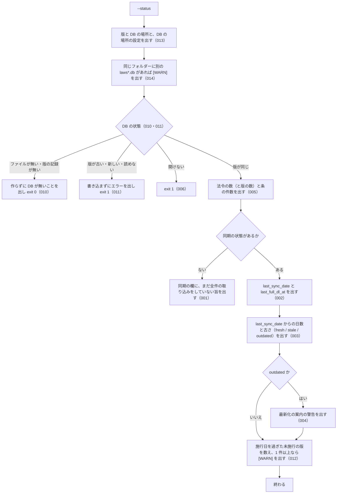

# cli_status の仕様

<!-- GENERATED FILE — 手で編集しない。本文は houki-egov-mcp の specs/current/cli_status/spec.md の写し。 -->

::: info
houki-egov-mcp **v0.20.0** の `specs/current/cli_status/spec.md` から自動生成しました（仕様 ID 14 件・2026-10-09）。手で編集しないでください。再生成は `node scripts/generate-reference.mjs specs` です。
:::

このページは、houki-egov-mcp のコマンドライン「cli_status（ローカル DB の同期の状態と件数を表示する）」の仕様です。「承認の履歴」の前までは、仕様書の本文を言い換えずに写しています。

最後に仕様が変わったのは v0.20.0 の「ローカル DB の場所を、応答・起動時のログ・`--status` で確かめられるようにする（egov #108・#110、T6）」（2026-10-04 承認）です。それまでの経緯は[承認の履歴](#承認の履歴)にあります。

## 使う人と受け取るもの

この機能を誰が呼び、何を渡して何を受け取るかを示します。

- 利用者（ターミナルから `houki-egov-mcp --status` を実行する人）。ローカル DB がいつまで同期されているか、どれだけ古いか、次に何を実行すればよいかを見る

## 入力

呼び出すときに渡す値です。

| フラグ・環境変数                    | 必須 | 内容                                                                           |
| ----------------------------------- | ---- | ------------------------------------------------------------------------------ |
| `--status`                          | 必須 | 同期の状態と DB の件数を表示する                                               |
| `HOUKI_EGOV_DB_PATH`                | 任意 | DB ファイルの場所。既定は `${XDG_CACHE_HOME:-~/.cache}/houki-egov-mcp/laws.db` |
| `XDG_CACHE_HOME`                    | 任意 | `HOUKI_EGOV_DB_PATH` が無いときの DB の置き場所の元（[SPEC-EGOV-DB-SCHEMA-013](/specs/houki-egov/db_schema#spec-egov-db-schema-013)） |
| `HOUKI_EGOV_INCREMENTAL_LIMIT_DAYS` | 任意 | 警告の文に出す日数。既定 90（[SPEC-EGOV-CLI-STATUS-004](#spec-egov-cli-status-004)）                        |

## できないこと

この機能が引き受けないことです。

- 同期や取り込みをすること（表示するだけ。最新化は `--sync`、作り直しは `--bulk-download-everything`）
- e-Gov 側に新しい差分があるかを確かめること（ネットワークに出ない）
- 法令ごとの取得日時や、未施行・前の版の内訳を出すこと
- DB を作ること・作り直すこと（`--bulk-download-everything`。[SPEC-EGOV-DB-SCHEMA-025](/specs/houki-egov/db_schema#spec-egov-db-schema-025)）

## 処理の流れ

実行してから表示を終えるまでに、何をどの順で確かめるかを示します。図の中の番号は「できること」の仕様 ID の末尾 3 桁です。



## 仕様 ID ごとの約束

この機能が守る約束を、仕様 ID ごとに並べています。見出しは約束を 1 文で表したもので、条件・応答の細部・例は「詳細」を開くと読めます。仕様 ID はそれぞれ受入テストと対応していて、テストの無い ID があると各リポジトリの CI が止まります。

<a id="spec-egov-cli-status-001"></a>

### SPEC-EGOV-CLI-STATUS-001 全件の取り込みがまだなら、その旨を出す

::: details 詳細
同期の状態が無い（`--bulk-download-everything` をまだ一度も終えていない）ときは、同期の欄に日付・古さを出さず、`sync:     (まだ bulk DL されていません — --bulk-download-everything を実行)` を出す。
:::

<a id="spec-egov-cli-status-002"></a>

### SPEC-EGOV-CLI-STATUS-002 最後に同期した日と、最後に全件を取り込んだ時刻を出す

::: details 詳細
同期の状態があるときは、`last_sync_date`（最後に同期した日。`YYYY-MM-DD`）と `last_full_dl_at`（最後に全件を取り込んだ時刻）を、DB に記録された値のまま出す。

例: `last_sync_date` が `2026-05-07`、`last_full_dl_at` が `2026-05-01T03:00:00+09:00` なら、その 2 つをそのまま出す。
:::

<a id="spec-egov-cli-status-003"></a>

### SPEC-EGOV-CLI-STATUS-003 最後に同期した日からの日数と古さを出す

::: details 詳細
`days_since_sync` に `last_sync_date` から今までの日数を、`staleness` に次の古さを出す。

| `days_since_sync`  | `staleness` |
| ------------------ | ----------- |
| 7 日未満           | `fresh`     |
| 7 日以上 30 日未満 | `stale`     |
| 30 日以上          | `outdated`  |

例: 2026-05-09 に `last_sync_date` が `2026-05-08` なら `days_since_sync` は 1、`staleness` は `fresh`。`2026-04-01` なら `outdated`。
:::

<a id="spec-egov-cli-status-004"></a>

### SPEC-EGOV-CLI-STATUS-004 `outdated` のときだけ最新化の警告を出す

::: details 詳細
`staleness` が `outdated` のときは、次の警告を出す。`<--sync のコマンド>` は `--sync` を付けた案内のコマンド（[SPEC-EGOV-DB-SCHEMA-029](/specs/houki-egov/db_schema#spec-egov-db-schema-029)）、`<上限>` は `HOUKI_EGOV_INCREMENTAL_LIMIT_DAYS` の値（既定 90。`--sync` が差分で追える日数の上限。[SPEC-EGOV-CLI-SYNC-003](/specs/houki-egov/cli_sync#spec-egov-cli-sync-003)）。

```
  ⚠ bulk DB が <日数> 日前のデータです。最新化するには `<--sync のコマンド>` (最終同期から <上限> 日を超えていれば `--bulk-download-everything`) を実行してください
```

`fresh` と `stale` のときはこの警告を出さない。

例: `HOUKI_EGOV_INCREMENTAL_LIMIT_DAYS=60` で、`last_sync_date` が 38 日前の DB では、警告に `(最終同期から 60 日を超えていれば` が入る。環境変数が無いときは `(最終同期から 90 日を超えていれば`（v0.18.x では環境変数によらず 90。#61）。環境変数を付けずに実行したときの警告は `` ⚠ bulk DB が 38 日前のデータです。最新化するには `npx -y @shuji-bonji/houki-egov-mcp@latest --sync` (最終同期から 90 日を超えていれば `--bulk-download-everything`) を実行してください ``（v0.19.x では `` `houki-egov-mcp --sync` ``）。
:::

<a id="spec-egov-cli-status-005"></a>

### SPEC-EGOV-CLI-STATUS-005 版・DB の場所・件数と同期の欄を標準出力に出して exit 0

::: details 詳細
版が同じ DB（[SPEC-EGOV-DB-SCHEMA-025](/specs/houki-egov/db_schema#spec-egov-db-schema-025)）のとき、`--status` は次の行を順に標準出力に出し、終了コード 0 で終わる。標準エラー出力には何も出さない。

1. `[status] <パッケージ名> v<版>`
2. `  DB: <DB ファイルの場所>`（`HOUKI_EGOV_DB_PATH` を指定していればその値）
3. `  DB の場所の設定: <設定の名前>…`（[SPEC-EGOV-CLI-STATUS-013](#spec-egov-cli-status-013)）
4. 同じフォルダーに別の `laws*.db` があれば `[WARN] 同じフォルダーに、…` の 1 行（[SPEC-EGOV-CLI-STATUS-014](#spec-egov-cli-status-014)）。無ければこの行は無く、次の行が 4 行目になる
5. `  laws:     <法令の数> (版: <版の数>)`。法令の数は `laws` の `law_id` の種類の数、版の数は `laws` の行の数（前の版・未施行の版を含む）
6. `  articles: <条の行の件数>`
7. 同期の欄（同期の状態が無ければ [SPEC-EGOV-CLI-STATUS-001](#spec-egov-cli-status-001) の 1 行。あれば `  sync:` の行に続けて、`    last_sync_date:  <値>`・`    last_full_dl_at: <値>`・`    days_since_sync: <日数>`・`    staleness:       <古さ>` の 4 行）

1・2 行目と、`  laws:` 以降の行の形は v0.19.x と同じ。

例: `HOUKI_EGOV_DB_PATH=/tmp/x/laws.db` で、法令 1 件（版 1 つ）・条 2 件を取り込み、`last_sync_date` が `2026-05-08`、`last_full_dl_at` が `2026-05-01T03:00:00.000Z` の DB（`/tmp/x/` にほかの `laws*.db` は無い）に、2026-05-09（日本時間）に実行すると、標準出力は次のとおりで終了コードは 0。

```
[status] @shuji-bonji/houki-egov-mcp v0.20.0
  DB: /tmp/x/laws.db
  DB の場所の設定: HOUKI_EGOV_DB_PATH（MCP クライアントから起動したサーバーは、シェルの環境変数を受け継がないことがあります）
  laws:     1 (版: 1)
  articles: 2
  sync:
    last_sync_date:  2026-05-08
    last_full_dl_at: 2026-05-01T03:00:00.000Z
    days_since_sync: 1
    staleness:       fresh
  差分を取り込むには --sync を実行してください
```

同じ法令の現行の版と前の版の 2 行がある DB では `  laws:     1 (版: 2)`（v0.18.x では `  laws:     2` と出し、版の数を法令の数のように見せていた。#61）。同期の状態が無く空の DB なら、`  laws:     0 (版: 0)`・`  articles: 0` に続けて `  sync:     (まだ bulk DL されていません — --bulk-download-everything を実行)` を出して終了コード 0。v0.19.x では 3 行目（DB の場所の設定）が無く、2 行目の次が `  laws:` の行だった。
:::

<a id="spec-egov-cli-status-006"></a>

### SPEC-EGOV-CLI-STATUS-006 DB を開けないときは exit 1

::: details 詳細
`HOUKI_EGOV_DB_PATH` の場所の DB を開けないときは、1〜3 行目（`[status] …`・`  DB: …`・`  DB の場所の設定: …`）と、あれば [SPEC-EGOV-CLI-STATUS-014](#spec-egov-cli-status-014) の `[WARN]` の行を標準出力に出した後、標準エラー出力に `[ERROR] DB を開けません: <エラーの文>` を出し、件数と同期の欄を出さずに終了コード 1 で終わる。

例: `HOUKI_EGOV_DB_PATH` に SQLite でない中身のファイルを指定すると `[ERROR] DB を開けません: file is not a database`、フォルダーを指定すると `[ERROR] DB を開けません: unable to open database file` を出して終了コード 1。
:::

<a id="spec-egov-cli-status-007"></a>

### SPEC-EGOV-CLI-STATUS-007 `outdated` でなく 1 日以上たっていれば `--sync` を案内する

::: details 詳細
同期の状態があり、`staleness` が `outdated` でなく（[SPEC-EGOV-CLI-STATUS-004](#spec-egov-cli-status-004) の警告を出さず）、`days_since_sync` が 1 以上のときは、同期の欄の後に `  差分を取り込むには --sync を実行してください` を出す。`days_since_sync` が 0 のときと、`outdated` のとき（警告を出すとき）はこの行を出さない。

例: 2026-05-09（日本時間）に実行したとき、`last_sync_date` が `2026-05-08`（`fresh`、1 日）と `2026-04-20`（`stale`、19 日）ではこの行を出す。`2026-05-09`（0 日）と `2026-04-01`（`outdated`、38 日）では出さない。
:::

<a id="spec-egov-cli-status-008"></a>

### SPEC-EGOV-CLI-STATUS-008 件数の 3 桁の区切りは環境の言語設定によらず `,`

::: details 詳細
[SPEC-EGOV-CLI-STATUS-005](#spec-egov-cli-status-005) の 3・4 行目に出す法令の数・版の数・条の件数は、1,000 以上のとき 3 桁ごとに `,` で区切る（`1,234,567`）。区切りの文字は、実行する環境の言語設定（`LANG`・`LC_ALL` など）によらず `,` で、小数点や桁の区切りにほかの文字を使う言語設定（`de_DE.UTF-8` など）でも変わらない。1,000 未満の件数は区切りなし（`0`・`1`・`999`）。

例: 法令 1,234 件（どれも版 1 つ）・条の行が 5 件の DB では、環境の言語設定が英語（`en_US`）でもドイツ語（`de_DE`）でも、`  laws:     1,234 (版: 1,234)` と `  articles: 5` を出す。

（v0.15.3 までは、環境の言語設定に従って区切っていたため、`LANG=de_DE.UTF-8` では `1.234.567` になった。houki-egov-mcp #74）
:::

<a id="spec-egov-cli-status-009"></a>

### SPEC-EGOV-CLI-STATUS-009 同期の記録の日付を解釈できないときは `[ERROR]` を出して exit 1

::: details 詳細
`sync_state.last_sync_date` が日付・時刻として解釈できない（空文字、`2026/05/08`、`2026-02-30` など）ときは、`[status] …` から `  articles: …` までの行（[SPEC-EGOV-CLI-STATUS-005](#spec-egov-cli-status-005) の 1〜6）を標準出力に出した後、標準エラー出力に `[ERROR] 同期の記録を読めません: <last_sync_date の値>（<コマンド> で作り直してください）` を出し、同期の欄（[SPEC-EGOV-CLI-STATUS-002](#spec-egov-cli-status-002)〜004・007）を出さずに終了コード 1 で終わる（[SPEC-EGOV-COMMON-ERRORS-031](/specs/houki-egov/common_errors#spec-egov-common-errors-031) の CLI での形）。`<コマンド>` は `--bulk-download-everything` を付けた案内のコマンド（[SPEC-EGOV-DB-SCHEMA-029](/specs/houki-egov/db_schema#spec-egov-db-schema-029)）。例外のまま終わらない。

例: `sync_state.last_sync_date` を `2026/05/08` に書き換えた DB で、環境変数を付けずに `--status` を実行すると、標準エラー出力に `[ERROR] 同期の記録を読めません: 2026/05/08（npx -y @shuji-bonji/houki-egov-mcp@latest --bulk-download-everything で作り直してください）` を出して終了コード 1（v0.19.x では `houki-egov-mcp --bulk-download-everything`）。`2026-05-08` の DB では今までどおり同期の欄を出して終了コード 0。
:::

<a id="spec-egov-cli-status-010"></a>

### SPEC-EGOV-CLI-STATUS-010 DB が無いときは作らずに、そのことを出して exit 0

::: details 詳細
DB のファイルが無いとき（置き場所のフォルダーも無いときを含む）と、ファイルはあるが版の記録が無いときは、1〜3 行目（`[status] …`・`  DB: …`・`  DB の場所の設定: …`）と、あれば [SPEC-EGOV-CLI-STATUS-014](#spec-egov-cli-status-014) の `[WARN]` の行の後に、`  (DB がまだありません — <コマンド> で作ります)` を標準出力に出し、件数と同期の欄を出さずに終了コード 0 で終わる。`<コマンド>` は `--bulk-download-everything` を付けた案内のコマンド（[SPEC-EGOV-DB-SCHEMA-029](/specs/houki-egov/db_schema#spec-egov-db-schema-029)）。DB のファイル・フォルダー・テーブルを作らない（[SPEC-EGOV-DB-SCHEMA-025](/specs/houki-egov/db_schema#spec-egov-db-schema-025)）。

例: `HOUKI_EGOV_DB_PATH=<空のフォルダー>/a/laws.db`（`<空のフォルダー>` はホームディレクトリの外）で `--status` を実行すると、標準出力は `[status] …`・`  DB: <空のフォルダー>/a/laws.db`・`  DB の場所の設定: HOUKI_EGOV_DB_PATH（…）`・`  (DB がまだありません — HOUKI_EGOV_DB_PATH='<空のフォルダー>/a/laws.db' npx -y @shuji-bonji/houki-egov-mcp@latest --bulk-download-everything で作ります)` の 4 行で終了コード 0、終わった後も `<空のフォルダー>/a` は無い（v0.18.x では `a/laws.db` を作ってから `laws:     0` を出し、ファイルが残った。#60。v0.19.x では 3 行で、コマンドは `houki-egov-mcp --bulk-download-everything`）。
:::

<a id="spec-egov-cli-status-011"></a>

### SPEC-EGOV-CLI-STATUS-011 版が同じでない DB には書き込まずに exit 1

::: details 詳細
古い版・新しい版・読めない版の DB のときは、1〜3 行目と、あれば [SPEC-EGOV-CLI-STATUS-014](#spec-egov-cli-status-014) の `[WARN]` の行を標準出力に出した後、[SPEC-EGOV-DB-SCHEMA-025](/specs/houki-egov/db_schema#spec-egov-db-schema-025) のエラーの文を標準エラー出力に出し、件数と同期の欄を出さずに終了コード 1 で終わる。DB を作り直さず、書き換えない。

例: 環境変数を付けずに、`schema_version` が `2` の DB で `--status` を実行すると、`[ERROR] DB の版 (2) が古いため使えません。npx -y @shuji-bonji/houki-egov-mcp@latest --bulk-download-everything で作り直してください（…）` を出して終了コード 1 で、`schema_version` は `2` のまま、`laws` の行も残る（0.19.0 に上げた直後の利用者の DB はこの状態になる。v0.18.x の「版が違えば作り直す」をそのまま使うと、`--status` を実行しただけで取り込んだ中身が消える）。
:::

<a id="spec-egov-cli-status-012"></a>

### SPEC-EGOV-CLI-STATUS-012 施行日を過ぎても未施行のままの版があれば `[WARN]` で全件の取り込みを案内する

::: details 詳細
同期の状態があり、同期の欄（[SPEC-EGOV-CLI-STATUS-002](#spec-egov-cli-status-002)・003）を出せたときは、DB の `laws` のうち、`current_revision_status` が `UnEnforced` で、`amendment_enforcement_date` が `last_sync_date` より前（同じ日を含まない）の版を数える。1 件以上なら、同期の欄と、その後の警告（[SPEC-EGOV-CLI-STATUS-004](#spec-egov-cli-status-004)）または `--sync` の案内（007）の行の後に、標準出力に次の 1 行を出す。0 件なら出さない。終了コードは 0 のまま変えない。標準エラー出力には出さない。`<コマンド>` は `--bulk-download-everything` を付けた案内のコマンド（[SPEC-EGOV-DB-SCHEMA-029](/specs/houki-egov/db_schema#spec-egov-db-schema-029)）。

```
[WARN] 施行日が last_sync_date (<last_sync_date>) より前なのに未施行 (UnEnforced) のままの版が <件数> 件あります。<コマンド> を 1 回実行すると直ります（全件の zip 約 290 MB を取得します。条の本文は入れ直しません）
```

文は [SPEC-EGOV-CLI-SYNC-021](/specs/houki-egov/cli_sync#spec-egov-cli-sync-021) と同じ。数える条件も同じで、比べる日は今日ではなく `last_sync_date`（同期していない日の配り直しは `--sync` で取り込めるので、`--bulk-download-everything` を案内しない）。`amendment_enforcement_date` が `NULL` の版は数えない。同期の状態が無いとき（001）、DB が無いとき（010）、版が合わないとき（011）、DB を開けないとき（006）、同期の記録を読めないとき（009）は数えず、出さない。ネットワークには出ない。

例: `last_sync_date` が `2026-10-06` で、施行日 `2026-10-05` の `UnEnforced` の版が 5 つある DB に、2026-10-07（日本時間）に環境変数を付けずに `--status` を実行すると、同期の欄（`days_since_sync: 1`、`staleness: fresh`）と `  差分を取り込むには --sync を実行してください` の後に、`[WARN] 施行日が last_sync_date (2026-10-06) より前なのに未施行 (UnEnforced) のままの版が 5 件あります。npx -y @shuji-bonji/houki-egov-mcp@latest --bulk-download-everything を 1 回実行すると直ります（…）` を出して終了コード 0（v0.19.1 では `houki-egov-mcp --bulk-download-everything を 1 回実行すると直ります`）。`last_sync_date` が `2026-10-05` なら、施行日 `2026-10-05` の版は数えない（同じ日を含まない）ので出さない。
:::

<a id="spec-egov-cli-status-013"></a>

### SPEC-EGOV-CLI-STATUS-013 3 行目に、DB の場所を決めた設定を出す

::: details 詳細
`  DB: ` の行（2 行目）の次に、DB の場所を決めた設定（[SPEC-EGOV-DB-SCHEMA-028](/specs/houki-egov/db_schema#spec-egov-db-schema-028)）を 1 行、標準出力に出す。DB の状態（版が同じ・無い・版が違う・開けない）によらず、どの場合も出す。

| DB の場所の設定 | 3 行目 |
| --- | --- |
| `HOUKI_EGOV_DB_PATH` | `  DB の場所の設定: HOUKI_EGOV_DB_PATH（MCP クライアントから起動したサーバーは、シェルの環境変数を受け継がないことがあります）` |
| `XDG_CACHE_HOME` | `  DB の場所の設定: XDG_CACHE_HOME（MCP クライアントから起動したサーバーは、シェルの環境変数を受け継がないことがあります）` |
| `既定` | `  DB の場所の設定: 既定` |

ネットワークには出ない。DB を開くかどうかは今までどおり（この行のために DB を開かない）。

例: 環境変数を付けずに実行すると、1〜3 行目は `[status] @shuji-bonji/houki-egov-mcp v0.20.0`・`  DB: /Users/bonji/.cache/houki-egov-mcp/laws.db`・`  DB の場所の設定: 既定`。`HOUKI_EGOV_DB_PATH=/tmp/x/laws.db` を付けると 3 行目は `  DB の場所の設定: HOUKI_EGOV_DB_PATH（MCP クライアントから起動したサーバーは、シェルの環境変数を受け継がないことがあります）`（v0.19.x では 3 行目が無く、2 行目の次は `  laws:` などの行だった）。
:::

<a id="spec-egov-cli-status-014"></a>

### SPEC-EGOV-CLI-STATUS-014 同じフォルダーに別の `laws*.db` があれば `[WARN]` で知らせる

::: details 詳細
3 行目（[SPEC-EGOV-CLI-STATUS-013](#spec-egov-cli-status-013)）の次に、DB の絶対パス（[SPEC-EGOV-DB-SCHEMA-028](/specs/houki-egov/db_schema#spec-egov-db-schema-028)）のフォルダーにある普通のファイルのうち、名前が `laws` で始まり `.db` で終わり、DB のファイルそのものでないものを探す。1 つ以上あれば、標準出力に次の 1 行を出す。無ければ出さない。

```
[WARN] 同じフォルダーに、この DB のほかに laws*.db のファイルがあります: <名前> (<大きさ>, <最終更新>)[, <名前> (<大きさ>, <最終更新>)…]。MCP サーバーと CLI が別のファイルを開いていないか確かめてください
```

- 並びはファイルの名前の順。`<大きさ>` は取り込みの経過の表示と同じ形（1,024 バイト未満は `<n> B`、次は小数 1 桁の `KB`・`MB`、1 GiB 以上は小数 2 桁の `GB`。1 KB = 1,024 バイト）、`<最終更新>` は実行した環境の時刻の `YYYY-MM-DD HH:MM`
- フォルダーは数えない（既定の添付ファイルの保存先 `files/` も同じ場所にある）。`-wal`・`-shm` のファイルは名前が `.db` で終わらないので数えない。退避したファイル（`laws.v2.bak.db` など）は数える
- 見つけたファイルは開かない（版を読まない。名前・大きさ・最終更新だけを出す）
- DB のファイルが無いとき（010）、開けないとき（006）、版が違うとき（011）、同期の記録を読めないとき（009）も、3 行目の次に同じように確かめて出す
- フォルダーが無い・読めないときは何も出さず、エラーにしない
- 終了コードは変えない。標準エラー出力には出さない

例: `~/.cache/houki-egov-mcp/` に `laws.db`（DB のファイル）と、`laws.v3.db`（2,048 バイト、最終更新 2026-10-04 12:00）・`laws.db-wal`・`files/` があるとき、環境変数を付けずに `--status` を実行すると、3 行目の次に `[WARN] 同じフォルダーに、この DB のほかに laws*.db のファイルがあります: laws.v3.db (2.0 KB, 2026-10-04 12:00)。MCP サーバーと CLI が別のファイルを開いていないか確かめてください` を出す。`HOUKI_EGOV_DB_PATH` が `~/.cache/houki-egov-mcp/laws.v3.db`（無いファイル）を指し、同じフォルダーに `laws.db` があるとき（2026-10-04 に `laws.v3.db` を `laws.db` に名前を変えた後の houki-egov-dev の場面）は、`  (DB がまだありません — …)` の行の前に、`laws.db` を挙げた `[WARN]` を出して終了コード 0。`laws.db` だけのフォルダーでは出さない（v0.19.x では、別のファイルがあっても何も出さなかった。houki-egov-mcp #110）。
:::

## まだ決めていないこと

仕様を書き起こしたときに見つかった項目のうち、扱いを決めている途中のものです。開くと、元の仕様書の記述をそのまま読めます。

::: details 仕様書の「未決」の節
初版起こしで見つけた、意図か不具合かを人が決める項目です。決まったら「できること」に ID を振るか、`specs/changes/` の差分にします。

意図か不具合かの判断が要る項目は houki-egov-mcp の Issue に移し、ここには題と Issue の番号だけを残します。今の振る舞いのままでよくテストが無いだけの項目は、受入テストを書いてから「できること」に ID を振ります。

1. **コマンドとしての表示と終了コード。** → [SPEC-EGOV-CLI-STATUS-005](#spec-egov-cli-status-005)・[SPEC-EGOV-CLI-STATUS-006](#spec-egov-cli-status-006)
2. **`fresh` / `stale` で 1 日以上たっていれば `--sync` を案内する。** → [SPEC-EGOV-CLI-STATUS-007](#spec-egov-cli-status-007)
:::

## 承認の履歴

この機能の仕様が、いつ、どの変更で承認されたかを新しい順に並べています。各リポジトリの `npx spec-ids history cli_status` と同じ内容です。変更の名前から、変更の理由と前後の振る舞いを書いた文書（GitHub）を開けます。

::: details 承認の履歴（8 件）
| 承認日 | 版 | 変更 | 仕様 PR |
|---|---|---|---|
| 2026-10-04 | v0.20.0 | [ローカル DB の場所を、応答・起動時のログ・`--status` で確かめられるようにする（egov #108・#110、T6）](https://github.com/shuji-bonji/houki-egov-mcp/blob/v0.20.0/specs/releases/v0.20.0/20261004-db-location/proposal.md) | [#114](https://github.com/shuji-bonji/houki-egov-mcp/pull/114) |
| 2026-10-04 | v0.19.1 | [施行日の当日に配り直される版の状態を取り込む（egov #107）](https://github.com/shuji-bonji/houki-egov-mcp/blob/v0.20.0/specs/releases/v0.19.1/20261004-ingest-redistributed-revisions/proposal.md) | [#112](https://github.com/shuji-bonji/houki-egov-mcp/pull/112) |
| 2026-10-03 | v0.19.0 | [ローカル DB の版の扱い・作る入口・取り込みと同期の記録・CLI の引数（段階 5 DB と CLI）](https://github.com/shuji-bonji/houki-egov-mcp/blob/v0.20.0/specs/releases/v0.19.0/20261003-db-cli/proposal.md) | [#100](https://github.com/shuji-bonji/houki-egov-mcp/pull/100) |
| 2026-10-01 | v0.16.0 | [「見つからない」と「取得元の失敗」の code を分ける（T2）](https://github.com/shuji-bonji/houki-egov-mcp/blob/v0.20.0/specs/releases/v0.16.0/20261001-t2-error-codes/proposal.md) | [#85](https://github.com/shuji-bonji/houki-egov-mcp/pull/85) |
| 2026-09-30 | v0.15.4 | [判断の要らない不具合 3 件の仕様（#73・#74・#75 の一括修正）](https://github.com/shuji-bonji/houki-egov-mcp/blob/v0.20.0/specs/releases/v0.15.4/20260930-bugfix-batch/proposal.md) | [#81](https://github.com/shuji-bonji/houki-egov-mcp/pull/81) |
| 2026-09-28 | v0.15.2 | [テストが無いだけの振る舞いに仕様 ID を振る](https://github.com/shuji-bonji/houki-egov-mcp/blob/v0.20.0/specs/releases/v0.15.2/20260928-untested-behaviors/proposal.md) | [#76](https://github.com/shuji-bonji/houki-egov-mcp/pull/76) |
| 2026-09-28 | v0.15.2 | [「未決」のうち判断が要る 85 件を Issue に移す](https://github.com/shuji-bonji/houki-egov-mcp/blob/v0.20.0/specs/releases/v0.15.2/20260928-undecided-to-issues/proposal.md) | [#68](https://github.com/shuji-bonji/houki-egov-mcp/pull/68) |
| 2026-09-28 | — | 初版 | [#50](https://github.com/shuji-bonji/houki-egov-mcp/pull/50) |
:::

## 関連ページ

このページの元になった文書と、あわせて読むページです。

- [houki-egov-mcp の仕様の一覧](/specs/houki-egov/)
- [houki-egov-mcp の解説](/mcp/houki-egov)
- [元の仕様書（GitHub、v0.20.0）](https://github.com/shuji-bonji/houki-egov-mcp/blob/v0.20.0/specs/current/cli_status/spec.md)
