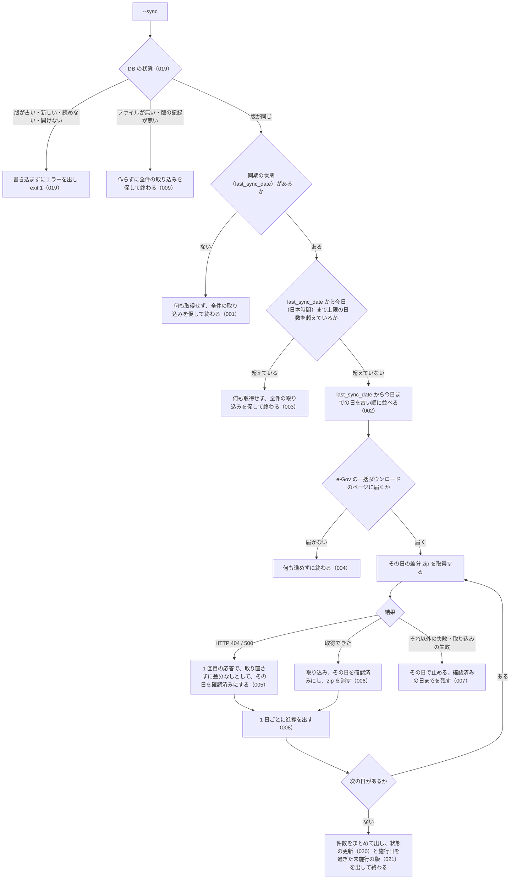

# cli_sync の仕様

<!-- GENERATED FILE — 手で編集しない。本文は houki-egov-mcp の specs/current/cli_sync/spec.md の写し。 -->

::: info
houki-egov-mcp **v0.20.1** の `specs/current/cli_sync/spec.md` から自動生成しました（仕様 ID 21 件・2026-10-10）。手で編集しないでください。再生成は `node scripts/generate-reference.mjs specs` です。
:::

全件取り込み済みのローカル DB を日次差分で最新化する

最後に仕様が変わったのは v0.20.0 の「ローカル DB の場所を、応答・起動時のログ・`--status` で確かめられるようにする（egov #108・#110、T6）」（2026-10-04 承認）です。それまでの経緯は[承認の履歴](#承認の履歴)にあります。

## 利用者と得られる結果

この機能の利用者と、利用者が渡すもの・得られる結果を示します。

- 利用者（ターミナルから `houki-egov-mcp --sync` を実行する人。定期実行に組み込む人を含む）。`--bulk-download-everything` で作ったローカル DB に、最後に同期した日から今日までの e-Gov の日次差分を取り込む

## 入力

呼び出すときに渡す値です。

| フラグ・環境変数                         | 必須 | 内容                                                                                      |
| ---------------------------------------- | ---- | ----------------------------------------------------------------------------------------- |
| `--sync` / `--bulk-download-incremental` | 必須 | 差分での最新化を行う。2 つは同じ動作                                                      |
| `HOUKI_EGOV_INCREMENTAL_LIMIT_DAYS`      | 任意 | 最後に同期した日から差分で追える日数の上限（既定 90。e-Gov が日次差分を公開している範囲） |
| `HOUKI_EGOV_DB_PATH`                     | 任意 | DB ファイルの場所。既定は `${XDG_CACHE_HOME:-~/.cache}/houki-egov-mcp/laws.db`            |
| `HOUKI_EGOV_BULK_RETRY`                  | 任意 | 1 日分の zip の取得に失敗したときに試す回数（既定 3）                                     |

## 扱わないこと

この機能が意図して扱わないことです。

- 差分で追える日数を超えた DB を最新化すること（全件の取り込み `--bulk-download-everything` をやり直す）
- 全件の取り込みをしていない DB を差分だけで作ること
- 止まった日の続きを自動でやり直すこと（もう一度 `--sync` を実行する）

## 処理の流れ

実行してから終わるまでに、何をどの順で確かめるかを示します。図の中の番号は「できること」の仕様 ID の末尾 3 桁です。



## 仕様項目

この機能の仕様項目を、仕様 ID ごとに並べています。見出しは仕様項目を 1 文で表したもので、条件・応答の細部・例は「詳細」を開くと読めます。仕様 ID はそれぞれ受入テストと対応していて、テストの無い ID があると各リポジトリの CI が止まります。

<a id="spec-egov-cli-sync-001"></a>

### SPEC-EGOV-CLI-SYNC-001 全件の取り込みがまだなら何も取得しない

::: details 詳細
同期の状態が無い（`--bulk-download-everything` をまだ一度も終えていない）ときは、e-Gov への接続の確認も差分の取得もしない。
:::

<a id="spec-egov-cli-sync-002"></a>

### SPEC-EGOV-CLI-SYNC-002 最後に同期した日を含めて、今日（日本時間）までを 1 日ずつ確かめる

::: details 詳細
確かめる日は、同期の状態の `last_sync_date` から今日までの両端を含むすべての日で、古い順に並べる。今日は日本時間の日付で決める（UTC ではまだ前日の時刻でも、日本時間で日付が変わっていれば新しい日付）。月をまたいでも日を飛ばさない。`last_sync_date` が今日と同じなら、今日 1 日だけを確かめ直す（e-Gov の日次差分はその日の 15 時ごろに作られるので、午前に同期した日の差分を拾い直すため）。各日の差分は `update_date=YYYYMMDD`（例: 2026-09-07 → `20260907`）で取得する。

例: 日本時間 2026-09-19 12 時に、`last_sync_date` が `2026-09-17` の DB で実行すると、`2026-09-17`・`2026-09-18`・`2026-09-19` の 3 日を確かめる。
:::

<a id="spec-egov-cli-sync-003"></a>

### SPEC-EGOV-CLI-SYNC-003 差分で追える日数を超えていたら何も取得しない

::: details 詳細
`last_sync_date` から今日までの日数が `HOUKI_EGOV_INCREMENTAL_LIMIT_DAYS`（既定 90）を超えているときは、e-Gov への接続の確認も差分の取得もしない。ちょうど上限の日数のときは差分で追う（既定なら 91 日を確かめる）。

例: 日本時間 2026-09-19 に `last_sync_date` が `2026-05-01` の DB では 141 日空いているので、何も取得しない。`2026-06-21` なら 90 日なので差分で追う。
:::

<a id="spec-egov-cli-sync-004"></a>

### SPEC-EGOV-CLI-SYNC-004 e-Gov に届かなければ何も進めない

::: details 詳細
差分を取得する前に、e-Gov の一括ダウンロードのページ（`https://laws.e-gov.go.jp/bulkdownload/`）に届くことを確かめる。届かないときは、1 日分も取得せず、`last_sync_date` も動かさずに失敗する。
:::

<a id="spec-egov-cli-sync-005"></a>

### SPEC-EGOV-CLI-SYNC-005 差分 zip の無い日は、1 回目の応答で「差分なし」として飛ばす

::: details 詳細
その日の差分 zip の取得に HTTP 404 または 500 が返ったときは、取り直さずに（`HOUKI_EGOV_BULK_RETRY` によらず 1 回目の応答で）失敗とせず「差分なし」として扱い、その日を確認済みにして次の日へ進む（e-Gov は差分の無い日に HTTP 500 を返す。[SPEC-EGOV-CLI-SYNC-004](#spec-egov-cli-sync-004) で e-Gov に届くことを確かめてあるので、障害とは見なさない）。HTTP 503 など 404・500 以外の応答と、通信の失敗は「差分なし」にせず、今までどおり `HOUKI_EGOV_BULK_RETRY` 回まで取り直す。

例: `last_sync_date` が `2026-09-17` で、09-17・09-18・09-19 のどれも HTTP 500 が返るとき、差分 zip の取得は 3 回（1 日 1 回）で、3 日とも確認済みになる（v0.18.x では 1 日ごとに既定 3 回、1 秒・2 秒と間をあけて取り直したので、取得は 9 回だった。#58）。
:::

<a id="spec-egov-cli-sync-006"></a>

### SPEC-EGOV-CLI-SYNC-006 差分のある日は取り込み、1 日ごとに `last_sync_date` を進める

::: details 詳細
差分 zip を取得できた日は、その zip を DB に取り込み（取り込みのしかたは `--bulk-download-by-date` と同じ。cli_bulk_download の [SPEC-EGOV-CLI-BULK-DOWNLOAD-007](/specs/houki-egov/cli_bulk_download#spec-egov-cli-bulk-download-007)〜016 と 031。中身が前回と同じ未施行の版が、未施行の欄を空にして届いたときは状態だけを現行にする）、その日を確認済みにする。確認済みにするたびに、同期の状態を次にする。取り込んだ zip はその日のうちに消す。

- `last_sync_date`: 確認済みにした日
- `last_full_dl_at`: 前の全件の取り込みの時刻のまま
- 法令の総数: その時点の DB にある法令の数
- 取り込み元: `incremental`

例: `last_sync_date` が `2026-09-16` で、2026-09-16 と 2026-09-19 は差分なし、2026-09-17 と 2026-09-18 は差分ありのとき、4 日とも確認済みになり、`last_sync_date` は `2026-09-19` になる。消す zip は 09-17 と 09-18 の 2 つ。

例: `last_sync_date` が今日と同じ日のときも、その日の差分を取得し直す（[SPEC-EGOV-CLI-SYNC-002](#spec-egov-cli-sync-002)）ので、施行日の当日の午前に同期して配り直しを取り込めなかった版も、次の `--sync` でその日の差分から状態が直る。
:::

<a id="spec-egov-cli-sync-007"></a>

### SPEC-EGOV-CLI-SYNC-007 差分なし以外の失敗が起きたら、その日で止めて確認済みの日までを残す

::: details 詳細
ある日の取得が「差分なし」以外の理由で失敗したとき、または取り込みに失敗したときは、その日と後の日を確かめずに止める。`last_sync_date` は最後に確認済みにした日のまま残るので、もう一度 `--sync` を実行するとその失敗した日から続ける。取り込みに失敗した日の zip も消す。

例: `last_sync_date` が `2026-09-16` で、2026-09-18 の取得が `bulk DL に 3 回失敗しました: ECONNRESET` で失敗したとき、09-16 と 09-17 が確認済みになり、`last_sync_date` は `2026-09-17` になる。
:::

<a id="spec-egov-cli-sync-008"></a>

### SPEC-EGOV-CLI-SYNC-008 1 日ごとに進捗を出す

::: details 詳細
1 日を確かめ終わるごとに（差分なしの日も）、何日目か・全部で何日かとその日の結果を 1 行出す。
:::

<a id="spec-egov-cli-sync-009"></a>

### SPEC-EGOV-CLI-SYNC-009 全件の取り込みがまだなら、DB を作らずにそれを促して exit 1

::: details 詳細
同期の状態が無いとき（[SPEC-EGOV-CLI-SYNC-001](#spec-egov-cli-sync-001)）は、標準エラー出力に `[sync] 差分同期` と `  DB: <DB ファイルの場所>` を出した後、`[sync] まだ全件取り込みが行われていません。先に --bulk-download-everything を実行してください` を出し、終了コード 1 で終わる。DB のファイルが無いとき・版の記録が無いときも同じ文を出し、DB のファイル・フォルダー・テーブルを作らない（[SPEC-EGOV-DB-SCHEMA-025](/specs/houki-egov/db_schema#spec-egov-db-schema-025)）。

例: `--bulk-download-everything` をしていない空の DB で `--sync` を実行すると、e-Gov へ 1 度も接続せずに上の文を出して終了コード 1。DB ファイルの無い場所で実行しても同じ文と終了コードで、終わった後もファイルは無い（v0.18.x では空の DB を作っていた。#60）。
:::

<a id="spec-egov-cli-sync-010"></a>

### SPEC-EGOV-CLI-SYNC-010 上限の日数を超えていたら、全件の取り込みを促して exit 1

::: details 詳細
`last_sync_date` から今日までの日数が上限を超えているとき（[SPEC-EGOV-CLI-SYNC-003](#spec-egov-cli-sync-003)）は、標準エラー出力に `[sync] last_sync_date <last_sync_date> から <日数> 日空いています。日次差分の公開範囲 (<上限> 日) を超えているので、--bulk-download-everything を実行してください` を出し、終了コード 1 で終わる。`<上限>` は `HOUKI_EGOV_INCREMENTAL_LIMIT_DAYS` の値（既定 90）。

例: 日本時間 2026-09-19 に `last_sync_date` が `2026-05-01` の DB で実行すると `[sync] last_sync_date 2026-05-01 から 141 日空いています。日次差分の公開範囲 (90 日) を超えているので、--bulk-download-everything を実行してください` を出して終了コード 1。`HOUKI_EGOV_INCREMENTAL_LIMIT_DAYS=1` で `last_sync_date` が `2026-09-17` なら `… から 2 日空いています。日次差分の公開範囲 (1 日) を超えているので …`。
:::

<a id="spec-egov-cli-sync-011"></a>

### SPEC-EGOV-CLI-SYNC-011 e-Gov に届かなければ `[ERROR]` を出して exit 1

::: details 詳細
[SPEC-EGOV-CLI-SYNC-004](#spec-egov-cli-sync-004) で e-Gov の一括ダウンロードのページ（`https://laws.e-gov.go.jp/bulkdownload/`、HEAD）に届かないときは、標準エラー出力に `[ERROR] <エラーの文>` を出して終了コード 1 で終わる。ページが 2xx 以外を返したときの文は `e-Gov に接続できません (HTTP <status> from https://laws.e-gov.go.jp/bulkdownload/)`、通信そのものが失敗したときは通信の失敗の文になる。

例: HEAD に HTTP 503 が返ると `[ERROR] e-Gov に接続できません (HTTP 503 from https://laws.e-gov.go.jp/bulkdownload/)` を出して終了コード 1。HEAD が `TypeError('fetch failed')` で失敗すると `[ERROR] fetch failed` を出して終了コード 1。どちらも差分 zip は 1 つも取得しない。
:::

<a id="spec-egov-cli-sync-012"></a>

### SPEC-EGOV-CLI-SYNC-012 確認済みの日の後で止まったら、記録した日を出して exit 1

::: details 詳細
[SPEC-EGOV-CLI-SYNC-007](#spec-egov-cli-sync-007) で止まったとき、それより前に確認済みにした日が 1 日以上あれば、標準エラー出力に次の 2 行を出して終了コード 1 で終わる。

```
[ERROR] <止まった日>: <エラーの文>
  <last_sync_date> までを last_sync_date に記録しました (<確認済みの日数> 日分を確認、<upsert の件数> 件 upsert)。再実行すると続きから同期します
```

例: 日本時間 2026-09-19 に `last_sync_date` が `2026-09-16` の DB で実行し、2026-09-16 は差分なし（HTTP 500）、2026-09-17 は法令 1 件の差分、2026-09-18 は HTTP 503 のとき、`[ERROR] 2026-09-18: HTTP 503 <statusText> from https://laws.e-gov.go.jp/bulkdownload?file_section=3&update_date=20260918&only_xml_flag=true` と `  2026-09-17 までを last_sync_date に記録しました (2 日分を確認、1 件 upsert)。再実行すると続きから同期します` を出して終了コード 1。
:::

<a id="spec-egov-cli-sync-013"></a>

### SPEC-EGOV-CLI-SYNC-013 最初の日で止まったら、`last_sync_date` が変わらないことを出して exit 1

::: details 詳細
[SPEC-EGOV-CLI-SYNC-007](#spec-egov-cli-sync-007) で止まったのが最初の日（確認済みの日が 0 日）のときは、標準エラー出力に `[ERROR] <止まった日>: <エラーの文>` と `  last_sync_date は <last_sync_date> のままです` を出して終了コード 1 で終わる。

例: 日本時間 2026-09-19 に `last_sync_date` が `2026-09-18` の DB で実行し、2026-09-18 の取得に HTTP 503 が返ると、`[ERROR] 2026-09-18: HTTP 503 …` と `  last_sync_date は 2026-09-18 のままです` を出して終了コード 1。
:::

<a id="spec-egov-cli-sync-014"></a>

### SPEC-EGOV-CLI-SYNC-014 差分を取り込んで終わったら、件数をまとめて exit 0

::: details 詳細
すべての日を確認済みにして終わったときは、標準エラー出力に次の 2 行を出して終了コード 0 で終わる。

```
[完了] <確認した日数> 日分を確認 (<最初の日> 〜 <今日>)、<まとめ>。全体 <時間>
  last_sync_date: <last_sync_date>
```

`<まとめ>` は、次を `、` でつないだもの。

- upsert が 1 件以上なら `<取り込んだ日数> 日に差分あり: <upsert の件数> 件 upsert, <unchanged の件数> 件 unchanged`（取り込んだ日数は、差分 zip を取得して取り込んだ日の数）
- 差分なしの日があれば `<差分なしの日数> 日は差分なし`
- XML を読めず飛ばした法令があれば `<件数> 件は XML を読めず skip`

例: 日本時間 2026-09-19 に `last_sync_date` が `2026-09-17` の DB で実行し、09-17 と 09-19 は差分なし、09-18 は法令 1 件の差分のとき、`[完了] 3 日分を確認 (2026-09-17 〜 2026-09-19)、1 日に差分あり: 1 件 upsert, 0 件 unchanged、2 日は差分なし。全体 <時間>` と `  last_sync_date: 2026-09-19` を出して終了コード 0。
:::

<a id="spec-egov-cli-sync-015"></a>

### SPEC-EGOV-CLI-SYNC-015 新たに取り込んだ法令が無く終わったときのまとめ

::: details 詳細
すべての日を確認済みにして終わり、upsert が 0 件のときは、[SPEC-EGOV-CLI-SYNC-014](#spec-egov-cli-sync-014) の `<まとめ>` の最初を次にする（差分なしの日数と skip の件数は 014 と同じく続ける）。終了コードは 0。

- unchanged が 1 件以上: `新たに取り込んだ法令はありません (確認した <unchanged の件数> 件はすべて取り込み済み)`
- unchanged も 0 件: `新たに取り込んだ法令はありません`

例:
- 09-18 と 09-19 がどちらも差分なし（HTTP 404）なら `[完了] 2 日分を確認 (2026-09-18 〜 2026-09-19)、新たに取り込んだ法令はありません、2 日は差分なし。全体 <時間>`
- 取り込み済みの法令 1 件だけを含む差分が 09-18 と 09-19 にあれば `[完了] 2 日分を確認 (2026-09-18 〜 2026-09-19)、新たに取り込んだ法令はありません (確認した 2 件はすべて取り込み済み)。全体 <時間>`
- 09-19 の差分が、取り込み済みの法令 1 件と壊れた XML の法令 1 件なら `[完了] 1 日分を確認 (2026-09-19 〜 2026-09-19)、新たに取り込んだ法令はありません (確認した 1 件はすべて取り込み済み)、1 件は XML を読めず skip。全体 <時間>`
:::

<a id="spec-egov-cli-sync-016"></a>

### SPEC-EGOV-CLI-SYNC-016 1 日ごとの行の形

::: details 詳細
[SPEC-EGOV-CLI-SYNC-008](#spec-egov-cli-sync-008) の 1 日ごとの行は、標準エラー出力に次の形で出す。`<n>` は何日目か（1 から）、`<N>` は確かめる日の数。

- 差分なしの日: `  [<n>/<N>] <日付>: 差分なし`
- 取り込んだ日: `  [<n>/<N>] <日付>: <n> 件 upsert[, <n> 件 unchanged][, <n> 件 failed] (<zip のサイズ>, <時間>)`（`unchanged` と `failed` は 0 件なら出さない。upsert は 0 件でも出す）

止まった日の行は出さない（[SPEC-EGOV-CLI-SYNC-012](#spec-egov-cli-sync-012)・013 の `[ERROR]` の行を出す）。

例: 3 日を確かめ、2 日目に法令 1 件の差分（zip 1.8 KB）があると `  [1/3] 2026-09-17: 差分なし`、`  [2/3] 2026-09-18: 1 件 upsert (1.8 KB, <時間>)`、`  [3/3] 2026-09-19: 差分なし`。取り込み済みの法令 1 件と壊れた XML の法令 1 件の日は `  [1/1] 2026-09-19: 0 件 upsert, 1 件 unchanged, 1 件 failed (2.2 KB, <時間>)`。
:::

<a id="spec-egov-cli-sync-017"></a>

### SPEC-EGOV-CLI-SYNC-017 `--bulk-download-incremental` は `--sync` と同じ

::: details 詳細
最初の引数が `--bulk-download-incremental` のときも、`--sync` と同じ処理をし、同じ表示・同じ終了コードで終わる。

例: [SPEC-EGOV-CLI-SYNC-014](#spec-egov-cli-sync-014) の例と同じ DB と応答で `--bulk-download-incremental` を実行すると、同じ `[完了] 3 日分を確認 (2026-09-17 〜 2026-09-19)、…` を出して終了コード 0 で終わり、`last_sync_date` は `2026-09-19` になる。
:::

<a id="spec-egov-cli-sync-018"></a>

### SPEC-EGOV-CLI-SYNC-018 `last_sync_date` が今日より後なら、何も取得せず exit 0

::: details 詳細
`last_sync_date` が今日（日本時間）より後の日付のときは、確かめる日が 0 日になり、e-Gov へ接続せず（[SPEC-EGOV-CLI-SYNC-004](#spec-egov-cli-sync-004) の確認もしない）、`last_sync_date` を変えずに、`[完了] 0 日分を確認 (<last_sync_date> 〜 <今日>)、新たに取り込んだ法令はありません。全体 <時間>` と `  last_sync_date: <last_sync_date>` を出して終了コード 0 で終わる。

例: 日本時間 2026-09-19 に `last_sync_date` が `2026-09-25` の DB で実行すると、`[完了] 0 日分を確認 (2026-09-25 〜 2026-09-19)、新たに取り込んだ法令はありません。全体 <時間>` と `  last_sync_date: 2026-09-25` を出して終了コード 0。
:::

<a id="spec-egov-cli-sync-019"></a>

### SPEC-EGOV-CLI-SYNC-019 版が同じでない DB には書き込まずに exit 1

::: details 詳細
`--sync`（と `--bulk-download-incremental`）は、`[sync] 差分同期` と `  DB: …` の 2 行を出した後、e-Gov に届くかを確かめる前に DB の状態を確かめる。古い版・新しい版・読めない版の DB のときは [SPEC-EGOV-DB-SCHEMA-025](/specs/houki-egov/db_schema#spec-egov-db-schema-025) のエラーの文を、開けない DB のときは `[ERROR] DB を開けません: <エラーの文>` を標準エラー出力に出し、DB を書き換えず、差分を取得せずに終了コード 1 で終わる。

例: 環境変数を付けずに、`schema_version` が `2` の DB（v0.18.x で作った DB）で `--sync` を実行すると、`[ERROR] DB の版 (2) が古いため使えません。npx -y @shuji-bonji/houki-egov-mcp@latest --bulk-download-everything で作り直してください（取り込んだ中身は消え、全件の zip 約 290 MB を取り直します）` を出して終了コード 1（v0.19.x では `houki-egov-mcp --bulk-download-everything で作り直してください`）。`schema_version` は `2` のまま、`laws` の行も残る（0.19.0 に上げた直後の利用者の DB はこの状態になる）。
:::

<a id="spec-egov-cli-sync-020"></a>

### SPEC-EGOV-CLI-SYNC-020 状態だけを書き換えた版があれば、まとめの後に 1 行出す

::: details 詳細
すべての日を確認済みにして終わったとき（[SPEC-EGOV-CLI-SYNC-014](#spec-egov-cli-sync-014)・015）、取り込んだ日の `status_changed`（[SPEC-EGOV-CLI-BULK-DOWNLOAD-031](/specs/houki-egov/cli_bulk_download#spec-egov-cli-bulk-download-031) で状態だけを書き換えた版の数）の合計が 1 以上なら、`  last_sync_date: <last_sync_date>` の行のすぐ後に、標準エラー出力に次の 1 行を出す。0 のときは出さない。`[完了]` の行・1 日ごとの行（[SPEC-EGOV-CLI-SYNC-016](#spec-egov-cli-sync-016)）・`  last_sync_date:` の行の形は変えない。終了コードは 0 のまま。

```
  状態の更新: <status_changed の合計> 件 (条の本文はそのまま、未施行 (UnEnforced) だった版の状態だけを書き換え)
```

`status_changed` の版は `unchanged` にも数えるので、`[完了]` の行の `<n> 件 unchanged` と、[SPEC-EGOV-CLI-SYNC-015](#spec-egov-cli-sync-015) の `確認した <n> 件はすべて取り込み済み` の数に含まれる。

例: 2026-10-01 の 1 日だけを確かめ、その日の差分で法令 338 件を upsert し、配り直された 5 版の状態を書き換えたときは、`[完了] 1 日分を確認 (2026-10-01 〜 2026-10-01)、1 日に差分あり: 338 件 upsert, 5 件 unchanged。全体 <時間>`、`  last_sync_date: 2026-10-01`、`  状態の更新: 5 件 (条の本文はそのまま、未施行 (UnEnforced) だった版の状態だけを書き換え)` を出す（件数は houki-egov-mcp #107 の実測の 338・5 を当てはめたもの。0.19.1 で実行した値ではない）。
:::

<a id="spec-egov-cli-sync-021"></a>

### SPEC-EGOV-CLI-SYNC-021 施行日を過ぎても未施行のままの版があれば `[WARN]` で全件の取り込みを案内する

::: details 詳細
すべての日を確認済みにして終わったとき（[SPEC-EGOV-CLI-SYNC-014](#spec-egov-cli-sync-014)・015・018）、DB の `laws` のうち、`current_revision_status` が `UnEnforced` で、`amendment_enforcement_date` が終わった時点の `last_sync_date` より前（同じ日を含まない）の版を数える。1 件以上なら、最後の行（[SPEC-EGOV-CLI-SYNC-020](#spec-egov-cli-sync-020) の行があればその後、無ければ `  last_sync_date:` の行の後）に、標準エラー出力に次の 1 行を出す。0 件なら出さない。終了コードは 0 のまま変えない。途中で止まったとき（[SPEC-EGOV-CLI-SYNC-012](#spec-egov-cli-sync-012)・013）と、DB を使えないとき（009・010・019）は数えず、出さない。`<コマンド>` は `--bulk-download-everything` を付けた案内のコマンド（[SPEC-EGOV-DB-SCHEMA-029](/specs/houki-egov/db_schema#spec-egov-db-schema-029)）。

```
[WARN] 施行日が last_sync_date (<last_sync_date>) より前なのに未施行 (UnEnforced) のままの版が <件数> 件あります。<コマンド> を 1 回実行すると直ります（全件の zip 約 290 MB を取得します。条の本文は入れ直しません）
```

比べる日は今日ではなく `last_sync_date` で、同じ日を含まない。e-Gov は施行日の当日の差分を当日の 15 時ごろに作るので、施行日の当日の午前の同期では、配り直しがまだ届いていない版を数えないため。`amendment_enforcement_date` が `NULL` の版は数えない。

v0.19.0 で、施行日の翌日以降の `--sync` まで進めた DB は、その施行日の差分を確かめ直さないので、0.19.1 に上げた後の `--sync` でもこの件数が残る。`--bulk-download-everything` で [SPEC-EGOV-CLI-BULK-DOWNLOAD-031](/specs/houki-egov/cli_bulk_download#spec-egov-cli-bulk-download-031)・033 により直る。

例: 2026-10-05 に施行日を迎える未施行の版が 5 つある DB を、v0.19.0 の `--sync` で 2026-10-06 まで進め（`last_sync_date: 2026-10-06`）、0.19.1 以降に上げて 2026-10-07 に環境変数を付けずに `--sync` を実行すると、10-06 と 10-07 の差分だけを確かめるので 5 版は `UnEnforced` のまま残り、`[WARN] 施行日が last_sync_date (2026-10-07) より前なのに未施行 (UnEnforced) のままの版が 5 件あります。npx -y @shuji-bonji/houki-egov-mcp@latest --bulk-download-everything を 1 回実行すると直ります（…）` を出して終了コード 0（件数は 2026-10-04 JST に shuji の DB で数えた施行日 2026-10-05 の版の数を当てはめたもの。実行した値ではない。v0.19.1 ではコマンドが `houki-egov-mcp --bulk-download-everything`）。`HOUKI_EGOV_DB_PATH=/Users/bonji/.cache/houki-egov-mcp/laws.dev.db` を付けて実行したとき（ホームディレクトリが `/Users/bonji`）は、コマンドが `HOUKI_EGOV_DB_PATH="$HOME/.cache/houki-egov-mcp/laws.dev.db" npx -y @shuji-bonji/houki-egov-mcp@latest --bulk-download-everything` になる。全件の zip から作った直後の DB（2026-10-03 作成）では、施行日が 2026-10-04 以前の `UnEnforced` の版は 0 件だった（houki-egov-mcp #107 の本文）ので、この行は出ない。
:::

## 検討中のこと

仕様を書き起こしたときに見つかった項目のうち、扱いを Issue で検討しているものです。ここに挙げたことは、今後の版で変わることがあります。開くと、元の仕様書の記述をそのまま読めます。

::: details 仕様書の「未決」の節
初版起こしで見つけた、意図か不具合かを人が決める項目です。決まったら「できること」に ID を振るか、`specs/changes/` の差分にします。

意図か不具合かの判断が要る項目は houki-egov-mcp の Issue に移し、ここには題と Issue の番号だけを残します。今の振る舞いのままでよくテストが無いだけの項目は、受入テストを書いてから「できること」に ID を振ります。

1. **コマンドとしての表示と終了コード。** → [SPEC-EGOV-CLI-SYNC-009](#spec-egov-cli-sync-009)・[SPEC-EGOV-CLI-SYNC-010](#spec-egov-cli-sync-010)・[SPEC-EGOV-CLI-SYNC-011](#spec-egov-cli-sync-011)・[SPEC-EGOV-CLI-SYNC-012](#spec-egov-cli-sync-012)・[SPEC-EGOV-CLI-SYNC-013](#spec-egov-cli-sync-013)・[SPEC-EGOV-CLI-SYNC-014](#spec-egov-cli-sync-014)・[SPEC-EGOV-CLI-SYNC-015](#spec-egov-cli-sync-015)・[SPEC-EGOV-CLI-SYNC-016](#spec-egov-cli-sync-016)
   - 同期の状態が無いとき: `[sync] まだ全件取り込みが行われていません。先に --bulk-download-everything を実行してください` を出して終了コード 1
   - 上限の日数を超えたとき: `[sync] last_sync_date <日付> から <日数> 日空いています。日次差分の公開範囲 (<上限> 日) を超えているので、--bulk-download-everything を実行してください` を出して終了コード 1
   - e-Gov に届かないとき: `[ERROR] e-Gov に接続できません (HTTP <status> from https://laws.e-gov.go.jp/bulkdownload/)` などを出して終了コード 1
   - 途中で止まったとき: `[ERROR] <日付>: <エラーの文>` と、確認済みの日までを記録したこと（または `last_sync_date` が変わらないこと）を出して終了コード 1
   - 終わったとき: `[完了] <日数> 日分を確認 (<開始日> 〜 <今日>)、…` に差分のあった日数・upsert と unchanged の件数・差分なしの日数・XML を読めず飛ばした件数と所要時間を続け、`last_sync_date: <日付>` を出して終了コード 0
   - 1 日ごとの行の形: `[<n>/<N>] <日付>: <n> 件 upsert, … (<サイズ>, <時間>)`、差分なしの日は `[<n>/<N>] <日付>: 差分なし`
2. **`--bulk-download-incremental` も `--sync` と同じ。** → [SPEC-EGOV-CLI-SYNC-017](#spec-egov-cli-sync-017)
4. **`last_sync_date` が今日より後の日付のとき。** → [SPEC-EGOV-CLI-SYNC-018](#spec-egov-cli-sync-018)
:::

## 承認の履歴

この機能の仕様が、いつ、どの変更で承認されたかを新しい順に並べています。各リポジトリの `npx spec-ids history cli_sync` と同じ内容です。変更の名前から、変更の理由と前後の振る舞いを書いた文書（GitHub）を開けます。

::: details 承認の履歴（6 件）
| 承認日 | 版 | 変更 | 仕様 PR |
|---|---|---|---|
| 2026-10-04 | v0.20.0 | [ローカル DB の場所を、応答・起動時のログ・`--status` で確かめられるようにする（egov #108・#110、T6）](https://github.com/shuji-bonji/houki-egov-mcp/blob/v0.20.1/specs/releases/v0.20.0/20261004-db-location/proposal.md) | [#114](https://github.com/shuji-bonji/houki-egov-mcp/pull/114) |
| 2026-10-04 | v0.19.1 | [施行日の当日に配り直される版の状態を取り込む（egov #107）](https://github.com/shuji-bonji/houki-egov-mcp/blob/v0.20.1/specs/releases/v0.19.1/20261004-ingest-redistributed-revisions/proposal.md) | [#112](https://github.com/shuji-bonji/houki-egov-mcp/pull/112) |
| 2026-10-03 | v0.19.0 | [ローカル DB の版の扱い・作る入口・取り込みと同期の記録・CLI の引数（段階 5 DB と CLI）](https://github.com/shuji-bonji/houki-egov-mcp/blob/v0.20.1/specs/releases/v0.19.0/20261003-db-cli/proposal.md) | [#100](https://github.com/shuji-bonji/houki-egov-mcp/pull/100) |
| 2026-09-28 | v0.15.2 | [テストが無いだけの振る舞いに仕様 ID を振る](https://github.com/shuji-bonji/houki-egov-mcp/blob/v0.20.1/specs/releases/v0.15.2/20260928-untested-behaviors/proposal.md) | [#76](https://github.com/shuji-bonji/houki-egov-mcp/pull/76) |
| 2026-09-28 | v0.15.2 | [「未決」のうち判断が要る 85 件を Issue に移す](https://github.com/shuji-bonji/houki-egov-mcp/blob/v0.20.1/specs/releases/v0.15.2/20260928-undecided-to-issues/proposal.md) | [#68](https://github.com/shuji-bonji/houki-egov-mcp/pull/68) |
| 2026-09-28 | — | 初版 | [#50](https://github.com/shuji-bonji/houki-egov-mcp/pull/50) |
:::

## 関連ページ

このページの元になった文書と、あわせて読むページです。

- [houki-egov-mcp の仕様の一覧](/specs/houki-egov/)
- [houki-egov-mcp の解説](/mcp/houki-egov)
- [元の仕様書（GitHub、v0.20.1）](https://github.com/shuji-bonji/houki-egov-mcp/blob/v0.20.1/specs/current/cli_sync/spec.md)
