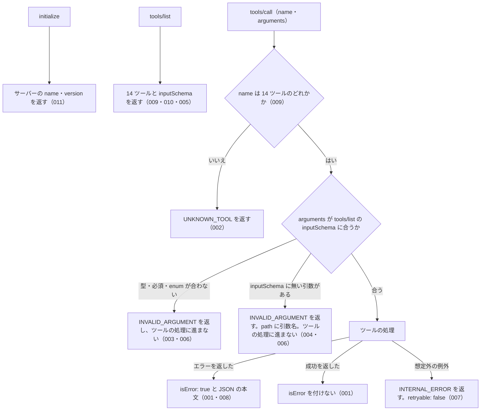

# common_errors の仕様

<!-- GENERATED FILE — 手で編集しない。本文は houki-egov-mcp の specs/current/common_errors/spec.md の写し。 -->

::: info
houki-egov-mcp **v0.20.1** の `specs/current/common_errors/spec.md` から自動生成しました（仕様 ID 33 件・2026-10-10）。手で編集しないでください。再生成は `node scripts/generate-reference.mjs specs` です。
:::

全ツールに共通するエラー応答の形と引数の検査、ツールの登録

最後に仕様が変わったのは v0.20.0 の「ローカル DB の場所を、応答・起動時のログ・`--status` で確かめられるようにする（egov #108・#110、T6）」（2026-10-04 承認）です。それまでの経緯は[承認の履歴](#承認の履歴)にあります。

## 利用者と得られる結果

この機能の利用者と、利用者が渡すもの・得られる結果を示します。

- MCP クライアント（Claude などの LLM、または MCP を呼ぶプログラム）。initialize でサーバーの名前と版を受け取り、tools/list で呼べるツールと inputSchema を確かめ、tools/call でツール名と引数を渡す。エラーのときは `isError: true` と JSON の本文を受け取って、`code` で失敗の種類を見分け、`hint` と `next_actions` で次に何をするかを決める

## 入力

呼び出すときに渡す値です。

| 入力                      | 必須 | 内容                                                                                                        |
| ------------------------- | ---- | ----------------------------------------------------------------------------------------------------------- |
| tools/call の `name`      | 必須 | 呼ぶツールの名前。下の「対象」の 14 個のどれか                                                              |
| tools/call の `arguments` | 任意 | ツールの引数（JSON オブジェクト）。tools/list に出している、そのツールの inputSchema に合わなければならない |

## 対象

この共通の規則が当てはまる範囲です。

この規則は、tools/call で呼べる次の 14 ツールすべてに当てはまる。どのツールも、tools/list の inputSchema と同じものを使って引数を検査してから、ツールの処理に進む。表の順は tools/list が返す順である。

| ツール                   | 当てはまる場面                                            |
| ------------------------ | --------------------------------------------------------- |
| `search_law`             | 引数の検査、エラー応答の形、処理中の想定外の例外          |
| `get_law`                | 同上                                                      |
| `get_toc`                | 同上                                                      |
| `get_law_range`          | 同上                                                      |
| `search_fulltext`        | 同上                                                      |
| `resolve_abbreviation`   | 同上                                                      |
| `get_law_revisions`      | 同上                                                      |
| `explain_law_type`       | 同上                                                      |
| `get_related_laws`       | 同上                                                      |
| `get_article_references` | 同上                                                      |
| `verify_citations`       | 同上                                                      |
| `list_attachments`       | 同上                                                      |
| `get_attachment`         | 同上                                                      |
| `get_law_file`           | 同上                                                      |
| 上の 14 個以外の名前     | 存在しないツール名のエラー（[SPEC-EGOV-COMMON-ERRORS-002](#spec-egov-common-errors-002)） |

### エラー応答のフィールド

エラーの本文は、次のフィールドを持つ JSON オブジェクトである。`error` と `code` は必ず付き、ほかは値があるときだけ付く（[SPEC-EGOV-COMMON-ERRORS-008](#spec-egov-common-errors-008)）。

| フィールド     | 内容                                                                                                                                                                                                                           |
| -------------- | ------------------------------------------------------------------------------------------------------------------------------------------------------------------------------------------------------------------------------ |
| `error`        | 1 文のエラーの説明（人も LLM も読む）                                                                                                                                                                                          |
| `code`         | 失敗の種類を表す文字列（下の表）                                                                                                                                                                                               |
| `tool`         | エラーを返したツールの名前。引数の検査の `INVALID_ARGUMENT` には必ず付く（[SPEC-EGOV-COMMON-ERRORS-020](#spec-egov-common-errors-020)・026）                                                                                                                   |
| `hint`         | 次に何を確かめるかの案内                                                                                                                                                                                                       |
| `next_actions` | 次に呼ぶツールや取る手段の候補の配列。要素は `action`（ツール名、または `list_tools` / `retry_later` / `visit_egov_site` / `delegate_to_mcp` のような手段の名前）・`reason`（どんなときに有効か）・`example`（引数の例。任意） |
| `retryable`    | `true` なら、時間をおいて同じ呼び出しをやり直すと結果が変わりうる                                                                                                                                                              |
| `detail`       | 調べるための詳細。`status`（HTTP ステータス）・`url`・`cause`（元の例外の文）・`issues`（引数の検査の問題の一覧。要素は `path` と `message`）                                                                                  |

### エラーの code

どの場面でどの code を返すかは、存在しないツール名・引数の検査・処理中の想定外の例外を除いて、各ツールの spec.md に書く。

| code                                                                                 | 失敗の種類                                                                                  |
| ------------------------------------------------------------------------------------ | ------------------------------------------------------------------------------------------- |
| `INVALID_ARGUMENT`                                                                   | 引数が inputSchema に合わない、または値の形がツールの受け付ける形でない（呼び出し側の誤り）。e-Gov が時点 `at` を受け付けないと答えたとき（[SPEC-EGOV-COMMON-ERRORS-033](#spec-egov-common-errors-033)）も含む |
| `INVALID_ARTICLE_NUM`                                                                | 条番号・号番号の書き方が受け付ける形でない                                                  |
| `UNKNOWN_TOOL`                                                                       | 存在しないツール名を呼んだ（呼び出し側の誤り）                                              |
| `OUT_OF_SCOPE`                                                                       | このサーバーの管轄でない資料を求めた（通達名など。別の MCP サーバーで取る）                 |
| `LAW_NOT_FOUND`                                                                      | 法令が見つからない。法令名の検索が成功して題名の完全一致が無かった（0 件、または部分一致だけ。[SPEC-EGOV-COMMON-ERRORS-032](#spec-egov-common-errors-032)）か、law_id を決めた後に e-Gov が 404 を返した（[SPEC-EGOV-COMMON-ERRORS-033](#spec-egov-common-errors-033)）。検索が通信の失敗で終わったときは `SOURCE_*` |
| `ARTICLE_NOT_FOUND`                                                                  | 法令はあるが、求めた条・項・号が無い                                                        |
| `RANGE_NOT_FOUND`                                                                    | 求めた編・章・節、または附則の番号が無い                                                    |
| `ATTACHMENT_NOT_FOUND`                                                               | 求めた添付ファイルが無い                                                                    |
| `SOURCE_API_ERROR` / `SOURCE_TIMEOUT` / `SOURCE_RATE_LIMITED` / `SOURCE_UNAVAILABLE` | e-Gov との通信が失敗した: HTTP エラー（5xx は再試行できる、429 以外の 4xx は再試行できない）/ 応答の時間切れ / 429 / 接続できない（DNS の失敗・接続拒否・接続の切断） |
| `FILE_TOO_LARGE`                                                                     | `save: true` で取るファイルが上限（50 MB）を超えている（`get_attachment` / `get_law_file`）。pdf-reader-mcp と同じ code |
| `INTERNAL_ERROR`                                                                     | サーバー内部の失敗（処理中の想定外の例外）。再試行しても結果は変わらない（`retryable: false`） |

## 扱わないこと

この機能が意図して扱わないことです。

- ツール固有のエラー（`LAW_NOT_FOUND`・`ARTICLE_NOT_FOUND` など）をどの場面で返すかを決めること（各ツールの spec.md に書く）
- inputSchema で表せない値の検査（空のキーワード、条番号の書き方など）。これは各ツールの処理で行い、各ツールの spec.md に書く
- エラーの本文を JSON 以外の形で返すこと（`format` に `markdown` を指定した呼び出しでも、エラーの本文は JSON）
- `retryable: true` のエラーを自動でやり直すこと（やり直すかは呼び出し側が決める）
- `verify_citations` の `results[]` の件ごとの `code`。ツール全体のエラーではないので `isError` を付けない（`verify_citations` の spec.md に書く）

## 処理の流れ

tools/call を受けてから応答を返すまでに、何をどの順で確かめるかを示します。図の中の番号は「できること」の仕様 ID の末尾 3 桁です。

## 仕様項目

この機能の仕様項目を、仕様 ID ごとに並べています。見出しは仕様項目を 1 文で表したもので、条件・応答の細部・例は「詳細」を開くと読めます。仕様 ID はそれぞれ受入テストと対応していて、テストの無い ID があると各リポジトリの CI が止まります。

### SPEC-EGOV-COMMON-ERRORS-001 エラーは isError: true と JSON の本文で返し、成功には isError を付けない

::: details 詳細
ツールの処理がエラー（文字列の `error` と文字列の `code` を両方持つオブジェクト）を返したときは、tools/call の結果に `isError: true` を付け、`content` の先頭の `text` にそのエラーを JSON にした文字列を入れる。ツールの処理が付けた `code` や `hint` は、そのまま本文に入る。例: 処理が `code: "LAW_NOT_FOUND"`・`hint: "テスト用"` のエラーを返すと、結果は `isError: true` で、本文の `code` は `LAW_NOT_FOUND`、`hint` は `テスト用` である。

`error` と `code` の両方を文字列で持たない応答はエラーとして扱わない。`error` だけで `code` の無いオブジェクトもエラーとして扱わない。

ツールの処理が成功を返したときは、`isError` を付けない（例: `explain_law_type` に `name: "政令"` を渡すと、`isError` の無い結果で、本文は `name: "政令"` を持つ JSON の応答）。
:::

### SPEC-EGOV-COMMON-ERRORS-002 存在しないツール名はエラー `UNKNOWN_TOOL`（`retryable: false`）で、`error` は日本語

::: details 詳細
tools/call の `name` が 14 ツールのどれでもないときは、エラー `UNKNOWN_TOOL` を返す（`isError: true`）。

- `error` は `存在しないツールです: <name>`（ほかのエラーと同じく日本語の 1 文）
- `retryable` は `false`（同じ名前で呼び直しても結果は変わらない）
- `hint` に、呼べるツール名の一覧（`search_law` など）を書く
- `next_actions` の先頭は `action: "list_tools"`（MCP の tools/list で呼べるツールを確かめる案内）

例: `name: "no_such_tool"` を呼ぶと、`code: "UNKNOWN_TOOL"`、`error: "存在しないツールです: no_such_tool"`、`retryable: false` で、`hint` に `search_law` が含まれる（v0.16.0 では `error` が英語の `Unknown tool: no_such_tool` で、`retryable` が無かった。README のエラー code の表は `false` と書いていた）。
:::

### SPEC-EGOV-COMMON-ERRORS-003 inputSchema に合わない引数はエラー `INVALID_ARGUMENT`

::: details 詳細
引数の型が違う、必須の引数が無い、`enum` に無い値を渡した、数値が `minimum` / `maximum` の範囲の外にある、文字列が `pattern` / `minLength` に合わない、配列の件数が `minItems` / `maxItems` の範囲の外にある、のどれかのときは、エラー `INVALID_ARGUMENT` を返す（`isError: true`）。14 ツールすべてが、tools/list に出している inputSchema と同じものでこの検査を行う。

- `tool` に呼んだツールの名前を入れる（[SPEC-EGOV-COMMON-ERRORS-020](#spec-egov-common-errors-020)）
- `detail.issues` に問題の一覧を入れる。要素は `path`（問題のある引数名。入れ子なら `citations.0.paragraph` の形）と `message`（日本語の 1 文。[SPEC-EGOV-COMMON-ERRORS-022](#spec-egov-common-errors-022)）。違反 1 件ごとに要素を分ける（021）

例: `explain_law_type` に `name: 123` を渡すと、`code: "INVALID_ARGUMENT"`・`tool: "explain_law_type"` で、`detail.issues[0].path` は `name`。`search_law` に引数を 1 つも渡さない（必須の `keyword` が無い）とき、`keyword: "消費税", law_type: "Bogus"` を渡したとき、`keyword: "消費税", limit: 100` を渡したとき（[SPEC-EGOV-SEARCH-LAW-013](/specs/houki-egov/search_law#spec-egov-search-law-013)）、`get_article_references` に `law_name: "所得税法"` だけを渡した（必須の `article` が無い）ときも、`INVALID_ARGUMENT` を返す。
:::

### SPEC-EGOV-COMMON-ERRORS-004 inputSchema に無い引数はエラー `INVALID_ARGUMENT` で、`path` にその引数名を入れる

::: details 詳細
inputSchema の `properties` に無い引数を渡したときは、エラー `INVALID_ARGUMENT` を返す（`isError: true`）。`detail.issues` の `path` に、その引数の名前を入れる。

例: `explain_law_type` に `name: "政令", typo: 1` を渡すと、`code: "INVALID_ARGUMENT"` で、`detail.issues[0].path` は `typo`。`get_related_laws` に `law_name: "所得税法", mcp: "houki-egov"` を渡すと、`detail.issues[0].path` は `mcp`。
:::

### SPEC-EGOV-COMMON-ERRORS-005 すべてのツールの inputSchema は、そこに無い引数を受け付けない

::: details 詳細
tools/list が返す 14 ツールの inputSchema には、どれも `additionalProperties: false` が付く。呼び出し側は tools/list を見て、どのツールでも inputSchema に無い引数は [SPEC-EGOV-COMMON-ERRORS-004](#spec-egov-common-errors-004) のエラーになると分かる。
:::

### SPEC-EGOV-COMMON-ERRORS-006 inputSchema に合わない引数では、ツールの処理に進まない

::: details 詳細
[SPEC-EGOV-COMMON-ERRORS-003](#spec-egov-common-errors-003)・004 のエラーを返すときは、ツールの処理に進まない。ツールの処理が返す応答の代わりに `INVALID_ARGUMENT` だけを返す。例: `explain_law_type` に `name: 123` を渡すと、知らない法令種別のときの応答（`found: false`）ではなく、`INVALID_ARGUMENT` のエラーを返す。
:::

### SPEC-EGOV-COMMON-ERRORS-007 処理中の想定外の例外はエラー `INTERNAL_ERROR`（`retryable: false`）で返す

::: details 詳細
ツールの処理の途中で想定外の例外が起きたときは、プロトコルのエラーにせず、tools/call の結果としてエラー `INTERNAL_ERROR` を返す（`isError: true`）。

- `retryable` は `false`（不具合の可能性が高く、同じ呼び出しをやり直しても結果は変わらない。`hint` は不具合の報告を求める。[SPEC-EGOV-COMMON-ERRORS-017](#spec-egov-common-errors-017)）
- `detail.cause` に、元の例外の文を入れる（例: 例外の文が `boom` なら `detail.cause` は `boom`）

例: ツールの処理が `new Error("boom")` を投げると、`code: "INTERNAL_ERROR"`、`retryable: false`、`detail.cause: "boom"`（v0.16.0 では `retryable: true` で、README のエラー code の表の `false` と食い違っていた）。
:::

### SPEC-EGOV-COMMON-ERRORS-008 エラーの本文には `error` と `code` が必ず付き、ほかのフィールドは値があるときだけ付く

::: details 詳細
エラーの本文には `error` と `code` が必ず付く。`hint`・`next_actions`・`retryable`・`detail` は、そのエラーで値を決めたときだけ付き、決めていないときはフィールドごと付かない。`next_actions` が空の配列になるときも付けない。

例: `hint`・`next_actions`・`retryable` を決めていない `LAW_NOT_FOUND` のエラーは `error` と `code` だけを持つ。`hint: "wait"`・`next_actions`（`retry_later` の 1 件）・`retryable: true`・`detail`（`status: 429`）を決めたエラーは、それらをすべて持つ。
:::

### SPEC-EGOV-COMMON-ERRORS-009 tools/list と tools/call のツールは同じ 14 個

::: details 詳細
tools/list は「対象」の表の 14 ツールを返す。tools/call で呼べる名前も同じ 14 個で、それ以外の名前は [SPEC-EGOV-COMMON-ERRORS-002](#spec-egov-common-errors-002) のエラーになる。v0.2.0 で外した `explain_business_law_restriction` は、どちらにも無い。
:::

### SPEC-EGOV-COMMON-ERRORS-010 tools/list の inputSchema は JSON Schema のまま渡る

::: details 詳細
tools/list が返す各ツールの `inputSchema` は、`type: "object"` と `properties`・`required` を持つ JSON Schema である。例: `search_law` の `inputSchema` は `type: "object"`、`required: ["keyword"]`。
:::

### SPEC-EGOV-COMMON-ERRORS-011 initialize でサーバーの名前と版を返す

::: details 詳細
initialize の応答の `serverInfo` は、`name` にパッケージ名（`@shuji-bonji/houki-egov-mcp`）、`version` にパッケージの版（v0.15.1 なら `0.15.1`）を持つ。
:::

### SPEC-EGOV-COMMON-ERRORS-012 `arguments` を省いた呼び出しは空のオブジェクトとして検査し、エラー `INVALID_ARGUMENT` を返す

::: details 詳細
tools/call の `arguments` を省くと、空のオブジェクト `{}` を渡したものとして inputSchema で検査する。14 ツールはどれも必須の引数を 1 つ以上持つので、どのツールでもエラー `INVALID_ARGUMENT` を返す（`isError: true`）。ツールの処理には進まない。

例: `name: "search_law"` を `arguments` なしで呼ぶと、`isError: true`、`code: "INVALID_ARGUMENT"`、`tool: "search_law"`、`hint` は `tools/list の search_law の inputSchema を確認してください (型・必須・enum・範囲・形式・未知の引数)`、`detail.issues` は `[{ path: "keyword", message: "必須の引数です" }]`。`explain_law_type`・`get_law`・`resolve_abbreviation`・`verify_citations`・`list_attachments`・`get_law_file` を `arguments` なしで呼んでも、どれも `code: "INVALID_ARGUMENT"`。`arguments: {}` を渡したときと同じ本文になる。
:::

### SPEC-EGOV-COMMON-ERRORS-013 inputSchema の検査で返す `INVALID_ARGUMENT` の `error` は、決まった前置きの後に問題を `<path>: <message>` の形で続ける

::: details 詳細
[SPEC-EGOV-COMMON-ERRORS-003](#spec-egov-common-errors-003)・004 のエラーの `error` は、`引数が tools/list の inputSchema に合いません: ` の後に、`detail.issues` の各要素を `<path>: <message>` の形にして `; ` 区切りで続けた文字列である。`path` は空にならない（[SPEC-EGOV-COMMON-ERRORS-021](#spec-egov-common-errors-021)）ので、`<message>` だけの要素は無い。`message` は [SPEC-EGOV-COMMON-ERRORS-022](#spec-egov-common-errors-022) の文である。

例:

| 呼び出し                                               | `error`                                                                                                                              | `detail.issues`                                                                                                  |
| ------------------------------------------------------ | ------------------------------------------------------------------------------------------------------------------------------------ | ---------------------------------------------------------------------------------------------------------------- |
| `explain_law_type` に `name: 123`                      | `引数が tools/list の inputSchema に合いません: name: 文字列で指定してください`                                                      | `[{ path: "name", message: "文字列で指定してください" }]`                                                        |
| `explain_law_type` に `name: "政令", typo: 1`          | `引数が tools/list の inputSchema に合いません: typo: inputSchema に無い引数です`                                                    | `[{ path: "typo", message: "inputSchema に無い引数です" }]`                                                      |
| `search_law` に `keyword: "消費税", law_type: "Bogus"` | `引数が tools/list の inputSchema に合いません: law_type: Constitution・Act・CabinetOrder・ImperialOrder・MinisterialOrdinance・Rule のどれかで指定してください` | `[{ path: "law_type", message: "Constitution・Act・CabinetOrder・ImperialOrder・MinisterialOrdinance・Rule のどれかで指定してください" }]` |
| `search_law` に `keyword: 1, limit: "x"`               | `引数が tools/list の inputSchema に合いません: keyword: 文字列で指定してください; limit: 整数で指定してください`                    | `[{ path: "keyword", message: "文字列で指定してください" }, { path: "limit", message: "整数で指定してください" }]` |

（v0.17.0 の 3 行目の文は `Act・CabinetOrder・ImperialOrdinance・MinisterialOrdinance・Rule のどれかで指定してください`。`law_type` の選択肢を [SPEC-EGOV-SEARCH-LAW-018](/specs/houki-egov/search_law#spec-egov-search-law-018) で変えたので、文も変わる。）
:::

### SPEC-EGOV-COMMON-ERRORS-014 inputSchema の検査で返す `INVALID_ARGUMENT` の `hint` は、呼んだツールの名前を入れた決まった文

::: details 詳細
[SPEC-EGOV-COMMON-ERRORS-003](#spec-egov-common-errors-003)・004 のエラーの `hint` は `tools/list の <ツール名> の inputSchema を確認してください (型・必須・enum・範囲・形式・未知の引数)` で、`<ツール名>` は tools/call の `name` である。

例: `explain_law_type` に `name: 123` を渡すと、`hint` は `tools/list の explain_law_type の inputSchema を確認してください (型・必須・enum・範囲・形式・未知の引数)`。`search_law` に `keyword: "消費税", limit: 0` を渡すと、`hint` は `tools/list の search_law の inputSchema を確認してください (型・必須・enum・範囲・形式・未知の引数)`。
:::

### SPEC-EGOV-COMMON-ERRORS-015 inputSchema の検査で返す `INVALID_ARGUMENT` の `next_actions` は `list_tools` の 1 件

::: details 詳細
[SPEC-EGOV-COMMON-ERRORS-003](#spec-egov-common-errors-003)・004 のエラーの `next_actions` は、`{ action: "list_tools", reason: "inputSchema で引数の型と必須項目を確認できます" }` の 1 件だけである。`example` は付かない。`retryable` も付かない。

例: `explain_law_type` に `name: "政令", typo: 1` を渡すと、`next_actions` は `[{ action: "list_tools", reason: "inputSchema で引数の型と必須項目を確認できます" }]` で、本文に `retryable` のキーは無い。
:::

### SPEC-EGOV-COMMON-ERRORS-016 処理中の想定外の例外で返す `INTERNAL_ERROR` の `error` は `内部エラーが発生しました: <例外の文>`

::: details 詳細
[SPEC-EGOV-COMMON-ERRORS-007](#spec-egov-common-errors-007) のエラーの `error` は、`内部エラーが発生しました: ` の後に元の例外の文を続けた文字列である。例外が Error でない値（文字列など）のときは、その値を文字列にしたものを続ける。`detail.cause` も同じ文になる。

例: ツールの処理が `new Error("boom")` を投げると、`error` は `内部エラーが発生しました: boom`、`detail.cause` は `boom`。文字列 `"strboom"` を投げると、`error` は `内部エラーが発生しました: strboom`、`detail.cause` は `strboom`。
:::

### SPEC-EGOV-COMMON-ERRORS-017 処理中の想定外の例外で返す `INTERNAL_ERROR` の `hint` は不具合の報告を促す決まった文

::: details 詳細
[SPEC-EGOV-COMMON-ERRORS-007](#spec-egov-common-errors-007) のエラーの `hint` は `バグの可能性があります。再現手順を添えて GitHub issue でご報告ください` である。例外の文によって変わらない。

例: ツールの処理が `new Error("boom")` を投げたときも、文字列 `"strboom"` を投げたときも、`hint` は `バグの可能性があります。再現手順を添えて GitHub issue でご報告ください`。
:::

### SPEC-EGOV-COMMON-ERRORS-018 処理中の想定外の例外で返す `INTERNAL_ERROR` には `next_actions` を付けない

::: details 詳細
[SPEC-EGOV-COMMON-ERRORS-007](#spec-egov-common-errors-007) のエラーには `next_actions` を付けない。再試行を案内する `retry_later` は、`retryable: false` と `hint` の「再現手順を添えて GitHub issue でご報告ください」に合わないので入れない。次の 1 件が無くなると `next_actions` が空になるので、[SPEC-EGOV-COMMON-ERRORS-008](#spec-egov-common-errors-008) のとおりキーごと付けない。

例: ツールの処理が `new Error("boom")` を投げると、エラーの本文に `next_actions` は無い（v0.16.0 では `[{ action: "retry_later", reason: "一時的な API エラーの可能性があります。30秒〜数分後に再試行してください" }]` だった）。
:::

### SPEC-EGOV-COMMON-ERRORS-019 `hint` が空文字のエラーには `hint` を付けない

::: details 詳細
ツールの処理が `hint` を空文字にしたエラーを返したときは、本文に `hint` のキーを付けない。[SPEC-EGOV-COMMON-ERRORS-008](#spec-egov-common-errors-008) の「値を決めていないとき」と同じに扱う。

例: ツールの処理が `code: "LAW_NOT_FOUND"`・`error: "x"`・`hint: ""` のエラーを返すと、結果は `isError: true` で、本文は `{ "error": "x", "code": "LAW_NOT_FOUND" }` だけを持つ（`hint` のキーは無い）。
:::

### SPEC-EGOV-COMMON-ERRORS-020 inputSchema の検査で返す `INVALID_ARGUMENT` は `tool` に呼んだツールの名前を持つ

::: details 詳細
[SPEC-EGOV-COMMON-ERRORS-003](#spec-egov-common-errors-003)・004・012 のエラーの本文は、`code` と並ぶ位置に `tool` を持ち、値は tools/call の `name` である。houki-nta-mcp の同じエラー（[SPEC-NTA-COMMON-ERRORS-003](/specs/houki-nta/common_errors#spec-nta-common-errors-003)）と同じ置き場で、`detail` の中ではない。

例: `explain_law_type` に `name: 123` を渡すと `tool: "explain_law_type"`。`get_related_laws` に `law_name: "所得税法", mcp: "houki-egov"` を渡すと `tool: "get_related_laws"`。`verify_citations` を `arguments` なしで呼ぶと `tool: "verify_citations"`。
:::

### SPEC-EGOV-COMMON-ERRORS-021 `detail.issues` は違反 1 件ごとに要素を分け、`path` には引数名を入れる

::: details 詳細
[SPEC-EGOV-COMMON-ERRORS-003](#spec-egov-common-errors-003)・004 のエラーの `detail.issues` は、違反 1 件につき 1 要素である。`path` は、その違反のあった引数の名前で、空文字にならない。

- 必須の引数が無いときも、`path` はその引数の名前である（`""` ではない）。必須の引数が 2 つ無ければ、要素も 2 つ
- inputSchema に無い引数が 2 つ以上あるときも、1 つずつ別の要素にする（`typo, foo` のようにまとめない）
- 型の違反と inputSchema に無い引数が同時にあるときは、両方の要素を返す
- 配列の要素の中の引数は、`citations.0.paragraph` のように、引数名・添字・フィールド名を `.` でつなぐ

例: `explain_law_type` に `name: "政令", typo: 1, foo: 2` を渡すと、`detail.issues` は `[{ path: "typo", … }, { path: "foo", … }]` の 2 要素で、どちらの `message` も `inputSchema に無い引数です`。`get_article_references` に `{}` を渡すと `[{ path: "law_name", message: "必須の引数です" }, { path: "article", message: "必須の引数です" }]`。`search_law` に `keyword: "a", limit: "x", zz: 1` を渡すと `path` が `limit` と `zz` の 2 要素。`verify_citations` に `citations: [{ law_name: "民法", article: "1", paragraph: 0 }]` を渡すと `[{ path: "citations.0.paragraph", message: "1 以上で指定してください" }]`。
:::

### SPEC-EGOV-COMMON-ERRORS-022 `detail.issues[].message` は違反の種類ごとに決まった日本語の 1 文

::: details 詳細
[SPEC-EGOV-COMMON-ERRORS-003](#spec-egov-common-errors-003)・004 のエラーの `message` は、次の表の文である。検査の部品が作る英文（`must be string` など）はそのまま返さない。

| 違反                                     | `message`                                                                                            |
| ---------------------------------------- | ---------------------------------------------------------------------------------------------------- |
| 型が `string` でない                     | `文字列で指定してください`                                                                           |
| 型が `integer` でない（小数を含む）      | `整数で指定してください`                                                                             |
| 型が `number` でない                     | `数値で指定してください`                                                                             |
| 型が `number` と `string` の和（`type: ["number", "string"]` / `["string", "number"]`）で、そのどちらでもない（`null`・配列・`true` など） | `数値か文字列で指定してください`（`type` の並びによらずこの文） |
| 型が `boolean` でない                    | `true か false で指定してください`                                                                   |
| 型が `array` でない                      | `配列で指定してください`                                                                             |
| 型が `object` でない                     | `オブジェクトで指定してください`                                                                     |
| 必須の引数が無い                         | `必須の引数です`                                                                                     |
| `enum` に無い値                          | `<値1>・<値2>・… のどれかで指定してください`（`enum` の値を `・` でつなぐ）                          |
| `minimum` を下回る                       | `<minimum> 以上で指定してください`（例: `1 以上で指定してください`）                                 |
| `maximum` を上回る                       | `<maximum> 以下で指定してください`（例: `50 以下で指定してください`）                                |
| `pattern` に合わない（`at`）             | `YYYY-MM-DD の形で指定してください`                                                                  |
| `minLength: 1` に合わない（空文字）      | `空文字は指定できません`                                                                             |
| `minItems` を下回る                      | `<minItems> 件以上で指定してください`                                                                |
| `maxItems` を上回る                      | `<maxItems> 件以下で指定してください`                                                                |
| inputSchema に無い引数                   | `inputSchema に無い引数です`                                                                         |

例: `get_law` に `law_name: "民法", paragraph: 1.5` を渡すと `message` は `整数で指定してください`。`paragraph: 0` なら `1 以上で指定してください`。`search_law` に `keyword: "民法", limit: 51` を渡すと `50 以下で指定してください`。`get_law` に `law_name: "民法", at: "2024/04/01"` を渡すと `YYYY-MM-DD の形で指定してください`。`get_law` に `law_name: ""` を渡すと `空文字は指定できません`。`get_law_file` に `law_name: "民法", file_type: "pdf"` を渡すと `xml・json・html・rtf・docx のどれかで指定してください`。`verify_citations` に `citations: []` を渡すと `1 件以上で指定してください`。`get_law` に `law_name: "民法", article: "1", item: null` を渡すと `数値か文字列で指定してください`（`item` は `type: ["number", "string"]`）。
:::

### SPEC-EGOV-COMMON-ERRORS-023 数値の引数は inputSchema に整数と範囲を書き、範囲の外は `INVALID_ARGUMENT` にして丸めない

::: details 詳細
数値の引数は、tools/list の inputSchema に `type: "integer"` と `minimum`（上限があるものは `maximum` も）を書く。0・負の数・小数・上限を超える値・数値でない値は、[SPEC-EGOV-COMMON-ERRORS-003](#spec-egov-common-errors-003) の検査で `INVALID_ARGUMENT` になり、ツールの処理に進まない。既定値に丸めたり、上限に切り詰めたり、切り捨てたりしない。

| ツール                   | 引数                    | `minimum` | `maximum` | 省いたとき                    | 仕様 ID                                |
| ------------------------ | ----------------------- | --------- | --------- | ----------------------------- | -------------------------------------- |
| `search_law`             | `limit`                 | 1         | 50        | 10                            | [SPEC-EGOV-SEARCH-LAW-013](/specs/houki-egov/search_law#spec-egov-search-law-013)               |
| `search_fulltext`        | `limit`                 | 1         | 30        | 10                            | [SPEC-EGOV-SEARCH-FULLTEXT-033](/specs/houki-egov/search_fulltext#spec-egov-search-fulltext-033)          |
| `get_law_revisions`      | `latest`                | 1         | なし      | 全件                          | [SPEC-EGOV-GET-LAW-REVISIONS-012](/specs/houki-egov/get_law_revisions#spec-egov-get-law-revisions-012)        |
| `get_toc`                | `depth`                 | 1         | なし      | 全階層                        | [SPEC-EGOV-GET-TOC-023](/specs/houki-egov/get_toc#spec-egov-get-toc-023)                  |
| `get_law`                | `paragraph`             | 1         | なし      | 条全体                        | [SPEC-EGOV-GET-LAW-036](/specs/houki-egov/get_law#spec-egov-get-law-036)                  |
| `get_article_references` | `paragraph`             | 1         | なし      | 条全体                        | [SPEC-EGOV-GET-ARTICLE-REFERENCES-040](/specs/houki-egov/get_article_references#spec-egov-get-article-references-040)   |
| `verify_citations`       | `citations[].paragraph` | 1         | なし      | 条まで                        | [SPEC-EGOV-VERIFY-CITATIONS-041](/specs/houki-egov/verify_citations#spec-egov-verify-citations-041)         |
| `get_law_range`          | `suppl_index`           | 1         | なし      | （附則を範囲にしない）        | [SPEC-EGOV-GET-LAW-RANGE-030](/specs/houki-egov/get_law_range#spec-egov-get-law-range-030)            |
| `get_law`                | `suppl_index`           | 1         | なし      | 本則の条を探す                | [SPEC-EGOV-GET-LAW-043](/specs/houki-egov/get_law#spec-egov-get-law-043)                  |
| `verify_citations`       | `citations[].suppl_index` | 1       | なし      | 本則の条を確かめる            | [SPEC-EGOV-VERIFY-CITATIONS-047](/specs/houki-egov/verify_citations#spec-egov-verify-citations-047)         |
| `get_law_range`          | `max_chars`             | 2,000     | 120,000   | 30,000                        | [SPEC-EGOV-GET-LAW-RANGE-023](/specs/houki-egov/get_law_range#spec-egov-get-law-range-023)（既存）    |

`get_law` / `verify_citations` の `item` は文字列（`"8の2"`）も受け付けるので、この表に入れない（読めない形は `INVALID_ARTICLE_NUM`。[SPEC-EGOV-GET-LAW-011](/specs/houki-egov/get_law#spec-egov-get-law-011)）。

例: tools/list の `search_law` の inputSchema は `properties.limit` が `type: "integer"`、`minimum: 1`、`maximum: 50` を持つ。`get_toc` の `properties.depth` は `type: "integer"`、`minimum: 1` を持ち、`maximum` を持たない。`get_law` に `law_name: "消費税法", article: "100", suppl_index: 0` を渡すと `detail.issues` は `[{ path: "suppl_index", message: "1 以上で指定してください" }]`。
:::

### SPEC-EGOV-COMMON-ERRORS-024 `at` は `YYYY-MM-DD` の形を inputSchema の `pattern` で確かめ、暦に無い日付はツールの処理で `INVALID_ARGUMENT` にする

::: details 詳細
時点の引数 `at` を持つ 8 ツール（`get_law` / `get_toc` / `get_law_range` / `get_article_references` / `verify_citations` / `list_attachments` / `get_attachment` / `get_law_file`）は、inputSchema の `at` に `pattern: "^[0-9]{4}-[0-9]{2}-[0-9]{2}$"` を書く。形に合わない値（`2024/04/01`、`20240401`、`2024-4-1`、`2024-04-01T00:00:00Z`）は [SPEC-EGOV-COMMON-ERRORS-003](#spec-egov-common-errors-003) の検査で `INVALID_ARGUMENT`（`path: "at"`、`message: "YYYY-MM-DD の形で指定してください"`）になり、ツールの処理に進まない。

形は合うが暦に無い日付（`2026-02-30`、`2026-13-01`、`2026-04-31`）は、ツールの処理が e-Gov に問い合わせる前に、[SPEC-EGOV-COMMON-ERRORS-026](#spec-egov-common-errors-026) と同じ形の `INVALID_ARGUMENT`（`tool`・`detail.issues: [{ path: "at", message: "暦に無い日付です" }]`）を返す。`error` は `at が暦に無い日付です: <渡した値>`。

例: `get_law` に `law_name: "民法", at: "2024/04/01"` を渡すと `code: "INVALID_ARGUMENT"`、`tool: "get_law"`、`detail.issues` は `[{ path: "at", message: "YYYY-MM-DD の形で指定してください" }]` で、e-Gov への問い合わせは 0 回。`at: "2026-02-30"` を渡すと `detail.issues` は `[{ path: "at", message: "暦に無い日付です" }]` で、e-Gov への問い合わせは 0 回。`at: "2024-04-01"` は検査を通る。
:::

### SPEC-EGOV-COMMON-ERRORS-025 必須の文字列の引数は inputSchema に `minLength: 1` を書き、空文字は `INVALID_ARGUMENT`

::: details 詳細
必須の文字列の引数（`search_law` / `search_fulltext` の `keyword`、`get_law` / `get_toc` / `get_law_range` / `get_law_revisions` / `get_related_laws` / `get_article_references` / `list_attachments` / `get_attachment` / `get_law_file` の `law_name`、`resolve_abbreviation` の `abbr`、`explain_law_type` の `name`、`get_article_references` の `article`、`verify_citations` の `citations[].article`）は、inputSchema に `minLength: 1` を書く。空文字は [SPEC-EGOV-COMMON-ERRORS-003](#spec-egov-common-errors-003) の検査で `INVALID_ARGUMENT`（`message: "空文字は指定できません"`）になり、ツールの処理に進まない。`enum` を持つ必須の文字列（`get_law_file` の `file_type`）は `enum` で止まるので `minLength` は書かない。`verify_citations` の `law_name` / `law_id` は片方が必須なので `minLength` を書かず、[SPEC-EGOV-VERIFY-CITATIONS-003](/specs/houki-egov/verify_citations#spec-egov-verify-citations-003)・032 のままである。

例: `get_law` に `law_name: ""` を渡すと `code: "INVALID_ARGUMENT"`、`tool: "get_law"`、`detail.issues` は `[{ path: "law_name", message: "空文字は指定できません" }]` で、e-Gov への問い合わせは 0 回（v0.15.4 の `LAW_NOT_FOUND` ではない）。`resolve_abbreviation` に `abbr: ""` を渡しても `INVALID_ARGUMENT`（v0.15.4 の `resolved: null` ではない）。`search_fulltext` に `keyword: ""` を渡しても `INVALID_ARGUMENT`（v0.15.4 の `hits: []` ではない）。
:::

### SPEC-EGOV-COMMON-ERRORS-026 空白だけの必須の文字列は、ツールの処理で同じ形の `INVALID_ARGUMENT` にする

::: details 詳細
必須の文字列の引数が空白（半角スペース・全角スペース・タブ・改行）だけのときは、inputSchema では止まらないので、各ツールの処理が、e-Gov・ローカル DB・略称辞書のどれにも問い合わせる前に `INVALID_ARGUMENT` を返す。本文は次の形で、inputSchema の検査のエラーと同じ `tool`・`detail.issues` を持つ。

- `tool`: 呼んだツールの名前
- `error`: `<引数名> が空です`
- `detail.issues`: `[{ path: "<引数名>", message: "空白だけは指定できません" }]`
- `hint`: 各ツールが決める（その引数に何を渡すかの案内）
- `next_actions`: 各ツールが決める（付けなくてもよい）

対象の引数は [SPEC-EGOV-COMMON-ERRORS-025](#spec-egov-common-errors-025) と同じ。各ツールの仕様 ID は、`search_law` 007、`get_law` 003、`get_toc` 025、`search_fulltext` 034、`resolve_abbreviation` 010、`get_law_revisions` 013、`explain_law_type` 019、`get_related_laws` 016、`get_article_references` 039、`verify_citations` 042、`get_law_range` 029、`list_attachments` 020、`get_attachment` 023、`get_law_file` 018。

例: `get_law` に `law_name: "   "` を渡すと `code: "INVALID_ARGUMENT"`、`tool: "get_law"`、`error: "law_name が空です"`、`detail.issues` は `[{ path: "law_name", message: "空白だけは指定できません" }]` で、e-Gov への問い合わせは 0 回。`explain_law_type` に `name: "\t\n"` を渡しても `INVALID_ARGUMENT`（`found: false` の応答ではない）。
:::

### SPEC-EGOV-COMMON-ERRORS-027 `SOURCE_*` は e-Gov との通信が失敗したときだけ返し、`*_NOT_FOUND` は問い合わせが成功して求めたものが無かったときと、e-Gov が「その法令が無い」と答えたときだけ返す

::: details 詳細
`SOURCE_API_ERROR` / `SOURCE_TIMEOUT` / `SOURCE_RATE_LIMITED` / `SOURCE_UNAVAILABLE` は、e-Gov への要求が次の表のどれかで終わったときだけ返す。`LAW_NOT_FOUND` / `ARTICLE_NOT_FOUND` / `RANGE_NOT_FOUND` / `ATTACHMENT_NOT_FOUND` は、e-Gov への要求（法令名の検索、法令本文の取得など）が成功し、その応答の中に求めたものが無かったときと、e-Gov が応答本文の `code` で「その法令（添付）が無い」と答えたとき（[SPEC-EGOV-COMMON-ERRORS-033](#spec-egov-common-errors-033)、[SPEC-EGOV-GET-ATTACHMENT-010](/specs/houki-egov/get_attachment#spec-egov-get-attachment-010)）だけ返す。通信の失敗を `*_NOT_FOUND` にしない。e-Gov と関係の無い処理中の例外は `SOURCE_*` にせず `INTERNAL_ERROR`（[SPEC-EGOV-COMMON-ERRORS-007](#spec-egov-common-errors-007)）にする。

| e-Gov への要求の終わり方                                           | `code`                | `retryable` | `detail`                                  |
| ------------------------------------------------------------------ | --------------------- | ----------- | ----------------------------------------- |
| HTTP 429                                                           | `SOURCE_RATE_LIMITED` | `true`      | `status: 429`、`url`                      |
| 応答を待ちきれなかった（時間切れ）                                 | `SOURCE_TIMEOUT`      | `true`      | `url`                                     |
| HTTP 5xx                                                           | `SOURCE_API_ERROR`    | `true`      | `status`、`url`                           |
| HTTP 4xx（429 と、[SPEC-EGOV-COMMON-ERRORS-033](#spec-egov-common-errors-033) の表の応答を除く）   | `SOURCE_API_ERROR`    | `false`     | `status`、`url`                           |
| 接続できない（[SPEC-EGOV-COMMON-ERRORS-028](#spec-egov-common-errors-028)）                        | `SOURCE_UNAVAILABLE`  | `true`      | `cause`（`ENOTFOUND` などの code）        |
| そのほかのネットワークの失敗（例外の `cause.code` が表に無いもの） | `SOURCE_API_ERROR`    | `true`      | `cause`（例外の文）                       |

この表は、法令本文の取得（[SPEC-EGOV-GET-LAW-028](/specs/houki-egov/get_law#spec-egov-get-law-028)〜031 など）でも、法令名の検索（[SPEC-EGOV-COMMON-ERRORS-029](#spec-egov-common-errors-029)）でも、ファイルの取得（[SPEC-EGOV-GET-ATTACHMENT-019](/specs/houki-egov/get_attachment#spec-egov-get-attachment-019)、[SPEC-EGOV-GET-LAW-FILE-014](/specs/houki-egov/get_law_file#spec-egov-get-law-file-014)）でも同じである。4xx のうち別の code にするものは、[SPEC-EGOV-COMMON-ERRORS-033](#spec-egov-common-errors-033)（law_id を決めた後の 404 と、時点の 400）と、そのツールの spec.md（`get_attachment` の 404003 は `ATTACHMENT_NOT_FOUND`。[SPEC-EGOV-GET-ATTACHMENT-010](/specs/houki-egov/get_attachment#spec-egov-get-attachment-010)）に書く。

例: `get_law` に `{ law_name: "ほげほげ法", article: "1" }` を渡し、法令名の検索が 0 件で成功したときは `LAW_NOT_FOUND`。同じ引数で法令名の検索が 503 で終わったときは `SOURCE_API_ERROR`・`retryable: true` で、`LAW_NOT_FOUND` にはならない。法令名の検索が 400 で終わったときは `SOURCE_API_ERROR`・`retryable: false`（検索の 400 は 033 の対象ではない）。
:::

### SPEC-EGOV-COMMON-ERRORS-028 e-Gov に接続できないときは、例外の `cause.code` を見て `SOURCE_UNAVAILABLE` を返す

::: details 詳細
e-Gov への要求で、HTTP の応答を受け取る前に接続の失敗で例外が起きたときは、例外の `message` だけでなく `cause.code`（Node の `fetch` が投げる `TypeError: fetch failed` の `cause` に入る、`ENOTFOUND` のような文字列）も見て、次の表の code のどれかなら `SOURCE_UNAVAILABLE`（`retryable: true`）を返す。`detail.cause` にその code を入れ、`hint` にネットワークか DNS を確かめる案内、`next_actions` に `retry_later` と `visit_egov_site` を入れる。e-Gov を呼ぶ 11 ツール（`search_law` / `get_law` / `get_toc` / `get_law_range` / `get_law_revisions` / `get_related_laws` / `get_article_references` / `verify_citations` / `list_attachments` / `get_attachment` / `get_law_file`）で同じである。取り直しの回数は、429・5xx のときと同じ（3 回）で、取り直しても接続できなかったときにこのエラーになる。

| `cause.code`   | 意味                       |
| -------------- | -------------------------- |
| `ENOTFOUND`    | ホスト名を解決できない     |
| `EAI_AGAIN`    | DNS が一時的に答えない     |
| `ECONNREFUSED` | 接続を拒否された           |
| `ECONNRESET`   | 接続が途中で切れた         |
| `ETIMEDOUT`    | TCP の接続が時間切れになった |

`cause.code` がこの表に無く、`message` にもこれらの文字列が無いネットワークの失敗は、[SPEC-EGOV-COMMON-ERRORS-027](#spec-egov-common-errors-027) の表の最後の行（`SOURCE_API_ERROR`、`retryable: true`）のままである。

例: `fetch` が `TypeError("fetch failed")` を投げ、その `cause` が `{ code: "ENOTFOUND", hostname: "laws.e-gov.go.jp" }` のとき、`search_law` に `{ keyword: "消費税" }` を渡すと `code: "SOURCE_UNAVAILABLE"`、`retryable: true`、`detail.cause: "ENOTFOUND"`（v0.15.4 では `message` に `ENOTFOUND` が無いので `SOURCE_API_ERROR`・`detail.cause: "fetch failed"` だった）。`cause` が `{ code: "ECONNREFUSED" }` でも同じ。
:::

### SPEC-EGOV-COMMON-ERRORS-029 法令名から law_id を決める e-Gov の検索が通信の失敗で終わったときは、`LAW_NOT_FOUND` ではなく `SOURCE_*` を返す

::: details 詳細
`law_name` を受け取り、略称辞書に law_id が無いときに e-Gov の法令名検索で law_id を決めるツールは、その検索が [SPEC-EGOV-COMMON-ERRORS-027](#spec-egov-common-errors-027) の表のどれかで終わったとき、表の code を返す。`LAW_NOT_FOUND` は、検索が成功して題名の完全一致が無かったとき（0 件のときと、部分一致だけのとき。[SPEC-EGOV-COMMON-ERRORS-032](#spec-egov-common-errors-032)）だけ返す。`retryable` と `detail` は 027 の表のとおりで、`next_actions` には `LAW_NOT_FOUND` のときの `resolve_abbreviation` / `search_law` や候補の呼び直しを入れない（法令名を変えても通らないため）。

ただし、時点 `at` を付けた法令名の検索（[SPEC-EGOV-COMMON-ERRORS-032](#spec-egov-common-errors-032)）に e-Gov が応答本文の `code` `400044` の 400 を返したときは、通信の失敗ではなく時点の誤りとして、[SPEC-EGOV-COMMON-ERRORS-033](#spec-egov-common-errors-033) の `INVALID_ARGUMENT` を返す。

| ツール                   | 仕様 ID                              |
| ------------------------ | ------------------------------------ |
| `get_law`                | [SPEC-EGOV-GET-LAW-038](/specs/houki-egov/get_law#spec-egov-get-law-038)                |
| `get_toc`                | [SPEC-EGOV-GET-TOC-026](/specs/houki-egov/get_toc#spec-egov-get-toc-026)                |
| `get_law_range`          | [SPEC-EGOV-GET-LAW-RANGE-032](/specs/houki-egov/get_law_range#spec-egov-get-law-range-032)          |
| `get_law_revisions`      | [SPEC-EGOV-GET-LAW-REVISIONS-014](/specs/houki-egov/get_law_revisions#spec-egov-get-law-revisions-014)      |
| `get_related_laws`       | [SPEC-EGOV-GET-RELATED-LAWS-017](/specs/houki-egov/get_related_laws#spec-egov-get-related-laws-017)       |
| `get_article_references` | [SPEC-EGOV-GET-ARTICLE-REFERENCES-042](/specs/houki-egov/get_article_references#spec-egov-get-article-references-042) |
| `list_attachments`       | [SPEC-EGOV-LIST-ATTACHMENTS-022](/specs/houki-egov/list_attachments#spec-egov-list-attachments-022)       |
| `get_attachment`         | [SPEC-EGOV-GET-ATTACHMENT-026](/specs/houki-egov/get_attachment#spec-egov-get-attachment-026)         |
| `get_law_file`           | [SPEC-EGOV-GET-LAW-FILE-020](/specs/houki-egov/get_law_file#spec-egov-get-law-file-020)           |
| `verify_citations`       | [SPEC-EGOV-VERIFY-CITATIONS-034](/specs/houki-egov/verify_citations#spec-egov-verify-citations-034)〜036（v0.15.4 の時点で既にこの規則） |

略称辞書に law_id がある名前（`消費税法` など）では法令名検索を引かないので（[SPEC-EGOV-GET-LAW-REVISIONS-011](/specs/houki-egov/get_law_revisions#spec-egov-get-law-revisions-011) など）、このエラーは起きない。

例: 法令名の検索が 503 を返す状態で `get_toc` に `{ law_name: "架空の法律" }` を渡すと、`code: "SOURCE_API_ERROR"`、`retryable: true`、`detail.status: 503` で、`LAW_NOT_FOUND` ではない（v0.15.4 では `LAW_NOT_FOUND` だった）。検索が時間切れなら `SOURCE_TIMEOUT`、429 なら `SOURCE_RATE_LIMITED`、接続できなければ `SOURCE_UNAVAILABLE`、400 なら `SOURCE_API_ERROR`・`retryable: false`。検索が 0 件で成功したときと、部分一致だけのときは `LAW_NOT_FOUND`（032）。
:::

### SPEC-EGOV-COMMON-ERRORS-030 上限を超える大きさのファイルは `FILE_TOO_LARGE` で断る

::: details 詳細
`get_attachment` / `get_law_file` の `save: true` で取るファイルが上限（50 MB）を超えているときは、エラー `FILE_TOO_LARGE`（`retryable: false`）を返す。`INVALID_ARGUMENT` にはしない（引数の誤りではないため）。`error` にファイルの大きさと上限、`hint` に「保存せず url をそのまま使ってください」、`detail.url` に取得した URL、`detail.bytes` にファイルの大きさ（Content-Length の値、または読み終えた大きさ）を入れる。code の名前は pdf-reader-mcp の `FILE_TOO_LARGE` と同じにし、houki-research-skill の `docs/ERROR-CODES.md` では houki-egov-mcp の列にも付ける。大きさの確かめ方は [SPEC-EGOV-GET-ATTACHMENT-027](/specs/houki-egov/get_attachment#spec-egov-get-attachment-027)、[SPEC-EGOV-GET-LAW-FILE-021](/specs/houki-egov/get_law_file#spec-egov-get-law-file-021)。

例: e-Gov の応答の Content-Length が `52428801`（50 MB + 1 バイト）のとき、`get_attachment` に `{ law_name: "民法", src: "./pict/big.pdf", save: true }` を渡すと `code: "FILE_TOO_LARGE"`、`retryable: false`、`detail.bytes: 52428801` で、ファイルは保存しない（v0.15.4 では `INVALID_ARGUMENT` だった）。
:::

### SPEC-EGOV-COMMON-ERRORS-031 同期の記録の日付を解釈できないときは `INTERNAL_ERROR`（`retryable: false`）にし、全件の取り込みを案内する

::: details 詳細
ローカル DB の `sync_state.last_sync_date` が、日付（`YYYY-MM-DD`）または時差付きの時刻（`YYYY-MM-DDTHH:MM:SSZ` / `+09:00`）として解釈できないとき（空文字、`2026/05/08` のような別の書き方、`2026-02-30` のような暦に無い日付）、鮮度（`freshness`）を計算するツールは、想定外の例外として止まらず、エラー `INTERNAL_ERROR` を返す。

- `retryable`: `false`（時間をおいても DB の値は変わらない）
- `error`: `同期の記録の日付を読めません: <last_sync_date の値>`
- `hint`: `--bulk-download-everything` を付けた案内のコマンド（[SPEC-EGOV-DB-SCHEMA-029](/specs/houki-egov/db_schema#spec-egov-db-schema-029)）で同期の記録を作り直す案内（`next_actions` は付けない。CLI を案内する `action` の名前が houki-egov-mcp には無いため）
- `detail.cause`: 元の例外の文（houki-abbreviations の `computeDaysSince` が投げる `RangeError` の文）

当てはまるのは `search_fulltext`（[SPEC-EGOV-SEARCH-FULLTEXT-035](/specs/houki-egov/search_fulltext#spec-egov-search-fulltext-035)）と CLI の `--status`（[SPEC-EGOV-CLI-STATUS-009](/specs/houki-egov/cli_status#spec-egov-cli-status-009)。CLI なので JSON ではなく標準エラー出力）である。取り込みが書く `last_sync_date` は `YYYY-MM-DD` なので、取り込みを通した DB ではこのエラーは起きない。

例: `sync_state.last_sync_date` を `2026/05/08` に書き換えた DB で、環境変数を付けずに起動した MCP サーバーの `search_fulltext` に `{ keyword: "軽減税率" }` を渡すと、`code: "INTERNAL_ERROR"`、`retryable: false`、`error` に `2026/05/08` を含み、`hint` に `npx -y @shuji-bonji/houki-egov-mcp@latest --bulk-download-everything` を含み（v0.19.x では `houki-egov-mcp --bulk-download-everything`）、`hits` は返さない。
:::

### SPEC-EGOV-COMMON-ERRORS-032 法令名から law_id を決めるときは題名の完全一致だけを使い、完全一致が無ければ候補を付けた `LAW_NOT_FOUND` を返して法令を取らない

::: details 詳細
`law_name` を受け取るツールは、次の順で法令を 1 つに決める。どの段でも決まらなければ、その法令の本文・目次・改正履歴・添付を取らない。

1. 略称辞書（`resolveAbbreviation(name, { normalize: true })`）に houki-egov の管轄で `law_id` を持つエントリがあれば、その法令に決める（今までどおり。e-Gov の法令名検索は引かない）
2. 無ければ、照合する名前（辞書に正式名称だけがあればその正式名称、辞書に無ければ前後の空白を除いた `law_name`）で e-Gov の法令名検索（`/laws` の `law_title`。部分一致）を引く。`at` を受け取るツールで `at` を渡したときは、検索にも `asof=<at>` を付け、その時点の題名で照合する
3. 検索結果の全件（e-Gov の応答の `total_count` の件数。先頭の 5 件や 50 件で打ち切らない）の中に、`revision_info.law_title` が照合する名前と完全に一致する法令があれば、その法令に決める
4. 完全一致が無く、部分一致が 1 件以上あれば、エラー `LAW_NOT_FOUND`（`retryable: false`）を返す。検索結果の先頭の法令を使わない
5. 部分一致も 0 件なら、今までどおりのエラー `LAW_NOT_FOUND`（各ツールの spec.md の文）を返す

4 の `LAW_NOT_FOUND` の本文は次の形である。

| フィールド     | 内容                                                                                                                                                                                                                                                                      |
| -------------- | ------------------------------------------------------------------------------------------------------------------------------------------------------------------------------------------------------------------------------------------------------------------------- |
| `error`        | `完全一致する法令名がありません: <照合した名前>（部分一致 <total_count> 件）`                                                                                                                                                                                              |
| `hint`         | `部分一致した法令（先頭 <n> 件）: <題名1>（<法令番号1>）、<題名2>（<法令番号2>）、…。求めた法令なら、その題名を law_name に渡して呼び直してください`。`<n>` は 5 と `total_count` の小さいほう                                                                                |
| `next_actions` | 候補の先頭 5 件まで、1 件ごとに `{ action: <呼んだツールの名前>, reason: "<題名>（<法令番号>）を指すなら、この名前で呼び直せます", example: <渡した引数のうち law_name だけを候補の題名に替えたもの> }`。その後に `{ action: "search_law", example: { keyword: <渡した law_name> } }` |
| `retryable`    | `false`                                                                                                                                                                                                                                                                   |

候補の並びは e-Gov の検索結果の順である。`example` には、渡さなかった引数を足さない。

当てはまるツールと仕様 ID:

| ツール                   | 仕様 ID                              | `at` を検索に使うか |
| ------------------------ | ------------------------------------ | ------------------- |
| `get_law`                | [SPEC-EGOV-GET-LAW-041](/specs/houki-egov/get_law#spec-egov-get-law-041)                | 使う                |
| `get_toc`                | [SPEC-EGOV-GET-TOC-028](/specs/houki-egov/get_toc#spec-egov-get-toc-028)                | 使う                |
| `get_law_range`          | [SPEC-EGOV-GET-LAW-RANGE-034](/specs/houki-egov/get_law_range#spec-egov-get-law-range-034)          | 使う                |
| `get_law_revisions`      | [SPEC-EGOV-GET-LAW-REVISIONS-018](/specs/houki-egov/get_law_revisions#spec-egov-get-law-revisions-018)      | `at` を受け取らない |
| `get_related_laws`       | [SPEC-EGOV-GET-RELATED-LAWS-019](/specs/houki-egov/get_related_laws#spec-egov-get-related-laws-019)       | `at` を受け取らない |
| `get_article_references` | [SPEC-EGOV-GET-ARTICLE-REFERENCES-044](/specs/houki-egov/get_article_references#spec-egov-get-article-references-044) | 使う                |
| `list_attachments`       | [SPEC-EGOV-LIST-ATTACHMENTS-024](/specs/houki-egov/list_attachments#spec-egov-list-attachments-024)       | 使う                |
| `get_attachment`         | [SPEC-EGOV-GET-ATTACHMENT-030](/specs/houki-egov/get_attachment#spec-egov-get-attachment-030)         | 使う                |
| `get_law_file`           | [SPEC-EGOV-GET-LAW-FILE-023](/specs/houki-egov/get_law_file#spec-egov-get-law-file-023)           | 使う                |
| `verify_citations`       | [SPEC-EGOV-VERIFY-CITATIONS-045](/specs/houki-egov/verify_citations#spec-egov-verify-citations-045)       | 使う（4 は件ごとの `ambiguous` のまま。[SPEC-EGOV-VERIFY-CITATIONS-013](/specs/houki-egov/verify_citations#spec-egov-verify-citations-013)） |

例（2026-10-03 10:10 JST に e-Gov 法令 API v2 の `/laws` で確かめた値）:

- `get_law` に `{ law_name: "所得税法施行", article: "1" }`（辞書に無い）を渡すと、`/laws?law_title=所得税法施行` は `total_count: 2`（所得税法施行令・所得税法施行規則）で完全一致が無いので、`code: "LAW_NOT_FOUND"`、`error: "完全一致する法令名がありません: 所得税法施行（部分一致 2 件）"`、`next_actions` は `[{ action: "get_law", example: { law_name: "所得税法施行令", article: "1" } }, { action: "get_law", example: { law_name: "所得税法施行規則", article: "1" } }, { action: "search_law", example: { keyword: "所得税法施行" } }]`（各要素は `reason` 付き）。v0.17.0 では所得税法施行令の第 1 条を、所得税法施行令であることを `meta.title` だけで示して返していた
- `get_toc` に `{ law_name: "保険法" }`（辞書に無い）を渡すと、`/laws?law_title=保険法` は `total_count: 114` で、完全一致の `保険法`（`420AC0000000056`、平成二十年法律第五十六号）は 78 件目にある。全件から探すので保険法の目次を返す。v0.17.0 では先頭 5 件の中に完全一致が無いため、1 件目の健康保険法（`211AC0000000070`）の目次を返していた
- `get_law` に `{ law_name: "行政手続等における情報通信の技術の利用に関する法律", article: "1", at: "2018-01-01" }` を渡すと、`/laws?law_title=…&asof=2018-01-01` の 1 件目の題名がこの名前（`414AC0000000151`。2019 年に「情報通信技術を活用した行政の推進等に関する法律」へ改題）で完全一致するので、その時点の第 1 条を返す。`at` を付けない検索では今の題名が返り、完全一致しないので候補付きの `LAW_NOT_FOUND` になる
:::

### SPEC-EGOV-COMMON-ERRORS-033 law_id を決めた後に e-Gov が「その法令が無い」と答えたときは `LAW_NOT_FOUND`、時点を受け付けないと答えたときは `INVALID_ARGUMENT` を返す

::: details 詳細
law_id を決めた後（略称辞書・法令名の検索・`verify_citations` の `law_id`）に、e-Gov の法令本文の取得（`/law_data/<law_id>`）、ファイルの取得（`/law_file/<file_type>/<law_id>`）、改正履歴の取得（`/law_revisions/<law_id>`）が 4xx を返したときは、応答本文の `code` を見て次のように返す。

| e-Gov の応答                                                    | 意味（e-Gov の `message`）                                         | 返す `code`         | `retryable` |
| --------------------------------------------------------------- | ------------------------------------------------------------------ | ------------------- | ----------- |
| 404、`code: "404004"`（`/law_data`・`/law_file`）               | `指定のパラメータで取得できる法令本文ファイルは存在しません。`     | `LAW_NOT_FOUND`     | `false`     |
| 404、`code: "404001"`（`/law_revisions`）                       | `取得結果が０件です。`                                             | `LAW_NOT_FOUND`     | `false`     |
| 400、`code: "400044"`（`asof` を付けた要求）                    | `法令の時点（asof）には2017-04-01以降を指定してください。`         | `INVALID_ARGUMENT`  | `false`     |
| そのほかの 4xx（429 を除く。本文の `code` が読めないときを含む） | —                                                                  | `SOURCE_API_ERROR`（027 の表のまま） | `false`     |

`LAW_NOT_FOUND` の本文:

- `error`: `at` を渡したときは `<法令名> は <at> の時点の e-Gov に収録されていません`、渡さないときは `e-Gov に law_id <law_id> の法令がありません`。`<法令名>` は略称辞書・検索で決めた題名（`verify_citations` の `law_id` だけの件では law_id）
- `hint`: `at` を渡したときは `その時点にこの法令がまだ無いか、law_id が古い可能性があります。改正履歴で施行日を確かめるか、at を省いて呼び直してください`。渡さないときは `略称辞書の law_id が古い（廃止・統合された）か、law_id の書き間違いの可能性があります`
- `next_actions`: `search_law`（`example: { keyword: <渡した law_name。無ければ law_id> }`）。`at` を渡し、法令名が分かっているときは、その前に `get_law_revisions`（`example: { law_name: <渡した law_name> }`）を置く
- `detail`: `status: 404`、`url`、`cause`（e-Gov の `code`。例: `"404004"`）

`INVALID_ARGUMENT` の本文は [SPEC-EGOV-COMMON-ERRORS-026](#spec-egov-common-errors-026) と同じ形で、`tool`、`error: "at の時点を e-Gov が受け付けません: <at>"`、`detail.issues: [{ path: "at", message: "e-Gov が受け付ける時点の範囲の外です" }]`、`hint` に e-Gov の `message` をそのまま含める（範囲の下限の日付をこのサーバーに書き込まないため）。`detail.status: 400`、`detail.url`、`detail.cause: "400044"` も付ける。

当てはまるツールと仕様 ID:

| ツール                   | 仕様 ID                                                   |
| ------------------------ | --------------------------------------------------------- |
| `get_law`                | [SPEC-EGOV-GET-LAW-031](/specs/houki-egov/get_law#spec-egov-get-law-031)（MODIFIED）                         |
| `get_toc`                | [SPEC-EGOV-GET-TOC-029](/specs/houki-egov/get_toc#spec-egov-get-toc-029)                                     |
| `get_law_range`          | [SPEC-EGOV-GET-LAW-RANGE-035](/specs/houki-egov/get_law_range#spec-egov-get-law-range-035)                               |
| `get_law_revisions`      | [SPEC-EGOV-GET-LAW-REVISIONS-008](/specs/houki-egov/get_law_revisions#spec-egov-get-law-revisions-008)（MODIFIED。404001 だけ）  |
| `get_article_references` | [SPEC-EGOV-GET-ARTICLE-REFERENCES-051](/specs/houki-egov/get_article_references#spec-egov-get-article-references-051)                      |
| `list_attachments`       | [SPEC-EGOV-LIST-ATTACHMENTS-018](/specs/houki-egov/list_attachments#spec-egov-list-attachments-018)（MODIFIED）                |
| `get_attachment`         | [SPEC-EGOV-GET-ATTACHMENT-031](/specs/houki-egov/get_attachment#spec-egov-get-attachment-031)（法令本文の取得の段だけ。`/attachment` の 4xx は [SPEC-EGOV-GET-ATTACHMENT-010](/specs/houki-egov/get_attachment#spec-egov-get-attachment-010)・018 のまま） |
| `get_law_file`           | [SPEC-EGOV-GET-LAW-FILE-014](/specs/houki-egov/get_law_file#spec-egov-get-law-file-014)（MODIFIED）                    |
| `verify_citations`       | [SPEC-EGOV-VERIFY-CITATIONS-015](/specs/houki-egov/verify_citations#spec-egov-verify-citations-015)（MODIFIED）・048           |

例（2026-10-03 10:10 JST に e-Gov 法令 API v2 で確かめた値）:

- `/law_data/999AC0000000999` は 404・`{"code":"404004", …}`。`/law_data/503AC0000000035?asof=2018-01-01`（デジタル社会形成基本法。令和三年法律第三十五号）も 404・`404004`。`/law_revisions/999AC0000000999` は 404・`404001`
- `/law_data/340AC0000000033?asof=2000-01-01`（所得税法）は 400・`{"code":"400044","message":"法令の時点（asof）には2017-04-01以降を指定してください。"}`。法令が 2017-04-01 より前からあっても同じ
- `get_law` に `{ law_name: "所得税法", article: "9", at: "2000-01-01" }` を渡すと、`code: "INVALID_ARGUMENT"`、`tool: "get_law"`、`detail.issues: [{ path: "at", message: "e-Gov が受け付ける時点の範囲の外です" }]`、`hint` に `2017-04-01以降` を含む（v0.17.0 では `SOURCE_API_ERROR`・`error: "e-Gov API error: e-Gov API returned 400"` で、理由が分からなかった）
- `verify_citations` に `{ citations: [{ law_id: "503AC0000000035", article: "1" }], at: "2018-01-01" }` を渡すと、その件は `status: "not_found"`、`code: "LAW_NOT_FOUND"`、`reason: "503AC0000000035 は 2018-01-01 の時点の e-Gov に収録されていません"`（[SPEC-EGOV-VERIFY-CITATIONS-015](/specs/houki-egov/verify_citations#spec-egov-verify-citations-015)）。法令名で渡したとき（`law_name: "デジタル社会形成基本法"`、辞書に無い）は、`asof=2018-01-01` を付けた法令名の検索が 0 件になり、032 の 5 の `LAW_NOT_FOUND` になる
:::

## 検討中のこと

仕様を書き起こしたときに見つかった項目のうち、扱いを Issue で検討しているものです。ここに挙げたことは、今後の版で変わることがあります。開くと、元の仕様書の記述をそのまま読めます。

::: details 仕様書の「未決」の節
初版起こしで見つけた、意図か不具合かを人が決める項目です。決まったら「できること」に ID を振るか、`specs/changes/` の差分にします。

意図か不具合かの判断が要る項目は houki-egov-mcp の Issue に移し、ここには題と Issue の番号だけを残します。今の振る舞いのままでよくテストが無いだけの項目は、受入テストを書いてから「できること」に ID を振ります。

1. **`arguments` を省いた呼び出し。** → [SPEC-EGOV-COMMON-ERRORS-012](#spec-egov-common-errors-012)
2. **inputSchema の検査で返す `INVALID_ARGUMENT` の `error`・`hint`・`next_actions`。** → [SPEC-EGOV-COMMON-ERRORS-013](#spec-egov-common-errors-013)・[SPEC-EGOV-COMMON-ERRORS-014](#spec-egov-common-errors-014)・[SPEC-EGOV-COMMON-ERRORS-015](#spec-egov-common-errors-015)
6. **`UNKNOWN_TOOL` の `error` の文面と `retryable`。** → [SPEC-EGOV-COMMON-ERRORS-002](#spec-egov-common-errors-002)
7. **処理中の想定外の例外で返す `INTERNAL_ERROR` の `retryable` が README と違う。** → [SPEC-EGOV-COMMON-ERRORS-007](#spec-egov-common-errors-007)・[SPEC-EGOV-COMMON-ERRORS-018](#spec-egov-common-errors-018)
8. **処理中の想定外の例外で返す `INTERNAL_ERROR` の `error`・`hint`・`next_actions`。** → [SPEC-EGOV-COMMON-ERRORS-016](#spec-egov-common-errors-016)・[SPEC-EGOV-COMMON-ERRORS-017](#spec-egov-common-errors-017)・[SPEC-EGOV-COMMON-ERRORS-018](#spec-egov-common-errors-018)
9. **`hint` が空文字のときは付けない。** → [SPEC-EGOV-COMMON-ERRORS-019](#spec-egov-common-errors-019)
:::

## 承認の履歴

この機能の仕様が、いつ、どの変更で承認されたかを新しい順に並べています。各リポジトリの `npx spec-ids history common_errors` と同じ内容です。変更の名前から、変更の理由と前後の振る舞いを書いた文書（GitHub）を開けます。

::: details 承認の履歴（10 件）
| 承認日 | 版 | 変更 | 仕様 PR |
|---|---|---|---|
| 2026-10-04 | v0.20.0 | [ローカル DB の場所を、応答・起動時のログ・`--status` で確かめられるようにする（egov #108・#110、T6）](https://github.com/shuji-bonji/houki-egov-mcp/blob/v0.20.1/specs/releases/v0.20.0/20261004-db-location/proposal.md) | [#114](https://github.com/shuji-bonji/houki-egov-mcp/pull/114) |
| 2026-10-03 | v0.18.0 | [law_type の勅令の値を e-Gov に揃え、条の無い参照から get_toc を案内する（段階 5 追加分）](https://github.com/shuji-bonji/houki-egov-mcp/blob/v0.20.1/specs/releases/v0.18.0/20261003-law-type-and-reference-actions/proposal.md) | [#99](https://github.com/shuji-bonji/houki-egov-mcp/pull/99) |
| 2026-10-03 | v0.18.0 | [法令名・条・委任先を、確かなときだけ 1 つに決める（段階 5 法令の引き当て）](https://github.com/shuji-bonji/houki-egov-mcp/blob/v0.20.1/specs/releases/v0.18.0/20261003-law-resolution/proposal.md) | [#95](https://github.com/shuji-bonji/houki-egov-mcp/pull/95) |
| 2026-10-03 | v0.17.0 | [README・使い方・tool description と実際の動きの食い違いを、行ごとに直す（T5 文書と実装の食い違い）](https://github.com/shuji-bonji/houki-egov-mcp/blob/v0.20.1/specs/releases/v0.17.0/20261003-t5-docs-mismatch/proposal.md) | [#92](https://github.com/shuji-bonji/houki-egov-mcp/pull/92) |
| 2026-10-01 | v0.16.0 | [T1 の差分の書き残しを直す（和の型の message、max_chars の例、REMOVED を指す未決）](https://github.com/shuji-bonji/houki-egov-mcp/blob/v0.20.1/specs/releases/v0.16.0/20261002-t1-followups/proposal.md) | [#89](https://github.com/shuji-bonji/houki-egov-mcp/pull/89) |
| 2026-10-01 | v0.16.0 | [「見つからない」と「取得元の失敗」の code を分ける（T2）](https://github.com/shuji-bonji/houki-egov-mcp/blob/v0.20.1/specs/releases/v0.16.0/20261001-t2-error-codes/proposal.md) | [#85](https://github.com/shuji-bonji/houki-egov-mcp/pull/85) |
| 2026-10-01 | v0.16.0 | [引数の検査を inputSchema に書き、丸めずに `INVALID_ARGUMENT` にする（T1）](https://github.com/shuji-bonji/houki-egov-mcp/blob/v0.20.1/specs/releases/v0.16.0/20261001-t1-argument-guards/proposal.md) | [#84](https://github.com/shuji-bonji/houki-egov-mcp/pull/84) |
| 2026-09-28 | v0.15.2 | [テストが無いだけの振る舞いに仕様 ID を振る](https://github.com/shuji-bonji/houki-egov-mcp/blob/v0.20.1/specs/releases/v0.15.2/20260928-untested-behaviors/proposal.md) | [#76](https://github.com/shuji-bonji/houki-egov-mcp/pull/76) |
| 2026-09-28 | v0.15.2 | [「未決」のうち判断が要る 85 件を Issue に移す](https://github.com/shuji-bonji/houki-egov-mcp/blob/v0.20.1/specs/releases/v0.15.2/20260928-undecided-to-issues/proposal.md) | [#68](https://github.com/shuji-bonji/houki-egov-mcp/pull/68) |
| 2026-09-28 | — | 初版 | [#50](https://github.com/shuji-bonji/houki-egov-mcp/pull/50) |
:::

## 関連ページ

このページの元になった文書と、あわせて読むページです。

- [houki-egov-mcp の仕様の一覧](/specs/houki-egov/)
- [houki-egov-mcp の解説](/mcp/houki-egov)
- [元の仕様書（GitHub、v0.20.1）](https://github.com/shuji-bonji/houki-egov-mcp/blob/v0.20.1/specs/current/common_errors/spec.md)
