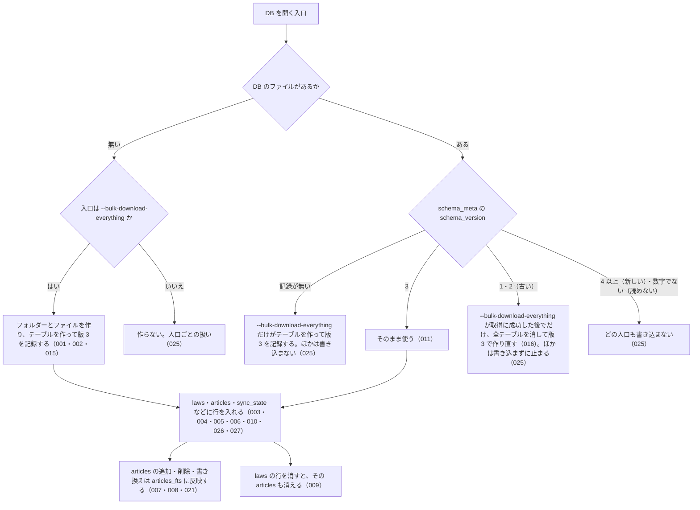

# db_schema の仕様

<!-- GENERATED FILE — 手で編集しない。本文は houki-egov-mcp の specs/current/db_schema/spec.md の写し。 -->

::: info
houki-egov-mcp **v0.20.0** の `specs/current/db_schema/spec.md` から自動生成しました（仕様 ID 28 件・2026-10-09）。手で編集しないでください。再生成は `node scripts/generate-reference.mjs specs` です。
:::

このページは、houki-egov-mcp のローカル DB「db_schema（全文検索に使うローカル SQLite DB の置き場所とテーブル）」の仕様です。「承認の履歴」の前までは、仕様書の本文を言い換えずに写しています。

最後に仕様が変わったのは v0.20.0 の「ローカル DB の場所を、応答・起動時のログ・`--status` で確かめられるようにする（egov #108・#110、T6）」（2026-10-04 承認）です。それまでの経緯は[承認の履歴](#承認の履歴)にあります。

## 使う人と受け取るもの

この機能を誰が呼び、何を渡して何を受け取るかを示します。

- 利用者（CLI の `--bulk-download-everything` / `--sync` で DB を作り・最新化し、`--status` で中身を確かめ、sqlite3 で直接開くこともある人）
- MCP クライアント（`search_fulltext` を呼ぶと、サーバーがこの DB を開いて引く）

## 入力

呼び出すときに渡す値です。

利用者がこの DB に触れる入口は次のとおり。

| 入口                                        | 必須 | 内容                                                                                                                                                                      |
| ------------------------------------------- | ---- | ------------------------------------------------------------------------------------------------------------------------------------------------------------------------- |
| 環境変数 `HOUKI_EGOV_DB_PATH`               | 任意 | DB ファイルのパスをまるごと指定する。ほかの指定より優先する                                                                                                               |
| 環境変数 `XDG_CACHE_HOME`                   | 任意 | `HOUKI_EGOV_DB_PATH` が無いとき、`$XDG_CACHE_HOME/houki-egov-mcp/laws.db` に置く。これも無いときは `~/.cache/houki-egov-mcp/laws.db`                                      |
| CLI `--bulk-download-everything` / `--sync` | 任意 | `--bulk-download-everything` は DB を作る・古い版の DB を作り直す唯一の入口。`--sync` / `--bulk-download-by-date` は版が同じ DB にだけ書き込む（[SPEC-EGOV-DB-SCHEMA-025](#spec-egov-db-schema-025)） |
| CLI `--status`                              | 任意 | DB を読むだけ。DB のファイルを作らない（[SPEC-EGOV-DB-SCHEMA-025](#spec-egov-db-schema-025)）                                                                                                         |
| ツール `search_fulltext`                    | 任意 | 呼び出しごとに DB を読むだけで開き、閉じる。DB のファイルを作らない（[SPEC-EGOV-DB-SCHEMA-025](#spec-egov-db-schema-025)）                                                                            |

## できないこと

この機能が引き受けないことです。

- DB を消したり中身を空にしたりする CLI やツールは無い（空にするには利用者がファイルを消す）
- スキーマの版を 1 つずつ上げる移行（古い版の DB は `--bulk-download-everything` が作り直す。新しい版・読めない版の DB はどの入口も書き換えない。[SPEC-EGOV-DB-SCHEMA-025](#spec-egov-db-schema-025)）
- 法令の本文を DB から直接返すこと（`get_law` などは e-Gov API を呼び、この DB を使わない）
- `laws.category` による絞り込み（v0.15.1 では取り込み時に値を入れていない。`search_fulltext` の spec.md に書く）
- 既定のファイル名（laws.db）に DB の版を入れること（houki-hub DECISIONS.md 2026-10-04 の T6 の (f)。開発で版を上げるときは HOUKI_EGOV_DB_PATH で別のファイルを使う）

## 処理の流れ

DB を開いたときに何が起きるかを示します。図の中の番号は「できること」の仕様 ID の末尾 3 桁です。



## 仕様 ID ごとの約束

この機能が守る約束を、仕様 ID ごとに並べています。見出しは約束を 1 文で表したもので、条件・応答の細部・例は「詳細」を開くと読めます。仕様 ID はそれぞれ受入テストと対応していて、テストの無い ID があると各リポジトリの CI が止まります。

<a id="spec-egov-db-schema-001"></a>

### SPEC-EGOV-DB-SCHEMA-001 DB を作るとスキーマの版 3 を記録する

::: details 詳細
`--bulk-download-everything` が新しい DB を作ると、`schema_meta` テーブルに `key = 'schema_version'`、`value = '3'` の行を記録する。v0.19.0 のスキーマの版は 3 である（v0.5.0〜v0.18.x は 2）。
:::

<a id="spec-egov-db-schema-002"></a>

### SPEC-EGOV-DB-SCHEMA-002 DB は 7 つのテーブルを持つ

::: details 詳細
DB を開くと、次のテーブルを作る。

| テーブル         | 内容                                         |
| ---------------- | -------------------------------------------- |
| `schema_meta`    | スキーマの版などを `key` と `value` で持つ   |
| `laws`           | 法令の履歴 1 件につき 1 行                   |
| `articles`       | 条（または別表）1 つにつき 1 行              |
| `revisions_meta` | 法令の履歴のメタ情報                         |
| `sync_state`     | 取り込みの同期の状態（1 行だけ）             |
| `laws_fts`       | 法令名・略称・法令番号・分類の全文検索の索引 |
| `articles_fts`   | 条の本文と見出しの全文検索の索引             |
:::

<a id="spec-egov-db-schema-003"></a>

### SPEC-EGOV-DB-SCHEMA-003 laws テーブルの列

::: details 詳細
`laws` テーブルは次の列を持つ。主キーは `law_revision_id`（法令の履歴の ID）。

| 分類       | 列                                                                                                                     |
| ---------- | ---------------------------------------------------------------------------------------------------------------------- |
| 識別子     | `law_revision_id`、`law_id`                                                                                            |
| 法令の情報 | `law_type`、`law_num`、`law_title`、`abbrev`、`category`                                                               |
| 日付       | `promulgation_date`、`amendment_promulgate_date`、`amendment_enforcement_date`、`amendment_scheduled_enforcement_date` |
| 状態       | `current_revision_status`、`repeal_status`、`repeal_date`、`remain_in_force`、`amendment_type`                         |
| 同期       | `updated`、`fetched_at`、`content_hash`                                                                                |
:::

<a id="spec-egov-db-schema-004"></a>

### SPEC-EGOV-DB-SCHEMA-004 articles テーブルの列（検索用の本文と表示用の本文を両方持つ）

::: details 詳細
`articles` テーブルは `id`、`law_revision_id`、`article_num`、`caption`、`chapter_path`、`ord`、`body`、`body_raw` の列を持つ。`body` は検索に使う本文、`body_raw` は表示に使う元の本文で、1 つの条に両方を持つ。
:::

<a id="spec-egov-db-schema-005"></a>

### SPEC-EGOV-DB-SCHEMA-005 laws.current_revision_status は 4 つの値だけを受け付ける

::: details 詳細
`laws.current_revision_status` に入る値は `CurrentEnforced`・`UnEnforced`・`PreviousEnforced`・`Repeal` のどれかで、ほかの値（例: `InvalidStatus`）の行は入らない（書き込みがエラーになる）。
:::

<a id="spec-egov-db-schema-006"></a>

### SPEC-EGOV-DB-SCHEMA-006 laws.repeal_status は 4 つの値だけを受け付ける

::: details 詳細
`laws.repeal_status` に入る値は `None`・`Repeal`・`LossOfEffectiveness`・`Expire` のどれかで、ほかの値（例: `BogusRepeal`）の行は入らない（書き込みがエラーになる）。
:::

<a id="spec-egov-db-schema-007"></a>

### SPEC-EGOV-DB-SCHEMA-007 articles に入れた条は articles_fts で部分一致で引ける

::: details 詳細
`articles` に行を入れると、その `body` と `caption` が `articles_fts` に入る。`articles_fts` は語の途中からでも引ける。例: `body` が `この法律は預金者を保護する` の条を入れると、`articles_fts MATCH '預金者'` でその条が当たる。
:::

<a id="spec-egov-db-schema-008"></a>

### SPEC-EGOV-DB-SCHEMA-008 articles から消した条は articles_fts からも消える

::: details 詳細
`articles` から行を消すと、その条は `articles_fts` でも当たらなくなる。例: `body` が `XYZUNIQUEWORD` の条を入れると `articles_fts MATCH 'XYZUNIQUEWORD'` は 1 件、その行を消すと 0 件。
:::

<a id="spec-egov-db-schema-009"></a>

### SPEC-EGOV-DB-SCHEMA-009 laws の行を消すと、その法令の articles も消える

::: details 詳細
`laws` の行を消すと、同じ `law_revision_id` を持つ `articles` の行も消える。
:::

<a id="spec-egov-db-schema-010"></a>

### SPEC-EGOV-DB-SCHEMA-010 sync_state は 1 行だけ

::: details 詳細
`sync_state` は `id = 1` の行だけを持てる。`id` が 1 でない行は入らない（書き込みがエラーになる）。
:::

<a id="spec-egov-db-schema-011"></a>

### SPEC-EGOV-DB-SCHEMA-011 同じ DB を開き直しても壊れない

::: details 詳細
版 3 の DB をどの入口（CLI・`search_fulltext`）で何度開いても、テーブルは残り、`schema_version` は 3 のまま変わらない。
:::

<a id="spec-egov-db-schema-012"></a>

### SPEC-EGOV-DB-SCHEMA-012 `HOUKI_EGOV_DB_PATH` があれば、その場所の DB を使う

::: details 詳細
環境変数 `HOUKI_EGOV_DB_PATH` に空でない値があれば、どの入口もそのパスのファイルを DB として使う。`XDG_CACHE_HOME` があっても `HOUKI_EGOV_DB_PATH` を優先する。

例: `HOUKI_EGOV_DB_PATH=<一時ディレクトリ>/a/b/x.db`、`XDG_CACHE_HOME=<一時ディレクトリ>/xdg` で `--bulk-download-everything` を実行すると、`<一時ディレクトリ>/a/b/x.db` ができる。`<一時ディレクトリ>/xdg/houki-egov-mcp/laws.db` はできない。
:::

<a id="spec-egov-db-schema-013"></a>

### SPEC-EGOV-DB-SCHEMA-013 `HOUKI_EGOV_DB_PATH` が無ければ `$XDG_CACHE_HOME/houki-egov-mcp/laws.db` を使う

::: details 詳細
`HOUKI_EGOV_DB_PATH` が無いか空文字で、`XDG_CACHE_HOME` に空でない値があれば、DB の場所を `$XDG_CACHE_HOME/houki-egov-mcp/laws.db` にする。

例: `HOUKI_EGOV_DB_PATH` が空文字、`XDG_CACHE_HOME=<一時ディレクトリ>/xdg` で `--bulk-download-everything` を実行すると、`<一時ディレクトリ>/xdg/houki-egov-mcp/laws.db` ができる。
:::

<a id="spec-egov-db-schema-014"></a>

### SPEC-EGOV-DB-SCHEMA-014 どちらも無ければ `~/.cache/houki-egov-mcp/laws.db` を使う

::: details 詳細
`HOUKI_EGOV_DB_PATH` と `XDG_CACHE_HOME` がどちらも無いか空文字なら、DB の場所をホームディレクトリの `.cache/houki-egov-mcp/laws.db` にする。`XDG_CACHE_HOME` が空文字のときも、無いときと同じに扱う。

例: `HOME=<一時ディレクトリ>`、`HOUKI_EGOV_DB_PATH` と `XDG_CACHE_HOME` を空文字にして `--bulk-download-everything` を実行すると、`<一時ディレクトリ>/.cache/houki-egov-mcp/laws.db` ができる。2 つの環境変数を消したときも同じ場所になる。同じ環境で `--status` を実行すると、`  DB: ` の行にこの場所が出る。
:::

<a id="spec-egov-db-schema-015"></a>

### SPEC-EGOV-DB-SCHEMA-015 DB の置き場所のフォルダーを作るのは `--bulk-download-everything` だけ

::: details 詳細
`--bulk-download-everything` は、DB の置き場所のフォルダーが無ければ、途中のフォルダーも含めて作ってから DB のファイルを作る。ほかの入口（`--sync`・`--bulk-download-by-date`・`--status`・`search_fulltext`）は、フォルダーもファイルも作らない（[SPEC-EGOV-DB-SCHEMA-025](#spec-egov-db-schema-025)）。

例: `<一時ディレクトリ>/a` が無い状態で `HOUKI_EGOV_DB_PATH=<一時ディレクトリ>/a/b/x.db` として `--bulk-download-everything` を実行すると、`<一時ディレクトリ>/a/b/` ができ、その中に `x.db` ができる。同じ状態で `--status` を実行しても、`--sync` を実行しても、`search_fulltext` を呼んでも、`<一時ディレクトリ>/a` はできない（v0.18.x までは `--status` と `search_fulltext` もフォルダーと空の DB を作っていた）。
:::

<a id="spec-egov-db-schema-016"></a>

### SPEC-EGOV-DB-SCHEMA-016 版 1・2 の DB は、`--bulk-download-everything` が取得に成功した後でだけ作り直す

::: details 詳細
`schema_meta` の `schema_version` が `1` または `2`（v0.18.x 以前で作った DB）のファイルは、`--bulk-download-everything` が全件の zip の取得に成功した後でだけ、`laws`・`articles`・`revisions_meta`・`sync_state`・`laws_fts`・`articles_fts` を消して版 3 のテーブルで作り直し、`schema_version` を `3` にしてから取り込む。取得に失敗したとき（[SPEC-EGOV-CLI-BULK-DOWNLOAD-004](/specs/houki-egov/cli_bulk_download#spec-egov-cli-bulk-download-004)）は、古い DB をそのまま残す。ほかの入口は版 1・2 の DB を作り直さない（[SPEC-EGOV-DB-SCHEMA-025](#spec-egov-db-schema-025)）。

例: `laws` に 1 行、`articles` に 2 行、`sync_state` に 1 行を入れた DB の `schema_version` を `2` に書き換え、法令 1 件（条 1 つ）の zip を返すようにして `--bulk-download-everything` を実行すると、終わった後の `schema_meta` は `schema_version = '3'` の 1 行、`laws` は zip の 1 行だけ、`articles` は 1 行、`sync_state` の列は [SPEC-EGOV-DB-SCHEMA-020](#spec-egov-db-schema-020) の 5 つ。取得に HTTP 503 が返って終了コード 1 で終わったときは、`schema_version` は `2` のままで、`laws` の 1 行・`articles` の 2 行も残る。
:::

<a id="spec-egov-db-schema-017"></a>

### SPEC-EGOV-DB-SCHEMA-017 版 1・2 の DB から作り直した後も、7 つのテーブルと articles_fts への反映が使える

::: details 詳細
[SPEC-EGOV-DB-SCHEMA-016](#spec-egov-db-schema-016) で作り直した DB は、[SPEC-EGOV-DB-SCHEMA-002](#spec-egov-db-schema-002) の 7 つのテーブルを持ち、`articles` に入れた条は [SPEC-EGOV-DB-SCHEMA-007](#spec-egov-db-schema-007) と同じく `articles_fts` で引ける。

例: 作り直した DB の `laws` に 1 行、`articles` に `body` が `再作成後の本文QWERTY` の行を入れると、`articles_fts MATCH 'QWERTY'` は 1 件。
:::

<a id="spec-egov-db-schema-018"></a>

### SPEC-EGOV-DB-SCHEMA-018 laws_fts テーブルの列（law_revision_id は索引に載せない）

::: details 詳細
`laws_fts` は `law_revision_id`・`law_title`・`law_title_kana`・`abbrev`・`law_num`・`category` の列を持つ。`law_revision_id` は `laws` の行を指すために持つだけで、全文検索の対象にしない。

例: `law_revision_id = 'L1_20200101_'`、`law_title = '消費税法'` の行を入れると、`laws_fts MATCH '消費税'` はその行（`law_revision_id` は `L1_20200101_`）を返し、`laws_fts MATCH '"L1_2020"'` は 0 件。
:::

<a id="spec-egov-db-schema-019"></a>

### SPEC-EGOV-DB-SCHEMA-019 revisions_meta テーブルの列

::: details 詳細
`revisions_meta` は `law_revision_id`・`law_id`・`mission`・`updated`・`raw_revision_info_json` の列を持つ。主キーは `law_revision_id`。

例: sqlite3 で `PRAGMA table_info(revisions_meta)` を見ると、この 5 列がこの順に並び、`law_revision_id` の `pk` が 1。
:::

<a id="spec-egov-db-schema-020"></a>

### SPEC-EGOV-DB-SCHEMA-020 sync_state テーブルの列

::: details 詳細
`sync_state` は `id`・`last_sync_date`・`last_full_dl_at`・`total_laws`・`bulk_source` の列を持つ。スキーマの版は `schema_meta` だけが持つ（v0.18.x までの `sync_state.schema_version` 列は、既定値 2 のまま版に連動せず、取り込みも書かなかったので外した。#60）。

例: sqlite3 で `PRAGMA table_info(sync_state)` を見ると、この 5 列がこの順に並び、`schema_version` の列は無い。
:::

<a id="spec-egov-db-schema-021"></a>

### SPEC-EGOV-DB-SCHEMA-021 articles の行を書き換えると、articles_fts も新しい本文と見出しに入れ替わる

::: details 詳細
`articles` の行の `body` や `caption` を書き換えると、`articles_fts` では古い本文・見出しでは当たらなくなり、新しい本文・見出しで当たる。

例: `id = 1`、`body` が `旧本文ABCDEF`、`caption` が `（目的）` の条を入れ、`body` を `新本文GHIJKL`、`caption` を `（趣旨）` に書き換えると、`articles_fts MATCH 'ABCDEF'` は 0 件、`articles_fts MATCH 'GHIJKL'` は `rowid = 1` の 1 件、`articles_fts MATCH '目的）'` は 0 件、`articles_fts MATCH '趣旨）'` は 1 件。
:::

<a id="spec-egov-db-schema-022"></a>

### SPEC-EGOV-DB-SCHEMA-022 DB は WAL で開く

::: details 詳細
DB を開くと、ジャーナルの形式を WAL にする。

例: DB を開いた後に `PRAGMA journal_mode` を読むと `wal`。
:::

<a id="spec-egov-db-schema-023"></a>

### SPEC-EGOV-DB-SCHEMA-023 書き込み中の DB も、別の接続から読める

::: details 詳細
1 つの接続が書き込みのトランザクションを開いたままでも、同じファイルを別の接続で開いて読める。読んだ側には、確定（COMMIT）した行だけが見え、確定する前の行は見えない。CLI が取り込んでいる間に `search_fulltext` で引けるのはこのため。

例: `articles` に 2 行ある DB で、接続 A が `BEGIN IMMEDIATE` の後に `articles` へ 1 行を入れ、まだ COMMIT していない間に、接続 B で同じファイルを開いて `SELECT count(*) FROM articles` を読むと、エラーにならず 2。接続 A が COMMIT した後に接続 B で読むと 3。
:::

<a id="spec-egov-db-schema-025"></a>

### SPEC-EGOV-DB-SCHEMA-025 DB の状態と入口ごとの扱い

::: details 詳細
DB を開く入口は、DB の状態によって次のように扱う。DB を作る・作り直すのは `--bulk-download-everything` だけで、`--status` と `search_fulltext` は DB のファイル・フォルダー・テーブル・`schema_meta` を作らず書き換えない（DB があるときに SQLite が `-wal` / `-shm` のファイルを置くことはある）。「版」は `schema_meta` の `schema_version` の値で、この版の houki-egov-mcp の版は 3。

| DB の状態 | `--bulk-download-everything` | `--sync` / `--bulk-download-by-date` | `--status` | `search_fulltext` |
| --- | --- | --- | --- | --- |
| ファイルが無い（置き場所のフォルダーも無いときを含む） | フォルダーとファイルを作り、版 3 を記録して取り込む（001・015） | 作らない。全件の取り込みを促して終了コード 1（[SPEC-EGOV-CLI-SYNC-009](/specs/houki-egov/cli_sync#spec-egov-cli-sync-009)、[SPEC-EGOV-CLI-BULK-DOWNLOAD-030](/specs/houki-egov/cli_bulk_download#spec-egov-cli-bulk-download-030)） | 作らない。DB が無いことを出して終了コード 0（[SPEC-EGOV-CLI-STATUS-010](/specs/houki-egov/cli_status#spec-egov-cli-status-010)） | 作らない。`search_law` に切り替える（[SPEC-EGOV-SEARCH-FULLTEXT-039](/specs/houki-egov/search_fulltext#spec-egov-search-fulltext-039)） |
| ファイルはあるが版の記録が無い（0 バイトのファイルなど） | テーブルを作り、版 3 を記録して取り込む | 書き込まない。ファイルが無いときと同じ | 書き込まない。ファイルが無いときと同じ | 書き込まない。`search_law` に切り替える（文はファイルが無いときと違う。[SPEC-EGOV-SEARCH-FULLTEXT-044](/specs/houki-egov/search_fulltext#spec-egov-search-fulltext-044)） |
| 版が同じ（3） | 取り込む | 取り込む | 表示する | 引く |
| 版が古い（1・2） | 取得に成功してから作り直して取り込む（016）。取得の前に `  DB の版 (<版>) が古いため、取得の後で作り直します（取り込んだ中身は消えます）` を出す | 書き込まない。古い版のエラーで終了コード 1 | 書き込まない。古い版のエラーで終了コード 1 | 使わない。`search_law` に切り替え、作り直しを案内する（[SPEC-EGOV-SEARCH-FULLTEXT-040](/specs/houki-egov/search_fulltext#spec-egov-search-fulltext-040)） |
| 版が新しい（4 以上の整数） | 取得の前に止める。新しい版のエラーで終了コード 1 | 書き込まない。新しい版のエラーで終了コード 1 | 書き込まない。新しい版のエラーで終了コード 1 | 使わない。`search_law` に切り替え、houki-egov-mcp の更新を案内する（040） |
| 版を読めない（整数でない値・空文字） | 取得の前に止める。読めない版のエラーで終了コード 1 | 書き込まない。読めない版のエラーで終了コード 1 | 書き込まない。読めない版のエラーで終了コード 1 | 使わない。`search_law` に切り替える（040） |
| 開けない（SQLite でないファイル、フォルダー、パスの途中が普通のファイル、権限が無い） | 取得の前に止める。`[ERROR] DB を開けません: <エラーの文>` で終了コード 1 | `[ERROR] DB を開けません: <エラーの文>` で終了コード 1 | [SPEC-EGOV-CLI-STATUS-006](/specs/houki-egov/cli_status#spec-egov-cli-status-006) | [SPEC-EGOV-SEARCH-FULLTEXT-027](/specs/houki-egov/search_fulltext#spec-egov-search-fulltext-027) |

CLI のエラーの文は、標準エラー出力に次のとおり出す（`<DB の版>` は `schema_version` の値、`<DB の場所>` は `  DB: ` の行と同じ、`<コマンド>` は `--bulk-download-everything` を付けた案内のコマンド。[SPEC-EGOV-DB-SCHEMA-029](#spec-egov-db-schema-029)）。

| 場面 | 文 |
| --- | --- |
| 古い版 | `[ERROR] DB の版 (<DB の版>) が古いため使えません。<コマンド> で作り直してください（取り込んだ中身は消え、全件の zip 約 290 MB を取り直します）` |
| 新しい版 | `[ERROR] DB の版 (<DB の版>) がこの houki-egov-mcp の版 (3) より新しいため、DB を変更しません。houki-egov-mcp を新しい版に更新するか、HOUKI_EGOV_DB_PATH で別のファイルを指定してください` |
| 読めない版 | `[ERROR] DB の版を読めないため (schema_version: <値>)、DB を変更しません。DB ファイル (<DB の場所>) を消してから <コマンド> を実行してください` |

例: `schema_version` を `4` に書き換えた DB で `--bulk-download-everything` を実行すると、zip を取得せずに新しい版の文を出して終了コード 1 で終わり、`schema_version` は `4` のまま、`laws` の行も残る（v0.18.x では全テーブルを消して作り直していた）。`schema_version` を `abc` に書き換えた DB で `--status` を実行すると、`[status] …`・`  DB: …`・`  DB の場所の設定: …` の 3 行の後に `[ERROR] DB の版を読めないため (schema_version: abc)、…` を出して終了コード 1（v0.18.x では `UNIQUE constraint failed: schema_meta.key` の例外）。環境変数を付けずに `schema_version` が `2` の DB で `--sync` を実行すると、古い版の文は `[ERROR] DB の版 (2) が古いため使えません。npx -y @shuji-bonji/houki-egov-mcp@latest --bulk-download-everything で作り直してください（取り込んだ中身は消え、全件の zip 約 290 MB を取り直します）`（v0.19.x では `houki-egov-mcp --bulk-download-everything`）。DB ファイルの無い場所で `search_fulltext` を呼んでも `--status` を実行しても、ファイルはできない。
:::

<a id="spec-egov-db-schema-026"></a>

### SPEC-EGOV-DB-SCHEMA-026 laws.law_revision_id は NULL を受け付けない

::: details 詳細
`laws.law_revision_id` は主キーで、`NULL` の行は入らない（書き込みがエラーになる）。SQLite の `TEXT PRIMARY KEY` は `NOT NULL` を書かないと `NULL` を許すので、版 3 で `NOT NULL` を付けた（#71）。

例: sqlite3 で `PRAGMA table_info(laws)` を見ると、`law_revision_id` の `notnull` が 1、`pk` が 1。`law_revision_id` を `NULL` にした `INSERT` は `NOT NULL constraint failed: laws.law_revision_id` のエラーになる（v0.18.x では入った）。
:::

<a id="spec-egov-db-schema-027"></a>

### SPEC-EGOV-DB-SCHEMA-027 laws.promulgation_date は NULL を受け付ける

::: details 詳細
`laws.promulgation_date` は、公布日を XML から作れないときに `NULL` を入れられる（[SPEC-EGOV-CLI-BULK-DOWNLOAD-011](/specs/houki-egov/cli_bulk_download#spec-egov-cli-bulk-download-011)）。作れるときは `YYYY-MM-DD`。

例: sqlite3 で `PRAGMA table_info(laws)` を見ると、`promulgation_date` の `notnull` が 0（v0.18.x では 1 で、作れないときは `0001-01-01` を入れていた。#59）。
:::

<a id="spec-egov-db-schema-028"></a>

### SPEC-EGOV-DB-SCHEMA-028 DB の場所を決めた設定を 3 つの名前で表し、表示と案内には DB の絶対パスを使う

::: details 詳細
DB の場所（[SPEC-EGOV-DB-SCHEMA-012](#spec-egov-db-schema-012)〜014）を決めた設定を、次の 3 つの名前で表す。CLI の `--status`（[SPEC-EGOV-CLI-STATUS-013](/specs/houki-egov/cli_status#spec-egov-cli-status-013)）、MCP サーバーの起動時のログ（[SPEC-EGOV-CLI-ENTRY-012](/specs/houki-egov/cli_entry#spec-egov-cli-entry-012)）、`search_fulltext` の `note`（[SPEC-EGOV-SEARCH-FULLTEXT-044](/specs/houki-egov/search_fulltext#spec-egov-search-fulltext-044)）、案内のコマンド（[SPEC-EGOV-DB-SCHEMA-029](#spec-egov-db-schema-029)）は、同じ名前と同じ判定を使う。

| 設定の名前 | 当てはまるとき |
| --- | --- |
| `HOUKI_EGOV_DB_PATH` | 環境変数 `HOUKI_EGOV_DB_PATH` に空でない値がある（012） |
| `XDG_CACHE_HOME` | `HOUKI_EGOV_DB_PATH` が無いか空文字で、`XDG_CACHE_HOME` に空でない値がある（013） |
| `既定` | 2 つの環境変数がどちらも無いか空文字（014） |

「DB の絶対パス」は、DB の場所を絶対パスにしたもの。`HOUKI_EGOV_DB_PATH` が相対パスのときは、その処理（CLI の実行、または MCP サーバー）を始めたときの作業フォルダーから絶対パスにする（SQLite がそのファイルを開くのと同じ場所）。`XDG_CACHE_HOME` が相対パスのときも同じ。MCP サーバーの起動時のログ、`search_fulltext` の `freshness.db_path` と `note`（ホームディレクトリの部分は `~`。[SPEC-EGOV-SEARCH-FULLTEXT-042](/specs/houki-egov/search_fulltext#spec-egov-search-fulltext-042)）、案内のコマンドの前に付ける値は、この絶対パスを元にする。`--status` などの CLI の `  DB: ` の行（[SPEC-EGOV-CLI-STATUS-005](/specs/houki-egov/cli_status#spec-egov-cli-status-005) など）は今までどおり、`HOUKI_EGOV_DB_PATH` を指定していればその値のまま出す。

例: `HOUKI_EGOV_DB_PATH=dev/laws.db` を付けて `/Users/bonji/work` で MCP サーバーを起動すると、設定の名前は `HOUKI_EGOV_DB_PATH`、DB の絶対パスは `/Users/bonji/work/dev/laws.db`。同じ値で `--status` を実行すると 2 行目は `  DB: dev/laws.db`、3 行目は `  DB の場所の設定: HOUKI_EGOV_DB_PATH（…）`。`HOUKI_EGOV_DB_PATH` が空文字で `XDG_CACHE_HOME=/data/cache` なら、設定の名前は `XDG_CACHE_HOME`、DB の絶対パスは `/data/cache/houki-egov-mcp/laws.db`。
:::

<a id="spec-egov-db-schema-029"></a>

### SPEC-EGOV-DB-SCHEMA-029 案内のコマンドは `npx -y @shuji-bonji/houki-egov-mcp@latest <フラグ>` で、環境変数で DB の場所を決めたときは同じ変数を前に付ける

::: details 詳細
MCP の応答と CLI の出力で利用者に実行を勧めるコマンドは、次の形にする。当てはまるのは、`search_fulltext` の `next_actions[].example.command`、`note`（[SPEC-EGOV-SEARCH-FULLTEXT-044](/specs/houki-egov/search_fulltext#spec-egov-search-fulltext-044)）・`freshness.warning`（023）・`INTERNAL_ERROR` の `hint`（035、[SPEC-EGOV-COMMON-ERRORS-031](/specs/houki-egov/common_errors#spec-egov-common-errors-031)）の中のコマンド、CLI の `[ERROR]`・`[WARN]`・`(DB がまだありません — …)` の行の中のコマンド（[SPEC-EGOV-DB-SCHEMA-025](#spec-egov-db-schema-025)、[SPEC-EGOV-CLI-STATUS-004](/specs/houki-egov/cli_status#spec-egov-cli-status-004)・009・010・012、[SPEC-EGOV-CLI-SYNC-021](/specs/houki-egov/cli_sync#spec-egov-cli-sync-021)、[SPEC-EGOV-CLI-BULK-DOWNLOAD-030](/specs/houki-egov/cli_bulk_download#spec-egov-cli-bulk-download-030)）。

```
[<前に付ける変数>=<シェルに書くパス> ]npx -y @shuji-bonji/houki-egov-mcp@latest <フラグ>
```

前に付ける変数は、DB の場所の設定（[SPEC-EGOV-DB-SCHEMA-028](#spec-egov-db-schema-028)）で決める。

| DB の場所の設定 | 前に付けるもの |
| --- | --- |
| `既定` | 何も付けない |
| `HOUKI_EGOV_DB_PATH` | `HOUKI_EGOV_DB_PATH=<DB の絶対パスをシェルに書くパス>` |
| `XDG_CACHE_HOME` | `XDG_CACHE_HOME=<XDG_CACHE_HOME の値を絶対パスにしたものをシェルに書くパス>` |

シェルに書くパスは、bash・zsh・sh でそのまま動き、MCP の応答に利用者名を出さない形にする。

1. ホームディレクトリの下（[SPEC-EGOV-SEARCH-FULLTEXT-042](/specs/houki-egov/search_fulltext#spec-egov-search-fulltext-042) の 2〜5 と同じ判定）なら `"$HOME/<残り>"`。`<残り>` に `"`・`$`・`` ` ``・`\`・`!` のどれかを含むときは `"$HOME"'/<残り>'` にし、`<残り>` の `'` は `'\''` にする
2. ホームディレクトリの下でないなら `'<絶対パス>'`。`'` は `'\''` にする

CLI の出力でも同じ形にする（CLI を `HOUKI_EGOV_DB_PATH=… npx …` のように 1 回だけ変数を付けて実行した人が、案内のコマンドをそのまま実行して同じ DB を開けるようにするため）。

次の箇所はこの形にしない: `--help` の使い方（[SPEC-EGOV-CLI-ENTRY-002](/specs/houki-egov/cli_entry#spec-egov-cli-entry-002)。npx の形は注記で示している）、CLI の行の中でフラグだけを書いている箇所（`--bulk-download-everything を実行してください`・`--sync を実行してください` など。[SPEC-EGOV-CLI-STATUS-001](/specs/houki-egov/cli_status#spec-egov-cli-status-001)・007、[SPEC-EGOV-CLI-SYNC-009](/specs/houki-egov/cli_sync#spec-egov-cli-sync-009)・010）、`freshness.warning` の括弧の中の `--bulk-download-everything`。

例（ホームディレクトリが `/Users/bonji`）:

| 起動・実行したときの設定 | `--bulk-download-everything` の案内のコマンド |
| --- | --- |
| 環境変数なし | `npx -y @shuji-bonji/houki-egov-mcp@latest --bulk-download-everything` |
| `HOUKI_EGOV_DB_PATH=/Users/bonji/.cache/houki-egov-mcp/laws.dev.db` | `HOUKI_EGOV_DB_PATH="$HOME/.cache/houki-egov-mcp/laws.dev.db" npx -y @shuji-bonji/houki-egov-mcp@latest --bulk-download-everything` |
| `HOUKI_EGOV_DB_PATH=/tmp/x/laws.db` | `HOUKI_EGOV_DB_PATH='/tmp/x/laws.db' npx -y @shuji-bonji/houki-egov-mcp@latest --bulk-download-everything` |
| `XDG_CACHE_HOME=/Users/bonji/Library/Caches` | `XDG_CACHE_HOME="$HOME/Library/Caches" npx -y @shuji-bonji/houki-egov-mcp@latest --bulk-download-everything` |
| `HOUKI_EGOV_DB_PATH=/Users/bonji/dev$1/laws.db` | `HOUKI_EGOV_DB_PATH="$HOME"'/dev$1/laws.db' npx -y @shuji-bonji/houki-egov-mcp@latest --bulk-download-everything` |

v0.19.x のコマンドは、どの場合も `houki-egov-mcp --bulk-download-everything`（グローバルにインストールしていないと `command not found`、`npx houki-egov-mcp` は npm に無い名前なので 404。houki-egov-mcp #108 の 2）。
:::

## まだ決めていないこと

仕様を書き起こしたときに見つかった項目のうち、扱いを決めている途中のものです。開くと、元の仕様書の記述をそのまま読めます。

::: details 仕様書の「未決」の節
初版起こしで見つけた、意図か不具合かを人が決める項目です。決まったら「できること」に ID を振るか、`specs/changes/` の差分にします。

意図か不具合かの判断が要る項目は houki-egov-mcp の Issue に移し、ここには題と Issue の番号だけを残します。今の振る舞いのままでよくテストが無いだけの項目は、受入テストを書いてから「できること」に ID を振ります。

1. **DB の置き場所と環境変数。** → [SPEC-EGOV-DB-SCHEMA-012](#spec-egov-db-schema-012)・[SPEC-EGOV-DB-SCHEMA-013](#spec-egov-db-schema-013)・[SPEC-EGOV-DB-SCHEMA-014](#spec-egov-db-schema-014)・[SPEC-EGOV-DB-SCHEMA-015](#spec-egov-db-schema-015)
2. **版が違う DB を開いたときの作り直し。** → [SPEC-EGOV-DB-SCHEMA-016](#spec-egov-db-schema-016)・[SPEC-EGOV-DB-SCHEMA-017](#spec-egov-db-schema-017)
6. **`laws_fts`・`revisions_meta`・`sync_state` の列。** → [SPEC-EGOV-DB-SCHEMA-018](#spec-egov-db-schema-018)・[SPEC-EGOV-DB-SCHEMA-019](#spec-egov-db-schema-019)・[SPEC-EGOV-DB-SCHEMA-020](#spec-egov-db-schema-020)
8. **`articles` の行を書き換えたときの `articles_fts`。** → [SPEC-EGOV-DB-SCHEMA-021](#spec-egov-db-schema-021)
9. **取り込み中の読み取り。** → [SPEC-EGOV-DB-SCHEMA-022](#spec-egov-db-schema-022)・[SPEC-EGOV-DB-SCHEMA-023](#spec-egov-db-schema-023)
:::

## 承認の履歴

この機能の仕様が、いつ、どの変更で承認されたかを新しい順に並べています。各リポジトリの `npx spec-ids history db_schema` と同じ内容です。変更の名前から、変更の理由と前後の振る舞いを書いた文書（GitHub）を開けます。

::: details 承認の履歴（6 件）
| 承認日 | 版 | 変更 | 仕様 PR |
|---|---|---|---|
| 2026-10-04 | v0.20.0 | [ローカル DB の場所を、応答・起動時のログ・`--status` で確かめられるようにする（egov #108・#110、T6）](https://github.com/shuji-bonji/houki-egov-mcp/blob/v0.20.0/specs/releases/v0.20.0/20261004-db-location/proposal.md) | [#114](https://github.com/shuji-bonji/houki-egov-mcp/pull/114) |
| 2026-10-03 | v0.19.0 | [ローカル DB の版の扱い・作る入口・取り込みと同期の記録・CLI の引数（段階 5 DB と CLI）](https://github.com/shuji-bonji/houki-egov-mcp/blob/v0.20.0/specs/releases/v0.19.0/20261003-db-cli/proposal.md) | [#100](https://github.com/shuji-bonji/houki-egov-mcp/pull/100) |
| 2026-10-01 | v0.16.0 | [全角・半角・ダッシュ類の揃え方を houki-abbreviations 0.7.0 に一本化する（T3）](https://github.com/shuji-bonji/houki-egov-mcp/blob/v0.20.0/specs/releases/v0.16.0/20261001-t3-normalize/proposal.md) | [#86](https://github.com/shuji-bonji/houki-egov-mcp/pull/86) |
| 2026-09-28 | v0.15.2 | [テストが無いだけの振る舞いに仕様 ID を振る](https://github.com/shuji-bonji/houki-egov-mcp/blob/v0.20.0/specs/releases/v0.15.2/20260928-untested-behaviors/proposal.md) | [#76](https://github.com/shuji-bonji/houki-egov-mcp/pull/76) |
| 2026-09-28 | v0.15.2 | [「未決」のうち判断が要る 85 件を Issue に移す](https://github.com/shuji-bonji/houki-egov-mcp/blob/v0.20.0/specs/releases/v0.15.2/20260928-undecided-to-issues/proposal.md) | [#68](https://github.com/shuji-bonji/houki-egov-mcp/pull/68) |
| 2026-09-28 | — | 初版 | [#50](https://github.com/shuji-bonji/houki-egov-mcp/pull/50) |
:::

## 関連ページ

このページの元になった文書と、あわせて読むページです。

- [houki-egov-mcp の仕様の一覧](/specs/houki-egov/)
- [houki-egov-mcp の解説](/mcp/houki-egov)
- [元の仕様書（GitHub、v0.20.0）](https://github.com/shuji-bonji/houki-egov-mcp/blob/v0.20.0/specs/current/db_schema/spec.md)
