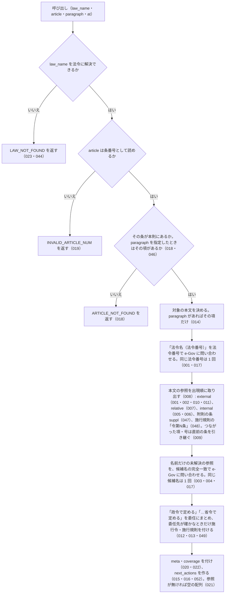

# get_article_references の仕様

<!-- GENERATED FILE — 手で編集しない。本文は houki-egov-mcp の specs/current/get_article_references/spec.md の写し。 -->

::: info
houki-egov-mcp **v0.20.0** の `specs/current/get_article_references/spec.md` から自動生成しました（仕様 ID 52 件・2026-10-10）。手で編集しないでください。再生成は `node scripts/generate-reference.mjs specs` です。
:::

条文本文が引用している参照と委任を取り出す

使いどころ・引数・実測の呼び出し例は、[ツールのページ](/reference/mcp/houki-egov/get_article_references)にあります。

最後に仕様が変わったのは v0.18.0 の「law_type の勅令の値を e-Gov に揃え、条の無い参照から get_toc を案内する（段階 5 追加分）」（2026-10-03 承認）です。それまでの経緯は[承認の履歴](#承認の履歴)にあります。

## 利用者と得られる結果

この機能の利用者と、利用者が渡すもの・得られる結果を示します。

- MCP クライアント（Claude などの LLM、または CLI から呼ぶ人）。`law_name` と `article`（任意で `paragraph`・`at`）を渡して、その条（または項）の本文が引用している他法令の条・同一法令内の条項号・「政令で定める」などの委任を受け取り、`next_actions` で次に読む条を知る

## 入力

呼び出すときに渡す値です。

| 引数        | 必須 | 内容                                                                         |
| ----------- | ---- | ---------------------------------------------------------------------------- |
| `law_name`  | 必須 | 法令名または略称。例: `"所得税法"`、`"所法"`、`"所得税法施行令"`             |
| `article`   | 必須 | 条番号。例: `"57の2"`、`"第57条の2"`、`"第五十七条の二"`。本則の条だけを対象にする（[SPEC-EGOV-GET-ARTICLE-REFERENCES-046](#spec-egov-get-article-references-046)） |
| `paragraph` | 任意 | 項番号。1 以上の整数（[SPEC-EGOV-GET-ARTICLE-REFERENCES-040](#spec-egov-get-article-references-040)）。指定するとその項の本文だけを対象にする。省略すると条全体 |
| `at`        | 任意 | 時点指定。`YYYY-MM-DD`（[SPEC-EGOV-GET-ARTICLE-REFERENCES-041](#spec-egov-get-article-references-041)。`get_law` と同じ） |

## 扱わないこと

この機能が意図して扱わないことです。

- 「前項」「同法」「同条」「次条」などが指す条・法令を特定すること（`relative` で `resolved: false` のまま返す）
- 委任先の条を特定すること（`target_law` は法令単位。条は `search_fulltext` や `get_toc` で探す）
- 条文の見出し（条見出し・条名）から参照を取り出すこと（本文の文だけを対象にする）
- 参照先の条文の本文を返すこと（`next_actions` で `get_law` を案内するだけ）
- 引用している参照が網羅されていると保証すること（正規表現で取れた範囲だけ）
- 逆方向の参照（この条を引用している他の条）を返すこと
- 附則の中の条を対象にすること（本則の条だけ。附則の条は `get_law` の `suppl_index` で読む）
- 本文の「附則第N条」が、どの附則の条かを特定すること（`kind: "suppl"`・`resolved: false` で返す）

## 処理の流れ

呼び出しを受けてから応答を返すまでに、何をどの順で確かめるかを示します。図の中の番号は「できること」の仕様 ID の末尾 3 桁です。

## 仕様項目

この機能の仕様項目を、仕様 ID ごとに並べています。見出しは仕様項目を 1 文で表したもので、条件・応答の細部・例は「詳細」を開くと読めます。仕様 ID はそれぞれ受入テストと対応していて、テストの無い ID があると各リポジトリの CI が止まります。

### SPEC-EGOV-GET-ARTICLE-REFERENCES-001 「法令名（法令番号）第N条…」は法令番号で解決し、law_id 付きの external で返す

::: details 詳細
本文に「法令名（法令番号）」が出てきたときは、その法令番号で e-Gov に問い合わせて法令を引く。同じ法令番号が本文に何度出ても、問い合わせる対象としては 1 回に数える。法令番号が本文に無ければ、法令番号では問い合わせない。

引けた法令について、「法令名（法令番号）」に続く条・項・号を、`references` の要素として次の形で返す。

| フィールド                        | 内容                                                                           |
| --------------------------------- | ------------------------------------------------------------------------------ |
| `kind`                            | `external`                                                                     |
| `raw`                             | 本文の表記（例: `雇用保険法（昭和四十九年法律第百十六号）第十条第五項第一号`） |
| `law_name` / `law_num` / `law_id` | e-Gov の法令名・法令番号・法令 ID                                              |
| `article`                         | 条番号を `get_law` に渡せる形にしたもの（例: `"10"`、`"30の3"`）               |
| `paragraph`                       | 項番号（数値）                                                                 |
| `item`                            | 号番号（文字列。例: `"1"`）                                                    |
| `resolved`                        | `true`                                                                         |

条・項・号のうち本文に無いものは付けない。

例: 所得税法 第57条の2 第2項の「雇用保険法（昭和四十九年法律第百十六号）第十条第五項第一号」は、`law_name: "雇用保険法"`、`law_id: "349AC0000000116"`、`article: "10"`、`paragraph: 5`、`item: "1"`、`resolved: true`。同じ項の「母子及び父子並びに寡婦福祉法（昭和三十九年法律第百二十九号）第三十一条第一号」は `article: "31"`、`item: "1"`。
:::

### SPEC-EGOV-GET-ARTICLE-REFERENCES-002 同じ本文に法令番号付きで出た法令名は、法令番号の無い参照でも同じ法令として解決する

::: details 詳細
[SPEC-EGOV-GET-ARTICLE-REFERENCES-001](#spec-egov-get-article-references-001) で法令番号から引けた法令の名前が、本文の別の箇所で法令番号なしに条を伴って出てきたときも、その法令への `external`（`resolved: true`、`law_id` 付き）として返す。

例: 同じ本文に「雇用保険法（昭和四十九年法律第百十六号）」があるとき、「雇用保険法第六十条の二第一項」は `law_name: "雇用保険法"`、`law_id: "349AC0000000116"`、`article: "60の2"`、`paragraph: 1`、`resolved: true`。
:::

### SPEC-EGOV-GET-ARTICLE-REFERENCES-003 名前だけの参照は、候補名と e-Gov の法令名の完全一致で解決する

::: details 詳細
法令番号が付かず、まだ解決していない「…法」「…令」「…規則」「…条例」＋条の参照は、その名前（本文から切った候補名）で e-Gov に問い合わせる。e-Gov の法令名が候補名と完全一致した法令があれば、その参照の `law_name`・`law_num`・`law_id` を埋めて `resolved: true` にする。

例: 所得税法 第57条の2 の「職業能力開発促進法第三十条の三」は、`law_name: "職業能力開発促進法"`、`law_id: "344AC0000000064"`、`article: "30の3"`、`resolved: true`。
:::

### SPEC-EGOV-GET-ARTICLE-REFERENCES-004 解決できなかった名前の参照は resolved: false で返す

::: details 詳細
[SPEC-EGOV-GET-ARTICLE-REFERENCES-001](#spec-egov-get-article-references-001)〜003 のどれでも法令を特定できなかった「…法」「…令」「…規則」「…条例」＋条の参照は、`kind: "external"`、`law_name` に本文から切った候補名、`resolved: false` で返す。`law_id` は付けない。条・項・号は [SPEC-EGOV-GET-ARTICLE-REFERENCES-001](#spec-egov-get-article-references-001) と同じ形で付ける。

例: e-Gov に無い「架空法第一条」は `law_name: "架空法"`、`article: "1"`、`resolved: false`。
:::

### SPEC-EGOV-GET-ARTICLE-REFERENCES-005 法令名の無い条・項・号は、同一法令内の internal で返す

::: details 詳細
法令名が前に付かない「第N条第N項第N号」（どれかが欠けてもよい）は、`kind: "internal"`、`raw`、`article`・`paragraph`・`item`（本文にあるものだけ）で返す。`law_name` と `resolved` は付けない。

例: 「第二十八条第二項」は `{ kind: "internal", raw: "第二十八条第二項", article: "28", paragraph: 2 }`、「第二十八条第一項」は `{ kind: "internal", raw: "第二十八条第一項", article: "28", paragraph: 1 }`。
:::

### SPEC-EGOV-GET-ARTICLE-REFERENCES-006 条も項も無い号だけの参照には、その文が属する項の番号を付ける

::: details 詳細
[SPEC-EGOV-GET-ARTICLE-REFERENCES-005](#spec-egov-get-article-references-005) の internal のうち、条も項も書かない「第N号」には、その文が属する項の番号を `paragraph` に入れる（項が複数ある条では `get_law` が `paragraph` を求めるため）。

例: 所得税法 第57条の2 第2項 第1号の本文の「第三号」は `{ kind: "internal", raw: "第三号", item: "3", paragraph: 2 }`。
:::

### SPEC-EGOV-GET-ARTICLE-REFERENCES-007 「前項」「同法第N条」などは relative で返し、解決しない

::: details 詳細
「同」「前」「次」に「法・令・規則・条・項・号・款・節・章・編」が続く語（例: `前項`・`同項`・`同号`・`次条`）、「前N条」「前N項」「前N号」、それらに条・項・号が続くもの（例: `同法第三十一条の十`・`同条第四項`・`同条第二項`）は、`{ kind: "relative", raw, resolved: false }` で返す。指している条・法令は特定しない。

例: 所得税法 第57条の2 第1項の本文からは、`第二十八条第二項`（internal）に続いて `同項`・`同項`・`同条第四項`・`同条第二項` の 4 件が relative で並ぶ。
:::

### SPEC-EGOV-GET-ARTICLE-REFERENCES-008 references は本文の出現順に並ぶ

::: details 詳細
`references` は、取り出した種類（external・relative・internal）によらず、本文に出てきた順に並べる。`paragraph` を省いて条全体を対象にしたときは、項の順に並べる。

例: 所得税法 第57条の2 第2項の本文からは、`前項`・`第二十八条第一項`・`雇用保険法（昭和四十九年法律第百十六号）第十条第五項第一号`・`母子及び父子並びに寡婦福祉法（昭和三十九年法律第百二十九号）第三十一条第一号`・`同法第三十一条の十`・`同号` の順。
:::

### SPEC-EGOV-GET-ARTICLE-REFERENCES-009 条を書かない項・号が直前の参照に 1 語でつながっていれば、直前の参照の条を引き継ぐ

::: details 詳細
条を書かない項・号の参照（例: `第六項第五号`）が、直前の参照と「及び」「又は」「並びに」「若しくは」「、」「から」のどれか 1 語だけでつながっているときは、直前の参照の条を `article` に入れ、`article_from` に直前の参照の `raw` を入れる。

- 号だけの参照で直前の参照に項があるときは、項も引き継ぐ
- 直前の参照が他法令の `external` なら、その法令の `external` として返す（`law_name`・`law_num`・`law_id`・`resolved` を引き継ぐ）
- 直前の参照が `relative` か、条を持たないときは引き継がない
- つながっていない項・号は引き継がない（同じ条の項・号のまま）

例: 「第二条第二項第二号及び第六項第五号」の後半は `{ kind: "internal", raw: "第六項第五号", article: "2", paragraph: 6, item: "5", article_from: "第二条第二項第二号" }`。「第二条第六項第四号及び第五号」の後半は `article: "2"`、`paragraph: 6`、`item: "5"`、`article_from: "第二条第六項第四号"`。施行規則の「法第七条第一項又は第三項」の後半は、親の法律への `external` で `article: "7"`、`paragraph: 3`、`article_from: "法第七条第一項"`、`resolved: true`。「第二条の規定にかかわらず、第三項の定めによる。」の「第三項」は引き継がず `{ kind: "internal", raw: "第三項", paragraph: 3 }`。
:::

### SPEC-EGOV-GET-ARTICLE-REFERENCES-010 施行令・施行規則の本文の「法第N条」は、親の法律への external で返す

::: details 詳細
`law_name` が施行令・施行規則（名前の末尾が「施行令」「施行規則」）に解決され、末尾を落とした親の法律が e-Gov に実在するときは、本文の「法第N条…」をその親の法律への `external`（`resolved: true`、`law_id` 付き）として返す。親の法律が分からない本文（法律の本文など）では、「法第N条」は候補名 `法` の `resolved: false` の参照になる。

例: `law_name: "所得税法施行令"`、`article: "167の3"` では、「法第五十七条の二第二項第一号」が `law_name: "所得税法"`、`law_id: "340AC0000000033"`、`article: "57の2"`、`paragraph: 2`、`item: "1"`、`resolved: true` の external になる。
:::

### SPEC-EGOV-GET-ARTICLE-REFERENCES-011 既知の法令名の直前が漢字なら、その法令への参照とはみなさない

::: details 詳細
解決済みの法令名（[SPEC-EGOV-GET-ARTICLE-REFERENCES-002](#spec-egov-get-article-references-002)・010）が本文に出ても、その直前の文字が漢字なら、より長い名前の一部とみなしてその法令への参照にしない。直前の漢字を含めた長い名前を候補名にした参照（[SPEC-EGOV-GET-ARTICLE-REFERENCES-003](#spec-egov-get-article-references-003)・004）として扱う。

例: 所得税法を既知の法令名として持っていても、「旧所得税法第九条」は `law_name: "旧所得税法"`、`article: "9"`、`resolved: false` の external になる。
:::

### SPEC-EGOV-GET-ARTICLE-REFERENCES-012 「政令で定める」「…省令で定める」を委任として出現回数でまとめ、委任先が確かなときだけ施行令・施行規則を付ける

::: details 詳細
本文の「政令で定める」「…省令で定める」「内閣府令で定める」（例: `財務省令で定める`）は、`references` ではなく `delegations` に入れる。同じ文言は 1 件にまとめ、`count` に出現回数を入れる。要素は次のフィールドを持つ。

| フィールド   | 内容                                                                                                                                                                                                                                                  |
| ------------ | ----------------------------------------------------------------------------------------------------------------------------------------------------------------------------------------------------------------------------------------------------- |
| `kind`       | `delegation`                                                                                                                                                                                                                                          |
| `raw`        | 文言（例: `政令で定める`・`財務省令で定める`）                                                                                                                                                                                                        |
| `count`      | 出現回数                                                                                                                                                                                                                                              |
| `target`     | 政令は `enforcement_order`、省令・府令は `enforcement_rule`                                                                                                                                                                                           |
| `target_law` | 委任先の法令。`relation`（`target` と同じ値）・`law_id`・`title`・`url`。法律の本文では、「政令で定める」はその法律の施行令、省令・府令は [SPEC-EGOV-GET-ARTICLE-REFERENCES-049](#spec-egov-get-article-references-049) で確かなときだけその法律の施行規則。確かでないときと実在しないときは `null`（031）。委任先の条は特定しない |

例: 所得税法 第57条の2 全体では、`財務省令で定める`（`target_law` は所得税法施行規則 `340M50000040011`、`relation: "enforcement_rule"`。施行規則の法令番号 `昭和四十年大蔵省令第十一号` の `大蔵省令` は 049 の表で `財務省令` に当たる）と `政令で定める`（`target_law` は所得税法施行令 `340CO0000000096`、`relation: "enforcement_order"`）の 2 件。「財務省令で定める」が 2 回、「政令で定める」が 1 回出る本文では、`財務省令で定める` の `count` が 2、`政令で定める` の `count` が 1。
:::

### SPEC-EGOV-GET-ARTICLE-REFERENCES-013 施行令の本文の「政令で定める」は、その施行令自身への委任として self: true を付ける

::: details 詳細
委任先の法令が `law_name` の法令そのものになるとき（施行令の本文の「政令で定める」）は、`target_law` に `self: true` を付ける。

例: `law_name: "所得税法施行令"`、`article: "167の3"` の「政令で定める」は、`target_law` が所得税法施行令（`340CO0000000096`）で `self: true`。
:::

### SPEC-EGOV-GET-ARTICLE-REFERENCES-014 paragraph を指定すると、その項の本文だけを対象にする

::: details 詳細
`paragraph` を指定したときは、その項の本文だけから参照と委任を取り出す。ほかの項の参照・委任は返さない。

例: `law_name: "所得税法"`、`article: "57の2"`、`paragraph: 1` では、`references` の `raw` は `["第二十八条第二項", "同項"]` で、`delegations` は空の配列（委任は第 2 項にしか無い）。
:::

### SPEC-EGOV-GET-ARTICLE-REFERENCES-015 条の分かる参照ごとに get_law の引数を next_actions で付ける

::: details 詳細
`next_actions` には、`resolved: true` の `external` と `internal` の参照ごとに `action: "get_law"` を 1 件入れる。ただし、条を持たない `external`（本文が「法令名（法令番号）」だけで、条・項・号が続かない参照）からは `get_law` を作らず、[SPEC-EGOV-GET-ARTICLE-REFERENCES-052](#spec-egov-get-article-references-052) の `get_toc` を入れる。`example` はそのまま `get_law` の inputSchema を通る引数で、次のとおり。

- `law_name`: external は参照先の法令名、internal は `law_name` に指定した法令の正式名称
- `article`: 参照の条。条を持たない internal（「第三号」のように条を書かない同一法令内の参照）は、指定した条
- `paragraph` / `item`: 参照にあるときだけ

`relative` と `resolved: false` の参照からは `next_actions` を作らない。

例: 所得税法 第57条の2 全体では、`get_law` の `example` は順に `{ law_name: "所得税法", article: "28", paragraph: 2 }`・`{ law_name: "雇用保険法", article: "10", paragraph: 5, item: "1" }`・`{ law_name: "職業能力開発促進法", article: "30の3" }`・`{ law_name: "所得税法", article: "57の2", paragraph: 2, item: "3" }`。
:::

### SPEC-EGOV-GET-ARTICLE-REFERENCES-016 委任ごとに search_fulltext の引数を next_actions で付け、自身への委任からは作らない

::: details 詳細
`next_actions` には、[SPEC-EGOV-GET-ARTICLE-REFERENCES-015](#spec-egov-get-article-references-015) の `get_law` に続けて、`target_law` を持つ委任ごとに `action: "search_fulltext"` を 1 件入れる。`example` はそのまま `search_fulltext` の inputSchema を通る `{ keyword: "<委任先の法令名> <呼び名><条の漢数字表記>" }`。呼び名は、委任先の法令の本文が `law_name` の法令を指すときの書き方で、`law_name` が法律なら `法`。`target_law.self` が `true` の委任からは作らない。

例: 所得税法 第57条の2 では、`{ keyword: "所得税法施行規則 法第五十七条の二" }` と `{ keyword: "所得税法施行令 法第五十七条の二" }` の 2 件。所得税法施行令 第167条の3 では、「政令で定める」が `self: true` なので、`next_actions` の `action` は `["get_law"]` だけ。
:::

### SPEC-EGOV-GET-ARTICLE-REFERENCES-017 同じ法令番号・同じ候補名は、1 回の呼び出しで 1 回しか e-Gov に問い合わせない

::: details 詳細
1 回の呼び出しの中では、同じ法令番号（[SPEC-EGOV-GET-ARTICLE-REFERENCES-001](#spec-egov-get-article-references-001)）と同じ法令名（[SPEC-EGOV-GET-ARTICLE-REFERENCES-003](#spec-egov-get-article-references-003) の候補名・委任先の法令名・親の法律名）は、それぞれ e-Gov に 1 回しか問い合わせない。

例: 所得税法 第57条の2 全体では、法令番号での問い合わせは `昭和四十九年法律第百十六号` の 1 回だけで、法令名での問い合わせに同じ名前は重ならない。
:::

### SPEC-EGOV-GET-ARTICLE-REFERENCES-018 指定した条・項が無ければエラー `ARTICLE_NOT_FOUND`

::: details 詳細
`article` の条がその法令に無いとき、または `paragraph` を指定してその項が条に無いときは、エラー `ARTICLE_NOT_FOUND` を返す。

例: `law_name: "所得税法"`、`article: "999"` と、`law_name: "所得税法"`、`article: "57の2"`、`paragraph: 9` は、どちらも `code: "ARTICLE_NOT_FOUND"`。
:::

### SPEC-EGOV-GET-ARTICLE-REFERENCES-019 条番号として読めない article はエラー `INVALID_ARTICLE_NUM`

::: details 詳細
`article` が `"30"`・`"30の2"`・`"第三十条"`・`"第三十条の二"` のような条番号の形で読めないときは、エラー `INVALID_ARTICLE_NUM` を返す。

例: `article: "三〇"` は `code: "INVALID_ARTICLE_NUM"`。
:::

### SPEC-EGOV-GET-ARTICLE-REFERENCES-020 応答に coverage を常に付け、網羅性を主張しない

::: details 詳細
成功の応答には `coverage: { method: "regex", note }` を常に付ける。`note` は、本文の文字列から正規表現で取れた参照だけを返していること、「前項」「同法」「同条」などを解決していないこと、法令名の候補が e-Gov に無かった参照は `resolved: false` のままであること、委任先の条を特定していないこと、網羅性は保証しないこと（「網羅性は保証しません」）を書く。
:::

### SPEC-EGOV-GET-ARTICLE-REFERENCES-021 参照も委任も無い本文からは空の配列を返す

::: details 詳細
対象の本文に参照も委任も無いときは、エラーにせず、`references` と `delegations` を空の配列にして返す。

例: 「この法律は、公布の日から施行する。」からは `references: []`、`delegations: []`。
:::

### SPEC-EGOV-GET-ARTICLE-REFERENCES-022 meta に対象の条を利用者向けの表記で返し、項を指定しないときは `meta.paragraph` を null にする

::: details 詳細
成功の応答の `meta.article` には対象の条番号を `get_law` に渡せる表記で入れる。`paragraph` を指定したときは `meta.paragraph` にその項番号を入れ、指定しないときは `meta.paragraph` を `null` にする。

例: `article: "57の2"` では `meta.article` は `"57の2"`。`paragraph: 1` を指定したときは `meta.paragraph` が `1`。`paragraph` を指定しないときは `meta.paragraph` が `null`（v0.16.0 では `paragraph` のキーが無かった）。
:::

### SPEC-EGOV-GET-ARTICLE-REFERENCES-023 法令に解決できない law_name はエラー `LAW_NOT_FOUND` で、resolve_abbreviation・search_law を案内する

::: details 詳細
`law_name` が略称辞書にも e-Gov の法令名検索にも当たらないときは、条文を取得せずにエラー `LAW_NOT_FOUND` を返す。`hint` は `略称辞書 / e-Gov 法令検索で該当なし。表記を確認してください`、`next_actions` は次の 2 件をこの順で持つ。

1. `action: "resolve_abbreviation"`、`example: { abbr: <渡した law_name> }`
2. `action: "search_law"`、`example: { keyword: <渡した law_name> }`

例: `law_name: "存在しない法"`、`article: "1"` は `{ code: "LAW_NOT_FOUND", error: "法令が見つかりません: 存在しない法", hint: "略称辞書 / e-Gov 法令検索で該当なし。表記を確認してください", next_actions: [{ action: "resolve_abbreviation", example: { abbr: "存在しない法" }, … }, { action: "search_law", example: { keyword: "存在しない法" }, … }] }`。
:::

### SPEC-EGOV-GET-ARTICLE-REFERENCES-024 houki-egov-mcp の管轄外の略称はエラー `OUT_OF_SCOPE` で、管轄の MCP を案内する

::: details 詳細
`law_name` が略称辞書で houki-egov-mcp 以外の管轄（`source_mcp_hint` が `houki-egov` でない）の名前のときは、e-Gov に問い合わせずにエラー `OUT_OF_SCOPE` を返す。`hint` は `<管轄>-mcp の対応 tool に切り替えてください`、`next_actions` は `action: "delegate_to_mcp"`、`example: { mcp: <管轄> }` の 1 件。

例: `law_name: "消基通"`、`article: "1"` は `{ code: "OUT_OF_SCOPE", hint: "houki-nta-mcp の対応 tool に切り替えてください", next_actions: [{ action: "delegate_to_mcp", example: { mcp: "houki-nta" }, … }] }`。e-Gov への問い合わせは 0 回。
:::

### SPEC-EGOV-GET-ARTICLE-REFERENCES-025 e-Gov からの取得に失敗したら、どの段階でも SOURCE_* のエラーを返し、取り出した参照は返さない

::: details 詳細
条文の取得、法令番号での問い合わせ（[SPEC-EGOV-GET-ARTICLE-REFERENCES-001](#spec-egov-get-article-references-001)）、法令名での問い合わせ（[SPEC-EGOV-GET-ARTICLE-REFERENCES-003](#spec-egov-get-article-references-003)・親の法律・委任先の法令）のどれで失敗しても、次のエラーを返す。応答はエラーだけで、`references`・`delegations`・`meta`・`coverage` は返さない。

| 失敗                                     | `code`                | `retryable` |
| ---------------------------------------- | --------------------- | ----------- |
| タイムアウト                             | `SOURCE_TIMEOUT`      | `true`      |
| HTTP 429                                 | `SOURCE_RATE_LIMITED` | `true`      |
| HTTP 5xx                                 | `SOURCE_API_ERROR`    | `true`      |

例: `law_name: "所得税法"`、`article: "57の2"` で、(a) 条文の取得がタイムアウトすると `code: "SOURCE_TIMEOUT"`、(b) 法令番号 `昭和四十九年法律第百十六号` の問い合わせが HTTP 429 を返すと `code: "SOURCE_RATE_LIMITED"`、(c) 法令名の問い合わせが HTTP 503 を返すと `code: "SOURCE_API_ERROR"`。どの場合も応答のキーは `error`・`code`・`hint`・`next_actions`・`retryable`・`detail` だけ。
:::

### SPEC-EGOV-GET-ARTICLE-REFERENCES-026 条が無いときの ARTICLE_NOT_FOUND は、渡した law_name で get_toc を案内する

::: details 詳細
[SPEC-EGOV-GET-ARTICLE-REFERENCES-018](#spec-egov-get-article-references-018) のうち条が無いときの `ARTICLE_NOT_FOUND` は、`hint: "法令名・条番号を確認してください。get_toc で目次を確認できます"` と、`next_actions` に `action: "get_toc"`、`example: { law_name: <渡した law_name のまま> }` の 1 件を持つ。略称を渡したときは略称のまま入れる。

例: `law_name: "所法"`、`article: "999"` は `{ code: "ARTICLE_NOT_FOUND", error: "条文が見つかりません: 第999条 in 所得税法", hint: "法令名・条番号を確認してください。get_toc で目次を確認できます", next_actions: [{ action: "get_toc", example: { law_name: "所法" }, … }] }`。
:::

### SPEC-EGOV-GET-ARTICLE-REFERENCES-027 項が無いときの ARTICLE_NOT_FOUND は next_actions を付けず、hint で項番号の数え方を書く

::: details 詳細
[SPEC-EGOV-GET-ARTICLE-REFERENCES-018](#spec-egov-get-article-references-018) のうち `paragraph` の項が条に無いときの `ARTICLE_NOT_FOUND` は、`next_actions` のキーを持たず、`hint: "項番号は 1 始まりで指定してください。条全体が必要なら paragraph を省略してください"` を持つ。

例: `law_name: "所得税法"`、`article: "57の2"`、`paragraph: 9` は `{ code: "ARTICLE_NOT_FOUND", error: "項が見つかりません: 第57条の2第9項", hint: "項番号は 1 始まりで指定してください。条全体が必要なら paragraph を省略してください" }`（`next_actions` のキーが無い）。
:::

### SPEC-EGOV-GET-ARTICLE-REFERENCES-028 INVALID_ARTICLE_NUM の hint に受け付ける条番号の形の例を書く

::: details 詳細
[SPEC-EGOV-GET-ARTICLE-REFERENCES-019](#spec-egov-get-article-references-019) の `INVALID_ARTICLE_NUM` は、`hint: "条番号は \"30\"、\"30の2\"、\"第三十条\"、\"第三十条の二\" のいずれかの形式で指定してください"` を持ち、`next_actions` のキーを持たない。

例: `law_name: "所得税法"`、`article: "三〇"` は `{ code: "INVALID_ARTICLE_NUM", hint: "条番号は \"30\"、\"30の2\"、\"第三十条\"、\"第三十条の二\" のいずれかの形式で指定してください", … }`。
:::

### SPEC-EGOV-GET-ARTICLE-REFERENCES-029 略称辞書の正式名称が本文に条を伴って出たら、e-Gov に問い合わせずに external で解決する

::: details 詳細
略称辞書のうち houki-egov-mcp 管轄で `law_id` を持つ法令の正式名称が、本文に法令番号なしで条を伴って出てきたときは、e-Gov に法令名で問い合わせずに、辞書の `law_id`・`law_num` を使った `external`（`resolved: true`）として返す。`next_actions` には [SPEC-EGOV-GET-ARTICLE-REFERENCES-015](#spec-egov-get-article-references-015) の `get_law` が付く。

例: 本文が「消費税法第三十条の規定を準用する。」の条では、`references` は `[{ kind: "external", raw: "消費税法第三十条", law_name: "消費税法", law_num: "昭和六十三年法律第百八号", law_id: "363AC0000000108", article: "30", resolved: true }]`。この呼び出しで e-Gov の法令名検索は 1 回も呼ばれない（e-Gov の検索の応答に消費税法が無くても `resolved: true` になる）。`next_actions` は `[{ action: "get_law", example: { law_name: "消費税法", article: "30" }, … }]`。
:::

### SPEC-EGOV-GET-ARTICLE-REFERENCES-030 名前だけの参照の候補名は、1 回の呼び出しで 20 種類までしか e-Gov に問い合わせない

::: details 詳細
[SPEC-EGOV-GET-ARTICLE-REFERENCES-003](#spec-egov-get-article-references-003) で e-Gov に問い合わせる候補名は、本文の出現順に数えて 20 種類まで。21 種類めからの候補名は問い合わせず、e-Gov に実在する法令名でも `resolved: false` のまま返す。上限に達したことは応答に書かない（`coverage` もほかのフィールドも変わらない）。

例: 本文が「架空一法第一条、架空二法第一条、…、架空二十一法第一条の規定。」（21 種類の候補名）の条で、e-Gov に `架空一法` と `架空二十一法` が実在するとき、`references` の 1 件めの `架空一法` は `resolved: true`（`law_id` 付き）、21 件めの `架空二十一法` は `resolved: false`（`law_id` 無し）。法令名での問い合わせは 20 回。
:::

### SPEC-EGOV-GET-ARTICLE-REFERENCES-031 委任先の法令が e-Gov に無いとき・確かでないときは、`target_law: null` で delegations に入れ、search_fulltext を作らない

::: details 詳細
委任先の施行令・施行規則が e-Gov に実在しないとき、または省令・府令の委任先が [SPEC-EGOV-GET-ARTICLE-REFERENCES-049](#spec-egov-get-article-references-049) で確かでないときも、その委任は `delegations` に入れる。`target_law` は `null` にし（キーは消さない）、[SPEC-EGOV-GET-ARTICLE-REFERENCES-016](#spec-egov-get-article-references-016) の `search_fulltext` の `next_actions` も作らない。

例: `law_name: "民法"`（民法施行令が e-Gov に無い）で本文が「政令で定めるところによる。」の条では、`delegations` は `[{ kind: "delegation", raw: "政令で定める", count: 1, target: "enforcement_order", target_law: null }]`、`next_actions` は `[]`（v0.17.0 では `target_law` のキーが無かった）。
:::

### SPEC-EGOV-GET-ARTICLE-REFERENCES-032 next_actions は example が同じ案内を 1 回だけ入れる

::: details 詳細
`next_actions` に入れる案内のうち、`example` が同じものは最初の 1 件だけを残す。`references` の側は重複を除かない。

例: 本文が「第二十八条第二項の規定及び第二十八条第二項の規定による。」の条では、`references` は internal の 2 件、`next_actions` は `[{ action: "get_law", reason: "同一法令内の参照先を読めます", example: { law_name: "所得税法", article: "28", paragraph: 2 } }]` の 1 件。
:::

### SPEC-EGOV-GET-ARTICLE-REFERENCES-033 条全体を対象にしたとき、別の項に出た同じ委任の文言は 1 件にまとめて count を合算する

::: details 詳細
`paragraph` を省いて条全体を対象にしたとき、異なる項に同じ委任の文言が出てきたら、`delegations` では 1 件にまとめ、`count` に項をまたいだ出現回数の合計を入れる。

例: `law_name: "所得税法"` で、第 1 項が「政令で定める者は、次に掲げる。」、第 2 項が「前項の場合において政令で定める額とする。」の条では、`delegations` は `政令で定める`（`count: 2`、`target_law` は所得税法施行令 `340CO0000000096`）の 1 件。`search_fulltext` の `next_actions` も 1 件。
:::

### SPEC-EGOV-GET-ARTICLE-REFERENCES-034 meta に対象の法令の law_id・title・law_num・url・retrieved_at と、渡した at を入れる

::: details 詳細
成功の応答の `meta` は、[SPEC-EGOV-GET-ARTICLE-REFERENCES-022](#spec-egov-get-article-references-022) の `article`・`paragraph` に加えて次を持つ。`at` を省いたときもキーは無くならない。

| フィールド     | 内容                                                                    |
| -------------- | ----------------------------------------------------------------------- |
| `law_id`       | 解決した法令の法令 ID                                                   |
| `title`        | 解決した法令の正式名称                                                  |
| `law_num`      | 解決した法令の法令番号                                                  |
| `url`          | e-Gov 法令の公開ページの URL（`https://laws.e-gov.go.jp/law/<law_id>`） |
| `retrieved_at` | 応答を作った日時の ISO 8601 形式の文字列（UTC）                         |
| `at`           | 渡した `at`。`at` を省いたときは `null`                                 |

例: `law_name: "所得税法"`、`article: "57の2"`、`at: "2024-04-01"` の `meta` は `{ law_id: "340AC0000000033", title: "所得税法", law_num: "昭和四十年法律第三十三号", url: "https://laws.e-gov.go.jp/law/340AC0000000033", retrieved_at: "<ISO 8601>", at: "2024-04-01", article: "57の2", paragraph: null }`。`law_name: "所法"`、`article: "57の2"`、`paragraph: 1`（`at` なし）では `at: null`、`title` は `所得税法`、`paragraph` は `1`（v0.16.0 では `at` のキーが無かった）。
:::

### SPEC-EGOV-GET-ARTICLE-REFERENCES-035 target_law に委任先の法令の公開ページの URL を入れる

::: details 詳細
[SPEC-EGOV-GET-ARTICLE-REFERENCES-012](#spec-egov-get-article-references-012) の `target_law.url` は、委任先の法令の e-Gov 法令の公開ページの URL（`https://laws.e-gov.go.jp/law/<target_law.law_id>`）。

例: 所得税法 第57条の2 の `財務省令で定める` の `target_law.url` は `https://laws.e-gov.go.jp/law/340M50000040011`、`政令で定める` の `target_law.url` は `https://laws.e-gov.go.jp/law/340CO0000000096`。
:::

### SPEC-EGOV-GET-ARTICLE-REFERENCES-036 next_actions の reason は、案内の種類ごとに決まった文言にする

::: details 詳細
`next_actions` の各要素の `reason` は次のとおり。

| 案内                                            | `reason`                                                                                                                         |
| ----------------------------------------------- | -------------------------------------------------------------------------------------------------------------------------------- |
| `external` の参照からの `get_law`               | `引用先の条を読めます`                                                                                                           |
| `internal` の参照からの `get_law`               | `同一法令内の参照先を読めます`                                                                                                   |
| 条を持たない `external` の参照からの `get_toc`  | `引用先の法令の目次を見られます`（[SPEC-EGOV-GET-ARTICLE-REFERENCES-052](#spec-egov-get-article-references-052)）                                                         |
| 委任からの `search_fulltext`                    | `<target_law.title>の中で<対象の条の表記>を受けている条を探せます（ローカル DB がある場合。無ければ get_toc で目次から探してください）`。対象の条の表記は `第57条の2` の形 |

例: `law_name: "所得税法"`、`article: "57の2"` では、`第二十八条第二項` からの `get_law` の `reason` は `同一法令内の参照先を読めます`、雇用保険法からの `get_law` は `引用先の条を読めます`、施行規則への `search_fulltext` は `所得税法施行規則の中で第57条の2を受けている条を探せます（ローカル DB がある場合。無ければ get_toc で目次から探してください）`。
:::

### SPEC-EGOV-GET-ARTICLE-REFERENCES-037 漢数字の条番号を渡しても、meta.article は get_law に渡せる表記で返す

::: details 詳細
`article` に `"第五十七条の二"` のような漢数字の条番号を渡しても、`meta.article` は `"57の2"` の形で返す。

例: `law_name: "所得税法"`、`article: "第五十七条の二"` の `meta.article` は `"57の2"`。
:::

### SPEC-EGOV-GET-ARTICLE-REFERENCES-038 施行令の条からの search_fulltext は、呼び名を「令」にする

::: details 詳細
`law_name` が施行令（名前の末尾が「施行令」）のときは、[SPEC-EGOV-GET-ARTICLE-REFERENCES-016](#spec-egov-get-article-references-016) の `search_fulltext` の `example.keyword` の呼び名を `令` にする（施行規則の本文が施行令を「令第N条」と書くため）。

例: `law_name: "所得税法施行令"`、`article: "1"` で本文が「財務省令で定める書類とする。」のとき、`delegations` は `財務省令で定める`（`target_law` は所得税法施行規則 `340M50000040011`）の 1 件、`next_actions` は `[{ action: "search_fulltext", example: { keyword: "所得税法施行規則 令第一条" }, … }]`。
:::

### SPEC-EGOV-GET-ARTICLE-REFERENCES-039 law_name・article が空文字・空白だけのときは e-Gov に問い合わせずに `INVALID_ARGUMENT` を返す

::: details 詳細
`law_name` と `article` は必須の文字列で、空文字は inputSchema の `minLength: 1` の検査（[SPEC-EGOV-COMMON-ERRORS-025](/specs/houki-egov/common_errors#spec-egov-common-errors-025)）で止まり、`INVALID_ARGUMENT`（`tool: "get_article_references"`、`detail.issues[0].path` はその引数名、`message: "空文字は指定できません"`）を返す。空白（半角スペース・全角スペース・タブ・改行）だけのときは、ツールの処理が略称辞書と e-Gov に問い合わせる前に、[SPEC-EGOV-COMMON-ERRORS-026](/specs/houki-egov/common_errors#spec-egov-common-errors-026) の形の `INVALID_ARGUMENT`（`error: "<引数名> が空です"`、`detail.issues: [{ path: "<引数名>", message: "空白だけは指定できません" }]`）を返す。空白だけの `article` は `INVALID_ARTICLE_NUM` ではない。

例: `law_name: "", article: "57の2"` は `detail.issues` が `[{ path: "law_name", message: "空文字は指定できません" }]`。`law_name: "所得税法", article: ""` は `[{ path: "article", message: "空文字は指定できません" }]`。`law_name: "所得税法", article: "  "` は `error: "article が空です"`。どれも `code: "INVALID_ARGUMENT"` で、e-Gov への問い合わせは 0 回。
:::

### SPEC-EGOV-GET-ARTICLE-REFERENCES-040 `paragraph` は 1 以上の整数で、0・負の数・小数は `INVALID_ARGUMENT` にして法令を取らない

::: details 詳細
tools/list の inputSchema の `paragraph` は `type: "integer"`、`minimum: 1` を持つ（[SPEC-EGOV-COMMON-ERRORS-023](/specs/houki-egov/common_errors#spec-egov-common-errors-023)）。0・負の数・小数・数値でない値を渡すと、inputSchema の検査で `INVALID_ARGUMENT`（`tool: "get_article_references"`、`detail.issues[0].path: "paragraph"`）を返し、e-Gov に問い合わせない。`ARTICLE_NOT_FOUND` は、法令を取った後で求めた項が無いときだけになる。

例: `law_name: "所得税法", article: "57の2", paragraph: 0` は `code: "INVALID_ARGUMENT"`、`detail.issues` は `[{ path: "paragraph", message: "1 以上で指定してください" }]` で、e-Gov への問い合わせは 0 回（v0.15.4 では法令を取ってから `ARTICLE_NOT_FOUND`）。`paragraph: 1.5` は `整数で指定してください`。`paragraph: 1` は [SPEC-EGOV-GET-ARTICLE-REFERENCES-014](#spec-egov-get-article-references-014) のとおり。
:::

### SPEC-EGOV-GET-ARTICLE-REFERENCES-041 `at` は `YYYY-MM-DD` の形だけを受け付け、形に合わない値と暦に無い日付は `INVALID_ARGUMENT`

::: details 詳細
`at` は [SPEC-EGOV-COMMON-ERRORS-024](/specs/houki-egov/common_errors#spec-egov-common-errors-024) に従う。tools/list の inputSchema の `at` は `pattern: "^[0-9]{4}-[0-9]{2}-[0-9]{2}$"` を持ち、形に合わない値は inputSchema の検査で `INVALID_ARGUMENT`（`tool: "get_article_references"`、`detail.issues: [{ path: "at", message: "YYYY-MM-DD の形で指定してください" }]`）になる。形は合うが暦に無い日付は、ツールの処理が e-Gov に問い合わせる前に `INVALID_ARGUMENT`（`detail.issues: [{ path: "at", message: "暦に無い日付です" }]`）を返す。

例: `law_name: "所得税法", article: "57の2", at: "2024/04/01"` は `code: "INVALID_ARGUMENT"`・`detail.issues[0].path: "at"` で、e-Gov への問い合わせは 0 回。`at: "20240401"`・`at: "2024-4-1"` も同じ。`at: "2026-02-30"` は `detail.issues[0].message: "暦に無い日付です"` で、e-Gov への問い合わせは 0 回。`at: "2024-04-01"` は [SPEC-EGOV-GET-ARTICLE-REFERENCES-034](#spec-egov-get-article-references-034) のとおり。
:::

### SPEC-EGOV-GET-ARTICLE-REFERENCES-042 法令名の検索が通信の失敗で終わったときは `LAW_NOT_FOUND` ではなく `SOURCE_*` を返す

::: details 詳細
`law_name` が略称辞書に law_id 付きで無く、e-Gov の法令名検索で law_id を決めるとき、その検索が通信の失敗（接続できない・時間切れ・5xx・429・429 以外の 4xx）で終わったときは、[SPEC-EGOV-COMMON-ERRORS-027](/specs/houki-egov/common_errors#spec-egov-common-errors-027) の表の code（`SOURCE_UNAVAILABLE` / `SOURCE_TIMEOUT` / `SOURCE_API_ERROR` / `SOURCE_RATE_LIMITED`）を、表の `retryable` と `detail` 付きで返す（[SPEC-EGOV-COMMON-ERRORS-029](/specs/houki-egov/common_errors#spec-egov-common-errors-029)）。`LAW_NOT_FOUND`（[SPEC-EGOV-GET-ARTICLE-REFERENCES-023](#spec-egov-get-article-references-023)）は、検索が成功して 0 件だったときだけ返す。`SOURCE_*` のときの `next_actions` に `resolve_abbreviation` / `search_law` は入れない。

例: 法令名の検索が 503 を返す状態で `{ law_name: "架空の法律", article: "1" }` を渡すと、`code: "SOURCE_API_ERROR"`、`retryable: true`、`detail.status: 503`（v0.15.4 では `LAW_NOT_FOUND` だった）。検索が時間切れなら `SOURCE_TIMEOUT`、接続できなければ `SOURCE_UNAVAILABLE`（`detail.cause: "ENOTFOUND"` など）、400 なら `SOURCE_API_ERROR`・`retryable: false`。検索が 0 件で成功したときは `LAW_NOT_FOUND` のまま。
:::

### SPEC-EGOV-GET-ARTICLE-REFERENCES-043 `law_name` の全角英数字・ダッシュ類・全角空白は半角に揃えてから略称辞書と照合する

::: details 詳細
`law_name` を略称辞書で引くときは、houki-abbreviations の `resolveAbbreviation(name, { normalize: true })` の規則（全角英数字を半角に、ダッシュ類 `－` `‐` `‑` `–` `—` `―` `−` を `-` に、全角チルダを `~` に、全角空白を半角空白にし、前後の空白を除く。大文字と小文字は区別する）で揃えてから照合する。管轄の判定（`OUT_OF_SCOPE`）も同じ規則で引く。辞書に無いときに e-Gov の法令名検索へ渡す値は、前後の空白を除いた渡した値のままで、揃えない。

例: `{ law_name: "ＰＬ法", article: "3" }` は `製造物責任法第 3 条の参照を返す`（v0.15.4 では辞書に無い扱いで、e-Gov の法令名検索に `ＰＬ法` を渡して `LAW_NOT_FOUND` だった）。`law_name: "労基法　"`（末尾が全角空白）も `労働基準法` として引く。
:::

### SPEC-EGOV-GET-ARTICLE-REFERENCES-044 法令名が完全一致しないときは、参照を取り出さず候補を付けた `LAW_NOT_FOUND` を返す

::: details 詳細
`law_name` の法令は [SPEC-EGOV-COMMON-ERRORS-032](/specs/houki-egov/common_errors#spec-egov-common-errors-032) の規則で決める。略称辞書に law_id が無く、e-Gov の法令名検索の全件の中に題名の完全一致が無いときは、検索結果の先頭の法令の条文を取らず、032 の形の `LAW_NOT_FOUND`（`retryable: false`）を返す。`next_actions` の候補の要素は `action: "get_article_references"`、`example` は渡した引数（`article`・`paragraph`・`at` のうち渡したもの）の `law_name` だけを候補の題名に替えたもの。`at` を渡したときは、法令名の検索にも `asof=<at>` を付ける。

例: `{ law_name: "所得税法施行", article: "1" }` は `code: "LAW_NOT_FOUND"`、`next_actions` の先頭は `{ action: "get_article_references", example: { law_name: "所得税法施行令", article: "1" } }`。
:::

### SPEC-EGOV-GET-ARTICLE-REFERENCES-045 本文の法令番号・法令名で他の法令を引くときも、完全一致だけを使い、検索結果の全件から探す

::: details 詳細
本文の参照から他の法令を引くとき（[SPEC-EGOV-GET-ARTICLE-REFERENCES-001](#spec-egov-get-article-references-001) の法令番号、003 の候補名、010 の親の法律、012 の委任先、048 の兄弟の施行令）は、e-Gov の検索結果の全件（`total_count` の件数）の中から、法令番号は `law_info.law_num`、法令名は `revision_info.law_title` が完全に一致する法令だけを使う。完全一致が無ければ、検索結果の先頭の法令を使わず、その参照は `resolved: false`（001・003・048）、親の法律は無いもの（010 の「親の法律が分からない本文」と同じ）、委任先は `target_law: null`（031）にする。`at` を渡したときは、これらの検索にも `asof=<at>` を付ける。

例: 本文の「法令名（法令番号）」の法令番号で e-Gov が返した検索結果に、`law_num` が一致する法令が無く別の法令番号の法令だけがあるときは、その参照を `resolved: false`・`law_id` 無しで返す（v0.17.0 では検索結果の先頭の法令の `law_id` を付けて `resolved: true` にしていた）。候補名 `保険法` は、`/laws?law_title=保険法` の 114 件（2026-10-03 10:10 JST）の 78 件目の完全一致 `保険法`（`420AC0000000056`）に解決する（v0.17.0 では上位 50 件の中に無いため `resolved: false`）。
:::

### SPEC-EGOV-GET-ARTICLE-REFERENCES-046 対象の条は本則の中だけで探し、附則にだけある条番号は `ARTICLE_NOT_FOUND` にする

::: details 詳細
`article` の条は、本則（`MainProvision`）の中だけで探す。本則に無ければ、附則に同じ番号の条があってもその条の参照を取り出さず、`ARTICLE_NOT_FOUND` を返す。同じ番号の条を持つ附則があるときは、`hint` に `本則に第<条>条はありません。附則に同じ番号の条があります: 附則(<n1>) <改正法の法令番号、または 制定時>、…。このツールは本則の条だけを対象にします。附則の条の本文は get_law の suppl_index で読めます` を書き、`next_actions` に附則ごと（先頭の 5 件まで）の `{ action: "get_law", example: { law_name: <渡した law_name>, article: <渡した article>, suppl_index: <n> } }` を入れる。

例: `{ law_name: "消費税法", article: "100" }` は `code: "ARTICLE_NOT_FOUND"`、`next_actions` は `get_law` の `suppl_index: 27` と `suppl_index: 168` の 2 件（2026-10-03 の消費税法。[SPEC-EGOV-GET-LAW-042](/specs/houki-egov/get_law#spec-egov-get-law-042) と同じ附則）。v0.17.0 では附則(27)の第100条の本文から参照を取り出していた。
:::

### SPEC-EGOV-GET-ARTICLE-REFERENCES-047 本文の「附則第N条」は `kind: "suppl"`・`resolved: false` で返し、本則の条への internal にしない

::: details 詳細
本文の「附則第N条」（項・号が続いてもよい。例: `附則第三条`・`附則第三十二条第二項`）は、`{ kind: "suppl", raw, article, paragraph, item, resolved: false }`（条・項・号は本文にあるものだけ）で返す。どの附則（制定時か、どの改正法か）の条かは特定しない。`kind: "internal"` にしないので、本則の条を指す `get_law` の `next_actions` を作らない。法令名が前に付く「<法令名>附則第N条」も同じく `kind: "suppl"` にし、`law_name` を付ける。

例: 本文に「附則第三条の規定により」とある条では、`references` に `{ kind: "suppl", raw: "附則第三条", article: "3", resolved: false }` が入り、`next_actions` に `{ action: "get_law", example: { law_name: …, article: "3" } }` は入らない（v0.17.0 では `{ kind: "internal", raw: "第三条", article: "3" }` になり、本則の第3条を指す `get_law` を案内していた）。
:::

### SPEC-EGOV-GET-ARTICLE-REFERENCES-048 施行規則の本文の「令第N条」は、兄弟の施行令への external で返す

::: details 詳細
`law_name` が施行規則（名前の末尾が「施行規則」）に解決され、末尾を「施行令」に替えた兄弟の施行令が e-Gov に実在する（[SPEC-EGOV-GET-ARTICLE-REFERENCES-045](#spec-egov-get-article-references-045) の完全一致）ときは、本文の「令第N条…」（候補名 `令`）をその施行令への `external`（`resolved: true`、`law_id` 付き）として返し、[SPEC-EGOV-GET-ARTICLE-REFERENCES-015](#spec-egov-get-article-references-015) の `get_law` の `next_actions` を付ける。条・項・号と、つながった項・号の引き継ぎ（009）は「法第N条」（010）と同じ。施行規則以外の本文の「令第N条」と、兄弟の施行令が無いときは、今までどおり候補名 `令` の `resolved: false`。施行令の本文の「規則第N条」は解決しない（候補名 `規則` の `resolved: false` のまま）。

例: `{ law_name: "所得税法施行規則", article: "3" }` の「令第二十四条第一号」は、`{ kind: "external", raw: "令第二十四条第一号", law_name: "所得税法施行令", law_num: "昭和四十年政令第九十六号", law_id: "340CO0000000096", article: "24", item: "1", resolved: true }`。`next_actions` に `{ action: "get_law", example: { law_name: "所得税法施行令", article: "24", item: "1" } }` が入る（2026-10-03 10:14 JST に houki-egov-dev 0.17.0 で同じ引数を呼ぶと、`law_name: "令"`・`resolved: false` だった）。
:::

### SPEC-EGOV-GET-ARTICLE-REFERENCES-049 省令・府令の委任は、施行規則を定めた命令の名前が委任の文言と合うときだけ施行規則に結び付ける

::: details 詳細
「<命令の名前>で定める」（`財務省令で定める`・`厚生労働省令で定める`・`内閣府令で定める` など）の委任は、その法律の施行規則（名前の末尾に「施行規則」を付けた法令）が e-Gov に実在し、かつ施行規則の法令番号（例: `昭和四十年大蔵省令第十一号`）の命令の名前（`大蔵省令`）が、委任の文言の命令の名前と同じか、次の表で同じ省に当たるときだけ、`target_law` に施行規則を入れる。

| 施行規則の法令番号の命令の名前 | 委任の文言の命令の名前 |
| ------------------------------ | ---------------------- |
| `大蔵省令`                     | `財務省令`             |
| `厚生省令`・`労働省令`         | `厚生労働省令`         |
| `通商産業省令`                 | `経済産業省令`         |
| `運輸省令`・`建設省令`         | `国土交通省令`         |
| `郵政省令`・`自治省令`         | `総務省令`             |
| `文部省令`                     | `文部科学省令`         |
| `農林省令`                     | `農林水産省令`         |
| `総理府令`                     | `内閣府令`             |

次のときは `target_law: null`（[SPEC-EGOV-GET-ARTICLE-REFERENCES-031](#spec-egov-get-article-references-031)）にする。`target` は `enforcement_rule` のまま。

- 命令の名前が合わない（例: 施行規則が `総理府令` で、委任の文言が `国土交通省令`）
- 委任の文言が `主務省令で定める`（どの省か本文からは決まらない）
- 施行規則の法令番号の命令の名前が複数の省の連名（例: `内閣府・総務省令`）で、委任の文言と同じでない

「政令で定める」は今までどおり施行令に結び付ける（施行令が実在しないときは `null`）。施行令・施行規則の本文で委任先が自身になるとき（013）も今までどおり。

例: 道路交通法 第2条（2026-10-03 10:13 JST に houki-egov-dev 0.17.0 で確かめた。道路交通法施行規則 `335M50000002060` の法令番号は `昭和三十五年総理府令第六十号`）では、`内閣府令で定める`（`count: 9`）は `総理府令` が `内閣府令` に当たるので `target_law` は道路交通法施行規則、`環境省令で定める` と `国土交通省令で定める`（本文は「内閣府令・環境省令で定める」「内閣府令・国土交通省令で定める」の連名）は `target_law: null` で、`search_fulltext` の `next_actions` を作らない（v0.17.0 では 3 件とも `target_law` が道路交通法施行規則だった）。労働基準法 第15条の `厚生労働省令で定める` は、労働基準法施行規則の法令番号 `昭和二十二年厚生省令第二十三号` の `厚生省令` が表で `厚生労働省令` に当たるので、`target_law` は労働基準法施行規則（`322M40000100023`）のまま。
:::

### SPEC-EGOV-GET-ARTICLE-REFERENCES-050 施行規則の条からは、施行令への委任の search_fulltext を作らない

::: details 詳細
`law_name` が施行規則のとき、本文の「政令で定める」の委任（`target_law` が施行令）からは、[SPEC-EGOV-GET-ARTICLE-REFERENCES-016](#spec-egov-get-article-references-016) の `search_fulltext` の `next_actions` を作らない。施行令の本文は施行規則の条を「規則第N条」と書かないため、呼び名 `規則` の `keyword`（例: `所得税法施行令 規則第一条`）で当たる見込みが低いからである。`delegations` の要素と `target_law` は今までどおり返す。

例: `law_name: "所得税法施行規則"` で本文が「政令で定める場合」の条では、`delegations` に `政令で定める`（`target_law` は所得税法施行令 `340CO0000000096`）が入り、`next_actions` に `{ action: "search_fulltext", example: { keyword: "所得税法施行令 規則第…条" } }` は入らない。
:::

### SPEC-EGOV-GET-ARTICLE-REFERENCES-051 対象の法令本文の取得で e-Gov が 404・時点の 400 を返したときは `LAW_NOT_FOUND`・`INVALID_ARGUMENT`

::: details 詳細
`law_name` の法令を決めた後の法令本文の取得で e-Gov が 429 以外の 4xx を返したときは、[SPEC-EGOV-COMMON-ERRORS-033](/specs/houki-egov/common_errors#spec-egov-common-errors-033) の表のとおりに返す。404・`404004` は `LAW_NOT_FOUND`（`retryable: false`）、400・`400044` は `INVALID_ARGUMENT`（`tool: "get_article_references"`、`detail.issues[0].path: "at"`）、そのほかの 4xx は `SOURCE_API_ERROR`（`retryable: false`、`detail.status`）。本文の参照から他の法令を引く検索（045）が 400・`400044` を返したときも、同じ `INVALID_ARGUMENT` にする。

例: `{ law_name: "所得税法", article: "57の2", at: "2000-01-01" }` は `code: "INVALID_ARGUMENT"`、`detail.issues: [{ path: "at", message: "e-Gov が受け付ける時点の範囲の外です" }]`。
:::

### SPEC-EGOV-GET-ARTICLE-REFERENCES-052 条を持たない external の参照からは、呼んだ条の番号を使わず、参照先の法令の get_toc を案内する

::: details 詳細
`resolved: true` の `external` で、本文に条が続かない参照（`article` を持たない）からは、`get_law` を作らない。代わりに `{ action: "get_toc", reason: "引用先の法令の目次を見られます", example: { law_name: <参照先の法令名> } }` を、`references` の順の位置に 1 件入れる。呼び出しで指定した `article` を、参照先の法令の条として使わない。同じ法令の `get_toc` が 2 件になるときは、[SPEC-EGOV-GET-ARTICLE-REFERENCES-032](#spec-egov-get-article-references-032) のとおり 1 件にする。

例: `{ law_name: "所得税法施行規則", article: "3" }` の参照 `日本国との平和条約に基づき日本の国籍を離脱した者等の出入国管理に関する特例法（平成三年法律第七十一号）`（`law_id: "403AC0000000071"`、`article` 無し）からは、`{ action: "get_toc", reason: "引用先の法令の目次を見られます", example: { law_name: "日本国との平和条約に基づき日本の国籍を離脱した者等の出入国管理に関する特例法" } }` を入れる。v0.17.0 では `{ action: "get_law", example: { law_name: "日本国との平和条約…特例法", article: "3" } }` で、特例法の第3条を指していた（2026-10-03 10:14 JST に houki-egov-dev 0.17.0 で確かめた。houki-egov-mcp #98）。
:::

## 検討中のこと

仕様を書き起こしたときに見つかった項目のうち、扱いを Issue で検討しているものです。ここに挙げたことは、今後の版で変わることがあります。開くと、元の仕様書の記述をそのまま読めます。

::: details 仕様書の「未決」の節
初版起こしで見つけた、意図か不具合かを人が決める項目です。決まったら「できること」に ID を振るか、`specs/changes/` の差分にします。

意図か不具合かの判断が要る項目は houki-egov-mcp の Issue に移し、ここには題と Issue の番号だけを残します。今の振る舞いのままでよくテストが無いだけの項目は、受入テストを書いてから「できること」に ID を振ります。

1. **法令に解決できない `law_name`。** → [SPEC-EGOV-GET-ARTICLE-REFERENCES-023](#spec-egov-get-article-references-023)
2. **houki-egov-mcp の管轄外の略称を渡したとき。** → [SPEC-EGOV-GET-ARTICLE-REFERENCES-024](#spec-egov-get-article-references-024)
3. **e-Gov からの取得に失敗したとき。** → [SPEC-EGOV-GET-ARTICLE-REFERENCES-025](#spec-egov-get-article-references-025)
4. **`ARTICLE_NOT_FOUND` と `INVALID_ARTICLE_NUM` の `hint`・`next_actions`。** → [SPEC-EGOV-GET-ARTICLE-REFERENCES-026](#spec-egov-get-article-references-026)・[SPEC-EGOV-GET-ARTICLE-REFERENCES-027](#spec-egov-get-article-references-027)・[SPEC-EGOV-GET-ARTICLE-REFERENCES-028](#spec-egov-get-article-references-028)
5. **略称辞書の正式名称で、名前だけの参照を解決すること。** → [SPEC-EGOV-GET-ARTICLE-REFERENCES-029](#spec-egov-get-article-references-029)
6. **候補名の問い合わせの上限。** → [SPEC-EGOV-GET-ARTICLE-REFERENCES-030](#spec-egov-get-article-references-030)
7. **委任先の法令が e-Gov に無いとき。** → [SPEC-EGOV-GET-ARTICLE-REFERENCES-031](#spec-egov-get-article-references-031)
8. **`next_actions` の重複を除くこと。** → [SPEC-EGOV-GET-ARTICLE-REFERENCES-032](#spec-egov-get-article-references-032)
9. **複数の項にまたがる同じ委任の文言。** → [SPEC-EGOV-GET-ARTICLE-REFERENCES-033](#spec-egov-get-article-references-033)
10. **応答のフィールドのうちテストで確かめていないもの。** → [SPEC-EGOV-GET-ARTICLE-REFERENCES-034](#spec-egov-get-article-references-034)・[SPEC-EGOV-GET-ARTICLE-REFERENCES-035](#spec-egov-get-article-references-035)・[SPEC-EGOV-GET-ARTICLE-REFERENCES-036](#spec-egov-get-article-references-036)・[SPEC-EGOV-GET-ARTICLE-REFERENCES-037](#spec-egov-get-article-references-037)・[SPEC-EGOV-GET-ARTICLE-REFERENCES-038](#spec-egov-get-article-references-038)（一部は約束にしていない。差分 `20260928-untested-behaviors` の proposal.md を参照）
:::

## 承認の履歴

この機能の仕様が、いつ、どの変更で承認されたかを新しい順に並べています。各リポジトリの `npx spec-ids history get_article_references` と同じ内容です。変更の名前から、変更の理由と前後の振る舞いを書いた文書（GitHub）を開けます。

::: details 承認の履歴（9 件）
| 承認日 | 版 | 変更 | 仕様 PR |
|---|---|---|---|
| 2026-10-03 | v0.18.0 | [law_type の勅令の値を e-Gov に揃え、条の無い参照から get_toc を案内する（段階 5 追加分）](https://github.com/shuji-bonji/houki-egov-mcp/blob/v0.20.0/specs/releases/v0.18.0/20261003-law-type-and-reference-actions/proposal.md) | [#99](https://github.com/shuji-bonji/houki-egov-mcp/pull/99) |
| 2026-10-03 | v0.18.0 | [法令名・条・委任先を、確かなときだけ 1 つに決める（段階 5 法令の引き当て）](https://github.com/shuji-bonji/houki-egov-mcp/blob/v0.20.0/specs/releases/v0.18.0/20261003-law-resolution/proposal.md) | [#95](https://github.com/shuji-bonji/houki-egov-mcp/pull/95) |
| 2026-10-03 | v0.17.0 | [値の無いフィールドを null にし、meta の時点を常に返す（T4 応答の形）](https://github.com/shuji-bonji/houki-egov-mcp/blob/v0.20.0/specs/releases/v0.17.0/20261003-t4-response-shape/proposal.md) | [#91](https://github.com/shuji-bonji/houki-egov-mcp/pull/91) |
| 2026-10-01 | v0.16.0 | [全角・半角・ダッシュ類の揃え方を houki-abbreviations 0.7.0 に一本化する（T3）](https://github.com/shuji-bonji/houki-egov-mcp/blob/v0.20.0/specs/releases/v0.16.0/20261001-t3-normalize/proposal.md) | [#86](https://github.com/shuji-bonji/houki-egov-mcp/pull/86) |
| 2026-10-01 | v0.16.0 | [「見つからない」と「取得元の失敗」の code を分ける（T2）](https://github.com/shuji-bonji/houki-egov-mcp/blob/v0.20.0/specs/releases/v0.16.0/20261001-t2-error-codes/proposal.md) | [#85](https://github.com/shuji-bonji/houki-egov-mcp/pull/85) |
| 2026-10-01 | v0.16.0 | [引数の検査を inputSchema に書き、丸めずに `INVALID_ARGUMENT` にする（T1）](https://github.com/shuji-bonji/houki-egov-mcp/blob/v0.20.0/specs/releases/v0.16.0/20261001-t1-argument-guards/proposal.md) | [#84](https://github.com/shuji-bonji/houki-egov-mcp/pull/84) |
| 2026-09-28 | v0.15.2 | [テストが無いだけの振る舞いに仕様 ID を振る](https://github.com/shuji-bonji/houki-egov-mcp/blob/v0.20.0/specs/releases/v0.15.2/20260928-untested-behaviors/proposal.md) | [#76](https://github.com/shuji-bonji/houki-egov-mcp/pull/76) |
| 2026-09-28 | v0.15.2 | [「未決」のうち判断が要る 85 件を Issue に移す](https://github.com/shuji-bonji/houki-egov-mcp/blob/v0.20.0/specs/releases/v0.15.2/20260928-undecided-to-issues/proposal.md) | [#68](https://github.com/shuji-bonji/houki-egov-mcp/pull/68) |
| 2026-09-28 | — | 初版 | [#50](https://github.com/shuji-bonji/houki-egov-mcp/pull/50) |
:::

## 関連ページ

このページの元になった文書と、あわせて読むページです。

- [houki-egov-mcp の仕様の一覧](/specs/houki-egov/)
- [houki-egov-mcp の解説](/mcp/houki-egov)
- [get_article_references のツールのページ（リファレンス）](/reference/mcp/houki-egov/get_article_references)
- [元の仕様書（GitHub、v0.20.0）](https://github.com/shuji-bonji/houki-egov-mcp/blob/v0.20.0/specs/current/get_article_references/spec.md)
