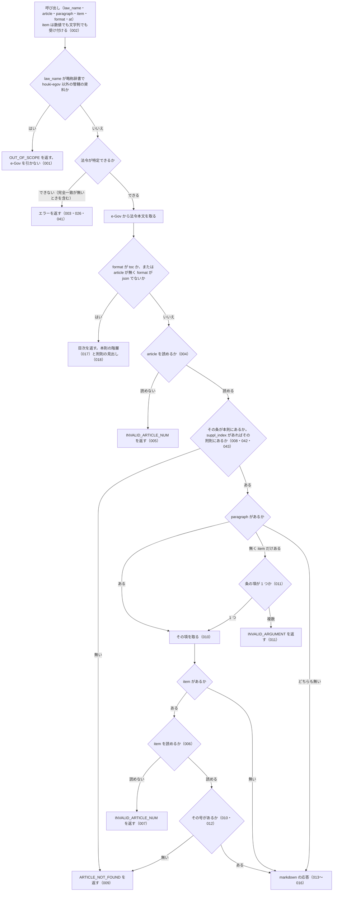

# get_law の仕様

<!-- GENERATED FILE — 手で編集しない。本文は houki-egov-mcp の specs/current/get_law/spec.md の写し。 -->

::: info
houki-egov-mcp **v0.20.0** の `specs/current/get_law/spec.md` から自動生成しました（仕様 ID 43 件・2026-10-10）。手で編集しないでください。再生成は `node scripts/generate-reference.mjs specs` です。
:::

法令の条・項・号を 1 つ取得する。条を省くと目次を返す

使いどころ・引数・実測の呼び出し例は、[ツールのページ](/reference/mcp/houki-egov/get_law)にあります。

最後に仕様が変わったのは v0.18.0 の「法令名・条・委任先を、確かなときだけ 1 つに決める（段階 5 法令の引き当て）」（2026-10-03 承認）です。それまでの経緯は[承認の履歴](#承認の履歴)にあります。

## 使う人と受け取るもの

この機能を誰が呼び、何を渡して何を受け取るかを示します。

- MCP クライアント（Claude などの LLM、または CLI から呼ぶ人）。`law_name` と `article`（任意で `paragraph`・`item`）を渡して、e-Gov 法令 API v2 から取った法令の条・項・号の本文を受け取る。`article` を省くと、その法令の目次を受け取る

## 入力

呼び出すときに渡す値です。

| 引数        | 必須 | 内容                                                                                                                                              |
| ----------- | ---- | ------------------------------------------------------------------------------------------------------------------------------------------------- |
| `law_name`  | 必須 | 法令名または略称。例: `"消費税法"`、`"消法"`、`"労基法"`、`"民法"`                                                                                |
| `article`   | 任意 | 条番号。例: `"30"`、`"30の2"`、`"第30条の2"`、`"第三十条"`、`"三十の二"`、`"３０"`。省くと目次を返す（`format` が `json` のときを除く）。`suppl_index` を渡さないときは本則の中だけを探す（[SPEC-EGOV-GET-LAW-042](#spec-egov-get-law-042)） |
| `paragraph` | 任意 | 項番号。1 以上の整数（[SPEC-EGOV-GET-LAW-036](#spec-egov-get-law-036)）。省くと条全体 |
| `item`      | 任意 | 号番号。数値（`8`）か文字列（`"8"`・`"8の2"`・`"第8号の2"`・`"八の二"`）。枝番号の号は文字列で指定する。項が複数ある条では `paragraph` も指定する |
| `format`    | 任意 | `markdown`（既定。条文）、`toc`（目次だけ）、`json`（構造化）                                                                                     |
| `at`        | 任意 | 時点。`YYYY-MM-DD`（[SPEC-EGOV-GET-LAW-037](#spec-egov-get-law-037)）。その時点の条文を取る |
| `suppl_index` | 任意 | 附則の番号。1 以上の整数（[SPEC-EGOV-GET-LAW-043](#spec-egov-get-law-043)）。`get_toc` の `suppl_provisions[].index`、`get_law_range` の `suppl_index` と同じ番号。渡すと `article` をその附則の中で探す |

## できないこと

この機能が引き受けないことです。

- 編・章・節や附則 1 本をまとめて取ること（`get_law_range`）
- 目次に附則の中の条を載せること（目次の附則は見出しだけ。附則の条まで見るのは `get_toc` の `suppl: "full"`）
- 削除された条をまとめた範囲（e-Gov の `534:535` など）に含まれる 1 つの条番号（`"534"`）で引くこと（`ARTICLE_NOT_FOUND` になる）
- 1 回の呼び出しで複数の条・項・号を取ること
- 条文の中の参照（他の条・他の法令）を解決すること（`get_article_references`）
- 改正履歴を返すこと（`get_law_revisions`）
- 通達・判例など e-Gov 以外の資料を返すこと（`OUT_OF_SCOPE` を返す）
- 条文に解釈や判断を加えること

## 処理の流れ

呼び出しを受けてから応答を返すまでに、何をどの順で確かめるかを示します。図の中の番号は「できること」の仕様 ID の末尾 3 桁です。



## 仕様 ID ごとの約束

この機能が守る約束を、仕様 ID ごとに並べています。見出しは約束を 1 文で表したもので、条件・応答の細部・例は「詳細」を開くと読めます。仕様 ID はそれぞれ受入テストと対応していて、テストの無い ID があると各リポジトリの CI が止まります。

<a id="spec-egov-get-law-001"></a>

### SPEC-EGOV-GET-LAW-001 通達などの略称は OUT_OF_SCOPE を返し、e-Gov を引かない

::: details 詳細
`law_name` が略称辞書で houki-egov-mcp 以外の管轄（通達は houki-nta など）と分かる名前のときは、エラー `OUT_OF_SCOPE` を返す。e-Gov には問い合わせない。

例: `{ law_name: "消基通", article: "2", paragraph: 1, item: "8の2" }` は `code: "OUT_OF_SCOPE"` を返す。
:::

<a id="spec-egov-get-law-002"></a>

### SPEC-EGOV-GET-LAW-002 item は数値でも文字列でも受け付ける

::: details 詳細
`item` には数値も文字列も渡せる。文字列の `item`（例: `"8の2"`）を渡しても、引数の検査のエラー（`INVALID_ARGUMENT`）にはならない。
:::

<a id="spec-egov-get-law-003"></a>

### SPEC-EGOV-GET-LAW-003 law_name が空文字・空白だけのときは e-Gov に問い合わせずに `INVALID_ARGUMENT` を返す

::: details 詳細
`law_name` が空文字のときは、inputSchema の `minLength: 1` の検査（[SPEC-EGOV-COMMON-ERRORS-025](/specs/houki-egov/common_errors#spec-egov-common-errors-025)）で止まり、`INVALID_ARGUMENT`（`tool: "get_law"`、`detail.issues: [{ path: "law_name", message: "空文字は指定できません" }]`）を返す。空白（半角スペース・全角スペース・タブ・改行）だけのときは、ツールの処理が略称辞書と e-Gov のどちらにも問い合わせる前に、[SPEC-EGOV-COMMON-ERRORS-026](/specs/houki-egov/common_errors#spec-egov-common-errors-026) の形の `INVALID_ARGUMENT`（`tool: "get_law"`、`error: "law_name が空です"`、`detail.issues: [{ path: "law_name", message: "空白だけは指定できません" }]`、`hint` に法令名か略称を渡すよう書く）を返す。どちらも `LAW_NOT_FOUND` ではない。

例: `law_name: ""` は `code: "INVALID_ARGUMENT"`・`detail.issues[0].message: "空文字は指定できません"`。`law_name: "　"`（全角スペース）と `law_name: " \n"` は `code: "INVALID_ARGUMENT"`・`error: "law_name が空です"`。どれも e-Gov への問い合わせは 0 回（v0.15.4 では `LAW_NOT_FOUND` だった）。
:::

<a id="spec-egov-get-law-004"></a>

### SPEC-EGOV-GET-LAW-004 条番号は算用数字・漢数字・全角数字のどれでも指定できる

::: details 詳細
`article` は次の書き方を受け付け、同じ条として扱う。

- 算用数字: `"30"`
- 枝番号は「の」でつなぐ: `"30の2"`、`"57の4"`
- 前の「第」と「条」を付けてもよい: `"第30条"`、`"第30条の2"`
- 位取りの漢数字（千の位まで）: `"三十"`、`"第三十条"`、`"第三十条の二"`、`"三十の二"`、`"第千五十条"`、`"第十条"`
- 全角数字: `"３０"`、`"第３０条の２"`
- 前後の空白は除く: `"  30  "`
:::

<a id="spec-egov-get-law-005"></a>

### SPEC-EGOV-GET-LAW-005 読めない条番号は受け付けない

::: details 詳細
`article` を条番号として読めないときは、エラー `INVALID_ARTICLE_NUM` を返す。読めないのは次のような書き方である。

- 位ごとに並べた漢数字: `"第三〇条"`
- 漢数字と算用数字の混在: `"三0"`
- 「の」以外の区切り: `"30-2"`
- 「の」の後が空: `"30の"`
:::

<a id="spec-egov-get-law-006"></a>

### SPEC-EGOV-GET-LAW-006 号番号は数値・算用数字・漢数字・全角数字のどれでも指定できる

::: details 詳細
`item` は次の書き方を受け付ける。

- 数値: `8`
- 文字列: `"8"`、`"8の2"`、`"第8号の2"`、`" 12の8 "`（前後の空白は除く）
- 位取りの漢数字: `"八"`、`"八の二"`、`"第八号の二"`
- 全角数字: `"１２の８"`
:::

<a id="spec-egov-get-law-007"></a>

### SPEC-EGOV-GET-LAW-007 読めない号番号は受け付けない

::: details 詳細
`item` を号番号として読めないときは、エラー `INVALID_ARTICLE_NUM` を返す。読めないのは次のような値である。

- 位取りとして読めない漢数字: `"八八"`
- 1 未満の数値と整数でない数値: `0`、`1.5`
- 「の」以外の区切り: `"8-2"`
- 空文字: `""`
:::

<a id="spec-egov-get-law-008"></a>

### SPEC-EGOV-GET-LAW-008 条番号で、本則の条を取り出す（枝番号の条を含む）

::: details 詳細
`article` で指定した条を、法令本文の本則（`MainProvision`）の中から取り出して返す。枝番号の条（`"30の2"`）も取り出せる。`suppl_index` を渡さないときは附則の中を探さない（[SPEC-EGOV-GET-LAW-042](#spec-egov-get-law-042)）。附則の中の条は `suppl_index` で附則を指して取る（[SPEC-EGOV-GET-LAW-043](#spec-egov-get-law-043)）。

例: `{ law_name: "消費税法", article: "30" }` は本則の第30条を返す。
:::

<a id="spec-egov-get-law-009"></a>

### SPEC-EGOV-GET-LAW-009 存在しない条・号は ARTICLE_NOT_FOUND を返す

::: details 詳細
`article` の条が法令に無いとき、または `item` の号がその項に無いときは、エラー `ARTICLE_NOT_FOUND` を返す。

例: 第8号と第8号の2しかない項で `item: 9` を指定すると `ARTICLE_NOT_FOUND`。
:::

<a id="spec-egov-get-law-010"></a>

### SPEC-EGOV-GET-LAW-010 paragraph で項を、paragraph と item で号を取り出す

::: details 詳細
`paragraph` を指定したときは、その条の中の項だけを返す。`paragraph` と `item` を指定したときは、その項の中の号だけを返す。
:::

<a id="spec-egov-get-law-011"></a>

### SPEC-EGOV-GET-LAW-011 item だけを指定したとき、項が 1 つの条はその項の号を返し、項が複数の条は INVALID_ARGUMENT を返す

::: details 詳細
`paragraph` を省いて `item` を指定したとき、条の項が 1 つだけなら、その項の号として探す（「消費税法施行令第14条の3第1号」のように、項が 1 つの条では第1項を書かないため）。条の項が複数あるときは、どの項の号か決まらないので、エラー `INVALID_ARGUMENT` を返す。
:::

<a id="spec-egov-get-law-012"></a>

### SPEC-EGOV-GET-LAW-012 枝番号の号を取り出す

::: details 詳細
`item` に枝番号の号（`"8の2"` など）を指定すると、その号だけを返す。第8号と第8号の2がある項で `item: "8の2"` を指定したときは第8号の2だけを返し、第8号の本文は含めない。`item: 8` のときは第8号を返す。
:::

<a id="spec-egov-get-law-013"></a>

### SPEC-EGOV-GET-LAW-013 markdown の応答の見出し

::: details 詳細
`format` を省くか `markdown` にしたとき、応答の Markdown の 1 行目は、指定した粒度に応じて次の見出しである。

- 条だけ: `# <法令名> 第<条>条`。枝番号の条は `# 租税特別措置法 第70条の6`（`第70の6条` にはしない）
- 項まで: `# 消費税法 第30条第2項`
- 号まで: `# 消費税法 第2条第1項第8号`。枝番号の号は `# 消費税法 第2条第1項第8号の2`（`第8_2号` にはしない）

条に見出し（例: `（仕入れに係る消費税額の控除）`）があるときは、見出しの行の次に置く。
:::

<a id="spec-egov-get-law-014"></a>

### SPEC-EGOV-GET-LAW-014 号の行と、号の下のイ・ロ・ハの書き方

::: details 詳細
markdown の応答では、号を 1 号 1 行で書く。

- 行の先頭に e-Gov の号の表記（`八`、`八の二` などの漢数字）をそのまま置き、半角空白の後に本文を続ける。算用数字（`8`、`8_2`）に置き換えない
- 号の本文が複数の欄（見出し語と定義文など）に分かれているときは、欄の間を全角空白で区切る。例: `八 資産の譲渡等　事業として対価を得て行われる資産の譲渡及び貸付け並びに役務の提供をいう。`
- 号の表記が無い号は、番号を「の」でつないで置く（例: `3の2 本文`）
- 号の下のイ・ロ・ハは Markdown の箇条書きにする。深さ 1 は `- イ …`、深さ 2 は `  - （１） …`
- 号の中のそのほかの要素（列記など）は、前後の本文と行を分ける
:::

<a id="spec-egov-get-law-015"></a>

### SPEC-EGOV-GET-LAW-015 2 項目以降の項には項番号の行を付ける

::: details 詳細
markdown の応答で、第2項以降の項は本文の前に `**第<項>項**` の行を置く。

例: 消費税法 第30条第2項は `**第2項**` の行の次に `次の各号に定める方法により計算した金額とする。` を置き、その後に号の行を続ける。
:::

<a id="spec-egov-get-law-016"></a>

### SPEC-EGOV-GET-LAW-016 表は Markdown の表にする

::: details 詳細
markdown の応答では、項の直下の表（所得税法 第89条第1項の税率表など）と、号・イロハの中の表を Markdown の表にする。

- 表の前後に空行を入れる。号・イロハの中の表は箇条書きに合わせて字下げする
- 表に見出し行が無いときは、見出し行を空欄（`|  |  |`）にし、1 行目もデータとして出す
- 表に見出し行があるときはそれを見出しにする。表の題は表の前、備考は表の後に出す
- 結合されたセルは結合先を空欄にして列をそろえる。セルの中の `|` は `\|` にする
:::

<a id="spec-egov-get-law-017"></a>

### SPEC-EGOV-GET-LAW-017 目次は本則の階層を返す

::: details 詳細
`format` が `toc` のとき、または `article` を省き `format` が `json` でないときは、条文の代わりに目次を返す。目次は本則の編・章・節などの階層と条を箇条書きにし、附則の条は本則の中に混ぜない。条は `第<条>条` と条の見出しで書き、枝番号の条は `- 第70条の6 （農地等についての相続税の納税猶予等）` のように書く。
:::

<a id="spec-egov-get-law-018"></a>

### SPEC-EGOV-GET-LAW-018 目次の附則は見出しだけを返す

::: details 詳細
目次を返すとき（[SPEC-EGOV-GET-LAW-017](#spec-egov-get-law-017)）、法令に附則があれば、本則を `## 本則` の節に、附則を `## 附則（<本数> 本・条 <条数> 件）` の節に分ける。附則は 1 本 1 行の見出しで書き、附則の中の条は載せない。見出しの行は次の形である。

- 制定時の附則: `- 附則(1) 制定時（抄） — 条 2 件`
- 改正法の附則: `- 附則(2) 平成元年六月二八日法律第三九号（抄） — 条 1 件 ／ 改正法: 消費税法の一部を改正する法律`（改正法の題名が分かるときだけ `／ 改正法:` を付ける）
- 条を立てず項だけの附則: `- 附則(3) 平成二年六月二二日法律第三六号 — 項のみ`

附則が無い法令では `## 本則` と `## 附則` の見出しを付けない。
:::

<a id="spec-egov-get-law-019"></a>

### SPEC-EGOV-GET-LAW-019 応答の外形は format ごとに決まっている

::: details 詳細
成功の応答は JSON で、`format` によって次のキーを持つ。

- `format` が `markdown`（省略を含む）: `{ format: "markdown", markdown, meta }`
- 目次を返すとき（[SPEC-EGOV-GET-LAW-017](#spec-egov-get-law-017)）: `{ format: "toc", markdown, meta }`
- `format` が `json`: `{ format: "json", data, meta }`（`markdown` は持たない）

例: `{ law_name: "消費税法", article: "30" }` は `format: "markdown"` と文字列の `markdown` と `meta` を返す。`{ law_name: "消費税法" }` は `format: "toc"` を返す。`{ law_name: "消費税法", article: "2", format: "json" }` は `format: "json"` と `data` と `meta` を返す。
:::

<a id="spec-egov-get-law-020"></a>

### SPEC-EGOV-GET-LAW-020 meta には法令の識別情報と取得日時と時点が常に入る

::: details 詳細
`meta` は、条文を返すとき（`format` が `markdown` か `json`）も目次を返すとき（[SPEC-EGOV-GET-LAW-017](#spec-egov-get-law-017)）も、次のフィールドを持つ。

- `law_id`: e-Gov の法令 ID（例: `"363AC0000000108"`）
- `title`: 法令名（例: `"消費税法"`）
- `law_num`: 法令番号（例: `"昭和六十三年法律第百八号"`）
- `retrieved_at`: 応答を組み立てた日時（ISO 8601 の UTC。例: `"2026-09-27T20:31:34.158Z"`）
- `url`: e-Gov 法令検索の URL。`https://laws.e-gov.go.jp/law/<law_id>`（例: `"https://laws.e-gov.go.jp/law/363AC0000000108"`）
- `at`: 渡した `at`。`at` を渡さないときは `null`

`meta` にどのキーがあるかは、`format` と `at` の有無で変わらない。markdown の末尾の `時点:` の行（[SPEC-EGOV-GET-LAW-021](#spec-egov-get-law-021)・022）は、今までどおり `at` を渡したときだけ置く。

例: `{ law_name: "消費税法", article: "30", at: "2020-04-01" }` の `meta.at` は `"2020-04-01"`。`{ law_name: "消費税法", article: "30" }` の `meta.at` は `null`。`{ law_name: "消費税法", format: "toc", at: "2020-04-01" }` の `meta.at` は `"2020-04-01"`、`{ law_name: "消費税法" }`（目次）の `meta.at` は `null`（v0.16.0 では、条文で `at` を省いたときと目次のときは `meta` に `at` のキーが無かった）。
:::

<a id="spec-egov-get-law-021"></a>

### SPEC-EGOV-GET-LAW-021 markdown の条文の末尾に出典・URL・時点・取得日時の行を置く

::: details 詳細
`format` が `markdown` の応答では、本文の後に空行を 1 つ置き、次の行をこの順で置く。

1. `---`
2. `出典：e-Gov法令検索（デジタル庁）`
3. `URL: <meta.url と同じ URL>`
4. `時点: <at>`（`at` を渡したときだけ）
5. `取得日時: <meta.retrieved_at と同じ値>`

例: `{ law_name: "消費税法", article: "30", paragraph: 1, at: "2020-04-01" }` の `markdown` は次の行で終わる。

```
---
出典：e-Gov法令検索（デジタル庁）
URL: https://laws.e-gov.go.jp/law/363AC0000000108
時点: 2020-04-01
取得日時: 2026-09-27T20:31:38.887Z
```

`at` を渡さないときは `時点:` の行が無く、`URL:` の行の次が `取得日時:` の行になる。
:::

<a id="spec-egov-get-law-022"></a>

### SPEC-EGOV-GET-LAW-022 目次の 1 行目は「<法令名> — 目次」で、末尾は条文と同じ行を置く

::: details 詳細
目次を返すとき（[SPEC-EGOV-GET-LAW-017](#spec-egov-get-law-017)）、`markdown` の 1 行目は `# <法令名> — 目次` である。末尾には [SPEC-EGOV-GET-LAW-021](#spec-egov-get-law-021) と同じく `---`、`出典：e-Gov法令検索（デジタル庁）`、`URL: <e-Gov 法令検索の URL>`、`at` を渡したときだけ `時点: <at>`、`取得日時: <取得日時>` の行を置く。

例: `{ law_name: "消費税法" }` の `markdown` の 1 行目は `# 消費税法 — 目次`。`{ law_name: "消費税法", format: "toc", at: "2020-04-01" }` の `markdown` には `時点: 2020-04-01` の行がある。
:::

<a id="spec-egov-get-law-023"></a>

### SPEC-EGOV-GET-LAW-023 json の data は e-Gov 形式の条番号と、指定した粒度の構造を返す

::: details 詳細
`format` が `json` のとき、`data` は次のフィールドを持つ。

- `article_num`: e-Gov 形式の条番号。枝番号は `_` でつなぐ（`article` の書き方に関わらず同じ値になる）
- `node`: e-Gov の法令本文の構造（`tag`・`attr`・`children`）のうち、指定した粒度のもの。`item` を指定したときは号（`tag: "Item"`）、`paragraph` だけのときは項（`tag: "Paragraph"`）、`article` だけのときは条（`tag: "Article"`）

例: `{ law_name: "消費税法", article: "第三十条の二", format: "json" }` は `data.article_num: "30_2"`、`data.node.tag: "Article"`、`data.node.attr.Num: "30_2"` を返す。`{ law_name: "消費税法", article: "30", paragraph: 2, format: "json" }` は `data.node.tag: "Paragraph"`、`data.node.attr.Num: "2"` を返す。`{ law_name: "消費税法", article: "2", paragraph: 1, item: 8, format: "json" }` は `data.node.tag: "Item"`、`data.node.attr.Num: "8"` を返す。
:::

<a id="spec-egov-get-law-024"></a>

### SPEC-EGOV-GET-LAW-024 json の paragraph_num と item_num は、渡した値をそのまま返し、渡さないときは null

::: details 詳細
`format` が `json` のとき、`paragraph` を渡すと `data.paragraph_num` にその値（数値）が入る。`item` を渡すと `data.item_num` に渡した値がそのまま入り、号番号として読み取った後の形（`"8_2"` など）にはしない。`paragraph` を渡さないときの `data.paragraph_num` は `null`（項を補ったときは [SPEC-EGOV-GET-LAW-040](#spec-egov-get-law-040) の `1`）、`item` を渡さないときの `data.item_num` は `null`。`data` にどのキーがあるかは、渡した引数で変わらない。

例: `{ law_name: "消費税法", article: "2", paragraph: 1, item: "八", format: "json" }` は `data.paragraph_num: 1`、`data.item_num: "八"` を返す（`8` にしない）。`{ law_name: "消費税法", article: "2", format: "json" }` の `data` は `paragraph_num: null`、`item_num: null` を持つ（v0.16.0 ではどちらのキーも無かった）。
:::

<a id="spec-egov-get-law-025"></a>

### SPEC-EGOV-GET-LAW-025 format が json で article を省くと INVALID_ARGUMENT を返し、目次の取り方を案内する

::: details 詳細
`format` が `json` で `article` を省いたときは、目次も条文も返さず、エラー `INVALID_ARGUMENT` を返す。`hint` には `format: "toc"` か `get_toc` ツールを使うことを書き、`next_actions` に `action: "get_toc"`（`example.law_name` に渡した `law_name`）を入れる。

例: `{ law_name: "消費税法", format: "json" }` は `code: "INVALID_ARGUMENT"`、`hint` に `format: "toc"` と `get_toc` の文字列を含み、`next_actions` に `{ action: "get_toc", example: { law_name: "消費税法" } }` を含む。
:::

<a id="spec-egov-get-law-026"></a>

### SPEC-EGOV-GET-LAW-026 法令が特定できないときは LAW_NOT_FOUND を返し、略称の確認と検索を案内する

::: details 詳細
`law_name` が略称辞書に無く、e-Gov の法令名の検索でも 1 件も当たらないときは、エラー `LAW_NOT_FOUND` を返す。`next_actions` には次の 2 つをこの順で入れる。

- `action: "resolve_abbreviation"`、`example: { abbr: <law_name> }`
- `action: "search_law"`、`example: { keyword: <law_name> }`

例: e-Gov の検索が 0 件を返す状態で `{ law_name: "ほげほげ法", article: "1" }` を呼ぶと、`code: "LAW_NOT_FOUND"`、`error` に `ほげほげ法` を含み、`next_actions` が `[{ action: "resolve_abbreviation", example: { abbr: "ほげほげ法" } }, { action: "search_law", example: { keyword: "ほげほげ法" } }]`（各要素はほかに `reason` を持つ）。
:::

<a id="spec-egov-get-law-027"></a>

### SPEC-EGOV-GET-LAW-027 存在しない項は ARTICLE_NOT_FOUND を返し、項番号が 1 始まりであることを案内する

::: details 詳細
`paragraph` の項が条に無いときは、エラー `ARTICLE_NOT_FOUND` を返す。`error` に条と項（`第<条>条第<項>項`）を書き、`hint` に項番号は 1 始まりで指定すること、条全体なら `paragraph` を省くことを書く。

例: 項が 2 つの消費税法 第30条に `{ law_name: "消費税法", article: "30", paragraph: 3 }` を渡すと、`code: "ARTICLE_NOT_FOUND"`、`error: "項が見つかりません: 第30条第3項"`、`hint` に `1 始まり` を含む。
:::

<a id="spec-egov-get-law-028"></a>

### SPEC-EGOV-GET-LAW-028 e-Gov が 429 を返したときは SOURCE_RATE_LIMITED を返す

::: details 詳細
法令本文の取得で e-Gov が HTTP 429 を返したとき（再試行を終えても 429 のとき）は、エラー `SOURCE_RATE_LIMITED`、`retryable: true` を返す。`next_actions` に `action: "retry_later"` を入れ、`detail.status` は `429`。

例: 法令本文の取得が 429 になる状態で `{ law_name: "消費税法", article: "30" }` を呼ぶと、`code: "SOURCE_RATE_LIMITED"`、`retryable: true`、`detail.status: 429`。
:::

<a id="spec-egov-get-law-029"></a>

### SPEC-EGOV-GET-LAW-029 e-Gov の応答が時間切れのときは SOURCE_TIMEOUT を返す

::: details 詳細
法令本文の取得が時間切れになったときは、エラー `SOURCE_TIMEOUT`、`retryable: true` を返す。`next_actions` に `action: "retry_later"` と `action: "visit_egov_site"`（`example.url: "https://laws.e-gov.go.jp/"`）をこの順で入れる。

例: 法令本文の取得が時間切れになる状態で `{ law_name: "消費税法", article: "30" }` を呼ぶと、`code: "SOURCE_TIMEOUT"`、`retryable: true`。
:::

<a id="spec-egov-get-law-030"></a>

### SPEC-EGOV-GET-LAW-030 e-Gov が 5xx を返したときは再試行できる SOURCE_API_ERROR を返す

::: details 詳細
法令本文の取得で e-Gov が HTTP 500 以上を返したとき（再試行を終えても 5xx のとき）は、エラー `SOURCE_API_ERROR`、`retryable: true` を返す。`error` に HTTP の状態番号を書き、`next_actions` に `action: "retry_later"` と `action: "visit_egov_site"` を入れ、`detail.status` にその状態番号を入れる。

例: 法令本文の取得が 503 になる状態で `{ law_name: "消費税法", article: "30" }` を呼ぶと、`code: "SOURCE_API_ERROR"`、`retryable: true`、`detail.status: 503`、`error` に `503` を含む。
:::

<a id="spec-egov-get-law-031"></a>

### SPEC-EGOV-GET-LAW-031 law_id を決めた後に e-Gov が 404・時点の 400・そのほかの 4xx を返したときのエラー

::: details 詳細
法令本文の取得で e-Gov が 429 以外の 4xx を返したときは、[SPEC-EGOV-COMMON-ERRORS-033](/specs/houki-egov/common_errors#spec-egov-common-errors-033) の表のとおりに返す。

| e-Gov の応答                    | 返すもの                                                                                                                         |
| ------------------------------- | -------------------------------------------------------------------------------------------------------------------------------- |
| 404・`404004`                   | `LAW_NOT_FOUND`（`retryable: false`）。`error`・`hint`・`next_actions` は 033 の文                                               |
| 400・`400044`（`at` を渡したとき） | `INVALID_ARGUMENT`（`tool: "get_law"`、`detail.issues: [{ path: "at", message: "e-Gov が受け付ける時点の範囲の外です" }]`）    |
| そのほかの 4xx                  | `SOURCE_API_ERROR`、`retryable: false`、`detail.status` にその状態番号（今までどおり）                                           |

例: 法令本文の取得が 404・`{"code":"404004"}` になる状態で `{ law_name: "消費税法", article: "30" }` を呼ぶと、`code: "LAW_NOT_FOUND"`、`retryable: false`、`error: "e-Gov に law_id 363AC0000000108 の法令がありません"`、`detail.cause: "404004"`（v0.17.0 では `SOURCE_API_ERROR`・`detail.status: 404`）。`{ law_name: "所得税法", article: "9", at: "2000-01-01" }` は、2026-10-03 の e-Gov が 400・`400044` を返すので `code: "INVALID_ARGUMENT"`、`detail.issues[0].path: "at"`。403 は `SOURCE_API_ERROR`・`retryable: false`・`detail.status: 403` のまま。
:::

<a id="spec-egov-get-law-032"></a>

### SPEC-EGOV-GET-LAW-032 OUT_OF_SCOPE の応答は、管轄の MCP への切り替えを案内する

::: details 詳細
[SPEC-EGOV-GET-LAW-001](#spec-egov-get-law-001) の `OUT_OF_SCOPE` の応答では、`error` に略称辞書の正式名称と管轄（`houki-nta` など）を書き、`next_actions` に `action: "delegate_to_mcp"` を入れて、その `example.mcp` に管轄の名前を入れる。

例: `{ law_name: "消基通", article: "1" }` は `code: "OUT_OF_SCOPE"`、`error` に `消費税法基本通達` と `houki-nta` を含み、`next_actions` が `[{ action: "delegate_to_mcp", example: { mcp: "houki-nta" } }]`（要素はほかに `reason` を持つ）。
:::

<a id="spec-egov-get-law-033"></a>

### SPEC-EGOV-GET-LAW-033 format が toc のときは article を使わずに目次を返す

::: details 詳細
`format` が `toc` のときは、`article`（と `paragraph`・`item`）を渡しても使わず、目次を返す。`article` の条が法令に無くても、`article` が条番号として読めなくても、エラーにしない。

例: `{ law_name: "消費税法", format: "toc", article: "999" }` は `format: "toc"`、`markdown` の 1 行目 `# 消費税法 — 目次` を返し、`ARTICLE_NOT_FOUND` にしない。
:::

<a id="spec-egov-get-law-034"></a>

### SPEC-EGOV-GET-LAW-034 at を渡すと、その時点の本文を e-Gov から取って返す

::: details 詳細
`at` を渡すと、e-Gov 法令 API v2 の法令本文の取得（`https://laws.e-gov.go.jp/api/2/law_data/<law_id>`）に `asof=<at>` を付けて問い合わせ、返ってきた本文から応答を組み立てる。`at` の値は変えずにそのまま渡す。`at` を渡さないときは `asof` を付けない。

例: `{ law_name: "消費税法", article: "30", paragraph: 1, at: "2020-04-01" }` は `law_data/363AC0000000108?asof=2020-04-01` に問い合わせ、その応答の第30条第1項の本文を `markdown` に入れる。
:::

<a id="spec-egov-get-law-035"></a>

### SPEC-EGOV-GET-LAW-035 at が違えば、同じ法令でも別の本文として取る

::: details 詳細
同じ法令を `at` を変えて続けて呼ぶと、`at` ごとに e-Gov に問い合わせ、それぞれの時点の本文を返す。先に取った別の時点の本文や、`at` を渡さないときの本文を使い回さない。

例: e-Gov が時点ごとに違う本文を返す状態で、`{ law_name: "消費税法", article: "30", paragraph: 1, at: "2020-04-01" }`、`{ …, at: "2024-04-01" }`、`at` なしの順に呼ぶと、e-Gov への法令本文の問い合わせは 3 回（`asof=2020-04-01`、`asof=2024-04-01`、`asof` なし）で、3 つの `markdown` はそれぞれの時点の本文を持つ。
:::

<a id="spec-egov-get-law-036"></a>

### SPEC-EGOV-GET-LAW-036 `paragraph` は 1 以上の整数で、0・負の数・小数は `INVALID_ARGUMENT` にして法令を取らない

::: details 詳細
tools/list の inputSchema の `paragraph` は `type: "integer"`、`minimum: 1` を持つ（[SPEC-EGOV-COMMON-ERRORS-023](/specs/houki-egov/common_errors#spec-egov-common-errors-023)）。0・負の数・小数・数値でない値を渡すと、inputSchema の検査で `INVALID_ARGUMENT`（`tool: "get_law"`、`detail.issues[0].path: "paragraph"`）を返し、e-Gov に問い合わせない。`ARTICLE_NOT_FOUND` は、法令を取った後で求めた項が無いときだけになる（[SPEC-EGOV-GET-LAW-010](#spec-egov-get-law-010) の範囲）。

例: `law_name: "民法", article: "1", paragraph: 0` は `code: "INVALID_ARGUMENT"`、`detail.issues` は `[{ path: "paragraph", message: "1 以上で指定してください" }]` で、e-Gov への問い合わせは 0 回（v0.15.4 では法令を取ってから `ARTICLE_NOT_FOUND`）。`paragraph: -1` も同じ。`paragraph: 1.5` は `[{ path: "paragraph", message: "整数で指定してください" }]`。`paragraph: 2` は検査を通り、第 2 項が無い条なら `ARTICLE_NOT_FOUND`。
:::

<a id="spec-egov-get-law-037"></a>

### SPEC-EGOV-GET-LAW-037 `at` は `YYYY-MM-DD` の形だけを受け付け、形に合わない値と暦に無い日付は `INVALID_ARGUMENT`

::: details 詳細
`at` は [SPEC-EGOV-COMMON-ERRORS-024](/specs/houki-egov/common_errors#spec-egov-common-errors-024) に従う。tools/list の inputSchema の `at` は `pattern: "^[0-9]{4}-[0-9]{2}-[0-9]{2}$"` を持ち、形に合わない値は inputSchema の検査で `INVALID_ARGUMENT`（`tool: "get_law"`、`detail.issues: [{ path: "at", message: "YYYY-MM-DD の形で指定してください" }]`）になる。形は合うが暦に無い日付は、ツールの処理が e-Gov に問い合わせる前に `INVALID_ARGUMENT`（`detail.issues: [{ path: "at", message: "暦に無い日付です" }]`）を返す。

例: `law_name: "民法", article: "1", at: "2024/04/01"` は `code: "INVALID_ARGUMENT"`・`detail.issues[0].path: "at"` で、e-Gov への問い合わせは 0 回。`at: "20240401"`・`at: "2024-4-1"` も同じ。`at: "2026-02-30"` は `detail.issues[0].message: "暦に無い日付です"` で、e-Gov への問い合わせは 0 回。`at: "2024-04-01"` は [SPEC-EGOV-GET-LAW-034](#spec-egov-get-law-034) のとおりその時点の本文を取る。
:::

<a id="spec-egov-get-law-038"></a>

### SPEC-EGOV-GET-LAW-038 法令名の検索が通信の失敗で終わったときは `LAW_NOT_FOUND` ではなく `SOURCE_*` を返す

::: details 詳細
`law_name` が略称辞書に law_id 付きで無く、e-Gov の法令名検索で law_id を決めるとき、その検索が通信の失敗（接続できない・時間切れ・5xx・429・429 以外の 4xx）で終わったときは、[SPEC-EGOV-COMMON-ERRORS-027](/specs/houki-egov/common_errors#spec-egov-common-errors-027) の表の code（`SOURCE_UNAVAILABLE` / `SOURCE_TIMEOUT` / `SOURCE_API_ERROR` / `SOURCE_RATE_LIMITED`）を、表の `retryable` と `detail` 付きで返す（[SPEC-EGOV-COMMON-ERRORS-029](/specs/houki-egov/common_errors#spec-egov-common-errors-029)）。`LAW_NOT_FOUND`（[SPEC-EGOV-GET-LAW-026](#spec-egov-get-law-026)）は、検索が成功して 0 件だったときだけ返す。`SOURCE_*` のときの `next_actions` に `resolve_abbreviation` / `search_law` は入れない。

例: 法令名の検索が 503 を返す状態で `{ law_name: "架空の法律", article: "1" }` を渡すと、`code: "SOURCE_API_ERROR"`、`retryable: true`、`detail.status: 503`（v0.15.4 では `LAW_NOT_FOUND` だった）。検索が時間切れなら `SOURCE_TIMEOUT`、接続できなければ `SOURCE_UNAVAILABLE`（`detail.cause: "ENOTFOUND"` など）、400 なら `SOURCE_API_ERROR`・`retryable: false`。検索が 0 件で成功したときは `LAW_NOT_FOUND` のまま。
:::

<a id="spec-egov-get-law-039"></a>

### SPEC-EGOV-GET-LAW-039 `law_name` の全角英数字・ダッシュ類・全角空白は半角に揃えてから略称辞書と照合する

::: details 詳細
`law_name` を略称辞書で引くときは、houki-abbreviations の `resolveAbbreviation(name, { normalize: true })` の規則（全角英数字を半角に、ダッシュ類 `－` `‐` `‑` `–` `—` `―` `−` を `-` に、全角チルダを `~` に、全角空白を半角空白にし、前後の空白を除く。大文字と小文字は区別する）で揃えてから照合する。管轄の判定（`OUT_OF_SCOPE`）も同じ規則で引く。辞書に無いときに e-Gov の法令名検索へ渡す値は、前後の空白を除いた渡した値のままで、揃えない。

例: `{ law_name: "ＰＬ法", article: "3" }` は `製造物責任法第 3 条を返す（`law_name: "PL法"` と同じ応答）`（v0.15.4 では辞書に無い扱いで、e-Gov の法令名検索に `ＰＬ法` を渡して `LAW_NOT_FOUND` だった）。`law_name: "労基法　"`（末尾が全角空白）も `労働基準法` として引く。
:::

<a id="spec-egov-get-law-040"></a>

### SPEC-EGOV-GET-LAW-040 `item` だけを指定して項を補ったときは、json の `data.paragraph_num` に補った項番号 `1` を入れる

::: details 詳細
`format` が `json` で、`paragraph` を省いて `item` を指定し、[SPEC-EGOV-GET-LAW-011](#spec-egov-get-law-011) のとおり項が 1 つの条のその項の号を返すときは、`data.paragraph_num` に補った項番号 `1`（数値）を入れる。`data.node` は号（`tag: "Item"`）のまま、`data.item_num` は渡した `item` のまま（[SPEC-EGOV-GET-LAW-024](#spec-egov-get-law-024)）。

例: 項が 1 つの条（消費税法施行令第14条の3）に `{ law_name: "消費税法施行令", article: "14の3", item: 1, format: "json" }` を渡すと、`data.paragraph_num: 1`、`data.item_num: 1`、`data.node.tag: "Item"` を返す（v0.16.0 では `data` に `paragraph_num` が無かった）。
:::

<a id="spec-egov-get-law-041"></a>

### SPEC-EGOV-GET-LAW-041 法令名が完全一致しないときは、条文を返さず候補を付けた `LAW_NOT_FOUND` を返す

::: details 詳細
`law_name` の法令は [SPEC-EGOV-COMMON-ERRORS-032](/specs/houki-egov/common_errors#spec-egov-common-errors-032) の規則で決める。略称辞書に law_id が無く、e-Gov の法令名検索の全件の中に題名の完全一致が無いときは、検索結果の先頭の法令の条文を返さず、032 の形の `LAW_NOT_FOUND`（`retryable: false`）を返す。`next_actions` の候補の要素は `action: "get_law"`、`example` は渡した引数（`article`・`paragraph`・`item`・`format`・`at` のうち渡したもの）の `law_name` だけを候補の題名に替えたもの。`at` を渡したときは、法令名の検索にも `asof=<at>` を付ける。

例: `{ law_name: "所得税法施行", article: "1" }` は `code: "LAW_NOT_FOUND"`、`error: "完全一致する法令名がありません: 所得税法施行（部分一致 2 件）"`、`next_actions` は `[{ action: "get_law", example: { law_name: "所得税法施行令", article: "1" } }, { action: "get_law", example: { law_name: "所得税法施行規則", article: "1" } }, { action: "search_law", example: { keyword: "所得税法施行" } }]`（2026-10-03 10:10 JST に houki-egov-dev 0.17.0 で同じ引数を呼ぶと、所得税法施行令 第1条の `json` を `meta.title: "所得税法施行令"` で返した）。`{ law_name: "保険法", article: "1" }` は、`/laws?law_title=保険法` の 114 件の中の完全一致 `保険法`（`420AC0000000056`）の第1条を返す（v0.17.0 では健康保険法）。
:::

<a id="spec-egov-get-law-042"></a>

### SPEC-EGOV-GET-LAW-042 `suppl_index` を渡さないときは本則の中だけで条を探し、附則にだけある条番号は `ARTICLE_NOT_FOUND` にして附則の番号を案内する

::: details 詳細
`suppl_index` を渡さないときは、`article` の条を本則（`MainProvision`）の中だけで探す。本則に無ければ、附則に同じ番号の条があっても、その条を返さず `ARTICLE_NOT_FOUND` を返す。このとき、同じ番号の条を持つ附則があれば次を付ける。

- `hint`: `本則に第<条>条はありません。附則に同じ番号の条があります: 附則(<n1>) <改正法の法令番号、または 制定時>、…。附則の条は suppl_index で附則を指して取ります`
- `next_actions`: その附則ごとに（先頭の 5 件まで、附則の出現順）`{ action: "get_law", reason: "附則(<n>) <改正法の法令番号、または 制定時> の第<条>条を取れます", example: <渡した引数に suppl_index: <n> を足したもの> }`

附則にも無いときは、今までどおりの `ARTICLE_NOT_FOUND`（[SPEC-EGOV-GET-LAW-009](#spec-egov-get-law-009)）。

例（2026-10-03 10:11 JST に e-Gov の消費税法 `363AC0000000108` で確かめた。本則に第100条は無く、附則(27)（平成八年六月一四日法律第八二号）と附則(168)（令和八年三月三一日法律第一二号）に第100条がある）: `{ law_name: "消費税法", article: "100" }` は `code: "ARTICLE_NOT_FOUND"`、`hint` に `附則(27) 平成八年六月一四日法律第八二号` と `附則(168) 令和八年三月三一日法律第一二号` を含み、`next_actions` は `[{ action: "get_law", example: { law_name: "消費税法", article: "100", suppl_index: 27 } }, { action: "get_law", example: { law_name: "消費税法", article: "100", suppl_index: 168 } }]`（`reason` 付き）。v0.17.0 では附則(27)の第100条「（消費税法の一部改正に伴う経過措置）」を、見出し `# 消費税法 第100条` で本則の条と同じ形で返していた。
:::

<a id="spec-egov-get-law-043"></a>

### SPEC-EGOV-GET-LAW-043 `suppl_index` で附則を指すと、その附則の中の条・項・号を返す

::: details 詳細
tools/list の inputSchema の `suppl_index` は `type: "integer"`、`minimum: 1` を持つ（[SPEC-EGOV-COMMON-ERRORS-023](/specs/houki-egov/common_errors#spec-egov-common-errors-023)。0・負の数・小数は `INVALID_ARGUMENT`）。番号は法令の附則を出現順に数えたもので、`get_toc` の `suppl_provisions[].index` と `get_law_range` の `suppl_index` と同じ。

- `article` と一緒に渡すと、その番号の附則の中だけで `article` の条を探す。`paragraph`・`item` の扱いは本則の条と同じ（[SPEC-EGOV-GET-LAW-010](#spec-egov-get-law-010)〜012）
- markdown の 1 行目は `# <法令名> 附則(<n>) 第<条>条`（項・号まで指せば `第<条>条第<項>項第<号>号` を続ける）。2 行目に `附則(<n>) <改正法の法令番号、または 制定時><抄なら（抄）>`（[SPEC-EGOV-GET-LAW-RANGE-012](/specs/houki-egov/get_law_range#spec-egov-get-law-range-012) の `range.titles` と同じ文）を置き、条見出しはその次の行
- json の `data` に `suppl_index: <n>` を入れる。`suppl_index` を渡さないときの `data.suppl_index` は `null`（キーは常に置く）
- その番号の附則が無い（附則の本数より大きい）ときは `RANGE_NOT_FOUND`。`hint` に `附則は <本数> 本` を書く（[SPEC-EGOV-GET-LAW-RANGE-014](/specs/houki-egov/get_law_range#spec-egov-get-law-range-014) と同じ文）
- その附則にその条が無いときは `ARTICLE_NOT_FOUND`（`error: "条文が見つかりません: 附則(<n>) 第<条>条"`）。その附則が条を立てず項だけで書かれているときは、`hint` に `この附則は条を立てず項だけで書かれています`、`next_actions` に `{ action: "get_law_range", example: { law_name, suppl_index: <n> } }` を入れる
- `article` を渡さず `suppl_index` だけを渡したとき（`format` が `toc` のときを除く）は、`INVALID_ARGUMENT`（`error: "suppl_index を渡すときは article も渡してください"`、`next_actions` に `{ action: "get_law_range", example: { law_name, suppl_index: <n> } }`。附則 1 本をまとめて取るのは `get_law_range`）
- `format` が `toc` のときは、`article` と同じく `suppl_index` も使わない（[SPEC-EGOV-GET-LAW-033](#spec-egov-get-law-033)）

例: `{ law_name: "消費税法", article: "100", suppl_index: 27 }` の `markdown` は `# 消費税法 附則(27) 第100条` で始まり、2 行目は `附則(27) 平成八年六月一四日法律第八二号（抄）`、3 行目は `（消費税法の一部改正に伴う経過措置）`。`{ law_name: "消費税法", article: "100", suppl_index: 27, format: "json" }` の `data.suppl_index` は `27`、`{ law_name: "消費税法", article: "30", format: "json" }` の `data.suppl_index` は `null`。`{ law_name: "消費税法", article: "100", suppl_index: 999 }` は `RANGE_NOT_FOUND`、`hint` に `附則は 168 本`（2026-10-03 の本数）。`{ law_name: "消費税法", suppl_index: 27 }` は `INVALID_ARGUMENT`。
:::

## まだ決めていないこと

仕様を書き起こしたときに見つかった項目のうち、扱いを決めている途中のものです。開くと、元の仕様書の記述をそのまま読めます。

::: details 仕様書の「未決」の節
初版起こしで見つけた、意図か不具合かを人が決める項目です。決まったら「できること」に ID を振るか、`specs/changes/` の差分にします。

意図か不具合かの判断が要る項目は houki-egov-mcp の Issue に移し、ここには題と Issue の番号だけを残します。今の振る舞いのままでよくテストが無いだけの項目は、受入テストを書いてから「できること」に ID を振ります。

1. **ツールの呼び出しを通したテストが無い。** [SPEC-EGOV-GET-LAW-004](#spec-egov-get-law-004)〜018 は、条番号・号番号の読み取り、条・項・号の探し方、Markdown の組み立てをそれぞれ単体で確かめたテストに基づく。e-Gov の応答を差し替えて `get_law` を呼び、応答の全体を確かめるテストは無い（`get_law` を呼ぶテストは、e-Gov に問い合わせない [SPEC-EGOV-GET-LAW-001](#spec-egov-get-law-001)〜003 の経路だけ）。テストが無い。ID を振るのは受入テストを書いてから。
2. **応答の外形と `meta`。** → [SPEC-EGOV-GET-LAW-019](#spec-egov-get-law-019)・[SPEC-EGOV-GET-LAW-020](#spec-egov-get-law-020)
3. **markdown と目次の末尾。** → [SPEC-EGOV-GET-LAW-021](#spec-egov-get-law-021)・[SPEC-EGOV-GET-LAW-022](#spec-egov-get-law-022)
4. **json の応答。** → [SPEC-EGOV-GET-LAW-023](#spec-egov-get-law-023)・[SPEC-EGOV-GET-LAW-024](#spec-egov-get-law-024)
5. **`format: "json"` で `article` を省いたとき。** → [SPEC-EGOV-GET-LAW-025](#spec-egov-get-law-025)
6. **法令が特定できないとき。** → [SPEC-EGOV-GET-LAW-026](#spec-egov-get-law-026)
7. **存在しない項。** → [SPEC-EGOV-GET-LAW-027](#spec-egov-get-law-027)
8. **e-Gov から本文を取れなかったとき。** → [SPEC-EGOV-GET-LAW-028](#spec-egov-get-law-028)・[SPEC-EGOV-GET-LAW-029](#spec-egov-get-law-029)・[SPEC-EGOV-GET-LAW-030](#spec-egov-get-law-030)・[SPEC-EGOV-GET-LAW-031](#spec-egov-get-law-031)
9. **`OUT_OF_SCOPE` の `next_actions`。** → [SPEC-EGOV-GET-LAW-032](#spec-egov-get-law-032)
10. **`format: "toc"` で `article` を渡したとき。** → [SPEC-EGOV-GET-LAW-033](#spec-egov-get-law-033)
11. **`at` による時点指定。** → [SPEC-EGOV-GET-LAW-034](#spec-egov-get-law-034)・[SPEC-EGOV-GET-LAW-035](#spec-egov-get-law-035)
:::

## 承認の履歴

この機能の仕様が、いつ、どの変更で承認されたかを新しい順に並べています。各リポジトリの `npx spec-ids history get_law` と同じ内容です。変更の名前から、変更の理由と前後の振る舞いを書いた文書（GitHub）を開けます。

::: details 承認の履歴（8 件）
| 承認日 | 版 | 変更 | 仕様 PR |
|---|---|---|---|
| 2026-10-03 | v0.18.0 | [法令名・条・委任先を、確かなときだけ 1 つに決める（段階 5 法令の引き当て）](https://github.com/shuji-bonji/houki-egov-mcp/blob/v0.20.0/specs/releases/v0.18.0/20261003-law-resolution/proposal.md) | [#95](https://github.com/shuji-bonji/houki-egov-mcp/pull/95) |
| 2026-10-03 | v0.17.0 | [値の無いフィールドを null にし、meta の時点を常に返す（T4 応答の形）](https://github.com/shuji-bonji/houki-egov-mcp/blob/v0.20.0/specs/releases/v0.17.0/20261003-t4-response-shape/proposal.md) | [#91](https://github.com/shuji-bonji/houki-egov-mcp/pull/91) |
| 2026-10-01 | v0.16.0 | [全角・半角・ダッシュ類の揃え方を houki-abbreviations 0.7.0 に一本化する（T3）](https://github.com/shuji-bonji/houki-egov-mcp/blob/v0.20.0/specs/releases/v0.16.0/20261001-t3-normalize/proposal.md) | [#86](https://github.com/shuji-bonji/houki-egov-mcp/pull/86) |
| 2026-10-01 | v0.16.0 | [「見つからない」と「取得元の失敗」の code を分ける（T2）](https://github.com/shuji-bonji/houki-egov-mcp/blob/v0.20.0/specs/releases/v0.16.0/20261001-t2-error-codes/proposal.md) | [#85](https://github.com/shuji-bonji/houki-egov-mcp/pull/85) |
| 2026-10-01 | v0.16.0 | [引数の検査を inputSchema に書き、丸めずに `INVALID_ARGUMENT` にする（T1）](https://github.com/shuji-bonji/houki-egov-mcp/blob/v0.20.0/specs/releases/v0.16.0/20261001-t1-argument-guards/proposal.md) | [#84](https://github.com/shuji-bonji/houki-egov-mcp/pull/84) |
| 2026-09-28 | v0.15.2 | [テストが無いだけの振る舞いに仕様 ID を振る](https://github.com/shuji-bonji/houki-egov-mcp/blob/v0.20.0/specs/releases/v0.15.2/20260928-untested-behaviors/proposal.md) | [#76](https://github.com/shuji-bonji/houki-egov-mcp/pull/76) |
| 2026-09-28 | v0.15.2 | [「未決」のうち判断が要る 85 件を Issue に移す](https://github.com/shuji-bonji/houki-egov-mcp/blob/v0.20.0/specs/releases/v0.15.2/20260928-undecided-to-issues/proposal.md) | [#68](https://github.com/shuji-bonji/houki-egov-mcp/pull/68) |
| 2026-09-28 | — | 初版 | [#50](https://github.com/shuji-bonji/houki-egov-mcp/pull/50) |
:::

## 関連ページ

このページの元になった文書と、あわせて読むページです。

- [houki-egov-mcp の仕様の一覧](/specs/houki-egov/)
- [houki-egov-mcp の解説](/mcp/houki-egov)
- [get_law のツールのページ（リファレンス）](/reference/mcp/houki-egov/get_law)
- [元の仕様書（GitHub、v0.20.0）](https://github.com/shuji-bonji/houki-egov-mcp/blob/v0.20.0/specs/current/get_law/spec.md)
