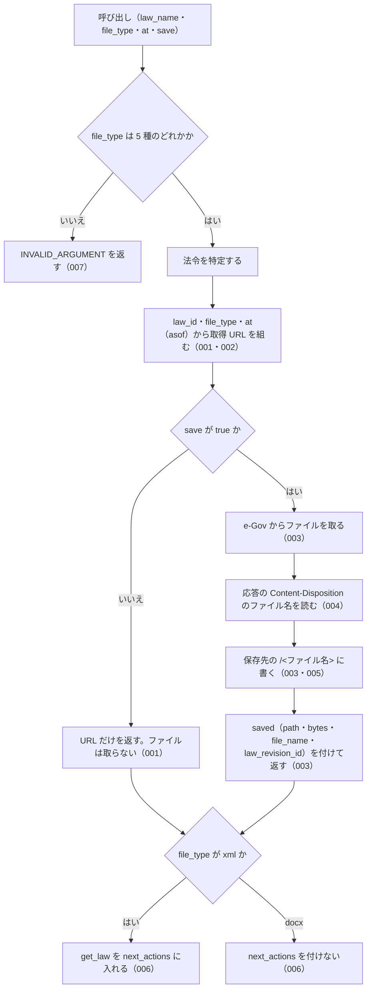

# get_law_file の仕様

<!-- GENERATED FILE — 手で編集しない。本文は houki-egov-mcp の specs/current/get_law_file/spec.md の写し。 -->

::: info
houki-egov-mcp **v0.20.0** の `specs/current/get_law_file/spec.md` から自動生成しました（仕様 ID 23 件・2026-10-09）。手で編集しないでください。再生成は `node scripts/generate-reference.mjs specs` です。
:::

このページは、houki-egov-mcp のツール「get_law_file（法令本文を 1 つのファイルで取る URL を返し、求められたら保存する）」の仕様です。「承認の履歴」の前までは、仕様書の本文を言い換えずに写しています。
引数の型と既定値の一覧と、実測の呼び出し例は[リファレンス](/reference/mcp/houki-egov#get-law-file)にあります。

最後に仕様が変わったのは v0.18.0 の「法令名・条・委任先を、確かなときだけ 1 つに決める（段階 5 法令の引き当て）」（2026-10-03 承認）です。それまでの経緯は[承認の履歴](#承認の履歴)にあります。

## 使う人と受け取るもの

この機能を誰が呼び、何を渡して何を受け取るかを示します。

- MCP クライアント（Claude などの LLM、または CLI から呼ぶ人）。`law_name` と `file_type` を渡して、法令本文 1 つ分のファイル（xml / json / html / rtf / docx）を取る URL を受け取る。`save: true` を付けたときは、サーバーが保存したファイルの絶対パスと、そのファイルの法令履歴 ID を受け取る
- MCP サーバーを起動する人。環境変数 `HOUKI_EGOV_FILES_DIR` で保存先のディレクトリを決める

## 入力

呼び出すときに渡す値です。

| 引数        | 必須 | 内容                                                                                                  |
| ----------- | ---- | ----------------------------------------------------------------------------------------------------- |
| `law_name`  | 必須 | 法令名または略称。例: `"民法"`、`"消法"`                                                              |
| `file_type` | 必須 | ファイル種別。`xml`（法令標準 XML）/ `json`（e-Gov の JSON）/ `html` / `rtf` / `docx`（Word）のどれか |
| `at`        | 任意 | 時点。`YYYY-MM-DD` 形式（[SPEC-EGOV-GET-LAW-FILE-019](#spec-egov-get-law-file-019)）。その時点以前で最新の法令履歴の本文になる |
| `save`      | 任意 | `true` でファイルを取得して保存する。既定は `false`（URL だけを返し、ファイルは取らない）             |

保存先のパスは引数では指定できない。inputSchema に無い引数を渡したときの扱いは common_errors に書く。

## できないこと

この機能が引き受けないことです。

- ファイルの中身（バイト列や base64）を応答に入れること
- 保存先のパスやファイル名を引数で決めること（決めるのはサーバーを起動する人の環境変数だけ）
- 条・項を選んで一部だけのファイルを取ること（ファイルは法令全体。一部を読むのは `get_law` / `get_law_range`）
- `save` なしで、その URL がどの法令履歴の本文を返すかを知らせること（`saved.law_revision_id` は保存したときだけ）
- 添付ファイル（別表・様式の図）を取ること（`list_attachments` / `get_attachment`）

## 処理の流れ

呼び出しを受けてから応答を返すまでに、何をどの順で確かめるかを示します。図の中の番号は「できること」の仕様 ID の末尾 3 桁です。

## 仕様 ID ごとの約束

この機能が守る約束を、仕様 ID ごとに並べています。見出しは約束を 1 文で表したもので、条件・応答の細部・例は「詳細」を開くと読めます。仕様 ID はそれぞれ受入テストと対応していて、テストの無い ID があると各リポジトリの CI が止まります。

### SPEC-EGOV-GET-LAW-FILE-001 save を付けないときは、ファイルを取らずに URL を返す

::: details 詳細
`save` を省くか `false` にしたときは、e-Gov からファイルを取らず、次のフィールドを持つ応答を返す。`saved` は付けない。

| フィールド     | 内容                                                                                                                                                           |
| -------------- | -------------------------------------------------------------------------------------------------------------------------------------------------------------- |
| `meta`         | 法令の情報（`law_id`・`title`・`law_num`・`retrieved_at`・`url`・`at`）。`at` は渡した `at` で、渡さないときは `null`                                          |
| `file_type`    | 渡した `file_type`                                                                                                                                             |
| `content_type` | 種別から決めた Content-Type。`docx` は `application/vnd.openxmlformats-officedocument.wordprocessingml.document`                                               |
| `url`          | 認証なしで開ける取得 URL。`https://laws.e-gov.go.jp/api/2/law_file/<file_type>/<law_id>`（例: `https://laws.e-gov.go.jp/api/2/law_file/docx/129AC0000000089`） |
| `note`         | 説明                                                                                                                                                           |

`save: true` のとき（[SPEC-EGOV-GET-LAW-FILE-003](#spec-egov-get-law-file-003)）も、`meta` は同じキーを持つ。

例: `{ law_name: "民法", file_type: "docx" }` の `meta.at` は `null`（v0.16.0 では `at` のキーが無かった）。`{ law_name: "民法", file_type: "html", at: "2020-04-01" }` の `meta.at` は `"2020-04-01"`。
:::

### SPEC-EGOV-GET-LAW-FILE-002 時点（at）は URL の asof になる

::: details 詳細
`at` を渡したときは、取得 URL に `asof=<at>` を付ける（例: `https://laws.e-gov.go.jp/api/2/law_file/html/129AC0000000089?asof=2020-04-01`）。`meta.at` は渡した `at` になる。
:::

### SPEC-EGOV-GET-LAW-FILE-003 save: true でファイルを取得し、法令履歴 ID の名前で保存する。法令履歴 ID が分からないときは null を返す

::: details 詳細
`save: true` のときは、e-Gov から法令本文のファイルを取得して保存し、応答に `saved` を付ける。保存するファイル名は、e-Gov の応答の Content-Disposition にあるファイル名（`<law_revision_id>.<拡張子>` の形。読み方は [SPEC-EGOV-GET-LAW-FILE-004](#spec-egov-get-law-file-004)）である。

- `saved.file_name`: Content-Disposition のファイル名。例: `129AC0000000089_20260624_508AC0000000045.xml`。読めないときは `null`
- `saved.law_revision_id`: Content-Disposition のファイル名が `<英数字と _>.<英数字>` の形のとき、その拡張子より前。例: `129AC0000000089_20260624_508AC0000000045`。`saved.file_name` が `null` のとき、またはこの形でないときは `null`
- `saved.path`: 書いたファイルの絶対パス。`<保存先のディレクトリ>/<ディレクトリ名>/<ファイル名>`。環境変数 `HOUKI_EGOV_FILES_DIR` があれば、それを保存先のディレクトリにする
- `saved.bytes`: 書いたバイト数

ファイル名とディレクトリ名は次のとおり。

| Content-Disposition のファイル名 | ファイル名 | ディレクトリ名 | `saved.file_name` | `saved.law_revision_id` |
| --- | --- | --- | --- | --- |
| `<law_revision_id>.<拡張子>` の形で読める | そのファイル名 | `<law_revision_id>` | そのファイル名 | `<law_revision_id>` |
| 読めるが、その形でない | そのファイル名 | `<law_id>` | そのファイル名 | `null` |
| 読めない（ヘッダーが無い、`filename` を含まない） | `<law_id>.<file_type>` | `<law_id>` | `null` | `null` |

法令履歴 ID が分からないときに、法令 ID を `saved.law_revision_id` に入れない（inputSchema と応答の型の説明は `law_revision_id` を法令履歴 ID としているため）。e-Gov は `filename="<law_revision_id>.<拡張子>"` を返す（2026-09-20 の実測。houki-egov-mcp #66）ので、表の下の 2 行は e-Gov の応答が変わったときの備えである。

例: Content-Disposition が `attachment; filename="129AC0000000089_20260624_508AC0000000045.docx"` なら、`saved.file_name: "129AC0000000089_20260624_508AC0000000045.docx"`、`saved.law_revision_id: "129AC0000000089_20260624_508AC0000000045"`、`saved.path` は `<保存先>/129AC0000000089_20260624_508AC0000000045/129AC0000000089_20260624_508AC0000000045.docx`。Content-Disposition が無い応答で `{ law_name: "民法", file_type: "xml", save: true }` を渡すと、`saved.file_name: null`、`saved.law_revision_id: null`、`saved.path` は `<保存先>/129AC0000000089/129AC0000000089.xml`（v0.16.0 では `saved.law_revision_id` が `"129AC0000000089"` だった）。
:::

### SPEC-EGOV-GET-LAW-FILE-004 Content-Disposition のファイル名の読み方。`filename*` があればそれを使う

::: details 詳細
`saved.file_name` は、Content-Disposition から次の順で読む。

1. `filename*=UTF-8''…` があれば、その中身を URL デコードしたもの（`a%20b.pdf` → `a b.pdf`）
2. 無ければ `filename="…"`（または引用符の無い `filename=…`）の中身（例: `attachment; filename="129AC0000000089_20260624_508AC0000000045.docx"` → `129AC0000000089_20260624_508AC0000000045.docx`）

`filename*` と `filename` の両方があるときは、ヘッダーの中の順によらず `filename*` を使う（RFC 6266 の 4.3 節が、両方を受け付ける側に `filename*` を選ぶよう勧めているため）。Content-Disposition が無いときや、どちらも含まないとき（例: `inline`）は `null` になる。2026-09-20 の実測では、e-Gov は `filename` だけを返す。

例: `attachment; filename="a.xml"; filename*=UTF-8''b%20c.xml` は `b c.xml`（v0.16.0 ではヘッダーの先に書かれた `a.xml`）。`attachment; filename*=UTF-8''b%20c.xml; filename="a.xml"` も `b c.xml`。`attachment; filename="a.xml"` は `a.xml`。`inline` は `null`。
:::

### SPEC-EGOV-GET-LAW-FILE-005 保存するファイル名にはディレクトリの部分を残さない

::: details 詳細
保存するファイル名とディレクトリ名は、パスの区切り（`/` と `\`）より前を捨てて末尾の名前だけにし、先頭の `.` を除き、英数字・`_`・`.`・`-`・かな・漢字以外の文字を `_` にする。何も残らなければ `file` にする。例: `../../etc/passwd` → `passwd`、`..\..\x.pdf` → `x.pdf`、`...` → `file`、`a b/c:d.pdf` → `c_d.pdf`。保存先のディレクトリの外には書かない。
:::

### SPEC-EGOV-GET-LAW-FILE-006 xml では条文を読む get_law を案内する

::: details 詳細
`file_type` が `xml` のときは、`next_actions` の先頭に `get_law` を入れる（xml は法令全体の大きなファイルで、条文を読むだけなら `get_law` / `get_law_range` のほうが小さく済むため）。`docx` のときは `next_actions` を付けない。
:::

### SPEC-EGOV-GET-LAW-FILE-007 file_type は 5 種のどれかでなければならない

::: details 詳細
`file_type` の inputSchema は `enum: ["xml", "json", "html", "rtf", "docx"]` で、これ以外の値（例: `txt`）は受け付けない。ツールの処理でも、`file_type` がこの 5 種のどれでもないときは、エラー `INVALID_ARGUMENT` を返す（`hint` に 5 種を書く）。
:::

### SPEC-EGOV-GET-LAW-FILE-008 save なしでは、e-Gov への問い合わせは法令名の解決だけ

::: details 詳細
`save` を省くか `false` にしたときは、e-Gov には法令名の解決のための法令検索だけを問い合わせる。法令本文（`/law_data`）・改正履歴（`/law_revisions`）・法令本文のファイル（`/law_file`）は問い合わせない。`at` を渡したときも同じ。

例: `{ law_name: "民法", file_type: "xml", at: "2020-04-01" }` → e-Gov への問い合わせは法令検索（`law_title: "民法"`）の 1 回だけで、応答の `url` は `https://laws.e-gov.go.jp/api/2/law_file/xml/129AC0000000089?asof=2020-04-01`。
:::

### SPEC-EGOV-GET-LAW-FILE-009 json でも get_law を案内し、html・rtf では案内しない

::: details 詳細
`file_type` が `xml` か `json` のときは、`next_actions` に `get_law` の 1 件を入れる。`example` は `{ law_name: <渡した law_name>, article: "1" }`。`html`・`rtf`・`docx` のときは `next_actions` を付けない。`save` の有無は問わない。

例:
- `{ law_name: "民法", file_type: "json" }` → `next_actions: [{ action: "get_law", reason: …, example: { law_name: "民法", article: "1" } }]`、`content_type: "application/json"`
- `{ law_name: "民法", file_type: "html" }` → `next_actions` は付かない（`content_type: "text/html"`）
- `{ law_name: "民法", file_type: "rtf", save: true }` → `next_actions` は付かない（`content_type: "application/rtf"`）
:::

### SPEC-EGOV-GET-LAW-FILE-010 save なしの note は、どの時点の履歴かと保存先のディレクトリを書く

::: details 詳細
`save` を付けないときの `note` は、`<meta.title> の本文を <file_type> で取る URL です。認証なしで開けます（<時点の説明>）。ファイルをディスクに置くには save: true を付けてください（<保存先のディレクトリ> 以下に保存します）。` になる。

- `<時点の説明>` は、`at` を渡したとき `時点 <at> 以前で最新の履歴`、渡さないとき `現時点で最新の履歴`
- `<保存先のディレクトリ>` は、[SPEC-EGOV-GET-LAW-FILE-003](#spec-egov-get-law-file-003) の保存先のディレクトリ（法令履歴 ID のディレクトリより上）

例: `HOUKI_EGOV_FILES_DIR=/tmp/glf-files`、`{ law_name: "民法", file_type: "xml", at: "2020-04-01" }` → `民法 の本文を xml で取る URL です。認証なしで開けます（時点 2020-04-01 以前で最新の履歴）。ファイルをディスクに置くには save: true を付けてください（/tmp/glf-files 以下に保存します）。`
:::

### SPEC-EGOV-GET-LAW-FILE-011 保存したときの note

::: details 詳細
`save: true` で保存したときの `note` は、`<saved.file_name>（<サイズ>）を <saved.path> に保存しました。` になる。`<サイズ>` は、1024 バイト未満なら `<バイト数> B`、1 MiB 未満なら KiB を小数 1 桁にした `<n> KB`、それ以上は MiB を小数 1 桁にした `<n> MB`。

例: Content-Disposition のファイル名が `129AC0000000089_20260624_508AC0000000045.docx` で 3 バイト → `129AC0000000089_20260624_508AC0000000045.docx（3 B）を <保存先のディレクトリ>/129AC0000000089_20260624_508AC0000000045/129AC0000000089_20260624_508AC0000000045.docx に保存しました。`
:::

### SPEC-EGOV-GET-LAW-FILE-012 特定できない法令と管轄外の資料はエラーにする

::: details 詳細
- 法令名が略称辞書で別の MCP サーバーの管轄の資料（例: `所基通` = 所得税基本通達）に当たるときは、エラー `OUT_OF_SCOPE` を返す。`next_actions` は `delegate_to_mcp`（`example` は `{ mcp: "houki-nta" }`）
- 法令名から法令を特定できないときは、エラー `LAW_NOT_FOUND` を返す。`next_actions` は `resolve_abbreviation`（`example` は `{ abbr: <law_name> }`）と `search_law`（`example` は `{ keyword: <law_name> }`）

どちらも `save: true` でも、e-Gov から法令本文のファイルを取らない。

例: `{ law_name: "所基通", file_type: "xml" }` → `OUT_OF_SCOPE`。`{ law_name: "無い法", file_type: "xml", save: true }`（法令検索で 0 件）→ `LAW_NOT_FOUND`。
:::

### SPEC-EGOV-GET-LAW-FILE-013 file_type の検査は、法令の特定より先に行う

::: details 詳細
`file_type` が 5 種のどれでもないときは、法令名が管轄外の資料でも特定できない法令でも、[SPEC-EGOV-GET-LAW-FILE-007](#spec-egov-get-law-file-007) の `INVALID_ARGUMENT` を返す。このとき e-Gov には何も問い合わせない（法令検索もしない）。

例: `{ law_name: "所基通", file_type: "txt" }` → `INVALID_ARGUMENT`（`OUT_OF_SCOPE` ではない）。`{ law_name: "無い法", file_type: "txt" }` → `INVALID_ARGUMENT`（`LAW_NOT_FOUND` ではない）で、e-Gov への問い合わせは 0 回。
:::

### SPEC-EGOV-GET-LAW-FILE-014 ファイルの取得に失敗したときの code

::: details 詳細
`save: true` の取得（`https://laws.e-gov.go.jp/api/2/law_file/<file_type>/<law_id>`）が失敗したときは、次のエラーを返す。どれも `detail.url` に取得した URL（`at` があれば `?asof=<at>` 付き）を入れる。

| e-Gov の応答                                        | `code`                | `retryable` | そのほか                                                                                     |
| --------------------------------------------------- | --------------------- | ----------- | -------------------------------------------------------------------------------------------- |
| 429                                                 | `SOURCE_RATE_LIMITED` | `true`      | `detail.status: 429`                                                                         |
| 時間切れ                                            | `SOURCE_TIMEOUT`      | `true`      | `detail.status` は付かない                                                                   |
| 5xx（例: 502）                                      | `SOURCE_API_ERROR`    | `true`      | `detail.status` に HTTP ステータス                                                           |
| 404・本文の `code` が `404004`                      | `LAW_NOT_FOUND`       | `false`     | [SPEC-EGOV-COMMON-ERRORS-033](/specs/houki-egov/common_errors#spec-egov-common-errors-033) の `error`・`hint`・`next_actions`。`detail.status: 404`・`detail.cause: "404004"` |
| 400・本文の `code` が `400044`（`at` を渡したとき） | `INVALID_ARGUMENT`    | `false`     | `tool: "get_law_file"`、`detail.issues: [{ path: "at", message: "e-Gov が受け付ける時点の範囲の外です" }]` |
| そのほかの 429 以外の 4xx（例: 403、`400042`）      | `SOURCE_API_ERROR`    | `false`     | `detail.status` に HTTP ステータス                                                           |

例: `{ law_name: "民法", file_type: "xml", at: "2000-01-01", save: true }` は、2026-10-03 10:13 JST の e-Gov が `/law_file/xml/…?asof=2000-01-01` に 400・`{"code":"400044", …}` を返すので `code: "INVALID_ARGUMENT"`（v0.17.0 では `SOURCE_API_ERROR`・`detail.status: 400`）。e-Gov が 404・`{"code":"404004"}` を返す（2026-10-03 の `/law_file/xml/503AC0000000035?asof=2018-01-01` がこの応答）→ `LAW_NOT_FOUND`、`detail.url` に `?asof=` 付きの URL。
:::

### SPEC-EGOV-GET-LAW-FILE-015 429・5xx・ネットワークの失敗は取り直してから返す

::: details 詳細
`save: true` の取得で e-Gov が 429 か 5xx を返したとき、または応答が来ないネットワークの失敗のときは、最大 3 回取り直す（最初の 1 回と合わせて最大 4 回）。途中で成功すれば保存して成功応答を返す。4 回とも失敗したときは [SPEC-EGOV-GET-LAW-FILE-014](#spec-egov-get-law-file-014) の code を返す。

時間切れと、429 以外の 4xx は取り直さない（e-Gov への問い合わせは 1 回）。

例:
- 4 回とも 502 → e-Gov への問い合わせは 4 回で、`SOURCE_API_ERROR`（`retryable: true`、`detail.status: 502`）
- 400 → 問い合わせは 1 回
:::

### SPEC-EGOV-GET-LAW-FILE-016 環境変数が無いときの保存先

::: details 詳細
`HOUKI_EGOV_FILES_DIR` が無いか空文字のときは、保存先のディレクトリを `<XDG_CACHE_HOME>/houki-egov-mcp/files` にする。`XDG_CACHE_HOME` も無いか空文字のときは `<ホームディレクトリ>/.cache/houki-egov-mcp/files` にする。[SPEC-EGOV-GET-LAW-FILE-010](#spec-egov-get-law-file-010) の `note` に書く保存先のディレクトリも同じ。

例:
- `HOUKI_EGOV_FILES_DIR` 無し、`XDG_CACHE_HOME=/tmp/xdg` → `saved.path` は `/tmp/xdg/houki-egov-mcp/files/129AC0000000089_20260624_508AC0000000045/129AC0000000089_20260624_508AC0000000045.docx`
- どちらも無く、ホームディレクトリが `/tmp/home` → `saved.path` は `/tmp/home/.cache/houki-egov-mcp/files/<law_revision_id>/<ファイル名>`、`save` なしの `note` は `（/tmp/home/.cache/houki-egov-mcp/files 以下に保存します）` を含む
:::

### SPEC-EGOV-GET-LAW-FILE-017 同じファイルを保存すると上書きする

::: details 詳細
同じ名前のファイル（同じ `saved.law_revision_id` と `saved.file_name`）を `save: true` でもう一度保存すると、前のファイルを新しい中身で上書きし、エラーにしない。`saved.path` は前と同じで、`saved.bytes` は新しい中身のバイト数になる。

例: 中身 `ONE`（3 バイト）で `129AC0000000089_20260624_508AC0000000045.docx` を保存したあと、中身 `TWO!`（4 バイト）で同じファイル名を保存 → 2 回目の `saved.bytes` は `4`、ファイルの中身は `TWO!`。
:::

### SPEC-EGOV-GET-LAW-FILE-018 law_name が空文字・空白だけのときは略称辞書と e-Gov に問い合わせずに `INVALID_ARGUMENT` を返す

::: details 詳細
空文字は inputSchema の `minLength: 1` の検査（[SPEC-EGOV-COMMON-ERRORS-025](/specs/houki-egov/common_errors#spec-egov-common-errors-025)）で止まり、`INVALID_ARGUMENT`（`tool: "get_law_file"`、`detail.issues: [{ path: "law_name", message: "空文字は指定できません" }]`）を返す。空白（半角スペース・全角スペース・タブ・改行）だけのときは、ツールの処理が略称辞書と e-Gov に問い合わせる前に、[SPEC-EGOV-COMMON-ERRORS-026](/specs/houki-egov/common_errors#spec-egov-common-errors-026) の形の `INVALID_ARGUMENT`（`tool: "get_law_file"`、`error: "law_name が空です"`、`detail.issues: [{ path: "law_name", message: "空白だけは指定できません" }]`、`hint` に法令名か略称を渡すよう書く）を返す。

例: `law_name: ""` は `code: "INVALID_ARGUMENT"`・`detail.issues[0].message: "空文字は指定できません"`。`law_name: "　"`（全角スペース）と `law_name: " \n"` は `code: "INVALID_ARGUMENT"`・`error: "law_name が空です"`。どれも略称辞書と e-Gov への問い合わせは 0 回。
:::

### SPEC-EGOV-GET-LAW-FILE-019 `at` は `YYYY-MM-DD` の形だけを受け付け、形に合わない値と暦に無い日付は `INVALID_ARGUMENT`

::: details 詳細
`at` は [SPEC-EGOV-COMMON-ERRORS-024](/specs/houki-egov/common_errors#spec-egov-common-errors-024) に従う。tools/list の inputSchema の `at` は `pattern: "^[0-9]{4}-[0-9]{2}-[0-9]{2}$"` を持ち、形に合わない値は inputSchema の検査で `INVALID_ARGUMENT`（`tool: "get_law_file"`、`detail.issues: [{ path: "at", message: "YYYY-MM-DD の形で指定してください" }]`）になる。形は合うが暦に無い日付は、ツールの処理が e-Gov に問い合わせる前に `INVALID_ARGUMENT`（`detail.issues: [{ path: "at", message: "暦に無い日付です" }]`）を返す。

例: `law_name: "民法", file_type: "xml", at: "2024/04/01"` は `code: "INVALID_ARGUMENT"`・`detail.issues[0].path: "at"` で、e-Gov への問い合わせは 0 回。`at: "20240401"`・`at: "2024-4-1"` も同じ。`at: "2026-02-30"` は `detail.issues[0].message: "暦に無い日付です"` で、e-Gov への問い合わせは 0 回。`at: "2024-04-01"` は [SPEC-EGOV-GET-LAW-FILE-002](#spec-egov-get-law-file-002) のとおり。

形に合わない `at` は、`save` が `false` でも URL の `asof` に入れて返すことはなく、`INVALID_ARGUMENT` になる。
:::

### SPEC-EGOV-GET-LAW-FILE-020 法令名の検索が通信の失敗で終わったときは `LAW_NOT_FOUND` ではなく `SOURCE_*` を返す

::: details 詳細
`law_name` が略称辞書に law_id 付きで無く、e-Gov の法令名検索で law_id を決めるとき、その検索が通信の失敗（接続できない・時間切れ・5xx・429・429 以外の 4xx）で終わったときは、[SPEC-EGOV-COMMON-ERRORS-027](/specs/houki-egov/common_errors#spec-egov-common-errors-027) の表の code（`SOURCE_UNAVAILABLE` / `SOURCE_TIMEOUT` / `SOURCE_API_ERROR` / `SOURCE_RATE_LIMITED`）を、表の `retryable` と `detail` 付きで返す（[SPEC-EGOV-COMMON-ERRORS-029](/specs/houki-egov/common_errors#spec-egov-common-errors-029)）。`LAW_NOT_FOUND`（[SPEC-EGOV-GET-LAW-FILE-012](#spec-egov-get-law-file-012)）は、検索が成功して 0 件だったときだけ返す。`SOURCE_*` のときの `next_actions` に `resolve_abbreviation` / `search_law` は入れない。

例: 法令名の検索が 503 を返す状態で `{ law_name: "架空の法律", file_type: "xml", save: true }` を渡すと、`code: "SOURCE_API_ERROR"`、`retryable: true`、`detail.status: 503`（v0.15.4 では `LAW_NOT_FOUND` だった）。検索が時間切れなら `SOURCE_TIMEOUT`、接続できなければ `SOURCE_UNAVAILABLE`（`detail.cause: "ENOTFOUND"` など）、400 なら `SOURCE_API_ERROR`・`retryable: false`。検索が 0 件で成功したときは `LAW_NOT_FOUND` のまま。
:::

### SPEC-EGOV-GET-LAW-FILE-021 上限（50 MB）を超えるファイルは `FILE_TOO_LARGE` で断り、Content-Length で分かるときは本文を読まない

::: details 詳細
`save: true` の取得で、ファイルが 50 MB（52,428,800 バイト）を超えているときは、エラー `FILE_TOO_LARGE`（`retryable: false`）を返し、保存しない（[SPEC-EGOV-COMMON-ERRORS-030](/specs/houki-egov/common_errors#spec-egov-common-errors-030)）。`INVALID_ARGUMENT` にはしない。大きさは次の順で確かめる。

1. e-Gov の応答ヘッダーに Content-Length があり、その値が上限を超えていれば、本文を読まずにエラーにする（`detail.bytes` は Content-Length の値）
2. Content-Length が無いか上限以下のときは本文を読み、読み終えた大きさが上限を超えていればエラーにする（`detail.bytes` は読み終えた大きさ）。途中で打ち切らない

`error` は `ファイルが大きすぎます: <大きさ>（上限 50.0 MB）`、`hint` は `保存せず url をそのまま使ってください`、`detail.url` は取得した URL（`at` があれば `?asof=<at>` 付き）。

例: Content-Length が `52428801` のとき、`{ law_name: "民法", file_type: "xml", save: true }` は `code: "FILE_TOO_LARGE"`、`retryable: false`、`detail.bytes: 52428801` で、本文は読まず、ファイルは書かない（v0.15.4 では全部読んでから `INVALID_ARGUMENT` だった）。Content-Length が無く本文が 52,428,801 バイトのときも `FILE_TOO_LARGE`。Content-Length が `52428800`（ちょうど 50 MB）は保存する。
:::

### SPEC-EGOV-GET-LAW-FILE-022 `law_name` の全角英数字・ダッシュ類・全角空白は半角に揃えてから略称辞書と照合する

::: details 詳細
`law_name` を略称辞書で引くときは、houki-abbreviations の `resolveAbbreviation(name, { normalize: true })` の規則（全角英数字を半角に、ダッシュ類 `－` `‐` `‑` `–` `—` `―` `−` を `-` に、全角チルダを `~` に、全角空白を半角空白にし、前後の空白を除く。大文字と小文字は区別する）で揃えてから照合する。管轄の判定（`OUT_OF_SCOPE`）も同じ規則で引く。辞書に無いときに e-Gov の法令名検索へ渡す値は、前後の空白を除いた渡した値のままで、揃えない。

例: `{ law_name: "ＰＬ法", file_type: "xml" }` は `製造物責任法の xml の URL を返す`（v0.15.4 では辞書に無い扱いで、e-Gov の法令名検索に `ＰＬ法` を渡して `LAW_NOT_FOUND` だった）。`law_name: "労基法　"`（末尾が全角空白）も `労働基準法` として引く。
:::

### SPEC-EGOV-GET-LAW-FILE-023 法令名が完全一致しないときは、URL を返さず候補を付けた `LAW_NOT_FOUND` を返す

::: details 詳細
`law_name` の法令は [SPEC-EGOV-COMMON-ERRORS-032](/specs/houki-egov/common_errors#spec-egov-common-errors-032) の規則で決める。略称辞書に law_id が無く、e-Gov の法令名検索の全件の中に題名の完全一致が無いときは、`save` の値にかかわらず、検索結果の先頭の法令の URL を返さず、ファイルも取らずに、032 の形の `LAW_NOT_FOUND`（`retryable: false`）を返す。`next_actions` の候補の要素は `action: "get_law_file"`、`example` は渡した引数（`file_type`・`save`・`at` のうち渡したもの）の `law_name` だけを候補の題名に替えたもの。`at` を渡したときは、法令名の検索にも `asof=<at>` を付ける。

例: `{ law_name: "所得税法施行", file_type: "xml" }` は `code: "LAW_NOT_FOUND"`、`next_actions` の先頭は `{ action: "get_law_file", example: { law_name: "所得税法施行令", file_type: "xml" } }`。
:::

## まだ決めていないこと

仕様を書き起こしたときに見つかった項目のうち、扱いを決めている途中のものです。開くと、元の仕様書の記述をそのまま読めます。

::: details 仕様書の「未決」の節
初版起こしで見つけた、意図か不具合かを人が決める項目です。決まったら「できること」に ID を振るか、`specs/changes/` の差分にします。

意図か不具合かの判断が要る項目は houki-egov-mcp の Issue に移し、ここには題と Issue の番号だけを残します。今の振る舞いのままでよくテストが無いだけの項目は、受入テストを書いてから「できること」に ID を振ります。

5. **テスト名「/law_data は引かない」と、テストが確かめていること。** → [SPEC-EGOV-GET-LAW-FILE-008](#spec-egov-get-law-file-008)
6. **json・html・rtf の `next_actions`。** → [SPEC-EGOV-GET-LAW-FILE-009](#spec-egov-get-law-file-009)
7. **`save` なしの `note` の中身。** → [SPEC-EGOV-GET-LAW-FILE-010](#spec-egov-get-law-file-010)・[SPEC-EGOV-GET-LAW-FILE-011](#spec-egov-get-law-file-011)
8. **特定できない法令と管轄外の資料。** → [SPEC-EGOV-GET-LAW-FILE-012](#spec-egov-get-law-file-012)・[SPEC-EGOV-GET-LAW-FILE-013](#spec-egov-get-law-file-013)
9. **e-Gov からの取得に失敗したときの code。** → [SPEC-EGOV-GET-LAW-FILE-014](#spec-egov-get-law-file-014)・[SPEC-EGOV-GET-LAW-FILE-015](#spec-egov-get-law-file-015)
10. **既定の保存先と、同じファイルの上書き。** → [SPEC-EGOV-GET-LAW-FILE-016](#spec-egov-get-law-file-016)・[SPEC-EGOV-GET-LAW-FILE-017](#spec-egov-get-law-file-017)
:::

## 承認の履歴

この機能の仕様が、いつ、どの変更で承認されたかを新しい順に並べています。各リポジトリの `npx spec-ids history get_law_file` と同じ内容です。変更の名前から、変更の理由と前後の振る舞いを書いた文書（GitHub）を開けます。

::: details 承認の履歴（8 件）
| 承認日 | 版 | 変更 | 仕様 PR |
|---|---|---|---|
| 2026-10-03 | v0.18.0 | [法令名・条・委任先を、確かなときだけ 1 つに決める（段階 5 法令の引き当て）](https://github.com/shuji-bonji/houki-egov-mcp/blob/v0.20.0/specs/releases/v0.18.0/20261003-law-resolution/proposal.md) | [#95](https://github.com/shuji-bonji/houki-egov-mcp/pull/95) |
| 2026-10-03 | v0.17.0 | [値の無いフィールドを null にし、meta の時点を常に返す（T4 応答の形）](https://github.com/shuji-bonji/houki-egov-mcp/blob/v0.20.0/specs/releases/v0.17.0/20261003-t4-response-shape/proposal.md) | [#91](https://github.com/shuji-bonji/houki-egov-mcp/pull/91) |
| 2026-10-01 | v0.16.0 | [全角・半角・ダッシュ類の揃え方を houki-abbreviations 0.7.0 に一本化する（T3）](https://github.com/shuji-bonji/houki-egov-mcp/blob/v0.20.0/specs/releases/v0.16.0/20261001-t3-normalize/proposal.md) | [#86](https://github.com/shuji-bonji/houki-egov-mcp/pull/86) |
| 2026-10-01 | v0.16.0 | [「見つからない」と「取得元の失敗」の code を分ける（T2）](https://github.com/shuji-bonji/houki-egov-mcp/blob/v0.20.0/specs/releases/v0.16.0/20261001-t2-error-codes/proposal.md) | [#85](https://github.com/shuji-bonji/houki-egov-mcp/pull/85) |
| 2026-10-01 | v0.16.0 | [引数の検査を inputSchema に書き、丸めずに `INVALID_ARGUMENT` にする（T1）](https://github.com/shuji-bonji/houki-egov-mcp/blob/v0.20.0/specs/releases/v0.16.0/20261001-t1-argument-guards/proposal.md) | [#84](https://github.com/shuji-bonji/houki-egov-mcp/pull/84) |
| 2026-09-28 | v0.15.2 | [テストが無いだけの振る舞いに仕様 ID を振る](https://github.com/shuji-bonji/houki-egov-mcp/blob/v0.20.0/specs/releases/v0.15.2/20260928-untested-behaviors/proposal.md) | [#76](https://github.com/shuji-bonji/houki-egov-mcp/pull/76) |
| 2026-09-28 | v0.15.2 | [「未決」のうち判断が要る 85 件を Issue に移す](https://github.com/shuji-bonji/houki-egov-mcp/blob/v0.20.0/specs/releases/v0.15.2/20260928-undecided-to-issues/proposal.md) | [#68](https://github.com/shuji-bonji/houki-egov-mcp/pull/68) |
| 2026-09-28 | — | 初版 | [#50](https://github.com/shuji-bonji/houki-egov-mcp/pull/50) |
:::

## 関連ページ

このページの元になった文書と、あわせて読むページです。

- [houki-egov-mcp の仕様の一覧](/specs/houki-egov/)
- [houki-egov-mcp の解説](/mcp/houki-egov)
- [リファレンスの get_law_file](/reference/mcp/houki-egov#get-law-file)
- [元の仕様書（GitHub、v0.20.0）](https://github.com/shuji-bonji/houki-egov-mcp/blob/v0.20.0/specs/current/get_law_file/spec.md)
