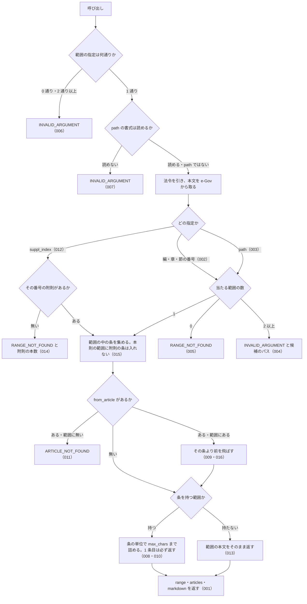

# get_law_range の仕様

<!-- GENERATED FILE — 手で編集しない。本文は houki-egov-mcp の specs/current/get_law_range/spec.md の写し。 -->

::: info
houki-egov-mcp **v0.20.0** の `specs/current/get_law_range/spec.md` から自動生成しました（仕様 ID 35 件・2026-10-09）。手で編集しないでください。再生成は `node scripts/generate-reference.mjs specs` です。
:::

このページは、houki-egov-mcp のツール「get_law_range（編・章・節、または附則 1 本を範囲にして、条を本文ごと返す）」の仕様です。「承認の履歴」の前までは、仕様書の本文を言い換えずに写しています。
引数の型と既定値の一覧と、実測の呼び出し例は[リファレンス](/reference/mcp/houki-egov#get-law-range)にあります。

最後に仕様が変わったのは v0.18.0 の「法令名・条・委任先を、確かなときだけ 1 つに決める（段階 5 法令の引き当て）」（2026-10-03 承認）です。それまでの経緯は[承認の履歴](#承認の履歴)にあります。

## 使う人と受け取るもの

この機能を誰が呼び、何を渡して何を受け取るかを示します。

- MCP クライアント（Claude などの LLM、または CLI から呼ぶ人）。`law_name` と範囲（編・章・節の番号、`get_toc` の `path`、または附則の番号）を渡して、その範囲の条の本文を受け取る。範囲が長くて打ち切られたときは、応答の `next_from_article` を `from_article` に渡して続きを取る

## 入力

呼び出すときに渡す値です。

範囲の指定は「編・章・節・款・目の番号」「`path`」「`suppl_index`」の 3 通りで、1 回の呼び出しで使えるのはどれか 1 つだけ。

| 引数           | 必須 | 内容                                                                                                         |
| -------------- | ---- | ------------------------------------------------------------------------------------------------------------ |
| `law_name`     | 必須 | 法令名または略称。例: `民法`、`会社法`、`消法`                                                               |
| `part`         | 任意 | 編の番号。`3` / `"3"` / `"三"` / `"第三編"` / 枝番号 `"2の2"`                                                |
| `chapter`      | 任意 | 章の番号（書き方は `part` と同じ）。章の番号は編ごとに振り直されるので、編を持つ法令では `part` も渡す       |
| `section`      | 任意 | 節の番号                                                                                                     |
| `subsection`   | 任意 | 款の番号                                                                                                     |
| `division`     | 任意 | 目の番号                                                                                                     |
| `path`         | 任意 | 範囲のパス。`get_toc` の `toc[].path` をそのまま渡せる。例: `"Part3/Chapter2"`                               |
| `suppl_index`  | 任意 | 附則の番号。1 以上の整数（[SPEC-EGOV-GET-LAW-RANGE-030](#spec-egov-get-law-range-030)）。`get_toc` の `suppl_provisions[].index` と同じ |
| `from_article` | 任意 | 範囲の中のこの条から返す。前の応答の `next_from_article` を渡す。例: `"561"`、`"548の4"`、`"第五百六十一条"` |
| `max_chars`    | 任意 | 返す条本文の文字数の上限。既定 30,000、2,000〜120,000                                                        |
| `at`           | 任意 | 時点指定（`YYYY-MM-DD`。[SPEC-EGOV-GET-LAW-RANGE-031](#spec-egov-get-law-range-031)） |

## できないこと

この機能が引き受けないことです。

- 条より細かい単位（項・号）で範囲を指すこと（1 条の項・号は `get_law`）
- 複数の附則や、本則と附則をまたいだ範囲を 1 回で返すこと
- 条の途中で打ち切ること（上限を超えても 1 条目は丸ごと返し、2 条目以降は条の単位で打ち切る）
- 範囲の目次だけを返すこと（目次は `get_toc`）
- `format` を選ぶこと（応答は markdown と `range`・`articles` の両方を常に返す）

## 処理の流れ

呼び出しを受けてから応答を返すまでに、何をどの順で確かめるかを示します。図の中の番号は「できること」の仕様 ID の末尾 3 桁です。

## 仕様 ID ごとの約束

この機能が守る約束を、仕様 ID ごとに並べています。見出しは約束を 1 文で表したもので、条件・応答の細部・例は「詳細」を開くと読めます。仕様 ID はそれぞれ受入テストと対応していて、テストの無い ID があると各リポジトリの CI が止まります。

### SPEC-EGOV-GET-LAW-RANGE-001 指定した範囲の条を本文ごと返し、範囲の内訳を `range` に入れる

::: details 詳細
指定した範囲の中の条だけを返す。応答は次のフィールドを持つ。

| フィールド             | 内容                                                                                                                             |
| ---------------------- | -------------------------------------------------------------------------------------------------------------------------------- |
| `range.path`           | 本則の範囲のパス（例: `Part1/Chapter1`）。編・章・節の番号で指定したときも付く                                                   |
| `range.tag`            | 範囲の種類。`Part` / `Chapter` / `Section` / `Subsection` / `Division`、附則は `SupplProvision`                                  |
| `range.titles`         | 範囲の見出しの連なり（上位から）。例: `["第一編　総則", "第一章　通則"]`                                                         |
| `range.article_count`  | 範囲が持つ条の数                                                                                                                 |
| `range.returned_count` | 本文を返した条の数                                                                                                               |
| `range.truncated`      | 文字数の上限で打ち切ったか                                                                                                       |
| `articles`             | 返した条の一覧。要素は `num`（e-Gov の条番号。例: `"1"`）・`label`（表示用。例: `第1条`）・`caption`（条見出し。例: `（趣旨）`） |
| `markdown`             | 見出し `# <法令名> <範囲の見出し…>` と、条ごとの `## 第N条` の節                                                                 |

例: `part: 1, chapter: 1` では、第一編第一章の第1条・第2条だけを返し、`range.path` は `Part1/Chapter1`、`range.tag` は `Chapter`、`range.article_count` と `range.returned_count` は 2、`markdown` の見出しは `# テスト法 第一編　総則 第一章　通則` で、第一編第二章の `## 第3条` は含まない。
:::

### SPEC-EGOV-GET-LAW-RANGE-002 編・章・節の番号はいくつかの書き方で受ける

::: details 詳細
`part` / `chapter` / `section` / `subsection` / `division` は、数値、算用数字の文字列、全角数字、漢数字、「第三編」「第十二章」のような書き方、枝番号（`"2の2"`、`"第二章の二"`、`"第一節の二"`）のどれでも受け、同じ範囲を指す。上位の階層は省いてよく、省いた階層では絞り込まない。

例: `part: "第二編", chapter: "二"` は `part: 2, chapter: 2` と同じ `Part2/Chapter2` を指す。`part: 2, chapter: 2, section: "2の2"` は第二節の二（`Part2/Chapter2/Section2_2`、`range.tag` は `Section`）を指す。
:::

### SPEC-EGOV-GET-LAW-RANGE-003 `path` で範囲を指す

::: details 詳細
`path` には `get_toc` が返す `toc[].path` をそのまま渡せる。タグの綴りの大文字と小文字は問わない（`part3/chapter2` は `Part3/Chapter2` と同じ）。枝番号は `Chapter4_2` の形で書く。`path` は法令の根からの完全一致で探す。上位を省いたパス（`Chapter2`）や、無い番号を含むパスは範囲に当たらない。

例: `get_toc` の `Part2/Chapter2` を渡すと、`range.path` が `Part2/Chapter2`、`range.titles` が `["第二編　物権", "第二章　占有権"]` の範囲を返す。
:::

### SPEC-EGOV-GET-LAW-RANGE-004 上位を省いた指定が複数の範囲に当たるときは、候補のパスを返す

::: details 詳細
編・章・節の番号の指定が 2 か所以上の範囲に当たるとき（章の番号は編ごとに振り直されるため、`part` を省いた `chapter` は複数の編の章に当たる）は、エラー `INVALID_ARGUMENT` を返す。`error` に当たった数（`N か所`）を、`hint` に当たった範囲のパスを書き、`next_actions` に候補ごとの `get_law_range` の呼び出し例（`example.path` に候補のパス）を入れる。

例: 第一編と第二編の両方に第二章がある法令で `chapter: 2` だけを渡すと、`error` に `2 か所` を含み、`next_actions` の `example.path` は `["Part1/Chapter2", "Part2/Chapter2"]`。
:::

### SPEC-EGOV-GET-LAW-RANGE-005 範囲が無いときは RANGE_NOT_FOUND を返す

::: details 詳細
編・章・節の番号または `path` に当たる範囲が無いときは、エラー `RANGE_NOT_FOUND` を返す。`next_actions` の先頭は `get_toc`（目次で番号とパスを確かめる案内）。

例: 第九編の無い法令で `part: 9` を渡すと `RANGE_NOT_FOUND`。
:::

### SPEC-EGOV-GET-LAW-RANGE-006 範囲の指定が無いとき、2 通り以上を同時に指定したときはエラーにする

::: details 詳細
「編・章・節・款・目の番号」「`path`」「`suppl_index`」のどれも渡さないときは、エラー `INVALID_ARGUMENT`（`error` は `範囲を指定してください`）を返す。2 通り以上を同時に渡したときも、エラー `INVALID_ARGUMENT`（`error` に `1 通りにしてください` と、同時に渡された指定の種類）を返す。

例: `path: "Part1", chapter: 1` は `INVALID_ARGUMENT`。
:::

### SPEC-EGOV-GET-LAW-RANGE-007 読めない `path` はエラーにする

::: details 詳細
`path` が「タグ名 + 番号」を `/` でつないだ形でないとき（編・章・節・款・目以外のタグ、番号の無い区切り、日本語の表記、空文字）は、エラー `INVALID_ARGUMENT`（`error` に `path の形式が不正です`）を返す。

例: `path: "第一編/第一章"`、`"Book3"`、`"Part"` はどれも `INVALID_ARGUMENT`。
:::

### SPEC-EGOV-GET-LAW-RANGE-008 文字数の上限を超える範囲は条の単位で打ち切り、続きの条番号と、同じ条件で呼び直す例を返す

::: details 詳細
返す条本文の文字数（条ごとの見出しを含む）が `max_chars` を超える手前で、条の単位で打ち切る。条の途中では切らない。打ち切ったときは次を返す。

| フィールド                                   | 内容                                                                                                                                                                                                                                       |
| -------------------------------------------- | ------------------------------------------------------------------------------------------------------------------------------------------------------------------------------------------------------------------------------------------ |
| `range.truncated`                            | `true`                                                                                                                                                                                                                                     |
| `range.next_from_article`                    | 続きの最初の条番号。`from_article` にそのまま渡せる                                                                                                                                                                                        |
| `range.first_article` / `range.last_article` | 返した最初と最後の条（例: `第5条` / `第6条`）                                                                                                                                                                                              |
| `range.body_chars`                           | 返した条本文の文字数（`max_chars` 以下）                                                                                                                                                                                                   |
| `range.note`                                 | 何件のうち何件を返したかと、`from_article: "<続きの条番号>"` を付けて呼び直す案内                                                                                                                                                          |
| `range.next_actions`                         | `get_law_range` の呼び出し例。`reason` は `同じ範囲の続きの条から取れます`、`example` は `law_name`・範囲の `path`（附則なら `suppl_index`）・`from_article` に、呼び出し側が渡した `max_chars` と `at` を加えたもの（渡さなかった引数は入れない） |

`example` のとおりに呼び直したときに、文字数の上限と時点が最初の呼び出しと変わらないようにするため、渡された `max_chars` と `at` は値を変えずにそのまま写す。`markdown` の末尾にも同じ `note`（`上限で打ち切りました` を含む）を書く。

例: 本文 900・900・2,500 文字の 3 条を持つ節を `max_chars: 2000` で取ると、2 条を返して `truncated: true`、`next_from_article: "7"`、`next_actions[0].example` は `{ law_name, path: "Part2/Chapter2/Section1", from_article: "7", max_chars: 2000 }`（v0.16.0 では `max_chars` が入らず、例のとおりに呼び直すと既定の 30,000 文字で返っていた）。同じ節を `max_chars: 2000, at: "2020-04-01"` で取ると `example` は `{ law_name, path: "Part2/Chapter2/Section1", from_article: "7", max_chars: 2000, at: "2020-04-01" }`。`max_chars` を省いて既定の 30,000 文字で打ち切ったときは、`example` に `max_chars` を入れない。
:::

### SPEC-EGOV-GET-LAW-RANGE-009 `from_article` から続きを返す

::: details 詳細
`from_article` を渡したとき、範囲の中のその条から返し、それより前の条は返さない。飛ばした条の数を `range.skipped_count` に入れ、`range.note` に `先頭の N 件は from_article より前` のため返していないことを書く。

例: 第5条・第6条・第7条の節に `from_article: "7"` を渡すと、`articles` は第7条だけで、`skipped_count: 2`、`returned_count: 1`。
:::

### SPEC-EGOV-GET-LAW-RANGE-010 1 条だけで上限を超えるときも、その 1 条は返す

::: details 詳細
返す最初の条が 1 条だけで `max_chars` を超えるときも、その条は返す（空の応答を返さない）。このとき `range.body_chars` は `max_chars` を超える。その 1 条で範囲が終わるなら `truncated` は `false`。

例: 本文 2,500 文字の第7条から `max_chars: 2000` で取ると、第7条を返し、`body_chars` は 2,000 を超え、`truncated: false`。
:::

### SPEC-EGOV-GET-LAW-RANGE-011 範囲に無い条を `from_article` に渡すと ARTICLE_NOT_FOUND を返す

::: details 詳細
`from_article` の条が範囲の中に無いときは、エラー `ARTICLE_NOT_FOUND` を返す。`hint` に、その範囲が何条から始まるかと、`from_article` には前回の応答の `next_from_article` を渡すよう書く。

例: 第1条・第2条の章に `from_article: "999"` を渡すと `ARTICLE_NOT_FOUND` で、`hint` に `第1条` を含む。
:::

### SPEC-EGOV-GET-LAW-RANGE-012 `suppl_index` で附則 1 本を範囲にする

::: details 詳細
`suppl_index` を渡したとき、法令の附則を出現順に数えたその番号の附則 1 本を範囲にして、その中の条を返す。`range.suppl_index` にその番号を入れ、`range.path` は付けない。`range.tag` は `SupplProvision`、`range.titles` は `附則(<番号>) <改正法の法令番号、または 制定時><抄なら（抄）>` の 1 件で、`markdown` の見出しは `# <法令名> <その見出し>`。

例: 制定時の附則（抄）を 1 本目に持つ法令で `suppl_index: 1` を渡すと、`range.titles` は `["附則(1) 制定時（抄）"]`、`articles` の条番号は `["1"]`、見出しは `# テスト法 附則(1) 制定時（抄）`。
:::

### SPEC-EGOV-GET-LAW-RANGE-013 条を持たず項だけの附則は、本文をそのまま返す

::: details 詳細
`suppl_index` で指した附則が条を立てず項だけで書かれているときは、その附則の本文をそのまま `markdown` に入れる。`range.article_count` と `range.returned_count` は 0 で、`range.note` に `条を持たず項だけ` で書かれているため本文をそのまま返したことを書く。

例: 「この法律は、公布の日から施行する。」の 1 項だけの附則では、`markdown` にその文を含み、`article_count: 0`。
:::

### SPEC-EGOV-GET-LAW-RANGE-014 無い附則の番号は RANGE_NOT_FOUND を返す

::: details 詳細
`suppl_index` の番号の附則が無いとき（0 や、附則の本数より大きい番号）は、エラー `RANGE_NOT_FOUND` を返す。`hint` にその法令の附則の本数（`附則は N 本`）と指定できる番号の範囲を書く（附則の無い法令では附則が無いことを書く）。

例: 附則 2 本の法令で `suppl_index: 99` を渡すと `RANGE_NOT_FOUND` で、`hint` に `附則は 2 本` を含む。
:::

### SPEC-EGOV-GET-LAW-RANGE-015 本則の範囲には附則の条を入れない

::: details 詳細
本則の編・章・節を範囲にしたときは、その中の条を出現順に返し、附則の条は入れない（附則の条番号が本則の条番号と重なっていても入らない）。

例: 第1条〜第3条と削除条（第4条及び第5条）を持つ第一編を `max_chars: 120000` で取ると、`articles` の条番号は `["1", "2", "3", "4:5"]` で、附則の第1条は入らない。
:::

### SPEC-EGOV-GET-LAW-RANGE-016 削除された条をまとめた条も 1 条として返し、そこから続きを取れる

::: details 詳細
削除された条をまとめた条（e-Gov の条番号が `4:5` のような範囲表記）も 1 条として扱う。表示は e-Gov の条名と同じ言い方にする（隣り合う 2 条は `第4条及び第5条`、3 条以上は `第170条から第174条まで`）。その条で打ち切ったときは `next_from_article` に範囲表記（`"4:5"`）を返し、それを `from_article` に渡すと続きを返す。`from_article` は漢数字の範囲表記（`"五百三十四:五百三十五"`）も受ける。

例: 第3条だけで上限を超える章を `max_chars: 2000` で取ると、第3条を返して `next_from_article: "4:5"`。続けて `from_article: "4:5"` で取ると、`articles[0].label` と `range.first_article` は `第4条及び第5条`、`markdown` に `## 第4条及び第5条` と `削除` を含み、`skipped_count: 1`。
:::

### SPEC-EGOV-GET-LAW-RANGE-017 法令が見つからないときは LAW_NOT_FOUND を返す

::: details 詳細
略称辞書にも e-Gov の法令検索にも当たらない `law_name` では、エラー `LAW_NOT_FOUND` を返す。`error` は `法令が見つかりません: <law_name>`。`next_actions` は 2 件で、1 件目は `resolve_abbreviation`（`example.abbr` に `law_name`）、2 件目は `search_law`（`example.keyword` に `law_name`）。

例: `law_name: "存在しない法", chapter: 1`（法令検索の結果が 0 件）では、`code: "LAW_NOT_FOUND"`、`error: "法令が見つかりません: 存在しない法"`、`next_actions` の `action` は `["resolve_abbreviation", "search_law"]`、`next_actions[0].example` は `{ abbr: "存在しない法" }`、`next_actions[1].example` は `{ keyword: "存在しない法" }`。
:::

### SPEC-EGOV-GET-LAW-RANGE-018 houki-egov の管轄外の名前には OUT_OF_SCOPE を返す

::: details 詳細
略称辞書で houki-egov 以外の管轄と分かる `law_name`（通達名など）では、範囲の指定を読む前に、e-Gov に問い合わせずにエラー `OUT_OF_SCOPE` を返す。`error` に正式名称と管轄の MCP 名を書き、`next_actions[0]` は `action: "delegate_to_mcp"`、`example.mcp` に管轄の MCP 名を入れる。

例: `law_name: "消基通", chapter: 1` では、`code: "OUT_OF_SCOPE"`、`error` は `「消費税法基本通達」は houki-nta の管轄です` で始まり、`next_actions[0]` は `{ action: "delegate_to_mcp", example: { mcp: "houki-nta" } }`（`reason` も付く）、`detail.cause` は `source_mcp_hint=houki-nta`。
:::

### SPEC-EGOV-GET-LAW-RANGE-019 法令本文の取得で e-Gov が失敗したときのエラー

::: details 詳細
429 以外の 4xx は [SPEC-EGOV-GET-LAW-RANGE-035](#spec-egov-get-law-range-035)。

法令を引けた後、e-Gov から法令本文を取るところで失敗したときは、次のエラーを返す。

| e-Gov の失敗 | `code`                | `retryable` | `next_actions` の `action`       |
| ------------ | --------------------- | ----------- | -------------------------------- |
| 429          | `SOURCE_RATE_LIMITED` | `true`      | `retry_later`                    |
| タイムアウト | `SOURCE_TIMEOUT`      | `true`      | `retry_later`、`visit_egov_site` |
| 5xx          | `SOURCE_API_ERROR`    | `true`      | `retry_later`、`visit_egov_site` |

429 と 5xx では `detail.status` に HTTP の状態コードを入れる。

例: `chapter: 1` で本文の取得が 503 で失敗すると、`code: "SOURCE_API_ERROR"`、`error: "e-Gov API がサーバーエラーを返しました（503）"`、`retryable: true`、`detail.status: 503`。429 では `code: "SOURCE_RATE_LIMITED"`、`error: "e-Gov API がレート制限を返しました（429）"`。タイムアウトでは `code: "SOURCE_TIMEOUT"`、`error: "e-Gov API がタイムアウトしました"`。
:::

### SPEC-EGOV-GET-LAW-RANGE-020 読めない編・章・節・款・目の番号は、e-Gov に問い合わせる前に INVALID_ARGUMENT を返す

::: details 詳細
`part` / `chapter` / `section` / `subsection` / `division` の値が番号として読めないとき（番号でない語、0 以下の数、整数でない数、`"三〇"` のような漢数字の書き方、空文字）は、法令検索も法令本文の取得もせずに、エラー `INVALID_ARGUMENT` を返す。`error` に渡した値を書き、`hint` は `<引数名> は "3"・"三"・"第三章"・"2の2" のいずれかの形式で指定してください`。

例: `chapter: "総則"` では `code: "INVALID_ARGUMENT"`、`error` は `編・章・節の番号の形式が不正です（例: "3", "三", "第三章", "2の2", "第二章の二"）: 総則`、`hint` は `chapter は "3"・"三"・"第三章"・"2の2" のいずれかの形式で指定してください` で、e-Gov への問い合わせは 0 回。`chapter: 0` では `error` は `編・章・節の番号は 1 以上の整数で指定してください: 0`。`chapter: "三〇"`、`chapter: ""`、`chapter: -1`、`chapter: 1.5` もどれも `INVALID_ARGUMENT`。`subsection: "総則"` では `hint` が `subsection は` で始まる。
:::

### SPEC-EGOV-GET-LAW-RANGE-021 読めない `from_article` は INVALID_ARTICLE_NUM を返す

::: details 詳細
`from_article` が条番号として読めないとき（数字でも「第N条」の形でもない文字列、項の表記、空文字）は、エラー `INVALID_ARTICLE_NUM` を返す。`error` に渡した値を書き、`hint` は `from_article は "561"、"548の4"、"第五百六十一条" のいずれかの形式で指定してください`。

例: `chapter: 1, from_article: "abc"` では `code: "INVALID_ARTICLE_NUM"`、`error` は `条番号の形式が不正です（例: "30", "30の2", "第三十条", "第三十条の二"）: abc`。`from_article: "第一項"` と `from_article: ""` も `INVALID_ARTICLE_NUM`。
:::

### SPEC-EGOV-GET-LAW-RANGE-022 `max_chars` を省くと 30,000 文字で、適用した上限を `range.max_chars` に入れる

::: details 詳細
`max_chars` を省いたときは、返す条本文の文字数の上限を 30,000 文字にする。応答の `range.max_chars` に適用した上限を入れる。

例: `max_chars` を省くと `range.max_chars: 30000`。tools/call（`get_law_range`）で `max_chars: 2000`・`50000`・`120000` を渡すと、`range.max_chars` はそれぞれ `2000`・`50000`・`120000`。
:::

### SPEC-EGOV-GET-LAW-RANGE-023 範囲外の `max_chars` は tools/call で INVALID_ARGUMENT にする

::: details 詳細
tools/call（`get_law_range`）で、`max_chars` に 2,000 未満または 120,000 を超える値を渡すと、inputSchema の検査でエラー `INVALID_ARGUMENT` を返す。`detail.issues[0].path` は `max_chars`。`detail.issues[0].message` は [SPEC-EGOV-COMMON-ERRORS-022](/specs/houki-egov/common_errors#spec-egov-common-errors-022) の表の `minimum` / `maximum` の行の文で、検査の部品が作る英文（`must be >= 2000` など）は返さない。

例: `max_chars: 1999` では `code: "INVALID_ARGUMENT"`、`detail.issues` は `[{ path: "max_chars", message: "2000 以上で指定してください" }]`。`max_chars: 120001` では `detail.issues` は `[{ path: "max_chars", message: "120000 以下で指定してください" }]`。
:::

### SPEC-EGOV-GET-LAW-RANGE-024 款・目（`subsection` / `division`）で範囲を指す

::: details 詳細
`subsection`（款）と `division`（目）も、編・章・節と同じ書き方（数値、漢数字、`"第一款"` のような書き方、枝番号 `"2の2"`）で受け、同じ探し方で範囲を指す。上位の階層は省いてよい。款を範囲にしたときの `range.tag` は `Subsection`、目のときは `Division`。`range.titles` と `markdown` の見出しには上位の見出しから並べる。

例: 第二章 > 第一節 > 第一款（第一目に第3条、第二目に第4条・第5条）と第二款の二（第6条）を持つ法令で、

- `chapter: 2, section: 1, subsection: 1` は `range.path: "Chapter2/Section1/Subsection1"`、`range.tag: "Subsection"`、`articles` の条番号 `["3", "4", "5"]`、`range.titles: ["第二章　契約", "第一節　通則", "第一款　成立"]`
- `subsection: "第一款"` も同じ範囲を返す
- `division: "二"` は `range.path: "Chapter2/Section1/Subsection1/Division2"`、`range.tag: "Division"`、条番号 `["4", "5"]`、`markdown` の見出しは `# テスト法 第二章　契約 第一節　通則 第一款　成立 第二目　承諾`
- `subsection: "2の2"` は `range.path: "Chapter2/Section1/Subsection2_2"`、条番号 `["6"]`
- `division: 9` は `RANGE_NOT_FOUND`
:::

### SPEC-EGOV-GET-LAW-RANGE-025 応答の `meta`

::: details 詳細
応答の `meta` は次のフィールドを持つ。`at` を省いたときもキーは無くならない。

| フィールド     | 内容                                                                   |
| -------------- | ---------------------------------------------------------------------- |
| `law_id`       | e-Gov の法令 ID                                                        |
| `title`        | 法令名                                                                 |
| `law_num`      | 法令番号                                                               |
| `retrieved_at` | 取得日時（ISO 8601 の UTC）                                            |
| `url`          | e-Gov 法令検索の法令のページ。`https://laws.e-gov.go.jp/law/<law_id>` |
| `at`           | 渡した `at`。`at` を省いたときは `null`                                |

例: 法令 ID `999AC0000000001`・法令名 `テスト法`・法令番号 `令和七年法律第一号` の法令で `chapter: 1` を取ると、`meta` は `{ law_id: "999AC0000000001", title: "テスト法", law_num: "令和七年法律第一号", retrieved_at: <ISO 8601>, url: "https://laws.e-gov.go.jp/law/999AC0000000001", at: null }`（v0.16.0 では `at` のキーが無かった）。
:::

### SPEC-EGOV-GET-LAW-RANGE-026 markdown の末尾に `range.note` と出典を書く

::: details 詳細
`markdown` の条の節の後に `---` の行を置き、続けて `range.note` と同じ文の行、`出典：e-Gov法令検索（デジタル庁）`、`URL: https://laws.e-gov.go.jp/law/<law_id>`、`at` を渡したときだけ `時点: <at>`、最後に `取得日時: <meta.retrieved_at と同じ値>` の行を書く。

例: 本文 20 文字の第1条・第2条を持つ第一章を `chapter: 1` で取ると、`markdown` の末尾の 5 行は `---`、`範囲の条 2 件のうち 2 件を返しました（第1条〜第2条）。本文 68 文字（上限 30,000 文字）。`、`出典：e-Gov法令検索（デジタル庁）`、`URL: https://laws.e-gov.go.jp/law/999AC0000000001`、`取得日時: <meta.retrieved_at>` で、`時点:` の行を含まない。`range.note` は 2 行目と同じ文。
:::

### SPEC-EGOV-GET-LAW-RANGE-027 `at` で時点を指定する

::: details 詳細
`at` を渡したとき、その値を時点として e-Gov の法令本文の取得に渡し、その時点の条文から範囲を返す。`meta.at` に渡した値を入れ、`markdown` の末尾に `時点: <at>` の行を書く（`URL:` の行と `取得日時:` の行の間）。

例: `chapter: 1, at: "2020-04-01"` を渡すと、e-Gov への本文の取得に時点 `2020-04-01` が渡り、`meta.at` は `"2020-04-01"`、`markdown` の末尾の 3 行は `URL: https://laws.e-gov.go.jp/law/<law_id>`、`時点: 2020-04-01`、`取得日時: <meta.retrieved_at>`。
:::

### SPEC-EGOV-GET-LAW-RANGE-028 候補が 6 か所以上のとき、`hint` には全部、`next_actions` には先頭の 5 件を入れる

::: details 詳細
[SPEC-EGOV-GET-LAW-RANGE-004](#spec-egov-get-law-range-004) で指定が 6 か所以上の範囲に当たるとき、`hint` には当たった範囲のパスを全部書くが、`next_actions` には法令の中での出現順で先頭の 5 件だけを入れる。`error` の件数は当たった全部の数。

例: 第1編〜第6編のどれにも第一章がある法令で `chapter: 1` だけを渡すと、`code: "INVALID_ARGUMENT"`、`error` は `指定された範囲が 6 か所あります。上位の階層も指定してください`、`hint` に `Part1/Chapter1` から `Part6/Chapter1` までの 6 件を含み、`next_actions` は 5 件で `example.path` は `["Part1/Chapter1", "Part2/Chapter1", "Part3/Chapter1", "Part4/Chapter1", "Part5/Chapter1"]`（`Part6/Chapter1` は入らない）。
:::

### SPEC-EGOV-GET-LAW-RANGE-029 law_name が空文字・空白だけのときは略称辞書と e-Gov に問い合わせずに `INVALID_ARGUMENT` を返す

::: details 詳細
空文字は inputSchema の `minLength: 1` の検査（[SPEC-EGOV-COMMON-ERRORS-025](/specs/houki-egov/common_errors#spec-egov-common-errors-025)）で止まり、`INVALID_ARGUMENT`（`tool: "get_law_range"`、`detail.issues: [{ path: "law_name", message: "空文字は指定できません" }]`）を返す。空白（半角スペース・全角スペース・タブ・改行）だけのときは、ツールの処理が略称辞書と e-Gov に問い合わせる前に、[SPEC-EGOV-COMMON-ERRORS-026](/specs/houki-egov/common_errors#spec-egov-common-errors-026) の形の `INVALID_ARGUMENT`（`tool: "get_law_range"`、`error: "law_name が空です"`、`detail.issues: [{ path: "law_name", message: "空白だけは指定できません" }]`、`hint` に法令名か略称を渡すよう書く）を返す。

例: `law_name: ""` は `code: "INVALID_ARGUMENT"`・`detail.issues[0].message: "空文字は指定できません"`。`law_name: "　"`（全角スペース）と `law_name: " \n"` は `code: "INVALID_ARGUMENT"`・`error: "law_name が空です"`。どれも略称辞書と e-Gov への問い合わせは 0 回。
:::

### SPEC-EGOV-GET-LAW-RANGE-030 `suppl_index` は 1 以上の整数で、0・負の数・小数は `INVALID_ARGUMENT` にして法令を取らない

::: details 詳細
tools/list の inputSchema の `suppl_index` は `type: "integer"`、`minimum: 1` を持つ（[SPEC-EGOV-COMMON-ERRORS-023](/specs/houki-egov/common_errors#spec-egov-common-errors-023)）。0・負の数・小数・数値でない値を渡すと、inputSchema の検査で `INVALID_ARGUMENT`（`tool: "get_law_range"`、`detail.issues[0].path: "suppl_index"`）を返し、e-Gov に問い合わせない。`RANGE_NOT_FOUND` は、法令を取った後でその番号の附則が無いときだけになる（[SPEC-EGOV-GET-LAW-RANGE-005](#spec-egov-get-law-range-005)）。

例: `law_name: "民法", suppl_index: 0` は `code: "INVALID_ARGUMENT"`、`detail.issues` は `[{ path: "suppl_index", message: "1 以上で指定してください" }]` で、e-Gov への問い合わせは 0 回。`suppl_index: 1.5` は `整数で指定してください`。`suppl_index: 1` は [SPEC-EGOV-GET-LAW-RANGE-012](#spec-egov-get-law-range-012) のとおり。
:::

### SPEC-EGOV-GET-LAW-RANGE-031 `at` は `YYYY-MM-DD` の形だけを受け付け、形に合わない値と暦に無い日付は `INVALID_ARGUMENT`

::: details 詳細
`at` は [SPEC-EGOV-COMMON-ERRORS-024](/specs/houki-egov/common_errors#spec-egov-common-errors-024) に従う。tools/list の inputSchema の `at` は `pattern: "^[0-9]{4}-[0-9]{2}-[0-9]{2}$"` を持ち、形に合わない値は inputSchema の検査で `INVALID_ARGUMENT`（`tool: "get_law_range"`、`detail.issues: [{ path: "at", message: "YYYY-MM-DD の形で指定してください" }]`）になる。形は合うが暦に無い日付は、ツールの処理が e-Gov に問い合わせる前に `INVALID_ARGUMENT`（`detail.issues: [{ path: "at", message: "暦に無い日付です" }]`）を返す。

例: `law_name: "民法", path: "Part3/Chapter2", at: "2024/04/01"` は `code: "INVALID_ARGUMENT"`・`detail.issues[0].path: "at"` で、e-Gov への問い合わせは 0 回。`at: "20240401"`・`at: "2024-4-1"` も同じ。`at: "2026-02-30"` は `detail.issues[0].message: "暦に無い日付です"` で、e-Gov への問い合わせは 0 回。`at: "2024-04-01"` は [SPEC-EGOV-GET-LAW-RANGE-027](#spec-egov-get-law-range-027) のとおり。
:::

### SPEC-EGOV-GET-LAW-RANGE-032 法令名の検索が通信の失敗で終わったときは `LAW_NOT_FOUND` ではなく `SOURCE_*` を返す

::: details 詳細
`law_name` が略称辞書に law_id 付きで無く、e-Gov の法令名検索で law_id を決めるとき、その検索が通信の失敗（接続できない・時間切れ・5xx・429・429 以外の 4xx）で終わったときは、[SPEC-EGOV-COMMON-ERRORS-027](/specs/houki-egov/common_errors#spec-egov-common-errors-027) の表の code（`SOURCE_UNAVAILABLE` / `SOURCE_TIMEOUT` / `SOURCE_API_ERROR` / `SOURCE_RATE_LIMITED`）を、表の `retryable` と `detail` 付きで返す（[SPEC-EGOV-COMMON-ERRORS-029](/specs/houki-egov/common_errors#spec-egov-common-errors-029)）。`LAW_NOT_FOUND`（[SPEC-EGOV-GET-LAW-RANGE-017](#spec-egov-get-law-range-017)）は、検索が成功して 0 件だったときだけ返す。`SOURCE_*` のときの `next_actions` に `resolve_abbreviation` / `search_law` は入れない。

例: 法令名の検索が 503 を返す状態で `{ law_name: "架空の法律", chapter: "1" }` を渡すと、`code: "SOURCE_API_ERROR"`、`retryable: true`、`detail.status: 503`（v0.15.4 では `LAW_NOT_FOUND` だった）。検索が時間切れなら `SOURCE_TIMEOUT`、接続できなければ `SOURCE_UNAVAILABLE`（`detail.cause: "ENOTFOUND"` など）、400 なら `SOURCE_API_ERROR`・`retryable: false`。検索が 0 件で成功したときは `LAW_NOT_FOUND` のまま。
:::

### SPEC-EGOV-GET-LAW-RANGE-033 `law_name` の全角英数字・ダッシュ類・全角空白は半角に揃えてから略称辞書と照合する

::: details 詳細
`law_name` を略称辞書で引くときは、houki-abbreviations の `resolveAbbreviation(name, { normalize: true })` の規則（全角英数字を半角に、ダッシュ類 `－` `‐` `‑` `–` `—` `―` `−` を `-` に、全角チルダを `~` に、全角空白を半角空白にし、前後の空白を除く。大文字と小文字は区別する）で揃えてから照合する。管轄の判定（`OUT_OF_SCOPE`）も同じ規則で引く。辞書に無いときに e-Gov の法令名検索へ渡す値は、前後の空白を除いた渡した値のままで、揃えない。

例: `{ law_name: "ＰＬ法", suppl_index: 1 }` は `製造物責任法の附則 1 を返す（辞書に当たって law_id が決まる。無い附則の番号なら `RANGE_NOT_FOUND` で、`LAW_NOT_FOUND` ではない）`（v0.15.4 では辞書に無い扱いで、e-Gov の法令名検索に `ＰＬ法` を渡して `LAW_NOT_FOUND` だった）。`law_name: "労基法　"`（末尾が全角空白）も `労働基準法` として引く。
:::

### SPEC-EGOV-GET-LAW-RANGE-034 法令名が完全一致しないときは、範囲の条を返さず候補を付けた `LAW_NOT_FOUND` を返す

::: details 詳細
`law_name` の法令は [SPEC-EGOV-COMMON-ERRORS-032](/specs/houki-egov/common_errors#spec-egov-common-errors-032) の規則で決める。略称辞書に law_id が無く、e-Gov の法令名検索の全件の中に題名の完全一致が無いときは、検索結果の先頭の法令の範囲を返さず、032 の形の `LAW_NOT_FOUND`（`retryable: false`）を返す。`next_actions` の候補の要素は `action: "get_law_range"`、`example` は渡した引数（範囲の指定・`from_article`・`max_chars`・`at` のうち渡したもの）の `law_name` だけを候補の題名に替えたもの。`at` を渡したときは、法令名の検索にも `asof=<at>` を付ける。

例: `{ law_name: "所得税法施行", chapter: 1 }` は `code: "LAW_NOT_FOUND"`、`next_actions` の先頭 2 件は `{ action: "get_law_range", example: { law_name: "所得税法施行令", chapter: 1 } }` と `{ action: "get_law_range", example: { law_name: "所得税法施行規則", chapter: 1 } }`、3 件目は `search_law`。
:::

### SPEC-EGOV-GET-LAW-RANGE-035 法令本文の取得で e-Gov が 404・時点の 400 を返したときは `LAW_NOT_FOUND`・`INVALID_ARGUMENT`

::: details 詳細
法令を決めた後の法令本文の取得で e-Gov が 429 以外の 4xx を返したときは、[SPEC-EGOV-COMMON-ERRORS-033](/specs/houki-egov/common_errors#spec-egov-common-errors-033) の表のとおりに返す。404・`404004` は `LAW_NOT_FOUND`（`retryable: false`）、400・`400044` は `INVALID_ARGUMENT`（`tool: "get_law_range"`、`detail.issues[0].path: "at"`）、そのほかの 4xx は `SOURCE_API_ERROR`（`retryable: false`、`detail.status`）。

例: `{ law_name: "消費税法", chapter: 1, at: "2000-01-01" }` は `code: "INVALID_ARGUMENT"`、`detail.issues: [{ path: "at", message: "e-Gov が受け付ける時点の範囲の外です" }]`。
:::

## まだ決めていないこと

仕様を書き起こしたときに見つかった項目のうち、扱いを決めている途中のものです。開くと、元の仕様書の記述をそのまま読めます。

::: details 仕様書の「未決」の節
初版起こしで見つけた、意図か不具合かを人が決める項目です。決まったら「できること」に ID を振るか、`specs/changes/` の差分にします。

意図か不具合かの判断が要る項目は houki-egov-mcp の Issue に移し、ここには題と Issue の番号だけを残します。今の振る舞いのままでよくテストが無いだけの項目は、受入テストを書いてから「できること」に ID を振ります。

1. **法令が見つからないとき・管轄外の名前のとき・e-Gov が失敗したときのエラー。** → [SPEC-EGOV-GET-LAW-RANGE-017](#spec-egov-get-law-range-017)・[SPEC-EGOV-GET-LAW-RANGE-018](#spec-egov-get-law-range-018)・[SPEC-EGOV-GET-LAW-RANGE-019](#spec-egov-get-law-range-019)（一部は約束にしていない。差分 `20260928-untested-behaviors` の proposal.md を参照）
2. **読めない編・章・節の番号。** → [SPEC-EGOV-GET-LAW-RANGE-020](#spec-egov-get-law-range-020)
3. **読めない `from_article`。** → [SPEC-EGOV-GET-LAW-RANGE-021](#spec-egov-get-law-range-021)
4. **`max_chars` の既定値と範囲外の値。** → [SPEC-EGOV-GET-LAW-RANGE-022](#spec-egov-get-law-range-022)・[SPEC-EGOV-GET-LAW-RANGE-023](#spec-egov-get-law-range-023)
5. **款・目（`subsection` / `division`）での指定。** → [SPEC-EGOV-GET-LAW-RANGE-024](#spec-egov-get-law-range-024)
6. **`meta` と markdown の末尾。** → [SPEC-EGOV-GET-LAW-RANGE-025](#spec-egov-get-law-range-025)・[SPEC-EGOV-GET-LAW-RANGE-026](#spec-egov-get-law-range-026)・[SPEC-EGOV-GET-LAW-RANGE-027](#spec-egov-get-law-range-027)
7. **候補が 6 か所以上に当たるとき。** → [SPEC-EGOV-GET-LAW-RANGE-028](#spec-egov-get-law-range-028)
:::

## 承認の履歴

この機能の仕様が、いつ、どの変更で承認されたかを新しい順に並べています。各リポジトリの `npx spec-ids history get_law_range` と同じ内容です。変更の名前から、変更の理由と前後の振る舞いを書いた文書（GitHub）を開けます。

::: details 承認の履歴（9 件）
| 承認日 | 版 | 変更 | 仕様 PR |
|---|---|---|---|
| 2026-10-03 | v0.18.0 | [法令名・条・委任先を、確かなときだけ 1 つに決める（段階 5 法令の引き当て）](https://github.com/shuji-bonji/houki-egov-mcp/blob/v0.20.0/specs/releases/v0.18.0/20261003-law-resolution/proposal.md) | [#95](https://github.com/shuji-bonji/houki-egov-mcp/pull/95) |
| 2026-10-03 | v0.17.0 | [値の無いフィールドを null にし、meta の時点を常に返す（T4 応答の形）](https://github.com/shuji-bonji/houki-egov-mcp/blob/v0.20.0/specs/releases/v0.17.0/20261003-t4-response-shape/proposal.md) | [#91](https://github.com/shuji-bonji/houki-egov-mcp/pull/91) |
| 2026-10-01 | v0.16.0 | [T1 の差分の書き残しを直す（和の型の message、max_chars の例、REMOVED を指す未決）](https://github.com/shuji-bonji/houki-egov-mcp/blob/v0.20.0/specs/releases/v0.16.0/20261002-t1-followups/proposal.md) | [#89](https://github.com/shuji-bonji/houki-egov-mcp/pull/89) |
| 2026-10-01 | v0.16.0 | [全角・半角・ダッシュ類の揃え方を houki-abbreviations 0.7.0 に一本化する（T3）](https://github.com/shuji-bonji/houki-egov-mcp/blob/v0.20.0/specs/releases/v0.16.0/20261001-t3-normalize/proposal.md) | [#86](https://github.com/shuji-bonji/houki-egov-mcp/pull/86) |
| 2026-10-01 | v0.16.0 | [「見つからない」と「取得元の失敗」の code を分ける（T2）](https://github.com/shuji-bonji/houki-egov-mcp/blob/v0.20.0/specs/releases/v0.16.0/20261001-t2-error-codes/proposal.md) | [#85](https://github.com/shuji-bonji/houki-egov-mcp/pull/85) |
| 2026-10-01 | v0.16.0 | [引数の検査を inputSchema に書き、丸めずに `INVALID_ARGUMENT` にする（T1）](https://github.com/shuji-bonji/houki-egov-mcp/blob/v0.20.0/specs/releases/v0.16.0/20261001-t1-argument-guards/proposal.md) | [#84](https://github.com/shuji-bonji/houki-egov-mcp/pull/84) |
| 2026-09-28 | v0.15.2 | [テストが無いだけの振る舞いに仕様 ID を振る](https://github.com/shuji-bonji/houki-egov-mcp/blob/v0.20.0/specs/releases/v0.15.2/20260928-untested-behaviors/proposal.md) | [#76](https://github.com/shuji-bonji/houki-egov-mcp/pull/76) |
| 2026-09-28 | v0.15.2 | [「未決」のうち判断が要る 85 件を Issue に移す](https://github.com/shuji-bonji/houki-egov-mcp/blob/v0.20.0/specs/releases/v0.15.2/20260928-undecided-to-issues/proposal.md) | [#68](https://github.com/shuji-bonji/houki-egov-mcp/pull/68) |
| 2026-09-28 | — | 初版 | [#50](https://github.com/shuji-bonji/houki-egov-mcp/pull/50) |
:::

## 関連ページ

このページの元になった文書と、あわせて読むページです。

- [houki-egov-mcp の仕様の一覧](/specs/houki-egov/)
- [houki-egov-mcp の解説](/mcp/houki-egov)
- [リファレンスの get_law_range](/reference/mcp/houki-egov#get-law-range)
- [元の仕様書（GitHub、v0.20.0）](https://github.com/shuji-bonji/houki-egov-mcp/blob/v0.20.0/specs/current/get_law_range/spec.md)
