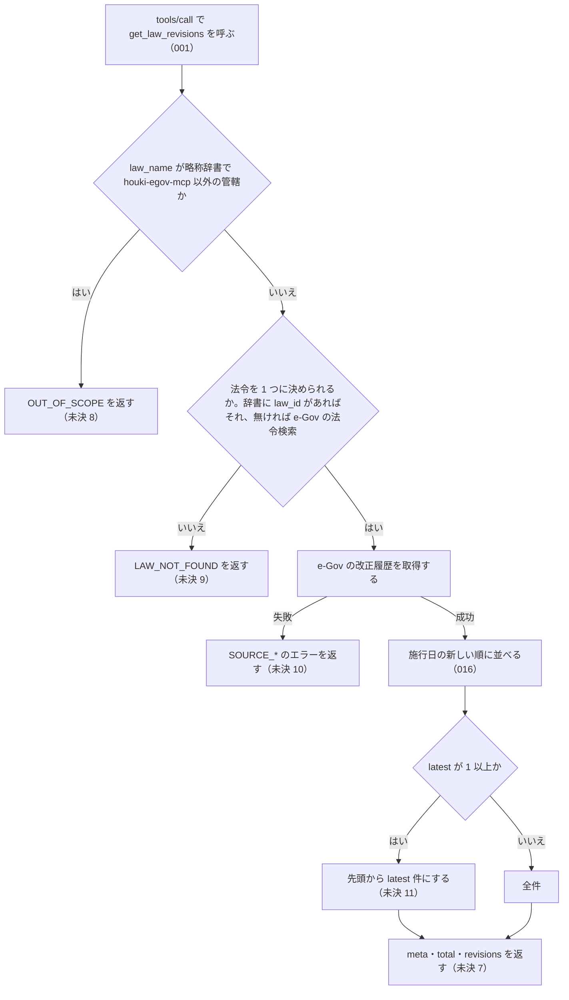

# get_law_revisions の仕様

<!-- GENERATED FILE — 手で編集しない。本文は houki-egov-mcp の specs/current/get_law_revisions/spec.md の写し。 -->

::: info
houki-egov-mcp **v0.20.0** の `specs/current/get_law_revisions/spec.md` から自動生成しました（仕様 ID 18 件・2026-10-10）。手で編集しないでください。再生成は `node scripts/generate-reference.mjs specs` です。
:::

法令の改正履歴を取得する

使いどころ・引数・実測の呼び出し例は、[ツールのページ](/reference/mcp/houki-egov/get_law_revisions)にあります。

最後に仕様が変わったのは v0.18.0 の「法令名・条・委任先を、確かなときだけ 1 つに決める（段階 5 法令の引き当て）」（2026-10-03 承認）です。それまでの経緯は[承認の履歴](#承認の履歴)にあります。

## 使う人と受け取るもの

この機能を誰が呼び、何を渡して何を受け取るかを示します。

- MCP クライアント（Claude などの LLM、または CLI から呼ぶ人）。`law_name` を渡して、その法令の改正の一覧（改正ごとの公布日・施行日・改正法令の番号と題名・その版の状態）を受け取る

## 入力

呼び出すときに渡す値です。

| 引数       | 必須 | 内容                                                   |
| ---------- | ---- | ------------------------------------------------------ |
| `law_name` | 必須 | 法令名または略称。例: `"消費税法"`、`"消法"`、`"民法"` |
| `latest`   | 任意 | 先頭から何件を返すか。1 以上の整数（[SPEC-EGOV-GET-LAW-REVISIONS-012](#spec-egov-get-law-revisions-012)）。省略すると全件 |

## できないこと

この機能が引き受けないことです。

- 改正前・改正後の条文の本文や、条ごとの新旧の差分を返すこと（時点の本文は `get_law` の `at`）
- 改正法令そのものの本文を返すこと（`amendment_law_id` を `get_law` に渡す）
- 施行日・公布日・状態で絞り込むこと（`latest` で先頭から件数を絞るだけ）
- ローカル DB から返すこと（呼び出しごとに e-Gov を引く）
- 1 回の呼び出しで複数の法令の改正履歴を返すこと

## 処理の流れ

呼び出しを受けてから応答を返すまでに、何をどの順で確かめるかを示します。図の中の番号は「できること」の仕様 ID の末尾 3 桁です。「未決 N」と書いた分岐は、「未決」の N 番の項目が指す仕様 ID でテストしています。

## 仕様 ID ごとの約束

この機能が守る約束を、仕様 ID ごとに並べています。見出しは約束を 1 文で表したもので、条件・応答の細部・例は「詳細」を開くと読めます。仕様 ID はそれぞれ受入テストと対応していて、テストの無い ID があると各リポジトリの CI が止まります。

### SPEC-EGOV-GET-LAW-REVISIONS-001 get_law_revisions という名前のツールとして呼べる

::: details 詳細
MCP サーバーは `get_law_revisions` という名前のツールを持ち、`tools/call` でこの名前を指定して呼べる。
:::

### SPEC-EGOV-GET-LAW-REVISIONS-002 meta・total・revisions の形で改正履歴を返し、値の無いフィールドは null にする

::: details 詳細
法令を 1 つに決められ、e-Gov の改正履歴を取れたときは、次のフィールドを持つ応答を返す。

| フィールド  | 内容                                                                                                                                                                                                                                              |
| ----------- | ------------------------------------------------------------------------------------------------------------------------------------------------------------------------------------------------------------------------------------------------- |
| `meta`      | `law_id`・`title`・`law_num`・`retrieved_at`（呼び出した日時。ISO 8601 の文字列）・`url`（`https://laws.e-gov.go.jp/law/<law_id>`）・`at`（このツールは `at` を受け取らないので常に `null`）                                                         |
| `total`     | e-Gov が返した改正の件数（`latest` で絞る前の件数）                                                                                                                                                                                                |
| `revisions` | 改正の配列。並びは [SPEC-EGOV-GET-LAW-REVISIONS-016](#spec-egov-get-law-revisions-016)。要素は `law_revision_id`・`amendment_promulgate_date`・`amendment_enforcement_date`・`amendment_enforcement_comment`・`amendment_law_num`・`amendment_law_title`・`amendment_law_id`・`current_revision_status` の 8 つ |

`revisions` の要素は、e-Gov の改正の要素にその値が無いとき（キーが無いとき、`null` のとき）も 8 つのキーをすべて持ち、値の無いキーは `null` にする。e-Gov の改正の要素にこの 8 つ以外のフィールドがあっても、`revisions` の要素には入れない。

例: 改正履歴が `REVS` のとき `{ law_name: "消法" }` を渡すと、`meta.law_id: "363AC0000000108"`、`meta.url: "https://laws.e-gov.go.jp/law/363AC0000000108"`、`meta.at: null`、`total: 3`、`revisions` は 3 件で、`revisions[0]` は `{ law_revision_id: "363AC0000000108_20291001_505AC0000000003", amendment_promulgate_date: "2023-03-31", amendment_enforcement_date: "2029-10-01", amendment_enforcement_comment: null, amendment_law_num: "令和五年法律第三号", amendment_law_title: "所得税法等の一部を改正する法律", amendment_law_id: "505AC0000000003", current_revision_status: "UnEnforced" }`。e-Gov の 1 件目に `extra_field: "x"` があっても `revisions[0]` に `extra_field` は無い。e-Gov の 1 件目に `amendment_enforcement_comment` のキーが無いときも、`revisions[0].amendment_enforcement_comment` は `null`（v0.16.0 ではキーが無かった）。
:::

### SPEC-EGOV-GET-LAW-REVISIONS-003 管轄外の名前は e-Gov を引かずに OUT_OF_SCOPE を返す

::: details 詳細
`law_name` が略称辞書で houki-egov-mcp 以外の管轄に当たるときは、e-Gov を一度も呼ばずにエラー `code: "OUT_OF_SCOPE"` を返す。`next_actions[0]` は `action: "delegate_to_mcp"`、`example: { mcp: <管轄の MCP> }`。

例: `{ law_name: "消基通" }` は e-Gov を呼ばず、`code: "OUT_OF_SCOPE"`、`error` に `消費税法基本通達` と `houki-nta` を含み、`next_actions[0]` は `{ action: "delegate_to_mcp", example: { mcp: "houki-nta" }, … }`、`detail.cause: "source_mcp_hint=houki-nta"`。
:::

### SPEC-EGOV-GET-LAW-REVISIONS-004 法令が見つからないときは LAW_NOT_FOUND を返す

::: details 詳細
`law_name` が略称辞書に無く、e-Gov の法令検索も 0 件のときは、改正履歴を引かずにエラー `code: "LAW_NOT_FOUND"` を返す。`next_actions` は 2 件で、1 件目は `action: "resolve_abbreviation"`（`example: { abbr: <law_name> }`）、2 件目は `action: "search_law"`（`example: { keyword: <law_name> }`）。

例: e-Gov の法令検索が 0 件を返すようにして `{ law_name: "存在しない法律" }` を渡すと、`code: "LAW_NOT_FOUND"`、`error: "法令が見つかりません: 存在しない法律"`、`next_actions[0].example: { abbr: "存在しない法律" }`、`next_actions[1].example: { keyword: "存在しない法律" }`。e-Gov へは法令検索の 1 回だけで、改正履歴は呼ばない。
:::

### SPEC-EGOV-GET-LAW-REVISIONS-005 e-Gov が 429 を返し続けたら SOURCE_RATE_LIMITED を返す

::: details 詳細
改正履歴の取得で e-Gov が 429 を返したときは、間隔を空けて最大 3 回まで取り直し、それでも 429 ならエラー `code: "SOURCE_RATE_LIMITED"`、`retryable: true` を返す。`next_actions[0].action` は `retry_later`、`detail` に `status: 429` と呼んだ `url` が入る。

例: 改正履歴が常に 429 を返すようにして `{ law_name: "消法" }` を渡すと、e-Gov を 4 回呼んだうえで `code: "SOURCE_RATE_LIMITED"`、`retryable: true`、`detail: { status: 429, url: "https://laws.e-gov.go.jp/api/2/law_revisions/363AC0000000108" }`。
:::

### SPEC-EGOV-GET-LAW-REVISIONS-006 e-Gov の応答を待ちきれなかったら SOURCE_TIMEOUT を返す

::: details 詳細
改正履歴の取得が打ち切られた（応答を待つ時間の上限を超えた）ときは、取り直さずにエラー `code: "SOURCE_TIMEOUT"`、`retryable: true` を返す。`next_actions` は `retry_later` と `visit_egov_site`（`example: { url: "https://laws.e-gov.go.jp/" }`）。

例: 改正履歴の要求が `name: "AbortError"` の例外で終わるようにして `{ law_name: "消法" }` を渡すと、e-Gov を 1 回だけ呼んで `code: "SOURCE_TIMEOUT"`、`retryable: true`、`detail.url: "https://laws.e-gov.go.jp/api/2/law_revisions/363AC0000000108"`。
:::

### SPEC-EGOV-GET-LAW-REVISIONS-007 e-Gov が 500 番台を返し続けたら retryable: true の SOURCE_API_ERROR を返す

::: details 詳細
改正履歴の取得で e-Gov が 500 番台を返したときは、間隔を空けて最大 3 回まで取り直し、それでも 500 番台ならエラー `code: "SOURCE_API_ERROR"`、`retryable: true` を返す。`next_actions` は `retry_later` と `visit_egov_site`、`detail` に `status` と `url` が入る。

例: 改正履歴が常に 503 を返すようにして `{ law_name: "消法" }` を渡すと、e-Gov を 4 回呼んだうえで `code: "SOURCE_API_ERROR"`、`retryable: true`、`detail.status: 503`、`error` に `503` を含む。
:::

### SPEC-EGOV-GET-LAW-REVISIONS-008 改正履歴の取得で e-Gov が 404・`404001` を返したときは `LAW_NOT_FOUND`、そのほかの 429 と 500 番台以外の HTTP エラーは retryable: false の SOURCE_API_ERROR を返す

::: details 詳細
改正履歴の取得で e-Gov が 404 を返し、応答本文の `code` が `404001`（`取得結果が０件です。`）のときは、取り直さずにエラー `LAW_NOT_FOUND`（`retryable: false`）を返す。`error` は `e-Gov に law_id <law_id> の法令がありません`、`hint` と `next_actions` は [SPEC-EGOV-COMMON-ERRORS-033](/specs/houki-egov/common_errors#spec-egov-common-errors-033) の `at` を渡さないときの文、`detail` は `status: 404`・`url`・`cause: "404001"`。

それ以外の 429 と 500 番台以外の HTTP エラー（400、`404001` 以外の 404 など）は、今までどおり取り直さずにエラー `code: "SOURCE_API_ERROR"`、`retryable: false` を返す。`next_actions` は付けず、`detail` に `status` と `url` が入る。

例: 2026-10-03 10:12 JST に e-Gov の `/law_revisions/999AC0000000999` は 404・`{"code":"404001","message":"取得結果が０件です。"}` を返した。改正履歴の取得がこの応答になる状態で `{ law_name: "消法" }` を渡すと、e-Gov を 1 回だけ呼んで `code: "LAW_NOT_FOUND"`、`retryable: false`、`detail.cause: "404001"`（v0.17.0 では `SOURCE_API_ERROR`）。400 は `SOURCE_API_ERROR`・`retryable: false`・`detail.status: 400` のまま。
:::

### SPEC-EGOV-GET-LAW-REVISIONS-009 latest が 1 以上なら、施行日の新しい順の先頭から latest 件を返し、total は絞る前の件数のまま

::: details 詳細
`latest` に 1 以上の整数を渡したときは、`revisions` を [SPEC-EGOV-GET-LAW-REVISIONS-016](#spec-egov-get-law-revisions-016) の順（施行日の新しい順。まだ施行されていない改正を含む）の先頭から `latest` 件にする。`total` は絞る前の件数のまま。`latest` が件数より大きければ全件を返す。

例: 改正履歴が `REVS`（施行日 2029-10-01・2026-04-01・2025-04-01 の 3 件）のとき、`{ law_name: "消法", latest: 1 }` は `total: 3`、`revisions` が 1 件で `revisions[0].law_revision_id: "363AC0000000108_20291001_505AC0000000003"`。`latest: 2` は 2 件、`latest: 10` は 3 件（どれも `total: 3`）。e-Gov が施行日の古い順に返したときも、`latest: 1` は施行日 2029-10-01 の改正を返す。
:::

### SPEC-EGOV-GET-LAW-REVISIONS-010 latest を省くと全件を返す

::: details 詳細
`latest` を渡さないときは、e-Gov が返した改正をすべて `revisions` に入れる。

例: 改正履歴が `REVS` のとき `{ law_name: "消法" }` は `total: 3`、`revisions` も 3 件。
:::

### SPEC-EGOV-GET-LAW-REVISIONS-011 略称辞書に law_id がある名前は e-Gov の法令検索を引かない

::: details 詳細
`law_name` が略称辞書で `law_id` を持つ名前に当たるときは、e-Gov の法令検索を引かずに、その `law_id` の改正履歴だけを取る。`meta.title` は辞書の正式名称、`meta.law_num` は辞書の法令番号になる。

例: `{ law_name: "消法" }` では e-Gov へは `https://laws.e-gov.go.jp/api/2/law_revisions/363AC0000000108` の 1 回だけを呼び、`/laws` は呼ばない。応答の `meta.title: "消費税法"`、`meta.law_num: "昭和六十三年法律第百八号"`。
:::

### SPEC-EGOV-GET-LAW-REVISIONS-012 `latest` は 1 以上の整数で、0・負の数・小数は `INVALID_ARGUMENT` にして改正履歴を取らない

::: details 詳細
tools/list の inputSchema の `latest` は `type: "integer"`、`minimum: 1` を持ち、`maximum` を持たない（[SPEC-EGOV-COMMON-ERRORS-023](/specs/houki-egov/common_errors#spec-egov-common-errors-023)）。0・負の数・小数・数値でない値を渡すと、inputSchema の検査で `INVALID_ARGUMENT`（`tool: "get_law_revisions"`、`detail.issues[0].path: "latest"`）を返し、e-Gov に問い合わせない。全件に読み替えたり切り捨てたりしない。件数より大きい値は今までどおり全件を返す（[SPEC-EGOV-GET-LAW-REVISIONS-009](#spec-egov-get-law-revisions-009)）。

例: `law_name: "消法", latest: 0` は `code: "INVALID_ARGUMENT"`、`detail.issues` は `[{ path: "latest", message: "1 以上で指定してください" }]` で、e-Gov への問い合わせは 0 回（v0.15.4 では全件を返していた）。`latest: -1` も同じ。`latest: 2.5` は `[{ path: "latest", message: "整数で指定してください" }]`。`latest: 10` は検査を通り、改正履歴が 3 件なら 3 件を返す。
:::

### SPEC-EGOV-GET-LAW-REVISIONS-013 law_name が空文字・空白だけのときは略称辞書と e-Gov に問い合わせずに `INVALID_ARGUMENT` を返す

::: details 詳細
空文字は inputSchema の `minLength: 1` の検査（[SPEC-EGOV-COMMON-ERRORS-025](/specs/houki-egov/common_errors#spec-egov-common-errors-025)）で止まり、`INVALID_ARGUMENT`（`tool: "get_law_revisions"`、`detail.issues: [{ path: "law_name", message: "空文字は指定できません" }]`）を返す。空白（半角スペース・全角スペース・タブ・改行）だけのときは、ツールの処理が略称辞書と e-Gov に問い合わせる前に、[SPEC-EGOV-COMMON-ERRORS-026](/specs/houki-egov/common_errors#spec-egov-common-errors-026) の形の `INVALID_ARGUMENT`（`tool: "get_law_revisions"`、`error: "law_name が空です"`、`detail.issues: [{ path: "law_name", message: "空白だけは指定できません" }]`、`hint` に法令名か略称を渡すよう書く）を返す。

例: `law_name: ""` は `code: "INVALID_ARGUMENT"`・`detail.issues[0].message: "空文字は指定できません"`。`law_name: "　"`（全角スペース）と `law_name: " \n"` は `code: "INVALID_ARGUMENT"`・`error: "law_name が空です"`。どれも略称辞書と e-Gov への問い合わせは 0 回。
:::

### SPEC-EGOV-GET-LAW-REVISIONS-014 法令名の検索が通信の失敗で終わったときは `LAW_NOT_FOUND` ではなく `SOURCE_*` を返す

::: details 詳細
`law_name` が略称辞書に law_id 付きで無く、e-Gov の法令名検索で law_id を決めるとき、その検索が通信の失敗（接続できない・時間切れ・5xx・429・429 以外の 4xx）で終わったときは、[SPEC-EGOV-COMMON-ERRORS-027](/specs/houki-egov/common_errors#spec-egov-common-errors-027) の表の code（`SOURCE_UNAVAILABLE` / `SOURCE_TIMEOUT` / `SOURCE_API_ERROR` / `SOURCE_RATE_LIMITED`）を、表の `retryable` と `detail` 付きで返す（[SPEC-EGOV-COMMON-ERRORS-029](/specs/houki-egov/common_errors#spec-egov-common-errors-029)）。`LAW_NOT_FOUND`（[SPEC-EGOV-GET-LAW-REVISIONS-004](#spec-egov-get-law-revisions-004)）は、検索が成功して 0 件だったときだけ返す。`SOURCE_*` のときの `next_actions` に `resolve_abbreviation` / `search_law` は入れない。

例: 法令名の検索が 503 を返す状態で `{ law_name: "架空の法律" }` を渡すと、`code: "SOURCE_API_ERROR"`、`retryable: true`、`detail.status: 503`（v0.15.4 では `LAW_NOT_FOUND` だった）。検索が時間切れなら `SOURCE_TIMEOUT`、接続できなければ `SOURCE_UNAVAILABLE`（`detail.cause: "ENOTFOUND"` など）、400 なら `SOURCE_API_ERROR`・`retryable: false`。検索が 0 件で成功したときは `LAW_NOT_FOUND` のまま。
:::

### SPEC-EGOV-GET-LAW-REVISIONS-015 `law_name` の全角英数字・ダッシュ類・全角空白は半角に揃えてから略称辞書と照合する

::: details 詳細
`law_name` を略称辞書で引くときは、houki-abbreviations の `resolveAbbreviation(name, { normalize: true })` の規則（全角英数字を半角に、ダッシュ類 `－` `‐` `‑` `–` `—` `―` `−` を `-` に、全角チルダを `~` に、全角空白を半角空白にし、前後の空白を除く。大文字と小文字は区別する）で揃えてから照合する。管轄の判定（`OUT_OF_SCOPE`）も同じ規則で引く。辞書に無いときに e-Gov の法令名検索へ渡す値は、前後の空白を除いた渡した値のままで、揃えない。

例: `{ law_name: "ＰＬ法" }` は `製造物責任法の改正履歴を返す`（v0.15.4 では辞書に無い扱いで、e-Gov の法令名検索に `ＰＬ法` を渡して `LAW_NOT_FOUND` だった）。`law_name: "労基法　"`（末尾が全角空白）も `労働基準法` として引く。
:::

### SPEC-EGOV-GET-LAW-REVISIONS-016 `revisions` は施行日の新しい順に並べ、まだ施行されていない改正も含める

::: details 詳細
`revisions` は、`amendment_enforcement_date`（施行日）の新しい順に並べる。まだ施行されていない改正（`current_revision_status: "UnEnforced"`）も除かず、施行日の順のとおり先頭の側に置く。施行日が同じ改正どうしは、e-Gov が返した順のまま並べる。`amendment_enforcement_date` が `null` の改正は、施行日が決まっていない改正として先頭に置く（`null` が複数あれば e-Gov が返した順）。

並べ替えはツールが行い、e-Gov が返す順には頼らない。2026-10-03 JST に `消法` で確かめた e-Gov の順は、すでに施行日の新しい順だった（下の例）ので、v0.16.0 と比べて並びは変わらない。

`latest`（[SPEC-EGOV-GET-LAW-REVISIONS-009](#spec-egov-get-law-revisions-009)）の「最新」はこの順の先頭である。いま効力のある版だけを知りたいときは、`current_revision_status` が `CurrentEnforced` の要素を見る（[SPEC-EGOV-GET-LAW-REVISIONS-017](#spec-egov-get-law-revisions-017)）。施行済みだけに絞る引数は無い。

例: 2026-10-03 JST に `{ law_name: "消法" }` を呼ぶと、`total: 65`、`revisions[0]` は施行日 `2030-06-19`・`UnEnforced` の改正（令和七年法律第七十四号）、`revisions[0]`〜`revisions[7]` の 8 件が `UnEnforced`、`revisions[8]` が施行日 `2026-10-01`・`CurrentEnforced` の改正（令和七年法律第七十号）で、それより後はすべて `PreviousEnforced`。`latest: 3` では施行日 `2030-06-19`・`2028-04-01`・`2027-10-01` の 3 件（どれも `UnEnforced`）を返す。施行日が `2026-10-01` の改正は 3 件あり、e-Gov が返した順（`CurrentEnforced` が先）のまま並ぶ。
:::

### SPEC-EGOV-GET-LAW-REVISIONS-017 `current_revision_status` は e-Gov の値をそのまま返す

::: details 詳細
`revisions[].current_revision_status` には、e-Gov の改正履歴の値を変えずに入れる。日本語に置き換えたり、日本語の説明のフィールドを足したりはしない。2026-10-03 JST に `消法` で確かめた値は次の 3 つである。

| 値                 | 意味                                   |
| ------------------ | -------------------------------------- |
| `CurrentEnforced`  | 呼び出した時点で効力のある版           |
| `PreviousEnforced` | 施行済みで、後の改正で置き換わった版   |
| `UnEnforced`       | まだ施行されていない改正による版       |

e-Gov がこれ以外の値を返したときも、そのまま入れる。tools/list の `description` は、この 3 つの値を書く（差分 `20261003-t5-docs-mismatch` の「実装 PR で直す文書」）。

例: 2026-10-03 JST の `{ law_name: "消法", latest: 9 }` の `revisions[0].current_revision_status` は `"UnEnforced"`、`revisions[8].current_revision_status` は `"CurrentEnforced"`。
:::

### SPEC-EGOV-GET-LAW-REVISIONS-018 法令名が完全一致しないときは、改正履歴を返さず候補を付けた `LAW_NOT_FOUND` を返す

::: details 詳細
`law_name` の法令は [SPEC-EGOV-COMMON-ERRORS-032](/specs/houki-egov/common_errors#spec-egov-common-errors-032) の規則で決める（このツールは `at` を受け取らないので、法令名の検索に `asof` を付けない）。略称辞書に law_id が無く、e-Gov の法令名検索の全件の中に題名の完全一致が無いときは、検索結果の先頭の法令の改正履歴を返さず、032 の形の `LAW_NOT_FOUND`（`retryable: false`）を返す。`next_actions` の候補の要素は `action: "get_law_revisions"`、`example` は渡した引数（`latest` を渡したときはそれも）の `law_name` だけを候補の題名に替えたもの。

例: `{ law_name: "所得税法施行", latest: 2 }` は `code: "LAW_NOT_FOUND"`、`next_actions` の先頭は `{ action: "get_law_revisions", example: { law_name: "所得税法施行令", latest: 2 } }`。
:::

## まだ決めていないこと

仕様を書き起こしたときに見つかった項目のうち、扱いを決めている途中のものです。開くと、元の仕様書の記述をそのまま読めます。

::: details 仕様書の「未決」の節
初版起こしで見つけた、意図か不具合かを人が決める項目です。決まったら「できること」に ID を振るか、`specs/changes/` の差分にします。

意図か不具合かの判断が要る項目は houki-egov-mcp の Issue に移し、ここには題と Issue の番号だけを残します。今の振る舞いのままでよくテストが無いだけの項目は、受入テストを書いてから「できること」に ID を振ります。

7. **応答の形。** → [SPEC-EGOV-GET-LAW-REVISIONS-002](#spec-egov-get-law-revisions-002)
8. **管轄外の名前は `OUT_OF_SCOPE`。** → [SPEC-EGOV-GET-LAW-REVISIONS-003](#spec-egov-get-law-revisions-003)
9. **法令が見つからないときは `LAW_NOT_FOUND`。** → [SPEC-EGOV-GET-LAW-REVISIONS-004](#spec-egov-get-law-revisions-004)
10. **改正履歴の取得に失敗したときのエラー。** → [SPEC-EGOV-GET-LAW-REVISIONS-005](#spec-egov-get-law-revisions-005)・[SPEC-EGOV-GET-LAW-REVISIONS-006](#spec-egov-get-law-revisions-006)・[SPEC-EGOV-GET-LAW-REVISIONS-007](#spec-egov-get-law-revisions-007)・[SPEC-EGOV-GET-LAW-REVISIONS-008](#spec-egov-get-law-revisions-008)（一部は約束にしていない。差分 `20260928-untested-behaviors` の proposal.md を参照）
11. **`latest` で件数を絞る。** → [SPEC-EGOV-GET-LAW-REVISIONS-009](#spec-egov-get-law-revisions-009)・[SPEC-EGOV-GET-LAW-REVISIONS-010](#spec-egov-get-law-revisions-010)
12. **略称辞書に `law_id` がある名前は e-Gov の法令検索を引かない。** → [SPEC-EGOV-GET-LAW-REVISIONS-011](#spec-egov-get-law-revisions-011)
:::

## 承認の履歴

この機能の仕様が、いつ、どの変更で承認されたかを新しい順に並べています。各リポジトリの `npx spec-ids history get_law_revisions` と同じ内容です。変更の名前から、変更の理由と前後の振る舞いを書いた文書（GitHub）を開けます。

::: details 承認の履歴（8 件）
| 承認日 | 版 | 変更 | 仕様 PR |
|---|---|---|---|
| 2026-10-03 | v0.18.0 | [法令名・条・委任先を、確かなときだけ 1 つに決める（段階 5 法令の引き当て）](https://github.com/shuji-bonji/houki-egov-mcp/blob/v0.20.0/specs/releases/v0.18.0/20261003-law-resolution/proposal.md) | [#95](https://github.com/shuji-bonji/houki-egov-mcp/pull/95) |
| 2026-10-03 | v0.17.0 | [値の無いフィールドを null にし、meta の時点を常に返す（T4 応答の形）](https://github.com/shuji-bonji/houki-egov-mcp/blob/v0.20.0/specs/releases/v0.17.0/20261003-t4-response-shape/proposal.md) | [#91](https://github.com/shuji-bonji/houki-egov-mcp/pull/91) |
| 2026-10-01 | v0.16.0 | [全角・半角・ダッシュ類の揃え方を houki-abbreviations 0.7.0 に一本化する（T3）](https://github.com/shuji-bonji/houki-egov-mcp/blob/v0.20.0/specs/releases/v0.16.0/20261001-t3-normalize/proposal.md) | [#86](https://github.com/shuji-bonji/houki-egov-mcp/pull/86) |
| 2026-10-01 | v0.16.0 | [「見つからない」と「取得元の失敗」の code を分ける（T2）](https://github.com/shuji-bonji/houki-egov-mcp/blob/v0.20.0/specs/releases/v0.16.0/20261001-t2-error-codes/proposal.md) | [#85](https://github.com/shuji-bonji/houki-egov-mcp/pull/85) |
| 2026-10-01 | v0.16.0 | [引数の検査を inputSchema に書き、丸めずに `INVALID_ARGUMENT` にする（T1）](https://github.com/shuji-bonji/houki-egov-mcp/blob/v0.20.0/specs/releases/v0.16.0/20261001-t1-argument-guards/proposal.md) | [#84](https://github.com/shuji-bonji/houki-egov-mcp/pull/84) |
| 2026-09-28 | v0.15.2 | [テストが無いだけの振る舞いに仕様 ID を振る](https://github.com/shuji-bonji/houki-egov-mcp/blob/v0.20.0/specs/releases/v0.15.2/20260928-untested-behaviors/proposal.md) | [#76](https://github.com/shuji-bonji/houki-egov-mcp/pull/76) |
| 2026-09-28 | v0.15.2 | [「未決」のうち判断が要る 85 件を Issue に移す](https://github.com/shuji-bonji/houki-egov-mcp/blob/v0.20.0/specs/releases/v0.15.2/20260928-undecided-to-issues/proposal.md) | [#68](https://github.com/shuji-bonji/houki-egov-mcp/pull/68) |
| 2026-09-28 | — | 初版 | [#50](https://github.com/shuji-bonji/houki-egov-mcp/pull/50) |
:::

## 関連ページ

このページの元になった文書と、あわせて読むページです。

- [houki-egov-mcp の仕様の一覧](/specs/houki-egov/)
- [houki-egov-mcp の解説](/mcp/houki-egov)
- [get_law_revisions のツールのページ（リファレンス）](/reference/mcp/houki-egov/get_law_revisions)
- [元の仕様書（GitHub、v0.20.0）](https://github.com/shuji-bonji/houki-egov-mcp/blob/v0.20.0/specs/current/get_law_revisions/spec.md)
