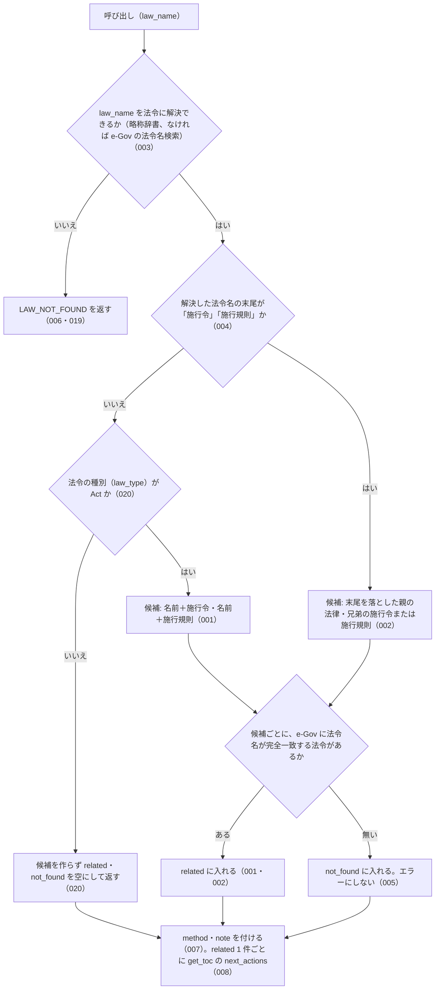

# get_related_laws の仕様

<!-- GENERATED FILE — 手で編集しない。本文は houki-egov-mcp の specs/current/get_related_laws/spec.md の写し。 -->

::: info
houki-egov-mcp **v0.20.0** の `specs/current/get_related_laws/spec.md` から自動生成しました（仕様 ID 20 件・2026-10-10）。手で編集しないでください。再生成は `node scripts/generate-reference.mjs specs` です。
:::

法令名の規則で施行令・施行規則、または親の法律を引く

使いどころ・引数・実測の呼び出し例は、[ツールのページ](/reference/mcp/houki-egov/get_related_laws)にあります。

最後に仕様が変わったのは v0.18.0 の「法令名・条・委任先を、確かなときだけ 1 つに決める（段階 5 法令の引き当て）」（2026-10-03 承認）です。それまでの経緯は[承認の履歴](#承認の履歴)にあります。

## 利用者と得られる結果

この機能の利用者と、利用者が渡すもの・得られる結果を示します。

- MCP クライアント（Claude などの LLM、または CLI から呼ぶ人）。`law_name` を渡して、その法令の施行令・施行規則（施行令・施行規則を渡したときは親の法律と兄弟）のうち e-Gov に実在するものを `law_id` 付きで受け取る

## 入力

呼び出すときに渡す値です。

| 引数       | 必須 | 内容                                                                       |
| ---------- | ---- | -------------------------------------------------------------------------- |
| `law_name` | 必須 | 法令名または略称。例: `"所得税法"`、`"所法"`、`"所得税法施行令"`、`"所令"` |

## 扱わないこと

この機能が意図して扱わないことです。

- 名前の末尾に「施行令」「施行規則」を付ける・落とす以外の規則で下位法令を探すこと（「…の施行に関する省令」「…施行細則」、複数の省令、告示は返さない）
- 関連法令の条文や、どの条がどの条に委任しているかを返すこと（条単位の委任は `get_article_references`、目次は `get_toc`）
- 時点を指定して関連法令を引くこと（引数に時点が無い）
- 通達など houki-egov-mcp の管轄外の資料を関連として返すこと
- 関連法令が網羅されていると保証すること

## 処理の流れ

呼び出しを受けてから応答を返すまでに、何をどの順で確かめるかを示します。図の中の番号は「できること」の仕様 ID の末尾 3 桁です。

## 仕様項目

この機能の仕様項目を、仕様 ID ごとに並べています。見出しは仕様項目を 1 文で表したもので、条件・応答の細部・例は「詳細」を開くと読めます。仕様 ID はそれぞれ受入テストと対応していて、テストの無い ID があると各リポジトリの CI が止まります。

### SPEC-EGOV-GET-RELATED-LAWS-001 法律からは、実在する施行令と施行規則を law_id 付きで返す

::: details 詳細
`law_name` が法律（名前の末尾が「施行令」「施行規則」でない法令）に解決されたときは、名前の末尾に「施行令」を付けた名前と「施行規則」を付けた名前の 2 つを候補にし、この順で e-Gov に問い合わせる。e-Gov の法令名が候補名と完全一致した法令だけを `related` に入れる。

応答は次のフィールドを持つ。

| フィールド  | 内容                                                                                                                                                                                   |
| ----------- | -------------------------------------------------------------------------------------------------------------------------------------------------------------------------------------- |
| `law`       | 解決した法令。`law_id`・`title`（正式名称）・`law_num`（法令番号）                                                                                                                     |
| `related`   | 実在した関連法令の配列。要素は `relation`（施行令は `enforcement_order`、施行規則は `enforcement_rule`、親の法律は `parent_act`）・`law_id`・`title`・`abbr`（略称辞書にあるときだけ） |
| `not_found` | 候補にしたが e-Gov に無かった名前の配列（[SPEC-EGOV-GET-RELATED-LAWS-005](#spec-egov-get-related-laws-005)）                                                                                                              |

例: `law_name: "所得税法"` では、`law` は `{ law_id: "340AC0000000033", title: "所得税法", law_num: "昭和四十年法律第三十三号" }`、`related` は `enforcement_order` の所得税法施行令（`340CO0000000096`、`abbr: "所令"`）と `enforcement_rule` の所得税法施行規則（`340M50000040011`、`abbr: "所規"`）の 2 件で、`not_found` は空の配列。
:::

### SPEC-EGOV-GET-RELATED-LAWS-002 施行令・施行規則からは、親の法律と兄弟を返す

::: details 詳細
`law_name` が施行令または施行規則に解決されたときは、名前の末尾の「施行令」「施行規則」を落とした親の法律（`parent_act`）を 1 つめの候補にし、施行令なら兄弟の施行規則（`enforcement_rule`）、施行規則なら兄弟の施行令（`enforcement_order`）を 2 つめの候補にする。候補の確かめ方と応答の形は [SPEC-EGOV-GET-RELATED-LAWS-001](#spec-egov-get-related-laws-001) と同じく、e-Gov の法令名と完全一致したものだけを `related` に入れる。

例: `law_name: "所令"`（所得税法施行令）では、`related` は `parent_act` の所得税法と `enforcement_rule` の所得税法施行規則の 2 件。所得税法施行規則からの候補は、所得税法（`parent_act`）と所得税法施行令（`enforcement_order`）。
:::

### SPEC-EGOV-GET-RELATED-LAWS-003 略称で指定できる

::: details 詳細
`law_name` には略称を渡してよい。略称辞書に載っている略称は正式名称の法令として扱う。

例: `law_name: "所令"` は所得税法施行令として扱い、[SPEC-EGOV-GET-RELATED-LAWS-002](#spec-egov-get-related-laws-002) の応答を返す。
:::

### SPEC-EGOV-GET-RELATED-LAWS-004 施行令・施行規則として扱うのは、名前の末尾が「施行令」「施行規則」のものだけ

::: details 詳細
解決した法令名の末尾が「施行令」または「施行規則」で、その前に名前があるときだけ、施行令・施行規則として扱い、末尾を落とした名前を親の法律とする。名前の途中に「施行令」を含んでいても末尾でなければ、施行令・施行規則としては扱わない。そのとき、法令の種別が法律（`law_type` が `Act`）なら [SPEC-EGOV-GET-RELATED-LAWS-001](#spec-egov-get-related-laws-001)、法律でなければ [SPEC-EGOV-GET-RELATED-LAWS-020](#spec-egov-get-related-laws-020) になる。

例: `租税条約等の実施に伴う所得税法、法人税法及び地方税法の特例等に関する法律施行令` の親は `租税条約等の実施に伴う所得税法、法人税法及び地方税法の特例等に関する法律`。`施行令` だけの名前は親を持たない。`国税関係法令に係る情報通信技術を活用した行政の推進等に関する省令`（`415M60000040071`、`law_type: "MinisterialOrdinance"`）は末尾が「施行令」「施行規則」でなく、法律でもないので、[SPEC-EGOV-GET-RELATED-LAWS-020](#spec-egov-get-related-laws-020) の応答になる（v0.17.0 では法律と同じ扱いで、`…省令施行令`・`…省令施行規則` を `not_found` に入れていた）。
:::

### SPEC-EGOV-GET-RELATED-LAWS-005 e-Gov に無い候補は not_found に入れ、エラーにしない

::: details 詳細
候補名と法令名が完全一致する法令が e-Gov に無いときは、その候補を `related` に入れず、`not_found` に `relation` と `title`（候補名）を入れる。候補が 1 つも実在しなくてもエラーにせず、`related` が空の配列の応答を返す。

例: `law_name: "民法"` では、`related` は空の配列、`not_found` は `[{ relation: "enforcement_order", title: "民法施行令" }, { relation: "enforcement_rule", title: "民法施行規則" }]`。
:::

### SPEC-EGOV-GET-RELATED-LAWS-006 法令に解決できない名前はエラー `LAW_NOT_FOUND`

::: details 詳細
`law_name` が略称辞書にも e-Gov の法令名検索にも当たらないときは、エラー `LAW_NOT_FOUND` を返す。候補を作らず、関連法令を問い合わせない。

例: `law_name: "存在しない法"` は `code: "LAW_NOT_FOUND"`。
:::

### SPEC-EGOV-GET-RELATED-LAWS-007 応答に method と note を常に付ける

::: details 詳細
成功の応答には、`method: "law_name_rule"` と `note` を常に付ける。`note` は、法令名の末尾に「施行令」「施行規則」を付けた（または落とした）名前で e-Gov に実在するものだけを返していること、「…の施行に関する省令」など別の名前の下位法令・複数の省令・告示は対象外であること、網羅性は保証しないこと（「網羅性は保証しません」）を書く。
:::

### SPEC-EGOV-GET-RELATED-LAWS-008 related 1 件ごとに get_toc を next_actions で案内する

::: details 詳細
成功の応答の `next_actions` には、`related` の要素 1 件につき `action: "get_toc"` を 1 件、`related` と同じ順で入れる。

例: `law_name: "所得税法"` では、`next_actions` の `action` は `["get_toc", "get_toc"]`。
:::

### SPEC-EGOV-GET-RELATED-LAWS-009 related の要素に law_num・law_type・url を付ける

::: details 詳細
`related` の要素には、[SPEC-EGOV-GET-RELATED-LAWS-001](#spec-egov-get-related-laws-001) の `relation`・`law_id`・`title`・`abbr` に加えて、e-Gov の法令番号 `law_num`、法令の種類 `law_type`（e-Gov の値のまま。例: `CabinetOrder`・`MinisterialOrdinance`・`Act`）、e-Gov 法令の公開ページの URL `url`（`https://laws.e-gov.go.jp/law/<law_id>`）を付ける。

例: `law_name: "所得税法"` の `related[0]` は `{ relation: "enforcement_order", law_id: "340CO0000000096", title: "所得税法施行令", law_num: "昭和四十年政令第九十六号", law_type: "CabinetOrder", abbr: "所令", url: "https://laws.e-gov.go.jp/law/340CO0000000096" }`。`related[1]` は `law_type: "MinisterialOrdinance"`、`url: "https://laws.e-gov.go.jp/law/340M50000040011"`。
:::

### SPEC-EGOV-GET-RELATED-LAWS-010 成功の応答の meta に、応答を作った日時と `at: null` を入れる

::: details 詳細
成功の応答には `meta: { retrieved_at, at }` を付ける。`retrieved_at` は応答を作った日時の ISO 8601 形式の文字列（UTC、例: `2026-09-27T20:31:35.697Z`）。このツールは `at` を受け取らないので、`at` は常に `null` である（`meta` を持つツールで `meta` のキーを揃えるため）。

例: `law_name: "所得税法"` の応答の `meta` は `{ retrieved_at: <ISO 8601>, at: null }` で、`retrieved_at` の値は `new Date(retrieved_at).toISOString()` と同じ文字列になる。`related` が空の応答（`law_name: "民法"`）にも同じ形で付く（v0.16.0 の `meta` は `retrieved_at` だけだった）。
:::

### SPEC-EGOV-GET-RELATED-LAWS-011 法令番号が分からないときは law.law_num を付けない

::: details 詳細
`law_name` を解決した法令の法令番号が分からないとき（e-Gov の法令名検索で解決し、その法令の法令番号が空の文字列のとき）は、`law` に `law_num` のキーを付けず、`law_id` と `title` だけを返す。

例: e-Gov の法令名検索が `{ law_id: "999AC0000000001", law_title: "番号無し法", law_num: "" }` を返すとき、`law_name: "番号無し法"` の `law` は `{ law_id: "999AC0000000001", title: "番号無し法" }`（`law_num` のキーが無い）。
:::

### SPEC-EGOV-GET-RELATED-LAWS-012 next_actions の get_toc に、related の法令名と関係に応じた reason を付ける

::: details 詳細
[SPEC-EGOV-GET-RELATED-LAWS-008](#spec-egov-get-related-laws-008) の `get_toc` の各要素は、`example: { law_name: <related の title> }` と、`relation` に応じた次の `reason` を持つ。

| `relation`          | `reason`                                         |
| ------------------- | ------------------------------------------------ |
| `parent_act`        | `親の法律の目次を見て、委任している条を探せます` |
| `enforcement_order` | `施行令の目次を見て、委任先の条を探せます`       |
| `enforcement_rule`  | `施行規則の目次を見て、委任先の条を探せます`     |

例: `law_name: "所得税法"` の `next_actions` は `[{ action: "get_toc", reason: "施行令の目次を見て、委任先の条を探せます", example: { law_name: "所得税法施行令" } }, { action: "get_toc", reason: "施行規則の目次を見て、委任先の条を探せます", example: { law_name: "所得税法施行規則" } }]`。`law_name: "所令"` の `next_actions[0]` は `{ action: "get_toc", reason: "親の法律の目次を見て、委任している条を探せます", example: { law_name: "所得税法" } }`。
:::

### SPEC-EGOV-GET-RELATED-LAWS-013 houki-egov-mcp の管轄外の略称はエラー `OUT_OF_SCOPE` で、管轄の MCP を案内する

::: details 詳細
`law_name` が略称辞書で houki-egov-mcp 以外の管轄（`source_mcp_hint` が `houki-egov` でない）の名前のときは、e-Gov に問い合わせずにエラー `OUT_OF_SCOPE` を返す。`hint` は `<管轄>-mcp の対応 tool に切り替えてください`、`next_actions` は `action: "delegate_to_mcp"`、`example: { mcp: <管轄> }` の 1 件。

例: `law_name: "消基通"` は `{ code: "OUT_OF_SCOPE", error: "「消費税法基本通達」は houki-nta の管轄です（houki-egov-mcp は法律・政令・省令の本文のみを扱います）", hint: "houki-nta-mcp の対応 tool に切り替えてください", next_actions: [{ action: "delegate_to_mcp", example: { mcp: "houki-nta" }, … }] }`。e-Gov への問い合わせは 0 回。
:::

### SPEC-EGOV-GET-RELATED-LAWS-014 候補の問い合わせで e-Gov からの取得に失敗したら、SOURCE_* のエラーを返し候補ごとの結果は返さない

::: details 詳細
`law_name` を法令に解決した後、候補を e-Gov に問い合わせている途中で取得に失敗したときは、次のエラーを返す。応答はエラーだけで、`related`・`not_found`・`law` は返さない。

| 失敗                                   | `code`                | `retryable` |
| -------------------------------------- | --------------------- | ----------- |
| タイムアウト                           | `SOURCE_TIMEOUT`      | `true`      |
| HTTP 429                               | `SOURCE_RATE_LIMITED` | `true`      |
| HTTP 5xx                               | `SOURCE_API_ERROR`    | `true`      |
| 5xx 以外の HTTP エラー（例: 400）      | `SOURCE_API_ERROR`    | `false`     |

例: 略称辞書で解決する `law_name: "所得税法"` で、候補 `所得税法施行令` の問い合わせが HTTP 429 を返すと `{ code: "SOURCE_RATE_LIMITED", retryable: true, … }`。タイムアウトなら `code: "SOURCE_TIMEOUT"`、HTTP 503 なら `code: "SOURCE_API_ERROR"`、HTTP 400 なら `code: "SOURCE_API_ERROR"` で `retryable: false`。
:::

### SPEC-EGOV-GET-RELATED-LAWS-015 LAW_NOT_FOUND に hint と、resolve_abbreviation・search_law の next_actions を付ける

::: details 詳細
[SPEC-EGOV-GET-RELATED-LAWS-006](#spec-egov-get-related-laws-006) の `LAW_NOT_FOUND` は、`hint: "略称辞書 / e-Gov 法令検索で該当なし。表記を確認してください"` と、次の 2 件の `next_actions` をこの順で持つ。

1. `action: "resolve_abbreviation"`、`example: { abbr: <渡した law_name> }`
2. `action: "search_law"`、`example: { keyword: <渡した law_name> }`

例: `law_name: "存在しない法"` は `{ code: "LAW_NOT_FOUND", error: "法令が見つかりません: 存在しない法", hint: "略称辞書 / e-Gov 法令検索で該当なし。表記を確認してください", next_actions: [{ action: "resolve_abbreviation", example: { abbr: "存在しない法" }, … }, { action: "search_law", example: { keyword: "存在しない法" }, … }] }`。
:::

### SPEC-EGOV-GET-RELATED-LAWS-016 law_name が空文字・空白だけのときは略称辞書と e-Gov に問い合わせずに `INVALID_ARGUMENT` を返す

::: details 詳細
空文字は inputSchema の `minLength: 1` の検査（[SPEC-EGOV-COMMON-ERRORS-025](/specs/houki-egov/common_errors#spec-egov-common-errors-025)）で止まり、`INVALID_ARGUMENT`（`tool: "get_related_laws"`、`detail.issues: [{ path: "law_name", message: "空文字は指定できません" }]`）を返す。空白（半角スペース・全角スペース・タブ・改行）だけのときは、ツールの処理が略称辞書と e-Gov に問い合わせる前に、[SPEC-EGOV-COMMON-ERRORS-026](/specs/houki-egov/common_errors#spec-egov-common-errors-026) の形の `INVALID_ARGUMENT`（`tool: "get_related_laws"`、`error: "law_name が空です"`、`detail.issues: [{ path: "law_name", message: "空白だけは指定できません" }]`、`hint` に法令名か略称を渡すよう書く）を返す。

例: `law_name: ""` は `code: "INVALID_ARGUMENT"`・`detail.issues[0].message: "空文字は指定できません"`。`law_name: "　"`（全角スペース）と `law_name: " \n"` は `code: "INVALID_ARGUMENT"`・`error: "law_name が空です"`。どれも略称辞書と e-Gov への問い合わせは 0 回。
:::

### SPEC-EGOV-GET-RELATED-LAWS-017 法令名の検索が通信の失敗で終わったときは `LAW_NOT_FOUND` ではなく `SOURCE_*` を返す

::: details 詳細
`law_name` が略称辞書に law_id 付きで無く、e-Gov の法令名検索で law_id を決めるとき、その検索が通信の失敗（接続できない・時間切れ・5xx・429・429 以外の 4xx）で終わったときは、[SPEC-EGOV-COMMON-ERRORS-027](/specs/houki-egov/common_errors#spec-egov-common-errors-027) の表の code（`SOURCE_UNAVAILABLE` / `SOURCE_TIMEOUT` / `SOURCE_API_ERROR` / `SOURCE_RATE_LIMITED`）を、表の `retryable` と `detail` 付きで返す（[SPEC-EGOV-COMMON-ERRORS-029](/specs/houki-egov/common_errors#spec-egov-common-errors-029)）。`LAW_NOT_FOUND`（[SPEC-EGOV-GET-RELATED-LAWS-006](#spec-egov-get-related-laws-006)）は、検索が成功して 0 件だったときだけ返す。`SOURCE_*` のときの `next_actions` に `resolve_abbreviation` / `search_law` は入れない。

例: 法令名の検索が 503 を返す状態で `{ law_name: "架空の法律" }` を渡すと、`code: "SOURCE_API_ERROR"`、`retryable: true`、`detail.status: 503`（v0.15.4 では `LAW_NOT_FOUND` だった）。検索が時間切れなら `SOURCE_TIMEOUT`、接続できなければ `SOURCE_UNAVAILABLE`（`detail.cause: "ENOTFOUND"` など）、400 なら `SOURCE_API_ERROR`・`retryable: false`。検索が 0 件で成功したときは `LAW_NOT_FOUND` のまま。
:::

### SPEC-EGOV-GET-RELATED-LAWS-018 `law_name` の全角英数字・ダッシュ類・全角空白は半角に揃えてから略称辞書と照合する

::: details 詳細
`law_name` を略称辞書で引くときは、houki-abbreviations の `resolveAbbreviation(name, { normalize: true })` の規則（全角英数字を半角に、ダッシュ類 `－` `‐` `‑` `–` `—` `―` `−` を `-` に、全角チルダを `~` に、全角空白を半角空白にし、前後の空白を除く。大文字と小文字は区別する）で揃えてから照合する。管轄の判定（`OUT_OF_SCOPE`）も同じ規則で引く。辞書に無いときに e-Gov の法令名検索へ渡す値は、前後の空白を除いた渡した値のままで、揃えない。

例: `{ law_name: "ＰＬ法" }` は `製造物責任法を起点に候補を返す`（v0.15.4 では辞書に無い扱いで、e-Gov の法令名検索に `ＰＬ法` を渡して `LAW_NOT_FOUND` だった）。`law_name: "労基法　"`（末尾が全角空白）も `労働基準法` として引く。
:::

### SPEC-EGOV-GET-RELATED-LAWS-019 法令名が完全一致しないときは、関連法令を引かず候補を付けた `LAW_NOT_FOUND` を返す

::: details 詳細
`law_name` の法令は [SPEC-EGOV-COMMON-ERRORS-032](/specs/houki-egov/common_errors#spec-egov-common-errors-032) の規則で決める（このツールは `at` を受け取らない）。略称辞書に law_id が無く、e-Gov の法令名検索の全件の中に題名の完全一致が無いときは、検索結果の先頭の法令を起点にせず、候補名も作らずに、032 の形の `LAW_NOT_FOUND`（`retryable: false`）を返す。`next_actions` の候補の要素は `{ action: "get_related_laws", example: { law_name: <候補の題名> } }`。

例: `{ law_name: "所得税法施行" }` は `code: "LAW_NOT_FOUND"`、`next_actions` は `[{ action: "get_related_laws", example: { law_name: "所得税法施行令" } }, { action: "get_related_laws", example: { law_name: "所得税法施行規則" } }, { action: "search_law", example: { keyword: "所得税法施行" } }]`。v0.17.0 では同じ引数に、所得税法施行令を起点にした `related`（所得税法・所得税法施行規則）を返していた（2026-10-03 10:10 JST に houki-egov-dev 0.17.0 で確かめた）。
:::

### SPEC-EGOV-GET-RELATED-LAWS-020 法律でもなく、名前の末尾が「施行令」「施行規則」でもない法令からは候補を作らない

::: details 詳細
解決した法令の種別（略称辞書の `law_type`、または e-Gov の検索結果の `law_info.law_type`）が `Act` でなく、名前の末尾が「施行令」「施行規則」でもないとき（例: 末尾が「省令」「政令」「規則」の法令、`Constitution`）は、名前に「施行令」「施行規則」を付けた候補を作らず、e-Gov に関連法令を問い合わせない。エラーにはせず、`related: []`、`not_found: []`、`next_actions: []` の応答を返す。`note` の末尾に `<法令名> は法律でも施行令・施行規則でもないため、名前の規則で関連法令を作っていません` を足す。`law`・`method`・`meta` は [SPEC-EGOV-GET-RELATED-LAWS-001](#spec-egov-get-related-laws-001)・007・010 のとおり。

例: `{ law_name: "国税関係法令に係る情報通信技術を活用した行政の推進等に関する省令" }` は、`law.law_id: "415M60000040071"`、`related: []`、`not_found: []`、`note` の末尾が `国税関係法令に係る情報通信技術を活用した行政の推進等に関する省令 は法律でも施行令・施行規則でもないため、名前の規則で関連法令を作っていません`。e-Gov への関連法令の問い合わせは 0 回（v0.17.0 では `…省令施行令` と `…省令施行規則` を問い合わせ、2 件とも `not_found` に入れていた。2026-10-03 10:13 JST に houki-egov-dev 0.17.0 で確かめた）。
:::

## 検討中のこと

仕様を書き起こしたときに見つかった項目のうち、扱いを Issue で検討しているものです。ここに挙げたことは、今後の版で変わることがあります。開くと、元の仕様書の記述をそのまま読めます。

::: details 仕様書の「未決」の節
初版起こしで見つけた、意図か不具合かを人が決める項目です。決まったら「できること」に ID を振るか、`specs/changes/` の差分にします。

意図か不具合かの判断が要る項目は houki-egov-mcp の Issue に移し、ここには題と Issue の番号だけを残します。今の振る舞いのままでよくテストが無いだけの項目は、受入テストを書いてから「できること」に ID を振ります。

1. **応答のフィールドのうちテストで確かめていないもの。** → [SPEC-EGOV-GET-RELATED-LAWS-009](#spec-egov-get-related-laws-009)・[SPEC-EGOV-GET-RELATED-LAWS-010](#spec-egov-get-related-laws-010)・[SPEC-EGOV-GET-RELATED-LAWS-011](#spec-egov-get-related-laws-011)・[SPEC-EGOV-GET-RELATED-LAWS-012](#spec-egov-get-related-laws-012)
2. **houki-egov-mcp の管轄外の略称を渡したとき。** → [SPEC-EGOV-GET-RELATED-LAWS-013](#spec-egov-get-related-laws-013)
3. **候補を e-Gov に問い合わせている途中で取得に失敗したとき。** → [SPEC-EGOV-GET-RELATED-LAWS-014](#spec-egov-get-related-laws-014)
4. **`LAW_NOT_FOUND` の `hint` と `next_actions`。** → [SPEC-EGOV-GET-RELATED-LAWS-015](#spec-egov-get-related-laws-015)
:::

## 承認の履歴

この機能の仕様が、いつ、どの変更で承認されたかを新しい順に並べています。各リポジトリの `npx spec-ids history get_related_laws` と同じ内容です。変更の名前から、変更の理由と前後の振る舞いを書いた文書（GitHub）を開けます。

::: details 承認の履歴（8 件）
| 承認日 | 版 | 変更 | 仕様 PR |
|---|---|---|---|
| 2026-10-03 | v0.18.0 | [法令名・条・委任先を、確かなときだけ 1 つに決める（段階 5 法令の引き当て）](https://github.com/shuji-bonji/houki-egov-mcp/blob/v0.20.0/specs/releases/v0.18.0/20261003-law-resolution/proposal.md) | [#95](https://github.com/shuji-bonji/houki-egov-mcp/pull/95) |
| 2026-10-03 | v0.17.0 | [値の無いフィールドを null にし、meta の時点を常に返す（T4 応答の形）](https://github.com/shuji-bonji/houki-egov-mcp/blob/v0.20.0/specs/releases/v0.17.0/20261003-t4-response-shape/proposal.md) | [#91](https://github.com/shuji-bonji/houki-egov-mcp/pull/91) |
| 2026-10-01 | v0.16.0 | [全角・半角・ダッシュ類の揃え方を houki-abbreviations 0.7.0 に一本化する（T3）](https://github.com/shuji-bonji/houki-egov-mcp/blob/v0.20.0/specs/releases/v0.16.0/20261001-t3-normalize/proposal.md) | [#86](https://github.com/shuji-bonji/houki-egov-mcp/pull/86) |
| 2026-10-01 | v0.16.0 | [「見つからない」と「取得元の失敗」の code を分ける（T2）](https://github.com/shuji-bonji/houki-egov-mcp/blob/v0.20.0/specs/releases/v0.16.0/20261001-t2-error-codes/proposal.md) | [#85](https://github.com/shuji-bonji/houki-egov-mcp/pull/85) |
| 2026-10-01 | v0.16.0 | [引数の検査を inputSchema に書き、丸めずに `INVALID_ARGUMENT` にする（T1）](https://github.com/shuji-bonji/houki-egov-mcp/blob/v0.20.0/specs/releases/v0.16.0/20261001-t1-argument-guards/proposal.md) | [#84](https://github.com/shuji-bonji/houki-egov-mcp/pull/84) |
| 2026-09-28 | v0.15.2 | [テストが無いだけの振る舞いに仕様 ID を振る](https://github.com/shuji-bonji/houki-egov-mcp/blob/v0.20.0/specs/releases/v0.15.2/20260928-untested-behaviors/proposal.md) | [#76](https://github.com/shuji-bonji/houki-egov-mcp/pull/76) |
| 2026-09-28 | v0.15.2 | [「未決」のうち判断が要る 85 件を Issue に移す](https://github.com/shuji-bonji/houki-egov-mcp/blob/v0.20.0/specs/releases/v0.15.2/20260928-undecided-to-issues/proposal.md) | [#68](https://github.com/shuji-bonji/houki-egov-mcp/pull/68) |
| 2026-09-28 | — | 初版 | [#50](https://github.com/shuji-bonji/houki-egov-mcp/pull/50) |
:::

## 関連ページ

このページの元になった文書と、あわせて読むページです。

- [houki-egov-mcp の仕様の一覧](/specs/houki-egov/)
- [houki-egov-mcp の解説](/mcp/houki-egov)
- [get_related_laws のツールのページ（リファレンス）](/reference/mcp/houki-egov/get_related_laws)
- [元の仕様書（GitHub、v0.20.0）](https://github.com/shuji-bonji/houki-egov-mcp/blob/v0.20.0/specs/current/get_related_laws/spec.md)
