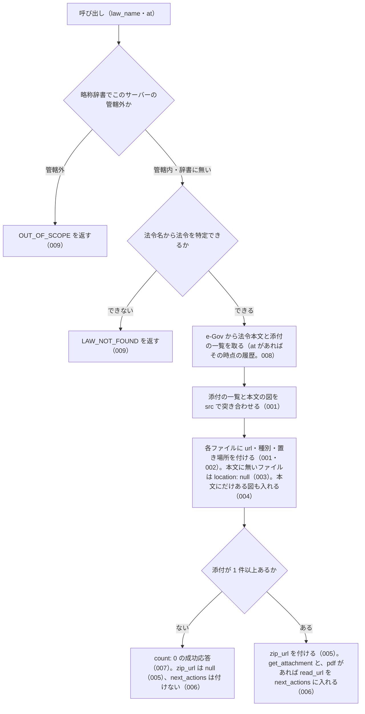

# list_attachments の仕様

<!-- GENERATED FILE — 手で編集しない。本文は houki-egov-mcp の specs/current/list_attachments/spec.md の写し。 -->

::: info
houki-egov-mcp **v0.20.0** の `specs/current/list_attachments/spec.md` から自動生成しました（仕様 ID 25 件・2026-10-10）。手で編集しないでください。再生成は `node scripts/generate-reference.mjs specs` です。
:::

法令の添付ファイルの一覧を返す

使いどころ・引数・実測の呼び出し例は、[ツールのページ](/reference/mcp/houki-egov/list_attachments)にあります。

最後に仕様が変わったのは v0.18.0 の「検索の件数・0 件の案内・通称の展開・管轄外の略称、法令種別の解説、附則の別表の図の置き場所（段階 5 検索と解説と添付）」（2026-10-03 承認）です。それまでの経緯は[承認の履歴](#承認の履歴)にあります。

## 使う人と受け取るもの

この機能を誰が呼び、何を渡して何を受け取るかを示します。

- MCP クライアント（Claude などの LLM、または CLI から呼ぶ人）。`law_name`（と任意で `at`）を渡して、その法令履歴に付いている添付ファイル（別表・様式・別記の図。jpg / pdf）の一覧を受け取る。一覧の `url` をそのまま開くか、pdf-reader-mcp の `read_url` に渡すか、`get_attachment` で保存する

## 入力

呼び出すときに渡す値です。

| 引数       | 必須 | 内容                                                                   |
| ---------- | ---- | ---------------------------------------------------------------------- |
| `law_name` | 必須 | 法令名または略称。例: `"戸籍法施行規則"`、`"国旗及び国歌に関する法律"` |
| `at`       | 任意 | 時点。`YYYY-MM-DD` 形式（[SPEC-EGOV-LIST-ATTACHMENTS-021](#spec-egov-list-attachments-021)）。その時点の法令履歴の添付ファイルの一覧になる |

inputSchema に無い引数を渡したときの扱いは common_errors に書く。

## できないこと

この機能が引き受けないことです。

- 添付ファイルの中身（画像・pdf のバイト列や base64）を返すこと。返すのは URL だけで、取得・保存は `get_attachment` が行う
- pdf の添付の本文を読むこと（pdf-reader-mcp の `read_url` に `url` を渡す）
- 図の中身（別表の表の値など）をテキストにすること
- 複数の時点の添付の一覧を比べること（時点ごとに `at` を変えて呼ぶ）

## 処理の流れ

呼び出しを受けてから応答を返すまでに、何をどの順で確かめるかを示します。図の中の番号は「できること」の仕様 ID の末尾 3 桁です。

## 仕様 ID ごとの約束

この機能が守る約束を、仕様 ID ごとに並べています。見出しは約束を 1 文で表したもので、条件・応答の細部・例は「詳細」を開くと読めます。仕様 ID はそれぞれ受入テストと対応していて、テストの無い ID があると各リポジトリの CI が止まります。

### SPEC-EGOV-LIST-ATTACHMENTS-001 添付ファイルの一覧を、取得 URL と種別付きで返す

::: details 詳細
e-Gov の法令本文に付く添付ファイルの一覧（`attached_files_info`）と、本文の中の図（`Fig` 要素）を `src` で突き合わせ、1 ファイル 1 要素の `attachments` を返す。ファイルの中身は返さない。応答は次のフィールドを持つ。

| フィールド                                                                       | 内容                                                                                                                        |
| -------------------------------------------------------------------------------- | --------------------------------------------------------------------------------------------------------------------------- |
| `meta.law_revision_id`                                                           | 添付ファイルが属する法令履歴 ID。例: `411AC0000000127_19990813_000000000000000`                                             |
| `meta.law_id` / `meta.title` / `meta.law_num` / `meta.retrieved_at` / `meta.url` | 法令 ID・題名・法令番号・取得日時・e-Gov の法令ページの URL                                                                 |
| `count`                                                                          | `attachments` の件数                                                                                                        |
| `attachments[].src`                                                              | 本文の `Fig` 要素の `src`。例: `./pict/H11HO127-001.jpg`。`get_attachment` の `src` にそのまま渡せる                        |
| `attachments[].file_name`                                                        | `src` の末尾のファイル名。例: `H11HO127-001.jpg`                                                                            |
| `attachments[].file_type`                                                        | 拡張子から決めた種別。例: `jpg`、`pdf`                                                                                      |
| `attachments[].content_type`                                                     | 拡張子から決めた Content-Type。`jpg` は `image/jpeg`、`pdf` は `application/pdf`                                            |
| `attachments[].url`                                                              | 認証なしで開ける取得 URL。`https://laws.e-gov.go.jp/api/2/attachment/<law_revision_id>?src=<src を URL エンコードしたもの>` |
| `attachments[].updated`                                                          | 正誤などで更新された日時（`attached_files_info` の `updated`）。例: `2024-07-25T00:20:13+09:00`                             |
| `attachments[].location`                                                         | 法令の中の置き場所（[SPEC-EGOV-LIST-ATTACHMENTS-002](#spec-egov-list-attachments-002)）                                                                        |
| `zip_url`                                                                        | [SPEC-EGOV-LIST-ATTACHMENTS-005](#spec-egov-list-attachments-005)                                                                                              |
| `note`                                                                           | 件数と種別ごとの内訳の説明                                                                                                  |
| `next_actions`                                                                   | [SPEC-EGOV-LIST-ATTACHMENTS-006](#spec-egov-list-attachments-006)                                                                                              |
:::

### SPEC-EGOV-LIST-ATTACHMENTS-002 各ファイルに、法令の中の置き場所を付ける

::: details 詳細
`attachments[].location` に、その図が本文のどこに置かれているかを入れる。

- 別記・様式などの中の図: `tag`（`AppdxNote`・`AppdxStyle` など）、`title`（見出し。例: `別記第一`、`附録第十一号様式`）、`related_article`（関係条文。例: `（第一条関係）`）。見出しと関係条文の前後の空白（全角空白を含む）は除き、続く空白は 1 つに詰める（例: `　出生の届書（日本産業規格Ａ列四番）（第五十九条関係）` → `出生の届書（日本産業規格Ａ列四番）（第五十九条関係）`）
- 条の中の図: `tag: "Article"`、`article`（e-Gov 形式の条番号。例: `1`）、`title`（条見出しと見出しの括弧書きを続けたもの。例: `第一条（国旗）`）
- 附則の別表・様式・付録の中の図: [SPEC-EGOV-LIST-ATTACHMENTS-025](#spec-egov-list-attachments-025)
- 附則の中の図（附則の別表・様式・付録・条のどれの中でもないもの）: `tag: "SupplProvision"`、`amend_law_num`（附則の改正法番号。例: `平成一一年法律第一二七号`）
:::

### SPEC-EGOV-LIST-ATTACHMENTS-003 本文に見つからないファイルは、置き場所を null にして数を知らせる

::: details 詳細
`attached_files_info` にあるが本文の `Fig` 要素に同じ `src` が無いファイルも `attachments` に入れ、`location` を `null` にする。そのようなファイルがあるときは、`note` に「<件数> 件は attached_files_info にあるが本文の Fig 要素に見つからず」の文を入れる。
:::

### SPEC-EGOV-LIST-ATTACHMENTS-004 本文にだけある図も一覧に入れる

::: details 詳細
本文に `Fig` 要素があるが `attached_files_info` に無い図も `attachments` に入れる。このファイルには `updated` を付けず、`location` は本文の置き場所（[SPEC-EGOV-LIST-ATTACHMENTS-002](#spec-egov-list-attachments-002)）を付ける。
:::

### SPEC-EGOV-LIST-ATTACHMENTS-005 添付ファイルをまとめた zip の URL を返す

::: details 詳細
添付が 1 件以上ある法令では、`zip_url` に、その法令履歴の添付ファイルをまとめて取る URL `https://laws.e-gov.go.jp/api/2/attachment/<law_revision_id>`（`src` を付けない）を入れる。添付が無い法令では `zip_url` は `null`。
:::

### SPEC-EGOV-LIST-ATTACHMENTS-006 1 件の保存と pdf の読み取りを案内する

::: details 詳細
添付が 1 件以上あるときは `next_actions` に、`get_attachment`（保存するときの呼び方）を入れる。pdf のファイルがあるときは、続けて `pdf-reader-mcp:read_url`（pdf の `url` を渡すと本文を読める）を入れる。添付が無い法令では `next_actions` を付けない。
:::

### SPEC-EGOV-LIST-ATTACHMENTS-007 添付が無い法令は count 0 の成功応答にする

::: details 詳細
`attached_files_info` が空で本文に `Fig` 要素も無い法令（例: 民法）は、エラーにせず、`count: 0`・空の `attachments`・`zip_url: null` の成功応答を返す。`note` には「添付ファイルはありません」を含む文を入れる。
:::

### SPEC-EGOV-LIST-ATTACHMENTS-008 時点（at）を渡すと、その時点の法令履歴の一覧になる

::: details 詳細
`at` を渡したときは、その時点の法令履歴の本文と添付の一覧を使う。`meta.law_revision_id` はその時点の履歴 ID、`meta.at` は渡した `at` になる。その履歴の `attached_files_info` が空でも、本文の `Fig` 要素にある図は一覧に入る。
:::

### SPEC-EGOV-LIST-ATTACHMENTS-009 特定できない法令と管轄外の資料はエラーにする

::: details 詳細
- 法令名が略称辞書で別の MCP サーバーの管轄の資料（例: `所基通` = 所得税基本通達）に当たるときは、エラー `OUT_OF_SCOPE` を返す
- 法令名から法令を特定できないときは、エラー `LAW_NOT_FOUND` を返す
:::

### SPEC-EGOV-LIST-ATTACHMENTS-010 一覧は attached_files_info の順、その後ろに本文にだけある図を本文の出現順に並べる

::: details 詳細
`attachments` は、まず e-Gov の `attached_files_info` に載っているファイルを載っている順に並べ、その後ろに、本文の `Fig` 要素にあって `attached_files_info` に無い図を本文での出現順に並べる。`attached_files_info` にあるファイルは、本文での位置にかかわらず前に来る。

例: `attached_files_info` が `./pict/z.jpg` → `./pict/fmt.pdf` → `./pict/other.pdf` の順で、本文の `Fig` 要素が出現順に `./pict/top.jpg`（本文の先頭）・`./pict/b.jpg`・`./pict/a.jpg`・…・`./pict/fmt.pdf`（別記様式の中）のとき、`attachments[].src` の並びは `./pict/z.jpg`・`./pict/fmt.pdf`・`./pict/other.pdf`・`./pict/top.jpg`・`./pict/b.jpg`・`./pict/a.jpg`・… になる。
:::

### SPEC-EGOV-LIST-ATTACHMENTS-011 同じ src は 1 件にし、最初に出てきたものの値を使う

::: details 詳細
同じ `src` が 2 回以上出てきても、`attachments` には 1 件だけ入れる。

- `attached_files_info` に同じ `src` が 2 回あるときは、最初の要素の `updated` を使う。例: `./pict/z.jpg` が `updated: "U1"` と `updated: "U3"` で 2 回載っていると、`attachments` の `./pict/z.jpg` は 1 件で `updated` は `U1`
- 本文に同じ `src` の `Fig` 要素が 2 つあるときは、先に出てきた `Fig` 要素の置き場所を `location` に使う。例: `./pict/a.jpg` が第三十条の二の中と、本文の末尾（どの別表・条にも入らない場所）の 2 か所にあると、`attachments` の `./pict/a.jpg` は 1 件で `location` は `{ tag: "Article", article: "30_2", title: "第三十条の二" }`
- `count` は重複を除いた件数
:::

### SPEC-EGOV-LIST-ATTACHMENTS-012 別表・書式・別図・付録の中の図の置き場所

::: details 詳細
[SPEC-EGOV-LIST-ATTACHMENTS-002](#spec-egov-list-attachments-002) の「別記・様式などの中の図」は、次の要素の中の図にも当たる。`location.tag` はその要素名、`location.title` は見出し（前後の空白を除き、続く空白は 1 つに詰める）、`location.related_article` は関係条文（`RelatedArticleNum` があるときだけ）。

| 図を含む要素 | `location.tag` | `location.title` にする見出し |
| ------------ | -------------- | ----------------------------- |
| 別表         | `AppdxTable`   | `AppdxTableTitle`             |
| 書式         | `AppdxFormat`  | `AppdxFormatTitle`            |
| 別図         | `AppdxFig`     | `AppdxFigTitle`               |
| 付録         | `Appdx`        | `ArithFormulaNum`             |

例:
- `AppdxTableTitle` が `　別表第一`、`RelatedArticleNum` が `（第三条関係）` の別表の中の図 → `{ tag: "AppdxTable", title: "別表第一", related_article: "（第三条関係）" }`
- `AppdxFormatTitle` が `別記様式第一` の書式の中の図 → `{ tag: "AppdxFormat", title: "別記様式第一" }`
- `AppdxFigTitle` が `別図第一` の別図の中の図 → `{ tag: "AppdxFig", title: "別図第一" }`
- `ArithFormulaNum` が `付録第一` の付録の中の図 → `{ tag: "Appdx", title: "付録第一" }`
:::

### SPEC-EGOV-LIST-ATTACHMENTS-013 別表・様式・条・附則のどれにも入らない図は tag: "Law"

::: details 詳細
図が別記・様式・別表・書式・別図・付録・条・附則のどれの中にも無いとき（例: `LawBody` の直下の `FigStruct` にある図）は、`location` を `{ tag: "Law" }` にする。`title` などのほかのフィールドは付かない。
:::

### SPEC-EGOV-LIST-ATTACHMENTS-014 附則の中の条にある図には、附則の改正法番号も付ける

::: details 詳細
附則（`SupplProvision`）の中の条（`Article`）にある図は、[SPEC-EGOV-LIST-ATTACHMENTS-002](#spec-egov-list-attachments-002) の「条の中の図」の `location`（`tag: "Article"`・`article`・`title`）に、その附則の改正法番号 `amend_law_num` を足す。

例: `AmendLawNum` が `令和二年法律第一号` の附則の第二条（見出し無し）にある図 → `{ tag: "Article", article: "2", title: "第二条", amend_law_num: "令和二年法律第一号" }`。本則の条にある図には `amend_law_num` は付かない。
:::

### SPEC-EGOV-LIST-ATTACHMENTS-015 meta の法令 ID・題名・法令番号・取得日時・URL・時点

::: details 詳細
`meta` の各フィールドは次の値になる。

- `meta.law_id`: 法令名から特定した法令 ID。例: `411AC0000000127`
- `meta.title`: 法令名から特定した法令の題名（e-Gov の法令検索で当たった法令の題名。略称辞書に法令 ID があるときは辞書の正式名）。例: `国旗及び国歌に関する法律`
- `meta.law_num`: 同じく特定した法令の法令番号。例: `平成十一年法律第百二十七号`
- `meta.retrieved_at`: 応答を作った日時の ISO 8601 文字列（UTC、例: `2026-09-27T20:32:08.782Z`）
- `meta.url`: `https://laws.e-gov.go.jp/law/<law_id>`。例: `https://laws.e-gov.go.jp/law/411AC0000000127`
- `meta.at`: 渡した `at`。渡さないときは `null`（v0.16.0 ではフィールドごと付かなかった）
:::

### SPEC-EGOV-LIST-ATTACHMENTS-016 next_actions の example の中身

::: details 詳細
[SPEC-EGOV-LIST-ATTACHMENTS-006](#spec-egov-list-attachments-006) の `next_actions` の各要素の `example` は次の値になる。

- `get_attachment`: `{ law_name: <渡した law_name>, src: <attachments の先頭の src>, save: true }`。例: `law_name: "テスト法"` で先頭が `./pict/z.jpg` なら `{ law_name: "テスト法", src: "./pict/z.jpg", save: true }`
- `pdf-reader-mcp:read_url`: `{ url: <attachments の中で最初に出てくる file_type: "pdf" のファイルの url> }`。例: 先頭が jpg で 2 番目が `./pict/fmt.pdf`、3 番目も pdf のとき、`{ url: "https://laws.e-gov.go.jp/api/2/attachment/<law_revision_id>?src=.%2Fpict%2Ffmt.pdf" }`
:::

### SPEC-EGOV-LIST-ATTACHMENTS-017 e-Gov の応答に法令履歴 ID が無いときはエラーにする

::: details 詳細
e-Gov の法令本文の応答の `revision_info` に `law_revision_id` が無いときは、エラー `SOURCE_API_ERROR` を返す。`retryable` は `false`、`detail.url` は法令本文の API の URL `https://laws.e-gov.go.jp/api/2/law_data/<law_id>`（`at` を渡したときも `asof` は付かない）。

例: 法令 ID `LID1`、`at: "2020-01-01"` で、法令本文の応答に `law_revision_id` が無い → `{ code: "SOURCE_API_ERROR", retryable: false, detail: { url: "https://laws.e-gov.go.jp/api/2/law_data/LID1" } }`。
:::

### SPEC-EGOV-LIST-ATTACHMENTS-018 法令本文の取得に失敗したときの code

::: details 詳細
e-Gov の法令本文の取得（`https://laws.e-gov.go.jp/api/2/law_data/<law_id>`）が失敗したときは、次のエラーを返す。どれも `detail.url` に法令本文の API の URL を入れる（`at` があれば `?asof=<at>` 付き）。

| e-Gov の応答                                        | `code`                | `retryable` | そのほか                                                                                     |
| --------------------------------------------------- | --------------------- | ----------- | -------------------------------------------------------------------------------------------- |
| 429                                                 | `SOURCE_RATE_LIMITED` | `true`      | `detail.status: 429`                                                                         |
| 時間切れ                                            | `SOURCE_TIMEOUT`      | `true`      | `detail.status` は付かない                                                                   |
| 5xx（例: 500・503）                                 | `SOURCE_API_ERROR`    | `true`      | `detail.status` に HTTP ステータス                                                           |
| 404・本文の `code` が `404004`                      | `LAW_NOT_FOUND`       | `false`     | [SPEC-EGOV-COMMON-ERRORS-033](/specs/houki-egov/common_errors#spec-egov-common-errors-033) の `error`・`hint`・`next_actions`。`detail.status: 404`・`detail.cause: "404004"` |
| 400・本文の `code` が `400044`（`at` を渡したとき） | `INVALID_ARGUMENT`    | `false`     | `tool: "list_attachments"`、`detail.issues: [{ path: "at", message: "e-Gov が受け付ける時点の範囲の外です" }]` |
| そのほかの 429 以外の 4xx（例: 403、本文の `code` が読めない 404） | `SOURCE_API_ERROR`    | `false`     | `detail.status` に HTTP ステータス                                                           |

例: e-Gov が 404・`{"code":"404004"}` を返す → `{ code: "LAW_NOT_FOUND", retryable: false, detail: { status: 404, url: "https://laws.e-gov.go.jp/api/2/law_data/LID1", cause: "404004" }, … }`（v0.17.0 では `SOURCE_API_ERROR`）。e-Gov が 404・本文 `Not Found`（JSON でない）を返す → `SOURCE_API_ERROR`・`retryable: false`・`detail.status: 404`（今までどおり）。
:::

### SPEC-EGOV-LIST-ATTACHMENTS-019 429・5xx・ネットワークの失敗は取り直してから返す

::: details 詳細
法令本文の取得で e-Gov が 429 か 5xx を返したとき、または応答が来ないネットワークの失敗のときは、最大 3 回取り直す（最初の 1 回と合わせて最大 4 回）。途中で成功すれば、その結果で成功応答を返す。4 回とも失敗したときは [SPEC-EGOV-LIST-ATTACHMENTS-018](#spec-egov-list-attachments-018) の code を返す。

時間切れと、429 以外の 4xx は取り直さない（e-Gov への問い合わせは 1 回）。

例:
- 1 回目が 429、2 回目が 200 → 成功応答
- 4 回とも 500 → e-Gov への問い合わせは 4 回で、`SOURCE_API_ERROR`（`retryable: true`、`detail.status: 500`）
- 404 → 問い合わせは 1 回で、`SOURCE_API_ERROR`（`retryable: false`）
:::

### SPEC-EGOV-LIST-ATTACHMENTS-020 law_name が空文字・空白だけのときは略称辞書と e-Gov に問い合わせずに `INVALID_ARGUMENT` を返す

::: details 詳細
空文字は inputSchema の `minLength: 1` の検査（[SPEC-EGOV-COMMON-ERRORS-025](/specs/houki-egov/common_errors#spec-egov-common-errors-025)）で止まり、`INVALID_ARGUMENT`（`tool: "list_attachments"`、`detail.issues: [{ path: "law_name", message: "空文字は指定できません" }]`）を返す。空白（半角スペース・全角スペース・タブ・改行）だけのときは、ツールの処理が略称辞書と e-Gov に問い合わせる前に、[SPEC-EGOV-COMMON-ERRORS-026](/specs/houki-egov/common_errors#spec-egov-common-errors-026) の形の `INVALID_ARGUMENT`（`tool: "list_attachments"`、`error: "law_name が空です"`、`detail.issues: [{ path: "law_name", message: "空白だけは指定できません" }]`、`hint` に法令名か略称を渡すよう書く）を返す。

例: `law_name: ""` は `code: "INVALID_ARGUMENT"`・`detail.issues[0].message: "空文字は指定できません"`。`law_name: "　"`（全角スペース）と `law_name: " \n"` は `code: "INVALID_ARGUMENT"`・`error: "law_name が空です"`。どれも略称辞書と e-Gov への問い合わせは 0 回。
:::

### SPEC-EGOV-LIST-ATTACHMENTS-021 `at` は `YYYY-MM-DD` の形だけを受け付け、形に合わない値と暦に無い日付は `INVALID_ARGUMENT`

::: details 詳細
`at` は [SPEC-EGOV-COMMON-ERRORS-024](/specs/houki-egov/common_errors#spec-egov-common-errors-024) に従う。tools/list の inputSchema の `at` は `pattern: "^[0-9]{4}-[0-9]{2}-[0-9]{2}$"` を持ち、形に合わない値は inputSchema の検査で `INVALID_ARGUMENT`（`tool: "list_attachments"`、`detail.issues: [{ path: "at", message: "YYYY-MM-DD の形で指定してください" }]`）になる。形は合うが暦に無い日付は、ツールの処理が e-Gov に問い合わせる前に `INVALID_ARGUMENT`（`detail.issues: [{ path: "at", message: "暦に無い日付です" }]`）を返す。

例: `law_name: "戸籍法施行規則", at: "2024/04/01"` は `code: "INVALID_ARGUMENT"`・`detail.issues[0].path: "at"` で、e-Gov への問い合わせは 0 回。`at: "20240401"`・`at: "2024-4-1"` も同じ。`at: "2026-02-30"` は `detail.issues[0].message: "暦に無い日付です"` で、e-Gov への問い合わせは 0 回。`at: "2024-04-01"` は [SPEC-EGOV-LIST-ATTACHMENTS-008](#spec-egov-list-attachments-008) のとおり。
:::

### SPEC-EGOV-LIST-ATTACHMENTS-022 法令名の検索が通信の失敗で終わったときは `LAW_NOT_FOUND` ではなく `SOURCE_*` を返す

::: details 詳細
`law_name` が略称辞書に law_id 付きで無く、e-Gov の法令名検索で law_id を決めるとき、その検索が通信の失敗（接続できない・時間切れ・5xx・429・429 以外の 4xx）で終わったときは、[SPEC-EGOV-COMMON-ERRORS-027](/specs/houki-egov/common_errors#spec-egov-common-errors-027) の表の code（`SOURCE_UNAVAILABLE` / `SOURCE_TIMEOUT` / `SOURCE_API_ERROR` / `SOURCE_RATE_LIMITED`）を、表の `retryable` と `detail` 付きで返す（[SPEC-EGOV-COMMON-ERRORS-029](/specs/houki-egov/common_errors#spec-egov-common-errors-029)）。`LAW_NOT_FOUND`（[SPEC-EGOV-LIST-ATTACHMENTS-009](#spec-egov-list-attachments-009)）は、検索が成功して 0 件だったときだけ返す。`SOURCE_*` のときの `next_actions` に `resolve_abbreviation` / `search_law` は入れない。

例: 法令名の検索が 503 を返す状態で `{ law_name: "架空の法律" }` を渡すと、`code: "SOURCE_API_ERROR"`、`retryable: true`、`detail.status: 503`（v0.15.4 では `LAW_NOT_FOUND` だった）。検索が時間切れなら `SOURCE_TIMEOUT`、接続できなければ `SOURCE_UNAVAILABLE`（`detail.cause: "ENOTFOUND"` など）、400 なら `SOURCE_API_ERROR`・`retryable: false`。検索が 0 件で成功したときは `LAW_NOT_FOUND` のまま。
:::

### SPEC-EGOV-LIST-ATTACHMENTS-023 `law_name` の全角英数字・ダッシュ類・全角空白は半角に揃えてから略称辞書と照合する

::: details 詳細
`law_name` を略称辞書で引くときは、houki-abbreviations の `resolveAbbreviation(name, { normalize: true })` の規則（全角英数字を半角に、ダッシュ類 `－` `‐` `‑` `–` `—` `―` `−` を `-` に、全角チルダを `~` に、全角空白を半角空白にし、前後の空白を除く。大文字と小文字は区別する）で揃えてから照合する。管轄の判定（`OUT_OF_SCOPE`）も同じ規則で引く。辞書に無いときに e-Gov の法令名検索へ渡す値は、前後の空白を除いた渡した値のままで、揃えない。

例: `{ law_name: "ＰＬ法" }` は `製造物責任法の添付の一覧（無ければ 0 件）を返す`（v0.15.4 では辞書に無い扱いで、e-Gov の法令名検索に `ＰＬ法` を渡して `LAW_NOT_FOUND` だった）。`law_name: "労基法　"`（末尾が全角空白）も `労働基準法` として引く。
:::

### SPEC-EGOV-LIST-ATTACHMENTS-024 法令名が完全一致しないときは、一覧を返さず候補を付けた `LAW_NOT_FOUND` を返す

::: details 詳細
`law_name` の法令は [SPEC-EGOV-COMMON-ERRORS-032](/specs/houki-egov/common_errors#spec-egov-common-errors-032) の規則で決める。略称辞書に law_id が無く、e-Gov の法令名検索の全件の中に題名の完全一致が無いときは、検索結果の先頭の法令の添付の一覧を返さず、032 の形の `LAW_NOT_FOUND`（`retryable: false`）を返す。`next_actions` の候補の要素は `action: "list_attachments"`、`example` は渡した引数（`at` を渡したときはそれも）の `law_name` だけを候補の題名に替えたもの。`at` を渡したときは、法令名の検索にも `asof=<at>` を付ける。[SPEC-EGOV-LIST-ATTACHMENTS-009](#spec-egov-list-attachments-009) の「法令名から法令を特定できないとき」には、この場合も入る。

例: `{ law_name: "所得税法施行" }` は `code: "LAW_NOT_FOUND"`、`next_actions` の先頭 2 件は `{ action: "list_attachments", example: { law_name: "所得税法施行令" } }` と `{ action: "list_attachments", example: { law_name: "所得税法施行規則" } }`。
:::

### SPEC-EGOV-LIST-ATTACHMENTS-025 附則の別表・様式・付録の中の図には、その見出しと附則の改正法番号を付ける

::: details 詳細
附則（`SupplProvision`）の中の別表・様式・付録にある図は、附則全体（`{ tag: "SupplProvision", … }`）ではなく、その要素を置き場所にする。`location.tag` は e-Gov の要素名、`location.title` は見出し（前後の空白を除き、続く空白は 1 つに詰める。[SPEC-EGOV-LIST-ATTACHMENTS-012](#spec-egov-list-attachments-012) と同じ）、`location.related_article` は関係条文（`RelatedArticleNum` があるときだけ）、`location.amend_law_num` はその附則の改正法番号（制定時の附則で `AmendLawNum` が無いときは付けない。[SPEC-EGOV-LIST-ATTACHMENTS-014](#spec-egov-list-attachments-014) と同じ）。

| 図を含む要素       | `location.tag`                | `location.title` にする見出し      |
| ------------------ | ----------------------------- | ---------------------------------- |
| 附則の別表         | `SupplProvisionAppdxTable`    | `SupplProvisionAppdxTableTitle`    |
| 附則の様式         | `SupplProvisionAppdxStyle`    | `SupplProvisionAppdxStyleTitle`    |
| 附則の付録         | `SupplProvisionAppdx`         | `ArithFormulaNum`                  |

`get_attachment` の `location`（ファイル名で照合した一覧の要素の値。[SPEC-EGOV-GET-ATTACHMENT-001](/specs/houki-egov/get_attachment#spec-egov-get-attachment-001)）も同じ値になる。

例: `AmendLawNum` が `令和二年法律第一号` の附則の中に、`SupplProvisionAppdxTableTitle` が `附則別表第一`、`RelatedArticleNum` が `（附則第三条関係）` の `SupplProvisionAppdxTable` があり、その中に図 `./pict/s1.jpg` があるとき、`location` は `{ tag: "SupplProvisionAppdxTable", title: "附則別表第一", related_article: "（附則第三条関係）", amend_law_num: "令和二年法律第一号" }`（v0.17.0 では `{ tag: "SupplProvision", amend_law_num: "令和二年法律第一号" }` になる。この v0.17.0 の値は #72 が差し替えた XML で確かめたもの）。

2026-10-03 10:15 JST に e-Gov の国民年金法（`334AC0000000141`）・厚生年金保険法（`329AC0000000115`）・所得税法（`340AC0000000033`）・地方税法（`325AC0000000226`）の本文に `SupplProvisionAppdxTable` と `SupplProvisionAppdxTableTitle` の要素があることを確かめた。この 4 法令の附則の別表の中に図（`Fig`）は無かった。`SupplProvisionAppdxStyle`・`SupplProvisionAppdxStyleTitle`・`SupplProvisionAppdx` の要素と、附則の別表・様式の中に図がある実際の法令は確かめていない（要素名は e-Gov の法令標準 XML スキーマの名前に合わせた）。
:::

## まだ決めていないこと

仕様を書き起こしたときに見つかった項目のうち、扱いを決めている途中のものです。開くと、元の仕様書の記述をそのまま読めます。

::: details 仕様書の「未決」の節
初版起こしで見つけた、意図か不具合かを人が決める項目です。決まったら「できること」に ID を振るか、`specs/changes/` の差分にします。

意図か不具合かの判断が要る項目は houki-egov-mcp の Issue に移し、ここには題と Issue の番号だけを残します。今の振る舞いのままでよくテストが無いだけの項目は、受入テストを書いてから「できること」に ID を振ります。

3. **一覧の並び順と重複の扱い。** → [SPEC-EGOV-LIST-ATTACHMENTS-010](#spec-egov-list-attachments-010)・[SPEC-EGOV-LIST-ATTACHMENTS-011](#spec-egov-list-attachments-011)
4. **別表・書式・別図・付録の置き場所と、どこにも当たらない図。** → [SPEC-EGOV-LIST-ATTACHMENTS-012](#spec-egov-list-attachments-012)・[SPEC-EGOV-LIST-ATTACHMENTS-013](#spec-egov-list-attachments-013)・[SPEC-EGOV-LIST-ATTACHMENTS-014](#spec-egov-list-attachments-014)
5. **`meta` の `law_id`・`title`・`law_num`・`retrieved_at`・`url`。** → [SPEC-EGOV-LIST-ATTACHMENTS-015](#spec-egov-list-attachments-015)
6. **`next_actions` の `example` の中身。** → [SPEC-EGOV-LIST-ATTACHMENTS-016](#spec-egov-list-attachments-016)
7. **e-Gov の応答に法令履歴 ID が無いとき。** → [SPEC-EGOV-LIST-ATTACHMENTS-017](#spec-egov-list-attachments-017)
8. **法令本文の取得に失敗したときの code。** → [SPEC-EGOV-LIST-ATTACHMENTS-018](#spec-egov-list-attachments-018)・[SPEC-EGOV-LIST-ATTACHMENTS-019](#spec-egov-list-attachments-019)
:::

## 承認の履歴

この機能の仕様が、いつ、どの変更で承認されたかを新しい順に並べています。各リポジトリの `npx spec-ids history list_attachments` と同じ内容です。変更の名前から、変更の理由と前後の振る舞いを書いた文書（GitHub）を開けます。

::: details 承認の履歴（9 件）
| 承認日 | 版 | 変更 | 仕様 PR |
|---|---|---|---|
| 2026-10-03 | v0.18.0 | [検索の件数・0 件の案内・通称の展開・管轄外の略称、法令種別の解説、附則の別表の図の置き場所（段階 5 検索と解説と添付）](https://github.com/shuji-bonji/houki-egov-mcp/blob/v0.20.0/specs/releases/v0.18.0/20261003-search-explain-attachment/proposal.md) | [#96](https://github.com/shuji-bonji/houki-egov-mcp/pull/96) |
| 2026-10-03 | v0.18.0 | [法令名・条・委任先を、確かなときだけ 1 つに決める（段階 5 法令の引き当て）](https://github.com/shuji-bonji/houki-egov-mcp/blob/v0.20.0/specs/releases/v0.18.0/20261003-law-resolution/proposal.md) | [#95](https://github.com/shuji-bonji/houki-egov-mcp/pull/95) |
| 2026-10-03 | v0.17.0 | [値の無いフィールドを null にし、meta の時点を常に返す（T4 応答の形）](https://github.com/shuji-bonji/houki-egov-mcp/blob/v0.20.0/specs/releases/v0.17.0/20261003-t4-response-shape/proposal.md) | [#91](https://github.com/shuji-bonji/houki-egov-mcp/pull/91) |
| 2026-10-01 | v0.16.0 | [全角・半角・ダッシュ類の揃え方を houki-abbreviations 0.7.0 に一本化する（T3）](https://github.com/shuji-bonji/houki-egov-mcp/blob/v0.20.0/specs/releases/v0.16.0/20261001-t3-normalize/proposal.md) | [#86](https://github.com/shuji-bonji/houki-egov-mcp/pull/86) |
| 2026-10-01 | v0.16.0 | [「見つからない」と「取得元の失敗」の code を分ける（T2）](https://github.com/shuji-bonji/houki-egov-mcp/blob/v0.20.0/specs/releases/v0.16.0/20261001-t2-error-codes/proposal.md) | [#85](https://github.com/shuji-bonji/houki-egov-mcp/pull/85) |
| 2026-10-01 | v0.16.0 | [引数の検査を inputSchema に書き、丸めずに `INVALID_ARGUMENT` にする（T1）](https://github.com/shuji-bonji/houki-egov-mcp/blob/v0.20.0/specs/releases/v0.16.0/20261001-t1-argument-guards/proposal.md) | [#84](https://github.com/shuji-bonji/houki-egov-mcp/pull/84) |
| 2026-09-28 | v0.15.2 | [テストが無いだけの振る舞いに仕様 ID を振る](https://github.com/shuji-bonji/houki-egov-mcp/blob/v0.20.0/specs/releases/v0.15.2/20260928-untested-behaviors/proposal.md) | [#76](https://github.com/shuji-bonji/houki-egov-mcp/pull/76) |
| 2026-09-28 | v0.15.2 | [「未決」のうち判断が要る 85 件を Issue に移す](https://github.com/shuji-bonji/houki-egov-mcp/blob/v0.20.0/specs/releases/v0.15.2/20260928-undecided-to-issues/proposal.md) | [#68](https://github.com/shuji-bonji/houki-egov-mcp/pull/68) |
| 2026-09-28 | — | 初版 | [#50](https://github.com/shuji-bonji/houki-egov-mcp/pull/50) |
:::

## 関連ページ

このページの元になった文書と、あわせて読むページです。

- [houki-egov-mcp の仕様の一覧](/specs/houki-egov/)
- [houki-egov-mcp の解説](/mcp/houki-egov)
- [list_attachments のツールのページ（リファレンス）](/reference/mcp/houki-egov/list_attachments)
- [元の仕様書（GitHub、v0.20.0）](https://github.com/shuji-bonji/houki-egov-mcp/blob/v0.20.0/specs/current/list_attachments/spec.md)
