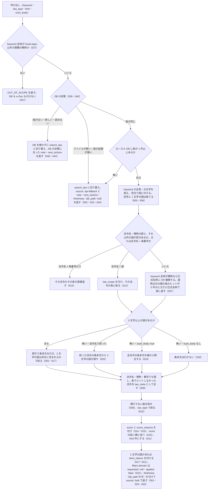

# search_fulltext の仕様

<!-- GENERATED FILE — 手で編集しない。本文は houki-egov-mcp の specs/current/search_fulltext/spec.md の写し。 -->

::: info
houki-egov-mcp **v0.20.0** の `specs/current/search_fulltext/spec.md` から自動生成しました（仕様 ID 42 件・2026-10-10）。手で編集しないでください。再生成は `node scripts/generate-reference.mjs specs` です。
:::

法令の条文本文をキーワードで横断検索する

使いどころ・引数・実測の呼び出し例は、[ツールのページ](/reference/mcp/houki-egov/search_fulltext)にあります。

最後に仕様が変わったのは v0.20.0 の「ローカル DB の場所を、応答・起動時のログ・`--status` で確かめられるようにする（egov #108・#110、T6）」（2026-10-04 承認）です。それまでの経緯は[承認の履歴](#承認の履歴)にあります。

## 利用者と得られる結果

この機能の利用者と、利用者が渡すもの・得られる結果を示します。

- MCP クライアント（Claude などの LLM、または CLI から呼ぶ人）。`keyword` を渡して、ローカル DB（`--bulk-download-everything` で作ったもの）に入っている法令の条文本文から、キーワードを含む条の一覧を受け取る

## 入力

呼び出すときに渡す値です。

| 引数        | 必須 | 内容                                                                                                                                                                                                                |
| ----------- | ---- | ------------------------------------------------------------------------------------------------------------------------------------------------------------------------------------------------------------------- |
| `keyword`   | 必須 | 検索キーワード。空白で区切ると AND 検索。法令名・略称を含めると（例: `"民法 不法行為"`）その法令の条に絞る。「第30条」を含めると該当条を上位に寄せ、法令名 + 条番号だけ（例: `"民法 第709条"`）ならその条を直接返す |
| `law_type`  | 任意 | 法令種別で絞る。`Constitution` / `Act` / `CabinetOrder` / `ImperialOrder` / `MinisterialOrdinance` / `Rule` のどれか（[SPEC-EGOV-SEARCH-FULLTEXT-038](#spec-egov-search-fulltext-038)。ローカル DB と e-Gov の `law_type` の値と同じ） |
| `limit`     | 任意 | 返す件数。既定 10。1 以上 30 以下の整数（[SPEC-EGOV-SEARCH-FULLTEXT-033](#spec-egov-search-fulltext-033)） |
| `scan_body` | 任意 | 既定 `false`。`true` のとき、2 文字の語だけのクエリで索引を使わずに全法令の条本文を端から照合する                                                                                                                   |

## 扱わないこと

この機能が意図して扱わないことです。

- 条文の本文を丸ごと返すこと（`snippet` だけ。本文は `get_law` / `get_law_range`）
- ローカル DB を作ること・作り直すこと・更新すること（CLI の `--bulk-download-everything` / `--sync`。DB のファイルが無くても作らない。[SPEC-EGOV-SEARCH-FULLTEXT-039](#spec-egov-search-fulltext-039)）
- 分野で絞ること（`domain` の引数は無い。[SPEC-EGOV-SEARCH-FULLTEXT-022](#spec-egov-search-fulltext-022)）
- 漢数字の「第三十条」を条番号として扱うこと（本文の語として探す）
- 1 文字の語で探すこと
- 前の版（施行済みで置き換わった版）や未施行の版の条を探すこと、時点を指定して探すこと
- 部分一致以外の探し方（似た語・読み仮名・同義語）。展開するのは略称辞書にある略称・通称から正式名称への 1 つだけ

## 処理の流れ

呼び出しを受けてから応答を返すまでに、何をどの順で確かめるかを示します。図の中の番号は「できること」の仕様 ID の末尾 3 桁です。

## 仕様項目

この機能の仕様項目を、仕様 ID ごとに並べています。見出しは仕様項目を 1 文で表したもので、条件・応答の細部・例は「詳細」を開くと読めます。仕様 ID はそれぞれ受入テストと対応していて、テストの無い ID があると各リポジトリの CI が止まります。

### SPEC-EGOV-SEARCH-FULLTEXT-001 ローカル DB に条があれば DB を引いて返す

::: details 詳細
ローカル DB に条が 1 件以上入っているときは、DB を引いて次のフィールドを持つ応答を返す。

| フィールド                                         | 内容                                                                        |
| -------------------------------------------------- | --------------------------------------------------------------------------- |
| `keyword`                                          | 前後の空白を除いた `keyword`                                                |
| `source`                                           | `bulk`                                                                      |
| `count`                                            | `hits` の件数                                                               |
| `hits`                                             | ヒットの配列（[SPEC-EGOV-SEARCH-FULLTEXT-003](#spec-egov-search-fulltext-003)・009）                          |
| `freshness`                                        | DB の鮮度（[SPEC-EGOV-SEARCH-FULLTEXT-023](#spec-egov-search-fulltext-023)）                                  |
| `filters`                                          | `law_type`（渡した値か `null`）と `domain`（[SPEC-EGOV-SEARCH-FULLTEXT-022](#spec-egov-search-fulltext-022)） |
| `expanded_keywords` / `law_scope` / `short_tokens` | 該当するときだけ付く（[SPEC-EGOV-SEARCH-FULLTEXT-007](#spec-egov-search-fulltext-007)・012・017〜021）        |

例: 消費税法の第30条と第30条の2に「適格請求書」がある DB で `{ keyword: "適格請求書" }` を渡すと、`source: "bulk"`、`count: 2`、`hits[0].law_title: "消費税法"` を返す。
:::

### SPEC-EGOV-SEARCH-FULLTEXT-002 ローカル DB に条が無いときは search_law に切り替える

::: details 詳細
ローカル DB のファイルが無いとき、または DB に条が 1 件も無い（`--bulk-download-everything` を実行していない）ときは、条本文を検索せず、法令名のタイトル一致の検索（`search_law` と同じもの）に切り替えて次を返す。

- `source`: `api-fallback`
- `note`: [SPEC-EGOV-SEARCH-FULLTEXT-044](#spec-egov-search-fulltext-044) の表の、ファイルが無い行、または法令がまだ取り込まれていない行の文。開こうとした DB のパスと、`--bulk-download-everything` で DB を作ると本文を検索できることを含む
- `next_actions`: 1 件目は `action: "bulk_download_everything"`（`example.command` は [SPEC-EGOV-DB-SCHEMA-029](/specs/houki-egov/db_schema#spec-egov-db-schema-029) の形のコマンド。既定の場所なら `npx -y @shuji-bonji/houki-egov-mcp@latest --bulk-download-everything`）、2 件目は `search_law` の案内
- `freshness`: `db_path` を含む 5 つのキーがすべて `null`（[SPEC-EGOV-SEARCH-FULLTEXT-043](#spec-egov-search-fulltext-043)）
- `fallback`: 切り替えた検索の応答そのもの。切り替えた検索がエラーを返したときはそのエラーの形（`code` など）が入る

例: 環境変数を付けずに起動し、条が無い DB で `{ keyword: "消費税法" }` を渡すと、`source: "api-fallback"`、`note` は `ローカル DB (~/.cache/houki-egov-mcp/laws.db) にまだ法令が取り込まれていないため、` で始まる、`next_actions[0].action: "bulk_download_everything"`、`next_actions[0].example.command: "npx -y @shuji-bonji/houki-egov-mcp@latest --bulk-download-everything"`、`freshness.db_path: null`（v0.19.x では `note` が `bulk DL 未実行のため` で始まり、`example.command` は `houki-egov-mcp --bulk-download-everything`、`freshness` のキーは無かった）。
:::

### SPEC-EGOV-SEARCH-FULLTEXT-003 条本文にキーワードを含む条を返す

::: details 詳細
条本文にキーワードを含む条を、1 件ずつ次のフィールドで返す。

| フィールド                                                          | 内容                                                        |
| ------------------------------------------------------------------- | ----------------------------------------------------------- |
| `match_type`                                                        | `article`                                                   |
| `law_id` / `law_revision_id` / `law_title` / `law_num` / `law_type` | ヒットした法令とその版                                      |
| `article_num`                                                       | 条番号（表示形式。[SPEC-EGOV-SEARCH-FULLTEXT-004](#spec-egov-search-fulltext-004)）           |
| `caption` / `chapter_path`                                          | 条見出しと章節（無ければ `null`）                           |
| `snippet`                                                           | 条本文の一致箇所の抜粋。一致した語を `<b>` と `</b>` で囲む |
| `rank` / `score` / `score_reasons`                                  | 並べ替えの根拠（[SPEC-EGOV-SEARCH-FULLTEXT-015](#spec-egov-search-fulltext-015)）             |
| `url`                                                               | `https://laws.e-gov.go.jp/law/<law_id>`                     |

例: `適格請求書` では消費税法の `article_num` が `30` と `30の2` の 2 件を返し、`snippet` はどちらも `<b>適格請求書</b>` を含み、`url` は `https://laws.e-gov.go.jp/law/363AC0000000108`、`score` は 0 より大きく 1 以下。
:::

### SPEC-EGOV-SEARCH-FULLTEXT-004 条番号は本則・附則・別表を区別した表示形式で返す

::: details 詳細
`hits[].article_num` は次の形で返す。

- 本則: `30`、枝番号は `30の2`
- 条を持たず段落だけの本則（[SPEC-EGOV-CLI-BULK-DOWNLOAD-027](/specs/houki-egov/cli_bulk_download#spec-egov-cli-bulk-download-027) の `MainProvision` の行）: `本則`
- 附則: `附則(<法令の中での附則の通し番号>) <条番号>`。例: `附則(3) 1`、`附則(137) 51の2`
- 条を持たず段落だけの附則: `附則(<n>)`（[SPEC-EGOV-SEARCH-FULLTEXT-041](#spec-egov-search-fulltext-041)）
- 別表: `別表(<番号>)`。例: `別表(2)`

例: 改暦ノ布告の本則の行に当たったヒットは `article_num: "本則"`、`caption: null`、`chapter_path: null`。
:::

### SPEC-EGOV-SEARCH-FULLTEXT-005 空白で区切った語は AND で探し、記号と 1 文字の語は捨てる

::: details 詳細
`keyword` を空白で語に分け、すべての語を含む条を探す（AND）。`"` `*` `:` `(` `)` と改行・タブは空白として扱う。1 文字の語は捨てる。語が残らないとき（1 文字だけ・記号だけ）はエラーにせず、`hits` を空で返す。空文字と空白だけの `keyword` は語を分ける前に `INVALID_ARGUMENT` になる（[SPEC-EGOV-SEARCH-FULLTEXT-034](#spec-egov-search-fulltext-034)）。

例: `税`、`"*:()` はどちらも `hits: []`。
:::

### SPEC-EGOV-SEARCH-FULLTEXT-006 全角英数字・全角空白・大文字の違いを吸収して探す

::: details 詳細
`keyword` の全角英数字と全角空白は半角に、英大文字は小文字にしてから探す。DB の本文も同じ規則で揃えてあるため、全角で渡しても半角で書かれた本文に当たる。

例: `４５時間` は、本文に `４５時間` とある労働基準法第36条に当たる（`article_num: "36"`）。
:::

### SPEC-EGOV-SEARCH-FULLTEXT-007 略称は正式名称にも OR 展開して探し、通称は元の語の条のヒットが 0 件のときだけ正式名称で探し直す

::: details 詳細
`keyword` 全体が略称辞書で houki-egov-mcp の管轄の法令に当たるときは、当たり方で扱いを分ける。どちらも、展開したときだけ応答に `expanded_keywords: { from: <元の語>, to: <正式名称> }` を付ける。

- 略称（辞書のエントリの略称そのもの。例: `労基法`・`消法`）: 今までどおり、元の語に加えて正式名称でも探す（OR）。略称が 2 文字以下（例: `消法`）のときは正式名称だけで探す
- 通称（辞書のエントリの別名。例: `インボイス`・`適格請求書`）: まず元の語だけで探す。条のヒット（`match_type: "article"`）が 1 件以上あれば、正式名称では探さず、`expanded_keywords` も付けない。条のヒットが 0 件のときだけ、正式名称で探し直して、その結果を返す
- 正式名称そのもの（例: `消費税法`）と辞書に無い語（例: `課税仕入れ`）は展開しない

houki-nta-mcp の `nta_search_*`（houki-nta-mcp #21、v0.11.1）と同じ規則である。

例: `労基法` は `労基法` または `労働基準法` で探し、`expanded_keywords: { from: "労基法", to: "労働基準法" }`。`消法` は `消費税法` で探し、`expanded_keywords: { from: "消法", to: "消費税法" }`。標準の fixture の DB で、本文に `適格請求書` がある消費税法第30条・第30条の2があるとき、`適格請求書` は元の語だけで 2 件当たるので `expanded_keywords` を付けない（v0.17.0 では `expanded_keywords: { from: "適格請求書", to: "消費税法" }` を付け、本文に「消費税法」とある条も当たりうる）。本文にどの通称も無い DB で `インボイス` を渡すと、条のヒットが 0 件なので `消費税法` で探し直し、`expanded_keywords: { from: "インボイス", to: "消費税法" }` を付ける。

2026-10-03 10:16 JST に houki-egov-dev 0.17.0（手元の DB、`last_sync_date: "2026-09-19"`）で `{ keyword: "インボイス", limit: 5 }` を呼ぶと、1 件目は本文に「インボイス」がある `内国税の適正な課税の確保を図るための国外送金等に係る調書の提出等に関する法律施行規則` 第2条、2〜5 件目は本文に「消費税法」とある消費税法の附則の条（`附則(134) 48` など、`score_reasons` に `abbrev_match`）だった。この差分では、元の語で条のヒットがあるので 2〜5 件目は返らない（元の語だけでの件数は確かめていない）。
:::

### SPEC-EGOV-SEARCH-FULLTEXT-008 同じ法令の現行でない版は返さない

::: details 詳細
DB に同じ法令の複数の版があるときは、現行の版（または廃止後も効力が残る版）だけを返し、前の版（施行済みで置き換わった版）はヒットに入れない。条本文で探したとき・法令名で探したとき・`scan_body: true` で走査したときのどれでも同じ。

例: 消費税法の現行版と前の版がある DB で `適格請求書` を `limit: 30` で探すと、ヒットの `law_revision_id` は現行版の `363AC0000000108_20231001_000000000000000` の 1 種類だけ。
:::

### SPEC-EGOV-SEARCH-FULLTEXT-009 法令名・略称で当たった法令は law_meta として返す

::: details 詳細
法令名・DB に記録された略称・法令番号に `keyword` が当たる法令は、条でヒットしていなければ `match_type: "law_meta"` のヒットとして足す。条本文を持たない法令（太政官布告など）もこれで返る。`law_meta` のヒットでは `article_num` / `caption` / `chapter_path` は `null`、`snippet` は法令名、`score_reasons` に `law_meta (法令名・略称・番号でヒット)` が入る。同じ法令の同じ版がすでに条でヒットしていれば `law_meta` のヒットは足さない。2 文字の語だけのクエリ（例: `改暦`）でも、法令名・略称にその語を含む法令を返す。

例: `改暦ノ布告` と `改暦` は、条を持たない `105DF0000000337`（明治五年太政官布告第三百三十七号（改暦ノ布告））を `law_meta` の 1 件で返す。DB の略称 `改暦の布告` でも同じ法令を返し、`score_reasons` に `abbrev_match` が入る。
:::

### SPEC-EGOV-SEARCH-FULLTEXT-010 law_type で法令種別を絞る

::: details 詳細
`law_type` を渡したときは、その法令種別の法令のヒットだけを返す。応答の `filters.law_type` に渡した値を入れる（渡さなければ `null`）。

例: `改暦ノ布告` は `law_type: "Act"` で 0 件、`law_type: "CabinetOrder"` で 1 件。`{ keyword: "適格請求書", law_type: "CabinetOrder" }` は `count: 0`、`filters.law_type: "CabinetOrder"`。
:::

### SPEC-EGOV-SEARCH-FULLTEXT-011 limit で返す件数を絞る

::: details 詳細
`limit` を渡したときは、score の高い順に並べたうえで先頭の `limit` 件だけを返す。

例: `{ keyword: "適格請求書", limit: 1 }` は `count: 1`（`limit` なしなら 2 件）。
:::

### SPEC-EGOV-SEARCH-FULLTEXT-012 法令名と語を並べたクエリは、その法令の条に絞る

::: details 詳細
`keyword` が 2 語以上で、そのうち法令名・略称に当たる語と、それ以外の語の両方を含むときは、法令名の語を検索対象の法令の指定として扱い、残りの語でその法令の条本文だけを探す。法令名の語は本文に含まれていなくてよい。応答に `law_scope`（要素は `token`・`law_title`・`law_id`）を付ける。

- 法令名として扱う語は、略称辞書の正式名称・略称と一致する語（houki-egov-mcp の管轄のもの）と、DB の法令名と完全に一致する語。辞書の通称（例: `適格請求書`）は法令名として扱わない
- 1 語だけのクエリと、すべての語が法令名のクエリ（例: `消費税法 労基法`）には `law_scope` を付けず、絞らない（条番号を含むときは [SPEC-EGOV-SEARCH-FULLTEXT-013](#spec-egov-search-fulltext-013)）
- 指定した法令以外の条はヒットしない

例: `労基法 労働時間` は `law_scope[0]` が `{ token: "労基法", law_title: "労働基準法", law_id: "322AC0000000049" }` で、労働基準法第36条の 1 件を返す。`労基法 課税仕入れ` は 0 件（「課税仕入れ」は消費税法にしかない）。
:::

### SPEC-EGOV-SEARCH-FULLTEXT-013 法令名と条番号だけのクエリは、その条を直接返す

::: details 詳細
`keyword` が法令名・略称と「第N条」「第N条のM」だけでできているときは、本文を検索せずにその法令のその条を返す。応答に `law_scope` を付け、ヒットの `score_reasons` に `article_num_match` が入り、`snippet` は条本文の冒頭（最大 120 文字）。その条が無ければ 0 件。

例: `労基法 第36条` は労働基準法第36条の 1 件（`snippet` は `使用者は` を含む）。`消費税法 第30条の2` は `article_num: "30の2"`。`労基法 第999条` は 0 件。
:::

### SPEC-EGOV-SEARCH-FULLTEXT-014 キーワードに「第N条」があれば、その条のヒットを上位に寄せる

::: details 詳細
`keyword` に算用数字の「第N条」「第N条のM」（「第30の2条」のような書き方も含む）があるときは、本文の検索語には使わず、条番号が一致するヒットの `score` を 0.3 上げ、`score_reasons` に `article_num_match` を入れる。全角数字の「第３０条」も同じに扱う。漢数字の「第三十条」は条番号として扱わない。

例: `適格請求書 第30条` は、1 件目が `article_num: "30"` で `score_reasons` に `article_num_match` を含む。第30条の2のヒットには `article_num_match` が付かない。
:::

### SPEC-EGOV-SEARCH-FULLTEXT-015 ヒットごとに 0〜1 の score とその内訳を付ける

::: details 詳細
各ヒットの `score` は 0 以上 1 以下の数で、`score_reasons` にその内訳を入れる。

- 基礎点: 検索の一致度（`rank`、負の数）から `1 / (1 + 10 / |rank|)` で出す。`score_reasons` の先頭に `fts rank <rank> → base <基礎点>` を入れる
- `title_exact_match`（+0.3）: 法令名が `keyword` と一致する（全角と半角・大文字と小文字・空白の違いは無視する）
- `abbrev_match`（+0.2）: 法令の略称（DB に記録された略称と、略称辞書の略称・通称）が `keyword` と一致する
- `article_num_match`（+0.3）: [SPEC-EGOV-SEARCH-FULLTEXT-014](#spec-egov-search-fulltext-014)
- `article_caption_match`（+0.1）: 条見出しが `keyword` を含む。「第30条」のような条番号だけのクエリでは付けない
- `supplementary_provision`（−0.15）: 附則の条。附則でない条には付けない

合計が 1 を超えるときは 1、0 を下回るときは 0 にする。

例: 基礎点 0.5 のヒットで、法令名が一致すれば 0.8、略称が一致すれば 0.7、附則の条なら 0.35。
:::

### SPEC-EGOV-SEARCH-FULLTEXT-016 ヒットは score の高い順に並べる

::: details 詳細
`hits` は `score` の高い順に並べる。`score` が同じときは検索の一致度の高い順（`rank` の小さい順）に並べる。
:::

### SPEC-EGOV-SEARCH-FULLTEXT-017 3 文字以上の語があるときは、索引で引いた条を 2 文字の語で絞る

::: details 詳細
条本文の索引は 3 文字以上の語しか載せない。3 文字以上の語と 2 文字の語が混ざったクエリでは、3 文字以上の語で索引を引き、その条の本文に 2 文字の語がすべて含まれるものだけを返す（AND）。応答の `short_tokens` は `body_search: "fts_then_filter"`、`tokens`（2 文字の語）、`truncated: false`。このときは `scan_body: true` を渡しても同じ。

例: `適格請求書 保存` は第30条だけを返し（「保存」は第30条の本文にだけある）、`short_tokens.tokens` は `["保存"]`。`適格請求書 判例` は 0 件。
:::

### SPEC-EGOV-SEARCH-FULLTEXT-018 2 文字の語だけのクエリは、既定では条本文を引かずにそのことを返す

::: details 詳細
法令名で絞っておらず 3 文字以上の語も無いクエリ（例: `控除`）で `scan_body` を渡さないときは、条本文を引かず、法令名・略称・番号の照合（[SPEC-EGOV-SEARCH-FULLTEXT-009](#spec-egov-search-fulltext-009)）の結果だけを返す。応答の `short_tokens` は次のとおり。

- `tokens`: 2 文字の語。`fts_min_token_length`: `3`
- `body_search`: `not_searched`
- `hits_by_match_type`: `{ article: 0, law_meta: <法令名で当たった件数> }`
- `note`: 語が 3 文字未満で索引に載らないことと、条の本文は引いていないこと（`trigram` の語と「条の本文は引いていません」を含む）
- `next_actions`: 2 件。1 件目は法令名を添える案内で、`action: "search_fulltext"`、`reason: "法令名を添えて keyword を「<法令名> <語を空白でつないだもの>」の形にすると、その法令の条本文を索引で引けます"`、`example` は付けない（語から法令名は決まらないため）。2 件目は `scan_body: true` で走査する形（`example: { keyword: <語を空白でつないだもの>, scan_body: true }`）

例: `控除` は `hits` がすべて `law_meta`、`short_tokens.next_actions[0]` は `{ action: "search_fulltext", reason: "法令名を添えて keyword を「<法令名> 控除」の形にすると、その法令の条本文を索引で引けます" }`（`example` のキーが無い）、`next_actions[1].example` は `{ keyword: "控除", scan_body: true }`。v0.17.0 では 1 件目の `example` が、語によらず `{ keyword: "民法 控除" }` だった（2026-10-03 10:16 JST に houki-egov-dev 0.17.0 で確かめた）。
:::

### SPEC-EGOV-SEARCH-FULLTEXT-019 scan_body: true のときは全法令の条本文を端から照合する

::: details 詳細
[SPEC-EGOV-SEARCH-FULLTEXT-018](#spec-egov-search-fulltext-018) と同じクエリで `scan_body: true` を渡したときは、索引を使わずに全法令の条本文から 2 文字の語をすべて含む条を探して返す。`snippet` は条本文の一致位置の前後の抜粋。応答の `short_tokens` は `body_search: "like_all_articles"`、`note` に `scan_body: true` を含み、`next_actions` は付けない。`hits_by_match_type` で、返したヒットのうち条本文で当たった件数と法令名で当たった件数が分かる。

例: `{ keyword: "控除", scan_body: true }` は消費税法第30条を `match_type: "article"` で返し、`short_tokens` は `truncated: false`、`hits_by_match_type.article: 1`。`{ keyword: "改暦", scan_body: true }` は `hits_by_match_type: { article: 0, law_meta: 1 }`（「改暦」は法令名にだけある）。
:::

### SPEC-EGOV-SEARCH-FULLTEXT-020 法令名で絞ったクエリの 2 文字の語は、その法令の条本文から探す

::: details 詳細
[SPEC-EGOV-SEARCH-FULLTEXT-012](#spec-egov-search-fulltext-012) で法令を絞り、残りが 2 文字の語だけのときは、`scan_body` を渡さなくても、絞った法令の条本文から 2 文字の語をすべて含む条を探して返す。応答の `short_tokens` は `body_search: "like_in_law_scope"`。

例: `労基法 協定` は労働基準法第36条の 1 件を返し、`short_tokens.hits_by_match_type` は `{ article: 1, law_meta: 0 }`。
:::

### SPEC-EGOV-SEARCH-FULLTEXT-021 2 文字の語を含まないクエリには short_tokens を付けない

::: details 詳細
クエリに 2 文字の語が無いとき（3 文字以上の語だけ、または 1 文字の語だけ）は、応答に `short_tokens` を付けない。

例: `適格請求書` と `税` には `short_tokens` が付かない。
:::

### SPEC-EGOV-SEARCH-FULLTEXT-022 `domain` は引数に無く、`filters.domain` は絞り込みをしていないことを返す

::: details 詳細
tools/list の `search_fulltext` の inputSchema は `domain` を持たない（0.17.0 までは受け付けたが絞り込まなかった。`search_law` の [SPEC-EGOV-SEARCH-LAW-016](/specs/houki-egov/search_law#spec-egov-search-law-016) と揃える）。`domain` を渡すと、inputSchema に無い引数として [SPEC-EGOV-COMMON-ERRORS-004](/specs/houki-egov/common_errors#spec-egov-common-errors-004) の `INVALID_ARGUMENT`（`tool: "search_fulltext"`、`detail.issues: [{ path: "domain", message: "inputSchema に無い引数です" }]`）を返し、DB も e-Gov も引かない。

`source: "bulk"` の応答の `filters.domain` はキーを残し、`{ requested: null, applied: false, note: "分野での絞り込みはしていません（domain の引数は 0.18.0 で外しました）" }` を常に入れる。

例: `{ keyword: "適格請求書", domain: "tax" }` は `code: "INVALID_ARGUMENT"`、`detail.issues[0].path: "domain"`（v0.17.0 では `filters.domain.requested: "tax"`・`applied: false` の成功）。`{ keyword: "適格請求書" }` の `filters.domain` は `{ requested: null, applied: false, note: "分野での絞り込みはしていません（domain の引数は 0.18.0 で外しました）" }`（v0.17.0 の `note` は `domain 絞り込みは v0.5.0 では未実効です (…Phase 2-13…)`）。
:::

### SPEC-EGOV-SEARCH-FULLTEXT-023 DB の鮮度を freshness で返す

::: details 詳細
`source: "bulk"` の応答の `freshness` に、DB を最後に同期した日からの鮮度と、引いた DB のパスを入れる。DB に同期の記録が無いときは、鮮度の 4 つを `null` にし、`db_path` は入れる（[SPEC-EGOV-SEARCH-FULLTEXT-043](#spec-egov-search-fulltext-043)）。

| フィールド        | 内容 |
| ----------------- | ---- |
| `last_sync_date`  | 最後に同期を終えた日（`YYYY-MM-DD`） |
| `last_full_dl_at` | 最後に全件を取り込んだ日時 |
| `days_since_sync` | `last_sync_date` からの経過日数 |
| `staleness`       | 経過日数が 7 日未満なら `fresh`、30 日未満なら `stale`、30 日以上なら `outdated` |
| `db_path`         | 引いた DB のパス（[SPEC-EGOV-SEARCH-FULLTEXT-042](#spec-egov-search-fulltext-042) の形） |
| `warning`         | `outdated` のときだけ付く。``bulk DB が <日数> 日前のデータです。最新化するには `<--sync のコマンド>` (最終同期から <上限> 日を超えていれば `--bulk-download-everything`) を実行してください``。`<--sync のコマンド>` は `--sync` を付けた案内のコマンド（[SPEC-EGOV-DB-SCHEMA-029](/specs/houki-egov/db_schema#spec-egov-db-schema-029)）、`<上限>` は `HOUKI_EGOV_INCREMENTAL_LIMIT_DAYS` の値（既定 90） |

鮮度が `outdated` でも DB を引いた結果を返す。

例: 最終同期が 1 日前なら `staleness: "fresh"`、`days_since_sync: 1`、`warning` なし。ちょうど 7 日前なら `stale`。38 日前なら `outdated` で、`warning` に `日前` と `bulk-download` を含む。環境変数を付けずに起動したときの `warning` は ``bulk DB が 38 日前のデータです。最新化するには `npx -y @shuji-bonji/houki-egov-mcp@latest --sync` (最終同期から 90 日を超えていれば `--bulk-download-everything`) を実行してください``（v0.19.x では `` `houki-egov-mcp --sync` ``）。MCP サーバーを `HOUKI_EGOV_INCREMENTAL_LIMIT_DAYS=60` で起動したときは、`warning` に `最終同期から 60 日を超えていれば` を含む（v0.18.x では 90 のまま。CLI の [SPEC-EGOV-CLI-STATUS-004](/specs/houki-egov/cli_status#spec-egov-cli-status-004) と揃える。#61）。
:::

### SPEC-EGOV-SEARCH-FULLTEXT-024 limit を省くと 10 件で打ち切る

::: details 詳細
`limit` を渡さないときは、score の高い順に並べた先頭の 10 件までを返す。

例: `試験用条文` を本文に含む条が 200 件ある DB で `{ keyword: "試験用条文" }` を渡すと `count: 10`。
:::

### SPEC-EGOV-SEARCH-FULLTEXT-027 DB を開けないときも search_law に切り替える

::: details 詳細
ローカル DB のファイルを開けない（パスの途中が普通のファイル、パスがディレクトリ、権限が無いなど）ときも、エラーにせず `source: "api-fallback"` で `search_law` に切り替えて返す。`note` と `next_actions` は [SPEC-EGOV-SEARCH-FULLTEXT-044](#spec-egov-search-fulltext-044) の表の開けない行（`note` の先頭は `ローカル DB (<パス>) を開けなかったため`、`next_actions` は `search_law` の 1 件だけで `bulk_download_everything` を含まない）。`freshness` と `fallback` は [SPEC-EGOV-SEARCH-FULLTEXT-002](#spec-egov-search-fulltext-002) と同じ。

例: DB のパスに、普通のファイル `afile` の下の `afile/x.db`（または既存のディレクトリ）を指定して `{ keyword: "消費税法" }` を渡すと、`source: "api-fallback"`、`note` は `ローカル DB (<指定したパス>) を開けなかったため、search_law (法令名のタイトル一致) にフォールバックしています。` で始まり `--bulk-download-everything` を含まない、`next_actions` は `[{ action: "search_law", … }]` の 1 件（v0.19.x では `bulk DB を開けなかったため` で始まり、`next_actions[0].action: "bulk_download_everything"`）。
:::

### SPEC-EGOV-SEARCH-FULLTEXT-028 search_law に切り替えたとき、keyword があれば法令名の検索結果を fallback に入れる

::: details 詳細
[SPEC-EGOV-SEARCH-FULLTEXT-002](#spec-egov-search-fulltext-002)・027 で `search_law` に切り替え、`keyword` が空でないときは、e-Gov の法令検索を引き、`search_law` の応答（`query`・`total_count`・`results`）をそのまま `fallback` に入れる。`keyword` が略称辞書の略称なら、正式名称で e-Gov を引き、`fallback.query.resolved` に正式名称が入る。`next_actions[1]` は `action: "search_law"`、`example: { keyword: <前後の空白を除いた keyword> }`。

例: 条が無い DB で、e-Gov の法令検索が消費税法（`law_id: "363AC0000000108"`、`law_type: "Act"`、`law_num: "昭和六十三年法律第百八号"`）の 1 件を返すようにして `{ keyword: " 消法 ", law_type: "Act", limit: 3 }` を渡すと、`keyword: "消法"`、`source: "api-fallback"`、`fallback.query: { keyword: "消法", law_type: "Act", resolved: "消費税法" }`、`fallback.total_count: 1`、`fallback.results[0]` は `{ law_id: "363AC0000000108", title: "消費税法", law_num: "昭和六十三年法律第百八号", law_type: "Act", url: "https://laws.e-gov.go.jp/law/363AC0000000108", … }`、`next_actions[1].example: { keyword: "消法" }`。
:::

### SPEC-EGOV-SEARCH-FULLTEXT-029 search_law に切り替えたとき、law_type と limit を切り替え先に渡す

::: details 詳細
[SPEC-EGOV-SEARCH-FULLTEXT-028](#spec-egov-search-fulltext-028) で e-Gov の法令検索（`/laws`）を引くときは、`law_title` に検索する法令名（略称なら正式名称）、`law_type` に渡した `law_type`（渡さなければ付けない）、`limit` に渡した `limit`（省いたときは [SPEC-EGOV-SEARCH-FULLTEXT-024](#spec-egov-search-fulltext-024) の 10）を付ける。`limit` は inputSchema の検査を通った 1 以上 30 以下の整数なので、丸めは起きない（[SPEC-EGOV-SEARCH-FULLTEXT-033](#spec-egov-search-fulltext-033)）。

例: `{ keyword: "消法", law_type: "Act", limit: 3 }` では e-Gov の `/laws` を `law_title=消費税法`・`law_type=Act`・`limit=3` で引く。`{ keyword: "所得税", limit: 30 }` では `law_title=所得税法`・`limit=30` で引き、`law_type` は付けない。`{ keyword: "所得税2" }` では `law_title=所得税2`・`limit=10`。
:::

### SPEC-EGOV-SEARCH-FULLTEXT-030 scan_body: true の走査は 150 件で打ち切り、そのことを返す

::: details 詳細
[SPEC-EGOV-SEARCH-FULLTEXT-019](#spec-egov-search-fulltext-019) の走査で、2 文字の語をすべて含む条が 150 件に達したときは、そこで走査を打ち切る。応答の `short_tokens.truncated` を `true` にし、`short_tokens.note` の末尾に `走査は 150 件で打ち切っており、該当する条をすべて数えたものではありません。` を足す。150 件に達しないときは `truncated: false` で、この文は付かない。

例: 本文に「保存」を含む条が 200 件ある DB で `{ keyword: "保存", scan_body: true, limit: 30 }` を渡すと、`count: 30`、`short_tokens.body_search: "like_all_articles"`、`short_tokens.truncated: true`、`short_tokens.note` に `走査は 150 件で打ち切っており` を含む。同じ条が 149 件の DB では `truncated: false` で、`note` に `打ち切って` を含まない。
:::

### SPEC-EGOV-SEARCH-FULLTEXT-031 法令名で絞った 2 文字の語の検索も 150 件で打ち切り、そのことを返す

::: details 詳細
[SPEC-EGOV-SEARCH-FULLTEXT-020](#spec-egov-search-fulltext-020) の検索（`short_tokens.body_search: "like_in_law_scope"`）でも、2 文字の語をすべて含む条が 150 件に達したときは打ち切り、`short_tokens.truncated: true` と、`note` の末尾の `走査は 150 件で打ち切っており、該当する条をすべて数えたものではありません。` を返す。

3 文字以上の語で索引を引いたとき（`body_search: "fts_then_filter"`、[SPEC-EGOV-SEARCH-FULLTEXT-017](#spec-egov-search-fulltext-017)）は、該当が 150 件を超えても `truncated: false` のまま。

例: 条を 200 件持ち、どの条の本文にも「保存」と「試験用条文」がある法令 `大量条文試験法` の DB で、`{ keyword: "大量条文試験法 保存" }` は `count: 10`、`short_tokens.body_search: "like_in_law_scope"`、`short_tokens.truncated: true`、`law_scope[0].token: "大量条文試験法"`。条が 149 件の DB では `truncated: false`。`{ keyword: "試験用条文 保存" }` は 200 件の DB でも `body_search: "fts_then_filter"`、`truncated: false`。
:::

### SPEC-EGOV-SEARCH-FULLTEXT-032 応答の keyword は前後の空白を除いた値にする

::: details 詳細
応答の `keyword` には、渡した `keyword` の前後の空白（半角空白・全角空白・タブ・改行）を除いた値を入れる。検索も除いた値で行う。`source: "bulk"` と `source: "api-fallback"` のどちらの応答でも同じ。

例: 標準の fixture の DB で `{ keyword: "  適格請求書　 " }`（末尾に全角空白を含む）と `{ keyword: "\t適格請求書\n" }` は、どちらも `keyword: "適格請求書"`、`count: 2`。条が無い DB で `{ keyword: " 消法 " }` は `keyword: "消法"`（[SPEC-EGOV-SEARCH-FULLTEXT-028](#spec-egov-search-fulltext-028)）。
:::

### SPEC-EGOV-SEARCH-FULLTEXT-033 `limit` は 1 以上 30 以下の整数で、範囲の外は `INVALID_ARGUMENT` にして丸めない

::: details 詳細
tools/list の inputSchema の `limit` は `type: "integer"`、`minimum: 1`、`maximum: 30` を持つ（[SPEC-EGOV-COMMON-ERRORS-023](/specs/houki-egov/common_errors#spec-egov-common-errors-023)）。0・負の数・小数・31 以上・数値でない値を渡すと、inputSchema の検査で `INVALID_ARGUMENT`（`tool: "search_fulltext"`、`detail.issues[0].path: "limit"`）を返し、ローカル DB も e-Gov も引かない。1 件や 30 件に丸めない（v0.15.4 の SPEC-EGOV-SEARCH-FULLTEXT-025・026 をやめる）。

例: `{ keyword: "適格請求書", limit: 0 }` は `code: "INVALID_ARGUMENT"`、`detail.issues` は `[{ path: "limit", message: "1 以上で指定してください" }]`（v0.15.4 では 1 件返していた）。`limit: 31` と `limit: 100` は `[{ path: "limit", message: "30 以下で指定してください" }]`（v0.15.4 では 30 件）。`limit: 2.5` は `整数で指定してください`。`limit: 30` は検査を通り、最大 30 件を返す。DB の有無によらず同じ。
:::

### SPEC-EGOV-SEARCH-FULLTEXT-034 keyword が空文字・空白だけのときは DB も e-Gov も引かずに `INVALID_ARGUMENT` を返す

::: details 詳細
空文字は inputSchema の検査（[SPEC-EGOV-COMMON-ERRORS-025](/specs/houki-egov/common_errors#spec-egov-common-errors-025)）、空白（半角スペース・全角スペース・タブ・改行）だけはツールの処理（[SPEC-EGOV-COMMON-ERRORS-026](/specs/houki-egov/common_errors#spec-egov-common-errors-026)。`error: "keyword が空です"`、`hint` に探したい語や法令名を渡すよう書く）で、どちらも `INVALID_ARGUMENT`（`tool: "search_fulltext"`、`detail.issues[0].path: "keyword"`）を返す。ローカル DB の有無によらず同じで、DB が無いときの `search_law` への切り替え（[SPEC-EGOV-SEARCH-FULLTEXT-028](#spec-egov-search-fulltext-028)）にも進まない。

例: `keyword: ""` は `detail.issues[0].message: "空文字は指定できません"`。`keyword: "　　"` と `keyword: " \t"` は `error: "keyword が空です"`。どれも `code: "INVALID_ARGUMENT"` で、DB の照会と e-Gov への問い合わせは 0 回（v0.15.4 では DB があれば `hits: []`、無ければ切り替え先の `search_law` が `INVALID_ARGUMENT` を返していた）。
:::

### SPEC-EGOV-SEARCH-FULLTEXT-035 同期の記録の日付を解釈できないときは `INTERNAL_ERROR`（`retryable: false`）を返し、全件の取り込みを案内する

::: details 詳細
`source: "bulk"` の検索で、`freshness`（[SPEC-EGOV-SEARCH-FULLTEXT-023](#spec-egov-search-fulltext-023)）を計算するときに `sync_state.last_sync_date` が日付・時刻として解釈できない（空文字、`2026/05/08`、`2026-02-30` など）ときは、想定外の例外として止まらず、[SPEC-EGOV-COMMON-ERRORS-031](/specs/houki-egov/common_errors#spec-egov-common-errors-031) の形のエラー `INTERNAL_ERROR`（`retryable: false`、`error` にその値、`hint` に `` `<コマンド>` で全件を取り込み直し、同期の記録を作り直してください``（`<コマンド>` は `--bulk-download-everything` を付けた案内のコマンド。[SPEC-EGOV-DB-SCHEMA-029](/specs/houki-egov/db_schema#spec-egov-db-schema-029)）、`detail.cause` に例外の文）を返す。`hits` は返さない。同期の記録が無い（`sync_state` に行が無い）ときはエラーにせず、鮮度の 4 つを `null` にした `freshness`（[SPEC-EGOV-SEARCH-FULLTEXT-043](#spec-egov-search-fulltext-043)）で `hits` を返す。

例: `sync_state.last_sync_date` を `2026/05/08` に書き換えた DB で、環境変数を付けずに起動して `{ keyword: "軽減税率" }` を渡すと、`code: "INTERNAL_ERROR"`、`retryable: false`、`error` に `2026/05/08` を含み、`hint` は `` `npx -y @shuji-bonji/houki-egov-mcp@latest --bulk-download-everything` で全件を取り込み直し、同期の記録を作り直してください``。`last_sync_date` が `2026-05-08` の DB では、今までどおり `hits` と `freshness` を返す。`sync_state` に行が無い DB では `freshness.last_sync_date: null`、`freshness.db_path` に DB のパス（v0.19.x では `freshness: null`）。
:::

### SPEC-EGOV-SEARCH-FULLTEXT-036 検索語のダッシュ類は `-` に揃えて探し、版 3 の DB の本文も同じ揃え方で入っている

::: details 詳細
`keyword` のダッシュ類 `－` `‐` `‑` `–` `—` `―` `−` は `-` に揃えてから探す（houki-abbreviations 0.7.0 の `normalizeJpText`。[SPEC-ABBR-NORMALIZE-JP-TEXT-012](/specs/houki-abbreviations/normalize_jp_text#spec-abbr-normalize-jp-text-012)）。取り込み（`--bulk-download-everything` / `--sync`）が `articles.body` と `laws_fts` に入れる文字列も同じ関数で揃える。

0.19.0 はスキーマの版 3 の DB だけを引く（[SPEC-EGOV-SEARCH-FULLTEXT-040](#spec-egov-search-fulltext-040)）。版 3 の DB は 0.19.0 以降の `--bulk-download-everything` で作るので、どの行もダッシュ類が `-` で入っている。0.16.0 より前に取り込んだ `―` などの残る本文（版 2 の DB）は、0.19.0 では引かず、`--bulk-download-everything` で版 3 に作り直したときに揃え直す。

例: 版 3 の DB で、本文に `１８３―２` とある条は、`keyword: "183-2"` でも `keyword: "１８３―２"` でも当たる。0.15.4 で取り込んだ版 2 の DB では、0.19.0 の `search_fulltext` は DB を引かずに [SPEC-EGOV-SEARCH-FULLTEXT-040](#spec-egov-search-fulltext-040) の `search_law` への切り替えを返す（v0.16.0〜v0.18.x では版 2 の DB を引き、その条は `183-2` で当たらなかった）。
:::

### SPEC-EGOV-SEARCH-FULLTEXT-037 `keyword` 全体が houki-egov 以外の管轄の略称のときは、DB も e-Gov も引かずに `OUT_OF_SCOPE` を返す

::: details 詳細
`keyword` の前後の空白を除いた全体が、略称辞書（`resolveAbbreviation(name, { normalize: true })`）で houki-egov 以外の管轄（`source_mcp_hint` が `houki-egov` でない。通達は `houki-nta` など）のエントリに当たるときは、ローカル DB の有無によらず、DB も e-Gov も引かずにエラー `OUT_OF_SCOPE` を返す。本文は `search_law` の [SPEC-EGOV-SEARCH-LAW-015](/specs/houki-egov/search_law#spec-egov-search-law-015) と同じ（`error` に正式名称と管轄、`hint` に管轄先の MCP、`next_actions` に `delegate_to_mcp`、`example.mcp` に管轄）。

`keyword` が管轄外の略称と別の語の組み合わせ（例: `消基通 仕入税額控除`）のときは、今までどおり本文を探す（管轄外の略称の語は法令名として扱わず、本文の語として探す）。

例: `{ keyword: "消基通" }` は、DB があってもなくても `code: "OUT_OF_SCOPE"`、`error` に `消費税法基本通達` と `houki-nta` を含み、`next_actions` は `[{ action: "delegate_to_mcp", example: { mcp: "houki-nta" } }]`（`reason` 付き）で、DB の照会と e-Gov への問い合わせは 0 回。v0.17.0 では、DB があると `source: "bulk"`・`count: 0`・`hits: []` の成功（2026-10-03 10:16 JST に houki-egov-dev 0.17.0 で確かめた）、DB が無いと `source: "api-fallback"` の成功で `fallback.code: "OUT_OF_SCOPE"`。`{ keyword: "消基通 仕入税額控除" }` は `OUT_OF_SCOPE` にしない。
:::

### SPEC-EGOV-SEARCH-FULLTEXT-038 `law_type` の選択肢は DB と e-Gov の `law_type` の値と同じで、勅令は `ImperialOrder`

::: details 詳細
tools/list の `search_fulltext` の inputSchema の `law_type` は、`enum: ["Constitution", "Act", "CabinetOrder", "ImperialOrder", "MinisterialOrdinance", "Rule"]` を持つ（`search_law` の [SPEC-EGOV-SEARCH-LAW-018](/specs/houki-egov/search_law#spec-egov-search-law-018) と同じ）。ローカル DB の `laws.law_type` は取り込みが e-Gov の値（勅令は `ImperialOrder`。SPEC-EGOV-CLI-BULK-DOWNLOAD の法令種別の表）で入れるので、選択肢の値でそのまま絞れる。`ImperialOrdinance` は選択肢に無く、渡すと inputSchema の検査で `INVALID_ARGUMENT`（`tool: "search_fulltext"`、`detail.issues[0].path: "law_type"`）を返し、DB も e-Gov も引かない。DB が無いときの `search_law` への切り替え（[SPEC-EGOV-SEARCH-FULLTEXT-029](#spec-egov-search-fulltext-029)）にも同じ値を渡す。

例（2026-10-03 10:25 JST に houki-egov-dev 0.17.0 と手元の DB（`last_sync_date: "2026-09-19"`）で確かめた値を元にした）: `{ keyword: "健康保険法施行令", law_type: "ImperialOrder" }` は、`law_type: "ImperialOrder"` の健康保険法施行令（`215IO0000000243`）の条を返す（`law_type` を付けない同じ検索で 3 件当たり、3 件とも `law_type: "ImperialOrder"` だった）。`{ keyword: "健康保険法施行令", law_type: "ImperialOrdinance" }` は `code: "INVALID_ARGUMENT"`（v0.17.0 では `count: 0`・`hits: []` の成功で、勅令で絞れないことが分からなかった）。DB の日本国憲法の `law_type` は `Constitution`（`日本国憲法 第9条` の検索で確かめた）なので、`law_type: "Constitution"` で日本国憲法の条に絞れる。
:::

### SPEC-EGOV-SEARCH-FULLTEXT-039 DB のファイルを作らず、DB に書き込まない

::: details 詳細
`search_fulltext` は、ローカル DB のファイル・置き場所のフォルダー・テーブル・`schema_meta` を作らず、書き換えない（[SPEC-EGOV-DB-SCHEMA-025](/specs/houki-egov/db_schema#spec-egov-db-schema-025)）。DB のファイルが無いとき（置き場所のフォルダーも無いときを含む）と、ファイルはあるが版の記録が無いときは、[SPEC-EGOV-SEARCH-FULLTEXT-002](#spec-egov-search-fulltext-002) と同じ形で `search_law` に切り替えて返す。`note` は [SPEC-EGOV-SEARCH-FULLTEXT-044](#spec-egov-search-fulltext-044) の表のとおりで、ファイルが無いときは DB の場所の設定で文が分かれ、版の記録が無いときは `ローカル DB (<パス>) にまだ法令が取り込まれていないため` で始まる。パスの途中が普通のファイルで開けないときは、今までどおり [SPEC-EGOV-SEARCH-FULLTEXT-027](#spec-egov-search-fulltext-027)。

例: `HOUKI_EGOV_DB_PATH=<空のフォルダー>/a/laws.db`（`<空のフォルダー>` はホームディレクトリの外）で `{ keyword: "消費税法" }` を呼ぶと、`source: "api-fallback"`、`note` は `HOUKI_EGOV_DB_PATH が指すファイル (<空のフォルダー>/a/laws.db) が無いため` で始まり、`next_actions[0].action: "bulk_download_everything"`、`next_actions[0].example.command` は `HOUKI_EGOV_DB_PATH='<空のフォルダー>/a/laws.db' npx -y @shuji-bonji/houki-egov-mcp@latest --bulk-download-everything`。呼んだ後も `<空のフォルダー>/a` は無い（v0.18.x ではフォルダーと空の DB を作り、スキーマを書いた。README の「書き込みは CLI だけが行い、MCP server は読むだけ」と違っていた。#60）。0 バイトのファイルを `HOUKI_EGOV_DB_PATH` に指定すると、`note` は `ローカル DB (<パス>) にまだ法令が取り込まれていないため` で始まる（v0.19.x ではどちらも `bulk DL 未実行のため`）。
:::

### SPEC-EGOV-SEARCH-FULLTEXT-040 版が同じでない DB は使わずに search_law に切り替える

::: details 詳細
DB の版（`schema_meta` の `schema_version`）が 3 でないときは、DB を引かず、作り直さず、`source: "api-fallback"` で `search_law` に切り替えて返す。`note` と `next_actions` は [SPEC-EGOV-SEARCH-FULLTEXT-044](#spec-egov-search-fulltext-044) の表の、版が古い・版が新しい・版を読めない行のとおり（版が古いときだけ `bulk_download_everything` を案内し、版が新しい・読めないときは `search_law` の 1 件だけ）。`freshness` と `fallback` は [SPEC-EGOV-SEARCH-FULLTEXT-002](#spec-egov-search-fulltext-002) と同じ。

例: 環境変数を付けずに起動し、`schema_version` が `2` の DB（0.18.x 以前で作った DB）で `{ keyword: "適格請求書" }` を呼ぶと、`source: "api-fallback"`、`note` は `ローカル DB (~/.cache/houki-egov-mcp/laws.db) の版 (2) がこの houki-egov-mcp (3) より古いため、` で始まり `npx -y @shuji-bonji/houki-egov-mcp@latest --bulk-download-everything` を含む、`next_actions[0].action: "bulk_download_everything"`。`schema_version` は `2` のまま（v0.18.x の「版が違えば作り直す」を 0.19.0 に残すと、MCP サーバーが全テーブルを消すことになる）。`schema_version` が `4` の DB では `note` が `ローカル DB (~/.cache/houki-egov-mcp/laws.db) の版 (4) がこの houki-egov-mcp (3) より新しいため、` で始まり、`next_actions` は `[{ action: "search_law", … }]` の 1 件（v0.19.x では `note` の先頭が `bulk DB の版 (2) が…` / `bulk DB の版 (4) が…` で、パスを含まなかった）。
:::

### SPEC-EGOV-SEARCH-FULLTEXT-041 段落だけの附則のヒットは `附則(<n>)` と返し、`caption` は `null`

::: details 詳細
条を持たず段落だけの附則の行（[SPEC-EGOV-CLI-BULK-DOWNLOAD-012](/specs/houki-egov/cli_bulk_download#spec-egov-cli-bulk-download-012) の `Suppl<n>_intro`）に当たったヒットは、`article_num` を `附則(<法令の中での附則の通し番号>)`（条番号を付けない）、`caption` を `null`、`chapter_path` を附則の見出し（例: `附　則`）で返す。段落だけの本則の `本則`（[SPEC-EGOV-SEARCH-FULLTEXT-004](#spec-egov-search-fulltext-004)）と同じく、条番号の無い行には条番号を付けない。

例: `{ keyword: "獣医師法施行規則 昭和二十八年九月一日から施行する" }` は `article_num: "附則(2)"`、`caption: null`、`chapter_path: "附　則"` のヒットを返す。同じ法令の条のある附則は今までどおり `附則(7) 1`。v0.18.x では同じ呼び出しが `article_num: "附則(2) intro"`、`caption: "附　則"` を返した（2026-10-03 12:57 JST に houki-egov-dev 0.17.0 の手元の DB で確かめた。#101）。
:::

### SPEC-EGOV-SEARCH-FULLTEXT-042 応答に出す DB のパスは、ホームディレクトリの部分を `~` に置き換える

::: details 詳細
`search_fulltext` の応答に入れるローカル DB のパス（`freshness.db_path`（[SPEC-EGOV-SEARCH-FULLTEXT-043](#spec-egov-search-fulltext-043)）と、`note` の中の `<パス>`（[SPEC-EGOV-SEARCH-FULLTEXT-044](#spec-egov-search-fulltext-044)））は、次の規則で書く。案内のコマンドの中のパスはこの規則ではなく [SPEC-EGOV-DB-SCHEMA-029](/specs/houki-egov/db_schema#spec-egov-db-schema-029) に従う。

1. 元にするのは DB の絶対パス（[SPEC-EGOV-DB-SCHEMA-028](/specs/houki-egov/db_schema#spec-egov-db-schema-028)）
2. MCP サーバーのホームディレクトリ（Node.js の `os.homedir()` の値。macOS と Linux では環境変数 `HOME`）と同じ文字列なら `~` にする。ホームディレクトリの後ろに `/` が続くときは、その前の部分を `~` に置き換える
3. 区切りの位置で比べる。ホームディレクトリが `/Users/bonji` のとき、`/Users/bonji2/laws.db` は置き換えない
4. ホームディレクトリが空文字か `/` のときは置き換えない
5. 文字列のまま比べる。大文字と小文字は区別し、シンボリックリンクはたどらない

CLI の出力（`--status` などの `  DB: ` の行）と MCP サーバーの起動時のログ（[SPEC-EGOV-CLI-ENTRY-012](/specs/houki-egov/cli_entry#spec-egov-cli-entry-012)）は、この規則を使わず絶対パスのまま出す（利用者の端末にしか出ないため）。

例: ホームディレクトリが `/Users/bonji` のとき、`/Users/bonji/.cache/houki-egov-mcp/laws.db` は `~/.cache/houki-egov-mcp/laws.db`、`/tmp/x/laws.db` と `/Users/bonji2/laws.db` はそのまま。
:::

### SPEC-EGOV-SEARCH-FULLTEXT-043 `freshness` は常にオブジェクトで、`db_path` に引いた DB のパスを入れる

::: details 詳細
`source: "bulk"` の応答と `source: "api-fallback"` の応答のどちらにも `freshness` を置き、`freshness` は常に次の 5 つのキーを持つオブジェクトにする（`warning` は [SPEC-EGOV-SEARCH-FULLTEXT-023](#spec-egov-search-fulltext-023) のとおり `outdated` のときだけ付く）。

| 応答 | `db_path` | `last_sync_date` / `last_full_dl_at` / `days_since_sync` / `staleness` |
| --- | --- | --- |
| `source: "bulk"`、同期の記録がある | 引いた DB のパス（[SPEC-EGOV-SEARCH-FULLTEXT-042](#spec-egov-search-fulltext-042) の形） | [SPEC-EGOV-SEARCH-FULLTEXT-023](#spec-egov-search-fulltext-023) の値 |
| `source: "bulk"`、同期の記録が無い | 引いた DB のパス | 4 つとも `null` |
| `source: "api-fallback"` | `null`（DB を引いていないため。開こうとしたパスは `note` に入る。[SPEC-EGOV-SEARCH-FULLTEXT-044](#spec-egov-search-fulltext-044)） | 4 つとも `null` |

例: ホームディレクトリが `/Users/bonji`、DB の場所の設定が `既定` で、最終同期が 0 日前の DB を引くと、`freshness` は `{ last_sync_date: "2026-10-04", last_full_dl_at: "2026-10-03T19:19:36.391Z", staleness: "fresh", days_since_sync: 0, db_path: "~/.cache/houki-egov-mcp/laws.db" }`。`HOUKI_EGOV_DB_PATH=/tmp/x/laws.db` で同じ DB を引くと `db_path: "/tmp/x/laws.db"`。`sync_state` に行が無い DB では `{ last_sync_date: null, last_full_dl_at: null, staleness: null, days_since_sync: null, db_path: "~/.cache/houki-egov-mcp/laws.db" }`（v0.19.x では `freshness: null`）。DB が無いときの応答では `{ last_sync_date: null, last_full_dl_at: null, staleness: null, days_since_sync: null, db_path: null }`（v0.19.x では `freshness` のキーが無かった）。
:::

### SPEC-EGOV-SEARCH-FULLTEXT-044 `search_law` に切り替えたときの `note` と `next_actions` は、DB の状態ごとに決める

::: details 詳細
DB を引かずに `search_law` に切り替えたとき（[SPEC-EGOV-SEARCH-FULLTEXT-002](#spec-egov-search-fulltext-002)・027・039・040）の `note` は `<先頭>、search_law (法令名のタイトル一致) にフォールバックしています。<続き>` の 1 つの文字列で、`<先頭>`・`<続き>`・`next_actions` は次の表のとおり。`<パス>` は開こうとした DB のパス（[SPEC-EGOV-SEARCH-FULLTEXT-042](#spec-egov-search-fulltext-042) の形）、`<コマンド>` は `--bulk-download-everything` を付けた案内のコマンド（[SPEC-EGOV-DB-SCHEMA-029](/specs/houki-egov/db_schema#spec-egov-db-schema-029)。`HOUKI_EGOV_DB_PATH` などで DB の場所を決めて起動したときは、その変数を前に付けた形）、DB の場所の設定は [SPEC-EGOV-DB-SCHEMA-028](/specs/houki-egov/db_schema#spec-egov-db-schema-028)。

| DB の状態 | `<先頭>` | `<続き>` | `next_actions` |
| --- | --- | --- | --- |
| ファイルが無い（DB の場所の設定が `既定` か `XDG_CACHE_HOME`） | `ローカル DB (<パス>) が無いため` | ``条文本文の全文検索を有効にするには `<コマンド>` でローカル DB を構築してください`` | 1 件目 `bulk_download_everything`（`example.command` は `<コマンド>`）、2 件目 `search_law` |
| ファイルが無い（DB の場所の設定が `HOUKI_EGOV_DB_PATH`） | `HOUKI_EGOV_DB_PATH が指すファイル (<パス>) が無いため` | ``条文本文の全文検索を有効にするには、HOUKI_EGOV_DB_PATH を作ってある DB のファイルに直すか、`<コマンド>` でこのパスにローカル DB を構築してください`` | 同上 |
| ファイルはあるが版の記録が無い、または版が同じで条が 1 件も無い | `ローカル DB (<パス>) にまだ法令が取り込まれていないため` | ``条文本文の全文検索を有効にするには `<コマンド>` でローカル DB を構築してください`` | 同上 |
| 版が古い（1・2） | `ローカル DB (<パス>) の版 (<DB の版>) がこの houki-egov-mcp (3) より古いため` | ``条文本文の全文検索を有効にするには `<コマンド>` でローカル DB を作り直してください（取り込んだ中身は消え、全件の zip 約 290 MB を取り直します）`` | 同上 |
| 版が新しい（4 以上の整数） | `ローカル DB (<パス>) の版 (<DB の版>) がこの houki-egov-mcp (3) より新しいため` | `条文本文の全文検索を有効にするには houki-egov-mcp を新しい版に更新してください（DB は変更していません）` | `search_law` の 1 件だけ |
| 版を読めない | `ローカル DB (<パス>) の版を読めないため (schema_version: <値>)` | ``条文本文の全文検索を有効にするには DB ファイル (<パス>) を消してから `<コマンド>` を実行してください（DB は変更していません）`` | `search_law` の 1 件だけ |
| 開けない（パスがフォルダー、途中が普通のファイル、権限が無い、SQLite でないファイル） | `ローカル DB (<パス>) を開けなかったため` | `条文本文の全文検索を有効にするには、このパスがフォルダーを指していないか、途中に普通のファイルが無いか、読む権限があるかを確かめてください（HOUKI_EGOV_DB_PATH を設定しているときはその値を直します）` | `search_law` の 1 件だけ |

`next_actions` の `bulk_download_everything` の `reason` は v0.19.x と同じ `CLI でローカル bulk DB を構築すると search_fulltext が SQLite FTS5 で動作します`。`search_law` の項目は [SPEC-EGOV-SEARCH-FULLTEXT-028](#spec-egov-search-fulltext-028) のとおり。

例（ホームディレクトリが `/Users/bonji`）:

- 環境変数を付けずに起動し、`~/.cache/houki-egov-mcp/laws.db` が無いとき: `note` は ``ローカル DB (~/.cache/houki-egov-mcp/laws.db) が無いため、search_law (法令名のタイトル一致) にフォールバックしています。条文本文の全文検索を有効にするには `npx -y @shuji-bonji/houki-egov-mcp@latest --bulk-download-everything` でローカル DB を構築してください``、`next_actions[0].example.command` は `npx -y @shuji-bonji/houki-egov-mcp@latest --bulk-download-everything`
- `HOUKI_EGOV_DB_PATH=/Users/bonji/.cache/houki-egov-mcp/laws.v3.db` で起動し、そのファイルが無いとき（2026-10-04 に houki-egov-dev で起きた場面）: `note` は `HOUKI_EGOV_DB_PATH が指すファイル (~/.cache/houki-egov-mcp/laws.v3.db) が無いため、` で始まり、`next_actions[0].example.command` は `HOUKI_EGOV_DB_PATH="$HOME/.cache/houki-egov-mcp/laws.v3.db" npx -y @shuji-bonji/houki-egov-mcp@latest --bulk-download-everything`（v0.19.x では `note` が `bulk DL 未実行のため` で始まり、コマンドは `houki-egov-mcp --bulk-download-everything`）
- 環境変数を付けずに起動し、`laws.db` の版が 2 のとき: `note` は `ローカル DB (~/.cache/houki-egov-mcp/laws.db) の版 (2) がこの houki-egov-mcp (3) より古いため、` で始まる
- `HOUKI_EGOV_DB_PATH` に既存のフォルダー `/tmp/d` を指定したとき: `note` は `ローカル DB (/tmp/d) を開けなかったため、` で始まり、`--bulk-download-everything` を含まず、`next_actions` は `search_law` の 1 件だけ（v0.19.x では `bulk DB を開けなかったため` で始まり、`--bulk-download-everything` を案内していた。`--bulk-download-everything` もこの DB では取得の前に止まる。[SPEC-EGOV-CLI-BULK-DOWNLOAD-029](/specs/houki-egov/cli_bulk_download#spec-egov-cli-bulk-download-029)）
:::

## 検討中のこと

仕様を書き起こしたときに見つかった項目のうち、扱いを Issue で検討しているものです。ここに挙げたことは、今後の版で変わることがあります。開くと、元の仕様書の記述をそのまま読めます。

::: details 仕様書の「未決」の節
初版起こしで見つけた、意図か不具合かを人が決める項目です。決まったら「できること」に ID を振るか、`specs/changes/` の差分にします。

意図か不具合かの判断が要る項目は houki-egov-mcp の Issue に移し、ここには題と Issue の番号だけを残します。今の振る舞いのままでよくテストが無いだけの項目は、受入テストを書いてから「できること」に ID を振ります。

5. **`limit` の範囲。** → [SPEC-EGOV-SEARCH-FULLTEXT-024](#spec-egov-search-fulltext-024)・[SPEC-EGOV-SEARCH-FULLTEXT-033](#spec-egov-search-fulltext-033)
6. **DB を開けないときの切り替え。** → [SPEC-EGOV-SEARCH-FULLTEXT-027](#spec-egov-search-fulltext-027)
7. **DB が無いときに `keyword` があれば `search_law` の結果が `fallback` に入ること。** → [SPEC-EGOV-SEARCH-FULLTEXT-028](#spec-egov-search-fulltext-028)・[SPEC-EGOV-SEARCH-FULLTEXT-029](#spec-egov-search-fulltext-029)
8. **走査の打ち切り。** → [SPEC-EGOV-SEARCH-FULLTEXT-030](#spec-egov-search-fulltext-030)・[SPEC-EGOV-SEARCH-FULLTEXT-031](#spec-egov-search-fulltext-031)
9. **`keyword` の前後の空白。** → [SPEC-EGOV-SEARCH-FULLTEXT-032](#spec-egov-search-fulltext-032)
:::

## 承認の履歴

この機能の仕様が、いつ、どの変更で承認されたかを新しい順に並べています。各リポジトリの `npx spec-ids history search_fulltext` と同じ内容です。変更の名前から、変更の理由と前後の振る舞いを書いた文書（GitHub）を開けます。

::: details 承認の履歴（12 件）
| 承認日 | 版 | 変更 | 仕様 PR |
|---|---|---|---|
| 2026-10-04 | v0.20.0 | [ローカル DB の場所を、応答・起動時のログ・`--status` で確かめられるようにする（egov #108・#110、T6）](https://github.com/shuji-bonji/houki-egov-mcp/blob/v0.20.0/specs/releases/v0.20.0/20261004-db-location/proposal.md) | [#114](https://github.com/shuji-bonji/houki-egov-mcp/pull/114) |
| 2026-10-03 | v0.19.0 | [段落だけの附則の表示と、数値の環境変数の検査（段階 5 DB と CLI の追加分）](https://github.com/shuji-bonji/houki-egov-mcp/blob/v0.20.0/specs/releases/v0.19.0/20261003-db-cli-followup/proposal.md) | [#103](https://github.com/shuji-bonji/houki-egov-mcp/pull/103) |
| 2026-10-03 | v0.19.0 | [ローカル DB の版の扱い・作る入口・取り込みと同期の記録・CLI の引数（段階 5 DB と CLI）](https://github.com/shuji-bonji/houki-egov-mcp/blob/v0.20.0/specs/releases/v0.19.0/20261003-db-cli/proposal.md) | [#100](https://github.com/shuji-bonji/houki-egov-mcp/pull/100) |
| 2026-10-03 | v0.18.0 | [law_type の勅令の値を e-Gov に揃え、条の無い参照から get_toc を案内する（段階 5 追加分）](https://github.com/shuji-bonji/houki-egov-mcp/blob/v0.20.0/specs/releases/v0.18.0/20261003-law-type-and-reference-actions/proposal.md) | [#99](https://github.com/shuji-bonji/houki-egov-mcp/pull/99) |
| 2026-10-03 | v0.18.0 | [検索の件数・0 件の案内・通称の展開・管轄外の略称、法令種別の解説、附則の別表の図の置き場所（段階 5 検索と解説と添付）](https://github.com/shuji-bonji/houki-egov-mcp/blob/v0.20.0/specs/releases/v0.18.0/20261003-search-explain-attachment/proposal.md) | [#96](https://github.com/shuji-bonji/houki-egov-mcp/pull/96) |
| 2026-10-01 | v0.16.0 | [T1 の差分の書き残しを直す（和の型の message、max_chars の例、REMOVED を指す未決）](https://github.com/shuji-bonji/houki-egov-mcp/blob/v0.20.0/specs/releases/v0.16.0/20261002-t1-followups/proposal.md) | [#89](https://github.com/shuji-bonji/houki-egov-mcp/pull/89) |
| 2026-10-01 | v0.16.0 | [全角・半角・ダッシュ類の揃え方を houki-abbreviations 0.7.0 に一本化する（T3）](https://github.com/shuji-bonji/houki-egov-mcp/blob/v0.20.0/specs/releases/v0.16.0/20261001-t3-normalize/proposal.md) | [#86](https://github.com/shuji-bonji/houki-egov-mcp/pull/86) |
| 2026-10-01 | v0.16.0 | [「見つからない」と「取得元の失敗」の code を分ける（T2）](https://github.com/shuji-bonji/houki-egov-mcp/blob/v0.20.0/specs/releases/v0.16.0/20261001-t2-error-codes/proposal.md) | [#85](https://github.com/shuji-bonji/houki-egov-mcp/pull/85) |
| 2026-10-01 | v0.16.0 | [引数の検査を inputSchema に書き、丸めずに `INVALID_ARGUMENT` にする（T1）](https://github.com/shuji-bonji/houki-egov-mcp/blob/v0.20.0/specs/releases/v0.16.0/20261001-t1-argument-guards/proposal.md) | [#84](https://github.com/shuji-bonji/houki-egov-mcp/pull/84) |
| 2026-09-28 | v0.15.2 | [テストが無いだけの振る舞いに仕様 ID を振る](https://github.com/shuji-bonji/houki-egov-mcp/blob/v0.20.0/specs/releases/v0.15.2/20260928-untested-behaviors/proposal.md) | [#76](https://github.com/shuji-bonji/houki-egov-mcp/pull/76) |
| 2026-09-28 | v0.15.2 | [「未決」のうち判断が要る 85 件を Issue に移す](https://github.com/shuji-bonji/houki-egov-mcp/blob/v0.20.0/specs/releases/v0.15.2/20260928-undecided-to-issues/proposal.md) | [#68](https://github.com/shuji-bonji/houki-egov-mcp/pull/68) |
| 2026-09-28 | — | 初版 | [#50](https://github.com/shuji-bonji/houki-egov-mcp/pull/50) |
:::

## 関連ページ

このページの元になった文書と、あわせて読むページです。

- [houki-egov-mcp の仕様の一覧](/specs/houki-egov/)
- [houki-egov-mcp の解説](/mcp/houki-egov)
- [search_fulltext のツールのページ（リファレンス）](/reference/mcp/houki-egov/search_fulltext)
- [元の仕様書（GitHub、v0.20.0）](https://github.com/shuji-bonji/houki-egov-mcp/blob/v0.20.0/specs/current/search_fulltext/spec.md)
