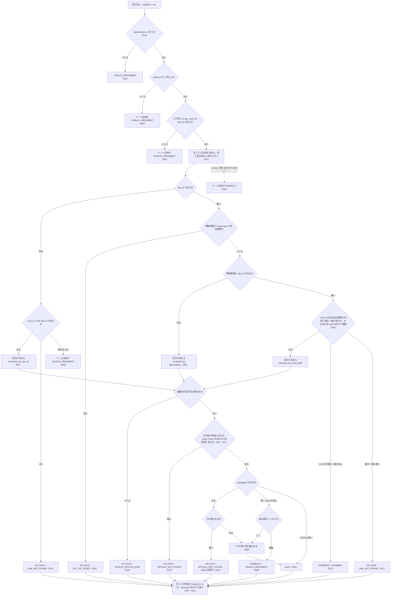

# verify_citations の仕様

<!-- GENERATED FILE — 手で編集しない。本文は houki-egov-mcp の specs/current/verify_citations/spec.md の写し。 -->

::: info
houki-egov-mcp **v0.20.1** の `specs/current/verify_citations/spec.md` から自動生成しました（仕様 ID 48 件・2026-10-10）。手で編集しないでください。再生成は `node scripts/generate-reference.mjs specs` です。
:::

法令の引用のリストをまとめて実在確認する

使いどころ・引数・実測の呼び出し例は、[ツールのページ](/reference/mcp/houki-egov/verify_citations)にあります。

最後に仕様が変わったのは v0.18.0 の「法令名・条・委任先を、確かなときだけ 1 つに決める（段階 5 法令の引き当て）」（2026-10-03 承認）です。それまでの経緯は[承認の履歴](#承認の履歴)にあります。

## 利用者と得られる結果

この機能の利用者と、利用者が渡すもの・得られる結果を示します。

- MCP クライアント（Claude などの LLM、または CLI から呼ぶ人）。回答に添える法令の引用（法令名または `law_id`、条、任意で項・号）の配列を渡して、件ごとに「e-Gov の法令にその条・項・号があるか」の判定を受け取る

## 入力

呼び出すときに渡す値です。

| 引数        | 必須 | 内容                                                   |
| ----------- | ---- | ------------------------------------------------------ |
| `citations` | 必須 | 確かめたい引用の配列。1 件以上 50 件まで。要素は下の表 |
| `at`        | 任意 | 時点。`YYYY-MM-DD` の形（[SPEC-EGOV-VERIFY-CITATIONS-040](#spec-egov-verify-citations-040)）。全件に同じ時点を使う |

`citations` の要素:

| 引数        | 必須                      | 内容                                                                              |
| ----------- | ------------------------- | --------------------------------------------------------------------------------- |
| `law_name`  | `law_id` が無ければ必須   | 法令名または略称。例: `"所得税法"`、`"所法"`                                      |
| `law_id`    | `law_name` が無ければ必須 | e-Gov の law_id。例: `"340AC0000000033"`。`law_name` と両方あれば `law_id` を使う |
| `article`   | 必須                      | 条番号。例: `"30"`、`"30の2"`、`"第三十条の二"`。空文字は不可（042） |
| `paragraph` | 任意                      | 項番号。1 以上の整数（[SPEC-EGOV-VERIFY-CITATIONS-041](#spec-egov-verify-citations-041)）。省くと条までを確かめる |
| `item`      | 任意                      | 号番号。数値（`8`）または文字列（`"8"`・`"8の2"`・`"八の二"`）                    |
| `suppl_index` | 任意                    | 附則の番号。1 以上の整数（[SPEC-EGOV-VERIFY-CITATIONS-047](#spec-egov-verify-citations-047)）。`get_toc` の `suppl_provisions[].index` と同じ番号。渡すと `article` をその附則の中で確かめる。省くと本則の中だけで確かめる（[SPEC-EGOV-VERIFY-CITATIONS-046](#spec-egov-verify-citations-046)） |
| `label`     | 任意                      | 引用元の表示文字列。判定には使わず、応答の `input` にそのまま返す                 |

## 扱わないこと

この機能が意図して扱わないことです。

- 引用した条文が主張を支えるかどうかを判定すること（確かめるのは条・項・号が e-Gov の法令にあるかだけ）
- 条文本文を返すこと（本文は `get_law`）
- 51 件以上の引用を 1 回で確かめること
- 通達・判例など houki-egov の管轄外の文書の引用を確かめること（`OUT_OF_SCOPE` を返すだけ）
- 件ごとに別の時点を指定すること（`at` は全件に同じ時点を使う）

## 処理の流れ

呼び出しを受けてから応答を返すまでに、何をどの順で確かめるかを示す。図の中の番号は「できること」の仕様 ID の末尾 3 桁。

## 仕様項目

この機能の仕様項目を、仕様 ID ごとに並べています。見出しは仕様項目を 1 文で表したもので、条件・応答の細部・例は「詳細」を開くと読めます。仕様 ID はそれぞれ受入テストと対応していて、テストの無い ID があると各リポジトリの CI が止まります。

### SPEC-EGOV-VERIFY-CITATIONS-001 引数の形は inputSchema で確かめる

::: details 詳細
inputSchema は、トップレベルにも `citations` の要素にも `additionalProperties: false` を持ち、`citations` の `maxItems` は 50 である。inputSchema に無い引数（例: `citations` の要素に `note`）を渡すと検証で弾かれ、ツールの処理に進まない。
:::

### SPEC-EGOV-VERIFY-CITATIONS-002 citations が空ならツール全体をエラーにする

::: details 詳細
`citations` が空の配列のときは、件ごとの判定を返さず、ツール全体のエラー `INVALID_ARGUMENT` を返す。`hint` に、`law_name` か `law_id` と `article` を持つ引用を 1 件以上入れるよう書く。
:::

### SPEC-EGOV-VERIFY-CITATIONS-003 law_name と law_id のどちらも無い件があればツール全体をエラーにする

::: details 詳細
`law_name` と `law_id` のどちらも無い件が 1 件でもあるときは、件ごとの判定を返さず、ツール全体のエラー `INVALID_ARGUMENT` を返す。`error` にその件の位置を `citations[1]` の形で挙げる（複数あれば `, ` でつなぐ）。
:::

### SPEC-EGOV-VERIFY-CITATIONS-004 存在しない引用が混ざっていても件ごとの判定を返す

::: details 詳細
存在しない引用・曖昧な引用が混ざっていても、ツール全体はエラーにせず、`results` に入力と同じ数の判定を入力の順に返す。各件は次を持つ。

- `index`: `citations` の中の位置（0 始まり）
- `input`: 渡した引用そのまま（`label` も含む）
- `status`: `found`（指定した粒度まで実在した）/ `not_found`（法令・条・項・号のどれかが無い）/ `ambiguous`（どの法令・どの項を指すか決まらない）
:::

### SPEC-EGOV-VERIFY-CITATIONS-005 found の件に付くもの

::: details 詳細
`status` が `found` の件は次を持つ。`next_actions` は付かない。条文本文は返さない。

| フィールド    | 内容                                                                                                                                                                                                                       |
| ------------- | -------------------------------------------------------------------------------------------------------------------------------------------------------------------------------------------------------------------------- |
| `law`         | `law_id`・`title`（正式名称）・`law_num`（法令番号）・`law_type`・`url`                                                                                                                                                    |
| `resolved_by` | 法令をどう引いたか。`law_id` / `abbreviation` / `exact_title`                                                                                                                                                              |
| `article`     | `num`（e-Gov の形の条番号。例: `"57_2"`）・`label`（例: `"第57条の2"`。附則の条は `"附則(27) 第100条"`）・`caption`（条見出し。例: `"（給与所得者の特定支出の控除の特例）"`）・`suppl_index`（附則の条なら附則の番号、本則の条なら `null`） |
| `paragraph`   | 実在を確かめた項番号（項を確かめたときだけ）                                                                                                                                                                               |
| `item`        | 実在を確かめた号番号（e-Gov の形。例: `"1"`。号を確かめたときだけ）                                                                                                                                                        |

例: `{ law_name: "所得税法", article: "57の2", paragraph: 2, item: 1, label: "所法57の2②一" }` は、`law.law_id: "340AC0000000033"`、`law.law_num: "昭和四十年法律第三十三号"`、`article.num: "57_2"`、`article.suppl_index: null`、`paragraph: 2`、`item: "1"` の `found` になり、`input.label` は `"所法57の2②一"` のまま返る。
:::

### SPEC-EGOV-VERIFY-CITATIONS-006 略称は略称辞書で正式名称に直してから照合する

::: details 詳細
`law_name` が略称辞書にあり、辞書が houki-egov の管轄で `law_id` を持つときは、その法令で照合する。`resolved_by` は `abbreviation`、`law.title` は正式名称である。

例: `{ law_name: "所法", article: "9" }` は `resolved_by: "abbreviation"`、`law.title: "所得税法"` の `found` になる。
:::

### SPEC-EGOV-VERIFY-CITATIONS-007 law_id を書いた件はその法令で照合する

::: details 詳細
`law_id` を書いた件は、e-Gov からその law_id の法令を取って照合する。`resolved_by` は `law_id`。
:::

### SPEC-EGOV-VERIFY-CITATIONS-008 項が 1 つだけの条は、項を書かずに号を指定できる

::: details 詳細
`paragraph` を省いて `item` を指定したとき、その条の項が 1 つだけなら、その項の号として確かめる。`found` の件の `paragraph` は `1` になる。

例: `{ law_id: "340AC0000000033", article: "9", item: 2 }` は `paragraph: 1`、`item: "2"` の `found` になる。
:::

### SPEC-EGOV-VERIFY-CITATIONS-009 項が複数ある条で号だけを指定した件は ambiguous にする

::: details 詳細
`paragraph` を省いて `item` を指定したとき、その条に項が複数あれば、どの項の号か決まらないので `status: "ambiguous"`、`code: "INVALID_ARGUMENT"` を返す。
:::

### SPEC-EGOV-VERIFY-CITATIONS-010 条が無い件は ARTICLE_NOT_FOUND にする

::: details 詳細
法令は決まったがその条が無いときは、`status: "not_found"`、`code: "ARTICLE_NOT_FOUND"` を返す。`article` は付かない。`next_actions` の先頭は `get_toc`（目次で正しい条番号を確かめる案内）である。
:::

### SPEC-EGOV-VERIFY-CITATIONS-011 項が無い件は ARTICLE_NOT_FOUND にし、実在した条は残す

::: details 詳細
条はあるが指定した項が無いときは、`status: "not_found"`、`code: "ARTICLE_NOT_FOUND"` を返す。条は実在したので `article` は付ける。`reason` に `第<項番号>項はありません` を含める。
:::

### SPEC-EGOV-VERIFY-CITATIONS-012 法令名が引けない件は LAW_NOT_FOUND にする

::: details 詳細
`law_name` が略称辞書に `law_id` 付きで無く、e-Gov の法令名に完全一致も部分一致も無いときは、`status: "not_found"`、`code: "LAW_NOT_FOUND"` を返す。
:::

### SPEC-EGOV-VERIFY-CITATIONS-013 法令名が完全一致せず部分一致がある件は ambiguous にして候補を返す

::: details 詳細
`law_name` が e-Gov の法令名に完全一致せず、部分一致する法令があるときは、`status: "ambiguous"` を返し、`candidates` に候補の法令（`law_id`・`title`・`law_num`・`law_type`・`url`）を入れる。この件には `code` を付けない。

例: `{ law_name: "所得税法施行", article: "1" }` は、`candidates` の `title` が `["所得税法施行令", "所得税法施行規則"]` の `ambiguous` になる。
:::

### SPEC-EGOV-VERIFY-CITATIONS-014 houki-egov の管轄外の引用は OUT_OF_SCOPE にする

::: details 詳細
`law_name` が略称辞書で houki-egov 以外の管轄（通達など）と分かるときは、e-Gov を引かず、`status: "not_found"`、`code: "OUT_OF_SCOPE"` を返す。

例: `{ law_name: "消基通", article: "1" }` は `OUT_OF_SCOPE` の `not_found` になる。
:::

### SPEC-EGOV-VERIFY-CITATIONS-015 e-Gov が「その法令が無い」と答えた件は LAW_NOT_FOUND にする

::: details 詳細
`law_id` を書いた件と、法令名で law_id を決めた件で、法令本文の取得に e-Gov が 404・`404004` を返したときは、ツール全体をエラーにせず、その件を `status: "not_found"`、`code: "LAW_NOT_FOUND"` にする。`reason` は、`at` を渡したときは `<law_id、または決めた法令名> は <at> の時点の e-Gov に収録されていません`、渡さないときは `e-Gov に law_id <law_id> の法令がありません`。`next_actions` は [SPEC-EGOV-VERIFY-CITATIONS-027](#spec-egov-verify-citations-027) の `search_law` の 1 件で、`at` を渡し法令名が分かっている件では、その前に `{ action: "get_law_revisions", example: { law_name: <law_name> } }` を置く。

400 は「その法令が無い」ではないので、この件の `LAW_NOT_FOUND` にしない（`400044` は [SPEC-EGOV-VERIFY-CITATIONS-048](#spec-egov-verify-citations-048) のツール全体の `INVALID_ARGUMENT`、そのほかの 400 はツール全体の `SOURCE_API_ERROR`）。

例（2026-10-03 10:12 JST に houki-egov-dev 0.17.0 と e-Gov で確かめた）: `{ citations: [{ law_id: "503AC0000000035", article: "1" }], at: "2018-01-01" }` は、e-Gov が `/law_data/503AC0000000035?asof=2018-01-01` に 404・`404004` を返すので、その件が `code: "LAW_NOT_FOUND"`、`reason: "503AC0000000035 は 2018-01-01 の時点の e-Gov に収録されていません"`（v0.17.0 では `reason: "e-Gov に law_id 503AC0000000035 の法令がありません"`）。`{ law_id: "999AC0000000999", article: "1" }`（`at` なし）は `reason: "e-Gov に law_id 999AC0000000999 の法令がありません"`。
:::

### SPEC-EGOV-VERIFY-CITATIONS-016 summary に件数の内訳と all_found を付ける

::: details 詳細
応答は `results` のほかに次を持つ。

- `summary`: `total`（件数）・`found`・`not_found`・`ambiguous`（status ごとの件数）・`all_found`（全件が `found` のときだけ `true`）
- `method`: `"per_citation_lookup"`

例: 10 件のうち found 3・not_found 5・ambiguous 2 なら `summary` は `{ total: 10, found: 3, not_found: 5, ambiguous: 2, all_found: false }`。2 件とも found なら `{ total: 2, found: 2, not_found: 0, ambiguous: 0, all_found: true }`。
:::

### SPEC-EGOV-VERIFY-CITATIONS-017 同じ法令名が並んでも e-Gov への問い合わせは 1 回にまとめる

::: details 詳細
1 回の呼び出しの中で同じ `law_name` の件が複数あっても、その法令名での e-Gov の法令名検索は 1 回だけ行う。
:::

### SPEC-EGOV-VERIFY-CITATIONS-018 条番号の書き方が読めない件は INVALID_ARTICLE_NUM にする

::: details 詳細
`article` が条番号として読めない書き方（例: 位ごとに並べた漢数字 `"三〇"`）のときは、ツール全体をエラーにせず、その件を `status: "not_found"`、`code: "INVALID_ARTICLE_NUM"` にする。
:::

### SPEC-EGOV-VERIFY-CITATIONS-019 e-Gov に問い合わせられなかったときはツール全体をエラーにする

::: details 詳細
e-Gov に問い合わせられなかったとき（例: 名前解決に失敗して接続できない）は、件ごとの判定を返さず、ツール全体のエラーを返す。接続できないときの `code` は `SOURCE_UNAVAILABLE`、`retryable` は `true`。「問い合わせられなかった」件を `not_found` と書かないためである。
:::

### SPEC-EGOV-VERIFY-CITATIONS-020 応答の note に判定の範囲を書く

::: details 詳細
応答は `note`（文字列）を持つ。`note` には次の 3 つを書く。

- 各件で確かめるのは条（指定があれば項・号）が e-Gov の法令にあるかだけで、引用した条文が主張を支えるかどうかは判定していないこと（`主張を支えるかどうかは判定していません` を含む）
- 法令名が完全一致しなかった件は、部分一致の候補があれば `ambiguous` にして `candidates` に入れ、候補は最大 5 件で `code` を付けないこと（`最大 5 件` と `code は付きません` を含む）
- e-Gov に問い合わせられなかったときは、件ごとの判定ではなくツール全体のエラー（`SOURCE_*`）を返すこと（`SOURCE_*` を含む）

`note` は、件の判定の結果（found・not_found・ambiguous の内訳）によらず同じ文である。
:::

### SPEC-EGOV-VERIFY-CITATIONS-021 応答の meta に取得日時と時点を付ける

::: details 詳細
応答は `meta` を持つ。`meta.retrieved_at` は応答を組み立てた日時で、ISO 8601 の UTC 表記（例: `"2026-09-27T20:31:49.938Z"`）である。`meta.at` は、`at` を渡したときは渡した値をそのまま入れ、`at` を渡さなかったときは `null` にする。`meta` のキーは `at` の有無で変わらない。

例: `{ citations: [{ law_name: "所得税法", article: "9" }], at: "2024-04-01" }` の `meta` は `{ retrieved_at: "<ISO 8601>", at: "2024-04-01" }`。`at` を省くと `meta` は `{ retrieved_at: "<ISO 8601>", at: null }`（v0.16.0 では `{ retrieved_at }` だけだった）。
:::

### SPEC-EGOV-VERIFY-CITATIONS-022 at を渡すと、その時点の本文で条・項・号を確かめる

::: details 詳細
`at` を渡すと、全件について e-Gov にその時点（e-Gov の時点指定に `at` の値）の法令本文を問い合わせ、その本文で条・項・号の有無を判定する。`at` を省くと、時点を指定せずに（現在の本文で）問い合わせる。

例: 所得税法の現在の本文に第57条の2があり、`at: "2000-01-01"` の時点の本文には第57条の2が無く第9条があるとき、`{ citations: [{ law_name: "所得税法", article: "57の2" }, { law_name: "所得税法", article: "9" }], at: "2000-01-01" }` は、1 件目が `status: "not_found"`・`code: "ARTICLE_NOT_FOUND"`・`reason: "所得税法に第57条の2はありません"`、2 件目が `found` になる。同じ 1 件目を `at` なしで渡すと `found` になる。
:::

### SPEC-EGOV-VERIFY-CITATIONS-023 号が無い件は ARTICLE_NOT_FOUND にし、実在した条と項は残す

::: details 詳細
項（または項が 1 つだけの条）はあるが、指定した `item` の号が無いときは、`status: "not_found"`、`code: "ARTICLE_NOT_FOUND"` を返す。条と項は実在したので `article` と `paragraph` を付け、`item` は付けない。`reason` は `<法令名><条のラベル>第<項番号>項に第<号番号>号はありません（号は <その項の号の数> 個）` の形である。

例: 所得税法第57条の2第2項に号が 2 つあるとき、`{ law_name: "所得税法", article: "57の2", paragraph: 2, item: 3 }` は `article.num: "57_2"`、`paragraph: 2`、`reason: "所得税法第57条の2第2項に第3号はありません（号は 2 個）"` の `not_found` になる。項が 1 つだけで号が 2 つの第9条に `{ law_name: "所得税法", article: "9", item: 5 }` を渡すと、`paragraph: 1`、`reason: "所得税法第9条第1項に第5号はありません（号は 2 個）"` になる。
:::

### SPEC-EGOV-VERIFY-CITATIONS-024 号番号の書き方が読めない件は INVALID_ARTICLE_NUM にする

::: details 詳細
`item` が号番号として読めないときは、ツール全体をエラーにせず、その件を `status: "not_found"`、`code: "INVALID_ARTICLE_NUM"` にする。読めないのは、数値の `0`・負の数・小数と、`"8"`・`"8の2"`・`"第8号の2"`・`"八の二"` のどの形でもない文字列である。この件は、実在した条の `article` と項の `paragraph` を付け、`item` は付けない。

例: 項が 1 つだけの所得税法第9条に対し、`item: 0` は `reason: "号番号は 1 以上の整数で指定してください: 0"`、`item: 1.5` は `reason: "号番号は 1 以上の整数で指定してください: 1.5"`、`item: "abc"` は `reason` に `号番号の形式が不正です` を含む `INVALID_ARTICLE_NUM` の `not_found` になる。どれも `article.num: "9"`、`paragraph: 1` を持つ。
:::

### SPEC-EGOV-VERIFY-CITATIONS-025 条・項・号が無い件と条番号・号番号が読めない件の next_actions は get_toc

::: details 詳細
次の件の `next_actions` は `get_toc` の 1 件だけで、`example` は `{ law_name: <引用の law_name。無ければ法令の正式名称> }` である。

- 条が無い件・項が無い件・号が無い件（`code: "ARTICLE_NOT_FOUND"`）
- 条番号が読めない件・号番号が読めない件（`code: "INVALID_ARTICLE_NUM"`）

例: `{ law_name: "所得税法", article: "57の2", paragraph: 5 }`、`{ law_name: "所得税法", article: "57の2", paragraph: 2, item: 3 }`、`{ law_name: "所得税法", article: "三〇" }`、`{ law_name: "所得税法", article: "9", item: "abc" }` の `next_actions` は、どれも `[{ action: "get_toc", example: { law_name: "所得税法" } }]`（`reason` 付き）である。
:::

### SPEC-EGOV-VERIFY-CITATIONS-026 法令名が引けない件の next_actions は resolve_abbreviation と search_law

::: details 詳細
法令名が引けない件（[SPEC-EGOV-VERIFY-CITATIONS-012](#spec-egov-verify-citations-012)、`code: "LAW_NOT_FOUND"`）の `next_actions` は、`resolve_abbreviation`（`example: { abbr: <law_name> }`）、`search_law`（`example: { keyword: <law_name> }`）の順の 2 件である。

例: `{ law_name: "架空法", article: "1" }` の `next_actions` は `[{ action: "resolve_abbreviation", example: { abbr: "架空法" } }, { action: "search_law", example: { keyword: "架空法" } }]`（それぞれ `reason` 付き）。`reason` は `e-Gov に「架空法」という法令名はありません`。
:::

### SPEC-EGOV-VERIFY-CITATIONS-027 部分一致の候補がある件と e-Gov が知らない law_id の件の next_actions は search_law

::: details 詳細
次の件の `next_actions` は `search_law` の 1 件だけである。

- 部分一致の候補がある件（[SPEC-EGOV-VERIFY-CITATIONS-013](#spec-egov-verify-citations-013)）: `example` は `{ keyword: <law_name> }`
- e-Gov が知らない law_id の件（[SPEC-EGOV-VERIFY-CITATIONS-015](#spec-egov-verify-citations-015)）: `example` は `{ keyword: <law_name> }`、`law_name` が無ければ `{ keyword: <law_id> }`。`reason` は `e-Gov に law_id <law_id> の法令がありません`

例: `{ law_name: "所得税法施行", article: "1" }` は `[{ action: "search_law", example: { keyword: "所得税法施行" } }]`、`{ law_id: "999AC0000000999", article: "1" }` は `[{ action: "search_law", example: { keyword: "999AC0000000999" } }]`（それぞれ `reason` 付き）。
:::

### SPEC-EGOV-VERIFY-CITATIONS-028 管轄外の件の next_actions は delegate_to_mcp

::: details 詳細
管轄外の件（[SPEC-EGOV-VERIFY-CITATIONS-014](#spec-egov-verify-citations-014)、`code: "OUT_OF_SCOPE"`）の `next_actions` は `delegate_to_mcp` の 1 件だけで、`example.mcp` に略称辞書が示す管轄の MCP を入れる。`reason`（件の）には管轄の MCP の名前を含める。

例: `{ law_name: "消基通", article: "1" }` の `next_actions` は `[{ action: "delegate_to_mcp", example: { mcp: "houki-nta" } }]`（`reason` 付き）。件の `reason` は `「消費税法基本通達」は houki-nta の管轄です（houki-egov-mcp は法律・政令・省令の本文のみを扱います）`。
:::

### SPEC-EGOV-VERIFY-CITATIONS-029 項が複数ある条で号だけを指定した件の next_actions は add_paragraph

::: details 詳細
項が複数ある条で号だけを指定した件（[SPEC-EGOV-VERIFY-CITATIONS-009](#spec-egov-verify-citations-009)）の `next_actions` は `add_paragraph` の 1 件だけで、`example` は `{ law_name: <引用の law_name。無ければ法令の正式名称>, article: <渡した article そのまま>, paragraph: 1 }` である。この件は実在した条の `article` を付け、`reason` は `<法令名><条のラベル>は項が <項の数> 個あるため、号だけではどの項の号か決まりません` の形である。

例: 項が 2 つある所得税法第57条の2に `{ law_name: "所得税法", article: "57の2", item: 1 }` を渡すと、`next_actions` は `[{ action: "add_paragraph", example: { law_name: "所得税法", article: "57の2", paragraph: 1 } }]`（`reason` 付き）、`reason` は `所得税法第57条の2は項が 2 個あるため、号だけではどの項の号か決まりません`。`{ law_id: "340AC0000000033", article: "57の2", item: 1 }` でも `example.law_name` は `"所得税法"` になる。
:::

### SPEC-EGOV-VERIFY-CITATIONS-030 部分一致の候補は先頭の 5 件までで、reason には全件数を書く

::: details 詳細
法令名が完全一致せず部分一致がある件（[SPEC-EGOV-VERIFY-CITATIONS-013](#spec-egov-verify-citations-013)）の `candidates` は、e-Gov の部分一致の結果の先頭から 5 件までである。`reason` は `「<照合した法令名>」に完全一致する法令名が e-Gov に無く、部分一致が <部分一致の全件数> 件ありました` の形で、6 件以上あっても全件数を書く。

例: e-Gov の部分一致が `検証用テスト法第1` 〜 `検証用テスト法第7` の 7 件を返すとき、`{ law_name: "検証用テスト法", article: "1" }` の `candidates` の `title` は `["検証用テスト法第1", "検証用テスト法第2", "検証用テスト法第3", "検証用テスト法第4", "検証用テスト法第5"]`、`reason` は `「検証用テスト法」に完全一致する法令名が e-Gov に無く、部分一致が 7 件ありました`。
:::

### SPEC-EGOV-VERIFY-CITATIONS-031 law_name と law_id の両方を書いた件は law_id だけで法令を決める

::: details 詳細
`law_name` と `law_id` の両方を書いた件は、`law_id` の法令で照合し、`resolved_by` は `law_id` になる。`law_name` は法令を決めるのに使わず、e-Gov の法令名検索もしない。`law_name` と `law_id` が別の法令を指していても、判定・`reason`・`next_actions` でそのことを知らせない。

例: `{ law_name: "民法", law_id: "340AC0000000033", article: "9" }` は `law.title: "所得税法"`、`resolved_by: "law_id"` の `found` になり、食い違いを示すフィールドは付かない。
:::

### SPEC-EGOV-VERIFY-CITATIONS-032 空白だけの law_name / law_id は無いものとして扱う

::: details 詳細
前後の空白を除くと空になる `law_name` / `law_id` は、書かなかったものとして扱う。

- `law_name` と `law_id` のどちらも空白だけ（または片方が空白だけでもう片方が無い）の件があれば、[SPEC-EGOV-VERIFY-CITATIONS-003](#spec-egov-verify-citations-003) と同じツール全体のエラー `INVALID_ARGUMENT` を返す
- `law_id` が空白だけで `law_name` に値があれば、`law_name` で法令を決める

例: `citations: [{ law_name: "   ", article: "9" }, { law_id: " ", article: "1" }, { law_name: " ", law_id: "  ", article: "1" }]` は、`error` が `law_name と law_id のどちらも無い引用があります: citations[0], citations[1], citations[2]` の `INVALID_ARGUMENT` になる。`{ law_name: "所得税法", law_id: "  ", article: "9" }` は `resolved_by: "abbreviation"` の `found` になる。
:::

### SPEC-EGOV-VERIFY-CITATIONS-033 同じ law_id が並んでも e-Gov への法令本文の問い合わせは 1 回にまとめる

::: details 詳細
1 回の呼び出しの中で同じ `law_id`（同じ `at`）の件が複数あっても、その law_id の法令本文を e-Gov に問い合わせるのは 1 回だけで、法令を決めるのにも条・項・号を確かめるのにもその結果を使う。

例: `citations: [{ law_id: "340AC0000000033", article: "9" }, { law_id: "340AC0000000033", article: "30" }, { law_id: "340AC0000000033", article: "57の2" }]` は、e-Gov への法令本文の問い合わせが `340AC0000000033` の 1 回だけで、3 件とも判定される。
:::

### SPEC-EGOV-VERIFY-CITATIONS-034 e-Gov がタイムアウトしたときはツール全体を SOURCE_TIMEOUT にする

::: details 詳細
e-Gov への問い合わせがタイムアウトしたときは、件ごとの判定（`results`）を返さず、ツール全体のエラー `SOURCE_TIMEOUT`（`retryable: true`）を返す。ほかの件が判定できていても同じである。

例: 法令本文の問い合わせがタイムアウトするとき、`citations: [{ law_name: "所得税法", article: "9" }, { law_name: "架空法", article: "1" }]` は `code: "SOURCE_TIMEOUT"`、`retryable: true` のエラーになり、`results` を持たない。
:::

### SPEC-EGOV-VERIFY-CITATIONS-035 e-Gov が 5xx を返したときはツール全体を SOURCE_API_ERROR にする

::: details 詳細
e-Gov が 5xx（例: 500・503）を返したときは、件ごとの判定を返さず、ツール全体のエラー `SOURCE_API_ERROR`（`retryable: true`）を返す。法令本文の問い合わせでも、法令名の検索でも同じである。

例: 法令本文の問い合わせが 503 を返すとき、`citations: [{ law_name: "所得税法", article: "9" }]` は `code: "SOURCE_API_ERROR"`、`retryable: true`。法令名の検索が 503 を返すとき、`citations: [{ law_name: "架空法", article: "1" }]` も `code: "SOURCE_API_ERROR"` になる。
:::

### SPEC-EGOV-VERIFY-CITATIONS-036 e-Gov が 429 を返したときはツール全体を SOURCE_RATE_LIMITED にする

::: details 詳細
e-Gov が 429 を返したときは、件ごとの判定を返さず、ツール全体のエラー `SOURCE_RATE_LIMITED`（`retryable: true`）を返す。

例: 法令本文の問い合わせが 429 を返すとき、`citations: [{ law_name: "所得税法", article: "9" }]` は `code: "SOURCE_RATE_LIMITED"`、`retryable: true` になる。
:::

### SPEC-EGOV-VERIFY-CITATIONS-037 削除された条をまとめた範囲表記を照合できる

::: details 詳細
`article` に `"534:535"` の形（削除された条をまとめた e-Gov の条番号）を渡すと、e-Gov の条番号が同じ範囲の条として照合する。`found` の件の `article.num` は `"534:535"`、`article.label` は番号の差が 1 なら `"第534条及び第535条"` の形である。範囲の片側が読めない（例: `"534:"`）ときは、[SPEC-EGOV-VERIFY-CITATIONS-018](#spec-egov-verify-citations-018) と同じ `INVALID_ARTICLE_NUM` の `not_found` になる。

例: 民法に e-Gov の条番号 `534:535` の条があるとき、`{ law_name: "民法", article: "534:535" }` は `article: { num: "534:535", label: "第534条及び第535条" }` の `found` になる。`{ law_name: "民法", article: "534" }` は `code: "ARTICLE_NOT_FOUND"`、`reason: "民法に第534条はありません"` の `not_found` になる。`{ law_name: "民法", article: "534:" }` は `INVALID_ARTICLE_NUM` になる。
:::

### SPEC-EGOV-VERIFY-CITATIONS-038 漢数字・全角数字・「第…条」の条番号を e-Gov の形に直して照合する

::: details 詳細
`article` は、半角数字（`"30"`・`"30の2"`）のほか、漢数字（`"三十"`・`"第三十条の二"`）、全角数字（`"３０"`）、「第…条」を付けた形（`"第30条"`）でも、e-Gov の形の条番号に直して照合する。`found` の件の `article.num` は e-Gov の形、`article.label` は `第<数字>条` の形になる。

例: 所得税法に第30条と第30条の2があるとき、`"第三十条の二"` と `"30の2"` は `article: { num: "30_2", label: "第30条の2" }`、`"３０"`・`"第30条"`・`"三十"` は `article.num: "30"`、`article.label: "第30条"` の `found` になる。
:::

### SPEC-EGOV-VERIFY-CITATIONS-039 略称辞書に law_id が無い法令名は e-Gov の法令名との完全一致で照合する

::: details 詳細
`law_name` が略称辞書に無いとき、または辞書にあっても `law_id` を持たない（houki-egov の管轄の）ときは、照合する法令名（辞書にあれば辞書の正式名称、無ければ `law_name` そのもの）で e-Gov の法令名を検索し、法令名が完全一致した法令で照合する。`resolved_by` は `exact_title` で、`law` は e-Gov の検索結果の `law_id`・`title`・`law_num`・`law_type`・`url` を持つ。

例: `電子帳簿保存法` は略称辞書で正式名称 `電子計算機を使用して作成する国税関係帳簿書類の保存方法等の特例に関する法律`（`law_id` 無し）に直り、その名前で e-Gov を検索して、`{ law_name: "電子帳簿保存法", article: "1" }` は `resolved_by: "exact_title"`、`law.law_id: "410AC0000000025"`、`law.law_num: "平成十年法律第二十五号"` の `found` になる。辞書の正式名称そのままの `所得税法施行令`（`law_id` 無し）も `resolved_by: "exact_title"`、`law.law_id: "340CO0000000096"` になる。
:::

### SPEC-EGOV-VERIFY-CITATIONS-040 `at` は `YYYY-MM-DD` の形だけを受け付け、形に合わない値と暦に無い日付は `INVALID_ARGUMENT`

::: details 詳細
`at` は [SPEC-EGOV-COMMON-ERRORS-024](/specs/houki-egov/common_errors#spec-egov-common-errors-024) に従う。tools/list の inputSchema の `at` は `pattern: "^[0-9]{4}-[0-9]{2}-[0-9]{2}$"` を持ち、形に合わない値は inputSchema の検査で `INVALID_ARGUMENT`（`tool: "verify_citations"`、`detail.issues: [{ path: "at", message: "YYYY-MM-DD の形で指定してください" }]`）になる。形は合うが暦に無い日付は、ツールの処理が e-Gov に問い合わせる前に `INVALID_ARGUMENT`（`detail.issues: [{ path: "at", message: "暦に無い日付です" }]`）を返す。

例: `citations: [{ law_name: "民法", article: "709" }], at: "2024/04/01"` は `code: "INVALID_ARGUMENT"`・`detail.issues[0].path: "at"` で、e-Gov への問い合わせは 0 回。`at: "20240401"`・`at: "2024-4-1"` も同じ。`at: "2026-02-30"` は `detail.issues[0].message: "暦に無い日付です"` で、e-Gov への問い合わせは 0 回。`at: "2024-04-01"` は [SPEC-EGOV-VERIFY-CITATIONS-022](#spec-egov-verify-citations-022) のとおり。

`at` の形の誤りはツール全体のエラーで、`results[]` は返さない。
:::

### SPEC-EGOV-VERIFY-CITATIONS-041 `citations[].paragraph` は 1 以上の整数で、0・負の数・小数はツール全体を `INVALID_ARGUMENT` にして法令を取らない

::: details 詳細
tools/list の inputSchema の `citations.items.properties.paragraph` は `type: "integer"`、`minimum: 1` を持つ（[SPEC-EGOV-COMMON-ERRORS-023](/specs/houki-egov/common_errors#spec-egov-common-errors-023)）。どれか 1 件の `paragraph` が 0・負の数・小数・数値でない値なら、inputSchema の検査でツール全体の `INVALID_ARGUMENT`（`tool: "verify_citations"`、`detail.issues[].path` は `citations.<添字>.paragraph`）を返し、件ごとの判定はせず e-Gov に問い合わせない。件ごとの `not_found` は、法令を取った後で項が無いときだけになる。

例: `citations: [{ law_name: "民法", article: "709" }, { law_name: "民法", article: "709", paragraph: 0 }]` は `code: "INVALID_ARGUMENT"`、`detail.issues` は `[{ path: "citations.1.paragraph", message: "1 以上で指定してください" }]` で、`results` は無く、e-Gov への問い合わせは 0 回（v0.15.4 では 2 件目が `not_found` になっていた）。`paragraph: 1.5` は `整数で指定してください`。
:::

### SPEC-EGOV-VERIFY-CITATIONS-042 `citations[].article` が空文字・空白だけのときはツール全体を `INVALID_ARGUMENT` にする

::: details 詳細
`citations.items.properties.article` は inputSchema に `minLength: 1` を持つ（[SPEC-EGOV-COMMON-ERRORS-025](/specs/houki-egov/common_errors#spec-egov-common-errors-025)）。どれか 1 件の `article` が空文字なら、inputSchema の検査でツール全体の `INVALID_ARGUMENT`（`tool: "verify_citations"`、`detail.issues[].path` は `citations.<添字>.article`、`message: "空文字は指定できません"`）を返す。空白だけなら、ツールの処理が e-Gov に問い合わせる前に、[SPEC-EGOV-COMMON-ERRORS-026](/specs/houki-egov/common_errors#spec-egov-common-errors-026) の形のツール全体の `INVALID_ARGUMENT`（`error: "citations[<添字>].article が空です"`、`detail.issues: [{ path: "citations.<添字>.article", message: "空白だけは指定できません" }]`）を返す。`law_name` / `law_id` の空白だけは [SPEC-EGOV-VERIFY-CITATIONS-032](#spec-egov-verify-citations-032) のままである。

例: `citations: [{ law_name: "民法", article: "" }]` は `detail.issues` が `[{ path: "citations.0.article", message: "空文字は指定できません" }]`。`citations: [{ law_name: "民法", article: "709" }, { law_name: "民法", article: " " }]` は `error: "citations[1].article が空です"`、`detail.issues[0].path: "citations.1.article"`。どちらも `code: "INVALID_ARGUMENT"` で `results` は無く、e-Gov への問い合わせは 0 回。
:::

### SPEC-EGOV-VERIFY-CITATIONS-043 e-Gov との通信と関係の無い例外は `SOURCE_*` にせず `INTERNAL_ERROR` にする

::: details 詳細
件ごとの判定の途中で、e-Gov への要求の失敗（[SPEC-EGOV-COMMON-ERRORS-027](/specs/houki-egov/common_errors#spec-egov-common-errors-027) の表）ではない例外が起きたとき（条文の解析の失敗など）は、ツール全体のエラーを `SOURCE_API_ERROR` にせず、[SPEC-EGOV-COMMON-ERRORS-007](/specs/houki-egov/common_errors#spec-egov-common-errors-007) の `INTERNAL_ERROR`（`error` は `内部エラーが発生しました: <例外の文>`、`detail.cause` に例外の文）にする。e-Gov への要求の失敗は今までどおり [SPEC-EGOV-VERIFY-CITATIONS-034](#spec-egov-verify-citations-034)〜036 と [SPEC-EGOV-COMMON-ERRORS-028](/specs/houki-egov/common_errors#spec-egov-common-errors-028)（接続できないとき `SOURCE_UNAVAILABLE`）で、どちらの場合も件ごとの判定（`results`）は返さない。

例: 法令本文の応答を読む処理が `Error("boom")` を投げる状態で `citations: [{ law_name: "所得税法", article: "9" }]` を渡すと、`code: "INTERNAL_ERROR"`、`detail.cause: "boom"` で、`SOURCE_API_ERROR` ではない（v0.15.4 では `SOURCE_API_ERROR`・`retryable: true` だった）。法令本文の取得が 503 のときは今までどおり `SOURCE_API_ERROR`。
:::

### SPEC-EGOV-VERIFY-CITATIONS-044 `law_name` の全角英数字・ダッシュ類・全角空白は半角に揃えてから略称辞書と照合する

::: details 詳細
`law_name` を略称辞書で引くときは、houki-abbreviations の `resolveAbbreviation(name, { normalize: true })` の規則（全角英数字を半角に、ダッシュ類 `－` `‐` `‑` `–` `—` `―` `−` を `-` に、全角チルダを `~` に、全角空白を半角空白にし、前後の空白を除く。大文字と小文字は区別する）で揃えてから照合する。管轄の判定（`OUT_OF_SCOPE`）も同じ規則で引く。辞書に無いときに e-Gov の法令名検索へ渡す値は、前後の空白を除いた渡した値のままで、揃えない。`law_id` を書いた件には関係しない。

例: `citations: [{ law_name: "ＰＬ法", article: "3" }]` は ``law_name: "PL法"` の件と同じ判定（`status: "found"`）`（v0.15.4 では辞書に無い扱いで、e-Gov の法令名検索に `ＰＬ法` を渡して `LAW_NOT_FOUND` だった）。`law_name: "労基法　"`（末尾が全角空白）も `労働基準法` として引く。
:::

### SPEC-EGOV-VERIFY-CITATIONS-045 法令名の完全一致は、部分一致の上位 50 件ではなく全件から探し、`at` を渡したときは法令名の検索にも使う

::: details 詳細
略称辞書に law_id が無い法令名の件（[SPEC-EGOV-VERIFY-CITATIONS-039](#spec-egov-verify-citations-039)）は、[SPEC-EGOV-COMMON-ERRORS-032](/specs/houki-egov/common_errors#spec-egov-common-errors-032) の 2・3 のとおり、e-Gov の法令名検索の全件（`total_count` の件数）の中から題名の完全一致を探す。`at` を渡したときは、その検索に `asof=<at>` を付け、その時点の題名で照合する。完全一致が無く部分一致があるときは、今までどおり件ごとの `ambiguous`（[SPEC-EGOV-VERIFY-CITATIONS-013](#spec-egov-verify-citations-013)・030。候補は先頭 5 件、`reason` の件数は `total_count`）で、ツール全体のエラーにはしない。

例: `{ law_name: "保険法", article: "1" }`（辞書に無い）は、`/laws?law_title=保険法` の 114 件（2026-10-03 10:10 JST）の 78 件目の完全一致 `保険法`（`420AC0000000056`）で照合し、`resolved_by: "exact_title"` の `found` になる。v0.17.0 では上位 50 件の中に無いため、`reason: "「保険法」に完全一致する法令名が e-Gov に無く、部分一致が 50 件ありました"`、`candidates` の先頭が健康保険法の `ambiguous` だった（2026-10-03 10:10 JST に houki-egov-dev 0.17.0 で確かめた。件数も 114 ではなく 50 と書いていた）。
:::

### SPEC-EGOV-VERIFY-CITATIONS-046 `suppl_index` の無い件は本則の中だけで条を確かめ、附則にだけある条番号は ARTICLE_NOT_FOUND にする

::: details 詳細
`suppl_index` を書かない件は、`article` の条を本則（`MainProvision`）の中だけで確かめる。本則に無ければ、附則に同じ番号の条があっても `found` にせず、`status: "not_found"`、`code: "ARTICLE_NOT_FOUND"` にする。同じ番号の条を持つ附則があるときは、`reason` を `<法令名>の本則に第<条>条はありません。附則に同じ番号の条があります: 附則(<n1>) <改正法の法令番号、または 制定時>、…` にし、`next_actions` を [SPEC-EGOV-VERIFY-CITATIONS-025](#spec-egov-verify-citations-025) の `get_toc` の前に、附則ごと（先頭の 5 件まで）の `{ action: "get_law", example: { law_name: <引用の law_name。無ければ法令の正式名称>, article: <渡した article>, suppl_index: <n> } }` にする。

例: `{ law_name: "消費税法", article: "100" }` は `code: "ARTICLE_NOT_FOUND"`、`reason` に `附則(27) 平成八年六月一四日法律第八二号` と `附則(168) 令和八年三月三一日法律第一二号` を含む（2026-10-03 の消費税法）。v0.17.0 では `article: { num: "100", label: "第100条", caption: "（消費税法の一部改正に伴う経過措置）" }` の `found` だった（2026-10-03 10:11 JST に houki-egov-dev 0.17.0 で確かめた）。
:::

### SPEC-EGOV-VERIFY-CITATIONS-047 `suppl_index` を書いた件は、その附則の中で条・項・号を確かめる

::: details 詳細
`citations.items.properties.suppl_index` は inputSchema に `type: "integer"`、`minimum: 1` を持つ（[SPEC-EGOV-COMMON-ERRORS-023](/specs/houki-egov/common_errors#spec-egov-common-errors-023)。0・負の数・小数はツール全体の `INVALID_ARGUMENT`、`detail.issues[].path` は `citations.<添字>.suppl_index`）。`suppl_index` を書いた件は、その番号の附則の中だけで `article` の条を確かめ、項・号は本則の条と同じに確かめる（[SPEC-EGOV-VERIFY-CITATIONS-008](#spec-egov-verify-citations-008)〜011・023）。

- `found` の件の `article.label` は `附則(<n>) 第<条>条`、`article.suppl_index` は `<n>`（[SPEC-EGOV-VERIFY-CITATIONS-005](#spec-egov-verify-citations-005)）
- その番号の附則が無いときは、`status: "not_found"`、`code: "ARTICLE_NOT_FOUND"`、`reason: "<法令名>に附則(<n>)はありません（附則は <本数> 本）"`
- その附則にその条が無いときは、`status: "not_found"`、`code: "ARTICLE_NOT_FOUND"`、`reason: "<法令名>の附則(<n>)に第<条>条はありません"`

例: `{ law_name: "消費税法", article: "100", suppl_index: 27 }` は `article: { num: "100", label: "附則(27) 第100条", caption: "（消費税法の一部改正に伴う経過措置）", suppl_index: 27 }` の `found`。`{ law_name: "消費税法", article: "100", suppl_index: 999 }` は `reason: "消費税法に附則(999)はありません（附則は 168 本）"` の `not_found`（本数は 2026-10-03 の値）。
:::

### SPEC-EGOV-VERIFY-CITATIONS-048 e-Gov が時点を受け付けないと答えたときはツール全体を `INVALID_ARGUMENT` にし、そのほかの 400 はツール全体を `SOURCE_API_ERROR` にする

::: details 詳細
法令本文の取得か法令名の検索に e-Gov が 400・`400044` を返したときは、`at` が全件に共通なので、件ごとの判定（`results`）を返さず、ツール全体のエラー `INVALID_ARGUMENT`（`tool: "verify_citations"`、`detail.issues: [{ path: "at", message: "e-Gov が受け付ける時点の範囲の外です" }]`、`hint` に e-Gov の `message`。[SPEC-EGOV-COMMON-ERRORS-033](/specs/houki-egov/common_errors#spec-egov-common-errors-033)）を返す。`400044` 以外の 400 は、ツール全体のエラー `SOURCE_API_ERROR`（`retryable: false`、`detail.status: 400`）を返す。どちらも、件を `LAW_NOT_FOUND` にしない。

例（2026-10-03 10:12 JST に houki-egov-dev 0.17.0 で確かめた）: `{ citations: [{ law_name: "所得税法", article: "9" }], at: "2000-01-01" }` は `code: "INVALID_ARGUMENT"`、`detail.issues[0].path: "at"` で、`results` を持たない。v0.17.0 では、その件が `code: "LAW_NOT_FOUND"`、`reason: "e-Gov に law_id 340AC0000000033 の法令がありません"` の `not_found` で、所得税法が e-Gov に無いと読める応答だった。
:::

## 検討中のこと

仕様を書き起こしたときに見つかった項目のうち、扱いを Issue で検討しているものです。ここに挙げたことは、今後の版で変わることがあります。開くと、元の仕様書の記述をそのまま読めます。

::: details 仕様書の「未決」の節
初版起こしで見つけた、意図か不具合かを人が決める項目です。決まったら「できること」に ID を振るか、`specs/changes/` の差分にします。

意図か不具合かの判断が要る項目は houki-egov-mcp の Issue に移し、ここには題と Issue の番号だけを残します。今の振る舞いのままでよくテストが無いだけの項目は、受入テストを書いてから「できること」に ID を振ります。

### テストが無い項目

6. **応答の `note` と `meta`。** → [SPEC-EGOV-VERIFY-CITATIONS-020](#spec-egov-verify-citations-020)・[SPEC-EGOV-VERIFY-CITATIONS-021](#spec-egov-verify-citations-021)
7. **`at` で時点を指定したときの判定。** → [SPEC-EGOV-VERIFY-CITATIONS-022](#spec-egov-verify-citations-022)
8. **号が無い件。** → [SPEC-EGOV-VERIFY-CITATIONS-023](#spec-egov-verify-citations-023)
9. **号番号の書き方が読めない件。** → [SPEC-EGOV-VERIFY-CITATIONS-024](#spec-egov-verify-citations-024)
10. **found 以外の件の `next_actions` の中身。** → [SPEC-EGOV-VERIFY-CITATIONS-025](#spec-egov-verify-citations-025)・[SPEC-EGOV-VERIFY-CITATIONS-026](#spec-egov-verify-citations-026)・[SPEC-EGOV-VERIFY-CITATIONS-027](#spec-egov-verify-citations-027)・[SPEC-EGOV-VERIFY-CITATIONS-028](#spec-egov-verify-citations-028)・[SPEC-EGOV-VERIFY-CITATIONS-029](#spec-egov-verify-citations-029)
11. **部分一致の候補は最大 5 件。** → [SPEC-EGOV-VERIFY-CITATIONS-030](#spec-egov-verify-citations-030)
12. **`law_name` と `law_id` の両方を書いた件。** → [SPEC-EGOV-VERIFY-CITATIONS-031](#spec-egov-verify-citations-031)
13. **空白だけの `law_name` / `law_id`。** → [SPEC-EGOV-VERIFY-CITATIONS-032](#spec-egov-verify-citations-032)
14. **同じ `law_id` が並んだとき。** → [SPEC-EGOV-VERIFY-CITATIONS-033](#spec-egov-verify-citations-033)
15. **タイムアウト・5xx・429 のときのツール全体のエラー。** → [SPEC-EGOV-VERIFY-CITATIONS-034](#spec-egov-verify-citations-034)・[SPEC-EGOV-VERIFY-CITATIONS-035](#spec-egov-verify-citations-035)・[SPEC-EGOV-VERIFY-CITATIONS-036](#spec-egov-verify-citations-036)
16. **削除された条をまとめた範囲表記。** → [SPEC-EGOV-VERIFY-CITATIONS-037](#spec-egov-verify-citations-037)
17. **漢数字・全角数字・「第…条」の条番号。** → [SPEC-EGOV-VERIFY-CITATIONS-038](#spec-egov-verify-citations-038)
18. **略称辞書に law_id が無い法令名の完全一致。** → [SPEC-EGOV-VERIFY-CITATIONS-039](#spec-egov-verify-citations-039)
:::

## 承認の履歴

この機能の仕様が、いつ、どの変更で承認されたかを新しい順に並べています。各リポジトリの `npx spec-ids history verify_citations` と同じ内容です。変更の名前から、変更の理由と前後の振る舞いを書いた文書（GitHub）を開けます。

::: details 承認の履歴（8 件）
| 承認日 | 版 | 変更 | 仕様 PR |
|---|---|---|---|
| 2026-10-03 | v0.18.0 | [法令名・条・委任先を、確かなときだけ 1 つに決める（段階 5 法令の引き当て）](https://github.com/shuji-bonji/houki-egov-mcp/blob/v0.20.1/specs/releases/v0.18.0/20261003-law-resolution/proposal.md) | [#95](https://github.com/shuji-bonji/houki-egov-mcp/pull/95) |
| 2026-10-03 | v0.17.0 | [値の無いフィールドを null にし、meta の時点を常に返す（T4 応答の形）](https://github.com/shuji-bonji/houki-egov-mcp/blob/v0.20.1/specs/releases/v0.17.0/20261003-t4-response-shape/proposal.md) | [#91](https://github.com/shuji-bonji/houki-egov-mcp/pull/91) |
| 2026-10-01 | v0.16.0 | [全角・半角・ダッシュ類の揃え方を houki-abbreviations 0.7.0 に一本化する（T3）](https://github.com/shuji-bonji/houki-egov-mcp/blob/v0.20.1/specs/releases/v0.16.0/20261001-t3-normalize/proposal.md) | [#86](https://github.com/shuji-bonji/houki-egov-mcp/pull/86) |
| 2026-10-01 | v0.16.0 | [「見つからない」と「取得元の失敗」の code を分ける（T2）](https://github.com/shuji-bonji/houki-egov-mcp/blob/v0.20.1/specs/releases/v0.16.0/20261001-t2-error-codes/proposal.md) | [#85](https://github.com/shuji-bonji/houki-egov-mcp/pull/85) |
| 2026-10-01 | v0.16.0 | [引数の検査を inputSchema に書き、丸めずに `INVALID_ARGUMENT` にする（T1）](https://github.com/shuji-bonji/houki-egov-mcp/blob/v0.20.1/specs/releases/v0.16.0/20261001-t1-argument-guards/proposal.md) | [#84](https://github.com/shuji-bonji/houki-egov-mcp/pull/84) |
| 2026-09-28 | v0.15.2 | [テストが無いだけの振る舞いに仕様 ID を振る](https://github.com/shuji-bonji/houki-egov-mcp/blob/v0.20.1/specs/releases/v0.15.2/20260928-untested-behaviors/proposal.md) | [#76](https://github.com/shuji-bonji/houki-egov-mcp/pull/76) |
| 2026-09-28 | v0.15.2 | [「未決」のうち判断が要る 85 件を Issue に移す](https://github.com/shuji-bonji/houki-egov-mcp/blob/v0.20.1/specs/releases/v0.15.2/20260928-undecided-to-issues/proposal.md) | [#68](https://github.com/shuji-bonji/houki-egov-mcp/pull/68) |
| 2026-09-28 | — | 初版 | [#50](https://github.com/shuji-bonji/houki-egov-mcp/pull/50) |
:::

## 関連ページ

このページの元になった文書と、あわせて読むページです。

- [houki-egov-mcp の仕様の一覧](/specs/houki-egov/)
- [houki-egov-mcp の解説](/mcp/houki-egov)
- [verify_citations のツールのページ（リファレンス）](/reference/mcp/houki-egov/verify_citations)
- [元の仕様書（GitHub、v0.20.1）](https://github.com/shuji-bonji/houki-egov-mcp/blob/v0.20.1/specs/current/verify_citations/spec.md)
