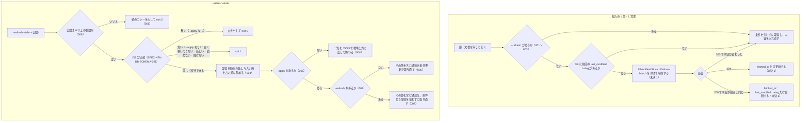

# cli_refresh の仕様

<!-- GENERATED FILE — 手で編集しない。本文は houki-nta-mcp の specs/current/cli_refresh/spec.md の写し。 -->

::: info
houki-nta-mcp **v0.27.0** の `specs/current/cli_refresh/spec.md` から自動生成しました（仕様 ID 7 件・2026-10-09）。手で編集しないでください。再生成は `node scripts/generate-reference.mjs specs` です。
:::

このページは、houki-nta-mcp のコマンドライン「cli_refresh（取り込み済みの通達と文書の取り直し）」の仕様です。「承認の履歴」の前までは、仕様書の本文を言い換えずに写しています。

最後に仕様が変わったのは v0.24.0 の「ローカル DB の版の扱い・作る入口・doc_type の制約・タックスアンサーの索引の保存と、CLI の引数の検査（段階 5 DB と CLI）」（2026-10-04 承認）です。それまでの経緯は[承認の履歴](#承認の履歴)にあります。

## 使う人と受け取るもの

この機能を誰が呼び、何を渡して何を受け取るかを示します。

- 利用者（取り込み済みのローカル DB を持ち、国税庁サイトの改正に追随させたい人）。投入のフラグに `--refresh` を付けて全部取り直すか、`--refresh-stale=<日数>` で古い節を確かめてから `--apply` で取り直す

## 入力

呼び出すときに渡す値です。

| フラグ                   | 必須          | 内容                                                                                                           |
| ------------------------ | ------------- | -------------------------------------------------------------------------------------------------------------- |
| `--refresh`              | 任意          | `--quickstart` / `--bulk-download*` と組み合わせる。条件付き取得を使わず、対象をすべて国税庁サイトから取り直す。`--refresh-stale=<日数> --apply` とも組み合わせられる（[SPEC-NTA-CLI-REFRESH-007](#spec-nta-cli-refresh-007)） |
| `--refresh-stale=<日数>` | どちらか 1 つ | 取得日時が `<日数>` 日より古い通達の節を列挙する（DB は変えない）。`<日数>` は 0 以上の整数（数字だけ。ほかは [SPEC-NTA-CLI-REFRESH-006](#spec-nta-cli-refresh-006)） |
| `--apply`                | 任意          | `--refresh-stale=<日数>` と組み合わせる。列挙した節を含む通達を取り直す                                        |
| `--db-path=<path>`       | 任意          | 対象の DB ファイル（cli_entry）                                                                                |

## できないこと

この機能が引き受けないことです。

- 国税庁サイト側の更新日時だけを確かめて、DB を変えずに「更新があるか」を知ること（`--refresh-stale` は DB の取得日時で古さを見るだけで、国税庁サイトには行かない）
- 文書系 5 種別の古い文書を `--refresh-stale` で列挙・取り直しすること（通達の節だけ。文書系は投入のフラグを再実行する）
- 節を 1 つだけ取り直すこと（`--apply` は節を含む通達全体を取り直す）

## 処理の流れ

投入のフラグに `--refresh` を付けたときの各節・各文書の扱いと、`--refresh-stale` の流れを示します。図の中の番号は「できること」の仕様 ID の末尾 3 桁です。

## 仕様 ID ごとの約束

この機能が守る約束を、仕様 ID ごとに並べています。見出しは約束を 1 文で表したもので、条件・応答の細部・例は「詳細」を開くと読めます。仕様 ID はそれぞれ受入テストと対応していて、テストの無い ID があると各リポジトリの CI が止まります。

### SPEC-NTA-CLI-REFRESH-001 `--refresh` を付けると、通達の投入は条件付き取得を使わずに全部取り直す

::: details 詳細
`--bulk-download --refresh` は、`--tsutatsu` の通達（既定: 消費税法基本通達）を、前回の `last_modified` / `etag` / `content_hash` を使わずに全節取り直して入れ直す。`--bulk-download-all --refresh` は 4 通達すべてにこれを行う。`--refresh` を付けないときは差分更新（[SPEC-NTA-CLI-BULK-DOWNLOAD-002](/specs/houki-nta/cli_bulk_download#spec-nta-cli-bulk-download-002)）である。
:::

### SPEC-NTA-CLI-REFRESH-002 `--refresh` は文書系 5 種別の投入にも効く

::: details 詳細
`--bulk-download-bunshokaitou` / `--bulk-download-jimu-unei` / `--bulk-download-tax-answer` / `--bulk-download-qa` / `--bulk-download-kaisei` に `--refresh` を付けると、その種別の文書を条件付き取得を使わずに全部取り直す。付けないときは差分更新（[SPEC-NTA-CLI-BULK-DOWNLOAD-003](/specs/houki-nta/cli_bulk_download#spec-nta-cli-bulk-download-003)）である（v0.10.3 の文書回答事例で、解析を直しても 304 で入れ直されなかったことへの対応）。
:::

### SPEC-NTA-CLI-REFRESH-003 `--bulk-download-everything --refresh` は 6 種別すべてを取り直す

::: details 詳細
`--bulk-download-everything --refresh` は、通達本体（4 通達）と文書系 5 種別のすべてを、条件付き取得を使わずに取り直す。
:::

### SPEC-NTA-CLI-REFRESH-004 `--refresh-stale=<日数>` は、取得日時が日数より古い通達の節を古い順に列挙する

::: details 詳細
`--refresh-stale=<日数>` は、DB にある通達の節のうち、取得日時（`fetched_at`）が実行時点から `<日数>` 日より前のものを、取得日時の古い順に列挙する。各要素は `formalName`・`abbr`・`rootUrl`・`chapterNumber`・`sectionNumber`・`url`・`fetchedAt` を持つ。`--apply` を付けないときは DB を変えない（dry-run）。該当が無ければ空の配列である。

例: 節の取得日時が 60 日前・45 日前・10 日前・今日の 4 節がある DB で `--refresh-stale=30` を実行すると、60 日前と 45 日前の 2 節を、60 日前の節を先にして列挙する。
:::

### SPEC-NTA-CLI-REFRESH-005 `--refresh-stale=<日数> --apply` で、列挙した節を含む通達を差分更新で取り直す

::: details 詳細
`--refresh-stale=<日数>` に `--apply` を付けると、列挙した節（[SPEC-NTA-CLI-REFRESH-004](#spec-nta-cli-refresh-004)）を含む通達を、重複を除いて 1 つずつ取り直す。`--refresh` を付けないときは差分更新（前に取り込んだ節は条件付き取得で確かめ、304 の節は `fetched_at` だけを更新する。cli_refresh の未決 1）である。304 の節は次の `--refresh-stale=<日数>` では列挙されなくなる。取り直した通達ごとの結果（`formalName`・`status`・`detail`）を JSON で標準出力に出す。`--apply` が無いときは列挙だけ（[SPEC-NTA-CLI-REFRESH-004](#spec-nta-cli-refresh-004)）である。
:::

### SPEC-NTA-CLI-REFRESH-006 `--refresh-stale` の日数が 0 以上の整数でなければ、何もせずに exit 2

::: details 詳細
`--refresh-stale=<日数>` の値が数字だけでできていない（`abc`・`-5`・`1.5`・`+5`・`90d` など）ときは、DB を開かず、国税庁サイトに接続せず、MCP サーバーも起動せずに、標準エラー出力に `[houki-nta-mcp] --refresh-stale="<値>" は使えません。0 以上の整数の日数を指定してください（例: --refresh-stale=90）` を出して終了コード 2 で終わる（[SPEC-NTA-CLI-ENTRY-008](/specs/houki-nta/cli_entry#spec-nta-cli-entry-008) の値の誤り）。`0` は正しい値で、取得日時が実行時点より前の節をすべて列挙する。

例: `houki-nta-mcp --refresh-stale=abc` は上の文を出して終了コード 2（v0.23.x では `--refresh-stale` を指定しなかったものとして扱い、ほかに処理を選ぶフラグが無いので MCP サーバーとして起動した。#106）。
:::

### SPEC-NTA-CLI-REFRESH-007 `--refresh-stale=<日数> --apply --refresh` は、列挙した節を含む通達を条件付き取得を使わずに取り直す

::: details 詳細
`--refresh-stale=<日数> --apply` に `--refresh` を付けると、列挙した節を含む通達を、`--bulk-download --tsutatsu=<その通達> --refresh`（[SPEC-NTA-CLI-REFRESH-001](#spec-nta-cli-refresh-001)）と同じく、前回の `last_modified` / `etag` / `content_hash` を使わずに全節取り直して入れ直す。列挙の規則（[SPEC-NTA-CLI-REFRESH-004](#spec-nta-cli-refresh-004)）と、取り直す通達の決め方（[SPEC-NTA-CLI-REFRESH-005](#spec-nta-cli-refresh-005)）は変わらない。`--apply` の無い `--refresh-stale=<日数> --refresh` は、[SPEC-NTA-CLI-ENTRY-007](/specs/houki-nta/cli_entry#spec-nta-cli-entry-007) の余分な引数のエラーにする（列挙だけでは何も取らないので `--refresh` は効かない）。

例: 消費税法基本通達の節が 60 日前の取得で、国税庁サイトがその節に 304 を返す DB で `--refresh-stale=30 --apply --refresh` を実行すると、その節は 200 で取り直されて入れ直され、`fetched_at`・`last_modified`・`etag` が新しい値になる（v0.23.x では `--refresh` が `--apply` の取り直しに渡らず、304 で `fetched_at` だけが更新された。#109）。
:::

## まだ決めていないこと

仕様を書き起こしたときに見つかった項目のうち、扱いを決めている途中のものです。開くと、元の仕様書の記述をそのまま読めます。

::: details 仕様書の「未決」の節
初版起こしで見つけた、意図か不具合かを人が決める項目です。決まったら「できること」に ID を振るか、`specs/changes/` の差分にします。

意図か不具合かの判断が要る項目は houki-nta-mcp の Issue に移し、ここには題と Issue の番号だけを残します。今の振る舞いのままでよくテストが無いだけの項目は、受入テストを書いてから「できること」に ID を振ります。

1. **差分更新の 3 つの経路。** `--refresh` を付けない投入は、DB に前回の `last_modified` / `etag` があれば `If-Modified-Since` / `If-None-Match` を付けて取得し、304 なら `fetched_at` だけを更新し、200 でも内容の SHA-1 が前回と同じなら `fetched_at`・`last_modified`・`etag` だけを更新し、変わっていれば入れ直す。結果の JSON にはその内訳（通達は `sectionsNotModified` / `sectionsContentSame` / `sectionsContentChanged`、文書系は `documentsNotModified` / `documentsContentSame` / `documentsContentChanged`）が入る。質疑応答事例とタックスアンサーは、DB の行が段落の構造（`structured_json`）を持たないときは条件を付けずに取り直す。テストは、ヘッダーを付ける・304 を受け取るという取得の単位（`src/services/nta-scraper.test.ts`）と、DB の読み書きの単位（`src/services/document-conditional-fetch.test.ts`）にしか無く、投入の結果として確かめたものが無い。ID を振るのは受入テストを書いてから。
5. **`--refresh-stale` の表示。** 標準エラー出力に `[refresh-stale] DB: <DB の場所> (<日数> 日より古い section を対象)`、`[refresh-stale] 該当: <件数> sections`、dry-run なら `[refresh-stale] dry-run（--apply で再 DL を実行）`、`--apply` なら `[refresh-stale] 再 DL 対象通達: <通達名を / で並べたもの>` を出す。テストが無い。ID を振るのは受入テストを書いてから。
:::

## 承認の履歴

この機能の仕様が、いつ、どの変更で承認されたかを新しい順に並べています。各リポジトリの `npx spec-ids history cli_refresh` と同じ内容です。変更の名前から、変更の理由と前後の振る舞いを書いた文書（GitHub）を開けます。

::: details 承認の履歴（4 件）
| 承認日 | 版 | 変更 | 仕様 PR |
|---|---|---|---|
| 2026-10-04 | v0.24.0 | [ローカル DB の版の扱い・作る入口・doc_type の制約・タックスアンサーの索引の保存と、CLI の引数の検査（段階 5 DB と CLI）](https://github.com/shuji-bonji/houki-nta-mcp/blob/v0.27.0/specs/releases/v0.24.0/20261003-db-cli/proposal.md) | [#135](https://github.com/shuji-bonji/houki-nta-mcp/pull/135) |
| 2026-10-03 | v0.23.0 | [hint・next_actions・説明文・CLI の使い方と実際の動きの食い違いを、行ごとに直す（T5 文書と実装の食い違い）](https://github.com/shuji-bonji/houki-nta-mcp/blob/v0.27.0/specs/releases/v0.23.0/20261003-t5-docs-mismatch/proposal.md) | [#126](https://github.com/shuji-bonji/houki-nta-mcp/pull/126) |
| 2026-09-30 | v0.22.0 | [CLI・DB の初版の「未決」のうち判断が要る 12 件を Issue に移す（#75 の続き）](https://github.com/shuji-bonji/houki-nta-mcp/blob/v0.27.0/specs/releases/v0.22.0/20260930-cli-db-undecided-to-issues/proposal.md) | [#114](https://github.com/shuji-bonji/houki-nta-mcp/pull/114) |
| 2026-09-29 | — | 初版 | [#103](https://github.com/shuji-bonji/houki-nta-mcp/pull/103) |
:::

## 関連ページ

このページの元になった文書と、あわせて読むページです。

- [houki-nta-mcp の仕様の一覧](/specs/houki-nta/)
- [houki-nta-mcp の解説](/mcp/houki-nta)
- [元の仕様書（GitHub、v0.27.0）](https://github.com/shuji-bonji/houki-nta-mcp/blob/v0.27.0/specs/current/cli_refresh/spec.md)
