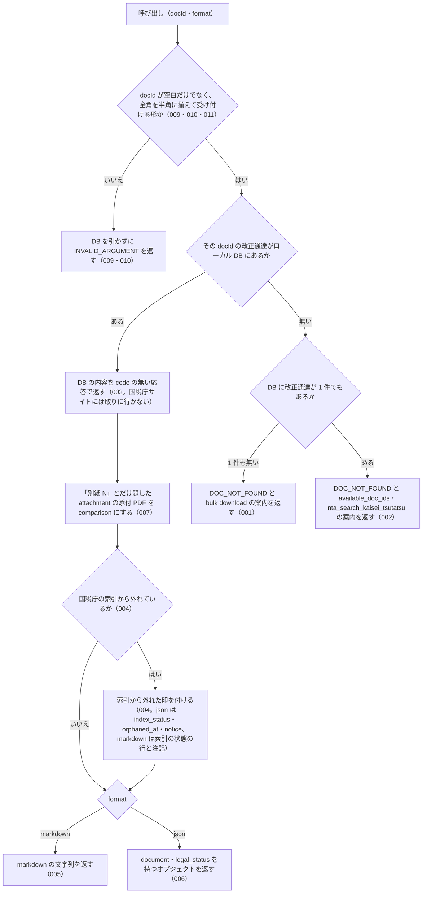

# nta_get_kaisei_tsutatsu の仕様

<!-- GENERATED FILE — 手で編集しない。本文は houki-nta-mcp の specs/current/nta_get_kaisei_tsutatsu/spec.md の写し。 -->

::: info
houki-nta-mcp **v0.27.0** の `specs/current/nta_get_kaisei_tsutatsu/spec.md` から自動生成しました（仕様 ID 11 件・2026-10-10）。手で編集しないでください。再生成は `node scripts/generate-reference.mjs specs` です。
:::

改正通達を docId で 1 件取得する

使いどころ・引数・実測の呼び出し例は、[ツールのページ](/reference/mcp/houki-nta/nta_get_kaisei_tsutatsu)にあります。

最後に仕様が変わったのは v0.26.0 の「ローカル DB を開けないときの読むだけのツールと書き戻すツールの応答、`--bulk-download-tax-answer` が索引を保存できないときの終わり方（nta #144・#145）」（2026-10-06 承認）です。それまでの経緯は[承認の履歴](#承認の履歴)にあります。

## 使う人と受け取るもの

この機能を誰が呼び、何を渡して何を受け取るかを示します。

- MCP クライアント（Claude などの LLM、または CLI から呼ぶ人）。`docId` を渡して、ローカル DB に入れてある改正通達（法令解釈通達の一部改正）1 件の本文と添付 PDF の一覧を受け取る。`docId` は `nta_search_kaisei_tsutatsu` の結果か、このツールのエラーの `available_doc_ids` から得る

## 入力

呼び出すときに渡す値です。

| 引数     | 必須 | 内容                                                                                                                                                            |
| -------- | ---- | --------------------------------------------------------------------------------------------------------------------------------------------------------------- |
| `docId`  | 必須 | 文書 ID。新形式 `"0026003-067"` または旧形式 `"240401"` など。国税庁の改正通達ページの URL から取った値で、`nta_search_kaisei_tsutatsu` の結果の `docId` と同じ。空文字・空白だけは不可（009）。形は 010。全角の数字・ダッシュ類は半角に揃えてから読む（011） |
| `format` | 任意 | `markdown`（既定）または `json`                                                                                                                                 |

## できないこと

この機能が引き受けないことです。

- DB に無い改正通達を国税庁サイトから取ること（改正通達は docId から個別ページの URL を組み立てるのに税目フォルダの世代差を解く必要があるため。DB に入れるのは `houki-nta-mcp --bulk-download-kaisei`）
- 添付 PDF の本文を読むこと（応答には PDF の URL・種別・読み方の案内までを載せる。本文は pdf-reader-mcp などの PDF 読み取りツールに渡す。表を取るときの保存は `nta_inspect_pdf_meta`）
- 改正通達を題名やキーワードから探すこと（探すのは `nta_search_kaisei_tsutatsu`）
- 改正後の基本通達の条項本文を返すこと（条項は `nta_get_tsutatsu`）
- 改正通達が今も有効か、改正後の取扱いが現行かを判定すること

## 処理の流れ

呼び出しを受けてから応答を返すまでに、何をどの順で確かめるかを示します。図の中の番号は「できること」の仕様 ID の末尾 3 桁です。

## 仕様 ID ごとの約束

この機能が守る約束を、仕様 ID ごとに並べています。見出しは約束を 1 文で表したもので、条件・応答の細部・例は「詳細」を開くと読めます。仕様 ID はそれぞれ受入テストと対応していて、テストの無い ID があると各リポジトリの CI が止まります。

### SPEC-NTA-GET-KAISEI-TSUTATSU-001 ローカル DB に改正通達が 1 件も無いときは投入を案内する

::: details 詳細
ローカル DB に改正通達が 1 件も無い（他の種別の文書だけが入っている場合、DB のファイルが無い・版の記録が無い・版が合わない・開けない場合を含む）ときは、エラー `DOC_NOT_FOUND` を返す。国税庁サイトには取りに行かない。応答は次を含む。

- `error`: `ローカル DB に改正通達が 1 件も無いため、docId="<docId>" を取得できません`
- `hint`: DB の状態ごとの文（[SPEC-NTA-DB-SCHEMA-029](/specs/houki-nta/db_schema#spec-nta-db-schema-029)。`<種別>` は `改正通達`、フラグは `--bulk-download-kaisei`）。どの文も開こうとした DB のパスを含む
- `next_actions`: `action` が `cli_bulk_download` の 1 件。`example.command` は `--bulk-download-kaisei` を付けた案内のコマンド（[SPEC-NTA-DB-SCHEMA-027](/specs/houki-nta/db_schema#spec-nta-db-schema-027)）。版が新しい・読めない DB と、開けない DB では入れない（[SPEC-NTA-DB-SCHEMA-021](/specs/houki-nta/db_schema#spec-nta-db-schema-021)・029）
- `tool`: `nta_get_kaisei_tsutatsu`
- `available_doc_ids` は付けない
- 開けない DB では `retryable: false` と `detail.cause` も付ける（[SPEC-NTA-DB-SCHEMA-029](/specs/houki-nta/db_schema#spec-nta-db-schema-029)。v0.25.x では [SPEC-NTA-COMMON-ERRORS-006](/specs/houki-nta/common_errors#spec-nta-common-errors-006) の `INTERNAL_ERROR` だった）

v0.21.3 では code が `TSUTATSU_NOT_FOUND` だった。文書系 3 ツールで `DOC_NOT_FOUND` に揃えた（houki-nta-mcp #64、[SPEC-NTA-COMMON-ERRORS-016](/specs/houki-nta/common_errors#spec-nta-common-errors-016)）。

例: 環境変数を付けずに起動し（ホームディレクトリが `/Users/bonji`）、質疑応答事例だけを入れた DB で `{ docId: "0026003-067" }` を渡すと、`hint` は ``ローカル DB（~/.cache/houki-nta-mcp/cache.db）に改正通達（doc_type="kaisei"）が入っていません。`npx -y @shuji-bonji/houki-nta-mcp@latest --bulk-download-kaisei` で投入してください。…`` で始まり、`next_actions[0].example.command` は `npx -y @shuji-bonji/houki-nta-mcp@latest --bulk-download-kaisei`（v0.24.x では `MCP サーバーが開いている DB（/Users/bonji/.cache/houki-nta-mcp/cache.db）に…` で始まり、コマンドは `houki-nta-mcp --bulk-download-kaisei`）。
:::

### SPEC-NTA-GET-KAISEI-TSUTATSU-002 改正通達はあるが docId が無いときは「見つかりません」と候補を返す

::: details 詳細
ローカル DB に改正通達はあるが、指定した `docId` の文書が無いときは、エラー `DOC_NOT_FOUND` を返す。投入の案内（「未投入」）はしない。応答は次を含む。

- `error`: `改正通達 docId="<docId>" は見つかりません`
- `hint`: DB にある改正通達の件数（例: `DB の改正通達 118 件に、この docId はありません`）と、`available_doc_ids` から選ぶか `nta_search_kaisei_tsutatsu` で検索して docId を確かめる案内、DB を投入した後に公開された文書は `` `<コマンド>` `` をもう一度実行すると取り込める旨。`<コマンド>` は `--bulk-download-kaisei` を付けた案内のコマンド（[SPEC-NTA-DB-SCHEMA-027](/specs/houki-nta/db_schema#spec-nta-db-schema-027)）
- `available_doc_ids`: DB にある改正通達の `docId` / `title` / `issuedAt` を、発出日の新しい順に最大 30 件。改正通達以外の種別の文書は入れない
- `next_actions`: `{ action: "nta_search_kaisei_tsutatsu", reason: "キーワード検索で正しい docId を探せます" }` の 1 件
- `tool`: `nta_get_kaisei_tsutatsu`

v0.21.3 では code が `TSUTATSU_NOT_FOUND` だった。文書系 3 ツールで `DOC_NOT_FOUND` に揃えた（houki-nta-mcp #64、[SPEC-NTA-COMMON-ERRORS-016](/specs/houki-nta/common_errors#spec-nta-common-errors-016)）。

例: 環境変数を付けずに起動すると、`hint` の末尾は ``DB を投入した後に国税庁が公開した文書は、`npx -y @shuji-bonji/houki-nta-mcp@latest --bulk-download-kaisei` をもう一度実行すると取り込めます``（v0.24.x では `houki-nta-mcp --bulk-download-kaisei`）。
:::

### SPEC-NTA-GET-KAISEI-TSUTATSU-003 ローカル DB にある改正通達は DB から返す

::: details 詳細
指定した `docId` の改正通達がローカル DB にある（`--bulk-download-kaisei` で入れた）ときは、エラーではない応答（`code` を持たない応答）を返す。国税庁サイトには取りに行かない。
:::

### SPEC-NTA-GET-KAISEI-TSUTATSU-004 国税庁の索引から消えた文書に印を付け、索引にある文書では印のキーを null にする

::: details 詳細
DB から返す改正通達が国税庁の索引から外れている（bulk download で外れたことを確認した日時が付いている）ときは、応答に印を付ける。

- `format` が `json` のとき: `index_status: "removed_from_index"`、`orphaned_at`（確認した日時。例: `"2026-10-01T00:30:00Z"`）、`notice`（索引から外れている旨と、過去の課税期間では意味を持つ場合があること、現在の取扱いは最新の通達で確かめること、出典 URL が 404 になることがあることの注記）を付ける。`document.orphanedAt` にも同じ日時が入る。索引にある文書では、`index_status`・`orphaned_at`・`notice`・`document.orphanedAt` をどれも `null` にする（キーは無くならない）
- `format` を省くか `markdown` のとき: `- **取得元**` の行（[SPEC-NTA-GET-KAISEI-TSUTATSU-005](#spec-nta-get-kaisei-tsutatsu-005)）の次に `- **索引の状態**: removed_from_index（<確認した日時> に確認）` の行を入れ、空行を挟んで `> ` で始まる注記の行を入れる。索引にある文書では、この行と注記を入れない

注記の文は `nta_get_jimu_unei`（[SPEC-NTA-GET-JIMU-UNEI-004](/specs/houki-nta/nta_get_jimu_unei#spec-nta-get-jimu-unei-004)）と同じである。

例: 索引にある改正通達を `format: "json"` で取ると、`index_status: null`・`orphaned_at: null`・`notice: null`・`document.orphanedAt: null` を持つ（v0.22.0 では `index_status`・`orphaned_at`・`notice` のキーが無かった）。
:::

### SPEC-NTA-GET-KAISEI-TSUTATSU-005 markdown（既定）の応答

::: details 詳細
`format` を省くか `markdown` にしたとき、応答は次の順に並ぶ文字列である。種別の行（`- **種別**`）は無い。

- 見出し `# <題名>`
- `- **発出日**: <発出日>`（DB にあるときだけ）、`- **税目**: <税目>`（DB にあるときだけ）、`` - **docId**: `<docId>` ``、`- **出典**: <国税庁ページの URL>`、`- **取得**: <DB に入れた日時>`、`- **取得元**: ローカル DB（bulk download で取り込んだもの）` の行
- 国税庁の索引から消えた文書では、索引の状態の行と注記（[SPEC-NTA-GET-KAISEI-TSUTATSU-004](#spec-nta-get-kaisei-tsutatsu-004)）
- 宛先・発出者が DB にある文書では `## 宛先・発出者` の節。各行を `> ` で引用する
- `## 本文` の節と本文
- 添付 PDF がある文書では `## 添付 PDF (<件数> 件)` の節（下のとおり。種別は [SPEC-NTA-GET-KAISEI-TSUTATSU-008](#spec-nta-get-kaisei-tsutatsu-008) で補い、[SPEC-NTA-GET-KAISEI-TSUTATSU-007](#spec-nta-get-kaisei-tsutatsu-007) で付け替えた後のもの）
- 最後に `---` と、`*通達は行政内部文書であり、納税者・裁判所への直接的拘束力なし（最高裁 昭和43.12.24）*` の注

添付 PDF がある文書では、`## 本文` の後に `## 添付 PDF (<件数> 件)` の節を置く。節の中身は次のとおり。

- PDF の本文はこのサーバーが読まないことと、pdf-reader-mcp の `read_url` か、`nta_inspect_pdf_meta` を `save: true` で呼んで `extract_tables` に渡す読み方の案内（`>` の引用）
- 種別・タイトル・サイズ・読み方・URL の表。行は種別の順（新旧対照表・別紙・Q&A・参考資料・通知・その他）で、同じ種別の中は DB に入っている順
- `### 読み方` の節。表に現れた種別ごとに 1 行ずつ、その種別の PDF の読み方（`nta_inspect_pdf_meta` の `layout_note` と同じ文。[SPEC-NTA-INSPECT-PDF-META-005](/specs/houki-nta/nta_inspect_pdf_meta#spec-nta-inspect-pdf-meta-005)）

「取得元」の行は `nta_get_jimu_unei`（[SPEC-NTA-GET-JIMU-UNEI-006](/specs/houki-nta/nta_get_jimu_unei#spec-nta-get-jimu-unei-006)）と同じ文で、このツールは DB だけを引くので値は常に `ローカル DB（bulk download で取り込んだもの）` である（v0.22.0 ではこの行が無かった）。
:::

### SPEC-NTA-GET-KAISEI-TSUTATSU-006 json の応答

::: details 詳細
`format` を `json` にしたとき、応答は次のフィールドを持つ。値の無いフィールドは `null` にし、キーは無くさない。

| フィールド | 内容 |
|---|---|
| `document.docType` | `kaisei` |
| `document.docId` / `document.taxonomy` / `document.title` | 文書 ID・税目・題名 |
| `document.issuedAt` / `document.issuer` | 発出日（`YYYY-MM-DD`）と宛先・発出者。DB に無ければ `null` |
| `document.sourceUrl` / `document.fetchedAt` | 出典 URL と DB に入れた日時 |
| `document.orphanedAt` | 索引から消えたことを確認した日時。索引にある文書では `null`（[SPEC-NTA-GET-KAISEI-TSUTATSU-004](#spec-nta-get-kaisei-tsutatsu-004)） |
| `document.fullText` | 本文 |
| `document.attachedPdfs` | 添付 PDF の配列。要素は `title`・`url`・`sizeKb`・`kind`。`kind` は全要素に付く（[SPEC-NTA-GET-KAISEI-TSUTATSU-008](#spec-nta-get-kaisei-tsutatsu-008) で補い、[SPEC-NTA-GET-KAISEI-TSUTATSU-007](#spec-nta-get-kaisei-tsutatsu-007) で付け替えた後のもの）。添付が無ければ空の配列 |
| `index_status` / `orphaned_at` / `notice` | [SPEC-NTA-GET-KAISEI-TSUTATSU-004](#spec-nta-get-kaisei-tsutatsu-004)。索引にある文書では `null` |
| `legal_status` | `binds_citizens: false` / `binds_courts: false` / `binds_tax_office: true` と注 |
| `source` | `db` |

例: 発出日と宛先が DB に無い改正通達では、`document.issuedAt: null`・`document.issuer: null`（v0.22.0 ではどちらのキーも無かった）。
:::

### SPEC-NTA-GET-KAISEI-TSUTATSU-007 「別紙 N」とだけ題した添付 PDF は新旧対照表として返す

::: details 詳細
添付 PDF のうち、`kind` が `attachment` で題名が「別紙」と番号だけのもの（判定は [SPEC-NTA-INSPECT-PDF-META-004](/specs/houki-nta/nta_inspect_pdf_meta#spec-nta-inspect-pdf-meta-004) と同じ。「別紙1」「別紙1（PDF/221KB）」「（別紙2）」「別紙1-2」など）は、応答では `kind` を `comparison` にして返す。json の `document.attachedPdfs` と markdown の表・`### 読み方` の両方に当てはまる。「別紙1 計算明細書」のように別の語を含む題名は `attachment` のまま。DB の内容は書き換えない。

例: 「新旧対照表（PDF/100KB）」（`comparison`）と「別紙1（PDF/221KB）」（`attachment`）を持つ改正通達を `json` で取ると、`document.attachedPdfs` の 2 件目の `kind` は `comparison` になる。
:::

### SPEC-NTA-GET-KAISEI-TSUTATSU-008 kind の無い添付 PDF は題名から kind を決めて返す

::: details 詳細
DB に入っている添付 PDF に `kind` が無い（v0.6.0 期に投入した文書）ときは、題名から `kind` を決めて応答に入れる。判定は `nta_inspect_pdf_meta` の [SPEC-NTA-INSPECT-PDF-META-003](/specs/houki-nta/nta_inspect_pdf_meta#spec-nta-inspect-pdf-meta-003) と同じ（「新旧対照表」「新旧対応表」「対比表」は `comparison`、「Q&A」「質疑応答」「FAQ」は `qa-pdf`、「別紙」「別表」「様式」「付録」「添付資料」は `attachment`、「通知」「お知らせ」「連絡」は `notice`、「参考」「参考資料」「関連資料」は `related`、どれにも当たらなければ `unknown`）。「別紙 N」の付け替え（[SPEC-NTA-GET-KAISEI-TSUTATSU-007](#spec-nta-get-kaisei-tsutatsu-007)）は、決めた `kind` に対して行う。json の `document.attachedPdfs` の全要素に `kind` が付き、markdown の表と `### 読み方` では決めた種別の行になる（「その他」になるのは `unknown` のときだけ）。DB の内容は書き換えない。

例: `kind` の無い「新旧対応表」「参考資料」「別紙1」を持つ改正通達を `json` で取ると、`document.attachedPdfs` の `kind` は順に `comparison`・`related`・`comparison`（「別紙1」は `attachment` と決めた後に 007 で付け替える）。markdown の表には「新旧対照表」と「参考資料」の行があり、「その他」の行は無い。同じ文書を `nta_inspect_pdf_meta` で見たときと `kind` が一致する。
:::

### SPEC-NTA-GET-KAISEI-TSUTATSU-009 docId が空文字・空白だけのときはDBを引かずに `INVALID_ARGUMENT` を返す

::: details 詳細
空文字は inputSchema の `minLength: 1` の検査（[SPEC-NTA-COMMON-ERRORS-013](/specs/houki-nta/common_errors#spec-nta-common-errors-013)）で止まり、`INVALID_ARGUMENT`（`tool: "nta_get_kaisei_tsutatsu"`、`detail.issues: [{ path: "docId", message: "空文字は指定できません" }]`）を返す。空白（半角スペース・全角スペース・タブ・改行）だけのときは、ツールの処理がDBを引く前に、[SPEC-NTA-COMMON-ERRORS-014](/specs/houki-nta/common_errors#spec-nta-common-errors-014) の形の `INVALID_ARGUMENT`（`tool: "nta_get_kaisei_tsutatsu"`、`error: "docId が空です"`、`detail.issues: [{ path: "docId", message: "空白だけは指定できません" }]`、`hint` に`nta_search_kaisei_tsutatsu` の結果の `docId`を渡すよう書く）を返す。

例: `docId: ""` は `code: "INVALID_ARGUMENT"`・`detail.issues[0].message: "空文字は指定できません"`。`docId: "　"`（全角スペース）と `docId: " \n"` は `code: "INVALID_ARGUMENT"`・`error: "docId が空です"`。どれもDBは引かない。
:::

### SPEC-NTA-GET-KAISEI-TSUTATSU-010 `docId` が受け付ける形でないときは DB を引かずに `INVALID_ARGUMENT` を返す

::: details 詳細
`docId` は、国税庁サイトの改正通達のページの URL（`…/kaisei/<フォルダー名>/index.htm`）のフォルダー名で、英小文字・半角の数字・`-` だけからなる、`/` を含まない 1 つの要素である（[SPEC-NTA-COMMON-ERRORS-015](/specs/houki-nta/common_errors#spec-nta-common-errors-015)）。フォルダー名の付け方は年代によって違う（`0026003-067`・`0014720-84`・`240401`・`2606`・`tougou` など）ので、数字の桁数と `-` の位置は確かめない。前後の空白を除き、半角に揃えた（[SPEC-NTA-GET-KAISEI-TSUTATSU-011](#spec-nta-get-kaisei-tsutatsu-011)）値がこの形でないときは、DB を引く前に `INVALID_ARGUMENT`（`tool: "nta_get_kaisei_tsutatsu"`、`error: "docId の形が受け付ける形ではありません: <渡した値>"`、`detail.issues: [{ path: "docId", message: "英小文字・数字・- だけで指定してください（例: 0026003-067、240401）" }]`、`hint` に `nta_search_kaisei_tsutatsu` の結果の `docId` をそのまま渡すよう書く）を返す。`DOC_NOT_FOUND` は、形に合うが DB にその文書が無いときだけになる。

例: `docId: "0026003-067"`・`"240401"`・`"0014720-84"`・`"tougou"` は検査を通り、DB を引く。`docId: "0026003/067"`（`/` を含む）・`"0026003_067"`（`_` を含む）・`"ABC-1"`（英大文字）・`"課消2-11"`（漢字）・`"0026003-067/index.htm"`（`/` と `.` を含む）は `code: "INVALID_ARGUMENT"`・`detail.issues[0].path: "docId"` で、DB は引かない（v0.21.3 では DB を引いてから「見つかりません」の応答になっていた）。
:::

### SPEC-NTA-GET-KAISEI-TSUTATSU-011 `docId` は半角に揃えてから形を確かめる

::: details 詳細
`docId` は、前後の空白を除いた値を houki-abbreviations の `normalizeJpText` の規則（全角英数字を半角に、ダッシュ類 `－` `‐` `‑` `–` `—` `―` `−` を `-` に、全角チルダ `～` `〜` を `~` に、全角空白を半角空白にし、前後の空白を除く。罫線 `─` と長音 `ー` は変えない。大文字と小文字は区別する）で揃えてから、[SPEC-NTA-GET-KAISEI-TSUTATSU-010](#spec-nta-get-kaisei-tsutatsu-010) の形の検査に進む（[SPEC-NTA-SEARCH-RULES-019](/specs/houki-nta/search_rules#spec-nta-search-rules-019)）。揃えた後の値で DB を引き、国税庁サイトの URL を組み立てる。

例: `{ docId: "００２６００３―０６７" }` は `{ docId: "0026003-067" }` と同じ応答（v0.21.3 では全角のまま DB を引いて「見つかりません」だった）。
:::

## まだ決めていないこと

仕様を書き起こしたときに見つかった項目のうち、扱いを決めている途中のものです。開くと、元の仕様書の記述をそのまま読めます。

::: details 仕様書の「未決」の節
初版起こしで見つけた、意図か不具合かを人が決める項目です。決まったら「できること」に ID を振るか、`specs/changes/` の差分にします。

意図か不具合かの判断が要る項目は houki-nta-mcp の Issue に移し、ここには題と Issue の番号だけを残します。今の振る舞いのままでよくテストが無いだけの項目は、受入テストを書いてから「できること」に ID を振ります。
:::

## 承認の履歴

この機能の仕様が、いつ、どの変更で承認されたかを新しい順に並べています。各リポジトリの `npx spec-ids history nta_get_kaisei_tsutatsu` と同じ内容です。変更の名前から、変更の理由と前後の振る舞いを書いた文書（GitHub）を開けます。

::: details 承認の履歴（15 件）
| 承認日 | 版 | 変更 | 仕様 PR |
|---|---|---|---|
| 2026-10-06 | v0.26.0 | [ローカル DB を開けないときの読むだけのツールと書き戻すツールの応答、`--bulk-download-tax-answer` が索引を保存できないときの終わり方（nta #144・#145）](https://github.com/shuji-bonji/houki-nta-mcp/blob/v0.27.0/specs/releases/v0.26.0/20261006-db-failure-paths/proposal.md) | [#152](https://github.com/shuji-bonji/houki-nta-mcp/pull/152) |
| 2026-10-05 | v0.25.0 | [ローカル DB の場所を、応答・起動時のログ・`--status` で確かめられるようにし、保存したタックスアンサーの索引を読めないことをログに残す（nta #138・#137、T6）](https://github.com/shuji-bonji/houki-nta-mcp/blob/v0.27.0/specs/releases/v0.25.0/20261004-db-location/proposal.md) | [#142](https://github.com/shuji-bonji/houki-nta-mcp/pull/142) |
| 2026-10-03 | v0.24.0 | [0.22.0 の取り込みで直し漏れた specs/current の文を、取り込んだ本文に合わせる（#123）](https://github.com/shuji-bonji/houki-nta-mcp/blob/v0.27.0/specs/releases/v0.24.0/20261003-specs-current-catchup/proposal.md) | [#132](https://github.com/shuji-bonji/houki-nta-mcp/pull/132) |
| 2026-10-03 | v0.23.0 | [値の無いフィールドを null にし、検索の結果に発出日と法令時点を揃えて返す（T4 応答の形）](https://github.com/shuji-bonji/houki-nta-mcp/blob/v0.27.0/specs/releases/v0.23.0/20261003-t4-response-shape/proposal.md) | [#125](https://github.com/shuji-bonji/houki-nta-mcp/pull/125) |
| 2026-10-02 | v0.22.0 | [文書系 3 ツールの docId の形を、DB にある実際の値に合わせて緩める（T1 の訂正）](https://github.com/shuji-bonji/houki-nta-mcp/blob/v0.27.0/specs/releases/v0.22.0/20261002-t1-docid-forms/proposal.md) | [#121](https://github.com/shuji-bonji/houki-nta-mcp/pull/121) |
| 2026-10-01 | v0.22.0 | [全角・半角・ダッシュ類の揃え方を houki-abbreviations 0.7.0 に一本化する（T3）](https://github.com/shuji-bonji/houki-nta-mcp/blob/v0.27.0/specs/releases/v0.22.0/20261001-t3-normalize/proposal.md) | [#119](https://github.com/shuji-bonji/houki-nta-mcp/pull/119) |
| 2026-10-01 | v0.22.0 | [「見つからない」と「取得元の失敗」の code を分ける（T2）](https://github.com/shuji-bonji/houki-nta-mcp/blob/v0.27.0/specs/releases/v0.22.0/20261001-t2-error-codes/proposal.md) | [#118](https://github.com/shuji-bonji/houki-nta-mcp/pull/118) |
| 2026-10-01 | v0.22.0 | [引数の検査を inputSchema に書き、丸めずに `INVALID_ARGUMENT` にする（T1）](https://github.com/shuji-bonji/houki-nta-mcp/blob/v0.27.0/specs/releases/v0.22.0/20261001-t1-argument-guards/proposal.md) | [#117](https://github.com/shuji-bonji/houki-nta-mcp/pull/117) |
| 2026-09-30 | v0.21.3 | [DB に入れる値と保存するファイル名の扱いを直す（#73）](https://github.com/shuji-bonji/houki-nta-mcp/blob/v0.27.0/specs/releases/v0.21.3/20260930-nta-73-db-values/proposal.md) | [#104](https://github.com/shuji-bonji/houki-nta-mcp/pull/104) |
| 2026-09-27 | v0.21.1 | [索引から消えた文書の印に、取得系 4 ツールの仕様 ID を振り、検索系 4 ツールのテストを足す](https://github.com/shuji-bonji/houki-nta-mcp/blob/v0.27.0/specs/releases/v0.21.1/20260927-index-status-marks/proposal.md) | [#91](https://github.com/shuji-bonji/houki-nta-mcp/pull/91) |
| 2026-09-27 | v0.21.1 | [取得系ツールと nta_inspect_pdf_meta の応答の形に仕様 ID を振る](https://github.com/shuji-bonji/houki-nta-mcp/blob/v0.27.0/specs/releases/v0.21.1/20260927-get-responses/proposal.md) | [#89](https://github.com/shuji-bonji/houki-nta-mcp/pull/89) |
| 2026-09-27 | v0.21.1 | [引数の検査と、国税庁のページの解析の失敗のエラーに仕様 ID を振る](https://github.com/shuji-bonji/houki-nta-mcp/blob/v0.27.0/specs/releases/v0.21.1/20260927-argument-and-parse-errors/proposal.md) | [#84](https://github.com/shuji-bonji/houki-nta-mcp/pull/84) |
| 2026-09-26 | v0.21.1 | [「未決」のうち判断が要る 45 件を Issue に移す](https://github.com/shuji-bonji/houki-nta-mcp/blob/v0.27.0/specs/releases/v0.21.1/20260926-undecided-to-issues/proposal.md) | [#74](https://github.com/shuji-bonji/houki-nta-mcp/pull/74) |
| 2026-09-26 | v0.21.1 | [全 14 ツールの spec.md に「処理の流れ」の節を足す](https://github.com/shuji-bonji/houki-nta-mcp/blob/v0.27.0/specs/releases/v0.21.1/20260926-processing-flow/proposal.md) | [#63](https://github.com/shuji-bonji/houki-nta-mcp/pull/63) |
| 2026-09-26 | — | 初版 | [#63](https://github.com/shuji-bonji/houki-nta-mcp/pull/63) |
:::

## 関連ページ

このページの元になった文書と、あわせて読むページです。

- [houki-nta-mcp の仕様の一覧](/specs/houki-nta/)
- [houki-nta-mcp の解説](/mcp/houki-nta)
- [nta_get_kaisei_tsutatsu のツールのページ（リファレンス）](/reference/mcp/houki-nta/nta_get_kaisei_tsutatsu)
- [元の仕様書（GitHub、v0.27.0）](https://github.com/shuji-bonji/houki-nta-mcp/blob/v0.27.0/specs/current/nta_get_kaisei_tsutatsu/spec.md)
