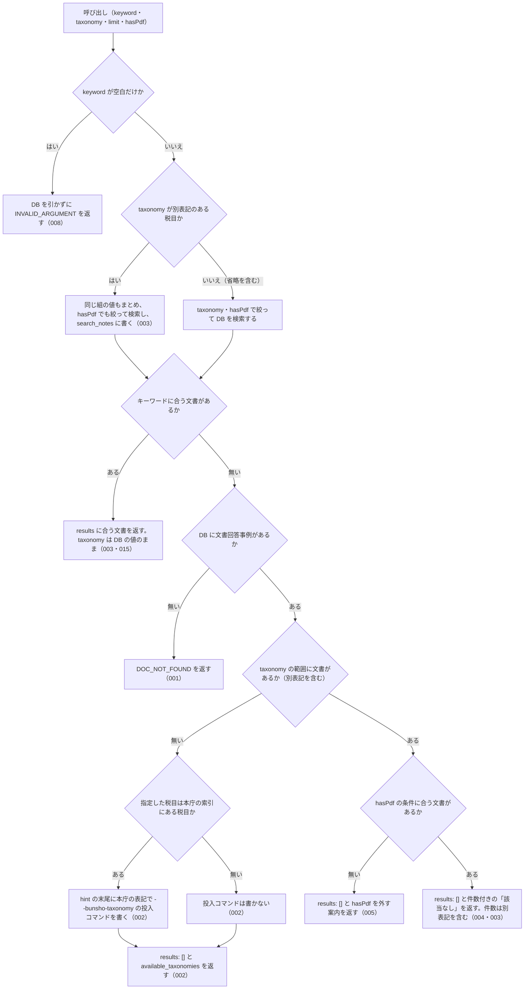

# nta_search_bunshokaitou の仕様

<!-- GENERATED FILE — 手で編集しない。本文は houki-nta-mcp の specs/current/nta_search_bunshokaitou/spec.md の写し。 -->

::: info
houki-nta-mcp **v0.27.0** の `specs/current/nta_search_bunshokaitou/spec.md` から自動生成しました（仕様 ID 8 件・2026-10-10）。手で編集しないでください。再生成は `node scripts/generate-reference.mjs specs` です。
:::

文書回答事例をキーワードで検索する

使いどころ・引数・実測の呼び出し例は、[ツールのページ](/reference/mcp/houki-nta/nta_search_bunshokaitou)にあります。

最後に仕様が変わったのは v0.26.0 の「ローカル DB を開けないときの読むだけのツールと書き戻すツールの応答、`--bulk-download-tax-answer` が索引を保存できないときの終わり方（nta #144・#145）」（2026-10-06 承認）です。それまでの経緯は[承認の履歴](#承認の履歴)にあります。

## 使う人と受け取るもの

この機能を誰が呼び、何を渡して何を受け取るかを示します。

- MCP クライアント（Claude などの LLM、または CLI から呼ぶ人）。`keyword` を渡して、ローカル DB に入っている国税庁の文書回答事例（本庁と国税局の両方）のうちキーワードに合うものの一覧（`docId`・題名・抜粋）を受け取る。本文は `nta_get_bunshokaitou` に `docId` を渡して読む

## 入力

呼び出すときに渡す値です。

| 引数       | 必須 | 内容                                                                                                                                                                                                                                                                    |
| ---------- | ---- | ----------------------------------------------------------------------------------------------------------------------------------------------------------------------------------------------------------------------------------------------------------------------- |
| `keyword`  | 必須 | 検索キーワード。例: `"電子帳簿"`、`"適格請求書"`、`"災害損失"`。空白で区切ると AND 検索。3 文字以上の語を推奨。空文字・空白だけは不可 |
| `taxonomy` | 任意 | 税目フォルダ名（URL のフォルダ名）で絞り込む。例: `"shotoku"` / `"hojin"` / `"sozoku"` / `"gensen"` / `"joto-sanrin"` / `"shohi"` / `"zoyo"` / `"hyoka"` / `"shozei"` / `"sonota"`。国税局のページの別表記（`"souzoku"` / `"gensenshotoku"` / `"joto_sanrin"`）でもよい。列挙で検査せず、DB に無い値は `available_taxonomies` で正しい値を返す（[SPEC-NTA-SEARCH-RULES-018](/specs/houki-nta/search_rules#spec-nta-search-rules-018)） |
| `limit`    | 任意 | 返す件数。既定 10。1 以上 50 以下の整数 |
| `hasPdf`   | 任意 | 添付 PDF の有無で絞り込む。`true` は PDF 付きだけ、`false` は PDF 無しだけ、省略時は絞らない                                                                                                                                                                            |

検索の対象はローカル DB だけである。事前に `houki-nta-mcp --bulk-download-bunshokaitou` で文書回答事例を DB に入れておく必要がある。国税庁サイトには取りに行かない。

## できないこと

この機能が引き受けないことです。

- 文書の本文を返すこと（結果は `docId`・題名・抜粋まで。本文は `nta_get_bunshokaitou`）
- 国税庁サイトに取りに行くこと（DB に無い文書は、`--bulk-download-bunshokaitou` をもう一度実行して取り込む）
- 発出日や国税局で絞り込むこと（絞り込めるのは `taxonomy` と `hasPdf` だけ。国税局の文書は `docId` の先頭（`tokyo/…` など）で見分ける）
- 索引から消えた文書を結果から除くこと（印を付けて返すだけ。未決 5）
- 回答が今の法令でも成り立つかを判定すること（`legal_status` は文書回答事例が個別事案への回答で一般的な法的拘束力を持たないことを示すだけ）

## 処理の流れ

呼び出しを受けてから応答を返すまでに、何をどの順で確かめるかを示します。図の中の番号は「できること」の仕様 ID の末尾 3 桁です。

## 仕様 ID ごとの約束

この機能が守る約束を、仕様 ID ごとに並べています。見出しは約束を 1 文で表したもので、条件・応答の細部・例は「詳細」を開くと読めます。仕様 ID はそれぞれ受入テストと対応していて、テストの無い ID があると各リポジトリの CI が止まります。

### SPEC-NTA-SEARCH-BUNSHOKAITOU-001 文書回答事例が DB に 1 件も無いときは検索できないことをエラーで返す

::: details 詳細
DB に文書回答事例が 1 件も無いとき（DB のファイルが無い・版の記録が無い・版が合わない・開けないときを含む）は、「該当なし」の検索結果ではなく、エラー `DOC_NOT_FOUND` を返す。応答に `results` は付けない。

- `error` は「ローカル DB に文書回答事例が 1 件も無いため、検索できません（「該当なし」という結果ではありません）」
- `tool` は `nta_search_bunshokaitou`
- `hint` は DB の状態ごとの文（[SPEC-NTA-DB-SCHEMA-029](/specs/houki-nta/db_schema#spec-nta-db-schema-029)。`<種別>` は `文書回答事例`、フラグは `--bulk-download-bunshokaitou`）。どの文も開こうとした DB のパスを含む
- `next_actions` の先頭は `action: "cli_bulk_download"`、`example.command` は `--bulk-download-bunshokaitou` を付けた案内のコマンド（[SPEC-NTA-DB-SCHEMA-027](/specs/houki-nta/db_schema#spec-nta-db-schema-027)）。版が新しい・読めない DB と、開けない DB では入れない（[SPEC-NTA-DB-SCHEMA-021](/specs/houki-nta/db_schema#spec-nta-db-schema-021)・029）
- 開けない DB では `retryable: false` と `detail.cause` も付ける（[SPEC-NTA-DB-SCHEMA-029](/specs/houki-nta/db_schema#spec-nta-db-schema-029)。v0.25.x では [SPEC-NTA-COMMON-ERRORS-006](/specs/houki-nta/common_errors#spec-nta-common-errors-006) の `INTERNAL_ERROR` だった）

他の種別の文書（質疑応答事例など）だけが DB にあっても、文書回答事例が無ければこのエラーになる。

例: 環境変数を付けずに起動し（ホームディレクトリが `/Users/bonji`）、0 バイトの `~/.cache/houki-nta-mcp/cache.db` で `{ keyword: "適格請求書" }` を渡すと、`hint` は ``ローカル DB（~/.cache/houki-nta-mcp/cache.db）にはまだ何も投入されていません。`npx -y @shuji-bonji/houki-nta-mcp@latest --bulk-download-bunshokaitou` で文書回答事例を投入してください``（v0.24.x では `MCP サーバーが開いている DB（/Users/bonji/.cache/houki-nta-mcp/cache.db）に文書回答事例（doc_type="bunshokaitou"）が入っていません。…`）。
:::

### SPEC-NTA-SEARCH-BUNSHOKAITOU-002 税目の範囲に文書が無いときは税目の一覧と投入コマンドを案内する

::: details 詳細
DB に文書回答事例はあるが、`taxonomy` で絞った範囲（別表記を含む。[SPEC-NTA-SEARCH-BUNSHOKAITOU-003](#spec-nta-search-bunshokaitou-003)）に 1 件も無いときは、エラーにせず `results: []` を返す。

- `hint` に、DB の文書回答事例の件数と、`taxonomy="<指定した値>"` の文書が無いこと、`taxonomy` を外すか `available_taxonomies` の値を指定するよう書く
- `available_taxonomies` に、DB の文書回答事例が持つ税目の値の一覧を入れる（別表記もそのまま入る）。例: `["souzoku", "sozoku", "zoyo"]`
- 指定した税目が本庁の索引にある税目（`shotoku` / `gensen` / `joto-sanrin` / `sozoku` / `zoyo` / `hyoka` / `hojin` / `shohi` / `shozei` / `sonota`、またはその別表記）なら、`hint` の末尾に追加の投入コマンドを書く。コマンドは `--bulk-download-bunshokaitou --bunsho-taxonomy=<本庁の表記>` を付けた案内のコマンド（[SPEC-NTA-DB-SCHEMA-027](/specs/houki-nta/db_schema#spec-nta-db-schema-027)）。国税局の別表記で指定したときは本庁の表記に直して書く（`gensenshotoku` → `--bunsho-taxonomy=gensen`）
- 本庁の索引に無い値（例: `zzz`）で指定したときは、投入コマンドは書かない（`available_taxonomies` は付ける）

例: 環境変数を付けずに起動し、`sozoku` と `zoyo` の文書だけがある DB で `{ keyword: "贈与", taxonomy: "gensenshotoku" }` を渡すと、`hint` の末尾は `` `npx -y @shuji-bonji/houki-nta-mcp@latest --bulk-download-bunshokaitou --bunsho-taxonomy=gensen` で追加できます``（v0.24.x では `houki-nta-mcp --bulk-download-bunshokaitou --bunsho-taxonomy=gensen`）。
:::

### SPEC-NTA-SEARCH-BUNSHOKAITOU-003 税目の別表記をまとめて検索し、その旨を search_notes に書く

::: details 詳細
国税局のページは本庁と違う税目フォルダ名を使うことがあるので、`taxonomy` に次の組のどれかの値を指定したときは、同じ組の値を持つ文書をまとめて検索する。組のどちらの値で指定しても結果は同じである。

| 税目               | 本庁の表記    | 国税局の別表記  |
| ------------------ | ------------- | --------------- |
| 相続税             | `sozoku`      | `souzoku`       |
| 源泉所得税         | `gensen`      | `gensenshotoku` |
| 譲渡所得・山林所得 | `joto-sanrin` | `joto_sanrin`   |

- 結果の各要素の `taxonomy` は DB に入っている値のまま（`sozoku` で検索しても、国税局の文書は `souzoku` で返る）
- まとめて検索したときは、`search_notes` に「`taxonomy="sozoku"` は、同じ税目の別表記 `"souzoku"` の文書もまとめて検索しました」という趣旨の 1 行を入れる
- 別表記の無い税目（例: `zoyo`）や `taxonomy` を省いたときは、この行は入れない（他に注記が無ければ `search_notes` 自体を付けない）
- キーワードに合う文書が無いとき（[SPEC-NTA-SEARCH-BUNSHOKAITOU-004](#spec-nta-search-bunshokaitou-004)）の `hint` の件数も、別表記の文書を含めて数える
:::

### SPEC-NTA-SEARCH-BUNSHOKAITOU-004 キーワードに合う文書が無いときは件数付きの「該当なし」を返す

::: details 詳細
DB に文書回答事例があり、`taxonomy` と `hasPdf` の範囲にも文書はあるが、キーワードに合うものが無いときは、エラーにせず `results: []` を返す。`hint` は「該当なし。DB の文書回答事例（<絞り込みの条件>）<件数> 件に「&lt;keyword>」に合う文書はありません。別のキーワードで試してください」の形で、件数は絞り込んだ範囲の件数である。

例: `taxonomy: "sozoku"` で DB に `sozoku` 1 件・`souzoku` 1 件があるとき、`hint` は「該当なし。DB の文書回答事例（taxonomy="sozoku"）2 件に「量子暗号通信」に合う文書はありません。別のキーワードで試してください」。絞り込みを指定しなければ「（…）」の部分は付かず、`hasPdf` を指定すれば `hasPdf=true` のように条件に加わる。
:::

### SPEC-NTA-SEARCH-BUNSHOKAITOU-005 `hasPdf` の条件に合う文書が無いときは `hasPdf` を外すよう案内する

::: details 詳細
`taxonomy` の範囲（別表記を含む。`taxonomy` を省いたときは DB の文書回答事例全体）には文書があるが、`hasPdf` の条件に合う文書が 1 件も無いときは、エラーにせず `results: []` を返す。

- `hint` は `DB の文書回答事例（taxonomy="<指定した値>"）<件数> 件に、PDF 付きの文書はありません。hasPdf を外して検索してください`。`hasPdf: false` なら「PDF 無しの文書はありません」。`taxonomy` を省いたときは `（taxonomy="…"）` の部分を書かない。件数は別表記を含めた `taxonomy` の範囲の件数
- `keyword` と `legal_status` も付く

[SPEC-NTA-SEARCH-BUNSHOKAITOU-002](#spec-nta-search-bunshokaitou-002)（税目の範囲に文書が無い）に当たるときは、そちらを返す。
:::

### SPEC-NTA-SEARCH-BUNSHOKAITOU-006 0 件のときの `freshness` は、0 件の理由ごとに範囲を変える

::: details 詳細
0 件のとき（[SPEC-NTA-SEARCH-BUNSHOKAITOU-002](#spec-nta-search-bunshokaitou-002)・004・005）の `freshness`（形は [SPEC-NTA-SEARCH-RULES-017](/specs/houki-nta/search_rules#spec-nta-search-rules-017)）は、次の範囲で判定する。

- 税目の範囲に文書が無いとき（002）: DB の文書回答事例全体
- `hasPdf` の条件に合う文書が無いとき（005）と、キーワードに合う文書が無いとき（004）: `taxonomy` で絞った範囲（別表記を含む）。`hasPdf` では絞らない。`taxonomy` を省いたときは DB の文書回答事例全体
:::

### SPEC-NTA-SEARCH-BUNSHOKAITOU-007 `limit` は 1 以上 50 以下の整数で、範囲の外は `INVALID_ARGUMENT` にして丸めない

::: details 詳細
tools/list の inputSchema の `limit` は `type: "integer"`、`minimum: 1`、`maximum: 50` を持つ（[SPEC-NTA-COMMON-ERRORS-012](/specs/houki-nta/common_errors#spec-nta-common-errors-012)）。0・負の数・小数・51 以上・数値でない値を渡すと、inputSchema の検査で `INVALID_ARGUMENT`（`tool: "nta_search_bunshokaitou"`、`detail.issues[0].path: "limit"`）を返し、DB を引かない。1 件や 50 件に丸めたり、切り捨てたりしない。既定の 10 件は変えない。

例: `{ keyword: "適格請求書", limit: 0 }` は `code: "INVALID_ARGUMENT"`、`detail.issues` は `[{ path: "limit", message: "1 以上で指定してください" }]` で、DB は引かない（v0.21.3 では 1 件に丸めていた）。`limit: 100` は `[{ path: "limit", message: "50 以下で指定してください" }]`（v0.21.3 では 50 件）。`limit: 2.5` と `limit: "10"` は `整数で指定してください`。`limit: 50` は検査を通り、最大 50 件を返す。
:::

### SPEC-NTA-SEARCH-BUNSHOKAITOU-008 keyword が空文字・空白だけのときはDBを引かずに `INVALID_ARGUMENT` を返す

::: details 詳細
空文字は inputSchema の `minLength: 1` の検査（[SPEC-NTA-COMMON-ERRORS-013](/specs/houki-nta/common_errors#spec-nta-common-errors-013)）で止まり、`INVALID_ARGUMENT`（`tool: "nta_search_bunshokaitou"`、`detail.issues: [{ path: "keyword", message: "空文字は指定できません" }]`）を返す。空白（半角スペース・全角スペース・タブ・改行）だけのときは、ツールの処理がDBを引く前に、[SPEC-NTA-COMMON-ERRORS-014](/specs/houki-nta/common_errors#spec-nta-common-errors-014) の形の `INVALID_ARGUMENT`（`tool: "nta_search_bunshokaitou"`、`error: "keyword が空です"`、`detail.issues: [{ path: "keyword", message: "空白だけは指定できません" }]`、`hint` に探したい語を渡すよう書く）を返す。

例: `keyword: ""` は `code: "INVALID_ARGUMENT"`・`detail.issues[0].message: "空文字は指定できません"`。`keyword: "　"`（全角スペース）と `keyword: " \n"` は `code: "INVALID_ARGUMENT"`・`error: "keyword が空です"`。どれもDBは引かない。

v0.21.3 では空の `keyword` に `results: []` と「該当なし」の `hint`（[SPEC-NTA-SEARCH-BUNSHOKAITOU-004](#spec-nta-search-bunshokaitou-004) の形）を返していたが、空の `keyword` は探していないので、004 の対象から外れる。
:::

## まだ決めていないこと

仕様を書き起こしたときに見つかった項目のうち、扱いを決めている途中のものです。開くと、元の仕様書の記述をそのまま読めます。

::: details 仕様書の「未決」の節
初版起こしで見つけた、意図か不具合かを人が決める項目です。決まったら「できること」に ID を振るか、`specs/changes/` の差分にします。

意図か不具合かの判断が要る項目は houki-nta-mcp の Issue に移し、ここには題と Issue の番号だけを残します。今の振る舞いのままでよくテストが無いだけの項目は、受入テストを書いてから「できること」に ID を振ります。
:::

## 承認の履歴

この機能の仕様が、いつ、どの変更で承認されたかを新しい順に並べています。各リポジトリの `npx spec-ids history nta_search_bunshokaitou` と同じ内容です。変更の名前から、変更の理由と前後の振る舞いを書いた文書（GitHub）を開けます。

::: details 承認の履歴（11 件）
| 承認日 | 版 | 変更 | 仕様 PR |
|---|---|---|---|
| 2026-10-06 | v0.26.0 | [ローカル DB を開けないときの読むだけのツールと書き戻すツールの応答、`--bulk-download-tax-answer` が索引を保存できないときの終わり方（nta #144・#145）](https://github.com/shuji-bonji/houki-nta-mcp/blob/v0.27.0/specs/releases/v0.26.0/20261006-db-failure-paths/proposal.md) | [#152](https://github.com/shuji-bonji/houki-nta-mcp/pull/152) |
| 2026-10-05 | v0.25.0 | [ローカル DB の場所を、応答・起動時のログ・`--status` で確かめられるようにし、保存したタックスアンサーの索引を読めないことをログに残す（nta #138・#137、T6）](https://github.com/shuji-bonji/houki-nta-mcp/blob/v0.27.0/specs/releases/v0.25.0/20261004-db-location/proposal.md) | [#142](https://github.com/shuji-bonji/houki-nta-mcp/pull/142) |
| 2026-10-03 | v0.24.0 | [0.22.0 の取り込みで直し漏れた specs/current の文を、取り込んだ本文に合わせる（#123）](https://github.com/shuji-bonji/houki-nta-mcp/blob/v0.27.0/specs/releases/v0.24.0/20261003-specs-current-catchup/proposal.md) | [#132](https://github.com/shuji-bonji/houki-nta-mcp/pull/132) |
| 2026-10-01 | v0.22.0 | [引数の検査を inputSchema に書き、丸めずに `INVALID_ARGUMENT` にする（T1）](https://github.com/shuji-bonji/houki-nta-mcp/blob/v0.27.0/specs/releases/v0.22.0/20261001-t1-argument-guards/proposal.md) | [#117](https://github.com/shuji-bonji/houki-nta-mcp/pull/117) |
| 2026-09-27 | v0.21.1 | [索引から消えた文書の印に、取得系 4 ツールの仕様 ID を振り、検索系 4 ツールのテストを足す](https://github.com/shuji-bonji/houki-nta-mcp/blob/v0.27.0/specs/releases/v0.21.1/20260927-index-status-marks/proposal.md) | [#91](https://github.com/shuji-bonji/houki-nta-mcp/pull/91) |
| 2026-09-27 | v0.21.1 | [絞り込んで 0 件になったときの応答と、`freshness` の段階に仕様 ID を振る](https://github.com/shuji-bonji/houki-nta-mcp/blob/v0.27.0/specs/releases/v0.21.1/20260927-search-zero-hits/proposal.md) | [#90](https://github.com/shuji-bonji/houki-nta-mcp/pull/90) |
| 2026-09-27 | v0.21.1 | [キーワードの扱い（短い語・略称と通称の展開・全角の揃え方）を、検索系 6 ツールの応答として確かめる](https://github.com/shuji-bonji/houki-nta-mcp/blob/v0.27.0/specs/releases/v0.21.1/20260927-search-keyword-rules/proposal.md) | [#86](https://github.com/shuji-bonji/houki-nta-mcp/pull/86) |
| 2026-09-27 | v0.21.1 | [検索でヒットしたときの応答の形に仕様 ID を振る](https://github.com/shuji-bonji/houki-nta-mcp/blob/v0.27.0/specs/releases/v0.21.1/20260927-search-hit-responses/proposal.md) | [#85](https://github.com/shuji-bonji/houki-nta-mcp/pull/85) |
| 2026-09-26 | v0.21.1 | [「未決」のうち判断が要る 45 件を Issue に移す](https://github.com/shuji-bonji/houki-nta-mcp/blob/v0.27.0/specs/releases/v0.21.1/20260926-undecided-to-issues/proposal.md) | [#74](https://github.com/shuji-bonji/houki-nta-mcp/pull/74) |
| 2026-09-26 | v0.21.1 | [全 14 ツールの spec.md に「処理の流れ」の節を足す](https://github.com/shuji-bonji/houki-nta-mcp/blob/v0.27.0/specs/releases/v0.21.1/20260926-processing-flow/proposal.md) | [#63](https://github.com/shuji-bonji/houki-nta-mcp/pull/63) |
| 2026-09-26 | — | 初版 | [#63](https://github.com/shuji-bonji/houki-nta-mcp/pull/63) |
:::

## 関連ページ

このページの元になった文書と、あわせて読むページです。

- [houki-nta-mcp の仕様の一覧](/specs/houki-nta/)
- [houki-nta-mcp の解説](/mcp/houki-nta)
- [nta_search_bunshokaitou のツールのページ（リファレンス）](/reference/mcp/houki-nta/nta_search_bunshokaitou)
- [元の仕様書（GitHub、v0.27.0）](https://github.com/shuji-bonji/houki-nta-mcp/blob/v0.27.0/specs/current/nta_search_bunshokaitou/spec.md)
