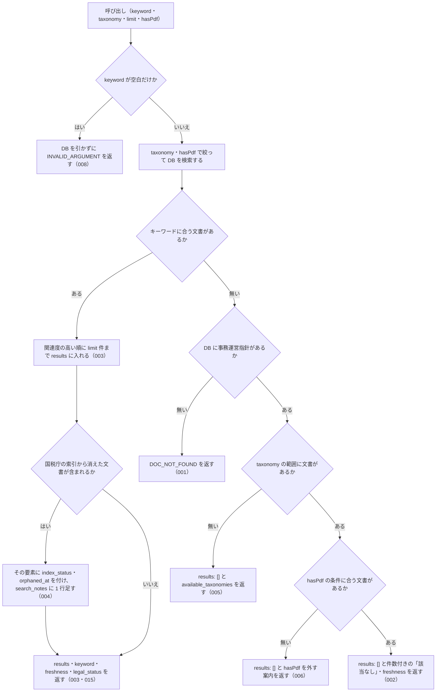

# nta_search_jimu_unei の仕様

<!-- GENERATED FILE — 手で編集しない。本文は houki-nta-mcp の specs/current/nta_search_jimu_unei/spec.md の写し。 -->

::: info
houki-nta-mcp **v0.27.0** の `specs/current/nta_search_jimu_unei/spec.md` から自動生成しました（仕様 ID 8 件・2026-10-10）。手で編集しないでください。再生成は `node scripts/generate-reference.mjs specs` です。
:::

事務運営指針をキーワードで検索する

使いどころ・引数・実測の呼び出し例は、[ツールのページ](/reference/mcp/houki-nta/nta_search_jimu_unei)にあります。

最後に仕様が変わったのは v0.26.0 の「ローカル DB を開けないときの読むだけのツールと書き戻すツールの応答、`--bulk-download-tax-answer` が索引を保存できないときの終わり方（nta #144・#145）」（2026-10-06 承認）です。それまでの経緯は[承認の履歴](#承認の履歴)にあります。

## 利用者と得られる結果

この機能の利用者と、利用者が渡すもの・得られる結果を示します。

- MCP クライアント（Claude などの LLM、または CLI から呼ぶ人）。`keyword` を渡して、ローカル DB に入っている国税庁の事務運営指針のうちキーワードに合うものの一覧（`docId`・題名・抜粋）を受け取り、`nta_get_jimu_unei` で本文を読む前の当たりを付ける

## 入力

呼び出すときに渡す値です。

| 引数       | 必須 | 内容                                                                                                                                                                    |
| ---------- | ---- | ----------------------------------------------------------------------------------------------------------------------------------------------------------------------- |
| `keyword`  | 必須 | 検索キーワード。例: `"書面添付"`、`"重加算税"`。空白で区切ると全部の語を含む文書を探す（AND）。3 文字以上の語を推奨。2 文字の語は本文の部分一致で補い、1 文字の語は外す。空文字・空白だけは不可 |
| `taxonomy` | 任意 | 税目フォルダで絞る。例: `"shotoku"` / `"hojin"` / `"sozoku"` / `"shohi"`。列挙で検査せず、DB に無い値は `available_taxonomies` で正しい値を返す（[SPEC-NTA-SEARCH-RULES-018](/specs/houki-nta/search_rules#spec-nta-search-rules-018)） |
| `limit`    | 任意 | 返す件数。既定 10。1 以上 50 以下の整数 |
| `hasPdf`   | 任意 | 添付 PDF の有無で絞る。`true` = PDF 付きだけ、`false` = PDF 無しだけ、省略 = 絞らない                                                                                   |

検索するのはローカル DB だけである。DB には `houki-nta-mcp --bulk-download-jimu-unei` で入れる。この呼び出しで国税庁サイトには取りに行かない。

## 扱わないこと

この機能が意図して扱わないことです。

- 国税庁サイトに取りに行くこと（DB に無い文書は `--bulk-download-jimu-unei` で入れてから検索する）
- 事務運営指針の本文を返すこと（本文は `nta_get_jimu_unei` に `docId` を渡して読む）
- 添付 PDF の中身を検索すること（`hasPdf` は PDF の有無で絞るだけ。PDF の中身は `nta_inspect_pdf_meta` と pdf-reader-mcp で読む）
- キーワードに合う文書の総数を返すこと（`results` は `limit` 件まで。件数を書くのは 0 件のときの `hint` だけ）
- 改正通達・文書回答事例・質疑応答事例を一緒に検索すること（種別ごとに別のツール）
- 事務運営指針が今も有効かを判定すること（`index_status` は国税庁の索引に載っているかどうかを表すだけ）

## 処理の流れ

呼び出しを受けてから応答を返すまでに、何をどの順で確かめるかを示します。図の中の番号は「できること」の仕様 ID の末尾 3 桁です。

## 仕様項目

この機能の仕様項目を、仕様 ID ごとに並べています。見出しは仕様項目を 1 文で表したもので、条件・応答の細部・例は「詳細」を開くと読めます。仕様 ID はそれぞれ受入テストと対応していて、テストの無い ID があると各リポジトリの CI が止まります。

### SPEC-NTA-SEARCH-JIMU-UNEI-001 DB に事務運営指針が 1 件も無いときはエラー DOC_NOT_FOUND を返す

::: details 詳細
ローカル DB に事務運営指針が 1 件も入っていないとき（DB のファイルが無い・版の記録が無い・版が合わない・開けないときを含む）は、キーワードに関わらずエラー `DOC_NOT_FOUND` を返す。「該当なし」の結果（[SPEC-NTA-SEARCH-JIMU-UNEI-002](#spec-nta-search-jimu-unei-002)）とは応答の形で区別できる（`results` が無い）。応答は次を持つ。

| フィールド | 内容 |
| --- | --- |
| `error` | `ローカル DB に事務運営指針が 1 件も無いため、検索できません（「該当なし」という結果ではありません）` |
| `code` | `DOC_NOT_FOUND` |
| `hint` | DB の状態ごとの文（[SPEC-NTA-DB-SCHEMA-029](/specs/houki-nta/db_schema#spec-nta-db-schema-029)。`<種別>` は `事務運営指針`、フラグは `--bulk-download-jimu-unei`）。どの文も開こうとした DB のパスを含む |
| `next_actions` | 1 件。`action: "cli_bulk_download"`、`example.command` は `--bulk-download-jimu-unei` を付けた案内のコマンド（[SPEC-NTA-DB-SCHEMA-027](/specs/houki-nta/db_schema#spec-nta-db-schema-027)）。版が新しい・読めない DB と、開けない DB では入れない（[SPEC-NTA-DB-SCHEMA-021](/specs/houki-nta/db_schema#spec-nta-db-schema-021)・029） |
| `tool` | `nta_search_jimu_unei` |
| `retryable`・`detail` | 開けない DB だけ `retryable: false` と `detail.cause`（[SPEC-NTA-DB-SCHEMA-029](/specs/houki-nta/db_schema#spec-nta-db-schema-029)。v0.25.x では [SPEC-NTA-COMMON-ERRORS-006](/specs/houki-nta/common_errors#spec-nta-common-errors-006) の `INTERNAL_ERROR` だった） |

例: 環境変数を付けずに起動し（ホームディレクトリが `/Users/bonji`）、`~/.cache/houki-nta-mcp/cache.db` が無いときに `{ keyword: "書面添付" }` を渡すと、`hint` は ``ローカル DB（~/.cache/houki-nta-mcp/cache.db）がありません。`npx -y @shuji-bonji/houki-nta-mcp@latest --bulk-download-jimu-unei` で事務運営指針を投入してください``、`next_actions[0].example.command` は `npx -y @shuji-bonji/houki-nta-mcp@latest --bulk-download-jimu-unei`（v0.24.x では `MCP サーバーが開いている DB（/Users/bonji/.cache/houki-nta-mcp/cache.db）に事務運営指針（doc_type="jimu-unei"）が入っていません。…` で、コマンドは `houki-nta-mcp --bulk-download-jimu-unei`）。
:::

### SPEC-NTA-SEARCH-JIMU-UNEI-002 事務運営指針はあるがキーワードに合わないときは成功で「該当なし」を返す

::: details 詳細
DB に事務運営指針が 1 件以上あり、キーワードに合う文書が無いときは、エラーにせず次の応答を返す。

| フィールド     | 内容                                                                                                                                                                                                                                                         |
| -------------- | ------------------------------------------------------------------------------------------------------------------------------------------------------------------------------------------------------------------------------------------------------------ |
| `results`      | `[]`                                                                                                                                                                                                                                                         |
| `keyword`      | 渡された `keyword`                                                                                                                                                                                                                                           |
| `hint`         | `該当なし。DB の事務運営指針 <件数> 件に「<keyword>」に合う文書はありません。別のキーワードで試してください`。`taxonomy` や `hasPdf` を渡していたときは、件数の前に `（taxonomy="shotoku"、hasPdf=true）` のように条件を書き、件数はその条件で絞った数になる |
| `freshness`    | DB に入れた日時の範囲（`oldest_fetched_at` / `newest_fetched_at` / `staleness` / `days_since_oldest`。古いときは `warning`）。`taxonomy` を渡していたときはその税目の範囲                                                                                    |
| `search_notes` | 短い語を補った・外したなどの注記があるときだけ付く                                                                                                                                                                                                           |
| `legal_status` | `binds_citizens: false` / `binds_courts: false` / `binds_tax_office: true` と、`note: "通達・事務運営指針は行政内部文書であり、納税者・裁判所には直接的拘束力なし。ただし税務署員は職務として守る義務あり（最高裁 昭和43.12.24）"`。`nta_get_jimu_unei` の json の `legal_status`（[SPEC-NTA-GET-JIMU-UNEI-005](/specs/houki-nta/nta_get_jimu_unei#spec-nta-get-jimu-unei-005)）と同じ値 |

例: 事務運営指針が 1 件だけ入っている DB を `keyword: "滞納処分"` で検索すると、`code` は無く、`hint` は `該当なし。DB の事務運営指針 1 件に「滞納処分」に合う文書はありません。別のキーワードで試してください` になり、`legal_status.note` は `通達・事務運営指針は行政内部文書であり、` で始まる（v0.23.0 では `通達は行政内部文書。` で始まる、基本通達・改正通達と同じ文だった）。キーワードに合う文書があるとき（[SPEC-NTA-SEARCH-JIMU-UNEI-003](#spec-nta-search-jimu-unei-003)）の `legal_status` も同じ値。
:::

### SPEC-NTA-SEARCH-JIMU-UNEI-003 キーワードに合う事務運営指針を results に返す

::: details 詳細
キーワードに合う文書があるときは、関連度の高い順に `limit` 件まで `results` に入れて返す。応答は次を持つ。

| フィールド     | 内容                                                                                                                                                                                                                                                                                                    |
| -------------- | ------------------------------------------------------------------------------------------------------------------------------------------------------------------------------------------------------------------------------------------------------------------------------------------------------- |
| `keyword`      | 渡された `keyword`                                                                                                                                                                                                                                                                                      |
| `results[]`    | 1 件につき `docType`（`jimu-unei`）・`docId`（`nta_get_jimu_unei` に渡す文書 ID。例: `shotoku/shinkoku/170331`）・`taxonomy`・`title`・`issuedAt`・`sourceUrl`・`snippet`（キーワードの前後を切り出し、合った語を `<b>` で囲んだ抜粋）・`score`（関連度）・`scoreReasons`（関連度の理由の文字列の配列） |
| `freshness`    | DB に入れた日時の範囲（[SPEC-NTA-SEARCH-JIMU-UNEI-002](#spec-nta-search-jimu-unei-002) と同じ形）                                                                                                                                                                                                                                         |
| `search_notes` | 注記があるときだけ付く                                                                                                                                                                                                                                                                                  |
| `legal_status` | [SPEC-NTA-SEARCH-JIMU-UNEI-002](#spec-nta-search-jimu-unei-002) と同じ                                                                                                                                                                                                                                                                    |

`results` には `total` のような全件数は付けない（返した件数が `results.length`）。
:::

### SPEC-NTA-SEARCH-JIMU-UNEI-004 国税庁の索引から消えた文書は除外せず、印と注記を付ける

::: details 詳細
DB にはあるが国税庁の索引から消えた（bulk download の再実行で索引に無いことを確かめた）文書は、キーワードに合えば `results` から除外しない。過去の課税期間の判断に使えるようにするためである。その文書の要素には `index_status: "removed_from_index"` と `orphaned_at`（索引から消えたことを最初に確かめた日時。例: `2026-10-01T00:30:00Z`）を付ける。索引にある文書にはこの 2 つを付けない。

`results` に 1 件でもそのような文書があるときは、`search_notes` に `検索結果 <件数> 件のうち <消えた件数> 件は国税庁の索引から外れています（\`index_status: "removed_from_index"\`）。…` の 1 行を足す。注記には、現在の取扱いは最新の通達で確かめること、出典 URL が 404 になることがあることを書く。

例: 索引にある文書 A と索引から消えた文書 B の両方に合うキーワードで検索すると、`results` は A・B の 2 件。A には `index_status` が無く、B には `index_status: "removed_from_index"` と `orphaned_at` が付き、`search_notes` に「2 件のうち 1 件」を含む行が入る。
:::

### SPEC-NTA-SEARCH-JIMU-UNEI-005 `taxonomy` の範囲に文書が無いときは税目の一覧を返す

::: details 詳細
DB に事務運営指針はあるが、`taxonomy` で絞った範囲に文書が 1 件も無いときは、エラーにせず次を返す。

- `results`: `[]`
- `keyword`: 渡した `keyword`
- `hint`: `DB の事務運営指針 <件数> 件のうち、taxonomy="<値>" の文書はありません。taxonomy を外すか、available_taxonomies の値を指定してください。`。事務運営指針には税目を絞って投入するフラグが無いので、投入コマンドの案内は書かない
- `available_taxonomies`: DB の事務運営指針が持つ税目の一覧（昇順）
- `freshness`: DB の事務運営指針全体の取得時点（形は [SPEC-NTA-SEARCH-RULES-017](/specs/houki-nta/search_rules#spec-nta-search-rules-017)）
- `legal_status`: 通達の位置付け（`binds_tax_office: true`）

例: `shotoku` の事務運営指針 2 件だけがある DB で `{ keyword: "源泉徴収", taxonomy: "hojin" }` を渡すと、`hint` は `DB の事務運営指針 2 件のうち、taxonomy="hojin" の文書はありません。taxonomy を外すか、available_taxonomies の値を指定してください。`、`available_taxonomies` は `["shotoku"]` になる。
:::

### SPEC-NTA-SEARCH-JIMU-UNEI-006 `hasPdf` の条件に合う文書が無いときは `hasPdf` を外すよう案内する

::: details 詳細
`taxonomy` の範囲（省いたときは DB の事務運営指針全体）には文書があるが、`hasPdf` の条件に合う文書が 1 件も無いときは、エラーにせず次を返す。

- `results`: `[]`
- `keyword`: 渡した `keyword`
- `hint`: `DB の事務運営指針（taxonomy="<値>"）<件数> 件に、PDF 付きの文書はありません。hasPdf を外して検索してください`。`hasPdf: false` なら「PDF 無しの文書はありません」。`taxonomy` を省いたときは `（taxonomy="…"）` の部分を書かない
- `freshness`: `taxonomy` で絞った範囲の取得時点（`hasPdf` では絞らない）
- `legal_status`

0 件の理由は [SPEC-NTA-SEARCH-JIMU-UNEI-001](#spec-nta-search-jimu-unei-001) → 005 → 006 → 002 の順に決める。先に当てはまった理由の応答を返す。
:::

### SPEC-NTA-SEARCH-JIMU-UNEI-007 `limit` は 1 以上 50 以下の整数で、範囲の外は `INVALID_ARGUMENT` にして丸めない

::: details 詳細
tools/list の inputSchema の `limit` は `type: "integer"`、`minimum: 1`、`maximum: 50` を持つ（[SPEC-NTA-COMMON-ERRORS-012](/specs/houki-nta/common_errors#spec-nta-common-errors-012)）。0・負の数・小数・51 以上・数値でない値を渡すと、inputSchema の検査で `INVALID_ARGUMENT`（`tool: "nta_search_jimu_unei"`、`detail.issues[0].path: "limit"`）を返し、DB を引かない。1 件や 50 件に丸めたり、切り捨てたりしない。既定の 10 件は変えない。

例: `{ keyword: "書面添付", limit: 0 }` は `code: "INVALID_ARGUMENT"`、`detail.issues` は `[{ path: "limit", message: "1 以上で指定してください" }]` で、DB は引かない（v0.21.3 では 1 件に丸めていた）。`limit: 100` は `[{ path: "limit", message: "50 以下で指定してください" }]`（v0.21.3 では 50 件）。`limit: 2.5` と `limit: "10"` は `整数で指定してください`。`limit: 50` は検査を通り、最大 50 件を返す。
:::

### SPEC-NTA-SEARCH-JIMU-UNEI-008 keyword が空文字・空白だけのときはDBを引かずに `INVALID_ARGUMENT` を返す

::: details 詳細
空文字は inputSchema の `minLength: 1` の検査（[SPEC-NTA-COMMON-ERRORS-013](/specs/houki-nta/common_errors#spec-nta-common-errors-013)）で止まり、`INVALID_ARGUMENT`（`tool: "nta_search_jimu_unei"`、`detail.issues: [{ path: "keyword", message: "空文字は指定できません" }]`）を返す。空白（半角スペース・全角スペース・タブ・改行）だけのときは、ツールの処理がDBを引く前に、[SPEC-NTA-COMMON-ERRORS-014](/specs/houki-nta/common_errors#spec-nta-common-errors-014) の形の `INVALID_ARGUMENT`（`tool: "nta_search_jimu_unei"`、`error: "keyword が空です"`、`detail.issues: [{ path: "keyword", message: "空白だけは指定できません" }]`、`hint` に探したい語を渡すよう書く）を返す。

例: `keyword: ""` は `code: "INVALID_ARGUMENT"`・`detail.issues[0].message: "空文字は指定できません"`。`keyword: "　"`（全角スペース）と `keyword: " \n"` は `code: "INVALID_ARGUMENT"`・`error: "keyword が空です"`。どれもDBは引かない。

v0.21.3 では空の `keyword` に `results: []` と「該当なし」の `hint`（[SPEC-NTA-SEARCH-JIMU-UNEI-002](#spec-nta-search-jimu-unei-002) の形）を返していたが、空の `keyword` は探していないので、002 の対象から外れる。
:::

## 検討中のこと

仕様を書き起こしたときに見つかった項目のうち、扱いを Issue で検討しているものです。ここに挙げたことは、今後の版で変わることがあります。開くと、元の仕様書の記述をそのまま読めます。

::: details 仕様書の「未決」の節
初版起こしで見つけた、意図か不具合かを人が決める項目です。決まったら「できること」に ID を振るか、`specs/changes/` の差分にします。

意図か不具合かの判断が要る項目は houki-nta-mcp の Issue に移し、ここには題と Issue の番号だけを残します。今の振る舞いのままでよくテストが無いだけの項目は、受入テストを書いてから「できること」に ID を振ります。
:::

## 承認の履歴

この機能の仕様が、いつ、どの変更で承認されたかを新しい順に並べています。各リポジトリの `npx spec-ids history nta_search_jimu_unei` と同じ内容です。変更の名前から、変更の理由と前後の振る舞いを書いた文書（GitHub）を開けます。

::: details 承認の履歴（12 件）
| 承認日 | 版 | 変更 | 仕様 PR |
|---|---|---|---|
| 2026-10-06 | v0.26.0 | [ローカル DB を開けないときの読むだけのツールと書き戻すツールの応答、`--bulk-download-tax-answer` が索引を保存できないときの終わり方（nta #144・#145）](https://github.com/shuji-bonji/houki-nta-mcp/blob/v0.27.0/specs/releases/v0.26.0/20261006-db-failure-paths/proposal.md) | [#152](https://github.com/shuji-bonji/houki-nta-mcp/pull/152) |
| 2026-10-05 | v0.25.0 | [ローカル DB の場所を、応答・起動時のログ・`--status` で確かめられるようにし、保存したタックスアンサーの索引を読めないことをログに残す（nta #138・#137、T6）](https://github.com/shuji-bonji/houki-nta-mcp/blob/v0.27.0/specs/releases/v0.25.0/20261004-db-location/proposal.md) | [#142](https://github.com/shuji-bonji/houki-nta-mcp/pull/142) |
| 2026-10-03 | v0.24.0 | [国税庁サイトから取る経路（通信の失敗の code・タックスアンサーの URL と 8xxx 帯）と、事務運営指針の legal_status.note（段階 5）](https://github.com/shuji-bonji/houki-nta-mcp/blob/v0.27.0/specs/releases/v0.24.0/20261003-source-paths/proposal.md) | [#134](https://github.com/shuji-bonji/houki-nta-mcp/pull/134) |
| 2026-10-03 | v0.24.0 | [0.22.0 の取り込みで直し漏れた specs/current の文を、取り込んだ本文に合わせる（#123）](https://github.com/shuji-bonji/houki-nta-mcp/blob/v0.27.0/specs/releases/v0.24.0/20261003-specs-current-catchup/proposal.md) | [#132](https://github.com/shuji-bonji/houki-nta-mcp/pull/132) |
| 2026-10-01 | v0.22.0 | [引数の検査を inputSchema に書き、丸めずに `INVALID_ARGUMENT` にする（T1）](https://github.com/shuji-bonji/houki-nta-mcp/blob/v0.27.0/specs/releases/v0.22.0/20261001-t1-argument-guards/proposal.md) | [#117](https://github.com/shuji-bonji/houki-nta-mcp/pull/117) |
| 2026-09-27 | v0.21.1 | [絞り込んで 0 件になったときの応答と、`freshness` の段階に仕様 ID を振る](https://github.com/shuji-bonji/houki-nta-mcp/blob/v0.27.0/specs/releases/v0.21.1/20260927-search-zero-hits/proposal.md) | [#90](https://github.com/shuji-bonji/houki-nta-mcp/pull/90) |
| 2026-09-27 | v0.21.1 | [キーワードの扱い（短い語・略称と通称の展開・全角の揃え方）を、検索系 6 ツールの応答として確かめる](https://github.com/shuji-bonji/houki-nta-mcp/blob/v0.27.0/specs/releases/v0.21.1/20260927-search-keyword-rules/proposal.md) | [#86](https://github.com/shuji-bonji/houki-nta-mcp/pull/86) |
| 2026-09-27 | v0.21.1 | [検索でヒットしたときの応答の形に仕様 ID を振る](https://github.com/shuji-bonji/houki-nta-mcp/blob/v0.27.0/specs/releases/v0.21.1/20260927-search-hit-responses/proposal.md) | [#85](https://github.com/shuji-bonji/houki-nta-mcp/pull/85) |
| 2026-09-27 | v0.21.1 | [引数の検査と、国税庁のページの解析の失敗のエラーに仕様 ID を振る](https://github.com/shuji-bonji/houki-nta-mcp/blob/v0.27.0/specs/releases/v0.21.1/20260927-argument-and-parse-errors/proposal.md) | [#84](https://github.com/shuji-bonji/houki-nta-mcp/pull/84) |
| 2026-09-26 | v0.21.1 | [「未決」のうち判断が要る 45 件を Issue に移す](https://github.com/shuji-bonji/houki-nta-mcp/blob/v0.27.0/specs/releases/v0.21.1/20260926-undecided-to-issues/proposal.md) | [#74](https://github.com/shuji-bonji/houki-nta-mcp/pull/74) |
| 2026-09-26 | v0.21.1 | [全 14 ツールの spec.md に「処理の流れ」の節を足す](https://github.com/shuji-bonji/houki-nta-mcp/blob/v0.27.0/specs/releases/v0.21.1/20260926-processing-flow/proposal.md) | [#63](https://github.com/shuji-bonji/houki-nta-mcp/pull/63) |
| 2026-09-26 | — | 初版 | [#63](https://github.com/shuji-bonji/houki-nta-mcp/pull/63) |
:::

## 関連ページ

このページの元になった文書と、あわせて読むページです。

- [houki-nta-mcp の仕様の一覧](/specs/houki-nta/)
- [houki-nta-mcp の解説](/mcp/houki-nta)
- [nta_search_jimu_unei のツールのページ（リファレンス）](/reference/mcp/houki-nta/nta_search_jimu_unei)
- [元の仕様書（GitHub、v0.27.0）](https://github.com/shuji-bonji/houki-nta-mcp/blob/v0.27.0/specs/current/nta_search_jimu_unei/spec.md)
