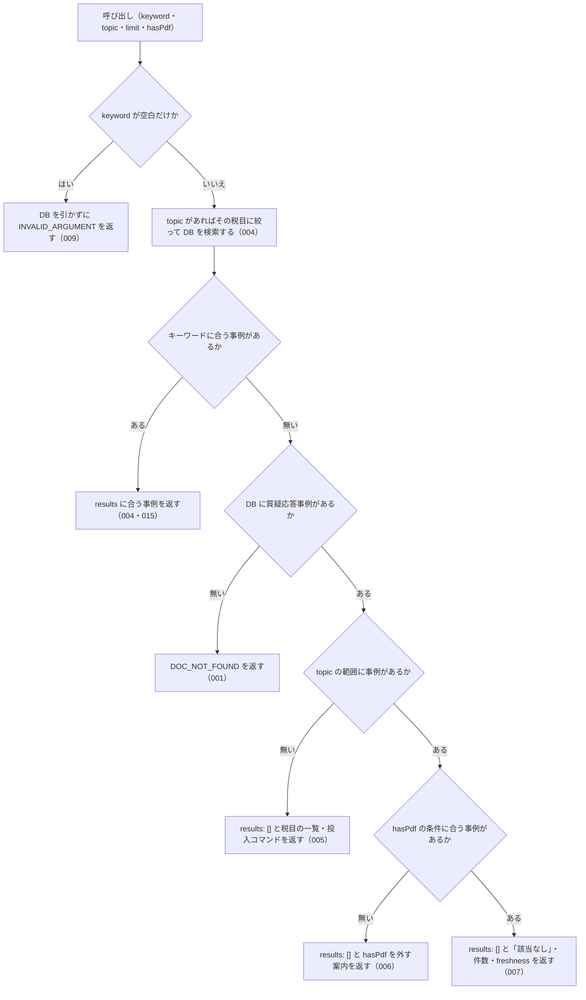

# nta_search_qa の仕様

<!-- GENERATED FILE — 手で編集しない。本文は houki-nta-mcp の specs/current/nta_search_qa/spec.md の写し。 -->

::: info
houki-nta-mcp **v0.27.0** の `specs/current/nta_search_qa/spec.md` から自動生成しました（仕様 ID 8 件・2026-10-10）。手で編集しないでください。再生成は `node scripts/generate-reference.mjs specs` です。
:::

質疑応答事例をキーワードで検索する

使いどころ・引数・実測の呼び出し例は、[ツールのページ](/reference/mcp/houki-nta/nta_search_qa)にあります。

最後に仕様が変わったのは v0.26.0 の「ローカル DB を開けないときの読むだけのツールと書き戻すツールの応答、`--bulk-download-tax-answer` が索引を保存できないときの終わり方（nta #144・#145）」（2026-10-06 承認）です。それまでの経緯は[承認の履歴](#承認の履歴)にあります。

## 利用者と得られる結果

この機能の利用者と、利用者が渡すもの・得られる結果を示します。

- MCP クライアント（Claude などの LLM、または CLI から呼ぶ人）。`keyword` を渡して、ローカル DB に取り込んである国税庁の質疑応答事例（9 税目）のうち、キーワードに合う事例の一覧（題名・事例の番号・出典 URL・抜粋）を受け取る。事例の本文は `nta_get_qa` で読む

## 入力

呼び出すときに渡す値です。

| 引数      | 必須 | 内容                                                                                                                                                                                                           |
| --------- | ---- | -------------------------------------------------------------------------------------------------------------------------------------------------------------------------------------------------------------- |
| `keyword` | 必須 | 検索キーワード。例: `"社内会議 軽減税率"`、`"テレワーク 必要経費"`。空白で区切った語をすべて含む事例を探す。3 文字以上の語を推奨する。空文字・空白だけは不可 |
| `topic`   | 任意 | 税目。`shotoku`（所得税）/ `gensen`（源泉所得税）/ `joto`（譲渡所得）/ `sozoku`（相続税・贈与税）/ `hyoka`（財産の評価）/ `hojin`（法人税）/ `shohi`（消費税）/ `inshi`（印紙税）/ `hotei`（法定調書）のどれか |
| `limit`   | 任意 | 返す件数。既定 10。1 以上 50 以下の整数 |
| `hasPdf`  | 任意 | 添付 PDF の有無で絞る（`true` = PDF 付き / `false` = PDF 無し / 省略 = 絞らない）。質疑応答事例は PDF を持たないので、`true` にすると 0 件になる                                                               |

検索の対象はローカル DB に取り込んだ事例だけである。国税庁サイトには取りに行かない。事例は `houki-nta-mcp --bulk-download-qa`（税目を絞るときは `--qa-topic=<topic>`）で取り込む。

## 扱わないこと

この機能が意図して扱わないことです。

- 事例の本文（照会要旨・回答要旨・関係法令通達）を返すこと（`results` の `docId` を `nta_get_qa` の `topic` / `category` / `id` に分けて読む）
- 国税庁サイトを直接検索すること（DB に無い事例は見つからない。`--bulk-download-qa` で取り込む）
- 件数の合計（`total`）やページ送りを返すこと（`limit` 件までを返す）
- 分野（`domain`）を指定すること（質疑応答事例はすべて税務。税目は `topic` で絞る）
- 添付 PDF 付きの事例を返すこと（質疑応答事例は PDF を持たない）

## 処理の流れ

呼び出しを受けてから応答を返すまでに、何をどの順で確かめるかを示します。図の中の番号は「できること」の仕様 ID の末尾 3 桁です。

## 仕様項目

この機能の仕様項目を、仕様 ID ごとに並べています。見出しは仕様項目を 1 文で表したもので、条件・応答の細部・例は「詳細」を開くと読めます。仕様 ID はそれぞれ受入テストと対応していて、テストの無い ID があると各リポジトリの CI が止まります。

### SPEC-NTA-SEARCH-QA-001 質疑応答事例が DB に 1 件も無いときはエラー `DOC_NOT_FOUND`

::: details 詳細
ローカル DB に質疑応答事例が 1 件も入っていないとき（DB のファイルが無い・版の記録が無い・版が合わない・開けないときを含む）は、`results` を返さずにエラー `DOC_NOT_FOUND` を返す。「該当なし」という検索結果とは違うことを応答の形で示す。

- `error` に「ローカル DB に質疑応答事例が 1 件も無いため、検索できません（「該当なし」という結果ではありません）」
- `hint` は DB の状態ごとの文（[SPEC-NTA-DB-SCHEMA-029](/specs/houki-nta/db_schema#spec-nta-db-schema-029)。`<種別>` は `質疑応答事例`、フラグは `--bulk-download-qa`）。どの文も開こうとした DB のパスを含む
- `next_actions` の先頭は `action: "cli_bulk_download"`、`example.command` は `--bulk-download-qa` を付けた案内のコマンド（[SPEC-NTA-DB-SCHEMA-027](/specs/houki-nta/db_schema#spec-nta-db-schema-027)。環境変数を付けずに起動したときは `npx -y @shuji-bonji/houki-nta-mcp@latest --bulk-download-qa`）。版が新しい・読めない DB と、開けない DB では入れない（[SPEC-NTA-DB-SCHEMA-021](/specs/houki-nta/db_schema#spec-nta-db-schema-021)・029）
- `tool` は `nta_search_qa`
- 開けない DB では `retryable: false` と `detail.cause` も付ける（[SPEC-NTA-DB-SCHEMA-029](/specs/houki-nta/db_schema#spec-nta-db-schema-029)。v0.25.x では [SPEC-NTA-COMMON-ERRORS-006](/specs/houki-nta/common_errors#spec-nta-common-errors-006) の `INTERNAL_ERROR` だった）

例: 環境変数を付けずに起動し（ホームディレクトリが `/Users/bonji`）、タックスアンサーだけを入れた DB で `{ keyword: "社内会議" }` を渡すと、`hint` は ``ローカル DB（~/.cache/houki-nta-mcp/cache.db）に質疑応答事例（doc_type="qa-jirei"）が入っていません。`npx -y @shuji-bonji/houki-nta-mcp@latest --bulk-download-qa` で投入してください。…`` で始まり、`next_actions[0].example.command` は `npx -y @shuji-bonji/houki-nta-mcp@latest --bulk-download-qa`（v0.24.x では `hint` が `MCP サーバーが開いている DB（/Users/bonji/.cache/houki-nta-mcp/cache.db）に…` で始まり、コマンドは `houki-nta-mcp --bulk-download-qa`）。
:::

### SPEC-NTA-SEARCH-QA-004 `topic` で税目を絞る

::: details 詳細
`topic` を指定すると、その税目の事例だけを検索する。例: DB に消費税（`shohi`）の「会議費と軽減税率」と所得税（`shotoku`）の「テレワークの必要経費」があるとき、`keyword: "軽減税率", topic: "shohi"` は `results` に 1 件を返し、`keyword: "軽減税率", topic: "shotoku"` は `results: []` と、`topic="shotoku"` の範囲で該当なしである旨の `hint` を返す（[SPEC-NTA-SEARCH-QA-007](#spec-nta-search-qa-007)）。
:::

### SPEC-NTA-SEARCH-QA-005 `topic` の範囲に事例が 1 件も無いときは税目の一覧と投入コマンドを案内する

::: details 詳細
DB に質疑応答事例はあるが、指定した `topic` の事例が 1 件も無いときは、`results: []` を返す（エラーにはしない）。

- `hint` に、DB の質疑応答事例の件数、`topic="<指定した値>"` の文書が無いこと、`topic` を外すか `available_taxonomies` の値を指定すること、税目を絞って投入する場合は `` `<コマンド>` `` で追加できることを書く。`<コマンド>` は `--bulk-download-qa --qa-topic=<指定した値>` を付けた案内のコマンド（[SPEC-NTA-DB-SCHEMA-027](/specs/houki-nta/db_schema#spec-nta-db-schema-027)）
- `available_taxonomies` に、DB の質疑応答事例が持つ税目の一覧を入れる。例: `["shohi", "shotoku"]`
- `freshness` に、DB の質疑応答事例全体の取得時点と DB のパスを付ける（[SPEC-NTA-SEARCH-RULES-017](/specs/houki-nta/search_rules#spec-nta-search-rules-017)・022）

例: 環境変数を付けずに起動し、`shohi` の事例だけがある DB で `{ keyword: "軽減税率", topic: "shotoku" }` を渡すと、`hint` は ``… 税目を絞って投入した場合は、`npx -y @shuji-bonji/houki-nta-mcp@latest --bulk-download-qa --qa-topic=shotoku` で追加できます`` で終わる（v0.24.x では `houki-nta-mcp --bulk-download-qa --qa-topic=shotoku`）。
:::

### SPEC-NTA-SEARCH-QA-006 `hasPdf` の条件に合う事例が無いときは `hasPdf` を外すよう案内する

::: details 詳細
`hasPdf` を指定し、その条件（`topic` があればその範囲の中で）に合う事例が 1 件も無いときは、`results: []` を返す（エラーにはしない）。`hint` に、検索した範囲の件数と、「PDF 付きの文書はありません」（`hasPdf: false` なら「PDF 無しの文書はありません」）、`hasPdf` を外して検索するよう書く。質疑応答事例は PDF を持たないので、`hasPdf: true` は常にこの応答になる。
:::

### SPEC-NTA-SEARCH-QA-007 キーワードに合う事例が無いときは「該当なし」と件数・`freshness` を返す

::: details 詳細
DB に事例はある（`topic` / `hasPdf` の範囲にも事例がある）が、キーワードに合う事例が無いときは、`results: []` を返す。

- `hint` は「該当なし。DB の質疑応答事例 <件数> 件に「&lt;keyword>」に合う文書はありません。別のキーワードで試してください」。`topic` や `hasPdf` を指定していれば、件数の前に `（topic="shotoku"）` のように条件を書く。投入をやり直すようには案内しない
- `freshness` に、検索した範囲の事例の取得時点を付ける。`staleness` は取り込みからの日数で `fresh` / `stale` / `outdated` のどれか
- `keyword` と `legal_status` も付く
:::

### SPEC-NTA-SEARCH-QA-008 `limit` は 1 以上 50 以下の整数で、範囲の外は `INVALID_ARGUMENT` にして丸めない

::: details 詳細
tools/list の inputSchema の `limit` は `type: "integer"`、`minimum: 1`、`maximum: 50` を持つ（[SPEC-NTA-COMMON-ERRORS-012](/specs/houki-nta/common_errors#spec-nta-common-errors-012)）。0・負の数・小数・51 以上・数値でない値を渡すと、inputSchema の検査で `INVALID_ARGUMENT`（`tool: "nta_search_qa"`、`detail.issues[0].path: "limit"`）を返し、DB を引かない。1 件や 50 件に丸めたり、切り捨てたりしない。既定の 10 件は変えない。

例: `{ keyword: "社内会議 軽減税率", limit: 0 }` は `code: "INVALID_ARGUMENT"`、`detail.issues` は `[{ path: "limit", message: "1 以上で指定してください" }]` で、DB は引かない（v0.21.3 では 1 件に丸めていた）。`limit: 100` は `[{ path: "limit", message: "50 以下で指定してください" }]`（v0.21.3 では 50 件）。`limit: 2.5` と `limit: "10"` は `整数で指定してください`。`limit: 50` は検査を通り、最大 50 件を返す。
:::

### SPEC-NTA-SEARCH-QA-009 keyword が空文字・空白だけのときはDBを引かずに `INVALID_ARGUMENT` を返す

::: details 詳細
空文字は inputSchema の `minLength: 1` の検査（[SPEC-NTA-COMMON-ERRORS-013](/specs/houki-nta/common_errors#spec-nta-common-errors-013)）で止まり、`INVALID_ARGUMENT`（`tool: "nta_search_qa"`、`detail.issues: [{ path: "keyword", message: "空文字は指定できません" }]`）を返す。空白（半角スペース・全角スペース・タブ・改行）だけのときは、ツールの処理がDBを引く前に、[SPEC-NTA-COMMON-ERRORS-014](/specs/houki-nta/common_errors#spec-nta-common-errors-014) の形の `INVALID_ARGUMENT`（`tool: "nta_search_qa"`、`error: "keyword が空です"`、`detail.issues: [{ path: "keyword", message: "空白だけは指定できません" }]`、`hint` に探したい語を渡すよう書く）を返す。

例: `keyword: ""` は `code: "INVALID_ARGUMENT"`・`detail.issues[0].message: "空文字は指定できません"`。`keyword: "　"`（全角スペース）と `keyword: " \n"` は `code: "INVALID_ARGUMENT"`・`error: "keyword が空です"`。どれもDBは引かない。

v0.21.3 では空の `keyword` に `results: []` と「該当なし」の `hint`（[SPEC-NTA-SEARCH-QA-007](#spec-nta-search-qa-007) の形）を返していたが、空の `keyword` は探していないので、007 の対象から外れる。1 文字の語だけ・記号だけの `keyword` は、今までどおり [SPEC-NTA-SEARCH-RULES-005](/specs/houki-nta/search_rules#spec-nta-search-rules-005)・006 に従って語を外し、エラーにしない。
:::

### SPEC-NTA-SEARCH-QA-010 `domain` は受け付けず、渡すと DB を引かずに `INVALID_ARGUMENT` を返す

::: details 詳細
tools/list の inputSchema の `properties` に `domain` は無い。`domain` を渡すと、どの値（`tax` を含む）でも [SPEC-NTA-COMMON-ERRORS-004](/specs/houki-nta/common_errors#spec-nta-common-errors-004) の `INVALID_ARGUMENT`（`tool: "nta_search_qa"`、`detail.issues: [{ path: "domain", message: "inputSchema に無い引数です" }]`）を返し、DB を引かない。税目で絞るときは `topic`（[SPEC-NTA-SEARCH-QA-004](#spec-nta-search-qa-004)）を使う。`nta_search_tsutatsu`（[SPEC-NTA-SEARCH-TSUTATSU-001](/specs/houki-nta/nta_search_tsutatsu#spec-nta-search-tsutatsu-001)）と houki-egov-mcp の `search_law` / `search_fulltext`（0.18.0、houki-egov-mcp #55）と同じ扱いである。

例: `{ keyword: "軽減税率", domain: "tax" }` は `code: "INVALID_ARGUMENT"`、`error: "引数が tools/list の inputSchema に合いません: domain: inputSchema に無い引数です"`、`detail.issues[0].path: "domain"`（v0.23.0 では `domain` を省いたときと同じ検索結果だった）。`{ keyword: "軽減税率", domain: "labor" }` も同じエラー（v0.23.0 では DB を引かずに `results: []` と `hint`）。`{ keyword: "軽減税率" }` と `{ keyword: "軽減税率", topic: "shohi" }` は今までどおり検索する。
:::

## 検討中のこと

仕様を書き起こしたときに見つかった項目のうち、扱いを Issue で検討しているものです。ここに挙げたことは、今後の版で変わることがあります。開くと、元の仕様書の記述をそのまま読めます。

::: details 仕様書の「未決」の節
初版起こしで見つけた、意図か不具合かを人が決める項目です。決まったら「できること」に ID を振るか、`specs/changes/` の差分にします。

意図か不具合かの判断が要る項目は houki-nta-mcp の Issue に移し、ここには題と Issue の番号だけを残します。今の振る舞いのままでよくテストが無いだけの項目は、受入テストを書いてから「できること」に ID を振ります。
:::

## 承認の履歴

この機能の仕様が、いつ、どの変更で承認されたかを新しい順に並べています。各リポジトリの `npx spec-ids history nta_search_qa` と同じ内容です。変更の名前から、変更の理由と前後の振る舞いを書いた文書（GitHub）を開けます。

::: details 承認の履歴（12 件）
| 承認日 | 版 | 変更 | 仕様 PR |
|---|---|---|---|
| 2026-10-06 | v0.26.0 | [ローカル DB を開けないときの読むだけのツールと書き戻すツールの応答、`--bulk-download-tax-answer` が索引を保存できないときの終わり方（nta #144・#145）](https://github.com/shuji-bonji/houki-nta-mcp/blob/v0.27.0/specs/releases/v0.26.0/20261006-db-failure-paths/proposal.md) | [#152](https://github.com/shuji-bonji/houki-nta-mcp/pull/152) |
| 2026-10-05 | v0.25.0 | [ローカル DB の場所を、応答・起動時のログ・`--status` で確かめられるようにし、保存したタックスアンサーの索引を読めないことをログに残す（nta #138・#137、T6）](https://github.com/shuji-bonji/houki-nta-mcp/blob/v0.27.0/specs/releases/v0.25.0/20261004-db-location/proposal.md) | [#142](https://github.com/shuji-bonji/houki-nta-mcp/pull/142) |
| 2026-10-03 | v0.24.0 | [検索の英字の大文字と小文字・3 文字未満の略称・nta_search_qa の domain（段階 5 検索規則）](https://github.com/shuji-bonji/houki-nta-mcp/blob/v0.27.0/specs/releases/v0.24.0/20261003-search-rules/proposal.md) | [#133](https://github.com/shuji-bonji/houki-nta-mcp/pull/133) |
| 2026-10-03 | v0.24.0 | [0.22.0 の取り込みで直し漏れた specs/current の文を、取り込んだ本文に合わせる（#123）](https://github.com/shuji-bonji/houki-nta-mcp/blob/v0.27.0/specs/releases/v0.24.0/20261003-specs-current-catchup/proposal.md) | [#132](https://github.com/shuji-bonji/houki-nta-mcp/pull/132) |
| 2026-10-01 | v0.22.0 | [引数の検査を inputSchema に書き、丸めずに `INVALID_ARGUMENT` にする（T1）](https://github.com/shuji-bonji/houki-nta-mcp/blob/v0.27.0/specs/releases/v0.22.0/20261001-t1-argument-guards/proposal.md) | [#117](https://github.com/shuji-bonji/houki-nta-mcp/pull/117) |
| 2026-09-27 | v0.21.1 | [索引から消えた文書の印に、取得系 4 ツールの仕様 ID を振り、検索系 4 ツールのテストを足す](https://github.com/shuji-bonji/houki-nta-mcp/blob/v0.27.0/specs/releases/v0.21.1/20260927-index-status-marks/proposal.md) | [#91](https://github.com/shuji-bonji/houki-nta-mcp/pull/91) |
| 2026-09-27 | v0.21.1 | [絞り込んで 0 件になったときの応答と、`freshness` の段階に仕様 ID を振る](https://github.com/shuji-bonji/houki-nta-mcp/blob/v0.27.0/specs/releases/v0.21.1/20260927-search-zero-hits/proposal.md) | [#90](https://github.com/shuji-bonji/houki-nta-mcp/pull/90) |
| 2026-09-27 | v0.21.1 | [キーワードの扱い（短い語・略称と通称の展開・全角の揃え方）を、検索系 6 ツールの応答として確かめる](https://github.com/shuji-bonji/houki-nta-mcp/blob/v0.27.0/specs/releases/v0.21.1/20260927-search-keyword-rules/proposal.md) | [#86](https://github.com/shuji-bonji/houki-nta-mcp/pull/86) |
| 2026-09-27 | v0.21.1 | [検索でヒットしたときの応答の形に仕様 ID を振る](https://github.com/shuji-bonji/houki-nta-mcp/blob/v0.27.0/specs/releases/v0.21.1/20260927-search-hit-responses/proposal.md) | [#85](https://github.com/shuji-bonji/houki-nta-mcp/pull/85) |
| 2026-09-26 | v0.21.1 | [「未決」のうち判断が要る 45 件を Issue に移す](https://github.com/shuji-bonji/houki-nta-mcp/blob/v0.27.0/specs/releases/v0.21.1/20260926-undecided-to-issues/proposal.md) | [#74](https://github.com/shuji-bonji/houki-nta-mcp/pull/74) |
| 2026-09-26 | v0.21.1 | [全 14 ツールの spec.md に「処理の流れ」の節を足す](https://github.com/shuji-bonji/houki-nta-mcp/blob/v0.27.0/specs/releases/v0.21.1/20260926-processing-flow/proposal.md) | [#63](https://github.com/shuji-bonji/houki-nta-mcp/pull/63) |
| 2026-09-26 | — | 初版 | [#63](https://github.com/shuji-bonji/houki-nta-mcp/pull/63) |
:::

## 関連ページ

このページの元になった文書と、あわせて読むページです。

- [houki-nta-mcp の仕様の一覧](/specs/houki-nta/)
- [houki-nta-mcp の解説](/mcp/houki-nta)
- [nta_search_qa のツールのページ（リファレンス）](/reference/mcp/houki-nta/nta_search_qa)
- [元の仕様書（GitHub、v0.27.0）](https://github.com/shuji-bonji/houki-nta-mcp/blob/v0.27.0/specs/current/nta_search_qa/spec.md)
