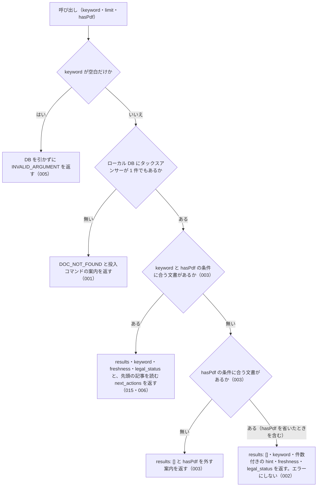

# nta_search_tax_answer の仕様

<!-- GENERATED FILE — 手で編集しない。本文は houki-nta-mcp の specs/current/nta_search_tax_answer/spec.md の写し。 -->

::: info
houki-nta-mcp **v0.27.0** の `specs/current/nta_search_tax_answer/spec.md` から自動生成しました（仕様 ID 6 件・2026-10-10）。手で編集しないでください。再生成は `node scripts/generate-reference.mjs specs` です。
:::

タックスアンサーをキーワードで検索する

使いどころ・引数・実測の呼び出し例は、[ツールのページ](/reference/mcp/houki-nta/nta_search_tax_answer)にあります。

最後に仕様が変わったのは v0.26.0 の「ローカル DB を開けないときの読むだけのツールと書き戻すツールの応答、`--bulk-download-tax-answer` が索引を保存できないときの終わり方（nta #144・#145）」（2026-10-06 承認）です。それまでの経緯は[承認の履歴](#承認の履歴)にあります。

## 利用者と得られる結果

この機能の利用者と、利用者が渡すもの・得られる結果を示します。

- MCP クライアント（Claude などの LLM、または CLI から呼ぶ人）。`keyword` を渡して、ローカル DB に入っている国税庁のタックスアンサー（一般納税者向けの解説、約 750 件）のうちキーワードに合うものの一覧（番号・題名・出典 URL・抜粋）を受け取る。本文は `nta_get_tax_answer` で番号を指定して取る

## 入力

呼び出すときに渡す値です。

| 引数      | 必須 | 内容                                                                                                                                                                                                           |
| --------- | ---- | -------------------------------------------------------------------------------------------------------------------------------------------------------------------------------------------------------------- |
| `keyword` | 必須 | 検索キーワード。例: `"ふるさと納税"`、`"医療費控除"`。空白で区切ると複数の語になる。3 文字以上の語を推奨する（2 文字の語は本文の部分一致で補い、その旨を `search_notes` に書く。1 文字の語は検索条件から外す）。空文字・空白だけは不可 |
| `limit`   | 任意 | 返す件数。既定 10。1 以上 50 以下の整数 |
| `hasPdf`  | 任意 | 添付 PDF の有無で絞る。`true` は PDF 付きだけ、`false` は PDF 無しだけ、省くと絞らない                                                                                                                         |

検索の対象は、`--bulk-download-tax-answer` でローカル DB に入れたタックスアンサーである。このツールは国税庁サイトには取りに行かない。

## 扱わないこと

この機能が意図して扱わないことです。

- 国税庁サイトからタックスアンサーを探すこと（探すのはローカル DB だけ。DB に入れるのは `--bulk-download-tax-answer`）
- タックスアンサーの本文を返すこと（`results` は番号・題名・出典 URL・抜粋まで。本文は `nta_get_tax_answer`）
- 税目（税目フォルダ）で絞ること（`nta_search_qa` の `topic` や `nta_search_kaisei_tsutatsu` の `taxonomy` のような引数は無い）
- 結果が 0 件のときに、検索範囲を国税庁サイトや他の種別の文書に広げること
- 回答が今の法令でも成り立つかを判定すること

## 処理の流れ

呼び出しを受けてから応答を返すまでに、何をどの順で確かめるかを示します。図の中の番号は「できること」の仕様 ID の末尾 3 桁です。

## 仕様項目

この機能の仕様項目を、仕様 ID ごとに並べています。見出しは仕様項目を 1 文で表したもので、条件・応答の細部・例は「詳細」を開くと読めます。仕様 ID はそれぞれ受入テストと対応していて、テストの無い ID があると各リポジトリの CI が止まります。

### SPEC-NTA-SEARCH-TAX-ANSWER-001 DB にタックスアンサーが 1 件も無いときは「該当なし」ではなくエラーを返す

::: details 詳細
ローカル DB にタックスアンサーが 1 件も無い（まだ投入していない、他の種別の文書だけが入っている、DB のファイルが無い・版の記録が無い・版が合わない・開けない）ときは、エラー `DOC_NOT_FOUND` を返す。キーワードに合う文書が無い「該当なし」とは違うことを、応答の形（`results` を持たないエラー）と `error` の文（「該当なし」という結果ではないこと）で示す。

- `tool` は `nta_search_tax_answer`
- `hint` は DB の状態ごとの文（[SPEC-NTA-DB-SCHEMA-029](/specs/houki-nta/db_schema#spec-nta-db-schema-029)。`<種別>` は `タックスアンサー`、フラグは `--bulk-download-tax-answer`）。どの文も開こうとした DB のパスを含む
- `next_actions` の先頭は `action: "cli_bulk_download"` で、`example.command` は `--bulk-download-tax-answer` を付けた案内のコマンド（[SPEC-NTA-DB-SCHEMA-027](/specs/houki-nta/db_schema#spec-nta-db-schema-027)）。版が新しい・読めない DB と、開けない DB では入れない（[SPEC-NTA-DB-SCHEMA-021](/specs/houki-nta/db_schema#spec-nta-db-schema-021)・029）
- 開けない DB では `retryable: false` と `detail.cause` も付ける（[SPEC-NTA-DB-SCHEMA-029](/specs/houki-nta/db_schema#spec-nta-db-schema-029)。v0.25.x では [SPEC-NTA-COMMON-ERRORS-006](/specs/houki-nta/common_errors#spec-nta-common-errors-006) の `INTERNAL_ERROR` だった）

例: 環境変数を付けずに起動し（ホームディレクトリが `/Users/bonji`）、質疑応答事例だけを入れた DB で `keyword: "医療費控除"` を検索すると、`code: "DOC_NOT_FOUND"`、`hint` は ``ローカル DB（~/.cache/houki-nta-mcp/cache.db）にタックスアンサー（doc_type="tax-answer"）が入っていません。`npx -y @shuji-bonji/houki-nta-mcp@latest --bulk-download-tax-answer` で投入してください。…`` で始まる（v0.24.x では `MCP サーバーが開いている DB（/Users/bonji/.cache/houki-nta-mcp/cache.db）に…` で始まり、コマンドは `houki-nta-mcp --bulk-download-tax-answer`）。
:::

### SPEC-NTA-SEARCH-TAX-ANSWER-002 タックスアンサーはあるがキーワードに合わないときは、成功として空の一覧と件数を返す

::: details 詳細
DB にタックスアンサーはあるが、キーワード（と `hasPdf` の条件）に合う文書が無いときは、エラーにせず次を返す。

| フィールド     | 内容                                                                                                                                                                                                                        |
| -------------- | --------------------------------------------------------------------------------------------------------------------------------------------------------------------------------------------------------------------------- |
| `results`      | 空の配列 `[]`                                                                                                                                                                                                               |
| `keyword`      | 渡した `keyword`                                                                                                                                                                                                            |
| `hint`         | 「該当なし」と、探した範囲の文書の件数（`hasPdf` を指定したときは条件も）。例: `該当なし。DB のタックスアンサー 1 件に「医療費控除」に合う文書はありません。別のキーワードで試してください`                                 |
| `freshness`    | DB に入れた日時の範囲。`oldest_fetched_at` / `newest_fetched_at` / `staleness`（`fresh` / `stale` / `outdated`）/ `days_since_oldest`。`outdated` のときは `--bulk-download-tax-answer` で最新化するよう `warning` を付ける |
| `search_notes` | 2 文字以下の語や通称の展開があったときだけ、その扱いを書いた文字列の配列                                                                                                                                                    |
| `legal_status` | `binds_citizens: false` / `binds_courts: false` / `binds_tax_office: false` と、参考解説資料である旨の注                                                                                                                    |
:::

### SPEC-NTA-SEARCH-TAX-ANSWER-003 `hasPdf` で絞り、合う文書が無いときは `hasPdf` を外すよう案内する

::: details 詳細
`hasPdf: true` を渡すと添付 PDF のある記事だけを、`hasPdf: false` を渡すと添付 PDF の無い記事だけを探す。

DB にタックスアンサーはあるが、`hasPdf` の条件に合う記事が 1 件も無いときは、エラーにせず次を返す。

- `results`: `[]`
- `keyword`: 渡した `keyword`
- `hint`: `DB のタックスアンサー <件数> 件に、PDF 付きの文書はありません。hasPdf を外して検索してください`。`hasPdf: false` なら「PDF 無しの文書はありません」。件数は DB のタックスアンサー全体の件数
- `freshness`: DB のタックスアンサー全体の取得時点（形は [SPEC-NTA-SEARCH-RULES-017](/specs/houki-nta/search_rules#spec-nta-search-rules-017)）
- `legal_status`

例: DB のタックスアンサー 2 件がどちらも PDF を持たないとき、`{ keyword: "源泉徴収", hasPdf: true }` の `hint` は `DB のタックスアンサー 2 件に、PDF 付きの文書はありません。hasPdf を外して検索してください` になる。

0 件の理由は [SPEC-NTA-SEARCH-TAX-ANSWER-001](#spec-nta-search-tax-answer-001) → 003 → 002 の順に決める。
:::

### SPEC-NTA-SEARCH-TAX-ANSWER-004 `limit` は 1 以上 50 以下の整数で、範囲の外は `INVALID_ARGUMENT` にして丸めない

::: details 詳細
tools/list の inputSchema の `limit` は `type: "integer"`、`minimum: 1`、`maximum: 50` を持つ（[SPEC-NTA-COMMON-ERRORS-012](/specs/houki-nta/common_errors#spec-nta-common-errors-012)）。0・負の数・小数・51 以上・数値でない値を渡すと、inputSchema の検査で `INVALID_ARGUMENT`（`tool: "nta_search_tax_answer"`、`detail.issues[0].path: "limit"`）を返し、DB を引かない。1 件や 50 件に丸めたり、切り捨てたりしない。既定の 10 件は変えない。

例: `{ keyword: "医療費控除", limit: 0 }` は `code: "INVALID_ARGUMENT"`、`detail.issues` は `[{ path: "limit", message: "1 以上で指定してください" }]` で、DB は引かない（v0.21.3 では 1 件に丸めていた）。`limit: 100` は `[{ path: "limit", message: "50 以下で指定してください" }]`（v0.21.3 では 50 件）。`limit: 2.5` と `limit: "10"` は `整数で指定してください`。`limit: 50` は検査を通り、最大 50 件を返す。
:::

### SPEC-NTA-SEARCH-TAX-ANSWER-005 keyword が空文字・空白だけのときはDBを引かずに `INVALID_ARGUMENT` を返す

::: details 詳細
空文字は inputSchema の `minLength: 1` の検査（[SPEC-NTA-COMMON-ERRORS-013](/specs/houki-nta/common_errors#spec-nta-common-errors-013)）で止まり、`INVALID_ARGUMENT`（`tool: "nta_search_tax_answer"`、`detail.issues: [{ path: "keyword", message: "空文字は指定できません" }]`）を返す。空白（半角スペース・全角スペース・タブ・改行）だけのときは、ツールの処理がDBを引く前に、[SPEC-NTA-COMMON-ERRORS-014](/specs/houki-nta/common_errors#spec-nta-common-errors-014) の形の `INVALID_ARGUMENT`（`tool: "nta_search_tax_answer"`、`error: "keyword が空です"`、`detail.issues: [{ path: "keyword", message: "空白だけは指定できません" }]`、`hint` に探したい語を渡すよう書く）を返す。

例: `keyword: ""` は `code: "INVALID_ARGUMENT"`・`detail.issues[0].message: "空文字は指定できません"`。`keyword: "　"`（全角スペース）と `keyword: " \n"` は `code: "INVALID_ARGUMENT"`・`error: "keyword が空です"`。どれもDBは引かない。

v0.21.3 では空の `keyword` に `results: []` と「該当なし」の `hint`（[SPEC-NTA-SEARCH-TAX-ANSWER-002](#spec-nta-search-tax-answer-002) の形）を返していたが、空の `keyword` は探していないので、002 の対象から外れる。
:::

### SPEC-NTA-SEARCH-TAX-ANSWER-006 ヒットしたときは、先頭の記事を `nta_get_tax_answer` で読む案内を `next_actions` に入れる

::: details 詳細
キーワードに合うタックスアンサーが 1 件以上あるとき（[SPEC-NTA-SEARCH-RULES-015](/specs/houki-nta/search_rules#spec-nta-search-rules-015)）は、応答に `next_actions` を付ける。`next_actions` は 1 件で、`action: "nta_get_tax_answer"`、`reason: "記事の本文を読めます"`、`example: { no: <results[0].docId> }`。`results[].docId` は 4 桁の記事番号で、`nta_get_tax_answer` の `no` にそのまま渡せる。

0 件のとき（[SPEC-NTA-SEARCH-TAX-ANSWER-002](#spec-nta-search-tax-answer-002)・003）は、この案内を付けない（読む記事が無いため）。

例: `{ keyword: "医療費控除" }` で `results[0].docId` が `"1131"` のとき、`next_actions` は `[{ action: "nta_get_tax_answer", reason: "記事の本文を読めます", example: { no: "1131" } }]`（v0.22.0 では `next_actions` が無かった）。
:::

## 検討中のこと

仕様を書き起こしたときに見つかった項目のうち、扱いを Issue で検討しているものです。ここに挙げたことは、今後の版で変わることがあります。開くと、元の仕様書の記述をそのまま読めます。

::: details 仕様書の「未決」の節
初版起こしで見つけた、意図か不具合かを人が決める項目です。決まったら「できること」に ID を振るか、`specs/changes/` の差分にします。

意図か不具合かの判断が要る項目は houki-nta-mcp の Issue に移し、ここには題と Issue の番号だけを残します。今の振る舞いのままでよくテストが無いだけの項目は、受入テストを書いてから「できること」に ID を振ります。

8. **`nta_get_tax_answer` へ進む案内が無い。** → [SPEC-NTA-SEARCH-TAX-ANSWER-006](#spec-nta-search-tax-answer-006)
:::

## 承認の履歴

この機能の仕様が、いつ、どの変更で承認されたかを新しい順に並べています。各リポジトリの `npx spec-ids history nta_search_tax_answer` と同じ内容です。変更の名前から、変更の理由と前後の振る舞いを書いた文書（GitHub）を開けます。

::: details 承認の履歴（12 件）
| 承認日 | 版 | 変更 | 仕様 PR |
|---|---|---|---|
| 2026-10-06 | v0.26.0 | [ローカル DB を開けないときの読むだけのツールと書き戻すツールの応答、`--bulk-download-tax-answer` が索引を保存できないときの終わり方（nta #144・#145）](https://github.com/shuji-bonji/houki-nta-mcp/blob/v0.27.0/specs/releases/v0.26.0/20261006-db-failure-paths/proposal.md) | [#152](https://github.com/shuji-bonji/houki-nta-mcp/pull/152) |
| 2026-10-05 | v0.25.0 | [ローカル DB の場所を、応答・起動時のログ・`--status` で確かめられるようにし、保存したタックスアンサーの索引を読めないことをログに残す（nta #138・#137、T6）](https://github.com/shuji-bonji/houki-nta-mcp/blob/v0.27.0/specs/releases/v0.25.0/20261004-db-location/proposal.md) | [#142](https://github.com/shuji-bonji/houki-nta-mcp/pull/142) |
| 2026-10-03 | v0.24.0 | [0.22.0 の取り込みで直し漏れた specs/current の文を、取り込んだ本文に合わせる（#123）](https://github.com/shuji-bonji/houki-nta-mcp/blob/v0.27.0/specs/releases/v0.24.0/20261003-specs-current-catchup/proposal.md) | [#132](https://github.com/shuji-bonji/houki-nta-mcp/pull/132) |
| 2026-10-03 | v0.23.0 | [hint・next_actions・説明文・CLI の使い方と実際の動きの食い違いを、行ごとに直す（T5 文書と実装の食い違い）](https://github.com/shuji-bonji/houki-nta-mcp/blob/v0.27.0/specs/releases/v0.23.0/20261003-t5-docs-mismatch/proposal.md) | [#126](https://github.com/shuji-bonji/houki-nta-mcp/pull/126) |
| 2026-10-01 | v0.22.0 | [引数の検査を inputSchema に書き、丸めずに `INVALID_ARGUMENT` にする（T1）](https://github.com/shuji-bonji/houki-nta-mcp/blob/v0.27.0/specs/releases/v0.22.0/20261001-t1-argument-guards/proposal.md) | [#117](https://github.com/shuji-bonji/houki-nta-mcp/pull/117) |
| 2026-09-27 | v0.21.1 | [索引から消えた文書の印に、取得系 4 ツールの仕様 ID を振り、検索系 4 ツールのテストを足す](https://github.com/shuji-bonji/houki-nta-mcp/blob/v0.27.0/specs/releases/v0.21.1/20260927-index-status-marks/proposal.md) | [#91](https://github.com/shuji-bonji/houki-nta-mcp/pull/91) |
| 2026-09-27 | v0.21.1 | [絞り込んで 0 件になったときの応答と、`freshness` の段階に仕様 ID を振る](https://github.com/shuji-bonji/houki-nta-mcp/blob/v0.27.0/specs/releases/v0.21.1/20260927-search-zero-hits/proposal.md) | [#90](https://github.com/shuji-bonji/houki-nta-mcp/pull/90) |
| 2026-09-27 | v0.21.1 | [キーワードの扱い（短い語・略称と通称の展開・全角の揃え方）を、検索系 6 ツールの応答として確かめる](https://github.com/shuji-bonji/houki-nta-mcp/blob/v0.27.0/specs/releases/v0.21.1/20260927-search-keyword-rules/proposal.md) | [#86](https://github.com/shuji-bonji/houki-nta-mcp/pull/86) |
| 2026-09-27 | v0.21.1 | [検索でヒットしたときの応答の形に仕様 ID を振る](https://github.com/shuji-bonji/houki-nta-mcp/blob/v0.27.0/specs/releases/v0.21.1/20260927-search-hit-responses/proposal.md) | [#85](https://github.com/shuji-bonji/houki-nta-mcp/pull/85) |
| 2026-09-26 | v0.21.1 | [「未決」のうち判断が要る 45 件を Issue に移す](https://github.com/shuji-bonji/houki-nta-mcp/blob/v0.27.0/specs/releases/v0.21.1/20260926-undecided-to-issues/proposal.md) | [#74](https://github.com/shuji-bonji/houki-nta-mcp/pull/74) |
| 2026-09-26 | v0.21.1 | [全 14 ツールの spec.md に「処理の流れ」の節を足す](https://github.com/shuji-bonji/houki-nta-mcp/blob/v0.27.0/specs/releases/v0.21.1/20260926-processing-flow/proposal.md) | [#63](https://github.com/shuji-bonji/houki-nta-mcp/pull/63) |
| 2026-09-26 | — | 初版 | [#63](https://github.com/shuji-bonji/houki-nta-mcp/pull/63) |
:::

## 関連ページ

このページの元になった文書と、あわせて読むページです。

- [houki-nta-mcp の仕様の一覧](/specs/houki-nta/)
- [houki-nta-mcp の解説](/mcp/houki-nta)
- [nta_search_tax_answer のツールのページ（リファレンス）](/reference/mcp/houki-nta/nta_search_tax_answer)
- [元の仕様書（GitHub、v0.27.0）](https://github.com/shuji-bonji/houki-nta-mcp/blob/v0.27.0/specs/current/nta_search_tax_answer/spec.md)
