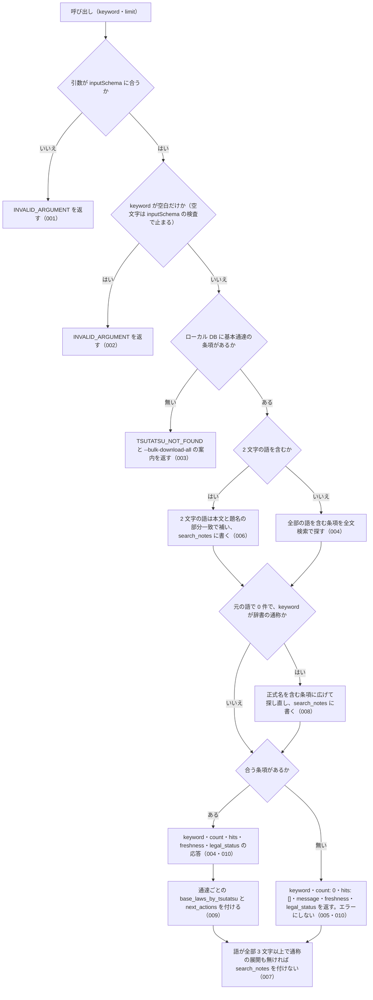

# nta_search_tsutatsu の仕様

<!-- GENERATED FILE — 手で編集しない。本文は houki-nta-mcp の specs/current/nta_search_tsutatsu/spec.md の写し。 -->

::: info
houki-nta-mcp **v0.27.0** の `specs/current/nta_search_tsutatsu/spec.md` から自動生成しました（仕様 ID 11 件・2026-10-10）。手で編集しないでください。再生成は `node scripts/generate-reference.mjs specs` です。
:::

基本通達の条項をキーワードで検索する

使いどころ・引数・実測の呼び出し例は、[ツールのページ](/reference/mcp/houki-nta/nta_search_tsutatsu)にあります。

最後に仕様が変わったのは v0.26.0 の「ローカル DB を開けないときの読むだけのツールと書き戻すツールの応答、`--bulk-download-tax-answer` が索引を保存できないときの終わり方（nta #144・#145）」（2026-10-06 承認）です。それまでの経緯は[承認の履歴](#承認の履歴)にあります。

## 利用者と得られる結果

この機能の利用者と、利用者が渡すもの・得られる結果を示します。

- MCP クライアント（Claude などの LLM、または CLI から呼ぶ人）。`keyword` を渡して、ローカル DB に入っている基本通達 4 種（消費税法基本通達・所得税基本通達・法人税基本通達・相続税法基本通達）の条項から、キーワードに合う条項の一覧を受け取る

## 入力

呼び出すときに渡す値です。

| 引数      | 必須 | 内容                                                                                                                                                                                                                                                          |
| --------- | ---- | ------------------------------------------------------------------------------------------------------------------------------------------------------------------------------------------------------------------------------------------------------------- |
| `keyword` | 必須 | 検索キーワード。例: `"軽減税率"`、`"電子帳簿"`、`"棚卸資産"`。空白で区切ると全部の語を含む条項を探す。3 文字以上の語を推奨する。2 文字の語は本文の部分一致で補い、その旨を応答の `search_notes` に書く。略称・通称（`"消基通"`、`"インボイス"` など）も渡せる。空文字・空白だけは不可 |
| `limit`   | 任意 | 取得件数。既定 10。1 以上 50 以下の整数 |

検索の対象はローカル DB だけである。国税庁サイトには取りに行かない。DB に条項を入れるのは CLI の `--bulk-download`（通達 1 つ）または `--bulk-download-all`（基本通達 4 種）である。

## 扱わないこと

この機能が意図して扱わないことです。

- 国税庁サイトを検索すること（対象はローカル DB に入れた条項だけ。DB に入れるのは CLI の `--bulk-download` / `--bulk-download-all`）
- 通達を 1 つに絞って検索すること（`keyword` に通達名を入れても、通達名を本文に含む条項を探すだけで、絞り込みにはならない）
- 基本通達 4 種以外の文書を検索すること（改正通達は `nta_search_kaisei_tsutatsu`、質疑応答事例は `nta_search_qa`、タックスアンサーは `nta_search_tax_answer`、事務運営指針は `nta_search_jimu_unei`、文書回答事例は `nta_search_bunshokaitou`）
- 条項の本文全体を返すこと（`snippet` は抜粋。本文は `nta_get_tsutatsu` で `clauseNumber` を渡して取る）
- 通達の条項と法律の条番号の対応を示すこと（`base_laws_by_tsutatsu` は法令名まで。条は付けない）
- 通達が今も有効かどうかを判定すること（改正の追跡は `nta_search_kaisei_tsutatsu` / `nta_get_kaisei_tsutatsu`）

## 処理の流れ

呼び出しを受けてから応答を返すまでに、何をどの順で確かめるかを示します。図の中の番号は「できること」の仕様 ID の末尾 3 桁です。



## 仕様項目

この機能の仕様項目を、仕様 ID ごとに並べています。見出しは仕様項目を 1 文で表したもので、条件・応答の細部・例は「詳細」を開くと読めます。仕様 ID はそれぞれ受入テストと対応していて、テストの無い ID があると各リポジトリの CI が止まります。

<a id="spec-nta-search-tsutatsu-001"></a>

### SPEC-NTA-SEARCH-TSUTATSU-001 inputSchema に合わない引数では検索しない

::: details 詳細
`keyword` が無い、`inputSchema` に無い引数（`domain`、`type` など）がある、型が合わない、`limit` が 1 以上 50 以下の整数でない（[SPEC-NTA-SEARCH-TSUTATSU-011](#spec-nta-search-tsutatsu-011)）、`keyword` が空文字（[SPEC-NTA-SEARCH-TSUTATSU-002](#spec-nta-search-tsutatsu-002)）、のどれかのときは、エラー `INVALID_ARGUMENT` を返す。DB は引かない。応答には `tool: "nta_search_tsutatsu"`、`hint`（`tools/list` の inputSchema を確かめる案内）、`next_actions`（`action: "list_tools"`）、`detail.issues`（違反 1 件ごとの要素。各要素は `path`（引数名）と `message`（日本語の 1 文。[SPEC-NTA-COMMON-ERRORS-011](/specs/houki-nta/common_errors#spec-nta-common-errors-011)））が入る。

例: `{ keyword: "軽減税率", domain: "tax" }` → `code: "INVALID_ARGUMENT"`、`detail.issues[0].path` は `"domain"`。`{}` → `detail.issues` は `[{ path: "keyword", message: "必須の引数です" }]`。
:::

<a id="spec-nta-search-tsutatsu-002"></a>

### SPEC-NTA-SEARCH-TSUTATSU-002 keyword が空なら検索しない

::: details 詳細
`keyword` が空文字のときは、inputSchema の `minLength: 1` の検査（[SPEC-NTA-COMMON-ERRORS-013](/specs/houki-nta/common_errors#spec-nta-common-errors-013)）で止まり、`INVALID_ARGUMENT`（`tool: "nta_search_tsutatsu"`、`detail.issues: [{ path: "keyword", message: "空文字は指定できません" }]`）を返す。空白（半角スペース・全角スペース・タブ・改行）だけのときは、ツールの処理が DB を引く前に、[SPEC-NTA-COMMON-ERRORS-014](/specs/houki-nta/common_errors#spec-nta-common-errors-014) の形の `INVALID_ARGUMENT`（`tool: "nta_search_tsutatsu"`、`error: "keyword が空です"`、`detail.issues: [{ path: "keyword", message: "空白だけは指定できません" }]`、`hint` に探したい語を渡すよう書く、`next_actions` に `list_tools`）を返す。どちらも DB は引かない。

例: `keyword: ""` は `detail.issues[0].message: "空文字は指定できません"`。`keyword: "   "` は `error: "keyword が空です"`・`detail.issues[0].path: "keyword"`。どちらも `code: "INVALID_ARGUMENT"`・`tool: "nta_search_tsutatsu"`（v0.21.3 は `error` の文だけで `detail.issues` が無かった）。
:::

<a id="spec-nta-search-tsutatsu-003"></a>

### SPEC-NTA-SEARCH-TSUTATSU-003 DB に条項が 1 件も無いときは、開こうとした DB のパスと、基本通達 4 種の bulk download を案内する

::: details 詳細
ローカル DB に基本通達の条項が 1 件も入っていないときは、エラー `TSUTATSU_NOT_FOUND`（`error` は「ローカル DB に検索対象がありません」）を返す。`next_actions` に `action: "cli_bulk_download"`（`example.command` は `--bulk-download-all` を付けた案内のコマンド。[SPEC-NTA-DB-SCHEMA-027](/specs/houki-nta/db_schema#spec-nta-db-schema-027)）を入れる。版が新しい・読めない DB と、開けない DB では入れない（[SPEC-NTA-DB-SCHEMA-021](/specs/houki-nta/db_schema#spec-nta-db-schema-021)・029）。開けない DB では `retryable: false` と `detail.cause` も付ける（[SPEC-NTA-DB-SCHEMA-029](/specs/houki-nta/db_schema#spec-nta-db-schema-029)。v0.25.x では [SPEC-NTA-COMMON-ERRORS-006](/specs/houki-nta/common_errors#spec-nta-common-errors-006) の `INTERNAL_ERROR` だった）。

`hint` は DB の状態で決める（[SPEC-NTA-DB-SCHEMA-029](/specs/houki-nta/db_schema#spec-nta-db-schema-029)）。DB のファイルが無い・版の記録が無い・版が合わない・開けないときは 029 の表の文。DB は使えるが条項が 1 件も無いときは次の文にする。`<パス>` は開こうとした DB のパス（[SPEC-NTA-DB-SCHEMA-028](/specs/houki-nta/db_schema#spec-nta-db-schema-028) の形）、`<--bulk-download-all のコマンド>` と `<--bulk-download のコマンド>` は案内のコマンド（027。後者は `--bulk-download --tsutatsu=<正式名>`）。

```
ローカル DB（<パス>）に基本通達の条項が入っていません。`<--bulk-download-all のコマンド>` を実行して、基本通達 4 種を投入してください。1 つの通達だけを先に入れるときは `<--bulk-download のコマンド>` でも投入できます
```

このツールは基本通達 4 種をまとめて検索し、ツールの説明文と `freshness.warning`（[SPEC-NTA-SEARCH-RULES-017](/specs/houki-nta/search_rules#spec-nta-search-rules-017)）は `--bulk-download-all` を案内している。DB が空のときの案内も同じフラグにする。

例: 環境変数を付けずに起動した MCP サーバー（ホームディレクトリが `/Users/bonji`）で、条項の無い版 12 の DB に `{ keyword: "役員" }` を渡すと、`code: "TSUTATSU_NOT_FOUND"`、`hint` は ``ローカル DB（~/.cache/houki-nta-mcp/cache.db）に基本通達の条項が入っていません。`npx -y @shuji-bonji/houki-nta-mcp@latest --bulk-download-all` を実行して、基本通達 4 種を投入してください。1 つの通達だけを先に入れるときは `npx -y @shuji-bonji/houki-nta-mcp@latest --bulk-download --tsutatsu=<正式名>` でも投入できます``、`next_actions[0].example.command` は `npx -y @shuji-bonji/houki-nta-mcp@latest --bulk-download-all`（v0.24.x では `hint` が ``初回は `houki-nta-mcp --bulk-download-all` を実行して…`` で DB のパスを含まず、`example.command` は `houki-nta-mcp --bulk-download-all`。v0.22.0 では `--bulk-download` で、既定では消費税法基本通達 1 つだけが入っていた）。DB のファイルが無いときは `hint` が ``ローカル DB（~/.cache/houki-nta-mcp/cache.db）がありません。`npx -y @shuji-bonji/houki-nta-mcp@latest --bulk-download-all` で基本通達を投入してください``。DB のファイルがフォルダーのときは、`hint` が ``ローカル DB（~/.cache/houki-nta-mcp/cache.db）を開けません。`` で始まり、`retryable: false`、`next_actions` は無い。
:::

<a id="spec-nta-search-tsutatsu-004"></a>

### SPEC-NTA-SEARCH-TSUTATSU-004 キーワードに合う条項があれば count と hits を返す

::: details 詳細
キーワードに合う条項があるときは、次のフィールドを持つ応答を返す。

| フィールド | 内容 |
| --- | --- |
| `keyword` | 渡されたキーワード（前後の空白を除いたもの） |
| `count` | `hits` の件数 |
| `hits` | 条項の配列。要素は `tsutatsu`（正式名。例 `"法人税基本通達"`）・`abbr`（略称。例 `"法基通"`）・`clauseNumber`（例 `"9-2-1"`）・`title`・`snippet`（一致した語を `<b>…</b>` で囲んだ前後の抜粋）・`sourceUrl`・`score`（0.0〜1.5 の関連度）・`scoreReasons`（関連度の理由の文の配列） |
| `freshness` | DB に入れた日時の範囲と鮮度（`oldest_fetched_at` / `newest_fetched_at` / `staleness` / `days_since_oldest`。古いときは `warning`）と、引いた DB のパス `db_path`。基本通達 4 種をまとめて判定する。判定できる節が無いときも付け、取得日時の 4 つを `null` にする（[SPEC-NTA-SEARCH-RULES-017](/specs/houki-nta/search_rules#spec-nta-search-rules-017)・022） |
| `legal_status` | `binds_citizens: false` / `binds_courts: false` / `binds_tax_office: true` と注（通達は行政内部文書で、納税者・裁判所を直接拘束しない） |
| `base_laws_by_tsutatsu` / `next_actions` | [SPEC-NTA-SEARCH-TSUTATSU-009](#spec-nta-search-tsutatsu-009) |
| `search_notes` | [SPEC-NTA-SEARCH-TSUTATSU-006](#spec-nta-search-tsutatsu-006)・008。注記が無ければ付かない |

複数の語を空白で区切って渡したときは、全部の語を含む条項だけを返す。

例: `{ keyword: "役員" }` で DB に「役員の範囲」の条項 9-2-1 があれば、`count` は 1、`hits[0].clauseNumber` は `"9-2-1"`、`hits[0].snippet` は `<b>役員</b>` を含み、環境変数を付けずに起動していれば `freshness.db_path` は `"~/.cache/houki-nta-mcp/cache.db"`（ホームディレクトリの下のとき。v0.24.x では `db_path` が無く、判定できる節が無いときは `freshness` のキーも無かった）。
:::

<a id="spec-nta-search-tsutatsu-005"></a>

### SPEC-NTA-SEARCH-TSUTATSU-005 キーワードに合う条項が無いときはエラーにせず、`count: 0` と `freshness`・`legal_status` を返す

::: details 詳細
DB に条項はあるがキーワードに合うものが無いときは、エラーにせず次を返す。

- `keyword`: 渡されたキーワード（前後の空白を除いたもの。[SPEC-NTA-SEARCH-TSUTATSU-004](#spec-nta-search-tsutatsu-004) と同じ）
- `count`: `0`
- `hits`: `[]`
- `message`: `"<keyword>" にマッチする clause はありません`
- `freshness`: [SPEC-NTA-SEARCH-TSUTATSU-004](#spec-nta-search-tsutatsu-004) と同じ範囲（DB にある通達の節すべて）で判定したもの
- `legal_status`: [SPEC-NTA-SEARCH-TSUTATSU-010](#spec-nta-search-tsutatsu-010) と同じもの
- `search_notes`: 注記があるときだけ（[SPEC-NTA-SEARCH-TSUTATSU-006](#spec-nta-search-tsutatsu-006)・008）

`base_laws_by_tsutatsu` と `next_actions` は付けない（`hits` に現れた通達から作るもので、`hits` が空なら作れない。[SPEC-NTA-SEARCH-TSUTATSU-009](#spec-nta-search-tsutatsu-009)）。

例: 条項が 1 件以上ある DB で `{ keyword: "存在しない語句" }` を渡すと、`count: 0`、`hits: []`、`message` は `"存在しない語句" にマッチする clause はありません`、`freshness.staleness` と `legal_status.binds_tax_office: true` を持つ（v0.22.0 では `count`・`freshness`・`legal_status` が無かった）。
:::

<a id="spec-nta-search-tsutatsu-006"></a>

### SPEC-NTA-SEARCH-TSUTATSU-006 2 文字の語は本文の部分一致で補い、search_notes で知らせる

::: details 詳細
全文検索の索引には 3 文字以上の語しか乗らない。2 文字の語が含まれるときは、次のように補い、応答の `search_notes` にその旨の文を入れる。ヒットしたときも 0 件のときも入れる。

- 2 文字の語だけのとき: 本文と題名の部分一致で探す。`search_notes` の文は「3 文字未満のため FTS5 (trigram) では検索できません。代わりに本文とタイトルの部分一致 (LIKE) で検索しました」と、語を続けて 3 文字以上にして再検索する推奨を含む
- 2 文字の語と 3 文字以上の語が混ざるとき: 3 文字以上の語で全文検索したうえで、本文か題名に 2 文字の語を含むものに絞る。`search_notes` の文はその旨を含む

例: `{ keyword: "社宅" }` で合う条項が無いときは `hits: []`、`message` は「社宅」を含み、`search_notes[0]` は「3 文字未満」を含む。
:::

<a id="spec-nta-search-tsutatsu-007"></a>

### SPEC-NTA-SEARCH-TSUTATSU-007 3 文字以上の語だけなら search_notes を付けない

::: details 詳細
キーワードの語が全部 3 文字以上で、通称の展開（[SPEC-NTA-SEARCH-TSUTATSU-008](#spec-nta-search-tsutatsu-008)）も起きなかったときは、応答に `search_notes` を付けない。

例: `{ keyword: "経営に従事" }` → `count: 1`、`search_notes` は無い。
:::

<a id="spec-nta-search-tsutatsu-008"></a>

### SPEC-NTA-SEARCH-TSUTATSU-008 通称は、元の語で 0 件のときだけ法令名に広げ、search_notes で知らせる

::: details 詳細
`keyword` が houki-abbreviations の辞書に通称（`aliases`。例 `"インボイス"` → 消費税法）として登録されているときは、まず元の語だけで検索する。

- 元の語で 1 件以上あれば、広げずにその結果を返す。`search_notes` は付けない
- 元の語で 0 件なら、辞書の正式名（法令名）を含む条項に広げて検索し直す。広げて見つかったときは `search_notes` に「"<元の語>" を含む文書は見つかりませんでした。略称辞書で "<元の語>" は <正式名> の通称として登録されているため、"<正式名>" を含む文書に広げて検索しました。"<正式名>" という語が出てくるだけの文書も含まれます」の文を入れる

例: DB に「適格請求書発行事業者登録簿…」の条項 1-7-2 と「…（消費税法の小規模事業者に係る納税義務の免除）」の条項 1-4-1 があるとき、`{ keyword: "適格請求書発行事業者" }` は 1-7-2 だけを返して `search_notes` は無く、`{ keyword: "インボイス" }` は 1-4-1 を返して `search_notes[0]` に「"消費税法" を含む文書に広げて検索しました」を含む。
:::

<a id="spec-nta-search-tsutatsu-009"></a>

### SPEC-NTA-SEARCH-TSUTATSU-009 結果に現れた通達ごとに、解釈の対象になる法律と get_law への案内を付ける

::: details 詳細
`hits` に現れた通達について、応答に 1 回だけ次を付ける。`hits` の要素には付けない（法律との対応は通達単位の事実であり、条項単位ではないため）。

- `base_laws_by_tsutatsu`: 通達の正式名 → 解釈の対象になる法律・政令・省令の配列（法律 → 施行令 → 施行規則の順）。同じ通達は 1 回だけ、`hits` の出現順
- `next_actions`: 通達ごとに 1 件。`action: "delegate_to_mcp"`、`example` は `{ mcp: "houki-egov", tool: "get_law", law_name: <配列の先頭の法律名> }`

`hits` が空のときは、どちらも付けない。

例: 法人税基本通達 2 件と消費税法基本通達 1 件が当たったとき、`base_laws_by_tsutatsu` は `{ 法人税基本通達: ["法人税法", "法人税法施行令", "法人税法施行規則"], 消費税法基本通達: ["消費税法", "消費税法施行令", "消費税法施行規則"] }`、`next_actions` は `law_name` が `"法人税法"` と `"消費税法"` の 2 件。
:::

<a id="spec-nta-search-tsutatsu-010"></a>

### SPEC-NTA-SEARCH-TSUTATSU-010 `legal_status` は、ヒットの有無によらず付ける

::: details 詳細
DB に条項があり検索をしたときは、キーワードに合う条項があるとき（[SPEC-NTA-SEARCH-TSUTATSU-004](#spec-nta-search-tsutatsu-004)）も無いとき（[SPEC-NTA-SEARCH-TSUTATSU-005](#spec-nta-search-tsutatsu-005)）も、応答に `legal_status`（`binds_citizens: false` / `binds_courts: false` / `binds_tax_office: true` と、通達は行政内部文書で納税者・裁判所を直接は拘束しないが税務署員は職務として守る旨の `note`）を付ける。文書系 5 ツールが 0 件のときも `legal_status` を付けるのと同じにする。エラー（[SPEC-NTA-SEARCH-TSUTATSU-001](#spec-nta-search-tsutatsu-001)〜003）には付けない。

例: `{ keyword: "役員" }` で 1 件当たったときも、`{ keyword: "存在しない語句" }` で 0 件のときも、`legal_status.binds_tax_office` は `true`（v0.22.0 では 0 件のときに `legal_status` が無かった）。
:::

<a id="spec-nta-search-tsutatsu-011"></a>

### SPEC-NTA-SEARCH-TSUTATSU-011 `limit` は 1 以上 50 以下の整数で、範囲の外は `INVALID_ARGUMENT` にして丸めない

::: details 詳細
tools/list の inputSchema の `limit` は `type: "integer"`、`minimum: 1`、`maximum: 50` を持つ（[SPEC-NTA-COMMON-ERRORS-012](/specs/houki-nta/common_errors#spec-nta-common-errors-012)）。0・負の数・小数・51 以上・数値でない値を渡すと、inputSchema の検査で `INVALID_ARGUMENT`（`tool: "nta_search_tsutatsu"`、`detail.issues[0].path: "limit"`）を返し、DB を引かない。1 件や 50 件に丸めたり、切り捨てたりしない。既定の 10 件は変えない。

例: `{ keyword: "軽減税率", limit: 0 }` は `code: "INVALID_ARGUMENT"`、`detail.issues` は `[{ path: "limit", message: "1 以上で指定してください" }]` で、DB は引かない（v0.21.3 では 1 件に丸めていた）。`limit: 100` は `[{ path: "limit", message: "50 以下で指定してください" }]`（v0.21.3 では 50 件）。`limit: 2.5` と `limit: "10"` は `整数で指定してください`。`limit: 50` は検査を通り、最大 50 件を返す。
:::

## 検討中のこと

仕様を書き起こしたときに見つかった項目のうち、扱いを Issue で検討しているものです。ここに挙げたことは、今後の版で変わることがあります。開くと、元の仕様書の記述をそのまま読めます。

::: details 仕様書の「未決」の節
初版起こしで見つけた、意図か不具合かを人が決める項目です。決まったら「できること」に ID を振るか、`specs/changes/` の差分にします。

意図か不具合かの判断が要る項目は houki-nta-mcp の Issue に移し、ここには題と Issue の番号だけを残します。今の振る舞いのままでよくテストが無いだけの項目は、受入テストを書いてから「できること」に ID を振ります。

8. **`TSUTATSU_NOT_FOUND` の案内するフラグ。** → [SPEC-NTA-SEARCH-TSUTATSU-003](#spec-nta-search-tsutatsu-003)
:::

## 承認の履歴

この機能の仕様が、いつ、どの変更で承認されたかを新しい順に並べています。各リポジトリの `npx spec-ids history nta_search_tsutatsu` と同じ内容です。変更の名前から、変更の理由と前後の振る舞いを書いた文書（GitHub）を開けます。

::: details 承認の履歴（12 件）
| 承認日 | 版 | 変更 | 仕様 PR |
|---|---|---|---|
| 2026-10-06 | v0.26.0 | [ローカル DB を開けないときの読むだけのツールと書き戻すツールの応答、`--bulk-download-tax-answer` が索引を保存できないときの終わり方（nta #144・#145）](https://github.com/shuji-bonji/houki-nta-mcp/blob/v0.27.0/specs/releases/v0.26.0/20261006-db-failure-paths/proposal.md) | [#152](https://github.com/shuji-bonji/houki-nta-mcp/pull/152) |
| 2026-10-05 | v0.25.0 | [ローカル DB の場所を、応答・起動時のログ・`--status` で確かめられるようにし、保存したタックスアンサーの索引を読めないことをログに残す（nta #138・#137、T6）](https://github.com/shuji-bonji/houki-nta-mcp/blob/v0.27.0/specs/releases/v0.25.0/20261004-db-location/proposal.md) | [#142](https://github.com/shuji-bonji/houki-nta-mcp/pull/142) |
| 2026-10-03 | v0.24.0 | [0.22.0 の取り込みで直し漏れた specs/current の文を、取り込んだ本文に合わせる（#123）](https://github.com/shuji-bonji/houki-nta-mcp/blob/v0.27.0/specs/releases/v0.24.0/20261003-specs-current-catchup/proposal.md) | [#132](https://github.com/shuji-bonji/houki-nta-mcp/pull/132) |
| 2026-10-03 | v0.23.0 | [hint・next_actions・説明文・CLI の使い方と実際の動きの食い違いを、行ごとに直す（T5 文書と実装の食い違い）](https://github.com/shuji-bonji/houki-nta-mcp/blob/v0.27.0/specs/releases/v0.23.0/20261003-t5-docs-mismatch/proposal.md) | [#126](https://github.com/shuji-bonji/houki-nta-mcp/pull/126) |
| 2026-10-03 | v0.23.0 | [値の無いフィールドを null にし、検索の結果に発出日と法令時点を揃えて返す（T4 応答の形）](https://github.com/shuji-bonji/houki-nta-mcp/blob/v0.27.0/specs/releases/v0.23.0/20261003-t4-response-shape/proposal.md) | [#125](https://github.com/shuji-bonji/houki-nta-mcp/pull/125) |
| 2026-10-01 | v0.22.0 | [引数の検査を inputSchema に書き、丸めずに `INVALID_ARGUMENT` にする（T1）](https://github.com/shuji-bonji/houki-nta-mcp/blob/v0.27.0/specs/releases/v0.22.0/20261001-t1-argument-guards/proposal.md) | [#117](https://github.com/shuji-bonji/houki-nta-mcp/pull/117) |
| 2026-09-27 | v0.21.1 | [絞り込んで 0 件になったときの応答と、`freshness` の段階に仕様 ID を振る](https://github.com/shuji-bonji/houki-nta-mcp/blob/v0.27.0/specs/releases/v0.21.1/20260927-search-zero-hits/proposal.md) | [#90](https://github.com/shuji-bonji/houki-nta-mcp/pull/90) |
| 2026-09-27 | v0.21.1 | [キーワードの扱い（短い語・略称と通称の展開・全角の揃え方）を、検索系 6 ツールの応答として確かめる](https://github.com/shuji-bonji/houki-nta-mcp/blob/v0.27.0/specs/releases/v0.21.1/20260927-search-keyword-rules/proposal.md) | [#86](https://github.com/shuji-bonji/houki-nta-mcp/pull/86) |
| 2026-09-27 | v0.21.1 | [検索でヒットしたときの応答の形に仕様 ID を振る](https://github.com/shuji-bonji/houki-nta-mcp/blob/v0.27.0/specs/releases/v0.21.1/20260927-search-hit-responses/proposal.md) | [#85](https://github.com/shuji-bonji/houki-nta-mcp/pull/85) |
| 2026-09-26 | v0.21.1 | [「未決」のうち判断が要る 45 件を Issue に移す](https://github.com/shuji-bonji/houki-nta-mcp/blob/v0.27.0/specs/releases/v0.21.1/20260926-undecided-to-issues/proposal.md) | [#74](https://github.com/shuji-bonji/houki-nta-mcp/pull/74) |
| 2026-09-26 | v0.21.1 | [全 14 ツールの spec.md に「処理の流れ」の節を足す](https://github.com/shuji-bonji/houki-nta-mcp/blob/v0.27.0/specs/releases/v0.21.1/20260926-processing-flow/proposal.md) | [#63](https://github.com/shuji-bonji/houki-nta-mcp/pull/63) |
| 2026-09-26 | — | 初版 | [#63](https://github.com/shuji-bonji/houki-nta-mcp/pull/63) |
:::

## 関連ページ

このページの元になった文書と、あわせて読むページです。

- [houki-nta-mcp の仕様の一覧](/specs/houki-nta/)
- [houki-nta-mcp の解説](/mcp/houki-nta)
- [nta_search_tsutatsu のツールのページ（リファレンス）](/reference/mcp/houki-nta/nta_search_tsutatsu)
- [元の仕様書（GitHub、v0.27.0）](https://github.com/shuji-bonji/houki-nta-mcp/blob/v0.27.0/specs/current/nta_search_tsutatsu/spec.md)
