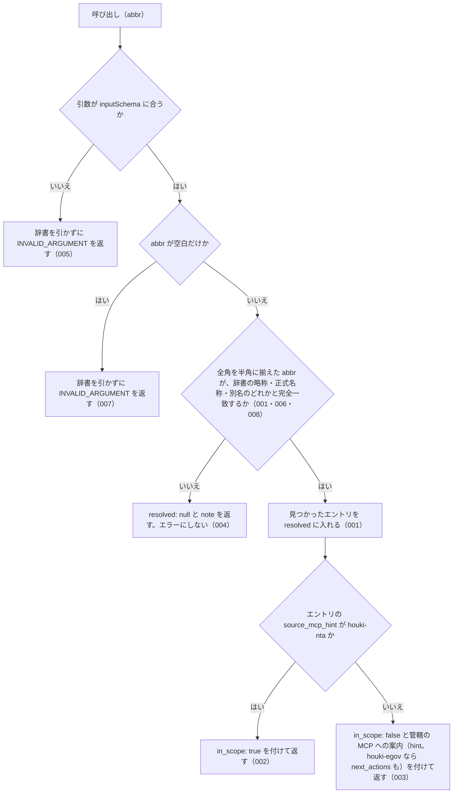

# resolve_abbreviation の仕様

<!-- GENERATED FILE — 手で編集しない。本文は houki-nta-mcp の specs/current/resolve_abbreviation/spec.md の写し。 -->

::: info
houki-nta-mcp **v0.27.0** の `specs/current/resolve_abbreviation/spec.md` から自動生成しました（仕様 ID 8 件・2026-10-10）。手で編集しないでください。再生成は `node scripts/generate-reference.mjs specs` です。
:::

略称・通称から辞書のエントリを 1 件解決する

使いどころ・引数・実測の呼び出し例は、[ツールのページ](/reference/mcp/houki-nta/resolve_abbreviation)にあります。

最後に仕様が変わったのは v0.24.0 の「0.22.0 の取り込みで直し漏れた specs/current の文を、取り込んだ本文に合わせる（#123）」（2026-10-03 承認）です。それまでの経緯は[承認の履歴](#承認の履歴)にあります。

## 使う人と受け取るもの

この機能を誰が呼び、何を渡して何を受け取るかを示します。

- MCP クライアント（Claude などの LLM、または CLI から呼ぶ人）。`abbr` を渡して、その略称・通称が houki-abbreviations の辞書でどの法令・通達を指すか、そしてその本文を houki-nta-mcp で取れるか（管轄か）を受け取る

## 入力

呼び出すときに渡す値です。

| 引数   | 必須 | 内容                                                                                                                                                                    |
| ------ | ---- | ----------------------------------------------------------------------------------------------------------------------------------------------------------------------- |
| `abbr` | 必須 | 略称・正式名称・別名（辞書の `aliases`）のどれか。例: `消基通` / `所基通` / `電帳法取通` / `消費税法基本通達`。前後の空白は無視する。全角英数字・ダッシュ類・全角空白は半角に揃えてから照合する（008）。完全一致で引く（部分一致はしない） |

`format` は無い。応答は常に JSON。

## できないこと

この機能が引き受けないことです。

- 部分一致やあいまい一致で探すこと（完全一致だけ。`消費税` のような通称は辞書の別名に登録されているときだけ引ける）
- 全角・半角の表記ゆれを吸収すること（`ＰＬ法` は辞書に無い扱いになる。未決 2）
- 解決した通達・法令の本文を返すこと（通達は `nta_get_tsutatsu`、法令は管轄先の MCP）
- 管轄外のエントリについて、管轄先の MCP の呼び出し方（`next_actions`）を返すこと（`hint` の文で MCP 名を案内するだけ）
- 1 回の呼び出しで複数の略称を解決すること
- 辞書に無い名前に対して、似た名前の候補を返すこと
- 辞書の版や更新日を返すこと

## 処理の流れ

呼び出しを受けてから応答を返すまでに、何をどの順で確かめるかを示します。図の中の番号は「できること」の仕様 ID の末尾 3 桁です。

## 仕様 ID ごとの約束

この機能が守る約束を、仕様 ID ごとに並べています。見出しは約束を 1 文で表したもので、条件・応答の細部・例は「詳細」を開くと読めます。仕様 ID はそれぞれ受入テストと対応していて、テストの無い ID があると各リポジトリの CI が止まります。

### SPEC-NTA-RESOLVE-ABBREVIATION-001 略称でも正式名称でも辞書のエントリを返す

::: details 詳細
`abbr` を houki-abbreviations の辞書で引き、見つかったエントリを応答の `resolved` に入れて返す。略称（`消基通`）でも正式名称（`消費税法基本通達`）でも同じエントリに解決される。応答の `abbr` には渡された値をそのまま返す。ローカル DB も国税庁サイトも引かない。

`resolved` は辞書のエントリそのままで、次のフィールドを持つ。

| フィールド             | 内容                                                                                    |
| ---------------------- | --------------------------------------------------------------------------------------- |
| `abbr`                 | 辞書に登録された略称。正式名称で引いたときもこれは略称（`消費税法基本通達` → `消基通`） |
| `formal`               | 正式名称                                                                                |
| `law_id`               | e-Gov の法令 ID。通達など e-Gov に無いものは `null`                                     |
| `law_num` / `law_type` | 法令番号と法令種別。法令系のエントリにだけ付く                                          |
| `domain`               | 分野。例: `tax`                                                                         |
| `category`             | 種別。例: `kihon-tsutatsu`（基本通達）/ `kobetsu-tsutatsu`（個別通達）/ `law`（法律）   |
| `source_mcp_hint`      | 本文を持つ MCP の名前。例: `houki-nta` / `houki-egov`                                   |
| `aliases` / `note`     | 別名の一覧と備考。辞書にあるときだけ付く                                                |

例: `abbr: "消基通"` の応答は `abbr: "消基通"`、`resolved.formal: "消費税法基本通達"`、`resolved.law_id: null`、`resolved.category: "kihon-tsutatsu"`、`resolved.source_mcp_hint: "houki-nta"`。
:::

### SPEC-NTA-RESOLVE-ABBREVIATION-002 houki-nta の管轄のエントリには in_scope: true を返す

::: details 詳細
解決したエントリの `source_mcp_hint` が `houki-nta` のとき、応答に `in_scope: true` を付ける。`hint` は付けない。基本通達（`消基通` など）も個別通達（`電帳法取通` など）も同じ。

例: `abbr: "電帳法取通"` の応答は `resolved.category: "kobetsu-tsutatsu"`、`resolved.source_mcp_hint: "houki-nta"`、`in_scope: true` で、`hint` は無い。
:::

### SPEC-NTA-RESOLVE-ABBREVIATION-003 管轄外のエントリには in_scope: false と、管轄の MCP への案内を返す

::: details 詳細
解決したエントリの `source_mcp_hint` が `houki-nta` でないとき（法律・政令・省令など）は、`resolved` にエントリを入れたうえで `in_scope: false` を付ける。エラーにはしない。`hint` と `next_actions` は、管轄の MCP サーバーが houki-hub family にあるかどうかで次のとおりにする。

| `source_mcp_hint` | `hint` | `next_actions` |
| --- | --- | --- |
| `houki-egov`（family にある） | `このエントリは houki-egov の管轄です。houki-egov-mcp で取得してください。` | `{ action: "delegate_to_mcp", reason: "houki-egov の管轄リソースです。該当 MCP に切り替えてください", example: { mcp: "houki-egov" } }` の 1 件。`nta_get_tsutatsu` の `OUT_OF_SCOPE`（[SPEC-NTA-GET-TSUTATSU-002](/specs/houki-nta/nta_get_tsutatsu#spec-nta-get-tsutatsu-002)）と同じ形 |
| それ以外（family にまだ無い） | `このエントリは <source_mcp_hint> の管轄ですが、対応する MCP サーバーはまだありません。` | 付けない（切り替える先が無いため） |

`<source_mcp_hint>-mcp` の形で、まだ無い MCP サーバーの名前（`houki-court-mcp` など）を案内しない。houki-abbreviations 0.7.0 の辞書の `source_mcp_hint` は `houki-egov` と `houki-nta` の 2 つだけなので、2 行目は辞書に新しい管轄が足されたときの備えである。

例: `abbr: "消法"` の応答は `resolved.formal: "消費税法"`、`resolved.source_mcp_hint: "houki-egov"`、`in_scope: false`、`hint: "このエントリは houki-egov の管轄です。houki-egov-mcp で取得してください。"`、`next_actions: [{ action: "delegate_to_mcp", reason: "houki-egov の管轄リソースです。該当 MCP に切り替えてください", example: { mcp: "houki-egov" } }]`（v0.22.0 では `next_actions` が無かった）。`source_mcp_hint` が `houki-court` のエントリを返すときは、`hint` は `このエントリは houki-court の管轄ですが、対応する MCP サーバーはまだありません。` で、`next_actions` は無い。
:::

### SPEC-NTA-RESOLVE-ABBREVIATION-004 辞書に無い名前には resolved: null を返す

::: details 詳細
`abbr` が辞書のどのエントリの略称・正式名称・別名とも一致しないときは、エラーにせず `resolved: null` と `note`（「辞書に該当なし。フル法令名でお試しください」）を返す。応答の `abbr` には渡された値をそのまま返す。`in_scope` と `hint` は付かない。

例: `abbr: "存在しない通達"` の応答は `{ abbr: "存在しない通達", resolved: null, note: "辞書に該当なし。フル法令名でお試しください" }`。
:::

### SPEC-NTA-RESOLVE-ABBREVIATION-005 inputSchema に合わない引数は INVALID_ARGUMENT で止める

::: details 詳細
`abbr` が文字列でない、`abbr` が無い、inputSchema に無い引数がある、のいずれかのときは、辞書を引かずにエラー `INVALID_ARGUMENT` を返す（`isError: true`）。エラーには `tool: "resolve_abbreviation"`、`detail.issues`（各要素に `path` と `message`。`path` は引数名）、`hint`（tools/list の inputSchema を確かめる案内）、`next_actions`（`list_tools`）が付く。

例: `abbr: 123` を渡すと `code: "INVALID_ARGUMENT"`、`tool: "resolve_abbreviation"`、`detail.issues[0].path: "abbr"`。
:::

### SPEC-NTA-RESOLVE-ABBREVIATION-006 辞書の別名（`aliases`）でも同じエントリを返す

::: details 詳細
`abbr` が辞書のエントリの略称でも正式名称でもなく、そのエントリの `aliases` にある名前のときも、そのエントリを `resolved` に入れて返す（[SPEC-NTA-RESOLVE-ABBREVIATION-001](#spec-nta-resolve-abbreviation-001) と同じ形）。管轄の判定（[SPEC-NTA-RESOLVE-ABBREVIATION-002](#spec-nta-resolve-abbreviation-002)・003）も同じように行う。

例: `abbr: "電帳法取扱通達"` は `resolved.abbr: "電帳法取通"`・`resolved.source_mcp_hint: "houki-nta"` のエントリに解決され、`in_scope: true`。`abbr: "消費税"` は `resolved.abbr: "消法"`・`resolved.formal: "消費税法"` のエントリに解決され、houki-egov の管轄なので `in_scope: false` と誘導の `hint` が付く。応答の `abbr` は渡した値のまま。
:::

### SPEC-NTA-RESOLVE-ABBREVIATION-007 abbr が空文字・空白だけのときは略称辞書を引かずに `INVALID_ARGUMENT` を返す

::: details 詳細
空文字は inputSchema の `minLength: 1` の検査（[SPEC-NTA-COMMON-ERRORS-013](/specs/houki-nta/common_errors#spec-nta-common-errors-013)）で止まり、`INVALID_ARGUMENT`（`tool: "resolve_abbreviation"`、`detail.issues: [{ path: "abbr", message: "空文字は指定できません" }]`）を返す。空白（半角スペース・全角スペース・タブ・改行）だけのときは、ツールの処理が略称辞書を引く前に、[SPEC-NTA-COMMON-ERRORS-014](/specs/houki-nta/common_errors#spec-nta-common-errors-014) の形の `INVALID_ARGUMENT`（`tool: "resolve_abbreviation"`、`error: "abbr が空です"`、`detail.issues: [{ path: "abbr", message: "空白だけは指定できません" }]`、`hint` に略称・正式名称・別名を渡すよう書く）を返す。

例: `abbr: ""` は `code: "INVALID_ARGUMENT"`・`detail.issues[0].message: "空文字は指定できません"`。`abbr: "　"`（全角スペース）と `abbr: " \n"` は `code: "INVALID_ARGUMENT"`・`error: "abbr が空です"`。どれも略称辞書は引かない。

v0.21.3 では空文字・空白だけの `abbr` に `resolved: null` と `note`（[SPEC-NTA-RESOLVE-ABBREVIATION-004](#spec-nta-resolve-abbreviation-004) の形）を返していたが、空の `abbr` は辞書に無い名前ではなく引数の誤りなので、004 の対象から外れる。houki-egov-mcp の `resolve_abbreviation`（[SPEC-EGOV-RESOLVE-ABBREVIATION-010](/specs/houki-egov/resolve_abbreviation#spec-egov-resolve-abbreviation-010)）と同じ。
:::

### SPEC-NTA-RESOLVE-ABBREVIATION-008 `abbr` の全角英数字・ダッシュ類・全角空白は半角に揃えてから辞書と照合する

::: details 詳細
`abbr` は、houki-abbreviations の `resolveAbbreviation(name, { normalize: true })` の規則（全角英数字を半角に、ダッシュ類 `－` `‐` `‑` `–` `—` `―` `−` を `-` に、全角チルダ `～` `〜` を `~` に、全角空白を半角空白にし、前後の空白を除く。罫線 `─` と長音 `ー` は変えない。大文字と小文字は区別する）で揃えてから、略称・正式名称・別名と照合する（[SPEC-NTA-SEARCH-RULES-019](/specs/houki-nta/search_rules#spec-nta-search-rules-019)）。応答の `abbr` は渡した値のまま。

例: `abbr: "ＰＬ法"` は `resolved.formal: "製造物責任法"`・`in_scope: false` で、応答の `abbr` は `"ＰＬ法"`（v0.21.3 では `resolved: null` だった）。`abbr: "消基通　"`（末尾が全角空白）は `消費税法基本通達`・`in_scope: true`。`abbr: "pl法"` は大文字小文字が違うので `resolved: null` のまま。
:::

## まだ決めていないこと

仕様を書き起こしたときに見つかった項目のうち、扱いを決めている途中のものです。開くと、元の仕様書の記述をそのまま読めます。

::: details 仕様書の「未決」の節
初版起こしで見つけた、意図か不具合かを人が決める項目です。決まったら「できること」に ID を振るか、`specs/changes/` の差分にします。

意図か不具合かの判断が要る項目は houki-nta-mcp の Issue に移し、ここには題と Issue の番号だけを残します。今の振る舞いのままでよくテストが無いだけの項目は、受入テストを書いてから「できること」に ID を振ります。

4. **`hint` が案内する MCP 名。** → [SPEC-NTA-RESOLVE-ABBREVIATION-003](#spec-nta-resolve-abbreviation-003)
:::

## 承認の履歴

この機能の仕様が、いつ、どの変更で承認されたかを新しい順に並べています。各リポジトリの `npx spec-ids history resolve_abbreviation` と同じ内容です。変更の名前から、変更の理由と前後の振る舞いを書いた文書（GitHub）を開けます。

::: details 承認の履歴（9 件）
| 承認日 | 版 | 変更 | 仕様 PR |
|---|---|---|---|
| 2026-10-03 | v0.24.0 | [0.22.0 の取り込みで直し漏れた specs/current の文を、取り込んだ本文に合わせる（#123）](https://github.com/shuji-bonji/houki-nta-mcp/blob/v0.27.0/specs/releases/v0.24.0/20261003-specs-current-catchup/proposal.md) | [#132](https://github.com/shuji-bonji/houki-nta-mcp/pull/132) |
| 2026-10-03 | v0.23.0 | [hint・next_actions・説明文・CLI の使い方と実際の動きの食い違いを、行ごとに直す（T5 文書と実装の食い違い）](https://github.com/shuji-bonji/houki-nta-mcp/blob/v0.27.0/specs/releases/v0.23.0/20261003-t5-docs-mismatch/proposal.md) | [#126](https://github.com/shuji-bonji/houki-nta-mcp/pull/126) |
| 2026-10-01 | v0.22.0 | [全角・半角・ダッシュ類の揃え方を houki-abbreviations 0.7.0 に一本化する（T3）](https://github.com/shuji-bonji/houki-nta-mcp/blob/v0.27.0/specs/releases/v0.22.0/20261001-t3-normalize/proposal.md) | [#119](https://github.com/shuji-bonji/houki-nta-mcp/pull/119) |
| 2026-10-01 | v0.22.0 | [「見つからない」と「取得元の失敗」の code を分ける（T2）](https://github.com/shuji-bonji/houki-nta-mcp/blob/v0.27.0/specs/releases/v0.22.0/20261001-t2-error-codes/proposal.md) | [#118](https://github.com/shuji-bonji/houki-nta-mcp/pull/118) |
| 2026-10-01 | v0.22.0 | [引数の検査を inputSchema に書き、丸めずに `INVALID_ARGUMENT` にする（T1）](https://github.com/shuji-bonji/houki-nta-mcp/blob/v0.27.0/specs/releases/v0.22.0/20261001-t1-argument-guards/proposal.md) | [#117](https://github.com/shuji-bonji/houki-nta-mcp/pull/117) |
| 2026-09-27 | v0.21.1 | [取得系ツールと nta_inspect_pdf_meta の応答の形に仕様 ID を振る](https://github.com/shuji-bonji/houki-nta-mcp/blob/v0.27.0/specs/releases/v0.21.1/20260927-get-responses/proposal.md) | [#89](https://github.com/shuji-bonji/houki-nta-mcp/pull/89) |
| 2026-09-26 | v0.21.1 | [「未決」のうち判断が要る 45 件を Issue に移す](https://github.com/shuji-bonji/houki-nta-mcp/blob/v0.27.0/specs/releases/v0.21.1/20260926-undecided-to-issues/proposal.md) | [#74](https://github.com/shuji-bonji/houki-nta-mcp/pull/74) |
| 2026-09-26 | v0.21.1 | [全 14 ツールの spec.md に「処理の流れ」の節を足す](https://github.com/shuji-bonji/houki-nta-mcp/blob/v0.27.0/specs/releases/v0.21.1/20260926-processing-flow/proposal.md) | [#63](https://github.com/shuji-bonji/houki-nta-mcp/pull/63) |
| 2026-09-26 | — | 初版 | [#63](https://github.com/shuji-bonji/houki-nta-mcp/pull/63) |
:::

## 関連ページ

このページの元になった文書と、あわせて読むページです。

- [houki-nta-mcp の仕様の一覧](/specs/houki-nta/)
- [houki-nta-mcp の解説](/mcp/houki-nta)
- [resolve_abbreviation のツールのページ（リファレンス）](/reference/mcp/houki-nta/resolve_abbreviation)
- [元の仕様書（GitHub、v0.27.0）](https://github.com/shuji-bonji/houki-nta-mcp/blob/v0.27.0/specs/current/resolve_abbreviation/spec.md)
