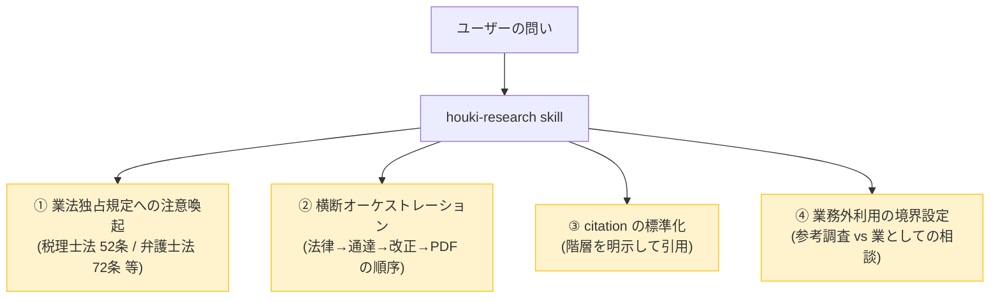
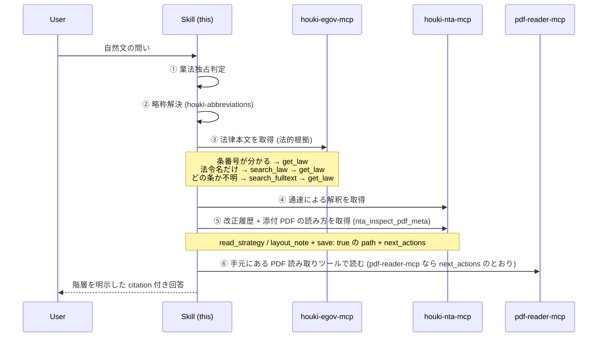
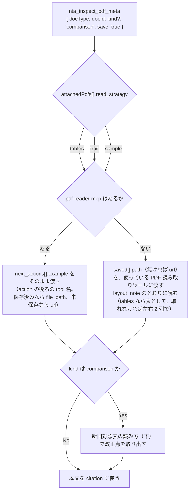

# houki-research Skill の仕様

<!-- GENERATED FILE — 手で編集しない。houki-research-skill の skills/houki-research/SKILL.md と workflows/ から生成。 -->

::: info
houki-research Skill **v0.20.0** の `skills/houki-research/SKILL.md` と `workflows/` から自動生成しました（workflow 2 件・2026-10-09）。手で編集しないでください。再生成は `node scripts/generate-reference.mjs specs` です。
:::

Skill には実行するコードが無く、SKILL.md の文章そのものが仕様です。そのため MCP のような仕様 ID と承認の履歴は無く、このページと workflow のページは SKILL.md と workflows/ の本文を言い換えずに写しています。

## 目的

Skill を読み込んだ LLM が、いつこの Skill を使うかの説明です（SKILL.md の `description`）。

日本の **全法規 (法律・政令・省令・通達・判例・裁決・行政解釈)** を横断調査するときに使う Skill。`houki-hub` MCP family を組み合わせ、「法律本文 → 政令・省令 → 通達 → 改正履歴 → 添付 PDF → 判例・裁決」の階層を縦串で引用する流れを誘導する。問いの形は問わない — 「この仕様は法令のどこに触れるか」「この機能の法令上の要件は」(実装前の確認)、「この取扱いの根拠は」「その通達は今も有効か」(通達・Q&A から根拠条文へ)、「この改正はいつから」(改正履歴)、「私の場合はどうなるか」(個別の事案。条文と論点までを返し結論は返さない) のいずれでも呼び出す。業法独占規定 (税理士法 52 条 / 弁護士法 72 条 / 司法書士法 3 条 / 社労士法 27 条) への配慮と citation 標準化も担う。税務・労務・登記・法律事務など分野を問わず、日本の法令文献調査が必要になったときに最初に呼び出す。

## この skill が担う 4 つの責務

この Skill が LLM に指示する内容の分担です。



詳細はそれぞれ [`docs/BUSINESS-LAW.md`](https://github.com/shuji-bonji/houki-research-skill/blob/v0.20.0/skills/houki-research/docs/BUSINESS-LAW.md) / [`docs/ARCHITECTURE.md`](https://github.com/shuji-bonji/houki-research-skill/blob/v0.20.0/skills/houki-research/docs/ARCHITECTURE.md) / [`docs/CITATION.md`](https://github.com/shuji-bonji/houki-research-skill/blob/v0.20.0/skills/houki-research/docs/CITATION.md) を参照。

## workflow の一覧

問いの形ごとの手順です。問いに合う workflow を選ぶと、呼ぶツールとその順序が決まります。

| workflow | 内容 | ステップ |
|---|---|---|
| [feasibility-check](/specs/houki-research/feasibility-check) | 実装する前に、その仕様が法令のどこに触れるかを条文で確かめる | 7 |
| [tax-research](/specs/houki-research/tax-research) | 税務リサーチの基本フロー | 10 |

## 鉄則 (この順序を絶対に守る)

どの workflow でも守る順序と約束です。見出しを開くと、SKILL.md の本文を読めます。

### 鉄則 1: 業法独占規定への注意は **回答前に** 行う

::: details 詳細
このスキルが引き受けるのは **士業者に相談するまでの情報整理** であり、相談の代わりではない。利用者が有資格者のところへ持って行けるように、関わる条文と拘束力の別と、何が事実認定に依存するかまでを揃える。

ユーザーの問いが以下のように見えたら、**情報提供は行うが業務への適用判断は専門家へ案内する**旨を回答冒頭で明示する。

| パターン                                                             | 該当する独占業務 |
| -------------------------------------------------------------------- | ---------------- |
| 「私の確定申告で…」「うちの会社の決算で…」など個別具体の判断を求める | 税理士法 52 条   |
| 「この契約書の条項は…」「相続でこの遺産分割は…」など個別法律事務     | 弁護士法 72 条   |
| 「会社設立の登記を…」「不動産の所有権移転を…」                       | 司法書士法 3 条  |
| 「労務管理で就業規則を…」「労働者派遣の届出を…」                     | 社労士法 27 条   |

文献調査・制度の概観・条文の引用・改正履歴の説明は **適法な情報提供の範囲**として実施可能。最終判断は税理士・弁護士・司法書士・社労士などの有資格者の関与が必要であることをユーザーに案内する。

何を返し、何を返さないかは [`docs/BUSINESS-LAW.md` の応答型](https://github.com/shuji-bonji/houki-research-skill/blob/v0.20.0/skills/houki-research/docs/BUSINESS-LAW.md#応答型) に固定してある。**回答を書く前にこの表を見る。**

| | 内容 |
| --- | --- |
| **返すもの** | 条文・通達・裁決の提示 (citation 付き) / 制度の概観と改正履歴 / 論点の列挙 / 何が事実認定に依存するかの明示 / `legal_status` の階層 |
| **返さないもの** | 結論 (該当する・しない) / 可否の判定 / 金額・税額の確定 / 書類の起案・文案 / 「おそらく〜でしょう」を含む推測 |

「返さないもの」は注意喚起を添えても返さない。当てはめの基準は条文と通達に書いてあるが、返さない理由は精度ではなく独占規定である。判定の置き場所で言えば、当てはめは **系の外** (有資格者) にある。
:::

### 鉄則 2: 略称は最初に houki-abbreviations 系で解決する

::: details 詳細
ユーザーが「**消基通**」「**所基通**」「**インボイス**」のような略称を使った場合、最初に **houki-nta-mcp が内蔵する** `resolve_abbreviation` (または各 MCP 内蔵辞書) で正式名と source_mcp_hint を取得する。これにより:

- 略称→正式名の正確な引き当て
- どの MCP に問い合わせるべきか (`source_mcp_hint`) が確定
- 管轄外なら誘導ヒントを返せる
:::

### 鉄則 3: 法律 → 通達 → 改正 → 添付 PDF の順で引く

::: details 詳細


法律本文 (③) の入口は 5 つある。**問いに含まれている情報で選ぶ**:

| 分かっていること | 呼ぶ tool | 例 |
| --- | --- | --- |
| 法令名 + 条番号 | `get_law` | `{ "law_name": "消費税法", "article": "57の2" }` |
| 法令名だけ（条は不明） | `get_toc` → `get_law` | 目次で当たりを付けてから本文 |
| 法令名 + 章・節（「民法の契約の章」） | `get_toc` → `get_law_range` | 目次の `toc[].path` を渡す（`{ "law_name": "民法", "path": "Part3/Chapter2" }`。houki-egov-mcp v0.14.0 以上） |
| 法令名すら不確か | `search_law` → `get_law` | `{ "keyword": "適格請求書" }` で法令名を探す |
| 「どの法令の何条に書いてあるか」自体が不明 | `search_fulltext` → `get_law` | `{ "keyword": "民法 不法行為" }` で条文本文を横断検索 |

`search_fulltext` はローカル DB (`npx -y @shuji-bonji/houki-egov-mcp@latest --bulk-download-everything` で構築) を引く。DB を引けないとき (DB が無い・まだ法令が取り込まれていない・開けないとき、また houki-egov-mcp v0.19.0 以上では DB の版がこの houki-egov-mcp と合わないとき) は、応答の `source` が `"api-fallback"` になり、`search_law` の結果が `fallback` に入って返る。このときは **本文検索ができていない**ので、回答で「法令名の一致で探した」と明示し、`note` の案内をユーザーに伝える。`next_actions` に `bulk_download_everything` があればその `example.command` (DB の構築・作り直し) を、無ければ `note` の続きの文 (houki-egov-mcp の更新、DB ファイルを消してからの構築、DB のパスの確認) を案内する。houki-egov-mcp v0.20.0 以上では、`note` の先頭に MCP サーバーが開こうとした DB のパスが入る。先頭の文ごとの DB の状態と、投入したはずなのに DB が見つからないときに `--status` で DB の場所を確かめる手順は、[`docs/ERROR-HANDLING.md`](https://github.com/shuji-bonji/houki-research-skill/blob/v0.20.0/skills/houki-research/docs/ERROR-HANDLING.md) の「`search_fulltext` の `api-fallback`」と「MCP サーバーが開いている DB を確かめる」にある。

#### 通達や質疑応答事例を先に引いたら、法律本文へ戻る (houki-nta-mcp v0.11.0 以上。質疑応答事例は v0.12.0 以上)

問いによっては通達の検索 (④) や質疑応答事例 (`nta_search_qa` / `nta_get_qa`) から入ることがある。通達は国民・裁判所を拘束しない。質疑応答事例は国税庁の参考資料で、税務署員も拘束しない (`legal_status` の `binds_*` がすべて `false`)。**どちらも、それだけで回答を終えず、必ず法律本文 (③) へ戻る**。戻り先は houki-nta-mcp の応答に入っている:

| 呼んだ tool | 戻り先が入るフィールド | 中身 |
| --- | --- | --- |
| `nta_get_tsutatsu` | `base_laws` | その通達が解釈している法律・施行令・施行規則の配列 |
| `nta_search_tsutatsu` | `base_laws_by_tsutatsu` | 結果に現れた通達ごとの同じ配列 (`hits[].tsutatsu` をキーに引く) |
| `nta_get_qa` (`format: "json"`) | `related_laws` / `related_tsutatsu` | 【関係法令通達】欄を分けたもの。法令は `law_name` / `article` / `paragraph` / `item`、通達は `name` / `clause`。元の文字列は `raw` |
| 上のすべて | `next_actions` | `{ "action": "delegate_to_mcp", "example": { "mcp": "houki-egov", "tool": "get_law", … } }`。質疑応答事例では `nta_get_tsutatsu` への案内も入る。**エラーでなくても付く** |

`example` の読み方に注意する。`mcp` と `tool` は **どの MCP のどの tool を呼ぶか**を示すもので、引数ではない。houki-egov-mcp v0.6.0 以上と houki-nta-mcp v0.14.0 以上は inputSchema に無い引数を `INVALID_ARGUMENT` で返すので、`example` をそのまま渡すと `mcp, tool: inputSchema に無い引数です` になる。**`mcp` と `tool` を除いた残りを引数にする**。

```jsonc
// nta_get_qa の next_actions[0].example
{ "mcp": "houki-egov", "tool": "get_law", "law_name": "消費税法", "article": "2", "paragraph": 1, "item": 8 }
// → houki-egov-mcp の get_law に渡す引数
{ "law_name": "消費税法", "article": "2", "paragraph": 1, "item": 8 }
```

通達から戻るとき:

1. `next_actions[].example` から `mcp` と `tool` を除いた残り (法律名だけが入っている) を houki-egov-mcp の `get_law` に渡す
2. 条番号は応答に入っていない。通達の本文にある「法第34条第6項」「令第133条」のような参照を読み、`base_laws` の該当する法令名と `article` / `paragraph` を指定して引き直す。基本通達の本文では「法」は法律、「令」は施行令、「規則」は施行規則を指すのが通例 (正確には各通達の冒頭の用語の定義で確かめる)
3. 引いた条文を citation の「法律 (法的根拠)」「政令 / 省令」に置き、通達はその下の「行政解釈」に置く

質疑応答事例から戻るとき:

1. `nta_get_qa` は `format` の既定が `markdown` で、markdown には `related_laws` などが出ない。**`format: "json"` を指定する**
2. `next_actions[].example` には条・項・号まで入っているので、`mcp` と `tool` を除いた残りを `get_law` に渡す。通達と違い、条番号を本文から補う手順は要らない。`nta_get_tsutatsu` への案内の `example` は `name` と `clause` だけなので、そのまま渡せる
3. 枝番号の号 (「法人税法第2条第12号の8」) は `item: "12の8"` の文字列で入る (houki-nta-mcp v0.14.0 以上)。`get_law` が文字列の `item` を受け付けるのは houki-egov-mcp v0.6.0 以上。それより前の egov なら `item` を外して項全体を引き、本文から探す
4. `next_actions` が付かない参照は、`related_laws` / `related_tsutatsu` の `raw` を読んで次のとおり扱う:

| 参照 | 例 | 扱い |
| --- | --- | --- |
| 租税条約 | 「日・ハンガリー租税条約第12条第2項(b)」 | e-Gov では引けない。`raw` を citation に書き、条約の本文は確認していないと明記する |
| 「旧」「改正前」の条文 | 「旧所得税法第…条」 | `get_law_revisions` で改正の時点を調べ、その前の日付を `get_law` の `at` に渡す。時点が決まらなければ `raw` だけ書く。`qa.basisDate` は質疑応答事例の作成時点で、改正前の時点ではない |
| 条番号の無い法令 | 「消費税法施行令」だけ | `get_toc` → `get_law`（章・節を通して読むなら `get_law_range`） |
| 基本通達 4 種以外の通達 | 「租税特別措置法関係通達70の6-6」 | `nta_get_tsutatsu` は扱わない。`raw` を citation に書く |

5. 引いた条文を「法律 (法的根拠)」に、通達を「行政解釈」に置き、質疑応答事例はその下の「参考情報 (拘束力なし)」に置く。`qa.notice` (作成時点と、個別の取引では異なる課税関係が生じうるという国税庁の断り書き) を注に残す

タックスアンサー (`nta_get_tax_answer`) には構造化された根拠法令が無い。本文の「根拠法令等」の節を読み、そこに挙がっている法令を `get_law` で引く。

8xxx 帯 (災害関係) の docId も、houki-nta-mcp v0.24.0 以上では `nta_get_tax_answer` で取れる。`nta_search_tax_answer` の `next_actions` が 8xxx の `nta_get_tax_answer` を案内したら、そのまま従ってよい。v0.23.x 以前は 8xxx を `INVALID_ARGUMENT` で断るので、その案内には従わず、`results[].sourceUrl` を案内する。

houki-nta-mcp が v0.10.x 以前だと `base_laws` は無く、v0.11.x 以前だと `related_laws` は無い。そのときは本文の参照から法令名を自分で補う。

#### 添付 PDF に当たったら、読み方を応答から取り、手元の読み手で読む (houki-nta-mcp v0.19.0 以上)

改正通達の本体は PDF（新旧対照表・別紙）のことが多い。houki-nta-mcp は PDF の本文を読まないので、`nta_inspect_pdf_meta` の応答から **読み方** を取り、**手元にある PDF 読み取りツール** で読む。読み手は pdf-reader-mcp に限らない。



手順:

1. `nta_inspect_pdf_meta` を呼ぶ。改正点だけが要るなら `kind: "comparison"`。改正通達（kaisei）で「別紙1」「別紙2」とだけ題した PDF は本文の新旧対照表であることが多く、houki-nta-mcp v0.20.0 以上は `comparison` として返す（v0.19.x は `attachment` になるので、`kind` を付けずに全件を見て別紙も読む）。`kind: "comparison"` が 0 件で `note` に「kind="attachment" の別紙も読んでください」とあれば、`kind: "attachment"` で呼び直す。表として取りたい（`read_strategy` が `tables` の PDF がある）なら `save: true` を付ける。pdf-reader-mcp の `extract_tables` / `read_text` はローカルファイル（`file_path`）しか受け取らず、`read_url` は URL のまま本文を返すだけで表としては取れない
2. 応答の `attachedPdfs[]` を見る。`read_strategy` は `tables`（表として取る。新旧対照表・別紙）/ `text`（本文として読む。Q&A・参考資料・通知）/ `sample`（先頭を見て決める。種別不明）。`layout_note` に紙面の組み方が書いてある。この 2 つは道具の名前を含まないので、どの読み手でも使える
3. pdf-reader-mcp があるなら、`next_actions` の `action` が `pdf-reader-mcp:<tool>` の件の `example` を、その tool にそのまま渡す（`example` は引数だけで、`mcp` / `tool` は入っていない）。保存済みなら `extract_tables` / `read_text` / `summarize` に `file_path`、未保存なら `read_url` に `url`（新旧対照表は `split_columns: 2` 付き）
4. pdf-reader-mcp が無いなら、`next_actions` の最後の `read_pdf` の `example`（`url`、保存済みなら `path` も）を、使っている PDF 読み取りツールに渡す。Claude Code なら `Read` に `path` を渡せる。`layout_note` のとおりに読む
5. `saved[].error` が付いた PDF は保存できていない（`HTTP 404`、`PDF ではありません（Content-Type: text/html）` など）。その PDF は `url` のまま読む。`note` に件数が出る

新旧対照表（`kind: "comparison"`）から改正点を取り出すのは、表を読んだ後の LLM の仕事:

- 左右どちらが改正後かを **見出し行で確かめる**。国税庁の新旧対照表は左が改正後、右が改正前のことが多いが、決め打ちしない
- 変更箇所は下線（傍線）で示される。表として取れたときは下線の情報が落ちるので、左右の文を突き合わせて差分を拾う
- 改正前の側の「（同左）」は改正後と同じ文、「（省略）」は改正に関係しない部分の省略。新設・削除の印は 2 通りある。本文の新旧対照表（改正通達の「別紙 N」）は丸括弧で「（新設）」（改正前に無い項）「（削除）」（改正後に無い項）、章の構成の対応表（「【参考】…新旧対応表」）は墨付き括弧で「【新設】」「【削除】」「【一部改正】」（改正前にもある項で、内容が変わったもの）。どちらの印でも「（新設）」「【新設】」は改正前の側、「（削除）」「【削除】」は改正後の側に置かれ、意味は同じに読む。引用している条項の番号がずれることがある（改正後は「第２条第 16 項」、改正前は「第２条第 15 項」）ので、番号ではなく内容で対応を取る
- `comparison` が複数あるときは、どれが本文の新旧対照表でどれが章の構成（通達番号）の対応表かをタイトルで見分ける。改正点の根拠にするのは本文の新旧対照表（「別紙 N」）で、対応表は通達番号の付け替えを確かめるのに使う
- 見出し行の下に「（注）アンダーラインを付した箇所が改正した箇所である。」と書かれているので、その文があれば下線が差分の印だと分かる
- 表として取れなかった（`extract_tables` が 0 件、タグ無し）ときは `read_text` / `read_url` に `split_columns: 2` を付けて左右を分ける。1 列として読むと改正後と改正前の文が交互に混ざる
- citation には、読んだ PDF の `url`、`kind`、どの読み手で読んだか（表として取れたか、本文として読んだか）を書く（[`docs/CITATION.md`](https://github.com/shuji-bonji/houki-research-skill/blob/v0.20.0/skills/houki-research/docs/CITATION.md)）

houki-nta-mcp が v0.18.x 以前だと `read_strategy` / `layout_note` / `saved` / `next_actions` は無く、代わりに `reader_hints.examples` が付く。その `args: { url }` を `extract_tables` にそのまま渡すと失敗する（`extract_tables` は `file_path` しか受け取らない）。`url` を `read_url` に渡し、新旧対照表なら `split_columns: 2` を付ける。

#### 索引から消えた文書は現行の取扱いとして引用しない (houki-nta-mcp v0.17.0 以上)

`nta_search_*` の結果の各件と `nta_get_*` の応答の `index_status` が `"removed_from_index"` なら、その文書は国税庁の索引から外れている（`orphaned_at` に、それを最初に確認した日時が入る）。houki-nta-mcp v0.23.0 以上では、索引にある文書にも `index_status: null` / `orphaned_at: null` が付くので、キーの有無ではなく値で見る。houki-nta-mcp は削除せず残しているので、過去の課税期間を調べるときは引ける。**現在の取扱いを答える根拠にはしない。**

- 検索結果から除外はされない。索引にある文書と同じ形で並び、`search_notes` に「N 件のうち M 件は索引から外れています」の行が入る
- `sourceUrl` は 404 になることがある。本文はローカル DB に残っているので `nta_get_*` では読める
- 現在の取扱いを問われているなら、同じ論点の現行の文書を探し直す。見つからなければ「索引から外れた文書しか見つからなかった」と書き、断定しない
- citation では、`index_status` が `"removed_from_index"` であることと `orphaned_at` を注に残す ([`docs/CITATION.md`](https://github.com/shuji-bonji/houki-research-skill/blob/v0.20.0/skills/houki-research/docs/CITATION.md))

`freshness` の `stale` / `outdated` とは別のことを指す。`freshness` は「最後に取得してから日が経った」で、`index_status` は「国税庁の索引から外れた」。ローカル DB が新しくても印は付く。houki-nta-mcp v0.24.1 以上では、索引から外れた文書は `freshness` の範囲に入らないので、投入をやり直せば `freshness` は `fresh` に戻る (v0.24.0 以前は、索引から外れた文書の古い取得日時のせいで `stale` / `outdated` のまま残ることがあった)。

houki-nta-mcp が v0.16.x 以前だと `index_status` は付かない。そのときは索引から消えた文書を現行の文書と区別できないので、`sourceUrl` が 404 になる文書に当たったら、その旨を citation に書く。

#### 取得ツールの `source` は取得時刻の意味を変える (houki-nta-mcp v0.16.0 以上)

`nta_get_tsutatsu` / `nta_get_qa` / `nta_get_tax_answer` の応答の `source` は、ローカル DB (`"db"`) と国税庁サイト (`"live"`) のどちらから返したかを示す (質疑応答事例とタックスアンサーは v0.16.0 以上。それ以前は毎回国税庁サイトから取得していた)。

判断の根拠は変わらないが、`fetchedAt` の意味が変わる。`"db"` なら bulk download で取り込んだ日時で、呼び出した時刻ではない。citation の取得時刻にはその値をそのまま書く。呼び出した時刻に置き換えない。
:::

### 鉄則 4: citation は階層を明示する

::: details 詳細
回答の末尾に **「Sources:」** セクションを設け、各情報の階層を必ず示す。詳細は [`docs/CITATION.md`](https://github.com/shuji-bonji/houki-research-skill/blob/v0.20.0/skills/houki-research/docs/CITATION.md)。

書き出す前に、法律・政令・省令の引用を `verify_citations` にまとめて渡して実在を確かめる (houki-egov-mcp v0.11.0 以上)。`summary.all_found` が true のときだけ「引用はすべて実在を確認した」と書ける。`not_found` の件は citation から外して引き直し、`ambiguous` の件は `candidates[]` から選び直す。判定ごとの扱いは [`docs/CITATION.md` の「引用を書き出す前に確かめる」](https://github.com/shuji-bonji/houki-research-skill/blob/v0.20.0/skills/houki-research/docs/CITATION.md#引用を書き出す前に確かめる-verify_citations)。

```markdown
## Sources

### 法律 (法的根拠)

- 消費税法 第57条の2 (e-Gov, 取得時刻 2026-05-07T...) — [link](https://...)

### 行政解釈 (税務署員を拘束)

- 消費税法基本通達 1-7-2 「登録番号の構成」 (国税庁, 取得時刻 ...) — [link](https://...)
  > legal_status: binds_tax_office=true, binds_citizens=false

### 改正履歴 (差分 PDF)

- 消費税法基本通達 一部改正 (2025-04-01) — 新旧対照表 (kind: comparison) — [link](https://...)
  > 表として抽出 (pdf-reader-mcp の extract_tables)。左が改正後、右が改正前を見出し行で確認
```
:::

### 鉄則 5: エラー時はフォールバックして citation で注記する

::: details 詳細
各 MCP は family 共通の `code` 語彙でエラーを返す。LLM はエラーコードをユーザーに直接見せず、[`docs/ERROR-HANDLING.md`](https://github.com/shuji-bonji/houki-research-skill/blob/v0.20.0/skills/houki-research/docs/ERROR-HANDLING.md) のフォールバック方針に従って代替経路を試み、citation で「PDF 抽出失敗のため HTML で代替」のように注記する。どの MCP がどの code を返すかは [`docs/ERROR-CODES.md`](https://github.com/shuji-bonji/houki-research-skill/blob/v0.20.0/skills/houki-research/docs/ERROR-CODES.md) の一覧（正本は各 MCP の仕様）を、3 MCP 横断の具体的フォールバック例は [`examples/error-recovery-patterns.md`](https://github.com/shuji-bonji/houki-research-skill/blob/v0.20.0/skills/houki-research/examples/error-recovery-patterns.md) を参照。

| 典型エラー                              | 対応                                       |
| --------------------------------------- | ------------------------------------------ |
| `LAW_NOT_FOUND` / `*_NOT_FOUND`         | 略称解決 → 検索 → 目次の順でフォールバック |
| `DOC_NOT_FOUND` / `TSUTATSU_NOT_FOUND` で `next_actions` が `cli_bulk_download` | その種別の文書がローカル DB に無い。**「該当なし」と答えない**。フォールバックせず、`next_actions` の投入コマンドをユーザーに案内する (検索ツールは houki-nta-mcp v0.13.0 以上、取得ツールは v0.14.1 以上)。v0.26.x 以前の `nta_get_tsutatsu` で基本通達 4 種以外の通達を求めたときは除く (下の「今は取り込めません」の行) |
| `DOC_NOT_FOUND` / `TSUTATSU_NOT_FOUND` で `hint` が `ローカル DB（<パス>）を開けません` で始まる | ローカル DB のファイルを開けない (houki-nta-mcp v0.26.0 以上)。**「該当なし」と答えない**。検索でのフォールバックも投入の案内もせず、`hint` のパスと確かめること、`--status` のコマンドをユーザーに伝える (v0.25.x 以前は同じ場面が `INTERNAL_ERROR`。[`docs/ERROR-HANDLING.md`](https://github.com/shuji-bonji/houki-research-skill/blob/v0.20.0/skills/houki-research/docs/ERROR-HANDLING.md) の `INTERNAL_ERROR` の節) |
| `TSUTATSU_NOT_FOUND` で `hint` が `この通達（<正式名>）は、今は取り込めません` で始まる (`nta_get_tsutatsu`) | 基本通達 4 種 (消基通・所基通・法基通・相基通) 以外の通達 (`電帳法取通` など) は houki-nta-mcp では取れない (houki-nta-mcp v0.27.0 以上。SPEC-NTA-GET-TSUTATSU-007)。**「通達は無い」と答えない**。略称解決・検索でのフォールバックも投入の案内もせず、通達なしで、法律本文と国税庁サイトの案内までで部分回答し、「houki-nta-mcp の対象外」と書く。v0.26.x 以前は同じ場面で `next_actions` が `cli_bulk_download` (`--bulk-download --tsutatsu=…`) になるが、実行しても終了コード 2 で止まるので実行させない。`error` が `ライブ取得用 URL も未登録です` で終わることで見分ける ([`docs/ERROR-HANDLING.md`](https://github.com/shuji-bonji/houki-research-skill/blob/v0.20.0/skills/houki-research/docs/ERROR-HANDLING.md) の `TSUTATSU_NOT_FOUND` の節) |
| 取得ツールの `DOC_NOT_FOUND` で `available_doc_ids` が付く | docId の誤り。投入は案内しない。`available_doc_ids` から選ぶか、`next_actions` の検索ツールで docId を探し直す (houki-nta-mcp v0.14.1 以上。v0.21.x までは `nta_get_kaisei_tsutatsu` / `nta_get_jimu_unei` の code が `TSUTATSU_NOT_FOUND`) |
| `SOURCE_TIMEOUT` / `SOURCE_UNAVAILABLE` | 1 回のエラーにつき retry は 1 回、同じセッションで合わせて 2 回まで。失敗時は平易に説明 |
| `SOURCE_RATE_LIMITED`                   | 当該セッションで同種呼び出しを停止         |
| `INVALID_PDF` / `ENCRYPTED_PDF`         | HTML 版や別添付に切替、citation に注記     |
| `INVALID_ARGUMENT`                      | `detail.issues[].path` の引数を直して呼び直す。ユーザーに見せない |
| `verify_citations` の件ごとの `not_found` / `ambiguous` | ツール全体のエラーではない。`results[]` の件ごとに扱う ([`docs/CITATION.md`](https://github.com/shuji-bonji/houki-research-skill/blob/v0.20.0/skills/houki-research/docs/CITATION.md#引用を書き出す前に確かめる-verify_citations))。`not_found` の引用は citation から外し、`ambiguous` は `candidates[]` から選び直す |
:::

## 関連ページ

- [houki-research Skill の解説](/skills/houki-research)
- [元の SKILL.md（GitHub、v0.20.0）](https://github.com/shuji-bonji/houki-research-skill/blob/v0.20.0/skills/houki-research/SKILL.md)
